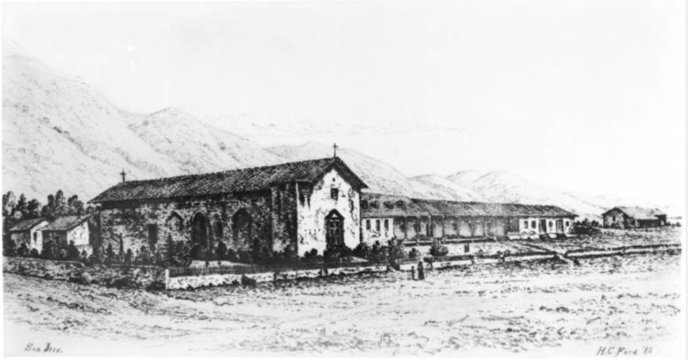
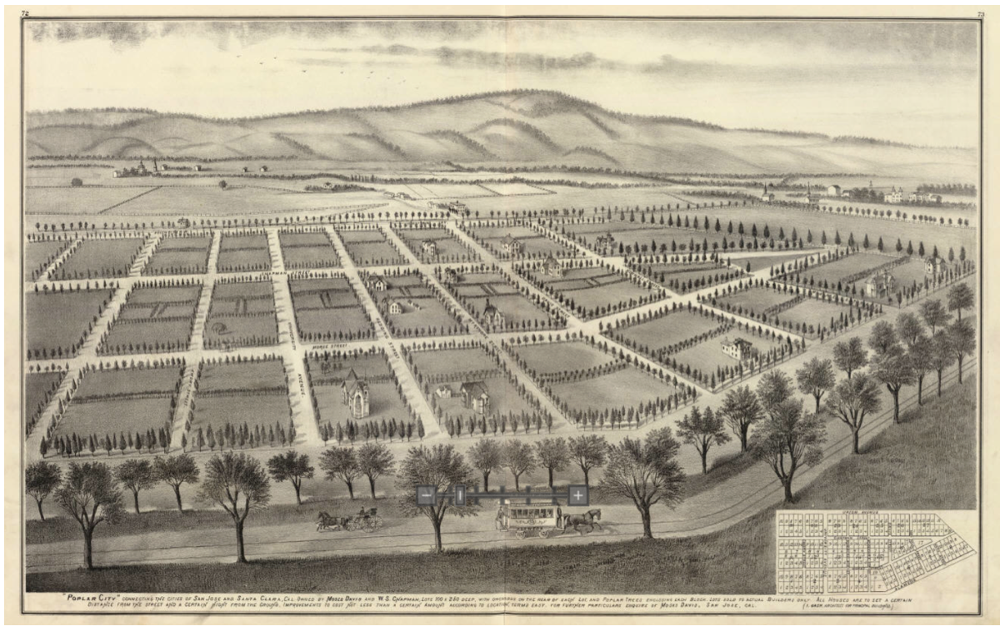
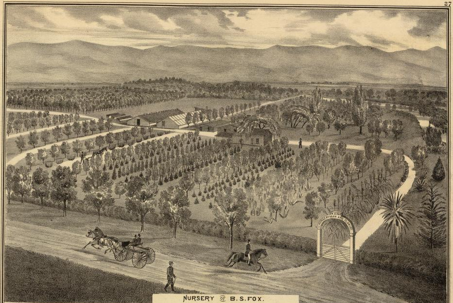
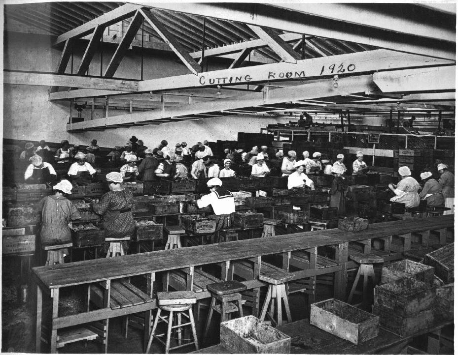
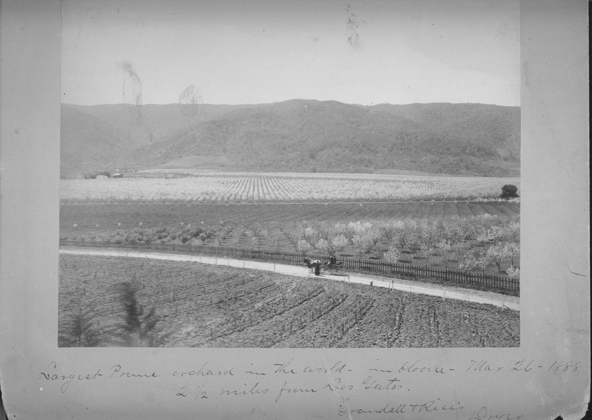
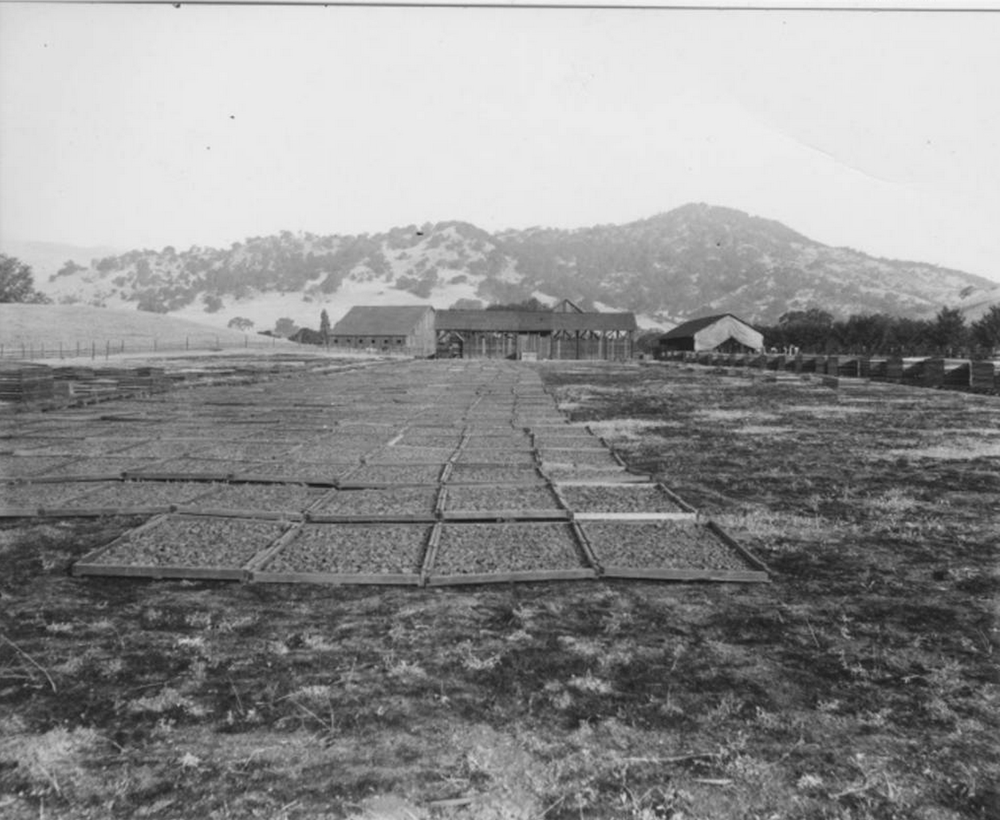
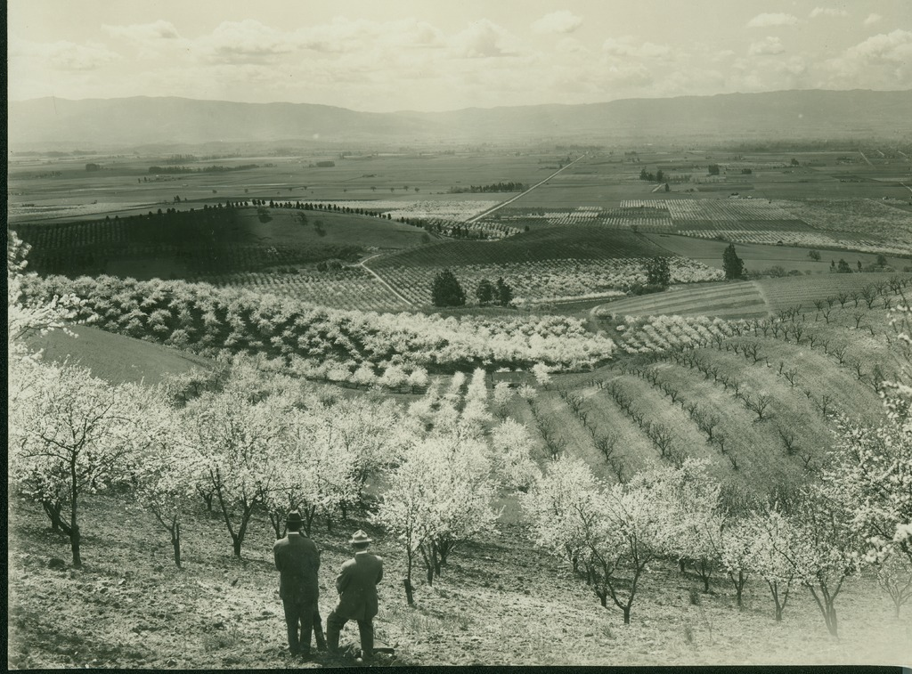

---
author:
- 'Jason A. Heppler'
title: |
    | Chapter 1
    | Nature, History, and the Origins of the Countryside
...

\begin{aquote}{E. S. Harrison, 1888}
The whole valley was densely timbered, but the gigantic oaks had to make way for the plow, to be succeeded by fields of grain, and these were followed quickly by vines and fruit trees.
\end{aquote}

\begin{aquote}{Carrie Stevens Walter,1887}
Glorious oaks! Your days are numbered. The axe of Utility is already at your
base. Pass into the dreamy past of Love and tender Memories, and let your
places be filled by the grape, the prune, the apricot, and other fruits whose
rich juices shall carry to the end of the earth the life, drawn from the
fertilizing mold formed by the countless years of your lavishness of cast off
leaves and twig.
\end{aquote}

\begin{aquote}{C. L. Lawrence, 1927}
A veritable Paradise.
\end{aquote}

The San Francisco Peninsula followed---and in some ways led---the nation's shift in population moving westward. The location of World War II military facilities drew millions to the Far West. But it also followed another wartime trend---the militarization of industry. The twentieth-century American West, according to Kevin Fernlund, "bristled with airfields, army bases, naval yards, marine camps, missile fields, nuclear test sites, proving grounds, bombing ranges, weapons plants, military reservations, training schools, toxic waste dumps, strategic mines, transportation routes, lines of communication, laboratories, command centers, and arsenals." The burgeoning industrial and military landscape in the West demanded a population to support it. California alone accounted for the most dramatic increase in population due to the militarization of its economy.[^43]

Postwar prosperity encouraged widespread growth across the country. By the 1950s many American cities experienced sprawling suburbanization, but what was initially seen as a fulfillment of the American dream of homeownership became viewed as an environmental disaster. Critics took aim at suburban growth and environmental destruction, and nowhere was this change more obvious than in the West. Metropolitan growth doubled the population in the region between 1940 and 1960. By the 1980s, the region was among the fastest growing in the nation.[^44] Many westerners were unsettled by population growth, and raised concerns about the disappearance of rural landscapes being replaced by sprawl.[^45] Western political leaders such as Oregon Governor Thomas McCall condemned what he called "sagebrush suburbs" and sought limits on urban growth in the state. Anti--growth and environmental sentiments lay behind Bay Area residents placing new limits on urban growth and condemning boosters that supported plans for urban expansion.

The Bay Area witnessed some of the most dramatic urban growth. During the 1940s, Santa Clara County experienced 66% growth in population, compared to a California wide growth of 53%. By the 1950s those figures surged upward; the population increased 121% in Santa Clara County compared to 49% statewide. Subdivisions sprang up to accommodate the influx of new residents. Most of these new subdivisions were located beyond existing city boundaries in unincorporated areas. Between 1945 and 1950 county farmland decreased from 727,000 acres to 589,000---a reduction of 81%.[^46] During that same period, Santa Clara County cities engaged in rapid annexations. San Jose annexed land thirty-two times between 1945 and 1950. During the same period, the City of Santa Clara annexed only four tracts, but in 1951 annexed six tracts and another nine in 1952. Santa Clara added 50 acres to the city in two years. In the same two year period, San Jose annexed sixteen parcels that totaled over 1000 acres.[^47] Between 1945 and 1970, San Jose approved over 1,400 annexations and expanded the city's footprint from fifteen square miles to 135 square miles. The city's land area expanded by 900 percent.[^48]

Populations surged simultaneously with industrial development. The combination of defense industries, electronics research and development contracts, Cold War defense agendas, abundant and inexpensive land, and cities willing and able to support the rapid expansion of city infrastructure welcomed the arrival of new industries. Industrial development began in the 1940s when the National Advisory Committee on Aeronautics started construction of the Ames Research Laboratory new Moffett Airfield. Stanford University leased its large land holdings to industrial entrepreneurs and researchers who were active in developing electronics equipment for military purposes. In just five years after the end of World War II, fifty new electronics industries began in the Valley. International Business Machines (IBM) established a card printing plant in 1948 in San Jose, and Russell and Sigurd Varian, inventors of the klystron tube, founded Varian Associates to manufacture devices.[^49] Other industrial developers founded their companies on what would become the Stanford Industrial Park in the late 1950s.

Such Industrial development was widely welcomed and considered a preferred alternative to the dirty industry of the Northeast and Midwest. The so-considered "clean" industries held the appearance of suburban areas with broad lawns, trees, low-rise buildings, and hidden parking lots. Thanks to strict building guidelines laid out by Stanford University as well as city regulations on new construction, new high technology industries appeared more like a college campus than an industrial manufacturer or research center. But the promise of clean industry proved elusive as smog, radiation, water contamination, intense energy and water usage, traffic congestion, and rising housing and utility costs became common features of living in the Valley.

Before the wartime transformations, however, Silicon Valley was known instead as the "Garden of the World." This landscape was constructed out of agriculture and the creation of a "garden
myth."^[On the emergence of the garden myth, see Mark Fiege, *Irrigated Eden:
The Making of an Agricultural Landscape in the American West* (Seattle:
University of Washington Press, 1999); Leo Marx, *The Machine in the Garden:
Technology and the Pastoral Ideal in America* (Oxford: Oxford University Press,
2000), Henry Nash Smith, *Virgin Land: The American West as Symbol and Myth*
(Cambridge: Harvard University Press, 1950).] We can begin to understand how
the Valley was thought of as a desired place influenced by the Valley's
agricultural productivity and climate. The past peculiarities of the Valley's
agriculture history illustrates how nineteenth century Spanish, Mexican, and
Americans came to define land use around climate and productivity. To
understand the tensions between users of the land---should a hillside be
a Presidential Library or preserved in a natural state?---a consideration of
the "garden myth" helps explain later patterns of metropolitan development and
environmental thought in the twentieth century. As the lands became understood
as an agricultural bounty, it also influenced how cities were shaped. The
market towns of Santa Clara Valley adapted to this landscape, seen specifically
through San Jose and its canneries and railroads or Saratoga and Los Gatos and
"agricultural tourism." These places became defined by their "nature." Before
the Valley's change to a place for electronics, federal investments, and
military geography, place was defined by it's natural surroundings, the
definition of which remained contested into the twentieth century.

\thoughtbreak{The story begins with the land}. As the Wisconsin glaciation
period was ending 12,000 years ago, uplift resulting from the collision of the
Pacific and North American tectonic plates started shaping the San Francisco
Bay Area into its present form. The collision forced the coastline northward
along the San Andreas fault and caused additional uplift along the entire
coast, generating the coastal range. The new coastal ranges interrupted the
flow of air coming off the Pacific Ocean. At the northern end of the Bay,
a stubborn marine layer created by regular temperature inversions that trapped
cool, moist air and causing regular fog to drift into the mouth of the Bay. On
the Pacific-facing site of the coastal ranges, the moisture-heavy air allowed
coastal redwoods to flourish, giving the Santa Cruz Mountains a green vale
year-round. Yet the range also produced a rain shadow for the flatlands of the
Valley, where trees became scarcer and native grasses took their place. The
eastern half of the Valley rises again into the dry and khaki-brown Diablo
Range and it's highest point, Mount Hamilton. The coastal ranges protected the
Valley from serious frosts, major storms, and excessive temperatures, giving
the region it's reputation as one of the most temperate environments on the
planet.[^6]

The uplift of the coastal range reshaped the flow of water. As the glacial
period ended a single river flowed across the future Santa Clara Valley,
meeting with the Sacramento River to the east and flowing to the lowest point
along the Coastal Range. Glaciers never reached coastal California and did
little to carve the land into shape, but glaciers influenced the land as they
began to melt. The melting glaciers increased global sea levels, flooding the
majority of ancient valleys and creating the San Francisco Bay. Uplift allowed
new trickles of water to slowly carve paths into the landscape, but the
remained narrow, shallow, and prone to flooding. Most mountain run--off
dissipated quickly into the well--drained alluvial soils and replenished
underground aquifers. Freshwater marshes, seasonally--flooded meadows, forested
wetlands, and riparian habitats were common natural features on the Valley
landscape. Nearly 5,000 years ago, the landscape of the present Bay Area had
largely taken shape.[^7]

Below ground, the Valley was supplied by a regional aquifer consisting of
multiple Pleistocene aquifers grouped into upper and lower systems. These
groundwater systems were replenished primarily through precipitation, stream
channels, and, today, artificial recharge ponds. The presence of rock faults
also served as potential sources and barriers of hydrological flows.
Twenty--six major creeks flowed through the Valley, and the major rivers
included the Arroyo Hondo, Guadalupe River, and Pajaro River, which originated
in the Santa Cruz or Diablo Range and emptied into the Calaveras Reservoir, the
San Francisco Bay, and the Pacific Ocean respectively. A majority of the
thirty--seven lakes now in the Bay Area are artificial reservoirs. Two major
dam projects, the Coyote Dam built in 1936 and the Anderson Dam built in 1950,
regulated watershed discharge into the creeks and rivers. Changes in vegetation
and habitats came about due to changes in stream hydrology that included flood
control efforts and summer water releases from groundwater recharge associated
with the Coyote and Anderson dams.

The interactions of wind, air, and land shaped the layout of the Santa Clara
Valley. Between the Santa Cruz and Diablo mountain ranges, the Valley widens
out from 15 miles across at its northern point near the mouth of the San
Francisco Bay to 25 miles across at its southern end before the Diablo and
Santa Cruz mountains nearly converge to form the Coyote Narrows. Within these
lands, the Valley hosted a variety of lifeforms. Along the Valley floor, oak
scrub, cacti, and a variety of oak, willow, sycamore, and alder trees provided
cover for wildlife and shelters for native grasses. At higher elevations,
a variety of conifers including coastal redwoods (*Sequoia sempervirens*),
ponderosa pine (*pinus ponderosa*), and sugar pine (*pinus lambertiana*)
mingled with white fir (*Abies concolor*) and black oak (*Quercus kelloggii*)
that carpeted the mountains in green. The plants of the Valley adapted to the
Mediterranean climate: perennial bunchgrasses die back every winter, leaving
only roots to help preserve water; oak trees have extensive root systems to tap
into groundwater supplies.[^8] The oak woodlands and chaparral ecoregions
provided habitats for acton woodpeckers, nuthatch, oak titmouse, and Pacific
pallid bats. The major waterways supported a diverse range of native fish
species, including Pacific lamprey (*Lampetra tridentata*), steelhead trout,
chinook salmon, Sacramento blackfish, and tule perch, among many others. Golden
beavers and raccoons shared the landscape with rabbits, squirrels, and other
small species, as well as a variety of snakes, lizards, spiders, and insects.
Mountain lions, wolves, and grizzly bears once hunted and lived in the valley,
mingling with ungulates such as elk and mule deer. Woodpeckers, wrentits, scrub
jays, Chestnut-backed Chickadees, and hundreds of additional bird species
thrived in the Valley's skies.

Human habitation of the Valley originated around 6,000 years ago. The Ohlone
people, Penutian-speakers that included the Miwok, Wintun, Maidu, and Yokuts
who likely migrated to the Santa Clara Valley from the eastern foothills of the
Central Valley, displaced or assimilated Hokan-speaking populations already
living in the area. When Spanish colonists arrived in the Valley in the 1760s,
Ohlone numbered between 7,000 and 26,000. They subsisted on the land by
collecting acorns from oak trees, hunted game, fished, and harvested clams and
other shellfish from the Bay. The discarded shells formed the famous
shellmounds along the Bay's shores.[^9] The Spanish brought disease and
warfare, which overwhelmed Ohlone communities. In the fifty years between the
arrival of Spanish missionaries and the end of Spanish rule in 1821, Native
populations declined by seventy-five percent in the Bay Area.[^10]

When Spanish colonial settlers first crested the Santa Cruz Mountains in the
late-1760s, they saw a Valley hosting a range of ecosystems---coastal redwoods
and Douglas fir dominated the ridge of the mountain, giving way to chaparrel
shrub that occupied the rockier soils in the foothills. As the foothills
smoothed out into the flatlands of the valley, grasslands overtook the
chaparrel and were dotted with oak savannahs, cottonwoods, laurels, and willow
groves. Nearer the bay, salt marshes and vernal pools dominated the land.
Franciscan missionaries gave the Valley the name *Llano de los Robles*
("Plain of the Oaks") as they established missions throughout the
Valley. The eighth mission established by Fray José Murguía was given the name
Mission Santa Clara de Asís ("Clare" or "Clara" means "clear" or "bright"),
giving the valley its current namesake.[^11]

The Spanish also recognized the richness of the Valley soil. The alluvial soils
provided rich nutrients to the expanding agricultural presence in the Valley.
When George Vancouver nosed his ship into the Bay to visit Mission San Jose in
1792, he admired the crops of wheat, maize, peas, and beans, "which had been
obtained with little labour and without manure." The Mission's gardens
contained peaches, apricots, pears, and fig trees. Vancouver noted the soil and
climate seemed "well adapted to most sorts of fruit."[^12] Vancouver overlooked
Ohlone contributions to the land, noting only that they "still remained in the
most abject state of uncivilization."[^13] But Ohlones had transformed the
land---they hunted game, trapped fish and netted waterfowl, harvested
shellfish, planted seeds, lit fires to control brush buildup, and perhaps
collected salt from naturally evaporating ponds for trade.[^14] European
settlers expanded such transformations on the land, establishing large plots of
land for farms and ranches. By the time Vancouver visited the missions, San
José produced enough cattle and crops to fully support the mission as well as
the Spanish presidios in Monterey and San Francisco.

European animals also reshaped the land. A French merchant visiting the Santa
Clara and San José missions in 1828 estimated that twelve thousand cattle and
fifteenth thousand sheep grazed on the foothills. The perennial bunchgrasses
once common on the hillsides of the valley all but disappeared as animals
devoured them  and allowed less-desirable grazing annuals to crowd out native
grasses. New plants transplanted from seeds brought along by the Spanish,
either intentionally or not, also took root in the Valley. The changing grasses
also left the hillsides more susceptible to erosion as long-established root
systems deteriorated. Greater erosion changed the Valley's waterways, allowing
runoff to deposit voluminous mud that destroyed roads and filled river outlets
into the bay.[^15]

Portions of the garden myth trace themselves to the waterscape, but also to the
great expanse of trees that once occupied the flatlands and valley hillsides.
Oak trees once dotted the flatlands of the Santa Clara Valley and were uniquely
adapted to survive both the arid climate and human influences. Fires, set by
Ohlone and by storms, led oaks to adapt to burnings through thicker barks and
an ability to sprout new growth from root systems. Fires also released new
nutrients into the soils, allowing the hardier oak saplings to take advantage
of the lack of competition for fresh nutrients.[^44] The same climate and soils
that proved so nutrient-dense for crops were ideal for trees. The great
collections of redwoods, oaks, and riparian groves that grew along the Santa
Cruz range and along rivers in the flatlands commanded the attention of
timberers who sought to realize fortunes from nature. Spanish missionaries used
abundant wood sources primarily for construction rather than selling timber in
markets. Not until the arrival of Americans in the mid-nineteenth century would
logging become a commodity for sale. Redwood City to the north of Palo Alto,
for example, originated with the establishment of a lumber wharf in the
southwest end of the San Francisco Bay in the 1860s, floating cut timber
northward up the Bay to the shipping ports in San Francisco. Timbermen like
William Page arrived in California from New York around 1860, relocating to
Palo Alto in 1879 after he purchased a lumberyard and timber lands near Mill
Creek. Page's Mill Road---now the scenic route Old Page Mill Road outside Palo
Alto---became a major thoroughfare for moving lumber out of Palo Alto to the
wharfs in Redwood City.[^16]

<!--

MOVE THIS

The cultivation of fruit marked the end of widespread wheat growing.
Santa Clara County ranked fifth in the state for its wheat production in
1870, but within a quarter century fruit became the dominant crop. And
with income per orchard exceeding wheat fields, farmers enthusiastically
adopted specialty fruit crops. The Santa Clara Valley was coined the
"Garden of the World" and San Jose the "Garden City" by boosters, who
gleefully noted the "innumerable homesteads surrounded by orchards and
in which hundreds of happy families repose, literally under their own
vines and fig trees."[^17] Acres of wheat were replaced with acres of
orchards, thousands of trees blossoming each year to produce prunes,
apples, pears, apricots, and cherries.
-->

Water played a central role in the Santa Clara Valley. Water, at times, seemed
too abundant. Heavy rains around 1791 flooded Mission San José, forcing the
missionaries to relocate the settlement. Spanish missionaries would eventually
relocate San Jose three times to get away from an erratically flooding
Guadalupe River. But if water could be too abundant, it could also be fickle.
The critical growing months of summer also left the Guadalupe River devoid of
water. Missionaries, usually with forced labor provided by Ohlone, constructed
dams on the Guadalupe to capture the waters when they flowed, which found its
way into canals and ditches to irrigated wheat fields.[^18] Not until the
arrival of Americans were wells sunk to tap into underground water supplies.

\thoughtbreak{In 1821 Mexico cast off Spanish colonial rule}, leading to the
end of the mercantile system and allowing foreign trade to expand. Mexican
inhabitants of California, known as Californios, adopted cattle as their
central economic activity. Trade in tallow and hides became the core enterprise
of Californios. Following the Mexican-American War, the Santa Clara Valley
became part of America in 1848. American immigrants, primary Irish Catholics,
began arriving in the 1840s and quickly seized Californios property.
Anglo-Americans ignored stipulations in the Treaty of Guadalupe-Hildalgo that
Mexican-held property would remain in their hands. The passage of the
California Land Act on March 3, 1851, placed the burden of proof to property
rights onto Californios who lacked both knowledge about the workings of the
American justice system as well as extensive documentation about their property
holdings. Under the Land Act, Californios land holdings quickly eroded as
Anglo-Americans replaced the Californios economic base with their
own.[^19]

As cattle ranching gave way to wheat farming and, later, orchard production,
Anglo-Americans reshaped the land to serve their needs. When farmers of the
Santa Clara Valley began irrigating their lands, they added a level of
environmental change to a land that had already undergone momentous change at
the hands of humans. The flow of the Valley's waterscape---the rivers, canals,
reservoirs, dams, creeks, and streams that comprised this landscape---would
emerge as a hybrid landscape that both aided and hindered humans. The
ecological transformations of the Valley swung between destruction and
creation. The engineering of a new waterscape meant destruction. The building
of new dams, reservoirs, and canals interrupted the water's flow across the
landscape, which in turn destroyed or drastically altered habitats used by
other flora and fauna.

The water engineers thought little about the destructive aspects of their
projects. Indeed, for many these projects were signs of progress and
improvement---of human's ability to bend nature to their will. The drilling of
numerous wells across the Valley allowed farmers to tap into an unused water
source beneath them. In 1854, when San Jose was still the capital of
California, the first wells were sunk into the earth. Diggers struck water at
fifty-five feet below the surface of the earth, continued digging until they
reached eighty feet, then drilled through an impermeable layer of rock into
a pressurized artesian well.[^20] The Spanish and Ohlone did not know of the
artesian reservoir's existence; the reservoir had collected water for centuries
until it was first pierced by a six-inch diameter well.[^21] Shortly after the
first well was bored, two additional wells were drilled nearby.[^22] Americans
became convinced they had discovered an inexhaustible supply of water. San
Jose booster Frederick Hall could hardly contain his excitement. "As this year
[1854] came rolling in," he wrote,

> the artesian water first came surging up from its hidden depths, to
> play and sparkle in the living light of day. What a change! What a
> wealth for this beautiful valley! Far beyond in value the discovery of
> a dozen gold mines; it appeared to be the work of an enchantment. This
> was the only thing that seemed to be wanting. All had felt that the
> scarcity of water for irrigation, and good for drinking, were the
> great necessaries of this lovely valley.[^23]

The fickleness of the valley's water supply, however, plagued Americans. While
the early wells tapped into the artesian system provided abundant water---at
times too much, as when G. A. Dabney's drilling released so much pressurized
water it flooded the streets of San Jose in six feet of water for several
weeks---by the 1860s the availability of water started wavering.[^24] Severe
floods in 1861 overflowed the Coyote and Guadalupe Rivers and killed thousands
of cattle, yet in the three years after the floods a prolonged drought killed
thousands more. In 1862 Santa Clara County had around 19,000 cattle on the
rangelands; by 1868, that figure had fallen to 10,000. Outbreaks of big jaw and
Texas fever swept through the Valley in the early 1860s, adding to a shifting
preference away from ranching.[^25] The instability of cattle raising initiated
the conversion of rangelands to croplands. The cattle culture introduced by the
Spanish ninety years earlier fell away as ranchers sold their lands to farmers.
Wheat cultivation especially took off in the 1860s. While ranching remained
dominant in 1860, nearly 26,000 acres were converted into farmers by 1857. By
1863, 165,000 acres were under cultivation, and by the end of the decade
farming dominated the valley.[^26]

The severe droughts in the 1860s led farmers to rely heavily on the groundwater
supplies, which had the effect of lowering the groundwater table. Americans
understood groundwater recharge and overdraft, and before long comprehended the
interconnected artesian system belowground. As one well drew water supplies, it
lowered the availability of all the other wells.[^27] Some Americans continued
to live by what historian Michael Friedly called the "illusion of
inexhaustibility," noting one writer in 1876 who gleefully wrote about the
Valley's "supply [of artesian water] is inexhaustible, and would, with the
inauguration of the proper system, be sufficient to irrigate the entire
valley."[^28] Yet the droughts and dwindling artesian supplies led American
capitalists to pursue alternative forms of water supply. In November 1866,
businessmen organized the San Jose Water Company (SJWC) to supply water to its
residents. The towns of San Jose and Santa Clara gave the company
a twenty-five-year lease to pursue water resource development and provide the
towns with reliable water. SJWC first turned to artesian wells, but as
overdraft continued to exhaust the supply they sought out the flowing waters of
the Los Gatos Creek. Flowing from the Santa Cruz Mountains into the Guadalupe
River west of San Jose, SJWC built a network of pipes and a 2.5 million gallon
reservoir to funnel the creek's water to their customers.[^29] The artesian
supply continued to be unreliable. The end of the droughts in the late 1860s
filled the underground reservoirs, but when drought returned in the 1870s the
supply again ran dry.[^30]

Water engineering projects introduced unanticipated problems. By the 1930s,
agricultural wells had become a problem for the Valley. A 1921 engineering
report warned of the falling water table and its possible threat to farming and
cities. Continual overdrafting of the water supply led to subsidence---the
sinking of surface land as the emptied aquifers compressed under the weight of
the earth above them---which led to ruptured well casings, broken water lines,
damage to building foundations, and made well--pumping more expensive for
farmers as wells were sunk deeper to reach lowered water tables. Even worse,
traces of salt from the San Francisco Bay appeared in the aquifers, another
result of sinking land reshaping the underground water system. Salty water was
useless for irrigation and unable to be used for drinking water.[^31] Realizing
that the underground waters were unsustainable, politicians looked to the
examples of the Hetch Hetchy and Owens Valley reservoirs in San Francisco and
Los Angeles, respectively. Herbert C. Jones, an attorney from Stanford and
member of the State Senate elected as a Progressive Republican in 1913, took
steps to remedy the valley's growing water problem. Spending-wary voters twice
rejected bond measures to construct percolation ponds and dam projects to help
trap and funnel waters back into the underground aquifers. In 1929, Jones
introduced a new bill to placate voters by setting up a water district that
lacked the power of provisioning bonds to pay for water projects. The bill
finally met the approval of voters, and the Jones Act helped establish the
Santa Clara Valley Water Conservation District (SCVWCD) in 1930 with the
mandate to help solve the reliability of water. By the end of the
1930s, SCVWCD constructed six new dams.[^32] The Valley's cities also
contracted with existing water infrastructure, including private water
suppliers and the Hetch Hetchy, to supply the growing farms and cities with
enough resources.[^33]

While engineers worked toward solutions to the water supply, farmers sought
ways to adapt their crops to the land and climate. Although the semiarid Valley
provided little rainfall outside the winter months of November through March,
farmers enjoyed a consisted and long growing season. The Valley's mountains
prevented serious frosts, protected the valley from harsh winds, and storms of
any sort were rare. The rich alluval soils provided wheat with plenty of
nutrients. These combined factors of climate and soil allowed farmers to
determine which crops were best suited to the area. While the Spanish tended to
use most of the Valley for ranching, Americans overturned the Spanish ranching
culture by the 1860s and instead adopted dry wheat farming, oats, barley, and
other grains. By the 1870s wheat farming dominated the Valley as farmers
collected nearly 1.2 million bushels of wheat, an 872% increase from twenty
years earlier.[^34]

Just as wheat cultivation reached its peak in the 1870s, fruit cultivation
began to take root. Prune cultivation introduced in 1856 by Louis Pellier was
followed quickly by other fruit varieties well-suited to the climate. By 1888,
historian George Bancroft estimated that California shipped 54 million pounds
of fresh fruit, 39 million pounds of canned fruit, and 20 million pounds of
dried fruit to the East Coast.[^35] By 1915 the Santa Clara Valley alone
produced one-third of the world's prune crop as well as significant amounts of
walnuts and apricots. Just before the outbreak of World War II, California
supplied over half of the world's dried prunes.[^36]

Over time, the emergence of the canning industry would alter the agricultural
landscape further. In 1871, Dr. James Dawson started canning his surplus
peaches and pears, starting what would become a massive cannery industry that
dominated the Valley's economy until World War II.[^37] By 1872 San Jose
boasted two large canneries.[^38] Along with advancements in transportation
methods including the completion of the transcontinental railroad in 1869 and
the introduction of refrigerated rail cars in 1888, fruit and vegetable
production became economically profitable and allowed trade to expand. On the
verge of the Great Depression, thirty-eight canneries operated in Santa Clara
County. The California canneries of Del Monte, the California Packing
Corporation (Calpak), Hunt's, Richmond-Case, Bayside Canning Company, Precita
Canning Company, and the Garden City Canning Company all operated in Santa
Clara County by the 1920s. By the middle of the twentieth century, California
produced more canned fruits and vegetables than any other state.[^39]

<!--

-->

New systems of food preparation, shipping, distribution, and financing aided
the transition to fruit production. The completion of a railroad between San
Francisco and San Jose in 1864 allowed farms to ship goods out of the
agricultural towns of the Valley to the ports in San Francisco. The new Oceanic
Steamship Company began importing raw sugar and other products from Hawaii,
aiding further the shift to fruit canning. Claus Spreckle's huge sugar refinery
built along 23rd Street in San Francisco helped refine the Hawaiian sugar into
a cannery product. Fruit growers also benefited from the invention of an
orchard spray pump, created by John Bean of Los Gatos. The invention allowed
fruit growers to combat pests and insects more easily. Bean's success allowed
him to found the Food Machinery and Chemical Corporation in San Jose in 1883.[^40]

In addition to copious amounts of water and its attendant problems noted above,
the orchards generated tremendous levels of waste. Much of the waste came in
the form of cannery effluence. To aid the canneries in their production, San
Jose especially became a willing partner. Beginning in the 1870s the small farm
town began construction of a storm and sewage system that would funnel wastes
away from the city. Much of the waste found itself dumped into the San
Francisco Bay. While the system seemed to effectively deal with the problem of
waste in the city, it had the effect of upsetting the Bay's ecosystems. The
dumping of the city's waste into the Bay all but destroyed the clam and shrimp
industries as the contamination of water caused steadily-increasing dieoffs
that made the raising and harvesting of molluscan fisheries unprofitable.[^67]

The orchards also clouded the skies with soot. Orchardists employed the use of
smudgepots---a device comprised of a basin that held kerosene and
a chimney-like pipe emerging roughly five feet high---to warm orchard fields
and prevent frosts from damaging fruits. Usually lit and burned through the
duration of the night, the smudgepots cast smoke and oily soot into the air.
Californians recalled waking up after cool nights to find themselves covered in
an oily film from the kerosene burners, and children were loathe to arrive at
school with "smudge face."[^69]

Cattle ranching, wheat and grain production, and quicksilver mining flourished
in the Valley in the late nineteenth century prior to the Valley becoming "one
vast orchard."[^50] By the end of the nineteenth century, fruit production had
surpassed all other agricultural, mining, and timbering activity. The growth of
Silicon Valley occurred upon some of California's most fertile lands. A survey
by the U.S. Department of Agriculture designated 400 square kilometers---32
percent---of Santa Clara County as Class 1 land, the highest ranking possible
for the cultivation of fruits and vegetables. Water systems flowing into the
valley carved out rich alluvial fans in the Valley. Santa Clara Valley farms
remained relatively small. In 1900, the typical farm was under fifty acres; in
1920, the average farm size was forty acres and dropped to thirty-two acres by
1950.[^52] Agricultural activity by the 1940s witnessed around 6,000 farms in
the Valley, mostly family--run operations that totaled around 132,000 acres and
some eight million cherry, apricot, and pear trees.[^53] By the end of the
nineteenth century, as the region became a prominent agricultural producer,
*Sunset* magazine writers labeled it "The Valley of Heart's Delight" and "The
Delectable Valley" due to its reputation as a major fruit producer. The
production of prunes, walnuts, and apricots.[^54] As late as the 1950s, canneries
processed more than thirty percent of the state's crop of fruit and vegetables.
Although the valley itself only produced a small portion of the crop, the
facilities for canning, drying, and freezing were located near rail, highway,
and water routes in the South Bay.[^55] The Valley had become a major agricultural center, and with it came the "garden myths."

\thoughtbreak{The agrarian culture that had come to dominate} the Valley was
exalted not only for its remarkable productivity but also for its aesthetics
and promise of the "good life." When John Muir passed through the Valley in the
spring of 1872, he remarked that the Santa Clara Valley's climate was "the best
we ever enjoyed."[^56] The French writer Amaury Mars agreed. When he visited
the Santa Clara Valley in 1901, he gushed that "no spot in the world has
Nature been more lavish of her gifts. The heat is never oppressive nor the cold
severe; there is never too much moisture, while thunder storms and, above all,
cyclones are altogether unknown here."[^57] The valley's landscape offered
a compelling tale: a veritable garden; indeed, the Garden of the World. The
story was uncomplicated, and in its simplicity it masked historical realities
of the landscape.

"What a sight it was to behold all those old oaks and majestic sycamores,"
wrote Amaury Mars during his visit to Santa Clara Valley in 1901.[^45] The oaks
were a source of attraction for the rural lifestyle painted by the region's
boosters. "The valley is a park," claimed the San Jose Chamber of Commerce in
1910, "originally dotted with magnificent oaks." Left unsaid by the twentieth
century was the near-elimination of oaks from the valley floor.[^46] The shift
from ranching to farming also led to widespread clearcutting of trees. Eager to
clear the land for maximum availability of cultivation, farmers cut down oak
woodlands and willow groves, filled vernal pools, and reclaimed salt marshes to
expand the amount of land available for farming. The cutting of trees also
formed a core business for timber interests. Returning Gold Rush seekers often
went into the lumber business rather than farming. By 1857 twelve sawmills were
active in Santa Clara Valley. Groves and woodlands were quickly cleared and
transformed into land for cultivation.[^47] When aspiring homesteader Bernard
Reid moved to Santa Clara in 1851, he noted that most wood for fuel was hauled
in from three miles away. No nearby lumber existed for the town.[^48] As oak
woodlands disappeared from the Valley floor, timbermen went into the hills for
the redwoods. By the 1880s, much of the accessible forests in the Santa Cruz
Mountains were logged.[^49]

Key to Santa Clara Valley resident's understanding of themselves was the
"nature" they had inherited. Above all, the orchards symbolized the Valley as
a paradise on earth. Journalist Bayard Taylor, arriving in California in 1849,
reported on "the vast and wonderful landscape" of the Santa Clara Valley. He
wrote of

> the soft cloudless sky---the balmy atmosphere---the mountain ranges on either
> hand, stretching far before me until they vanished in a purple haze---the
> silica sweep of the plain, with its islands and shores of dark-greek oak, and
> the picturesque variety of animal life on all sides, combined to form
> a landscape which I may have seen equaled but never surpassed.[^58]

\noindent Gold rush seeker Bernard Reid wrote in a letter to his family that
the Valley "was far preferable to any spot I had before seen in California,"
describing the Valley as "this Italy and garden spot of All-America---of
singing birds, and the grassy sward, and balmy air, and the sunny sky."[^59]
Visitors to the Valley celebrated the expanse of trees, wild flowers, animals,
and rural pastoralism of the Valley.[^60]

Such thinking found its way into promotional material as well. The San Jose
Board of Trade asked rhetorically in 1895, "What will not thrive in the utmost
prodigality? . . . Come let us show you hundreds of acres in constant
bearing."[^61] The San Jose Chamber of Commerce boasted that the valley had the
"largest fruit canneries in the world; largest fruit packing houses in the
world; largest fruit drying ground in the world." The Chamber beckoned farmers
from the Midwest and Northeast, where climate and frosts could threaten their
crops. Not so in Santa Clara Valley, where sunshine outnumbered cloudy
skies. Chamber advertisements claimed 245 clear days and only a handful of
rainy or cloudy days.[^62] The climate made for perfect farming conditions.
"Without any days so cold as the colder days of an Illinois April, it has no
days so warm as the warmer days of an Illinois June," the Chamber assured
readers in 1910.[^63] The Valley presented farmers with a seemingly assured
profit and almost no risk thanks to the climate in which they could grow their
produce.

The orchard landscape introduced new myths to the Valley. As historian Cecelia
Tsu notes, by the 1880s California boosters promoted "orchard fruit growing as
one of the most idyllic incarnations of the family farm ideal, and the Santa
Clara Valley as the finest location to live out this agrarian dream."[^41] The
San Jose Chamber of Commerce boasted in 1910 that the "Santa Clara Valley is
literally the most fruitful valley in the world," growing "the *very best*"
fruits, and took pride in "our magnificent roads, the best of country highways,
our fine fruits, our possibilities in home making, our universities, schools,
churches, transportation facilities, our 'best ever' climate" in transforming
the Valley into a successful agricultural center.[^42] As acreage devoted to
fruit cultivation grew, so did the myths.[^43]

Promotional material also placed the productivity of the land against an
idealized narrative of a Spanish and Mexican past. American promotional
literature avoided distinctions among peoples and cultures, casting the
Spanish, Mexican, and Indian history of the Valley together as a "mission era"
where land went underutilized until Anglo-Americans improved the land. Spanish
and Mexicans were cast as "content to eat, sleep, ride horseback and roll
cigarettes" while the land went unused, against the hard-working Anglo-American
farmers raising orchards and who improved the land for maximum
productivity.[^64] Orchards replaced adobe as a defining feature of the Valley.
While the Spanish names remained on the Valley's landscape like the city names
"Santa Clara," "Palo Alto," and "San Jose," Anglo-American promoters had recast
the landscape in their view. Promoters anticipated that newcomers would be
unfamiliar with the pronunciation of Spanish names and instructed
Anglo-Americans on pronunciation to clarify that "San Jose" was pronounced "San
Hosay."[^66] When botanist William Brewer passed through the Valley in 1861 he
remarked that Americans were already showing signs of progress. The Valley, he
noted, was "all . . . enclosed, in farms, and under good cultivation.
Farmhouses, orchards, etc., give it an *American* look . . . [The valley] is
perhaps twelve or fourteen miles wide at San Jose, an almost perfect plain,
very fertile, a perfect garden, and much of it in higher cultivation than any
other part of California."[^65]

What historian Mark Fiege concluded for nineteenth-century Idaho---that
Americans crafted a story of "pioneers [who] conquered the howling wilderness
and transformed it into beautiful, productive fields and farms"---could be
equally applied to the Santa Clara Valley.[^70] The story was a powerful one in
American culture. The land was one of Eden, and the garden myth that emerged in
the nineteenth century would maintain a powerful grip on the human imposition
of ideas onto nature. Americans viewed the valley through the lens of
capitalizing on the "prodigal gifts of nature," picturing straight plots of
reclaimed land held by private-property owning farmers who toiled to raise the
best fruit in the world. By the end of the nineteenth century, fruit stood at
the core of life in the Santa Clara Valley and in many ways came to define the
market towns. The horticulture economy was not simply an accident of topography
but came from culture as well. Promoters of the Valley crafted a narrative of
a land laid fallow under the hands of Indians and Spanish transformed into
a garden by Americans. Emphasizing conquest, both over people and over nature,
the narrative crafted a vision of the Valley put to better use by the ingenuity
and industry of Americans. City and nature were culturally intertwined.

Over time, city leaders valued the orchards, recognizing their importance in
crafting an image of the Valley that would draw people to the towns.
Irrigation, roads, sewers, railroads, cheap land, and consistently-productive
farms became hallmarks of promotional literature all revolving around the
orchard trees. The orchard trees were admired but also celebrated for the
significant income it provided communities. [^71] Americans admired their
handiwork on the land. In 1894 San Jose held its first agricultural festival at
Agricultural Park that featured appearances by Arizona Charlie's troupe, Doc
Goodwin's horse riders, fireworks, and dancing, to celebrate the agricultural
bounty of the Valley. By the early 1900s Saratoga advertised "blossom week"
hosted by the Santa Clara County Improvement Club where visitors flocked to the
valley to view orchards in full bloom. Such pilgrimages to nature continued
well into the late 1950s, when residents and visitors could take part of
"Blossom Tours" that allowed them to view fruit trees in full bloom at various
times of the year.[^72]

The exceptional growing climate, fertile soil, and plentiful water from
artesian wells allowed farmers to transform the landscape into its reputation
as a fruit capital. By the 1920s, Santa Clara Valley led the state in fruit
production, drying, canning, and packing, providing a range of products such as
cherries, prunes, apricots, pears, peaches, plums, and apples. By 1930, Santa
Clara County produced between one-third to one-half of the world's prune
supply.[^73] The cultivation and processing of apricots, prunes, pears, and
cherries became staples on the horticulture landscape.[^74] Fruit trees
produced a canopy of pink and white blossoms along with orange California
poppies and other native wildflowers that bloomed on the hillsides. The
blooming seasons were popular early in the twentieth century as visitors
flocked to the area to behold the orchards in full bloom, along with
farmhouses, berry patches, vegetable gardens, and pastures.[^75] Little wonder
why Santa Clara Valley boosters advertised the area as "nearest Paradise"
and "the best spot in the whole earth," a place where "the Eden of vine and
tree" was a "God-favored spot" and "God's favorite valley."[^76]

\thoughtbreak{The pre-World War II spatial practices that configured} Santa
Clara Valley were products of the agricultural economy. By the twentieth
century, the Santa Clara Valley landscape became more than just the earth.
Collections of laws, institutions, attitudes, infrastructure, and policies were
tied to the natural world of water, soil, plants, and animals. City promoters
in the nineteenth century crafted an identity of the Valley around its climate,
environmental amenities, and productivity, in the process embedding cultural
values into perceptions of the valley while farmers simultaneously grew
prodigious orchards. But the Valley had become an overburdened landscape
through the demands placed on its environment. Aquifers ran dry, forests were
clear-cut, natural flora crowded out, and lacked state and national parks until
the mid-twentieth century. As industrialization and urbanization took off in
the twentieth century, the county became a groundswell for environmentalism.
The nineteenth century activities had great consequences on the region's people and
environment, and each landscape greatly overlapped one another leading
to strenuous debates about how each landscape affected the others.

The Valley distinguished itself in the nineteenth and early twentieth centuries
as a space for agricultural productivity. The monumental shifts in the Valley
economy came with two wars in Europe and Asia, transforming the industrial
activity of Santa Clara Valley towards high technology well before the moniker
Silicon Valley became a household term. The path between agriculture and high
technology may not seem straightforward, but the Valley's history as an
agricultural center helped shape its twentieth century. The choice of water
projects and planning, built originally for the purpose of supporting
agriculture, would come to serve the metropolitan growth after World War II. The road systems, availability of land, sewer systems, a major research university all became attractive features to new industry and federal military investment during and after World War II.

The orchards themselves would come to shape suburban sprawl. The image of
a home in the countryside drew newcomers and oldtimers of Santa Clara Valley
alike further and further away from downtowns in order to participate in
recreation and suburban domesticity. Throughout the San Francisco Peninsula,
families moved into unincorporated land to be near nature. As downtowns
declined, the suburbs rapidly expanded as federal tax policies and incentives
encouraged businesses, malls, and subdivisions to locate new construction
outside city cores. Industrial recruitment likewise used the countryside
lifestyle to attract new industries. "Their scientists liked living there
. . . attracted, in part, by the region's 'good life'," Richard Rowe wrote in
his study of open space and agriculture in Santa Clara County. But Rowe worried
about amenities disappearing in the twentieth century. "Today's open space
appears headed for tomorrow's subdivision. With the loss of these open spaces
the county will lose much of its charm."[^77]

The orchards found expression on the landscape of the Valley's infrastructure.
Mid-twentieth century promoters did not forget the agricultural heritage of the
Valley, giving or maintaining street names such as "Blossom Hill," "Cherry,"
"Apricot," "Hillsdale," "Willow Glen," and "Cherrydale" that expressed
a landscape culturally tied to agriculture. Homebuilders promoted their
subdivisions as "country-side living" next to orchards. The agricultural past
became a tool for the marketability of homes. Land as a productive source
became valued differently, not as space that was agriculturally productive but
as space fit for suburban homes in the garden. The Garden of the World
remained, but became cast as the suburban dream.

While these events would come later in the postwar period, the infrastructure
and culture of agriculture---roads, sewers, the countryside---supported and
encouraged urbanization. The economic and political demands of the nineteenth
century allowed these spaces to take shape and contributed profoundly to the
process of Silicon Valley's postwar urbanization. The Santa Clara County
underwent a definition of a particular kind of place that revolved around its
relationship to the environment. The cultural and structural creation of this
Eden by nineteenth century boosters and twentieth century promoters detailed
a landscape put to the service of agricultural production, but its agricultural
identity was cast as the suburban ideal in the mid-twentieth century. The
agricultural past allowed cities like Santa Clara to boast of "THE GOOD LIFE"
owing itself to the "blooming orchard trees," "relaxed outdoor living," and the
"heritage and legacy of the early Franciscan padres."[^78] The same culture of
orchards-as-nature is what led Wallace Stegner to conclude that the "original
sin came with the Spaniards" before Americans planted their pear, peach,
cherry, prune, and apricot trees, the "forerunners of the golden age."[^79] In the process of redefining the land's past, the modern Santa Clara Valley took shape.

[^1]: Edward Sanford Harrison, *Gilroy: The Most Favored Section of
    Santa Clara Valley* (Gilroy: Gilroy Board of Trade, 1888).

[^2]: E.S. Harrison and Carrie Stevens Walter, *Central California,
    Santa Clara County: Homes for a Million* (San Jose: McNeil Brothers,
    1887), 119--210.

[^3]: C. L. Lawrence, *Poems Along the Way*. (San Jose: Tucker Printing
    Company, 1927).

[^4]: "Reagan Library Site Choice Stirs Opposition in Palo Alto," *New
    York Times*, December 24, 1986; "Reagan Library Site in Palo Alto
    Comes Under Fire," *Los Angeles Times*, November 29, 1986.

[^5]: Richard White, "Trashing the Trails," in *Trails Toward a New
    Western History*, Patricia Nelson Limerick, Clyde A. Milner II and
    Charles Rankin, eds. (Lawrence: University Press of Kansas, 1991),
    37.

[^6]: Amaury Mars, *Reminiscences of Santa Clara Valley and San José* (San Francisco: Artistic Publishing Company, 1901), 76.

[^7]: Michael Friedly, "'This Brief Eden': A History of Landscape Change in California's Santa Clara Valley," (Ph.D. diss., Duke University, 2000), 18.

[^8]: Friedly, "'This Brief Eden'," 20.

[^9]: For a map of the shellmound locations, see Matthew Booker and
    Allen Roberts, *Shellmounds in San Francisco Bay Area, 1909*,
    Spatial History Project, Stanford University,
    <https://web.stanford.edu/group/spatialhistory/cgi-bin/site/viz.php?id=23>.

[^10]: Matthew Booker, *Down by the Bay: San Francisco's History between the Tides* (Berkeley: University of California Press, 2012), 22--26; Randall Milliken, *A Time of Little Choice: The Disintegration of Tribal Culture in the San Francisco Bay Area, 1769--1810* (Menlo Park, CA: Ballena Press, 1995);
James J. Rawls, *Indians of California: The Changing Image* (Norman: University of Oklahoma Press, 1986), 13--21; Albert L. Hurtado, *Indian Survival on the California Frontier* (New Haven: Yale University Press, 1990).

[^11]: Pedro Font, *Font's Comlete Diary: A Chronicle of the Founding of
    San Francisco* (Berkeley: University of California Press, 1933),
    323--324.

[^12]: George Vancouver quoted in Mel Scott, *The San Francisco Bay Area: A Metropolis in Perspective* (Berkeley: University of California Press, 1959), 12.

[^13]: Vancouver quoted in Booker, *Down by the Bay*, 20.

[^14]: Booker, *Down by the Bay*, 21.

[^15]: Booker, *Down by the Bay*, 24--26; Richard Walker, *The Country in the City: The Greening of the San Francisco Bay Area* (Seattle: University of Washington Press, 2007), 26--28;
    Milliken, *Time of Little Choice*, 72--74, 98--99, 148, 221;
    Daniel J. Pitti, *The Devil in Silicon Valley: Northern California, Race, and Mexican Americans* (Princeton: Princeton University Press, 2004), 20--23. Californios especially after independence
    from Spain in 1821 increased their reliance on the cattle industry,
    expanding their presence to meet a demand for hide and tallow.
    Cecilia M. Tsu, *Garden of the World: Asian Immigrants and the Making of Agriculture in California's Santa Clara Valley* (New York: Oxford University Press, 2013), 18.

[^16]: Ralph Hansen, "Historical Notes of Interest Surrounding Page Mill
    Road and Environs," 1, n.d., Folder 9, Box 1, Page Mill
    Co-ordinating Committee Records, Stanford University.

[^17]: Tsu, *Garden of the World*, 20.

[^18]: Clyde Arbuckle, *Clyde Arbuckle’s History of San Jose: Chronicling San Jose’s Founding as California’s Earliest Pueblo in 1777, Through Exciting and Tumultuous History Which Paved the Way for Today’s Metropolitan San Jose* (San Jose: Smith & McKay, 1985), 11; Friedly, "'This Brief Eden'," 112; Mars, *Reminiscences of Santa Clara Valley*, 25.

[^19]: Tsu, *Garden of the World*, 18; Friedly, "'This Brief Eden'," 274--278; Douglas Monroy,
    *Thrown Among Strangers: Making of Mexican Culture Frontier*
    (Berkeley: University of California Press, 1993), 233--251;
    Pitti, *Devil in Silicon Valley*, 52--77.

[^20]: Frederic Hall, *The History of San José and Surroundings with Biographical Sketches of Early Settlers* (San Francisco: A. L. Bancroft and Company, 1871), 263.

[^21]: Friedly, "'This Brief Eden'," 329.

[^22]: Hall, *The History of San José*, 263--264.

[^23]: Hall, *The History of San José*, 262--263. Almost a decade later, the
    City of San Jose credited the artesian wells for "solving" the
    area's water problems, noting the tapping of the San Fernando Street
    well that produced so much water that "a stream 4 feet wide by six
    inches deep [flowed] for six weeks despite all efforts to cap it."
    San Jose Planning Commission, *Master Plan of the City* (San Jose:
    City of San Jose, 1958), 10.

[^24]: Hall, *The History of San José*, 264.

[^25]: Friedly, "'This Brief Eden'," 301--302.

[^26]: Friedly, "'This Brief Eden'," 302, 306--307; Henry Foote, *Pen Pictures from the Garden of the World* (Chicago: Lewis Publishing Company, 1888), 23; Hall, *The History of San José*, 444--445.

[^27]: Friedly, "'This Brief Eden'," 333--335.

[^28]: Quoted in Friedly, "'This Brief Eden'," 338.

[^29]: Hall, *The History of San José*, 305--307.

[^30]: Friedly, "'This Brief Eden'," 336--337.

[^31]: Scott, *The San Francisco Bay Area*, 230; William L. Berry and Herbert A. Howlett, "Supplemental Water for the San Francisco Area," *American Water Works Association* 50:5 (May 1958): 279.

[^32]: Glenna Matthews, *Silicon Valley, Women, and the California Dream: Gender, Class, and Opportunity in the Twentieth Century* (Stanford: Stanford University Press, 2003), 103--104.

[^33]: As of 1996, 42% of the Valley's water comes from local
    reservoirs, 23% comes from the Central Valley Project, 19% comes
    from the State Water Project, and 16% is purchased from the Hetch
    Hetchy aqueduct. Matthews, *Silicon Valley, Women, and the California Dream*, 104.

[^34]: Friedly, "'This Brief Eden'," 302.

[^35]: Bancroft, *History of California*, VII, 743; Mel Scott, *The San Francisco Bay Area: A Metropolis in Perspective* (Berkeley: University of California Press, 1959), 71.

[^36]: Robert C. Fellmeth, *Politics of Land: Ralph Nader's Study Group Report on Land use in California* (Grossman Publishers, 1973), 32--33; Edward N. Torbert, "The Specialized Commercial Agriculture of the Northern Santa Clara Valley," *Geographical Review* 26:2 (April 1936): 248;
    Richard Rowe, "Agricultural Land and Open Space in Santa Clara County and Its Preservation" (M.A. thesis, Stanford University, 1962), 23, 42.

[^37]: Rowe, "Agricultural Land and Open Space," 249.

[^38]: Mel Scott, *The San Francisco Bay Area: A Metropolis in Perspective* (Berkeley: University of California Press, 1959), 68.

[^39]: Tsu, *Garden of the World*, 76--77; Matthews, *Silicon Valley, Women, and the California Dream*, 34--37;
    Vicki Ruíz, *Cannery Women, Cannery Lives: Mexican Women, Unionization, and the California Food Processing Industry, 1930--1950* (Albuquerque: University of New Mexico Press, 1987), 21--23.

[^40]: Mel Scott, *The San Francisco Bay Area: A Metropolis in Perspective* (Berkeley: University of California Press, 1959), 73.

[^41]: [@tsu2013garden, 5].

[^42]: San Jose Chamber of Commerce, *San José, Santa Clara County, California* (San Jose: San Jose Chamber of Commerce, 1910), 16, 28.

[^43]: The *San Francisco Chronicle* estimated that nearly 40,000 acres
    of the Santa Clara Valley were devoted to the fruit industry in 1895. "Santa Clara Valley: A Favored Section," *San Francisco Chronicle*, July
    29, 1895.

[^44]: [@friedly2000eden, 58].

[^45]: Mars, *Reminiscences of Santa Clara Valley*, 58.

[^46]: Today, the valley oak (*Quercus lobata*) is among California's
    most threatened oak species, largely because they grew on lands
    desired for suburbanization and agricultural development. See
    Robin M. Grossinger, Charles J. Striplen, Ruth A. Askevold, Elise Brewster, and Erin E. Beller, "Historical Landscape Ecology of an Urbanized California Valley: Wetlands and Woodlands in the Santa Clara Valley" *Landscape Ecology* 22 (2007): 3.

[^47]: Foote, *Pen Pictures from the Garden of the World*, 21.

[^48]: Mary McDougall Gordon, "'This Italy and Garden Spot of All-America': A Forty-Niner's Letters from the Santa Clara Valley in 1851," *Pacific Historian* 39:1 (1985): 12.

[^49]: [@friedly2000eden, 317].

[^50]: San Jose Chamber of Commerce, *San José, Santa Clara County,
    California* (San Jose: San Jose Chamber of Commerce, 1910), 4; Tsu,
    *Garden of the World*, 17.

[^51]: Aaron Sachs, "Virtual Ecology: A Brief Environmental History of Silicon Valley," *World Watch* (January/February 1998), 15.

[^52]: Tsu, *Garden of the World*, 6.

[^53]: Sachs, "Virtual Ecology," 16.

[^54]: G. von Vieregg, "Santa Clara: The Delectable Valley," *Sunset*,
    August 1912; E. Alexander Powell, "The Valley of Heart's Delight,"
    *Sunset*, August 1912.

[^55]: Paul Griffin and Ronald Chatham, "An Industrial Analysis of North
    Santa Clara County," County of Santa Clara Planning Department, 3.

[^56]: John Muir, *John Muir: His Life and Letters and Other Writings*,
    ed. Terry Gifford (Seattle: Mountaineers, 1996), 96.

[^57]: Mars, *Reminiscences of Santa Clara Valley*, 76.

[^58]: Quoted Gordon, "'This Italy and Garden Spot of All-America'," 5.

[^59]: Quoted in Gordon, "'This Italy and Garden Spot of All-America'," 9, 13.

[^60]: Mars, *Reminiscences of Santa Clara Valley*, 18, 26.

[^61]: San Jose Bord of Trade, "San Jose and Vicinity," 1897, Santa
    Clara Valley's Agricultural Past, California Room, San Jose Public
    Library.

[^62]: San Jose Chamber of Commerce, *San José, Santa Clara County, California* (San Jose: San Jose Chamber of Commerce, 1910), 14.

[^63]: San Jose Chamber of Commerce, *San José, Santa Clara County, California* (San Jose: San Jose Chamber of Commerce, 1910), 14.

[^64]: *Santa Clara County and Its Resources: A Souvenir of the San Jose
    Mercury* (San Jose: San Jose Mercury Publishing and Printing
    Company, 1896), 12, quoted in Tsu, *Garden of the World*, 19.

[^65]: William Brewer, *Up and Down California in 1860--1864: The
    Journal of William H. Brewer* (New Haven: Yale University Press,
    1930), 173, quoted in Friedly, "'This Brief Eden'," 306. Italics in original.

[^66]: San Jose Chamber of Commerce, "San Jose (San Hosay): Santa Clara
    County, California" (San Jose Chamber of Commerce, 1910); Hall,
    *History of San Jose*, 8. See also Tsu, *Garden of the World*, 21;
    Aaron Cavin, "The Borders of Citizenship: The Politics of Race and Metropolitan Space in Silicon Valley" (Ph.D. diss., University of Michigan, 2012), 226.

[^67]: Stanford Environmental Law Society, *San Jose: Sprawling City: A Report on Land Use Policies and Practices in San Jose, California* (Stanford: Board of Trustees of the Leland Stanford Junior University, 1971), 13; John E. Skinner, *An Historical
    Review of the Fish and Wildlife Resources of the San Francisco Bay
    Area*, California Department of Fish and Game, (June 1962), 100;
    Dreisbach, *Handbook of the San Francisco Region*, 155; Charles
    Gilman Hyde and George Leonard Sullivan, *Santa Clara County Sewage
    Disposal Survey: Report upon the Collection, Treatment and Disposal
    of Sewage and Industrial Wastes of Santa Clara County* (Ann Arbor:
    Edward Brothers, 1946), 101--102.

[^68]: With his pest control plant and several small canneries, Bean
    founded the Food Machinery and Chemical Corporation in San Jose in
    1880.

[^69]: Jared Farmer, *Trees in Paradise: A California History* (New York: W. W. Norton & Company, 2013), 294--296; Robin Chapman, *California Apricots: The Lost Orchards of the Silicon Valley* (Charleston, S.C.: American Palate, 2013), 90--91. Smudgepots were more commonly used in other parts
    of California, especially in Southern California which experienced
    two kinds of cold snaps, either through atmospheric inversion or
    from Arctic air sweeping down through the Great Basin across the
    Mojave Desert and into California. Nevertheless, smudgepots were
    still occasionally used in the Valley. See Farmer, *Trees in
    Paradise*, 291--292.

[^70]: Mark Fiege, *Irrigated Eden: The Making of an Agricultural Landscape in the American West* (Seattle: University of Washington Press, 1999.), 171.

[^71]: Matthews, *Silicon Valley, Women, and the California Dream*, 37.

[^72]: "San Jose's Fiesta," *San Francisco Chronicle*, May 22, 1894;
    "Blossom Festival in Santa Clara Valley," *San Francisco Chroncile*,
    March 22, 1902; "Santa Clara's Blossom Festival," *San Francisco
    Chronicle*, April 6, 1903.

[^73]: Matthews, *Silicon Valley, Women, and the California Dream*, 18; Tsu,
    *Garden of the World*, 17.

[^74]: Edward N. Torbert, "The Specialized Commercial Agriculture of the
    Northern Santa Clara Valley," *Geographical Review* 26 (April 1936):
    247--263.

[^75]: Edith Brockway, *San Jose Reflections: An Illustrated History of
    San Jose, California and Some of Surrounding Area* (Campbell,
    Calif.: Academy Press, 1977), 132--133.

[^76]: Quotes from Tsu, *Garden of the World*, 3--4; H. S. Foote and C. A. Woolfolk, *Picturesque San
    Jose and Environments: An Illustrated Statement of the Progress,
    Prosperity, and Resources of Santa Clara County, California* (San
    Jose: H. S. Foote and C. A. Woolfolk, 1893), n.p.; *The Progressive
    City Beautiful: Santa Clara* (Santa Clara Chamber of Commerce,
    n.d.); E. Alexander Powell, "The Valley of Heart's Delight,"
    *Sunset* 29 (August 1912), 120.

[^77]: Rowe, "Agricultural Land and Open Space," 45.

[^78]: Santa Clara Chamber of Commerce, "Industrial Introduction to the
    City of Santa Clara," 1964, Santa Clara City Library.

[^79]: Yvonne Jacobson, *Passing Farms, Enduring Values: California’s Santa Clara Valley* (Los Altos, Calif.: W. Kaufmann, 1984.), x.

