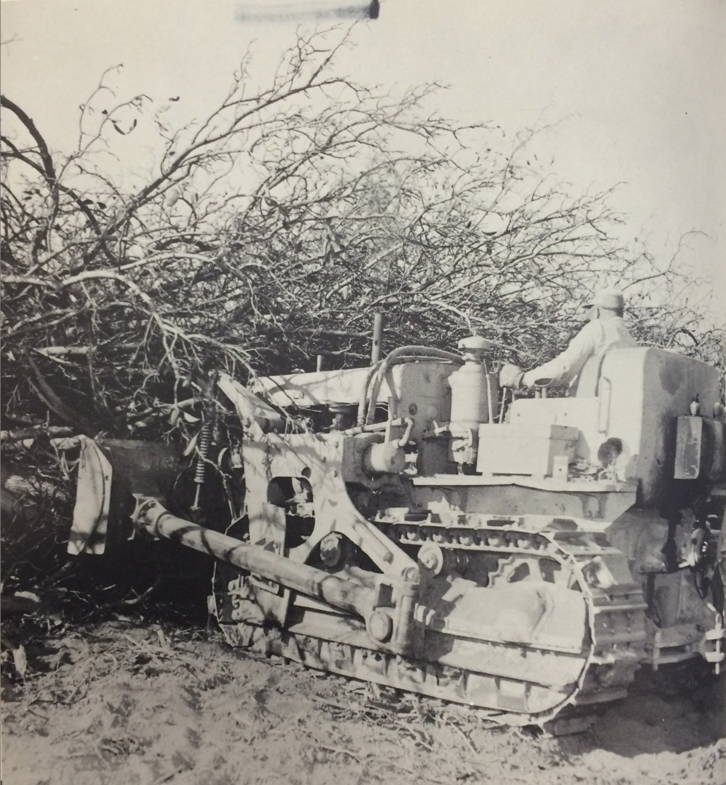
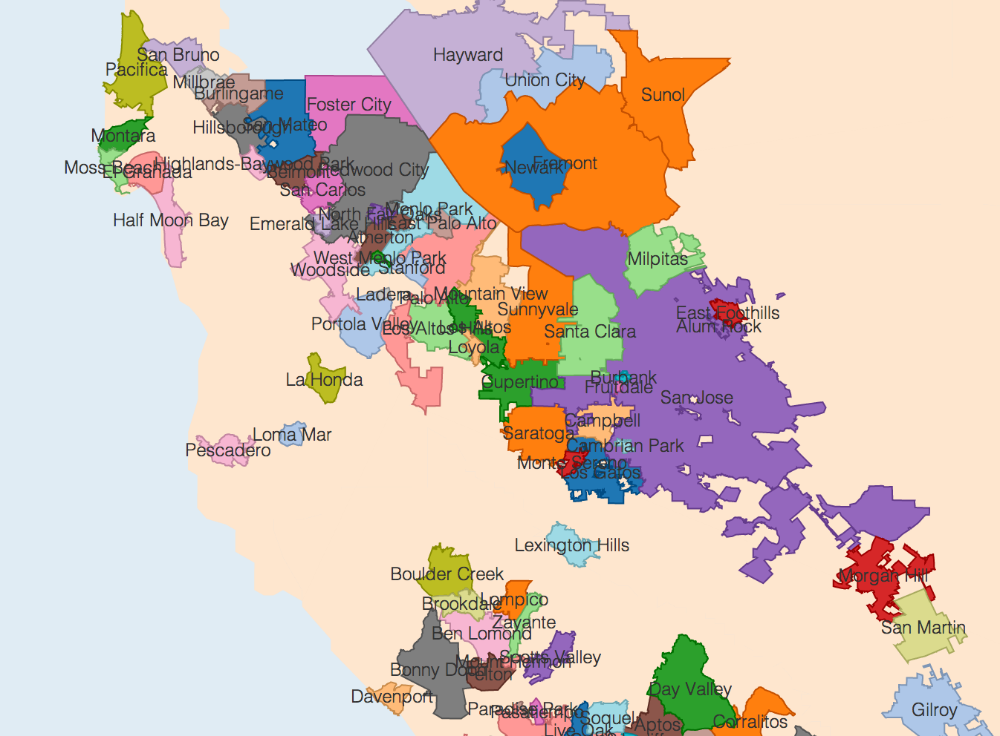
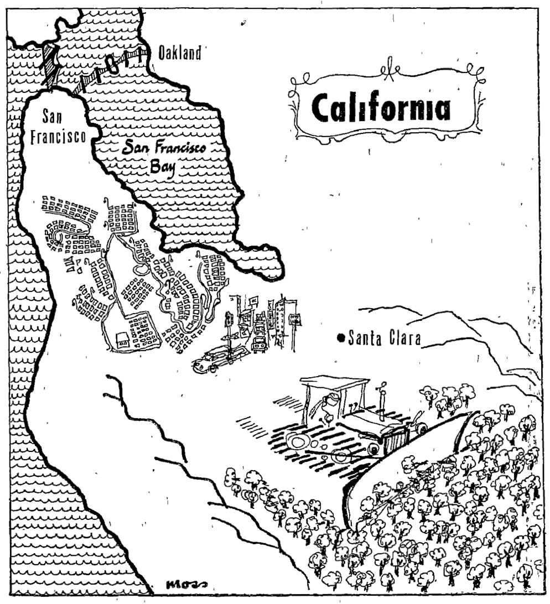

---
title: '"Carved from a Forest of Fruit Trees": Land Use, Suburbs, and the Environmental Limits of Growth Politics'
author:
- 'Jason A. Heppler'
...

> Hammer in hand, the county went noisily about the job of transforming itself 
> from a rural to a metropolitan community. Bulldozers leveled orchards for 
> thousands of homesites. The steel webbing of new factories spread over 
> former hay fields. Acres of asphalt marked the parking areas of new suburban 
> shopping centers. Service stations sprang up like mushrooms along our major 
> thoroughfares. Fleets of ready-mix trucks disgorged concrete into the 
> foundation forms of every kind of building — in every part of the county.
> 
> ---Karl J. Belser, *Planning Progress 1956*^[Karl J. Belser, *Planning 
> Progress 1956* (San Jose: County of Santa Clara Planning Commission, July 
> 1956), California Room, San Jose Public Library, 1.] 

> Do you know the way to San Jose? It's simple: annex more, plan less density 
> and develop, develop, develop. 
> 
> ---*Seattle Times*^[James B. Weatherby and Stephanie L. Witt, *The Urban 
> West: Managing Growth and Decline* (Westport: Praeger, 1994), 37–38.]

> Perhaps the only use we will ever find for the hydrogen bomb will be to 
> erase this great mistake from the face of the earth. 
> 
> ---Karl J. Belser^[@matthews2003dreams, 102.]

Joe Ruscigno spent his lifetime working the land on his San Jose farm.  Son of 
first-generation Italian immigrants, Ruscigno and his family had run the farm 
since the 1940s.^[U.S. Census, 1940. 
http://www.archives.com/1940-census/joe-ruscigno-ca-34378841.] But in 1952 he 
gave up tending land for tearing up land. "Guess I've pulled out 150 acres of 
trees since the first of the year," he told a *San Francisco Chronicle* 
reporter. Ruscigno lamented the uprooting of the fruit trees to the bulldozer 
he now controlled, but "what can you do? . . . The subdivisions were coming in 
all around us and when they made a good offer I sold out."^["Santa Clara 
County---Scene of the Big Boom," *San Francisco Chronicle*, May 11, 1952.] In 
the decades after 1945, every municipality in the Bay Area participated in the 
process of metropolitan development and, by extension, the erosion of 
agricultural land. San Jose, the largest city in the Valley, was composed 
primarily of subdivisions of single-family homes that lacked the industrialism 
of its northerly neighbors, especially Palo Alto and Sunnyvale that hosted the 
majority of high-tech industry.^[An urban planning study by the Palo Alto 
Planning Commission noted in 1974 that the 1970 Census reported 50,282 persons 
employed in Palo Alto, the highest ratio of jobs to population in any Bay Area 
community, and that between 1960 and 1970 commuting workers increased from 
20,000 to 40,000 while those commuting out of Palo Alto dropped slightly. Palo 
Alto Planning Commission, *Palo Alto Comprehensive Plan Impact Report*, July 1, 
1974, p. 45. See also Paul Griffin and Ronald Chatham, "An Industrial 
Analysis: North Santa Clara County," *Appendix A: Employee Work-Trip Charts*, 
County of Santa Clara Planning Department, 1958.] By the 1970s, San Jose had 
become so suburban that researchers at Rand labeled the city "a bedroom 
community for its suburbs"^[Daniel J. Alesch and Robert Levine, *Growth in San 
Jose* (Santa Monica: Rand, 1973), viii.] and referred to Santa Clara County "a 
giant suburb" of San Francisco.^[Daniel J. Alesch, *Local Government's Ability 
to Manage Growth in a Metropolitan Context* (Santa Monica: Rand, 1974), 16.] 
The city lacked an urban core of business surrounded by bedroom communities, 
leading urban historian Robert Fishman to call San Jose the "archetypal 
technoburb."^[@fishman1987bourgeois, 17.] 

Ruscigno's experience reflected the shifting land use of the South Bay. As the 
Valley's orchards disappeared underneath suburban tracts, the bulldozer came 
to symbolize the progress of postwar urban transformations. Between 1935 and 
1957, over 70,000 acres of orchards left production as suburban development 
accelerated.^[Roy Hitchcock, "Taking the Pulse of the Prune," *California 
Farmer*, September 14, 1957.] "The most common sounds heard in the Santa Clara 
Valley this spring is not the call of the meadowlark in the tall grass among 
the orchards," reported the *San Francisco Chronicle*, "but the roar of the 
bulldozer ripping up rows of fruit trees and the rhythmic sound of the 
pounding hammer."^["Santa Clara County---Scene of the Big Boom," *San 
Francisco Chronicle*, May 11, 1952.] San Jose became an icon of suburban growth 
in the mid-1950s, an oft-cited example of how cities should engage in urban 
planning and aggressive development in postwar America until the 1970s, when 
critics leveled charges against the sprawl, environmental damage, congestion, 
and spatial patterns of industrialization and suburbanization.

San Jose's pattern of residential and industrial development was distinct from 
other cities in the Bay Area. Northern Bay Area cities---Sunnyvale, Palo Alto, 
Mountain View, Santa Clara---tended to build more industry than housing 
throughout the postwar decades, leading eventually to severe housing and 
utility shortages and traffic congestion.^[The City of Palo Alto was already 
facing severe housing shortages as early as 1945. When Wallace and Mary 
Stegner moved to Stanford, they were unable to purchase a home in the city. 
Instead, the Stegner's originally tried to set up the community of Ladero with 
other Stanford professors before eventually settling in Los Altos Hills. 
Wallace Stegner, "Four Hundred Families Plan a House," *The Magazine of the 
Year*, April 1947, 63-66; Jackson J. Benson, *Wallace Stegner: His Life and 
Times* (New York: Viking, 1996), 152, 153, 195.] San Jose, on the other hand, 
housed almost half of the county's population, but provided only one-third of 
the jobs since most industry tended to cluster around Stanford 
University.^[@findlay1993magic, p. 156.] By examining "the Capital of 
Silicon Valley," we can better understand the process of residential 
suburbanization and the environmental limits to city growth. Such limits came 
primarily in two forms, the first from residents who began encouraging limited 
growth, and the second by the environment itself. Looking at the relationship 
between metropolitan fragmentation, suburban economic regulation, and 
burgeoning environmental activism, all across the Valley newcomers fought with 
farmers, planners, agency officials, and elected politicians to determine 
whose vision of the Valleys' future would prevail. Zoning and regulation 
became tools to protect what residents viewed as encroachments onto their 
suburban investments.^[Aaron Cavin's dissertation is especially noteworthy in 
this regard, in which he examines the racial and spatial politics of Santa 
Clara Valley. See, especially, @cavin2012siliconvalley, chapter 6.] 

Historians have debated the issue of whether criticisms of
urban growth and growth control really reflected an environmental
concern on the part of suburbanites. Mike Davis, for example, sees
growth control not as a concern about the environment but rather a
protection of property values.^[Mike Davis, *City of Quartz*, 188.] Other
environmental historians such as Adam Rome challenge this view,
identifying growth control as a genuine environmental reaction to
suburbanization. Historian Peter Siskind notes that growth controls "at
once emerged from and sought to recast post-New Deal growth liberalism;
their politics cannot be confined in the simple categories of backlash,
antistatism, or conservatism that dominate our understanding of suburban
politics."^[@siskind2006discontents, p. 163. See also Dyble, "Revolt Against
Sprawl: Transportation and the Origins of the Marin County
Growth-Control Regime"; @scott2008hip.] In San Jose, the process of rapid
growth, loss of agricultural land, and eventual resistance to growth
gives a richer story of urban growth and resistance to growth.

Historians have begun to confront the history of San Jose and its rapid 
urbanization, tracing the social and cultural challenges that emerged in the 
decades after World War II.^[See, specifically, @abbott1995frontier; 
@cavin2012siliconvalley; @matthews2003dreams; @trounstine1982movers.] Fewer, 
however, have chronicled the changes to the physical environment that 
amplified urban problems and exacerbated tensions in the urban-rural 
fringe.^[Exceptions to this include Pellow and Park; Ted Smith book. These 
accounts have tended to focus on environmental justice and place much of their 
attention on occupational health, working conditions, and electronic waste.] 
Waterworks, utilities, regrading, freeways, subdivisions, uprooting 
orchards, even the very choice of where to annex land were more than 
infrastructural changes; they were the pinnacle of a hybrid landscape that was 
less predictable and more difficult to control than the one they had altered.

<!-- Goal: How does San Jose try to reinvent itself as an
industrial/residential capital, and how does that drive to shift the
landscape (agriculture -> industry/housing) affect the
environment/politics? -->

# A Booster Ethos

A range of economic interests---an ambitious group of young merchants, 
lawyers, industrialists, and property owners---endorsed the importance of San 
Jose's growth in order for the city to achieve the greatness they felt it 
deserved. The city's political machinery in the early 1940s was controlled by 
a taxi service operator and political boss Charles "Boss" Bigley and the City 
Manager C. B. Goodwin. The 1944 election gave opponents of Bigley and Goodwin 
an opening. When six of the seven city council seats were open for election, 
in part because two members left to serve in World War II, opponents formed 
the Progress Committee and accused Bigley, Goodwin, and the city council of 
not doing enough for San Jose's future. Voters, and the newspaper, agreed.  
Aided by the newspaper's endorsement, six members of the Progress 
Committee---among them key political figures Al Ruffo and Ernest 
Renzel---swept the city council elections. They committed themselves to 
building "a new metropolis in the place of sleepy San Jose." Their first step 
was to promptly fire the police chief and fire chief, charging them with 
"bossism", "mismanagement", and "political interference", and fired City 
Manager Goodwin.^[@trounstine1982movers, 87. Box 6, Ernest Reznel Papers, History San 
Jose Research Library, San Jose, California.] 

The new city council's immediate plans were aimed at attracting industry to San Jose. With 
subsidies from city and county government, the Chamber of Commerce began a 
\$60,000 advertising campaign that lured the industries of Food Machinery and 
Chemical Corporation, already a local to the area, International Business 
Machines, General Electric, Pittsburgh Steel, Owens-Corning, and 
Kaiser.^[@trounstine1982movers, 88.] Some of their initiatives fell under 
criticism, when, for example, in 1946 a fellow member called the committee 
"reactionaries" and accused them of selling municipal land to companies well 
below market value. A court agreed with these charges. Others disagreed with 
plans for the private ownership of water infrastructure, arguing instead for 
municipal ownership. The Progress Committee, along with the newspaper, 
silenced such criticism with accusations of socialism.^[@trounstine1982movers, 
88.] 

The city council, however, did come closer to bringing the Committee's vision 
to life. The Committee desired to see a new city hall, a deep water port north 
of the city, improved sewer system, streets, storm drains, and an airport. 
Building such infrastructure projects required the approval of the votes, who 
voted on general obligation bonds that allowed the city to borrow money 
long-term at low interest rates. These bonds were paid for by increases on 
property taxes---a move voters often disagreed with. Bonds were repeatedly 
voted down, even as the city dealt with its unique problem of sewage given its 
large cannery business. Voters refused to give special 
treatment to canneries, even when the state of California declared San Jose in 
violation of pollution regulations in 1948.^[@trounstine1982movers, 88.] 

The Progress Committee dissolved shortly after their victory, but their 
pro-growth ideology remained entrenched in San Jose politics for the next 
three decades.

<!-- # Progress Town U.S.A -->

\thoughtbreak{World War II and the postwar years} witnessed an explosion in the
population of northern California. San Francisco, Oakland, and Berkeley,
the traditional urban centers in the Bay Area, had seen their
populations rise during the war years, but in the postwar years
populations began moving to the suburbs. Out of the nine counties of the
Bay Area, Santa Clara County ranked first in the size of its population
increase (see figure). Throughout the 1940s the population of Santa
Clara County nearly doubled, and by the mid-1950s nearly 4,000 new
people were moving to the county every month. The county's 1950
population of 290,547 people exploded to 642,365 by 1960, surpassing San
Francisco as the region's urban center. By the end of the 1970s,
1,065,313 people called San Jose home. The arrival of so many people in
a short amount of time led to subdivisions spreading throughout the
Valley.^[Belser, *Planning Progress 1956*, 2; U.S. Bureau of the Census,
1960 Census, Santa Clara County, n.d., census.abag.ca.gov; U.S. Bureau
of the Census, 1970 Census, Santa Clara County, n.d.,
census.abag.ca.gov; U.S. Bureau of the Census, 1980 Census, Santa Clara
County, n.d., census.abag.ca.gov.]

![Population of the Bay Area counties, 1940-2010. Source: U.S. Bureau of the 
Census, 1950 Census, Santa Clara County, n.d., census.abag.ca.gov; U.S. Bureau 
of the Census, 1960 Census, Santa Clara County, n.d., census.abag.ca.gov; U.S. 
Bureau of the Census, 1970 Census, Santa Clara County, n.d., 
census.abag.ca.gov; U.S. Bureau of the Census,1980 Census, Santa Clara County, 
n.d., census.abag.ca.gov. Interactive version of this chart is at 
http://machinesinthevalley.com/visualizations/countypopulations/.](figures/population_growth.png) 

The rapid rise of the Bay Area followed a wartime and postwar trend
throughout the American West. New opportunities in western cities after
a decade of economic depression led migrants to metropolitan areas to
take jobs in wartime industries in the 1940s. The American West
especially felt the impact of this shift, leading urban historian Carl
Abbott to remark that the migration led "the entire West into the
half-century of head-long urbanization."^[@abbott1995frontier,
p. 4.] Western metro areas became centers of the new economy---Dallas, San
Francisco, San Jose, Denver, Albuquerque---based on high technology,
services, and tourism and recreation.^[On the metropolitan West, see
@abbott2008cities; @abbott1995frontier; See also @gomez2000golden; 
@fogelson1967fragmented; @isselcherny1982sanfrancisco; 
@wileygottleib1982empires.] The region
that Bernard DeVoto once described as a "plundered province" had become
an economic pacesetter in the latter twentieth century, propelled by
world war, new economic pursuits, demographic shifts, and federal
funding.^[Bernard DeVoto, "The West: A Plundered Province," *Harper's
Magazine* 169 (August 1934), 355--364. On the West and World War II, see
@nash1999landscape. Additional work on World War II and
the postwar West include @shragge1994federalcity, 333--361; 
@clayton1967coldwar, 449--473. See also @lotchin1992fortress and @lotchin2003badcity.] 

San Jose lay at the center of northern California's population boom (see 
figure). A rural farming community of 68,457 in 1940, San Jose would be among 
the top ten largest metropolitan areas in the nation by the end of the 
century. By the 1960s the town's population numbered 204,196, and doubled by 
1970 to 445,779.^[U.S. Bureau of the Census, *1960 Census*, Santa Clara County, 
n.d., census.abag.ca.gov; U.S. Bureau of the Census, *1970 Census*, Santa Clara 
County, n.d., census.abag.ca.gov.] By century's end, San Jose would become the 
largest city in northern California and largely served as the suburban home 
for the Bay Area's technology commuters working in Sunnyvale, Mountain View, 
and Palo Alto.^[U.S. Bureau of the Census, *1950 Census*, Santa Clara County, 
n.d., census.abag.ca.gov; U.S. Bureau of the Census, *1960 Census*, Santa Clara 
County, n.d., census.abag.ca.gov; U.S. Bureau of the Census, *1970 Census*, 
Santa Clara County, n.d., census.abag.ca.gov; U.S.  Bureau of the Census,1980 
Census, Santa Clara County, n.d., census.abag.ca.gov.] The city limits rapidly 
expanded from 17 square miles in 1950 to 137 square miles in 1970, sprawling 
awkwardly across the Valley floor and foothills.^[Stanford Environmental Law 
Review, *San Jose: Sprawling City: A Report on Land use Policies and Practices 
in San Jose, California*, March 1971, 2.] The city grew so rapidly that street 
map makers could not keep up with the changes, finding their maps outdated 
just five months after printing; the city began selling monthly packets of 
stickers correcting areas of the master map that people placed upon their maps 
in order to maintain its accuracy.^["County Grows Too Fast for Mapmakers," 
*Palo Alto Times*, September 12, 1952; @cavin2012siliconvalley, 209; "Notes 
for a Gazetteer," *The New Yorker*, May 4, 1963, 148.]

 

The combination of the population boom and the booster ethos of the city
council fueled a political culture that was accommodating to business
and favorable towards developers. To fund such growth the city needed
long-term, low-interest bonds, which required approval by the city's
voters whose property taxes helped pay back the loans. Since the days of
the Progress Committee, San Jose city leaders faced reluctant voters who
continually refused to fund general obligation bonds. But with the
city's rapidly expanding population and attendant needs to support the
newcomer---mainly, infrastructure that included roads, utilities, and
sewers---the city needed to find someone to convince voters to support
the measures they believed necessary for San Jose's growth. 

The city council found that person in Anthony P. "Dutch" Hamann. Hamann 
epitomized San Jose's postwar pro-growth outlook. The forty-year-old former 
businessman, teacher, and oil company representative had a strong attachment 
to the city and solid connections throughout the 
community.^[@trounstine1982movers, 89.] A graduate of the University of Santa 
Clara, Hamann had not served in political office until he was appointed by the 
city council in 1950 in a split 4 to 3 vote. As the city began its drive for 
growth, Hamann hoped to avoid the fate that had befallen his home of Orange 
County in Southern California with many competing medium-sized 
cities.^["Hamann: San Jose's Growth Guru," *San Jose Mercury*, 1999.] He 
wanted San Jose to dominate the county, and thus avoid what he saw as petty 
competition among small towns.  To grow and make available the funds to 
sustain growth, Hamann reasoned, the city needed to annex and 
tax.^[@matthews2003dreams, 96.] "You don't build a city by staying in a 
vacuum," Hamann declared. "You build, you sell. .  . . And I was the gun for 
hire."^[Hamann quoted in @trounstine1982movers, 96.] 

And build San Jose did. The city approved over 1,400 annexations between 1945 
and 1970 including many that were narrow strips---"shoestring" 
annexations---snaking outward, sometimes only on one half of a street, to 
capture a desirable subdivision, commercial center, or street intersection. In 
some areas, annexations became a tool of coercion. Annex enough areas around 
hold-outs, city officials reasoned, and pockets of non-annexed land would have 
little choice but to succumb.^["Annexations by Year", 2011, City of San Jose 
Planning Division; "City Size by Year", 2011, City of San Jose Planning 
Division; Belser, *Planning Progress 1956*, 47; @trounstine1982movers, 93; 
"Correcting San Jose's Boomtime Mistake," *Business Week*, September 19, 1970, 
p. 74; Stanford Law Review, *San Jose*, 5.] Hamann's drive for land became so 
aggressive that his staff became known as "Dutch's Panzer division"---named 
after the swift motorized armored tank squadrons of the Third Reich---as 
annexations sprawled outward from the city core.^[@trounstine1982movers, 93.] 
"They say San Jose is going to become another Los Angeles," Hamann rebuked his 
critics. "Believe me, I'm going to do the best in my power to make that come 
true."^[Stanford Environmental Law Society, *San Jose: Sprawling City*, 17. 
See also Matthews, "Los Angeles of the North," *Journal of Urban History*, 
###.] Under Hamann's tenure, the San Jose Chamber of Commerce spent nearly \$1 
million to attract new industries to the city. The population boomed and the 
city sprawled. "It was just growth, growth, growth," Al Ruffo, San Jose's 
mayor in the 1940s, recalled approvingly. "That was everybody's song. And 
Dutch sang it the loudest."^["Hamann: San Jose's Growth Guru," *San Jose 
Mercury*, 1999.] 

San Jose's pro-growth contingent received enthusiastic support from the city's 
newspaper, the *San Jose Mercury*, and its new manager, Joe Ridder. The Ridder 
newspaper empire owned several large publications in the United States, 
including the *St. Paul Dispatch*, *Duluth Herald*, *Manhattan's Journal of 
Commerce*, and the *Seattle Times*. When the family of Everis Hayes sold the 
morning *News* and evening *Mercury* in 1952 after the paper owner's death, 
the Ridder family promptly purchased the newspaper.^["The Ridders Buy Again," 
*Time*, August 4, 1952.] Joe Ridder was sent to manage the new daily paper and 
defined the paper's revised pro-growth mission, saying that he hoped to make 
the *Mercury News* "not only among the best newspapers on the Pacific Coast 
but a vital and constructive force in the development of San Jose and its 
territory."^[*San Jose Mercury*, July 1952, quoted in @trounstine1982movers, 
p. 89; @abbott1995frontier, p. 40.] When asked why he was so enthusiastic 
about San Jose's growth, Ridder responded: "Trees don't read 
newspapers."^[Quoted in Stanford Law Review, *San Jose*, 17.]

Although much of Hamann and the city council's drive appeared aimed at
attracting industry to the city, San Jose instead witnessed the most
growth in housing and residential developments. San Jose gained 25,000
new residents in 1953, and another 31,400 a year later. Residential
construction totaled \$84 million in 1954, much of which was in
unincorporated county territory. Residential construction employed
35,000 people and built 8,300 homes, while industrial and commercial
construction topped \$48 million. Banks in the county lent out more
than \$202 million through FHA, Cal-Vet, and other programs meant to
entice the construction of homes.^["1954—A Year of Amazing Growth in
County," *San Jose Mercury*, January 3, 1955.] Throughout the entire
county, housing subdivisions continued to increase. In 1950 Santa Clara
County witnessed 144 subdivisions build homes on 6,833 lots. A year
later the figures dropped slightly with only ninety-eight subdivisions
and 4,616 homes. But in 1952 construction jumped again, reaching 144
subdivisions and 6,437 homes. By 1955, the county saw 177 subdivisions
and the construction of 10,157 homes for families moving to the
area.^["Population Growth Created Demand for Housing; Subdivisions on
Grand Scale Provided the Homes," *San Jose Mercury*, January 15, 1956, p.
3P; "198 Tracts Provide 11,631 Home Sites," *San Jose Mercury*, January
15, 1960.] The county estimated that as much as 75% of the population
owned their homes.^["Estimate of Homeowners: 75%," *San Jose Mercury*,
January 15, 1956, p. 3P.] 

Along with such changes came new municipal projects. The city council finally 
convinced voters to approve bond measures, beginning in 1955 when San Jose 
voters approved bonds supporting the construction of a new City Hall, new 
hospital facilities, new jail and court buildings, and a 
new YMCA facility. The Progress Committee ran up against resistance from 
voters in the 1940s as they rejected general obligation bond votes. By the 
late 1950s residents had reversed course, approving over \$134 million in 
general obligation bonds in elections held in 1957, 1961, 1966, and 
1969.^[Trounstine, *Movers and Shakers*, pp. 95-96.] 

Residential growth, home ownership, and widespread annexation in San Jose was 
taken as a sign of progress.<!--[ Look into Cohen's Consumer Republic here on 
home ownership; also Crabgrass Frontier.]--> In 1956 the *San Jose Mercury* 
ran a special series on "Metropolitan San Jose---Progress Town U.S.A." 
detailing the various changes in the city the newspaper considered signs of a 
bright new future.^["Metropolitan San Jose---Progress Town U.S.A.," *San Jose 
Mercury*, January 15, 1956.] The paper applauded the arrival of "new plants 
bearing some of the biggest names in the nation's business," the "highly 
diversified farming," the "educational, recreational and cultural benefits" of 
the region, and the growth of retail, outlets, and store 
chains.^["Metropolitan San Jose---Progress Town U.S.A.," *San Jose Mercury*, 
January 15, 1956.] The *Mercury* praised the industrial diversification of the 
city and its promise of "year-round employment and production" instead of the 
seasonal employment found in the agricultural industries. A town less 
reliant on agriculture meant avoiding economic dips, more opportunities for 
employment and education, and additional wealth.^["Diversification Gives Solid 
Balance to Area," *San Jose Mercury*, January 15, 1956.] 

San Jose's rapid growth came with a price. Nearby towns attempted
to protect themselves from becoming part of the city. In the 1950s,
suburban governments proliferated. For various reasons, towns were
not willing partners in San Jose's growth and instead sought strict
economic regulations within their boundaries in order to control the
development and character of their municipality. Some cities used
incorporation as one method for protecting themselves from San Jose's
sprawling annexations and maintain their identities (see Figure). Campbell became a
city in 1952, followed by Milpitas in 1954, Cupertino in 1955, and
Saratoga in 1956.^["Hamann: San Jose's Growth Guru," *San Jose Mercury*,
1999.] County-wide, between 1952 and 1957 seven cities incorporated,
doubling the number of municipalities in the county.^[@cavin2012siliconvalley,
491.] 

<!-- add a figure for these cities; visualization of city foundings? -->

In other cases, cities found themselves resisting attempts at
municipal consolidation.^[Consolidation and annexation are very different 
issues. Consolidation means the joining of two independent municipalities; 
annexation means the expansion of municipal boundaries to control 
unincorporated land.] Alviso, located to the north of San Jose at the 
southern tip of the San Francisco Bay, was an 
incorporated city long desired by civic leaders in San Jose. City leaders 
sought two key developments with Alviso. The first, San Jose desired access to 
the San Francsico Bay for the location of a deep water port.^[Land-locked San Jose began 
looking to Alviso's port as early as 1895. In the 1930s, the city was so 
certain it would control the port that it prematurely released a pamphlet 
boasting of the "San José Deep Water Port." In 1958, the city's Master Plan 
still mentioned their goal of a deep water port located in Alviso.] Second, the city 
wanted to locate a sewage treatment plant in the suburban fringe rather than 
inside the city. In {YEAR} For pro-growth Alvisans, incorporation with San Jose would 
allow the city to regain control over it's development while also providing 
the city with a larger tax base to fund capital improvements. Alvisans, one 
pro-consolidation advertisement wrote, are "tired of wallowing in the mud, are 
tired of having our children play in the streets . . . are tired of seeing all 
of our neighboring areas make great strides forward while we just stand still. 
SUPPORT PROGRESS."^[Gross, "Covenant and Betrayal."] While debates continued 
in Alviso, San Jose annexed a narrow one-hundred-foot strip of land to the 
border of Alviso, and there built a sewage treatment plant. That plant would 
become the basis for more annexations as it allowed the city to extend 
municipal services cheaply.^[While San Jose prided itself on industrial and 
commercial development, the city made most of its revenue through residential 
property taxes. These taxes, however, were unbalanced. The city desired more 
industrial land to expand its tax base, and locating industrial facilities 
northward allowed it to tap into the growing inudstries of Silicon Valley. San 
Jose City Planning Commission, *Master Plan of the City of San Jose*, 50.]

Once again, however, the very choices of annexation, zoning, and construction 
introduced environmental problems. When San Jose located a sewage 
treatment plant near Alviso, they were attempting to push such services away 
from the city's downtown in order to maintain a pristine image and high 
property values. The sewage treatment plan required massive amounts of 
chlorine, which was shipped to the plant by rail across Alviso's borders. 
Alvisans not only dealt with the daily stench of the plant, but were also 
exposed to potential chemical spills and sewage leaks. For San Jose, 
controlling Alviso's space was a way of offloading the environmental 
consequences of pollution to neighboring cities.

Complaints and campaigns were not enough to stop San Jose's drive. In January 
1968, voters approved consolidation by the razor-thin margin of nine votes. 
However, many of the developments pro-consolidation Alvisans anticipated were 
never realized. No deep water port could be constructed because the dredging 
necessary ran up against new environmental laws passed in the earl 1970s. The 
port had also become less important to San Jose since new industries relied 
far less on water for shipping and more on the new interstate system. Yet 
while commercial developments ran aground, the city continued to expand its 
sanitation facilities. Large land owners began selling their land to the city. 
Ton Santos sold his land to San Jose that allowed the city to create a huge 
landfill, which became so polluted that the Environmental Protection Agency 
declared the site a Superfund site in 1986.^["Rules and Regulations," *Federal 
Register* 51, no. 111 (June 10, 1986): 21054--21077.] Bill Zanker sold his property to 
the city for \$1.5 million and moved to Sunnyvale. Zanker's land became the 
site of an expanded sewage plant that encompassed 1,764 acres and quadrupled 
its capacity.^["Covenant and Betrayal."] The new sewage plant became San 
Jose's key to growth, allowing the plant to handle the municipal waste of the 
whole region, including the industrial sewage from high technology industries. 
The plant eventually grew to service twenty-four cities.^["Alviso 
Report---Minutes of the San Jose City Council," August 13, 1973, 14, Folder 
ADM; Boards and Commissions; Local Agency Formation Commission; Cities--San 
Jose; detach--Alviso #1, Records of the Santa Clara County Local Agency 
Formation Commission.]

<!-- Federally funded freeways—the Nimitz Freeway between Oakland and San
José and the Bayshore Freeway between San Francisco and San
José—promoted suburban growth along their routes, allowing subdivisions
to spread across the Santa Clara Valley.^[Alesch, Local Government's
Ability to Manage Growth in a Metropolitan Context, 20.] -->

The city's political coalition of businessmen, newspaper publishers, real 
estate developers, and the Chamber of Commerce allowed the political machinery 
to pursue growth, while the city's council-manager system of government 
insulated political leaders from the electoral decisions. Widespread 
annexation became an avenue for development, provided the city with a broad 
tax base of industrial, residential, and commercial land, provided itself more 
power over surrounding cities, and let San Jose's leaders think about the city 
as a regional powerhouse. Although historians have perceived this period as a 
time when pro-growth political regimes across the Sunbelt could pursue any 
project they desired, the story in San Jose complicates this perception. The 
combination of environmental politics and the limits of the environment itself 
shaped contests over metropolitan space, environmental degradation, and 
municipal government.^[Kevin Starr, *Golden Dreams: California in an Age of 
Abundance, 1950--1963 (New York: New York University Press, 2009); Harvey 
Molotch, "The City as a Growth Machine: Towards a Political Economy of Place," 
*The American Journal of Sociology*, 82 (1976): 309--332; Glenna Matthews, 
"The Los Angeles of the North: San Jose's Transition from Fruit Capital to 
High-Tech Metropolis," *Journal of Urban History* 25 (May 1999): 459--476; 
James C. Cobb, *The Selling of the South: The Southern Crusade for Industrial 
Development, 1936--1980 (Baton Rouge: Louisiana State University Press, 1982); 
Richard M. Bernard and Bradley R. Rice, eds., *Sunbelt Cities: Politics and 
Growth Since World War II* (Austin: University of Texas Press, 1983); David C. 
Perry and Alfred J. Watkins, eds., *The Rise of the Sunbelt Cities* (Beverly 
Hills: Sage, 1977); @cavin2012siliconvalley, 29--31.] 

<!-- # Green Gold and Green Belts -->

\thoughtbreak{As city leaders defined the details of San Jose's suburban 
future} in the
late 1940s and early 1950s, a sizable contingent of city residents
began questioning whether the link between growth and prosperity was guaranteed.

The rapid growth of the city led farmers to feel threatened. Industrial and 
residential lots were replacing one acre of farmland every ninety minutes in 
1959.^[@cavin2012siliconvalley, 209.] Often land developers would pay 
for property at rates well above what farmers originally paid. When the Santa 
Clara fruit grower Carl Wesley Haman died in 1955, his 41.44-acre lot was 
purchased by a Palo Alto developer for \$287,000---over seventeen times more 
than what Haman paid when he originally purchased the land. Desirable land 
could fetch upwards of \$7,000 an acre by the mid-1950s.^["41.44 Acres Bring 
Price of \$287,000," *San Jose Mercury*, September 17, 1955; 
@cavin2012siliconvalley, 212.] By the 1970s, pockets of agricultural land were being sold 
for $18,000 an acre, and one land owner refused an offer of 
\$2,300,000.^[Stanford Law Review, *San Jose*, 8.] Often the small farmers 
could not afford to stay in business in the face of rising tax assessments, 
while large landowners held out to fetch higher prices.^[McGaffney, "Urban 
Expansion — Will it ever Stop?" 510.] San Jose, T. H. Bowden was already 
noting in 1937, "might literally be said to have been carved from a forest of 
fruit trees, as most of the residential sections were orchards prior to being 
subdivided, and many of the original trees still ornament the gardens of the 
invading residences."^[T. H. Bowden, *Report of a Survey in San Jose, 
California*, (Washington, D.C.: Division of Research and Statistics, Home 
Owners' Loan Corporation, September 18, 1937), 2, quoted in Cavin, "Borders of 
Citizenship," 208.] The rapid suburbanization of San Jose eradicated farmland. 
Between 1935 and 1957, nearly 70,000 acres of farmland left production.^[Roy 
Hitchock, "Taking the Pulse of the Prune," *California Farmer*, September 4, 
1957; "The Indispensable Man at Harvest Time," *San Jose Mercury*, August 28, 
1955.] "As the people came," the *San Jose Mercury* noted in 1956, "the orchards 
went."^["Population Growth Created Demand for Housing; Subdivisions on Grand 
Scale Provided the Homes," *San Jose Mercury*, January 15, 1956, p. 3P.] 

As we saw above, city leaders had no problem annexing land for what they saw as the 
appropriate and correct use for land: new industry and new suburban homes. But this 
vision of the landscape came into conflict with farmers, whose own ideas about 
land use also meant protecting their livelihoods. Right as suburbs were 
expanding across the valley floor, their farming neighbors began organizing an 
effort at agricultural land preservation. Farmers began working with the 
County Planning Commission to create new zoning ordinances that would maintain 
greenbelts between cities. Pressure by farmers led the state legislature to 
pass the Green Belt Exclusion Law in 1955 and the Agricultural Assessment Law 
in 1957, both efforts thought to help farmers hold on to their land.

The Green Belt Exclusion Law sought to create zones where no subdivisions, 
industry, or commerce could establish itself. The land would remain the 
exclusive use of agricultural production. This was aided by the Agricultural 
Assessment Law, which sought to help farmers maintain low tax assessments on 
their land. By allowing green belts to be preserved, assessments of land would 
remain low since no non-farming activity would be located on neighboring land. 
The exclusive zoning expanded the county's agricultural land by almost sixty 
percent, from 40,000 acres in 1958 to 70,000 acres in 1960.^[@nader1973land, 
32--34.]

The disappearing orchards and countryside---what many equated as 
"nature"---gained the attention of William H. Whyte, a nationally-known critic 
of suburban development. Writing in 1958, Santa Clara County was his example 
of sprawl---"vast, smog-filled deserts that are neither city, suburb, nor 
country."^[Whyte, "Urban Sprawl," 124. On Whyte and urban sprawl, see 
@rome2001bulldozer, 119–152.]

By the mid-1960s, however, the exclusive agricultural zoning would begin to 
fall under the gerrymandered annexations. Although farmers had felt themselves 
under pressure in the 1950s to preserve their lands, many, like Ruscigno, 
began to realize the value they could extract from the sale of their 
lands.^[@nader1973land, 35; Whyte, *The Last Landscape*, __.] The patterns of 
leapfrogged annexations angered growers as well, which encouraged other 
farmers to sell their land to urban developers well before the land was needed 
for the city.^[@conard1985green, 6.] 

The contest over the agricultural landscape revealed not only an effort by 
farmers to protect their livelihoods, but a broader debate about land use and 
the environmental costs exacted on the land for its various uses.

\thoughtbreak{Suburban homeowners came to expect that the places they moved to not
only had low property taxes}, provided property ownership as an avenue
for upward mobility, and segregated neighborhoods, but a pleasant
environment as well.^[On the issues of social mobility, radicalized
suburban space, and taxes, see @self2003babylon, 96--100; Ronald
Tobey, Charles Wetherell, and Jay Bringham, "Moving Out and Settling In:
Residential Mobility, Home Owning, and the Public Enframing of
Citizenship, 1921-1950," *American Historical Review* 95 (December 1990);
Nicolaides, *My Blue Heaven*, 185-237.] Such views put residents at odds
with the concerns of developers and boosters, who tended to privilege
the sale of land for profit, taxes, and jobs---the very core of
"growth." But home-owning suburbanites approached property differently,
expecting that the place they inhabited had access to public parks, open
space, well-kept lawns, and access to recreation. Property, then, was
more than just the accumulation (and production) of capital. Property's
proximity to nature mattered a great deal to suburbanites, manifesting
itself in a sort of "aesthetic capital" that could not be measured by
dollar amounts. Suburbs were not just efforts towards organizing space;
their very proximity to "nature" led suburbanites to define their space
in aesthetic terms and take measures to protect their idea of "nature."

Advertisements for subdivisions often highlighted the natural
surroundings as a way to entice prospective homebuyers. Yet often the
"natural" environment---often, in this case, meaning orchards and
farmland---were quickly giving way to suburban housing developments. It
was not uncommon for a new homeowner, enticed by the idea of a
countryside home, to suddenly be in the midst of sprawling subdivisions
in only a few years.^[Stanford Law Review.]

The very location of annexations and subdivisions ignored potential
environmental issues, or introduced new problems the city failed to
anticipate. The City of San Jose eagerly approved subdivisions in
floodplains, hillsides, fault lines, and wetlands. Such flexible land
use gave San Jose city leaders what they wanted, drawing developers to
the city rather than its neighbors whose land use policies were more
restrictive.^[@trounstine1982movers, 95.] Sometimes housing
developments occurred on land originally blocked by the county as
improper for development, only to be annexed by a city and opened to
development^["Proper Storm Drainage Possible, Says Planner," *San Jose
Mercury*, January 5, 1956.]. No type of land, it seemed, would be off the
table for San Jose civic leaders. 

San Jose had to confront more than the politics surrounding the environment. 
They confronted the environment itself, which had its own ways of dictating 
the limits of urban growth. The approval of development in areas prone to 
flooding provides one example of the environmental limits of growth. The 
city's poor planning exacerbated flooding problems. As more and more soil was 
paved over or built upon, the less area remained to absorb excess 
water.^[Leonard Downie Jr., "A Misplanned Suburb," Washington Post, December 
30, 1973, p. C5.] Urban development changed the Valley's drainage system, 
upsetting centuries of drainage patterns that had created hundreds of small 
streams and areas for groundwater absorption. Storm runoff and flooding became 
problems in ways it had previously not been.^[Bill Zanker to Don Edwards, 
February 11, 1966, Box 72, Folder 3, Don Edwards Congressional Papers, 
MSS-1995-001, San Jose State University Library Special Collections and 
Archives.] Furthermore, building in low areas frequently flooded in winter and 
spring rains, places often sold to lower-income families.^[Downie, "A 
Misplanned Suburb," *Washington Post*, December 30, 1973, p. C5. According to 
Downie, such sales were made primarily to lower-income families and allowed 
developers "profit risk-free." The homes were guaranteed by FHA loans, which 
were often leased to black and Hispanic homebuyers.] 

Drainage channels themselves were altered as well. The Guadalupe River and 
Coyote Creek, which whisk water from the southern rim of the Diablo Mountains 
to the San Francisco Bay, experienced a change in their grade from the 
subsidence. In other words, the sinking land caused the rivers to adjust their 
angle more sharply downward, causing them to transport more and larger river 
material than they had previously.^[J. Robert Roll, "Effect of Subsidence on 
Well Fields," *Journal (American Water Works Association)* 59, no. 1 (January 1, 
1967): 80–88.] 

In addition to runoff and drainage
issues, communities faced an issue with ground sinking, a phenomenon
known as subsidence. Subsidence occurred as groundwater stores were
depleted and the soil and clay above the aquifer compressed from the
weight above it. Subsidence exacerbated flooding problems. The area had
been facing problems of subsidence since the early twentieth century as
groundwater levels dropped as much as ninety-five feet from heavy
pumping from the county's more than 2,000 wells.^[Scott, *San Francisco
Bay Area*, 229-230.] Alviso, located at the southern tip of the San
Francisco Bay to the north of San Jose, sank six feet in the postwar
years through a combination of agricultural groundwater pumping and,
later, increased water pumping to supply subdivisions. By comparison,
San Jose's downtown sank fourteen feet before groundwater replenishment
efforts finally ended the subsidence in the late 1960s. The combined
issues of subsidence and altered drainage patterns dramatically collided
in a Christmas 1955 deluge that flooded nearby Sunnyvale and Alviso,
requiring the Santa Clara County Flood Control and Water District and
the Army Corps of Engineers to begin building a system of levies and
dikes to protect the communities.^[Joseph F. Poland, "Case History No.
9.14. Santa Clara Valley, California, USA," in *Guidebook to Studies of
Land Subsidence Due to Ground-water Withdrawal*, ed. Joseph F. Poland
(Paris: UNESCO, 1984), 281, 283; Andrew Trice, *Review of Economic
Aspects of the Corps of Engineers' Draft Report on Coyote Creek*, March
22, 1971, Box 84, Folder 140, Don Edwards Congressional Papers,
MSS-1995-01, San Jose State University Library Special Collections and
Archives; "Proper Storm Drainage Possible, Says Planner," *San Jose
Mercury*, January 5, 1956; "Orchardist Orders Dike Builders Off His
Land," *San Jose Mercury*, January 5, 1956; "A ‘Walled' City of Alviso May
Be Answer to Problem," *San Jose Mercury*, January 6, 1956, p. 4.]

Subsidence unwittingly caused infrastructure problems as well. As
aquifer levels fell, farmers had to run their wells deeper and, in turn,
use more electrical power and larger pump equipment to bring the water
to the surface. Furthermore, the sinking of the ground caused damage to
well casings, sewers, water mains, and other underground
infrastructure.^[Scott, *San Francisco Bay Area*, 230.] At the very moment
that the city needed its infrastructure the most, the rapid urbanization
it was promoting was putting stress on existing systems.

Rapid urbanization also meant the quick disappearance of open spaces and
undeveloped land, despite the goals of the agricultural zoning laws.
When county planning director Karl Belser issued the county's planning
goals in 1956, he urged the "preservation of scenic beauty" and the
maintenance of undeveloped land for the purpose of "relief" from the
city. The county sought scenic roads projects to limit the "unsightly
development" on the land and provide "visual amenity" for the
area.^[Belser, *Planning Progress 1956*, 12. See also Belser's remarks in
*Beauty for America: Proceedings of the White House Conference on Natural
Beauty* (Washington, D.C.: Government Printing Office, 1965), 190-295.]
Journalist Leonard Downie, writing about the city in 1973, concluded
that all that remained of scenic open space was the "carefully tended
and regularly watered greenery along the shoulders of the county's many
freeways."^[Downie, "A Misplanned Suburb," *Washington Post*, December 30,
1973. Quotes from @cavin2012siliconvalley, 497.]

<!--

*As early as 1956, county planning director Karl Belser declared that the
planning department aimed for the "preservation of scenic beauty." The
county worked to establish undeveloped areas that would provide visual
"relief." It embarked on a "scenic roads" project, an attempt to limit
"unsightly 16 development" on the sides of highways and to landscape
them for "visual amenity." At the 1965 White House Conference on Natural
Beauty, Belser argued that counties and local jurisdictions should
establish open spaces for the gaze of suburban residents, asserting "one
of the objectives of local administration shall be to have natural
beauty prevail."17*

Another thought that's forming while working on this chapter on San
Jose: the environmental/conservation argument made by many neighborhood
activists in the 1950s and 1960s referred to the (quickly disappearing)
orchards and farms as a sort of nostalgic ideal of "nature." Wallace
Stegner referred to the Valley's orchards as "a glory" and lamented
their loss. But, fruit production -- especially in San Jose -- was quite
intensive on the environment. San Jose's sewer system was built
specifically to support the fruit canneries, and much of the effluent
produced by the canneries were dumped into the San Francisco Bay for
many years. Agriculture in this part of semiarid California was also
quite water intensive, leading to subsidence in the middle of the
century and exacerbating problems with flooding (electronics
industrialization caused this too). Not to mention the bodily health of
workers who were exposed to pesticides, fertilizers, lye, and other
harsh chemicals used in production and canning. Bloom-time orchards were
probably quite beautiful and better to look at than a warehouse, but
that doesn't mean it was environmentally sustainable.

——

Environmentally-minded suburbanites of the South Bay identified two
issues with San Jose's suburban character overrunning the agricultural
landscape. The first was the loss of prime farmland, which residents
found as threats to food production {…} Second, San Jose residents
lamented the aesthetic losses of the orchards.

Flooding, etc.

Journalist Leonard Downie Jr. remarked in 1973 that San Jose was
remarkable for its "mustard-colored haze" and noted the county's
environmental problems that stemmed from poor planning:

> Automobiles push and shove through crowded concrete corridors of stores,
service stations, car lots and taco stands. Isolated groves of the last
surviving fruit trees fight asphyxiation from the polluted air and
strangulation by the surrounding homes, shopping centers, factories and
freeways. The houses huddle together, back to back and side to side, in
cities of subdivisions without open spaces, parks or even sidewalks.
Many homes just 10 years old slouch in ready-built slums, their gravel
roofs leaking, concrete slab foundations cracked, flimsy veneer doors
and walls warped, stick fences rotting and sparse dirt yards alternately
flooding and heaving. This is Santa Clara County, California, a jigsaw
puzzle of intertwined suburbs beginning 40 miles southeast of San
Francisco.^[Downie, "A Misplanned Suburb," Washington Post, December 30,
1973.]

All that remained for scenic spots, according to Downie, was "the
carefully tended and regularly watered greenery along the shoulders of
the county's many freeways."^[Downie, "A Misplanned Suburb," Washington
Post, December 30, 1973. Quotes from Cavin, 497.]

The planning commission acknowledged in 1956:

> "Old residents view the county's frenzied growth with mixed emotions.
Some see this growth as ‘progress', a condition implying speculative
opportunity or reflected economic benefits. The farmer views with alarm
the disappearance of the county's farmlands under the onslaught of
urbanization. The suburbanite sees his ‘country living' threatened by
the spread of the solid city.... Some are glad for the boom in the
building industry. Others look at our sprawling, rubber stamp
subdivisions and wonder if these are ‘the slums of tomorrow.'"^[Belser,
Planning Progress 1956, 2.]

William Whyte?

*By 1958, Santa Clara County became a national symbol of poor urban
planning. William H. Whyte, a nationally-known critic of suburban
development, used the county as an example of an urban form he called
"sprawl," areas defined as "vast, smog-filled deserts that are neither
city, suburb, nor country." Whyte especially lamented the loss of
agricultural land in the Valley to the "maze of signs and neon lights."
Observers in San Jose commented on the encroaching urban landscape into
the rural landscape. T. H. Bowden noted that the city "might literally
be said to have been carved from a forest of fruit trees, as most of the
residential sections were orchards prior to being subdivided, and many
of the original trees still ornament the gardens of the invading
residences."^[Bowden, Report of a Survey in San Jose, California, 2.]
Thousands of acres of farmland were quickly being converted to
subdivisions.*

*Plans for municipal consolidation in San Jose received resistance from
voters. Civic leaders' drive to expand the city was hardly shared
universally, and homeowners began rejecting the growth-oriented business
elite that had controlled San Jose politics since the 1940s. In 1962,
voters elected Virginia Shaffer to the city council. Shaffer was a
Republican in favor of slow growth and limited government spending. When
a vote came before the seven-person city council to consolidate the city
of Alviso, the only dissenting vote came from Shaffer who argued that
consolidation would do little to help homeowners or
taxpayers.^[Resistance to expansion came, not from liberal
environmentalists, but from conservative Republicans representing
homeowner interests according to Cavin. Cavin, 324.]*

-->

# The Barrio and the Sewers

The environment of the neighborhood generated health problems. In the
early 1950s, lack of sewers and poorly managed cesspools led to an
outbreak of amoebic dysentery in the area. One hundred and twenty 27
five cases occurred on only two blocks.

# Conclusion 

Anchored by the growing high technology industry, the construction of
new homes, interstate highways, and city infrastructure led to
unprecedented growth in the Bay Area, transforming the once
agriculturally-dominated region of rural communities into a sprawling metropolis that quickly filled the flatlands of the valley. The
developments in San Jose mirrored those of other Bay Area cities as Palo
Alto, Sunnyvale, Mountain View, and Santa Clara grew from rural towns
reliant on agriculture to burgeoning cities. San Jose became the model
of urban development. Widespread annexation combined with real estate
development, retail services, and high tech industries became drivers of
population growth. Simultaneously, the concerns of conservationists and
environmentalists over urban growth and the loss of open space was the
first salvo in future struggles over the environment, as highlighted in
the battle over Interstate 280 and the loss of farmland. City
competition over land use and control would only increase over the next
two decades, leading to a growing intensity of environmental critique.
Such concerns would boil over around Stanford in 1960.

