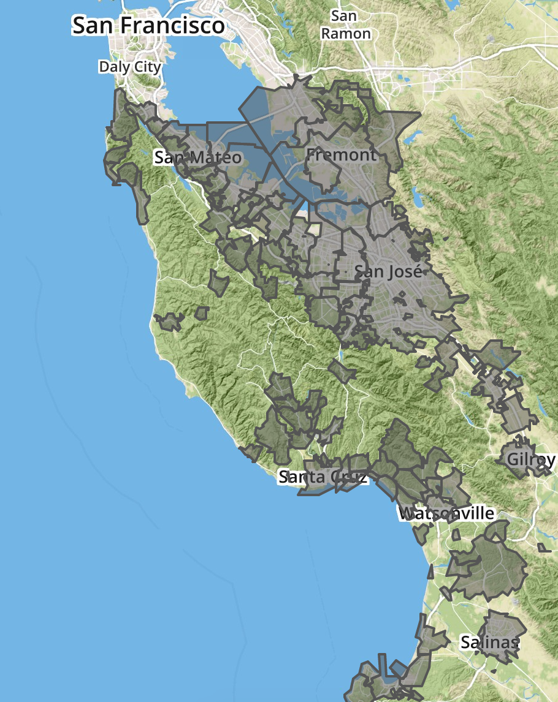
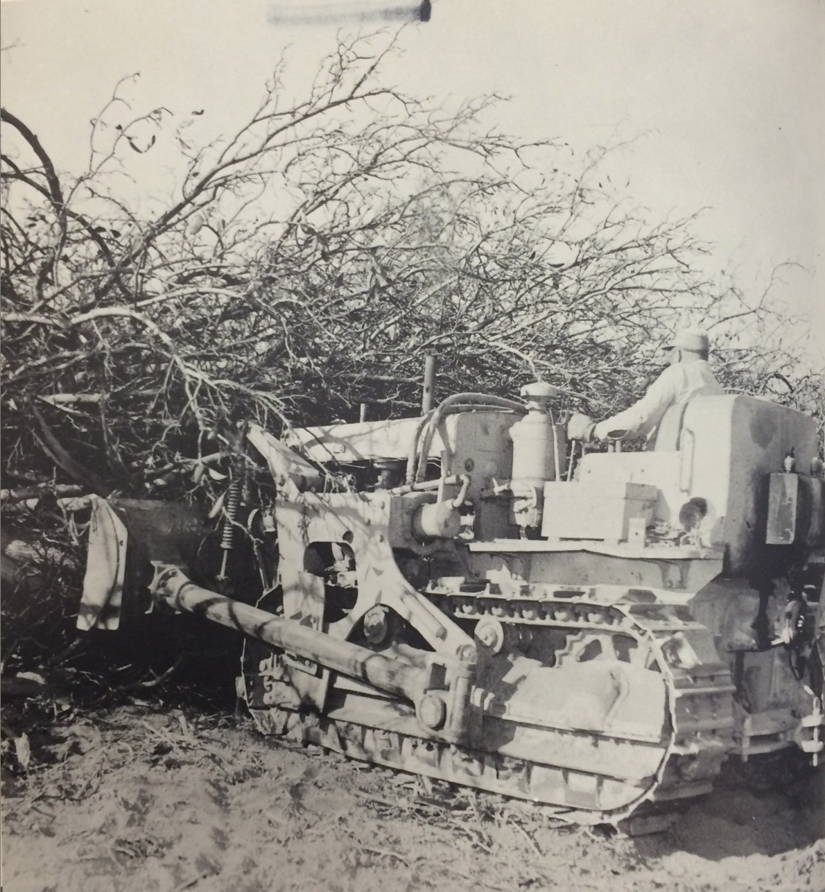
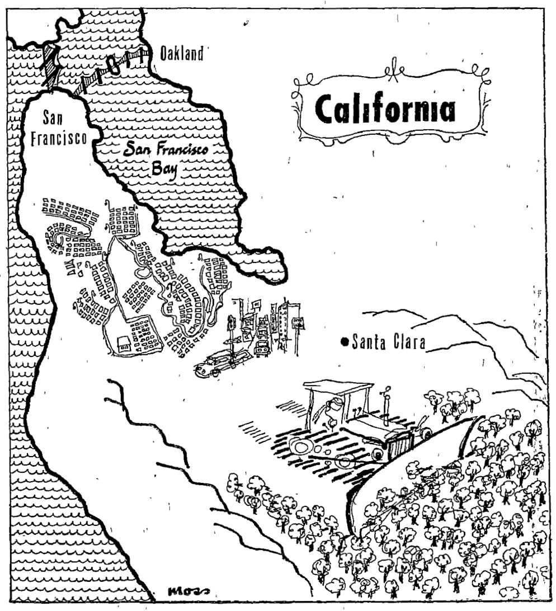

---
title: '"Carved from a Forest of Fruit Trees": Land Use, Suburbs, and the Environmental Limits of Growth Politics'
author:
- 'Jason A. Heppler'
...

> Hammer in hand, the county went noisily about the job of transforming itself 
> from a rural to a metropolitan community. Bulldozers leveled orchards for 
> thousands of homesites. The steel webbing of new factories spread over 
> former hay fields. Acres of asphalt marked the parking areas of new suburban 
> shopping centers. Service stations sprang up like mushrooms along our major 
> thoroughfares. Fleets of ready-mix trucks disgorged concrete into the 
> foundation forms of every kind of building — in every part of the county.
> 
> ---Karl J. Belser, *Planning Progress 1956*[^cf1]

> Do you know the way to San Jose? It's simple: annex more, plan less density 
> and develop, develop, develop.
>
> ---*Seattle Times*[^cf2]

> Perhaps the only use we will ever find for the hydrogen bomb will be to 
> erase this great mistake from the face of the earth.
>
> ---*Karl J. Belser*[^cf3]

JH: ***Make more clear that this is about a political transformation that 
focused people's attention on the environment as discontent with 
suburban growth grew.***

In the decades after 1945, every municipality in the Bay Area participated in 
the process of metropolitan development and, by extension, the erosion of 
agricultural land. San Jose, the largest city in the Valley, was composed 
primarily of subdivisions of single-family homes that lacked the industrialism 
of its northerly neighbors, especially Palo Alto and Sunnyvale that hosted the 
majority of high-tech industry.[^cf4] By the 1970s, San Jose had become so 
suburban that researchers at Rand labeled the city "a bedroom community for 
its suburbs"[^cf5] and referred to Santa Clara County "a giant suburb" of San 
Francisco.[^cf6] The city lacked an urban core of business surrounded by 
bedroom communities, leading urban historian Robert Fishman to call San Jose 
the "archetypal technoburb."[^cf7]

As the Valley's orchards disappeared underneath suburban tracts, the bulldozer 
came to symbolize the progress of postwar urban transformations. Between 1935 
and 1957, over 70,000 acres of orchards left production as suburban 
development accelerated.[^cf8] "The most common sounds heard in the Santa 
Clara Valley this spring is not the call of the meadowlark in the tall grass 
among the orchards," reported the San Francisco Chronicle, "but the roar of 
the bulldozer ripping up rows of fruit trees and the rhythmic sound of the 
pounding hammer."[^cf9] San Jose became an icon of suburban growth in the 
mid-1950s, an oft-cited example of how cities should engage in urban planning 
and aggressive development in postwar America until the 1970s, when critics 
leveled charges against the sprawl, environmental damage, congestion, and 
spatial patterns of industrialization and suburbanization.

San Jose's pattern of residential and industrial development was distinct from 
other cities in the Bay Area. Northern Peninsula cities—Sunnyvale, Palo Alto, 
Mountain View, Santa Clara—tended to build more industry than housing 
throughout the postwar decades, leading eventually to severe housing and 
utility shortages and traffic congestion by the 1970s.[^cf10] San Jose, on the 
other hand, housed almost half of the county's population but provided only 
one-third of the jobs as most industry clustered around Stanford 
University.[^cf11] By examining "the Capital of Silicon Valley" we can better 
understand the process of residential suburbanization, suburban ideology in 
shaping ideas about nature, and the environmental limits to city growth. Such 
limits came primarily in two forms, the first from farmers and residents who 
began encouraging limiting growth, and the second by environmental change 
itself.

The standard narrative of urban growth, and San Jose's growth in particular, 
is one of decline and ruin. Many historians have documented the social, 
political, cultural, and environmental catastrophe that has accompanied 
twentieth-century urban policies as cities fractured along race and class, as 
environments became toxic, as politics became dominated by the 
powerful.[^cf12] Historians have debated whether criticisms of urban growth 
and advocacy for growth controls really reflected an environmental concern on 
the part of suburbanites. Mike Davis in his study of Los Angeles sees growth 
control not as a concern about the environment but rather a protection of 
property values.[^cf13] Other environmental historians such as Adam Rome 
challenge this view, identifying growth control as a genuine environmental 
reaction to suburbanization. Historian Peter Siskind notes that growth 
controls "at once emerged from and sought to recast post-New Deal growth 
liberalism; their politics cannot be confined in the simple categories of 
backlash, antistatism, or conservatism that dominate our understanding of 
suburban politics."[^cf14] In San Jose, the process of rapid growth, loss of 
agricultural land, and eventual resistance to growth gives a richer story of 
how suburbanites experienced and defined San Jose's urban future.

Yet this chapter offers an alternative narrative. The city became a favorite 
example among environmentalists of uncontrolled urban sprawl. Such narrative 
laid the blame of sprawl on greed and corruption within city hall. Yet San 
Jose's widespread sprawl resulted not just from city leader's desire to 
control a wide swath of land, but sprawl was motivated by a suburban ideology 
that prized living near nature. As developers constructed subdivisions beyond 
city borders, the city expanded to add to the city's population and extend 
city services to new areas. While the city benefited from these expansions in 
the form of property taxes and payments to city utilities, suburbanites' 
environmental sensibilities in new subdivisions also helped drive the 
expansion of the city. Historians have only begun to confront the history of 
San Jose and its rapid urbanization, tracing the social and cultural 
challenges that emerged in the decades after World War II.[^cf15] Fewer, 
however, have chronicled the changes to the physical environment that 
amplified urban problems and exacerbated tensions in the urban-rural 
fringe.[^cf16] Waterworks, utilities, regrading, freeways, subdivisions, 
uprooting orchards, even the very choice of where to annex land were more than 
infrastructural decisions; they were the pinnacle of a hybrid landscape that 
was less predictable and more difficult to control than the one they had 
altered. 

### Progress Town U.S.A

San Jose's ideology of growth traces itself to the mid-1940s when an ambitious 
group of young merchants, lawyers, industrialists, and property owners 
endorsed the importance of urban development in order for the city to achieve 
the greatness they felt it deserved. The taxi service operator and political 
boss Charles "Boss" Bigley and City Manager C. B. Goodwin controlled the 
political machinery of San Jose in the early 1940s. Goodwin and Bigley became 
targets as their critics charged that the leadership failed to entice new 
industries to the city and help stabilize an economy built on the instability 
of agriculture and seasonal employment. The 1944 election gave opponents of 
Bigley and Goodwin an opening. When six of the seven city council seats were 
open for election, opponents formed the "Progress Committee" and accused 
Bigley, Goodwin, and the city council of jeopardizing San Jose's future. 
Voters, and the newspaper, agreed. Aided by the newspaper's endorsement, six 
members of the Progress Committee—among them the key business and political 
figures Al Ruffo, Ernest Renzel, Ben Carter, and Fred Watson—swept the city 
council elections. They committed themselves to building "a new metropolis in 
the place of sleepy San Jose." Their first step was to promptly fire the 
police chief, fire chief, and City Manager Goodwin, charging them with 
"bossism", "mismanagement", and "political interference."[^cf17] 

With the Progress Committee entrenched in city government, the new city 
council's immediate plans aimed to attract industry to San Jose. With 
subsidies from city and county government, the Chamber of Commerce began a 
\$60,000 advertising campaign that lured the industries of Food Machinery and 
Chemical Corporation, already a local to the area, International Business 
Machines, General Electric, Pittsburgh Steel, Owens-Corning, and Kaiser. The 
city undertook the construction of its first airport and passed a \$1,700,000 
bond to construct new sewers. Some of their initiatives fell under criticism 
when, in 1946, a fellow member called the committee "reactionaries" and 
accused them of selling municipal land to companies well below market value. 
Others in city government disagreed with plans for the private ownership of 
water infrastructure, arguing instead for municipal ownership. The Progress 
Committee, along with the newspaper, silenced such criticism with accusations 
of socialism.[^cf18]

The city council worked to bring the Progress Committee's vision to life. The 
Committee desired to see a new city hall, a deep water port north of the city, 
improved sewer system, streets, storm drains, and an airport. Building such 
infrastructure projects required the approval of city voters, who voted on 
general obligation bonds that allowed the city to borrow money long-term at 
low interest rates. These bonds were paid for by increases on property taxes—a 
move voters often opposed. Bonds were repeatedly voted down, even as the city 
dealt with its unique problem of sewage given its large cannery business. 
Voters refused to give special treatment to canneries, even when the state of 
California declared San Jose in violation of pollution regulations in 
1948.[^cf19] The Progress Committee dissolved shortly after their victory, but 
their pro-growth ideology remained entrenched in San Jose politics for the 
next three decades.

World War II and the postwar years witnessed an explosion in the population of 
northern California. San Francisco, Oakland, and Berkeley, the traditional 
urban centers in northern California, had seen their populations rise during 
the war years, but in the postwar years populations began moving to the 
suburbs. Out of the nine counties of the Bay Area, Santa Clara County ranked 
first in the size of its population increase. Throughout the 1940s the 
population of Santa Clara County nearly doubled, and by the mid-1950s, nearly 
4,000 new people were moving to the county every month. The county's 1950 
population of 290,547 people exploded to 642,365 by 1960, surpassing San 
Francisco as the region's urban center. The arrival of so many people in a 
short amount of time led to subdivisions spreading throughout the 
Valley.[^cf20]

The rapid rise of the Bay Area followed a wartime and postwar trend throughout 
the American West. New opportunities in western cities after a decade of 
economic depression led migrants to metropolitan areas to take jobs in wartime 
industries in the 1940s. The American West especially felt the impact of this 
shift, leading urban historian Carl Abbott to remark that the migration led 
"the entire West into a half-century of head-long urbanization."[^cf21] 
Western metro areas---Dallas, San Francisco, San Jose, Denver, 
Albuquerque---became centers of new economies based on high technology, 
services, tourism, and recreation.[^cf22] The region that Bernard DeVoto once 
described as a "plundered province" had become an economic pacesetter in the 
latter twentieth century, propelled by world war, new economic pursuits, 
demographic shifts, and federal funding.[^cf23]

San Jose lay at the center of northern California's population boom. A rural 
farming community of 68,457 in 1940, San Jose would be among the top ten 
largest metropolitan areas in the nation by century's end. By the 1960s the 
town's population numbered 204,196, and doubled by 1970 to 445,779.[^cf24] San 
Jose became the largest city in northern California and largely served as the 
suburban home for the Bay Area's technology commuters working in Sunnyvale, 
Mountain View, and Palo Alto.[^cf25] The city limits rapidly expanded from 17 
square miles in 1950 to 137 square miles in 1970, sprawling awkwardly across 
the Valley floor and foothills.[^cf26] The city grew so rapidly that street 
map makers could not keep up with the changes, finding their maps outdated 
just five months after printing. The city began selling monthly packets of 
stickers with corrections that people placed upon their maps to maintain their 
accuracy.[^cf27] 

The combination of the population boom and the booster ethos of the city 
council fueled a political culture that was accommodating to business and 
favorable towards developers. To fund such growth the city needed long-term, 
low-interest bonds that required approval by the city's voters, whose property 
taxes helped pay back the loans. Since the days of the Progress Committee, San 
Jose city leaders faced reluctant voters who continually refused to fund 
general obligation bonds. But with the city's rapidly expanding population and 
attendant needs to support the newcomers—mainly, infrastructure that included 
roads, utilities, and sewers—the city needed to find someone to convince 
voters to support the measures they believed necessary for San Jose's growth.
The city council found that person in Anthony P. "Dutch" Hamann. Hamann 
epitomized San Jose's postwar pro-growth outlook. The forty-year-old former 
businessman, teacher, and oil company representative had a strong attachment 
to the city and solid connections throughout the community.[^cf28] Hamann had 
not served in political office until his appointment by the city council in 
1950 in a split 4 to 3 vote. As the city began its drive for urban growth, 
Hamann hoped to avoid the fate that had befallen his home of Orange County in 
Southern California with its many competing medium-sized cities.[^cf29] Hamann 
believed that a large city could better manage urban development and growth 
than several small towns all looking out for their own interests. He wanted 
San Jose to dominate the county, and thus avoid what he saw as petty 
competition among small towns. To grow and make available the funds to sustain 
growth, Hamann reasoned, the city needed to annex land to raise revenue from 
taxes.[^cf30] "You don't build a city by staying in a vacuum," Hamann 
declared. "You build, you sell. . . . And I was the gun for hire."[^cf31]

And build San Jose did. The city approved over 1,400 annexations between 1945 
and 1970 including many narrow strips—"shoestring" annexations—snaking 
outward, sometimes only on one half of a street, to capture a desirable 
subdivision, commercial center, or street intersection. In some areas, 
annexations became a tool of coercion. Annex enough areas around land-owning 
hold-outs, city officials reasoned, and pockets of non-annexed land would have 
little choice but to succumb.[^cf32] Hamann's drive for land became so 
aggressive that his staff became known as "Dutch's Panzer division"—named 
after the swift motorized armored tank squadrons of the Third Reich—as 
annexations sprawled outward from the city core.[^cf33] "They say San Jose is 
going to become another Los Angeles," Hamann rebuked his critics. "Believe me, 
I'm going to do the best in my power to make that come true."[^cf34] Under 
Hamann's tenure, the San Jose Chamber of Commerce spent nearly $1 million to 
attract new industries to the city. The population boomed and the city 
sprawled. "It was just growth, growth, growth," Al Ruffo, San Jose's mayor in 
the 1940s, recalled approvingly. "That was everybody's song. And Dutch sang it 
the loudest."[^cf35]

<!--
Year Annexed   Number of Annexations
------------   ---------------------
1959           125
1963           125
1980           113
1960           111
1968           110
1978           102

Table: Top six years by number of annexations. Data courtesy the City of San Jose.
-->

San Jose's pro-growth contingent received enthusiastic support from the city's 
newspaper, the *San Jose Mercury*, and its new manager, Joseph Ridder. The 
Ridder family newspaper empire owned several large publications in the United 
States, including the *St. Paul Dispatch*, *Duluth Herald*, *Manhattan's Journal of 
Commerce*, and the *Seattle Times*. When the family of Everis Hayes sold the 
morning *News* and evening *Mercury* in 1952 after the paper owner's death, the 
Ridders purchased the newspaper.[^cf36] Joe Ridder was sent to manage the new 
daily paper and redefined the paper's pro-growth mission, saying that he hoped 
to make the *Mercury News* "not only among the best newspapers on the Pacific 
Coast but a vital and constructive force in the development of San Jose and 
its territory."[^cf37] When asked why he was so enthusiastic about San Jose's 
growth, Ridder responded: "Trees don't read newspapers."[^cf38]

The newspaper unabashedly promoted San Jose's growth. In 1956 the paper 
published a special series called "Metropolitan San Jose—Progress Town 
U.S.A."---the same year that San Jose christened itself the "City of 
Progress"---detailing the various changes in the city that the paper took as 
signs of progress.[^cf39] Residential growth, home ownership, and widespread 
annexations were among its favorites. The paper applauded the arrival of "new 
plants bearing some of the biggest names in the nation's business," the 
"highly diversified farming" of the region, the "educational, recreational and 
cultural benefits" the city offered, and the growth of retail, outlets, and 
store chains.[^cf40] The *Mercury News* praised the industrial diversification 
of the city and its promise of "year-round employment and production" instead 
of the seasonal (and uncertain) employment found in the agricultural 
industries. A town less reliant on agriculture meant avoiding economic dips, 
more opportunities for employment and education, and additional wealth.[^cf41]
The *Mercury News*' emphasis on the shifting economic center of the city was 
important as, over time, the paper devoted less and less space to agricultural 
news. The paper argued for the importance of the "irreplaceable asset" of 
farmland and the greenbelts that the land provided urban areas, but continued 
to promote urban developers, subdivisions, and industry flowing into the 
city.[^cf42] The amount of page space devoted to agricultural news steadily 
declined and, as early as 1950, columnist Dorothy Thompson could bemoan farm 
subsidies as a "program [that] has produced preposterous inequities" without 
insulting a majority of readers.[^cf43] By 1960, farm news covered only two 
pages of the newspaper. While agriculture still accounted for $200 million to 
the county's economy---canning, packing, drying---the figure was rapidly 
falling as high tech industry overtook the central economic activity of the 
county. By 1976 the farm editor and farm section disappeared from the 
newspaper entirely.[^cf44] 

Although much of Hamann and the city council's drive aimed at attracting 
industry to the city, San Jose instead witnessed the most growth in housing 
and residential development. San Jose gained 25,000 new residents in 1953, and 
another 31,400 a year later. Residential construction totaled \$84 million in 
1954, much of which was in unincorporated county territory. Residential 
construction employed 35,000 people and built 8,300 homes, while industrial 
and commercial construction topped \$48 million. Banks in the county lent out 
more than \$202 million through FHA, Cal-Vet, and other programs meant to 
entice the construction of homes.[^cf45] Throughout the entire county, housing 
subdivisions continued to increase. In 1950 Santa Clara County witnessed 144 
subdivisions build homes on 6,833 lots. A year later the figures dropped 
slightly with only ninety-eight subdivisions and 4,616 homes. But in 1952 
construction jumped again, reaching 144 subdivisions and 6,437 homes. By 1955, 
the county saw 177 subdivisions and the construction of 10,157 homes for 
families moving to the area.[^cf46] The county estimated that as much as 75% 
of the population owned their homes.[^cf47]

Along with such changes came new municipal projects. The city council finally 
convinced voters to approve bond measures, beginning in 1955 when San Jose 
voters approved bonds supporting the construction of a new City Hall, new 
hospital facilities, new jail and court buildings, and a new YMCA facility. 
The Progress Committee ran up against resistance from voters in the 1940s as 
they rejected general obligation bond votes. By the late 1950s residents had 
reversed course, approving over $134 million in general obligation bonds in 
elections held in 1957, 1961, 1966, and 1969.[^cf48]

San Jose's rapid growth came with a price. Nearby towns attempted to protect 
themselves from becoming part of the city. In the 1950s, suburban governments 
proliferated in the Bay Area. For various reasons, towns were not willing 
partners in San Jose's growth and instead sought strict economic regulations 
within their boundaries in order to control the development and character of 
their municipalities. Some cities used incorporation as one method for 
protecting themselves from San Jose's sprawling annexations. Campbell became a 
city in 1952, followed by Milpitas in 1954, Cupertino in 1955, and Saratoga in 
1956.[^cf49] County-wide, between 1952 and 1957 seven cities incorporated, 
doubling the number of municipalities in the county.[^cf50]

In other cases, cities found themselves resisting attempts at municipal 
consolidation.[^cf51] Alviso, located to the north of San Jose at the southern 
tip of the San Francisco Bay, was an incorporated city long desired by civic 
leaders in San Jose. City leaders valued Alviso for two particular reasons. 
The first, San Jose desired access to the San Francisco Bay for the location 
of a deep water port, a dream the city had held on to since the late 
1800s.[^cf52] Second, the city wanted to locate a sewage treatment plant on 
the fringe rather than inside the city. For pro-growth Alvisans, incorporation 
with San Jose would provide the city with a larger tax base to fund capital 
improvements in the town. Alvisans, one pro-consolidation advertisement wrote, 
are "tired of wallowing in the mud, are tired of having our children play in 
the streets . . . are tired of seeing all of our neighboring areas make great 
strides forward while we just stand still. SUPPORT PROGRESS."[^cf53] A 
campaign began to approve the city's annexation to San Jose.
While debates continued in Alviso, San Jose annexed a narrow one-hundred-foot 
strip of land to the border of Alviso, and there built a sewage treatment 
plant. That plant would become the basis for more annexations as it allowed 
the city to extend municipal services cheaply to surrounding areas.[^cf54] The 
sewer system of San Jose became a key tool in the city's growth: by offering 
cities a chance to connect to San Jose's sewer system, which whisked treated 
sewage away into the San Francisco Bay in a sewer system originally designed 
to handle the massive amounts of cannery effluence. Neighboring cities had a 
highly desirable incentive to join the city. Joining the sewer system was the 
price for annexation.[^cf55] "We're in this fight to the finish," Dutch Hamann 
argued, "and if we have to use sewage disposal to bring Santa Clara [County 
municipalities] to some point of reasoning, we'll do it."[^cf56] 

The very choices of annexation, zoning, and construction introduced 
environmental problems municipal leaders failed to anticipate. When San Jose 
located a sewage treatment plant near Alviso, they were attempting to push 
such services away from the city's downtown in order to maintain a pristine 
image and high property values. The sewage treatment plant, however, required 
massive amounts of chlorine, which was shipped to the plant by rail across 
Alviso's borders. Alvisans not only dealt with the daily stench of the plant 
but were also exposed to potential chemical spills and sewage leaks. For San 
Jose, controlling Alviso's space was a method for offloading the environmental 
consequences of pollution to neighboring cities.

Complaints and campaigns were not enough to stop San Jose's drive. In January 
1968, voters approved consolidation by the thin margin of nine votes.[^cf57] 
However, many of the developments pro-consolidation Alvisans anticipated were 
never realized. No deep water port could be constructed because the dredging 
necessary to accommodate large ships ran up against new state environmental 
laws passed in the early 1970s. The port had also become less important to San 
Jose since new industries relied less on water for shipping and more on the 
interstate system. Yet while commercial developments ran aground, the city 
continued to expand its sanitation facilities. Large land owners sold their 
land to the city. Tony Santos, a landlord and former Alvisan police chief, 
city council member, and mayor, sold his land to San Jose that became the site 
of the city's huge landfill. The site became so polluted that the 
Environmental Protection Agency declared it a Superfund site in 1986.[^cf58] 
William Zanker, chair of Alviso's planning commission, sold his property to 
the city for $1.5 million and moved to nearby Sunnyvale. Zanker's land became 
the site of an expanded sewage plant that encompassed 1,764 acres and 
quadrupled its capacity. The new sewage plant became San Jose's key to growth, 
allowing the plant to handle the municipal waste of the whole region, 
including the industrial effluence from high technology industries. The plant 
eventually grew to service twenty-four cities.[^cf59]

The city's political coalition of businessmen, newspaper publishers, real 
estate developers, and the Chamber of Commerce allowed the political machinery 
to pursue growth. Widespread annexation became an avenue for development, 
provided the city with a broad tax base of industrial, residential, and 
commercial land, gave itself more power over surrounding cities, and allowed 
San Jose's leaders think about the city as a regional powerhouse. The 
combination of environmental politics and the limits of the environment itself 
shaped contests over metropolitan space, environmental degradation, and 
municipal government.

### A Good Use for Farmland

As city leaders defined the details of San Jose's suburban and industrial 
future, a sizable contingent of city residents began questioning whether the 
link between growth and prosperity was guaranteed. In the mid-1950s, debates 
over the landscape's identity as an agricultural powerhouse rose to fruition, 
resulting in legal challenges to San Jose's unrestricted growth and initiated 
a campaign to conserve farmland.

Despite the dramatic rise of subdivisions and neighborhoods, Santa Clara 
Valley maintained its reputation as a major producer of fruit, food 
preservation, and food processing in the immediate postwar era. The orchards 
of the Valley remained abundant enough in 1953 that the Chamber of Commerce 
published a postcard advertising the blossom tours in the "land of sunshine, 
fruit and flowers." The blossoming trees lured tourists to the city, giving 
visitors a chance to see the abundant flowering of cherry, almonds, apricots, 
prunes, and pears in "famous Santa Clara County, California."[^cf60]  In 1960 
the county continued to operate eighty-five canneries, twenty-three dried 
fruit plants, twenty-five frozen food operations, and eighty-five fresh fruit 
and vegetable packing facilities.[^cf61] 

Beginning in the early 1950s the children and grandchildren of farmers and 
ranchers began selling their land to developers. Many times smaller farms 
could not hold out against the pressures of urbanization, while larger land 
owners waited for a high enough offer. The experience of Carl Wesley Haman's 
land was typical. When the Santa Clara fruit grower died in 1955, a Palo Alto 
developer purchased his 41.44-acre lot for \$287,000—seventeen times more than 
what Haman paid originally. Farmland desired by developers had the opportunity 
to fetch upwards of \$7,000 an acre by the mid-1950s.[^cf62] Smaller farmers 
had similar experiences. Joe Ruscigno spent his lifetime working the land on 
his San Jose farm. Son of first-generation Italian immigrants, Ruscigno and 
his family had run the farm since the 1940s.[^cf63] But in 1952 he gave up 
tending land for tearing up land. "Guess I've pulled out 150 acres of trees 
since the first of the year," he told a San Francisco Chronicle reporter. 
Ruscigno lamented the uprooting of the fruit trees to the bulldozer he now 
controlled, but "what can you do? . . . The subdivisions were coming in all 
around us and when they made a good offer I sold out."[^cf64] By the 1970s, 
pockets of agricultural land were being sold for \$18,000 an acre, and one land 
owner refused an offer of \$2,300,000.[^cf65] San Jose, T. H. Bowden was 
already noting in 1937, "might literally be said to have been carved from a 
forest of fruit trees, as most of the residential sections were orchards prior 
to being subdivided, and many of the original trees still ornament the gardens 
of the invading residences."[^cf66] The land's use for agriculture was under 
threat despite its persistence. Local historian Yvonne Jacobson estimated that 
77,000 acres left production in a span of thirty years. By 1982, 20,000 acres 
of agricultural land would remain left in the Valley,which fell to just 4,500 
by 2001, mostly located near the South Bay cities of Morgan Hill and 
Gilroy.[^cf67] "As the people came," the *San Jose Mercury* noted in 1956, "the 
orchards went."[^cf68]

As we saw above, city leaders had no problem annexing land for what they saw 
as the appropriate and correct use for land: new industry and new suburban 
homes. But this vision of the landscape came into conflict with farmers, whose 
own ideas about land use also meant protecting their livelihoods. Right as 
suburbs were expanding across the valley floor, their farming neighbors began 
organizing an effort at agricultural land preservation. Farmers worked with 
the County Planning Commission to create new zoning ordinances that would 
maintain greenbelts between cities and leave pockets of land to the exclusive 
use of agriculture. 

The combined efforts of Santa Clara County Planning Director Karl Belser and 
County Planning Commissioner Will Weston drove the county's early efforts at 
farmland conservation. On April 8, 1953, the county proposed an amendment to 
the zoning ordinance establishing exclusive agricultural zoning after fifteen 
pear growers near the community of Agnew in the City of Santa Clara appealed 
to the county for help. The amendment passed in April 1954 with little 
opposition—perhaps due to its broad definition of agricultural land that 
included nurseries, botanical conservancies, riding academies, stables, and 
other land uses pursued by hobby farmers—and established the county's first 
greenbelt of 744 acres for pear orchards in Agnew controlled by fifteen 
owners.[^cf69]

Belser and the county planning commission continued to argue for the 
importance of agricultural zoning. The county contributed to a 1954 report to 
the state legislature identifying areas where the state could improve its role 
in helping shape chaotic urban growth around the state. The report pointed to 
agricultural land in Santa Clara County, arguing that unplanned urban growth 
posed a "direct threat" to the "agricultural base of Santa Clara County, and 
the hastening of the day that it ceases to contribute to the economy of Santa 
Clara County and the state as a whole."[^cf70] Four years later the county 
published Green Gold, a county publication that argued for "permanent 
agricultural reserves" for protecting the "priceless reserve" of farmland 
threatened to succumb to an "endless, monotonous megalopolis."[^cf71] Farms 
required growth control if they hoped to survive urban development.

Pressure by farmers and the county, with the support of the Santa Clara County 
Farm Bureau and California Farm Bureau Federation, led the state legislature 
to pass the Green Belt Exclusion Law in 1955 and the Agricultural Assessment 
Law in 1957, both efforts thought to help farmers hold on to their 
land.[^cf72] The Green Belt Exclusion Law sought to create zones where no 
subdivisions, industry, or commerce could establish itself. The land would 
remain the exclusive use of agricultural production. This was aided by the 
Agricultural Assessment Law, which sought to help farmers maintain low tax 
assessments on their land. By allowing green belts to be preserved, 
assessments of land would remain low since no non-farming activity would be 
located on neighboring land. The exclusive zoning expanded the county's 
agricultural land by almost sixty percent, from 40,000 acres in 1958 to 70,000 
acres in 1960.[^cf73]

Many of those supporting the zoning of agricultural preserves did not think of 
themselves as environmentalists, but, as Adam Rome has observed, they were 
"grassroots activists and government officials [that] saw the difficulty of 
acquiring open space as part of a larger problem---uncontrolled 
growth."^[@rome2001bulldozer, 135. Rome suggests that open space regulations 
became a phenomenon in the 1970s, but Santa Clara County was ahead of the 
trend by applying land-use controls to agricultural land. The same is true for 
other parts of California. See, for example, @brosnan2010napa.] 
Most farmers aimed to protect their way of life, seeing sprawl as a threat to 
their lands and living. Yet others also saw themselves as protectors of the 
land, notably Belser and others in county government. The coalition worked to 
protect agricultural land and hoped to maintain alternating patches of 
agricultural land and urban areas, but their efforts were overwhelmed by the 
growing cities.

The San Jose Chamber of Commerce noted those in the community who feared the 
encroachment of industrial development. In an industrial survey, the Chamber 
noted that

> there were some sincere and intelligent people who looked askance at this 
> industrial development. They had genuine fears that smokestacks would 
> "encircle the city"; that "blighted areas" would spring up in industrial 
> sections; that orchards would be torn up "by the hundreds"; and that by past 
> standards, this accelerated trend in the establishment of new industry might 
> result in an unbalanced, top-heavy economy destined to collapse at some 
> undetermined time in the future.[^cf74]

Such fears seemed confirmed by the mid-1960s as the exclusive agricultural 
zoning would begin to fall under the gerrymandered annexations of the city. 
Although farmers had felt themselves under pressure in the early 1950s to 
preserve their lands, many, like Haman and Ruscigno, began to realize the 
value they could extract from the sale of their lands.[^cf75] The patterns of 
leapfrogged annexations angered growers as well, which encouraged other 
farmers to sell their land to urban developers well before the land was needed 
for the city.[^cf76] 

The contest over the agricultural landscape revealed not only an effort by 
farmers to protect their livelihoods, but a broader debate about land use and 
the environmental costs exacted on the land for its various uses. The hope for 
orderly planning separated by "nature"—the greenbelts of orchards—sought to 
impose the environment into urban space. The agricultural landscape not only 
dealt with the livelihoods and economics of food production, but was valued 
for what appeared to be an inherent ability to control urban growth. Farmlands 
needed acreages to produce crops, the argument went, necessarily causing 
pockets of land to separate urban areas. But the rural landscape would be 
valued for another reason: its suburban aesthetics.

### The Suburban Landscape

Land developers in San Jose were operating at a time when planning and zoning 
regulations of undeveloped areas was virtually nonexistent. The City of San 
Jose rarely hesitated in granting land uses to industry and residential 
subdivisions with no regard to planning guidelines. The city's original master 
plan created in 1934 was routinely ignored and was not revised until 1958, 
when state regulations required the city to update its general plan. The city 
continued to paid little heed to the goals outlined in the document. The city 
also routinely ignored the recommendations of the Santa Clara County Planning 
Commission. In some cases, land originally deemed unfit for development by the 
county was nevertheless developed once the city acquired the land through 
annexations. Many times, the decisions of city leaders, developers, and 
industrialists failed to take into account the best interests of residents as 
the city permitted construction in flood plains, hillsides, and along fault 
lines. The lack of such considerations led to problems homeowners would have 
to manage in the future.

Historian Hal Rothman has noted that Americans could develop land while still 
considering themselves conservationists because "progress and the ethic of 
conservation were entirely compatible. Space was either sacred or profane, 
either reserved because of its special value or open to development."[^cf77] 
The desire for scenic nature and the eagerness to develop the land 
accompanied, ironically, the devaluation of agricultural land. The suburban 
characteristics of the South Bay were marketed to residents seeking natural 
amenities. Promotional material and advertisements from realtors, the Chamber 
of Commerce, and developers frequently promoted the Bay Area's pleasant 
climate and natural setting. Beginning in the 1950s, land developers began 
buying up farmland and marketing these places as scenic, suburban areas 
located away from urban cores. This reflected a shift in thinking about the 
land—no longer was land thought of for extractive industries. Instead, the 
land would be tended in order to preserve the Valley's views. Farms were no 
longer valued for the production of food, but instead culturally and spatially 
valued for their aesthetics.

The development of county lands followed a pattern identified by historian Jon 
Teaford, writing about a different region but whose findings equally apply to 
Santa Clara Valley. Developers, Teaford argued, took advantage of county 
land's lax zoning laws and low property taxes in order to develop suburban 
areas away from urban centers. Only after the initial phase of development did 
localities attempt to pass and enforce more strict zoning and planning 
regulations. In San Jose, county lands followed Teaford's pattern of little 
governance and rapid growth.[^cf78] Much of the housing developments anchored 
themselves into unincorporated county land at the outskirts of the city. Such 
growth made Santa Clara County the fastest growing county in the Bay Area.
These unincorporated lands had been owned or leased to orchardists, wheat and 
nut farmers, and horse and cattle ranchers. Productive farmland became a draw 
for suburbanites lured to the region's growing high-tech economy. 

Advertisements for homes noted the bloom-time beauty of the orchards, the 
rolling foothills, the pleasant climate, and the countryside character of the 
South Bay, offering suburbanites the natural beauty they expected with their 
new homes. Yet often these "countryside" landscapes quickly gave way to more 
suburban housing developments. It was not uncommon for a new homeowner, 
enticed by the idea of a countryside home, to suddenly be in the midst of 
sprawling subdivisions in only a few years.[^cf79]

Suburban homeowners came to expect that the places they moved to not only had 
low property taxes, provided property ownership as an avenue for upward 
mobility, and segregated neighborhoods, but a pleasant environment as 
well.[^cf80] Such views put residents at odds with the concerns of developers 
and boosters, who tended to privilege the sale of land for profit, taxes, and 
jobs—the very core of "growth." But home-owning suburbanites approached 
property differently, expecting that the place they inhabited had access to 
public parks, open space, well-kept lawns, and access to recreation. Property, 
then, was more than just the accumulation (and production) of capital. 
Property's proximity to nature mattered a great deal to suburbanites, 
manifesting itself in a sort of "aesthetic capital" that could not be measured 
by dollar amounts. Suburbs were not just efforts towards organizing space; 
their very proximity to natural surroundings led suburbanites to define their 
space in aesthetic terms and take measures to protect their idea of "nature."
 

The very location of annexations and subdivisions ignored potential 
environmental issues, or introduced new problems the city failed to 
anticipate. The City of San Jose eagerly approved subdivisions in floodplains, 
hillsides, fault lines, and wetlands. Such flexible land use gave San Jose 
city leaders what they wanted, drawing developers to the city rather than its 
neighbors whose land use policies were more restrictive.[^cf81] Sometimes 
housing developments occurred on land originally blocked by the county as 
improper for development, only to be annexed by a city and opened to 
development.[^cf82] No type of land, it seemed, would be off the table for San 
Jose civic leaders.

San Jose had to confront more than the politics surrounding land use. They 
confronted the land itself, which had its own ways of dictating the limits of 
urban growth. The approval of development in areas prone to flooding provides 
one example of the environmental limits of growth. The city's poor planning 
exacerbated flooding problems. As more and more soil was paved over and built 
upon, the less area remained to absorb excess water.[^cf83] Urban development 
changed the Valley's drainage system, upsetting centuries of drainage patterns 
that had created hundreds of small streams and areas for groundwater 
absorption. Storm runoff and flooding became problems in ways it had 
previously not been.[^cf84] Furthermore, building in low areas frequently 
flooded in winter and spring rains, places often sold to lower-income 
families.[^cf85] 

In addition to runoff and drainage issues, communities faced an issue with the 
earth sinking beneath them, a phenomenon known as subsidence. Subsidence 
occurred as groundwater stores were depleted and the soil and clay above the 
aquifer compressed from the weight above. The area had been facing problems of 
subsidence since the early twentieth century as groundwater levels dropped as 
much as ninety-five feet from heavy pumping from the county's more than 2,000 
wells.[^cf86] Alviso sank six feet in the postwar years through a combination 
of agricultural groundwater pumping and, later, increased water draws to 
supply residential subdivisions. By comparison, San Jose's downtown sank 
fourteen feet before groundwater replenishment efforts finally ended the 
subsidence in the late 1960s. The combined issues of subsidence and altered 
drainage patterns dramatically collided in a Christmas 1955 deluge that 
flooded nearby Sunnyvale and Alviso, requiring the Santa Clara County Flood 
Control and Water District and the Army Corps of Engineers to begin building a 
system of levies and dikes to protect the communities.[^cf87] Changes to the 
drainage channels altered the rivers and creeks of the area as well. The 
Guadalupe River and Coyote Creek, which whisk water from the southern rim of 
the Diablo Mountains to the San Francisco Bay, experienced a change in their 
grade from the subsidence. In other words, the sinking land caused the rivers 
to adjust their angle more sharply downward, causing them to transport more 
and larger river material than they had previously.[^cf88]

Subsidence unwittingly caused infrastructure problems as well. As aquifer 
levels fell, farmers had to run their wells deeper and, in turn, use more 
electrical power and larger pump equipment to bring the water to the surface. 
Furthermore, the sinking of the ground caused damage to well casings, sewers, 
water mains, and other underground infrastructure. At the very moment that the 
city needed its infrastructure the most, the rapid urbanization it was 
promoting was putting stress on existing infrastructure.[^cf89]

Rapid urbanization also resulted in the disappearance of open spaces and 
undeveloped land, despite the goals of the agricultural zoning laws. When 
county planning director Karl Belser issued the county's planning goals in 
1956, he urged the "preservation of scenic beauty" and the maintenance of 
undeveloped land for the purpose of "relief" from the city. The county sought 
scenic roads projects to limit the "unsightly development" on the land and 
provide "visual amenity" for the area.[^cf90] Journalist Leonard Downie, 
writing about the city in 1973, concluded that all that remained of scenic 
open space was the "carefully tended and regularly watered greenery along the 
shoulders of the county's many freeways."[^cf91] Ironically, the countryside 
amenities that had attracted new people to the region were rapidly giving way 
to roads, commercial districts, industrial parks, and residential 
subdivisions.

The dwindling amount of agricultural land, the growth of industrial and 
residential areas, and the expansion of energy, water and city infrastructure 
allowed San Jose to exert authority over space beyond its borders. Through 
this process, a new region took shape largely defined by San Jose's desires to 
become the Los Angeles of the North. Although the conservation politics of the 
1950s attempted to slow San Jose's expansionist drive, the city had already 
come to dominate and define a new region in the South Bay. But the drive to 
dominate was not simply a matter of greed, as observers at the time 
identified. Rather, San Jose's sprawl resulted from a desire to take advantage 
of nature. That drive resulted in environmental challenges the city was 
unprepared to meet.

Anchored by the growing high technology industry, the construction of new 
homes, interstate highways, and city infrastructure led to unprecedented 
growth in the Bay Area, transforming the once agriculturally-dominated region 
of rural communities into a sprawling metropolis that quickly filled the 
flatlands of the valley. San Jose became the model of urban development. 
Widespread annexation combined with real estate development, retail services, 
and high tech industries became drivers of population growth. Simultaneously, 
the concerns of conservationists and environmentalists over urban growth and 
the loss of open space was the first salvo in future struggles over the 
environment. City competition over land use and control would only increase 
over the next two decades, leading to a growing intensity of environmental 
critique and more strident demands for open space and growth limits. Such 
concerns begin to boil over around Stanford University in 1960.

[^cf1]: Karl J. Belser, *Planning Progress 1956* (San Jose: County of Santa Clara Planning Commission, July 1956), California Room, San Jose Public Library, 1.

[^cf2]: James B. Weatherby and Stephanie L. Witt, *The Urban West: Managing 
Growth and Decline* (Westport: Praeger, 1994), 37–38.

[^cf3]: @matthews2003dreams, 102.

[^cf4]: An urban planning study by the Palo Alto Planning Commission noted in 
1974 that the 1970 Census reported 50,282 persons employed in Palo Alto, the 
highest ratio of jobs to population in any Bay Area community, and that 
between 1960 and 1970 commuting workers increased from 20,000 to 40,000 while 
those commuting out of Palo Alto dropped slightly. Palo Alto Planning 
Commission, *Palo Alto Comprehensive Plan Impact Report*, July 1, 1974, p. 45. 
See also Paul Griffin and Ronald Chatham, "An Industrial Analysis: North Santa 
Clara County," *Appendix A: Employee Work-Trip Charts*, County of Santa Clara Planning Department, 1958.

[^cf5]: Daniel J. Alesch and Robert Levine, *Growth in San Jose* (Santa 
Monica: Rand, 1973), viii.

[^cf6]: Daniel J. Alesch, *Local Government's Ability to Manage Growth in a 
Metropolitan Context* (Santa Monica: Rand, 1974), 16.

[^cf7]: @fishman1987bourgeois, 17.

[^cf8]: Roy Hitchcock, "Taking the Pulse of the Prune," *California Farmer*, September 14, 1957.

[^cf9]: "Santa Clara County—Scene of the Big Boom," *San Francisco Chronicle*, May 11, 1952.

[^cf10]: The City of Palo Alto was already facing severe housing shortages as 
early as 1945. When Wallace and Mary Stegner moved to Stanford, they were 
unable to purchase a home in the city. Instead, the Stegner's originally tried 
to set up the community of Ladero with other Stanford professors before 
eventually settling in Los Altos Hills. Wallace Stegner, "Four Hundred 
Families Plan a House," *The Magazine of the Year*, April 1947, 63-66; Jackson 
J. Benson, *Wallace Stegner: His Life and Times* (New York: Viking, 1996), 152, 
153, 195.

[^cf11]: @findlay1993magic, 156.

[^cf12]: Karl J. Belser, "The Making of Slurban America," *Cry California* (Fall 
1970); "Idyllic Valley Now Urban Anthill, Planner Charges," *New York Times*, 
September 3, 1970; Robert C. Fellmeth, *Politics of Land: Ralph Nader's Study 
Group Report on Land Use in California* (New York: Grossman, 1973), 352-401; 
Thomas Sugrue, *Origins of the Urban Crisis*; Matthew Klingle, *Emerald City*; 
@matthews2003dreams; @self2003babylon; Kevin Starr, *Golden 
Dreams: California in an Age of Abundance, 1950–1963* (New York: New York 
University Press, 2009); Harvey Molotch, "The City as a Growth Machine: 
Towards a Political Economy of Place," *The American Journal of Sociology* 82 
(1976): 309–332; Glenna Matthews, "The Los Angeles of the North: San Jose's 
Transition from Fruit Capital to High-Tech Metropolis," *Journal of Urban 
History* 25 (May 1999): 459–476; James C. Cobb, *The Selling of the South: The 
Southern Crusade for Industrial Development, 1936–1980* (Baton Rouge: Louisiana 
State University Press, 1982); Richard M. Bernard and Bradley R. Rice, eds., 
*Sunbelt Cities: Politics and Growth Since World War II* (Austin: University of 
Texas Press, 1983); David C. Perry and Alfred J. Watkins, eds., *The Rise of 
the Sunbelt Cities* (Beverly Hills: Sage, 1977); @cavin2012siliconvalley, 29–31.

[^cf13]: @davis1992quartz, 188.

[^cf14]: Peter Siskind, "Suburban Growth and Its Discontents: The Logic and 
Limits of Reform on the Postwar Northeast Corridor," in *The New Suburban 
History*, ed. by Kevin M. Kruse and Thomas Sugrue, (Chicago: University of 
Chicago Press, 2006), 163. See also Dyble, "Revolt Against Sprawl: 
Transportation and the Origins of the Marin County Growth-Control Regime"; Amy 
Scott, "Remaking Urban in the American West: Urban Environmentalism, Lifestyle 
Politics, and Hip Capitalism in Boulder, Colorado," in *The Political Culture 
of the New West*, ed. by Jeff Roche, (Lawrence: University Press of Kansas, 
2008), 253–255.

[^cf15]: See, specifically, @abbott1995frontier; Cavin, "Borders of 
Citizenship"; 
@matthews2003dreams; @trounstine1982movers.

[^cf16]: Exceptions to this include @pellowpark2002dreams and 
@smith2006challenging. These accounts have tended to focus on environmental 
justice and place much of their attention on occupational health, working 
conditions, immigrant labor, and electronic waste.

[^cf17]: Quoted in @trounstine1982movers, 87; @mandich1975sanjose, 44-47; 
Clyde Arbuckle, *San Jose*, 44.

[^cf18]: @trounstine1982movers, 88; @mandich1975sanjose, 47-49.

[^cf19]: @trounstine1982movers, 88.

[^cf20]: Belser, *Planning Progress 1956*, 2; U.S. Bureau of the Census, *1960 
Census*, Santa Clara County, n.d., census.abag.ca.gov; U.S. Bureau of the 
Census, *1970 Census*, Santa Clara County, n.d., census.abag.ca.gov; U.S. Bureau 
of the Census, *1980 Census*, Santa Clara County, n.d., census.abag.ca.gov.

[^cf21]: @abbott1995frontier, 4.

[^cf22]: On the metropolitan West, see @abbott2008cities; @abbott1995frontier. 
See also Athur R. Gomez, *Quest for the Golden Circle: The Four Corners and the 
Metropolitan West, 1945-1970* (Lawrence: University Press of Kansas, 2000); 
Robert M. Fogelson, *The Fragmented Metropolis: Los Angeles, 1850-1930* 
(Cambridge: Harvard University Press, 1967); William Issel and Robert Cherny, 
*San Francisco, 1865-1932: Politics, Power, and Urban Development* (Berkeley: 
University of California Press, 1986); Peter Wiley and Robert Gottleib, 
*Empires in the Sun: The Rise of the New American West* (New York: G. P.  
Putnam's Sons, 1982).

[^cf23]: Bernard DeVoto, "The West: A Plundered Province," *Harper's Magazine* 
169 (August 1934), 355–364. On the West and World War II, see Gerald D. Nash, 
*The Federal Landscape: An Economic History of the Twentieth-Century West*
(Tucson: University of Arizona Press, 1999). Additional work on World War II 
and the postwar West include Abraham Shragge, "‘A New Federal City': San Diego 
During World War II," *Pacific Historical Review* 6 (August 1994): 333–361, 
333–361; James Clayton, "The Impact of the Cold War on the Economies of 
California and Utah," *Pacific Historical Review* 36, no. 4 (November 1967): 
449–473, 449–473. See also Roger W. Lotchin, *Fortress California, 1911–1960: 
From Warfare to Welfare* (New York: Oxford University Press, 1992) and Roger W. 
Lotchin, *The Bad City in the Good War: San Francisco, Los Angeles, Oakland, 
and San Diego* (Indiana University Press, 2003).

[^cf24]: U.S. Bureau of the Census, *1960 Census*, Santa Clara County, n.d., 
census.abag.ca.gov; U.S. Bureau of the Census, *1970 Census*, Santa Clara County, n.d., census.abag.ca.gov.

[^cf25]: U.S. Bureau of the Census, *1950 Census*, Santa Clara County, n.d., 
census.abag.ca.gov; U.S. Bureau of the Census, *1960 Census*, Santa Clara 
County, n.d., census.abag.ca.gov; U.S. Bureau of the Census, *1970 Census*, 
Santa Clara County, n.d., census.abag.ca.gov; U.S. Bureau of the Census, *1980 
Census*, Santa Clara County, n.d., census.abag.ca.gov.

[^cf26]: Stanford Environmental Law Review, *San Jose: Sprawling City: A Report 
on Land use Policies and Practices in San Jose*, California, March 1971, 2.

[^cf27]: "County Grows Too Fast for Mapmakers," *Palo Alto Times*, September 
12, 1952; Cavin, "Borders of Citizenship," 209; "Notes for a Gazetteer," *The New 
Yorker*, May 4, 1963, 148.

[^cf28]: @trounstine1982movers, 89; Arbuckle, *San Jose*, 44-45.

[^cf29]: "Hamann: San Jose's Growth Guru," *San Jose Mercury*, 1999.

[^cf30]: @matthews2003dreams, 96.

[^cf31]: Hamann quoted in @trounstine1982movers, 96.

[^cf32]: "Annexations by Year", 2011, City of San Jose Planning Division; 
"City Size by Year", 2011, City of San Jose Planning Division; Belser, 
*Planning Progress 1956*, 47; @trounstine1982movers, 93; "Correcting San 
Jose's Boomtime Mistake," *Business Week*, September 19, 
1970, 74; Stanford Law Review, *San Jose*, 5.

[^cf33]: @trounstine1982movers, 93.

[^cf34]: Stanford Law Review, *San Jose*, 17. See also @matthews1999sanjose.

[^cf35]: "Hamann: San Jose's Growth Guru," *San Jose Mercury*, 1999.

[^cf36]: "The Ridders Buy Again," *Time*, August 4, 1952.

[^cf37]: *San Jose Mercury*, July 1952, quoted in @trounstine1982movers, 89; 
@abbott1995frontier, 40.

[^cf38]: Quoted in Stanford Law Review, *San Jose*, 17.

[^cf39]: "Metropolitan San Jose—Progress Town U.S.A.," *San Jose Mercury*, January 15, 1956.

[^cf40]: "Metropolitan San Jose—Progress Town U.S.A.," *San Jose Mercury*, January 15, 1956.

[^cf41]: "Diversification Gives Solid Balance to Area," *San Jose Mercury*, January 15, 1956.

[^cf42]: "Greenbelts Protect Irreplaceable Asset," *San Jose Mercury*, January 15, 1956.

[^cf43]: Dorothy Thompson, "Farm Price Program Real Mess," *San Jose Mercury*, 
April 7, 1950; @alpert2010sjmn, 37.

[^cf44]: @alpert2010sjmn, 44–45.

[^cf45]: "1954---A Year of Amazing Growth in County," *San Jose Mercury*, January 3, 1955.

[^cf46]: "Population Growth Created Demand for Housing; Subdivisions on Grand 
Scale Provided the Homes," *San Jose Mercury*, January 15, 1956; "198 
Tracts Provide 11,631 Home Sites," *San Jose Mercury*, January 15, 1960.

[^cf47]: "Estimate of Homeowners: 75%," *San Jose Mercury*, January 15, 1956.

[^cf48]: @trounstine1982movers, 95--96.

[^cf49]: "Hamann: San Jose's Growth Guru," *San Jose Mercury*, 1999.

[^cf50]: Cavin, "Borders of Citizenship," 491.

[^cf51]: Consolidation and annexation are very different issues. Consolidation 
means the joining of two independent municipalities; annexation means the 
expansion of municipal boundaries to control unincorporated land.

[^cf52]: Land-locked San Jose began looking to Alviso's port as early as 1895. 
In the 1930s, the city was so certain it would control the port that it 
prematurely released a pamphlet boasting of the "San José Deep Water Port." In 
1958, the city's Master Plan still mentioned their goal of a deep water port 
located in Alviso. See Cavin, "Borders of Citizenship," 323; "Trip on Alviso 
Channel," *San Francisco Call*, August 30, 1895; San Jose City Planning 
Commission, *Master Plan of the City of San Jose*, 50.

[^cf53]: "Covenant and Betrayal," *San Jose Mercury*, March 28, 1993.

[^cf54]: While San Jose prided itself on industrial and commercial 
development, the city made most of its revenue through residential property 
taxes. These taxes, however, were unbalanced. The city desired more industrial 
land to expand its tax base, and locating industrial facilities northward 
allowed it to tap into the growing industries of Silicon Valley. San Jose City 
Planning Commission, *Master Plan of the City of San Jose*, 50.

[^cf55]: @trounstine1982movers, 97; Joel Garreau, 
*Edge City: Life on the New Frontier* (New York: Anchor Books, 1992), 224-227.

[^cf56]: Quoted in @pellowpark2002dreams, 70.

[^cf57]: "Covenant and Betrayal," *San Jose Mercury*, March 28, 1993.

[^cf58]: "Rules and Regulations," *Federal Register* 51, no. 111 (June 10, 1986): 21054–21077; Cavin, "Borders of Citizenship," 333.

[^cf59]: "Covenant and Betrayal," *San Jose Mercury*; Cavin, "Borders of Citizenship," 333.

[^cf60]: Greater San Jose Chamber of Commerce, "Blossomtime Tours: Santa Clara Valley Blossom Routes", ca. 1953, Santa Clara City Library.

[^cf61]: "Agriculture," *San Jose Mercury*, January 15, 1956; @alpert2010sjmn, 
16; Cavin, "Borders of Citizenship," 224.

[^cf62]: "41.44 Acres Bring Price of $287,000," *San Jose Mercury*, September 
17, 1955; Cavin, "Borders of Citizenship," 212.

[^cf63]: U.S. Census, 1940. http://www.archives.com/1940-census/joe-ruscigno-ca-34378841.

[^cf64]: "Santa Clara County--Scene of the Big Boom," *San Francisco 
Chronicle*, May 11, 1952.

[^cf65]: Stanford Law Review, *San Jose*, 8.

[^cf66]: T. H. Bowden, *Report of a Survey in San Jose, California*, 
(Washington, D.C.: Division of Research and Statistics, Home Owners' Loan 
Corporation, September 18, 1937), 2, quoted in Cavin, "Borders of 
Citizenship," 208.

[^cf67]: Jacobson, *Passing Farms, Enduring Values*, 231–236; Paul F. Griffin 
and Ronald L. Chatham, "Urban Impact on Agriculture in Santa Clara County, 
California," *Annals of the Association of American Geographers* 48 
(September 1958): 203; "From Fertile Fields, a High-Tech Harvest," 
*San Jose Mercury News*, June 20, 2001; Roy Hitchock, "Taking the Pulse of the 
Prune," *California Farmer*, September 4, 1957; "The Indispensable Man at 
Harvest Time," *San Jose Mercury*, August 28, 1955.

[^cf68]: "Population Growth Created Demand for Housing; Subdivisions on Grand 
Scale Provided the Homes," *San Jose Mercury*, January 15, 1956.

[^cf69]: @conard1985green, 6-8.

[^cf70]: Assembly Interim Committee on Conservation, *Planning and Public 
Works, Planning for Growth: A Report on the Status of City and County Planning 
in California* (Sacramento: Assembly of the State of California, January 1955), 
43.

[^cf71]: Santa Clara County Planning Department, "Green Gold: A Proposal for a Pilot Experiment in the Conservation of Agricultural Open Space," (San Jose, 1958), n.p., quoted in Conard, "Green Gold," 12.

[^cf72]: Although the county and state level farm bureaus supported the local 
plan, Rebecca Conard argues that the planner-farmer coalition at the local 
level collapsed once land use issues reached the state level. Conard, "Green 
Gold," 14.

[^cf73]: Robert C. Fellmeth, *Politics of Land: Ralph Nader's Study Group 
Report on Land Use in California* (Grossman Publishers, 1973), 32–34.

[^cf74]: Quoted in Scott, *Bay Area*, 273.

[^cf75]: Fellmeth, *Politics of Land*, 35.

[^cf76]: @conard1985green, 5–18, 6.

[^cf77]: @rothman2000saving, 95.

[^cf78]: Jon Teaford, *Post-Suburbia: Government and Politics in Edge Cities* (Baltimore: John Hopkins University Press, 1997), 7.

[^cf79]: Stanford Law Review, *San Jose*, 23-24.

[^cf80]: On the issues of social mobility, racialized suburban space, and 
taxes, see @self2003babylon, 96–100; Ronald Tobey, 
Charles Wetherell, and Jay Bringham, "Moving Out and Settling In: Residential 
Mobility, Home Owning, and the Public Enframing of Citizenship, 1921-1950," 
*American Historical Review* 95 (December 1990); Nicolaides, *My Blue Heaven*, 
185-237.

[^cf81]: @trounstine1982movers, 95.

[^cf82]: "Proper Storm Drainage Possible, Says Planner," *San Jose Mercury*, January 5, 1956.

[^cf83]: Leonard Downie Jr., "A Misplanned Suburb," *Washington Post*, December 30, 1973.

[^cf84]: Bill Zanker to Don Edwards, February 11, 1966, Box 72, Folder 3, Don Edwards Congressional Papers, MSS-1995-001, San Jose State University Library Special Collections and Archives.

[^cf85]: Downie, "A Misplanned Suburb," *Washington Post*, December 30, 1973. 
According to Downie, such sales were made primarily to lower-income families 
and allowed developers "profit risk-free." The homes were guaranteed by FHA 
loans, which were often leased to black and Hispanic homebuyers.

[^cf86]: Scott, *San Francisco Bay Area*, 229-230.

[^cf87]: Joseph F. Poland, "Case History No. 9.14. Santa Clara Valley, 
California, USA," in *Guidebook to Studies of Land Subsidence Due to 
Ground-water Withdrawal*, ed. Joseph F. Poland (Paris: UNESCO, 1984), 281, 283; 
Andrew Trice, *Review of Economic Aspects of the Corps of Engineers' Draft 
Report on Coyote Creek*, March 22, 1971, Box 84, Folder 140, Don Edwards 
Congressional Papers, MSS-1995-01, San Jose State University Library Special 
Collections and Archives; "Proper Storm Drainage Possible, Says Planner," *San 
Jose Mercury*, January 5, 1956; "Orchardist Orders Dike Builders Off His Land," 
*San Jose Mercury*, January 5, 1956; "A ‘Walled' City of Alviso May Be Answer to 
Problem," *San Jose Mercury*, January 6, 1956, p. 4.

[^cf88]: J. Robert Roll, "Effect of Subsidence on Well Fields," *American Water Works Association* 59 (January 1967): 80–88.

[^cf89]: Scott, *San Francisco Bay Area*, 230.

[^cf90]: Belser, *Planning Progress 1956*, 12. See also Belser's remarks in 
*Beauty for America: Proceedings of the White House Conference on Natural 
Beauty* (Washington, D.C.: Government Printing Office, 1965), 190-295.

[^cf91]: Downie, "A Misplanned Suburb," *Washington Post*, December 30, 1973. 
Quotes from Cavin, "Borders of Citizenship," 497.
