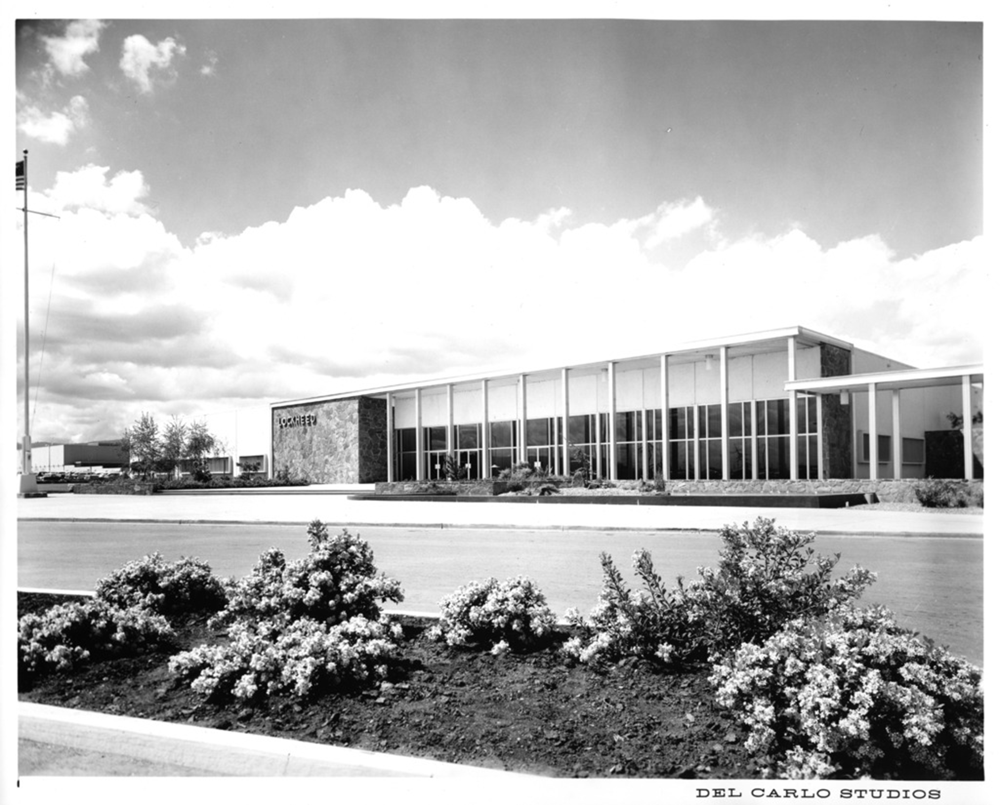
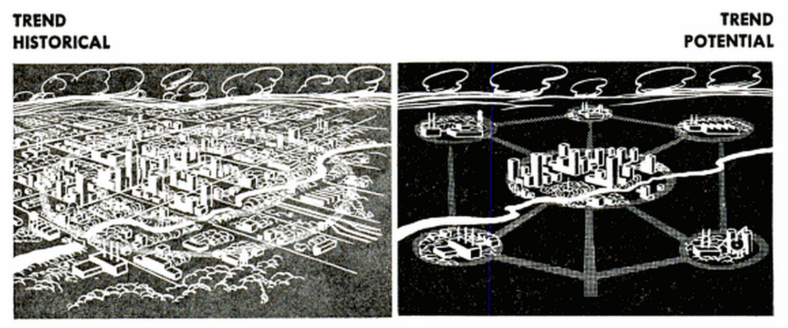
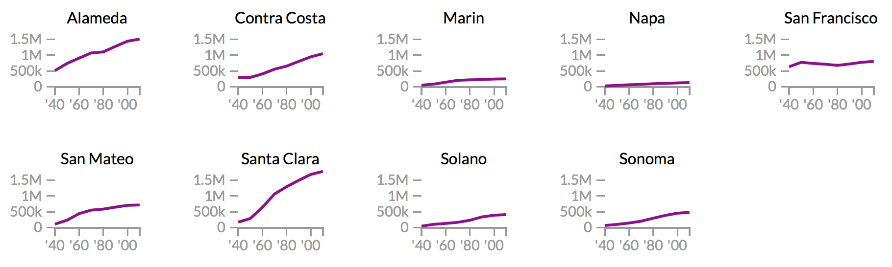
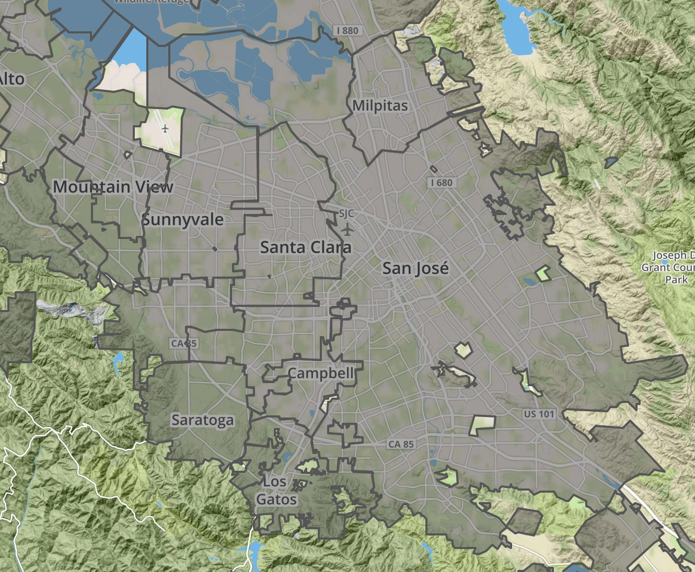

---
author: 
- 'Jason A. Heppler' 
title: | 
  | Chapter 2 
  | The Nature of Business
...

\begin{aquote}{Douglas Coupland, \textit{Microserfs}}
Palo Alto is half bedroom suburb, half futuristic 1970s science fiction movies. . . . The big thing about Palo Alto is that, as a city, it designs tons of incredibly powerful and scarry shit inside its science parks, which are EVERYWHERE.
\end{aquote}

\begin{aquote}{Karl J. Belser, \textit{Planning Progress 1956}}
Hammer in hand, the county went noisily about the job of transforming itself from a rural to a metropolitan community. Bulldozers leveled orchards for thousands of homesites. The steel webbing of new factories spread over former hay fields. Acres of asphalt marked the parking areas of new suburban shopping centers. Service stations sprang up like mushrooms along our major thoroughfares. Fleets of ready--mix trucks disgorged concrete into the foundation forms of every kind of building---in every part of the county.
\end{aquote}

\begin{aquote}{Frederick Terman}
The West has long dreamed of an indigenous industry of sufficient magnitude to balance its agricultural resources. The war advanced these hopes and brought to the West the beginning of a great new era of industrialization. A strong and independent industry must, however, develop its own intellectual resources of science and technology, for industrial activity that depends upon imported brains and second-hand ideas cannot hope to be more than a vassal that pays tribute to its overlords, and is permanently condemned to an inferior competitive position.
\end{aquote}

On Labor Day in 1956 a caravan of 300 moving vans trekked into Santa Clara County carrying the possessions of nearly 600 families and equipment for Lockheed's research labs. One month later, Lockheed's first building on it's 600-acre Sunnyvale campus opened to its employees. Many of the families came from Burbank, California, the home of Lockheed's southern California corporate headquarters, to work in the new missile and space facility established in the northern California city. The experience of Sunnyvale and Lockheed typified the industrial and suburban growth of Santa Clara County. Once a small agricultural market town of 9,829 in 1950, Sunnyvale's population expanded rapidly and housed 52,898 people by 1964. Employment in electronics research and manufacturing expanded just as quickly, rising from less than 3,000 workers in 1940 to 68,000 in 1963.^["Defense Boom: Lockheed Arrived in '56, Leading to Economic Explosion," *San Jose Mercury News*, December 26, 1999; "Lockheed Aircraft: Midpenninsula's Largest Employ," *Palo Alto Times*, February 3, 1960; interview with Jack Balletto, Silicon Genesis Project, Stanford University, 1--3. Lockheed was not alone in its arrival to Santa Clara County in the postwar era, nor was it the first. Hewlett-Packard, Varian Associates, GTE Sylvania, FMC Corp., and Philco Ford all established operations for space, electronics, and telecommunications research and manufacturing prior to 1956.] Among the sells given to these companies was the Santa Clara County environment. David Beers, whose father worked in the Sunnyvale facility, recalled the Chamber of Commerce brochures ensuring an "all-year garden" and "the most beautiful valleys in the world" that enticed his family's relocation to Sunnyvale.^[David Beers, *Blue Sky Dream*, {PG}.] The convergence of boosterism, climate, environment, and industry defined the contours of Santa Clara County's growth liberalism.

The spatial transformation of agricultural space to industrial space in Santa Clara County resulted from the imaginations of city builders and boosters during the World War II and postwar eras. Coalitions of city builders, merchants, and industrialists imagined a modern urban setting of single-family homes, separation from a dependence on eastern capital, low taxes, the lack of unions, and plenty of space to accommodate the expansion of cities. Homes and work could occur in what historian Robert Self called the "industrial garden" where workers and their homes were in relative proximity to each other and nestled into the garden landscape that erased distinctions between country and city. Through the process of defining the countryside in the suburbs, boosters relied on California's climate, environment, and landscape to pitch their vision of the modern city.

\thoughtbreak{The introduction of the military economy} in the Santa Clara Valley transformed the landscape in the Santa Clara Valley. The market towns of Palo Alto, Sunnyvale, Mountain View, and San Jose had grown up around agricultural commodities and supporting their production, processing, and distribution. City officials encouraged the construction of city infrastructure to support activity in the hinterlands, including roadways and sewers, and such decisions largely reflected the desires and interests of farmers.

The transition to defense industries began prior to the attacks at Pearl Harbor in 1941. A decade before, the City of Sunnyvale purchased a 1,000 acre parcel of farmland against the San Francisco Bay and sold the land to the Navy for running dirigibles. The newly created Naval Air Station Moffett Field remained relatively dormant until April 1942, when the base was used for staging antisubmarine campaigns and maritime patrols. During the interwar era, scholars at Stanford University initiated research agendas around microwave and radio technology and their military applications.

Historians have warned of granting World War II too much influence in shaping the West Coast. Roger Lotchin in particular suggests that defense-related industries in Southern California and elsewhere in the West show that World War II had less impact than assumed. Rather, World War II was a continuation of policies underway well before the war and the benefits of federal spending to cities were largely the result of unintended consequences. With that in mind, however, the results of federal activism had deep effects in Santa Clara County's economy and housing markets.^[ [@lotchin1992fortress, 393--420.] For an opposing view, see [@nash1990transformed]; [@nash1990worldwarii]; and [@nash1999landscape.] See also Carl Abbott, *The New Urban America: Growth and Politics in Sunbelt Cities* (Chapel Hill: University of North Carolina Press, 1987), 17--19.] 

World War II introduced seismic shifts in Santa Clara County's cities as political leaders began accommodating land use towards the defense industry. Further north in the Bay, the shipyards and manufacturing facilities in San Francisco and Oakland absorbed the bulk of new workers migrating to California to work in defense industries. Between 1940 and 1950, western states led the country in population growth. ^[[@white1991misfortune, 507].] The production of agriculture still remained Santa Clara County's dominant contribution to the war effort. Federal spending in defense further tied the west's burgeoning educational and high-technology industries to the desires of the federal government. California, Arizona, Washington, Kansas, Utah, and Colorado were among the top ten states for high-tech jobs. San Diego led the way in California, supporting nearly 215,000 people in 1957. The military became a constant and visible presence in the defense-dependent cities of the West.^[ [@abbott1995frontier, 60--61]; Lotchin, "The City and the Sword Through the Ages and the Era of the Cold War," in *Essays on Sunbelt Cities and Recent Urban America*, ed. Robert Fairbanks and Kathleen Underwood (College Station, Tex.: Texas A&M University Press, 1990), 95; [@clayton1967coldwar, 449--473]; Abbott, "The Metropolitan Region," 82-83. See also Gilbert S. Guinn, "A Different Frontier: Aviation, the Army Air Force, and the Evolution of the Sunshine Belt," *Aerospace Historian* 29 (March 1982): 34-45; James Eastman, "Location and Growth of Tinker Air Force Base and Oklahoma City Air Material Area," Chronicles of Oklahoma 50 (Autumn 1972): 326-346; Leonard J. Arrington and Archer L. Durham, "Anchors Aweigh in Utah: The U.S. Naval Supply Depot at Clearfield, 1942-62," *Utah Historical Quarterly* 31 (September 1963): 109-126; Thomas G. Alexander, "Ogden: A Federal Colony in Utah," *Utah Historical Quarterly* 47 (Summer 1979): 291-309; Martin Schiesl, "Airplanes to Aerospace: Defense Spending and Economic Growth in the Los Angeles Region, 1945-60," in Lotchin, ed., *Martial Metropolis*, 135-150; Stephen B. Oates, "NASA's Manned Spacecraft Center at Houston, Texas," *Southwest Historical Quarterly* 67 (January 1964): 350-375.]

The Cold War policy of industrial dispersion exerted influence on the design and location of industrial centers. Fears of a potential "total war" with the Soviet Union prompted officials in Washington to pursue industrial dispersion as an official policy. The dispersal of industry first appeared in federal legislation in the National Security Act of 1947, which created the National Security Resources Board (NSRB) charged with locating the strategic location of industries, services, governmental, and economic activities deemed essential to national security.^[[@omara2005cities, 29.]] A presidential order issued by Harry Truman in August 1951 ordered the movement of government agencies "out of dense urban cores" and specifically noted the policy's importance to "the dispersal of new and expanding industries." The dispersal policy encouraged the movement of industry to "areas adjacent to industrial or metropolitan districts in all sections of the country." Such areas needed to be ten to twenty miles from a potential nuclear ground zero. The dispersal of industry to suburban areas meant fulfilling the policy directives while also maintaining proximity to employees, manufacturing facilities, and the infrastructure of central cities. According to the policy of dispersal, the suburb was the ideal industrial area.^["National Dispersal Program Forecast by President Statement," *Bulletin of the Atomic Scientists* (September 1951): 263--279; [@omara2005cities, 28--38]; [@jackson1985crabgrass, 249.]]

The national policy of dispersal aligned with the desires of business. Throughout the nation, industrial leaders expressed concern about inner cities and pointed to dispersion as a potential solution to what they identified as urban problems, especially entrenched unions, high taxes, and an aging infrastructure. To a speech before the San Francisco Bay Area Council, San Francisco's director of city planning noted that "it is more than a great piece of good fortune for city planners that policies which best serve the nation's security are also best for urban development. . . . We claim that this is good for our people and economical for our industry and business."^[Quoted in [@omara2005cities, 33.]] Just as the federal government endorsed non-urban cores as ideal locations for defense-related industry, business leaders were already looking to relocate their facilities beyond major American cities. Industry no longer developed in central cities as it historically had. Rather, industrial manufacturing sought cheaper and more spacious outlying lands that had adequate space for parking, loading facilities, and room for plant expansions. Industries also sought more amenable work environments. City ordinances in the middle of the twentieth century began pushing industry to less desirable areas of cities, while simultaneously industrial facilities sought the same amenities as suburbanites: a pleasant environment, suburban design, distance from urban problems, and lower taxes, while remaining in proximity to city services and infrastructure.^[[@findlay1993magic, 120]; Santa Clara County, Calif., Planning Department, "Directory of Industrial Parks and Industrial Districts in Santa Clara County," *InfoCommentary: Industrial Districts* 1 (January 1966): 1; Robert E. Boley, "Rx for Successful Industrial Park Development," *Urban Land* 26 (June 1967): 3; Victor Roterus, *Planned Industrial Parks: A Case Study* (Washington, DC, 1960), 3-4.]

<!--
While the Cold War's military economy exerted its influence on business, changes in urban planning also introduced shifts to the Bay Area's cities. Cities became lower-density and dispersed, {FACT}.
-->

World War II and the location of defense industries along the West Coast drew thousands of new residents to California in search of jobs after a decade of economic depression.^[On the mid-century migration to California, see [@gregory1989okie]. On the effects of World War II on the American West, see [@nash1999landscape]; [@abbott1995frontier, chapter 1]; [@lotchin1993worldwarii]; [@lotchin1992fortress.]] Between 1940 and 1947, the nine counties of the Bay Area became home for 676,000 more people, 330,000 new jobs, and $2.5 billion more in annual income.^[[@omara2005cities, 103.]] The burgeoning Cold War science complex added an additional influx of people and capital to the region. In 1950, Santa Clara County counted 800 factory workers, which jumped to 264,000 manufacturing workers and more than 3,000 electronics firms by 1980.^[[@abbott2008cities, 181]. U.S. Bureau of the Census, 1960 Census, Santa Clara County, n.d., census.abag.ca.gov; U.S. Bureau of the Census, 1970 Census, Santa Clara County, n.d., census.abag.ca.gov; U.S. Bureau of the Census, 1980 Census, Santa Clara County, n.d., census.abag.ca.gov.] The county towns grew rapidly during and after World War II as middle-class families moved to the area to take advantage of new defense and related industries. Menlo Park, located in the southern end of San Mateo County, grew from a town of 3,000 to 27,000 between 1940 and 1960, while Palo Alto grew from under 17,000 to 52,000 in the same period. 

In the years after World War II, scientific funding by the federal government rose rapidly that helped spur new industrial activity centralized around defense and military applications. In 1955, federal expenditures on basic research topped $286 million, a figure that jumped to $693 million by 1960 and, just five years later, topped $1.6 *billion*. The total research and development budget of the federal government had grown from eight percent to twelve percent in ten years.^[[@omara2005cities, 47.]] Along the Peninsula, cities sought out new ways to attract defense industries to the area in order to capitalize on defense research contracts. Bay Area governmental associations, such as the Bay Area Council (BAC), sought to make California an industrial center not by replicating the industrial Northeast or Midwest but by promoting new industries.^[[@omara2005cities, 106.]]

Bay Area city leaders chased corporate recruitment and grew their economies as other cities faced decline. The Rust Belt in particular, once an industrial powerhouse, began its steady decline in the postwar era while western towns once peripheral to the American industrial economy began to rise. The Sunbelt in particular succeeded in attracting tremendous levels of population, industry, and federal funding.

Regional electronics manufacturing in the Bay Area grew quickly. The Western Electronics Manufacturers Association listed twenty members in the Bay Area in 1951; by 1953 it counted fifty-three, and by 1974 listed eight-hundred and employed around 150,000 people. The bulk of new manufacturers created products for the Department of Defense and NASA. Between 1952 and 1968, electronics firms made at least half of their annual incomes from sales to the federal government for military and space programs.^[G. Bylinsky, "California's Great Breeding Ground for Industry," *Fortune Magazine* (June 1974): 133, 128-129, 130; [@findlay1993magic, 145.]] Desires on the part of NASA and the Pentagon for compact systems of missile and rocket guidance as well as wars in Korea and Vietnam and the space race, electronics equipment accounted for as much as twenty percent of the cost of an aircraft and thirty percent of the cost for missiles. While southern California built the aircrafts, northern California provided the electrical components.^[*Blue Sky Metropolis: The Aerospace Century in Southern California*, ed. Peter Westwick; [@findlay1993magic, 143-144]; Albert Shapero, Richard  Howell, and James R. Tombough, *An Exploratory Study of the Structure and Dynamics of the R&D Industry* (Menlo Park, Calif., 1964), 23-25; Saxenian, "The Genesis of Silicon Valley," 27; Siegel and Markoff, *High Cost of High Tech*, 8-9.]

\thoughtbreak{World War II and the postwar years} witnessed an explosion in the population of northern California. San Francisco, Oakland, and Berkeley, the traditional urban centers in northern California, had seen their populations rise during the war years, but in the postwar years populations began moving to the suburbs. Out of the nine counties of the Bay Area, Santa Clara County ranked first in the size of its population increase. Throughout the 1940s the population of Santa Clara County nearly doubled, and by the mid-1950s, nearly 4,000 new people were moving to the county every month. The county's 1950 population of 290,547 people exploded to 642,365 by 1960, surpassing San Francisco as the region's urban center. The arrival of so many people in a short amount of time led to subdivisions spreading throughout the Valley.^[Belser, *Planning Progress 1956*, 2; U.S. Bureau of the Census, *1960 Census*, Santa Clara County, n.d., census.abag.ca.gov; U.S. Bureau of the Census, *1970 Census*, Santa Clara County, n.d., census.abag.ca.gov; U.S. Bureau of the Census, *1980 Census*, Santa Clara County, n.d., census.abag.ca.gov.]

 

The rapid rise of the Bay Area followed a wartime and postwar trend throughout the American West. New opportunities in western cities after a decade of economic depression led migrants to metropolitan areas to take jobs in wartime industries in the 1940s. The American West especially felt the impact of this shift, leading urban historian Carl Abbott to remark that the migration led "the entire West into a half-century of head-long urbanization."^[[@abbott1995frontier, 4.]] Western metropolitan areas---Dallas, San Francisco, San Jose, Denver, Albuquerque---became centers of new economies based on high technology, services, tourism, and recreation.^[On the metropolitan West, see [@abbott2008cities]; [@abbott1995frontier]. See also [@gomez2000golden]; [@fogelson1967fragmented]; [@isselcherny1982sanfrancisco]; [@wileygottleib1982empires].] The region that Bernard DeVoto once described as a "plundered province" had become an economic pacesetter in the latter twentieth century, propelled by world war, new economic pursuits, demographic shifts, and federal funding.^[Bernard DeVoto, "The West: A Plundered Province," *Harper's Magazine* 169 (August 1934), 355--364. On the West and World War II, see [@nash1999landscape]. Additional work on World War II and the postwar West include [@shragge1994federalcity, 333--361]; [@clayton1967coldwar, 449--473]. See also [@lotchin1992fortress] and [@lotchin2003badcity].]

Encouraging the arrival of a new base of industry and residents were tireless city boosters. While city leaders had grown wary of agriculture as a core economy activity, especially after the Depression plummeted farm incomes to historic lows, they held onto the imagery of the countryside for their cities. A booster campaign initiated by Palo Alto in 1930 emphasized the city's pleasant climate, proximity to Stanford University, sport and recreation, and good health, framed by photographs of well-tended landscapes, scenic valley vistas, and towering coastal redwoods. A campaign run by San Jose around the same time likewise pointed to the Bay Area's blossoms, ideal climate, "sylvan setting[s] for picturesque home[s]," and described the county as "a 60-mile long Garden."^["Palo Alto, California: Home of Stanford University," Palo Alto Chamber of Commerce, ca. 1930, Folder 19, Box 41, Arbuckle Research Files, California Reading Room, San Jose Public Library; "The Valley of Heart's Delight," San Jose Chamber of Commerce, ca. 1922, Folder 7, Box 58, Arbuckle Research Files, California Reading Room, San Jose Public Library.] 

Climate alone not only shaped the recreational and domestic life for Santa Clara County's boosters. The same amenities mattered for industry. San Jose made special note of the "great industrial and manufacturing opportunities" of the Santa Clara Valley, all made possible by the "favorable living conditions, varied natural resources, ample transportation facilities, cheap potential power, low overhead costs, and highly intelligent labor supply," along with San Francisco serving as a "logical distribution center for the Pacific Coast and foreign markets." San Jose also pointed to the advantages of its neighbors, including Sunnyvale as "the shipping center of the west side of the valley," Saratoga and it's "world-famous . . . annual Blossom Festival," and Mountain View and it's "steadily growing in population and commercial importance."^["The Valley of Heart's Delight," San Jose Chamber of Commerce, ca. 1922, Folder 7, Box 58, Arbuckle Research Files, California Reading Room, San Jose Public Library.] In a 1948 promotional video distributed by the San Jose Chamber of Commerce, the city emphasized to industry they would have little problem finding "desirable sites for space for future expansion . . . on the widespreading outskirts of San Jose," while highlighting the presence of San Jose Steel, General Electric, AMES, and Moffett Airfield. "In this county of home lovers, gardens really flourish," the Chamber's video emphasized, "and job opportunities flourish, too, attracting citizens to take pride in establishing a finer type of community life."^["Valley of Heart's Delight," video recording, San Jose Chamber of Commerce (Three Crown Productions, 1948).] 

If Santa Clara County was idealized as a place, it was also a political project. By the 1950s, cities took advantage of New Deal era personal consumption and local efforts to attract consumers and capital to the county. These themes contained in promotional material suggested the central message emerging from the municipal campaigns. Seen through promotional material and the pages of national magazines, Santa Clara County was a remarkable place for outdoor living, individual lifestyle choices, and industrial opportunities. The representation mattered because place mattered. The reputation as a place of clear skies, cozy weather, beautiful landscapes, open space, cheap homes, middle-class jobs, and opportunity attracted "quality of life" residents. Climate and environment shaped the sell of the Valley, cast as an opportune situation for domestic life, recreation, and business. 

Wartime meant prosperity for the peninsula's businesses, but postwar reconversion shook the confidence of Peninsula businessmen. From the offices of city halls and businesses throughout the Midpeninsula, businessmen and political leaders worried about their futures. They wanted to avoid seeing their cities fall back into agricultural pursuits, with its limited possibilities for expansion and tax base, while manufacturing located elsewhere. From their perspective, the small tax base and seasonal agricultural business was no way to build a modern, western metropolis. The establishment of the Bay Area Post-War Planning Committee as well as several local postwar planning committees in San Francisco and Oakland attempted to maintain wartime industries. They envisioned cities as business friendly, rich with amenities, benefiting from important universities, providing a bounty of recreational opportunities for homeowners, and key sites for investment of federal dollars in scientific research, development, and manufacturing.^[[@findlay1993magic, 143.]] Amid national debates about the reduction of reducing wartime spending the Midpeninsula's businessmen, promoters, and political leaders looked locally to maintain their prosperity.^[Cohen, *Consumer's Republic*, 98--114; [@self2003babylon, 61--95].] Starting in the 1940s, they "reformed" municipal government and reoriented their policies towards attracting new business.^[Scholars have various referred to these organized businessmen as "community power structures," "civic-commercial elites," and "growth machines" in places like Phoenix, Arizona's "Charter Government" and Dallas, Texas' "Citizens Charter Association." Needham, *Power Lines*, ch. 3; Molotch, "The City as a Growth Machine"; Molotch and Logan, *Urban Fortunes*; Kruse, *White Flight*, ch. 1; Lassiter, *The Silent Majority*; Shermer, *Sunbelt Capitalism*.] What these leaders shared was a vision: local control of municipal government aided by the injection of massive federal funding aimed at promoting new defense-related research. Maintaining a "climate for business" to attract public and private sectors to the county became a guiding principal as a means of promoting municipal expansion.

\thoughtbreak{San Jose's vision of metropolitan expansion began before} the end of World War II. Up until the 1940s, San Jose and nearby towns promoted their agricultural productivity by sponsoring festivals such as the "Blossom Tours." But in the mid-1940s, an ambitious group of young merchants, lawyers, industrialists, and property owners endorsed the importance of metropolitan expansion in order for the city to achieve the greatness they felt it deserved. The political machinery of San Jose was controlled by the taxi service operator and political boss Charlie "Boss" Bigley and City Manager C. B. Goodwin. Goodwin and Bigley became targets as their critics charged that the leadership failed to entice new industries to the city and help stabilize an economy built on the instability of agriculture and seasonal employment. The 1944 election gave opponents of Bigley and Goodwin an opening. When six of the seven city council seats opened for election, opponents led by businessmen Harvey Claude Miller and Louis Oneal, formed the "Progress Committee" and put up a slate of candidates to capture the vacated council seats.^[Jessica Trounstine argues that "municipal formers organized groups of concerned citizens into party-like coalitions that slated candidates. These organizations were much less structured than the hierarchical coalitions in machine cities, but they served a similar purpose." Trounstine, *Political Monopolies in American Cities*, 102.] The Progress Committee candidates accused Bigley, Goodwin, and the city council of jeopardizing San Jose's future. Voters, and the newspaper, agreed. Aided by the newspaper's endorsement, six members of the Progress Committee---among them the key business and political figures Al Ruffo, Ernest Renzel, Ben Carter, Jim Lively, Roy Rundle, and Fred Watson---secured seats on the city council as "reform" candidates. Lacking the majority on the council to directly fire the manager, the Progress Committee amended the city's charter requiring city managers to stand for biennial approval by the citizens. The Committee further weakened the power of entrenched officials by reducing the city council member's terms from six year to four year terms. By the end of the 1940s, Goodwin would be out of office, and the Progress Committe also ousted the antireform manager that replaced Goodwin, John Lynch.^["No Decision Made on New City Manager," *San Jose Mercury*, May 13, 1946; [@trounstine1982movers, 87]; [@mandich1975sanjose, 44-47]; Clyde Arbuckle, *San Jose*, 44; Trounstine, *Political Monopolies in American Cities*, 103.]

With the Progress Committee secured in city government, the new city council's immediate plans aimed to attract industry to San Jose. With subsidies from city and county government, the Chamber of Commerce began a $60,000 advertising campaign that lured the industries of Food Machinery and Chemical Corporation, already a local to the area, International Business Machines, General Electric, Pittsburgh Steel, Owens-Corning, and Kaiser. The city undertook the construction of its first airport and passed a $1,700,000 bond to construct new sewers. Some of their initiatives fell under criticism when, in 1946, a fellow member called the committee "reactionaries" and accused them of selling municipal land to companies well below market value. Others in city government disagreed with plans for the private ownership of water infrastructure, arguing instead for municipal ownership. The Progress Committee, along with the newspaper, silenced such criticism with accusations of socialism.^["City Extends West Border, Annexes Tract," *San Jose Mercury News*, n.d.; "Food Machinery Bids $140,000, Retains Site," *San Jose Mercury News*, n.d.; [@trounstine1982movers, 88]; [@mandich1975sanjose, 47--49].]

The Progress Committee set to bring their vision for San Jose to life, but had to overcome a major obstacle: the voters. The Progress Committee sought many things for San Jose to make the city an attractive place for industry and workers, including construction of an airport, a deep water port in the north of the city, and improved sewers, streets, and storm drains. The infrastructure projects required the approval of city voters, who approved or disapproved general obligation bonds that allowed the city to borrow money long-term with low interest rates. These bonds were often paid for through increases on property taxes, a maneuver most voters opposed, and benefited developers. Bonds were repeatedly voted down during the interwar years, even as the city attempted to deal with its unique problem of sewage and cannery effluence. Voters refused to give in even as the state of California declared the city in violation of pollution regulations in 1948.^[[@trounstine1982movers, 88].]

<!--
While local funds were important, they were not alone in helping San Jose build itself. The city needed capital from Sacramento and Washington as well. {TODO: Expand further on this. What funds? For what projects?} 
-->

Party                     1950    1948    Gain/Loss
-----------------------   ------  ------  ---------
Republican                50,774  41,800  + 8,974
Democratic                59,042  46,220  + 12,822
Progressive               53      41      + 12
Prohibition               106     97      + 9
Socialist                 42      48      - 6
Townsend                  19      36      - 17
Independent Progressive   266     45      + 221
Communist                 2       4       -2

Table: Party Affiliations in San Jose, 1948 and 1950. *San Jose Mercury News*, March 23, 1950.

The Progress Committee dissolved shortly after their victory, but their pro-growth ideology remained entrenched in San Jose politics for the next three decades. Several of the members of the committee remained in city government for the next two decades. The combination of the population boom and the booster ethos of the city council fueled a political culture that was accommodating to business and favorable towards developers. To fund such growth the city needed long-term, low-interest bonds that required approval by the city's voters, whose property taxes helped pay back the loans. Since the days of the Progress Committee, San Jose city leaders faced reluctant voters who continually refused to fund general obligation bonds. But with the city's rapidly expanding population and attendant needs to support the newcomers---mainly, infrastructure that included roads, utilities, and sewers---the city needed to find someone to convince voters to support the measures they believed necessary for San Jose's growth. The city council found that person in Anthony P. "Dutch" Hamann. Hamann epitomized San Jose's postwar pro-growth outlook. The forty-year-old former businessman, teacher, and oil company representative had a strong attachment to the city and solid connections throughout the community.^[[@trounstine1982movers, 89]; Arbuckle, *San Jose*, 44-45. Hamann had graduated from the University of Santa Clara and played on the same football team as Councilman Al Ruffo.] Hamann had not served in political office until his appointment by the city council in 1950 in a split 4--to--3 vote. As the city began its drive for urban growth, Hamann hoped to avoid the fate that had befallen his home of Orange County in Southern California with its many competing medium-sized cities. Hamann believed that a large city could better manage urban development and growth than several small towns all looking out for their own interests. He wanted San Jose to dominate the county, and thus avoid what he saw as petty competition among small towns.^["Hamann: San Jose's Growth Guru," *San Jose Mercury*, 1999.] To grow and make available the funds to sustain growth, Hamann reasoned, the city needed to annex land to raise revenue from taxes.^[[@matthews2003dreams, 96.]] "You don't build a city by staying in a vacuum," Hamann declared. "You build, you sell. . . . And I was the gun for hire."^[Hamann quoted in [@trounstine1982movers, 96].]

And build San Jose did. The city approved over 1,400 annexations between 1945 and 1970 including many narrow strips---"shoestring" annexations---snaking outward, sometimes only on one half of a street, to capture a desirable subdivision, commercial center, or street intersection. In some areas, annexations became a tool of coercion. Annex enough areas around land-owning hold-outs, city officials reasoned, and pockets of non-annexed land would have little choice but to succumb.^["Annexations by Year", 2011, City of San Jose Planning Division; "City Size by Year", 2011, City of San Jose Planning Division; Belser, *Planning Progress 1956*, 47; [@trounstine1982movers, 93]; "Correcting San Jose's Boomtime Mistake," *Business Week*, September 19, 1970, 74; Stanford Law Review, *San Jose*, 5.] Hamann's drive for land became so aggressive that his staff became known as "Dutch's Panzer division"---named after the swift motorized armored tank squadrons of the Third Reich---as annexations sprawled outward from the city core.^[[@trounstine1982movers, 93].] "They say San Jose is going to become another Los Angeles," Hamann rebuked his critics. "Believe me, I'm going to do the best in my power to make that come true."^[Stanford Law Review, *San Jose*, 17.] Under Hamann's tenure, the San Jose Chamber of Commerce spent nearly $1 million to attract new industries to the city. The population boomed and the city sprawled. "It was just growth, growth, growth," Al Ruffo, San Jose's mayor in the 1940s, recalled approvingly. "That was everybody's song. And Dutch sang it the loudest."^["Hamann: San Jose's Growth Guru," *San Jose Mercury*, 1999.]

San Jose's pro-growth contingent received enthusiastic support from the city's newspaper, the *San Jose Mercury*, and its new manager, Joseph Ridder. The Ridder family newspaper empire owned several large publications in the United States, including the *St. Paul Dispatch*, *Duluth Herald*, *Manhattan's Journal of Commerce*, and the *Seattle Times*. When the family of Everis Hayes sold the morning *News* and evening *Mercury* in 1952 after the paper owner's death, the Ridders purchased the newspaper.^["The Ridders Buy Again," *Time*, August 4, 1952.] Joe Ridder was sent to manage the new daily paper and redefined the paper's pro-growth mission, saying that he hoped to make the *Mercury News* "not only among the best newspapers on the Pacific Coast but a vital and constructive force in the development of San Jose and its territory."^[*San Jose Mercury*, July 1952, quoted in [@trounstine1982movers, 89]; [@abbott1995frontier, 40].] When asked why he was so enthusiastic about San Jose's growth, Ridder responded: "Trees don't read newspapers."^[Quoted in Stanford Law Review, *San Jose*, 17.]

The newspaper unabashedly promoted San Jose's growth. In 1956 it published a special series called "Metropolitan San Jose---Progress Town U.S.A."---the same year that San Jose christened itself the "City of Progress"---detailing the various changes in the city that the paper took as signs of progress.^["Metropolitan San Jose---Progress Town U.S.A.," *San Jose Mercury*, January 15, 1956.] Residential growth, home ownership, and widespread annexations were among its favorites. The paper applauded the arrival of "new plants bearing some of the biggest names in the nation's business," the "highly diversified farming" of the region, the "educational, recreational and cultural benefits" the city offered, and the growth of retail, outlets, and store chains.^["Metropolitan San Jose---Progress Town U.S.A.," *San Jose Mercury*, January 15, 1956.] The *Mercury News* praised the industrial diversification of the city and its promise of "year-round employment and production" instead of the seasonal (and uncertain) employment found in the agricultural industries. A town less reliant on agriculture meant avoiding economic dips, more opportunities for employment and education, and additional wealth.^["Diversification Gives Solid Balance to Area," *San Jose Mercury*, January 15, 1956.] The *Mercury News*' emphasis on the shifting economic center of the city was important as, over time, the paper devoted less and less space to agricultural news. The paper argued for the importance of the "irreplaceable asset" of farmland and the greenbelts that the land provided urban areas, but continued to promote urban developers, subdivisions, and industry flowing into the city.^["Greenbelts Protect Irreplaceable Asset," *San Jose Mercury*, January 15, 1956.] The amount of page space devoted to agricultural news steadily declined and, as early as 1950, columnist Dorothy Thompson could bemoan farm subsidies as a "program [that] has produced preposterous inequities" without insulting a majority of readers.^[Dorothy Thompson, "Farm Price Program Real Mess," *San Jose Mercury*, April 7, 1950; Alpert, "Valley of Heart's Delight," 37.] By 1960, farm news covered only two pages of the newspaper. While agriculture still accounted for $200 million to the county's economy---canning, packing, drying---the figure was rapidly falling as high tech industry overtook the central economic activity of the county. By 1976 the farm editor and farm section disappeared from the newspaper entirely.^[Alpert, "Valley of Heart's Delight," 44--45.]

The San Jose Chamber of Commerce also helped pave the way for business. Between 1950 and 1965, the San Jose Chamber of Commerce spent $1,000,000 publicizing the city.^[[@trounstine1982movers, 92].] As the *Mercury* reported in 1956, the 

> San Jose Chamber of Commerce, increasingly a dominant force in Santa Clara
> County growth because it has long since left behind its restrictive
> limitation of serving only the City of San Jose, is not content to let
> 'natural resources' of land availability, good labor supply, key
> transportation services and growth potential 'pull' new industries here.
> Active contact with potential industrial neighbors is kept up to date with
> personal visits, servicing requests for technical information, location of
> possible plant sites and a nationwide advertising campaign that has proven
> highly effective.^["Chamber Vital to Growth in Valley Areas," *San Jose Mercury* January 15, 1956.]

\noindent The industrial campaigns helped pull industry to the city. By the mid-1950s, San Jose was home to IBM and General Electric, and neighboring cities included DuPont, Pittsburgh-Des Moines Steel, Monsanto Chemical, Levi Strauss, Owens-Illinois Glass, Owens Corning Fiberglass, Food Machinery Corporation, Lockheed, and Ford Motor Company.^["Santa Clara County---Scene of the Big Boom," *San Francisco Chronicle*, May 11, 1952; Belser, *Planning Progress 1956*, 1.] The city attracted the attention of the *New York Times* as early as 1947, who declared the Bay Area an industrial center of the West.^["Eastern Industry Going Westward," *New York Times*, March 2, 1947.] By the end of the 1950s, hundreds of new factories were built in the city.^[Belser, *Planning Progress 1956*, 1--2.] Between 1944 and 1962, companies invested more than $290 million into new plants.^[Santa Clara Chamber of Commerce, "Industrial Introduction to the City of Santa Clara," 1964, Santa Clara City Library.]

The city's political coalition of businessmen, newspaper publishers, real estate developers, and the Chamber of Commerce allowed the political machinery to pursue growth. Widespread annexation became an avenue for development, provided the city with a broad tax base of industrial, residential, and commercial land, gave itself more power over surrounding cities, and allowed San Jose's leaders think about the city as a regional powerhouse.

\thoughtbreak{Carved out of the southeast corner of Stanford University's} vast land holdings on the San Francisco Peninsula, the Stanford Industrial Park became the epicenter of specialized manufacturing and research activities in the northern end of the county. By the 1960s Stanford Industrial Park had gained a reputation for industrial and technological innovation that would be mimicked around the country.^[[@luger1991garden, 154]; [@abbott1995frontier, 61--68].] Like many other American colleges and universities throughout the nation, Stanford sought to capitalize on the burgeoning science and technology opportunities in order to fashion itself as a leader in academic research and become a powerful influence in the new industrial age in the American West. As the U.S. Government pursued Cold War scientific research and development programs, places like Stanford Industrial Park fostered specialized science-based industries. The process of industrial recruitment at Stanford reflected an alternative form of land development versus cities like San Jose, but played a key role in shaping the Valley's urban form and political responses to it.  

The establishment of Stanford Industrial Park emerged from the confluence of several postwar trends: rapid suburbanization, the Cold War impetus for federal research and development, and the need for Stanford to diversify its finances. The Board of Trustees approved a plan to lease land to high technology companies in 1951 and quickly gained a reputation as a favorable site for burgeoning electronics companies. Roughly five percent of Santa Clara County's workforce was employed in high technology or research and development in 1951 (compared to 9.4% in the US as a whole), and by 1986 the workforce reached twenty percent (compared to 8.5% in the US).^[[@luger1991garden, 130].]

Stanford actively pursued close ties with business after World War II. As early as 1945, University President Donald Tressider remarked he "hope[d] that in the postwar period Stanford will draw very much closer to business and industry than it has in the past---by means of cooperative undertakings we hope to develop more and more projects in which both the University and business will have a legitimate stake."^[Quoted in [@omara2005cities, 106.]] In the postwar era, university officials and faculty supported the expansion of the business/university relationship. Among the most enthusiastic supporters of recruiting and supporting the new economy was Frederick Terman, the university's first dean of engineering and, later, provost. Terman had spent the war years in Cambridge, Massachusetts, studying radar projects under Vannevar Bush. Terman saw first-hand cooperative programs between MIT and businesses like General Electric, AT&T, and other firms on the front edge of high technology. When he came to Stanford after the war, he used what he learned to begin building a new research agenda for the university. The growing availability of federal research money meant support for the university's pursuit of academic reputation in addition to becoming a key player in Cold War research in a process Terman referred to as "steeple building." By 1948, Stanford established a traveling-wave tube research program, supported Stanford alumni Russell and Sigurd Varian in founding their microwave tube company, encouraged faculty consulting with businesses, arranged for university instructors to teach courses for businesses, and established an honors program to allow employees to earn a degree from the university while working full-time. ^[ [@omara2005cities, 106--110.]; Gillmor, *Fred Terman at Stanford*; [@findlay1993magic, 122--125]; [@leslie2000angel, 48--67]; [@lowen1997creating, chapter 4]; [@leslie1996selling, 437--440]. Timothy Sturgeon warns against giving Frederick Terman too much credit in the creation of Silicon Valley. He argues for extending Silicon Valley's history backward from Varian and HP's founding, suggesting that electronics manufacturing in the Bay Area played a key role in the fields of radio, television, and military electronics before World War II. Sturgeon, "How Silicon Valley Came to Be," in *Understanding Silicon Valley* 16.]

While Frederick Terman worked to cement relationships between the university and business, Alf Brandin developed the land. Hired in 1946 to serve as the university's business manager, the 33-year-old Stanford alum quickly set to convincing people about the value of developing Stanford's lands. Brandin recalled wondering before World War II "why didn't we do something with our land? We could lease it out." What was missing was metropolitan growth. "The war changed all that," he recalled. "After the war we then had an opportunity to do something." The University also needed to do something as rising land values and rising property taxes threatened to eat into Stanford's income. The open lands on Stanford were subject to "unrelated business income" taxes, whether those lands were grazing, farming, or office space. Stanford officials feared a future of paying high taxes without a high enough return on rents to cover the costs. Furthermore, the university felt threatened by urban renewal programs whereby local governments could claim unused land for public services. Faced with the potential of condemned land and high taxes, Brandin sought ways to encourage the university to develop its lands for more income.^[Stanford Oral History Project, transcript of interview with Alf Brandin, ca. 1980, 30--31, Stanford University Archives. Margaret O'Mara notes that Stanford University was a 501(c)(3) organization subject to the Unrelated Business Income Taxes (UBIT). Stanford was paying roughly $700,000 in property taxes in 1968. [@omara2005cities, 111 and 265, fn. 46.] See also, "A Look at Stanford Lands Program---Past, Future," *Palo Alto Times*, March 4, 1960; "Questions and Answers About Stanford Land Use," *Campus Report Supplement*, January 1971, Folder 16, Box 1, Page Mill Coordinating Committee Records, Stanford University Archives.] 

Stanford's additional motivations for pursing the creation and growth of the Industrial Park included finances. The university faced financial dilemma by 1950, and hoped that the Industrial Park could become a money-making venture to support the university. In the years prior, returning veterans of World War II, aided by the GI Bill, brought a wave of new students to the university. Stanford's income peaked in 1946-1947, when income from tuition amounted to sixty percent of the university's income. By 1952, despite raising tuition, income  from student tuition fell to 47 percent. Between 1940 and 1950 income from endowment fell from 29 percent to 16 percent of total income in general for private universities nationwide, figures that were similar to Stanford's own.^[[@lowen1997creating, 150]; "Questions and Answers About Stanford Land Use," *Campus Report Supplement*, January 1971, 1, Folder 16, Box 1, Page Mill Road Coordinating Committee Records, Stanford University Archives.] The pursuit of land development projects and federal grants and contracts proved to be a lucrative business. In the 1950s Stanford's income rose from less than $2 million in 1951 to over $8.3 million by 1960, the bulk of which came from Department of Defense and Atomic Energy Commission grants.^[[@omara2005cities, 109.]] Stanford lands prior to the land development program initiated by Brandin were leased to farmers and ranchers, ideal tenants for hinterlands so far from urban centers. While the rents from agricultural income were modest, in the postwar era they were not enough for Stanford to continue its reliance. Facing diminishing class sizes, falling tuition income, and declining alumni donations, the university needed to pursue alternative sources of income.

To further cement the relationship with the university and business, Terman helped established two educational programs. Starting with the Honors Cooperative Program that allowed employees of surrounding electronics companies to study part-time towards a master's degree at Stanford, and later with the Industrial Affiliates Program, which allowed companies pre-publication access to scientific and technical military-sponsored research. The two educational programs sought to benefit both industry and the university and strengthen the ties between the two.^[[@lowen1997creating, 130--131].] The cooperative program also proved lucrative to Stanford through the payment of tuition. As Terman recalled, the honors cooperative brought in more students that essentially "paid double tuition, because the company made a matching payment equal to the tuition and this brought extra money," particularly to the engineering department. Furthermore, the location of nearby firms on Stanford lands also resulted in generous gifts to the university. "We're getting about as much from the gifts from those technical companies as you're getting from the lease income," Terman told Brandin. "Alf Brandin saw the point very quickly, and very soon thereafter, if you weren't a high-technology company, you had a hell of a time coaxing him to give you a lease."^[Terman oral history, 127.]

Stanford sought to aid its land development plans by establishing a campus planning office after the war. In 1947, the university hired Lewis Mumford to study how the university could best use its land. The university, he suggested, should use some of its open space for "housing developments to serve the staff and faculty" and suggested parcels suitable for industrial development. But Mumford argued that the land's most suitable use went towards academic purposes or kept as open land, not subdivided along its borders for housing.^[Mumford quoted in [@omara2005cities, 112.]] The university, however, largely ignored Mumford's advice to concentrate urban development and retain the "rural setting" of the university. The draw of suburban development was too desirable for Stanford to resist. In 1953, the university commissioned the San Francisco architectural firm Skidmore, Owings, and Merrill to suggest land use plans and the economic potentials for its development. They developed the 1953 Master Plan that emphasized an "integrated community." Thinking of the area as a suburb of San Francisco, the plan emphasized high-income housing rather than "small, attractive, light industry plants" but noted that the high income housing areas in San Mateo and Santa Clara counties "do not want heavy industries." These industries were especially attractive to homeowners if they "relieve their residential tax load," but the firm also cautioned the university to think carefully about how it used the land, concluding that Stanford preserve the "present character of the entire suburb area."^[[@omara2005cities, 112--115]; Skidmore, Owings, and Merrill, *Master Plan for Stanford Lands 1953: Report to the Board of Trustees, Stanford University* (San Francisco, 1953), Land Development, General file, Stanford University Archives.]

While the firm's study was useful to Stanford planners, the university ultimately rejected the suggestions of the firm. The Advisory Committee on Land and Building Development wrote to University President Wallace Sterling that the university needed to focus on attracting "a wide variety of national and regional activities which have a direct and immediate value to the University." Such activities revolved around industry.^[Stanford University Advisory Committee on Land and Building Development, "Master Plan for the Stanford Lands: A Review of the Skidmore, Owings, and Merrill Report," June 1, 1954, Land Use and Development file, Stanford University Archives, 2-5, 7-9.] One source of frustration with Skidmore, Owings, and Merrill was its view that the Peninsula was a commuter suburb of San Francisco rather than an economic center. Furthermore, Skidmore, Owings, and Merrill's recommendations followed the "growth-is-good" philosophy of urban planning common in the 1950s. Had the university followed their plans, most open space on the Stanford lands would have been subdivided into housing projects. The firm concluded that up to 6,000 of Stanford's 9,000 acres be devoted to residential subdivisions, with only 350 acres given to industrial and commercial uses. Such views went against the philosophy of Stanford administrators, who not only wanted to pursue industrial development but also hoped to maintain the amenity-rich quality of the university.^[[@omara2005cities, 114.]] 

After rejecting the Skidmore, Owings, and Merrill plan, university administrators decided to pursue high-end housing, a regional shopping center, and the industrial park. Alf Brandin led the way in pursuing the university's land development projects, starting with the shopping center on the north end of the campus. Observing that shoppers commuted to San Francisco to spend their earnings at the high-end shopping center of Stonestown, Brandin saw an opportunity. "Why make everybody go to San Francisco to shop?" he wondered. "Why don't we bring some San Francisco down here?" Brandin, with the support of the real estate banker Colter Coldwell, presented plans to the Stanford Board of Trustees of a regional high-end shopping center that would house the likes of Penney's, Macy's, Emporium, and Roos Brothers. The Board signed off on the project in 1951. As an income-generating idea, the shopping center paid off handsomely. Between 1951 and 1970, the university earned $1.8 million off rents, sales percentages, and interest.^[Brandin oral history, 32; [@omara2005cities, 115.] The shopping center alone covered Stanford's property taxes. In 1960--1970, the university paid $835,000 in property taxes to Palo Alto and Menlo Park. "Questions and Answers About Stanford Land Use," *Campus Report Supplement* (January 1971): 5, Folder 16, Box 1, Page Mill Coordinating Committee Papers, Stanford University Archives.] 

\newpage

Year  Industrial Park     Shopping Center     Other Incomes     Total
----  ---------------     ---------------     -------------     ----------
1954  $3,000              N/A                 $4,000            $7,000
1955  30,000              N/A                 7,000             37,000
1956  117,000             255,000             8,000             380,000
1957  164,000             489,000             58,000            711,000
1958  156,000             510,000             35,000            701,000
1959  296,000             585,000             88,000            969,000
1960  351,000             639,000             121,000           1,111,000
1961  406,000             607,000             120,000           1,133,000
1962  465,000             654,000             172,000           1,291,000
1963  568,000             694,000             201,000           1,463,000
1964  594,000             712,000             204,000           1,510,000 
1965  636,000             736,000             223,000           1,595,000
1966  796,000             797,000             220,000           1,813,000
1967  827,000             713,000             184,000           1,724,000
1968  907,000             778,000             305,000           1,990,000
1969  1,024,000           779,000             377,000           2,180,000

Table: Stanford Net Income from Land Use, 1954--1969. "Stanford University Land Use Policy/Plan," *Campus Report Supplement* March 29, 1971, Folder 16, Box 1, Page Mill Coordinating Committee Papers, Stanford University Archives.

\newpage

By the mid-1950s, Stanford lands around the regional shopping center were opened to residential developers. Sterling, Terman, and other Stanford administrators espoused a vision for the Stanford lands that sought to build a community where "work, home, recreation, and cultural life are brought together with some degree of balance and integration," outlining a planned vision for the university and surrounding communities.^[Quoted in [@omara2005cities, 115.]] Stanford began its residential development plans by opening up lands in Menlo Park for single-family homes on the north side of campus marketed to Stanford faculty and alumni. In 1957, the university initiated the "Stanford Hills" development, where upscale homes cost between $33,000 and $75,000 and lots ranged from one-quarter-acre to five acres in size. "Enjoy Peninsula Living at its Best," read an advertisement for the Stanford Hills subdivision in 1959. "All homes INDIVIDUALLY PLANNED for the most discriminating buyers. . . . You, too, can now join our 'Who's Who'."^[Quoted in [@omara2005cities, 118.]] In 1959, Stanford continued its role as real estate developer with the expansion of residential suburbs into the Willow Creek Apartments, which developer Howard White described as "luxury apartments" responding to "innumerable requests on the Peninsula for true apartment living in a country setting."^[Quoted in [@omara2005cities, 118.]]

Two years after the university broke ground for the shopping center, the first tenants of the Stanford Industrial Park began moving into the original 100 acres set aside for industrial development. Varian Associates, who had outgrown their original space in San Carlos in San Mateo County, provided the opportunity for the Industrial Park's establishment. Russell Varian had developed the Klystron tube at Stanford and worked under Terman at Harvard during World War II. He maintained those close ties to Stanford. Returning to the Bay Area with his brother, Sigurd, after the war, they founded Varian Associates in 1948 to continue their work in applied physics. When they began looking for new space for their expanding facilities, Russell Varian went to Alf Brandin first. Varian was followed shortly by Eastman Kodak and Hewlett-Packard, the company founded by former Terman students William Hewlett and David Packard. ^["Varian: Pioneer from A (accelerators) to V (vacuum pumps)," *Palo Alto Times*, March 2, 1960; Terman oral history, 127; [@findlay1993magic, 129---141].]

Stanford's reputation helped attract potential tenants, but so did its innovations in industrial park design. Stanford administrators drew up strict design guidelines that tenants had to follow. These designs often reflected Stanford's own architectural aesthetics of red-tile roofs and adobe-style exteriors. "Everyone thought of smokestacks," Brandin recalled. "These new people who came out from the east and settled here thought, 'Don't change it. We just left all the smoke and all that junk. Don't change this.'" Stanford planners attempted to make the park-like belief into a reality, regulating that parking lots be located behind buildings and landscaped in a way to screen off anything that might appear unsightly. Any architectural modifications had to be approved by the University, while firms also had to maintain the cleanliness of their grounds. The appearance of greenery was of paramount importance. As Brandin later plainly stated, "this was going to be a park."^[Brandin oral history, n.p. [58].] Setbacks from the road allowed firms to maintain lawns and landscaping to provide a green atmosphere. New tenants were required to submit plans detailing off-street parking, green space, roads, setbacks, location, and the type of industry. Open spaces had to cover at least 60% more than the space occupied by buildings, and no buildings could rise higher than two stories. The university forbade smokestacks and prohibited noise, odor, and emissions that might disturb the area's neighbors. The open, lush, low-rise and architecturally appealing design of the industrial Park also helped provide support from the surrounding suburban communities, ensuring that none of the manufacturing facilities would interfere with the neighboring affluent suburbs.^[Palo Alto Planning Commission, *Report on the Interim General Plan* (Palo Alto, April, 1955), 42--43; [@findlay1993magic, 131]; [@omara2005cities, 119--120.]] 

Stanford never ran short of potential tenants attracted to the suburban design of the park and its proximity to university researchers. The university privileged those companies working in high technology and medicine---and thus contributed to Stanford's educational and research programs---and welcomed several companies to the park, including Eastman Kodak, Varian Associates, Hewlett-Packard, Syntex Pharmaceutical, and Lockheed Missiles. The park expanded quickly as its reputation grew. In 1955, only seven tenants occupied fifty-three acres of the Industrial Park. By 1962 the number had jumped to forty-two tenants occupying 360 acres (around half of the available space) and employed 11,000 people. By 1970, the number of tenants had reached fifty, occupied 500 acres, and employed 17,000 people. The rents generated tremendous profits for the university, by 1978 reaching an annual profit of $4.3 million, while also generating another $13.5 million in tax revenue and utility payments for the city of Palo Alto.^[City of Palo Alto, Calif., *Palo Alto Comprehensive Plan, 1977-1990* (Palo Alto, 1976), 15; [@findlay1993magic, 140].] The "electronics-nuclear space-age . . . is accelerating the transformation of the Palo Alto area into one of the country's most important national defense facilities," wrote *The Tall Tree*, the publication of the Palo Alto Chamber of Commerce, in 1958. "The Palo Alto-Stanford research community has grown to become an integral part of the science community of the nation."^["The First Fifty Years of Electronics Research," *The Tall Tree* 1:9 (May 1958), 3, FF Palo Alto History, SC 486, 90-052, Stanford University Archives.]

<!--
To Stanford's chagrin, however, most commercial activity in the early postwar period located elsewhere on the Peninsula. The majority of commercial development around Stanford remained retail and services industries.^[O'Mara, *Cities of Knowledge*, 107.] If Stanford was to become the center of a new western economy and leading research center, they needed to pursue new industries. They found those industries by pursing government funds for science-based research and partnering with technology firms emerging in the area.
-->

Applying the pastoral isolation of the university and a design tradition meant to suburbanize office space allowed the university to pursue industrial growth that seemed qualitatively different from other industries in the country. So successful had Stanford been in its designs that a newspaper editorial remarked in 1960 that "the research centers of the Midpeninsula, with their architectural buildings and landscaped lawns, look more like college structures than factories. In fact, I've seen many college buildings, and attended classes in a few, that resembled those factories of old more than do the industrial plants of today."^[Quoted in [@omara2005cities, 118.] ] The *Saturday Evening Post* even referred to Stanford's land program as "a model city" and the *Los Angeles Times* described the Industrial Park as "fast taking on the appearance of a fully integrated city."^[[@omara2005cities, 127.]] By the end of the 1960s, the Stanford Industrial Park had become a worldwide model of economic development, exemplified by the tours given to Charles de Gaulle, the Japanese Diet, Nikita Khrushchev, and it's featuring at the World's Fair in Brussels in 1958. Stanford and the surrounding communities represented something new, innovative, and worth replicating---a modern vision of cities for the space age.

\thoughtbreak{San Jose and Stanford typified the emergence} of the modern West: a region less reliant on what economist Thomas Michael Power called "folk economics" and more reliant on postindustrial economies of tourism, service, and technology.^[Power, *Lost Landscapes and Failed Economies*, 19-21.] The economic shift meant a cultural shift as well. As farmland, pastures, and ranches became subdivisions, technology companies, research firms, and service industries, the new economic activity began to reshape how people thought about the Valley. Namely, the expansion of industry carried with it a contentious debate about the effects of industrialization on the Valley's landscape and over how it would be shaped.^[On postwar suburban growth, see  [@jackson1985crabgrass]; [@fishman1987bourgeois, 155--181]; [@abbott1995frontier].] Appeals to nature, environment, and climate formed a core selling point for boosters on the Midpeninsula, and the expectation of industry as clean made the sell easier for suburbanites. Manufacturing in the Stanford Industrial Park had "to be clean, no smoke, no heavy manufacturing," Brandin later said. "Light manufacturing that is clean and electronic. . . . We wanted to put [high-tech companies] in a park-like atmosphere." The perception of high technology's "greenness" formed a core component of the booster's assurance to the new white-collar middle-class that the industrial and manufacturing activity of the Valley would be distinct and different from the Rust Belt's smokestacks and pollution. Building the reputation of "clean" meant aesthetics, however, not necessarily the cleanliness of industry. But the appearance of suburban offices led to a regional political consensus that valued and encouraged industrial growth, hailed as a sign of progress and modern. Yet by the early 1960s a widening range of growth critics began questioning the environmental, economic, political, and racial consequences to growth.  

<!--By the late 1950s residents in Palo Alto began seeing the Industrial Park as a threat to their suburban lifestyles, especially visible through increased traffic, industrial development of the foothills, contributions to air and noise pollution, and rising housing costs. -->

<!--
\thoughtbreak{While individual localities continued to pursue business} interests, county-wide programs also served to entice business to the area. Most prominently, county government played a key role in securing water and land for the industrial valley. Utilities became prominent hammers in the booster toolkit, and almost none among them were as important as water.

The boosters also considered annexation essential to industrialization. Promotional literature often highlighted the rapid population growth of the Valley, assuring investors that the cities were booming areas where they could invest. Boosters, as we saw above, also convinced themselves that annexations became a useful way for increasing the city's coffers through taxes and consumer sales by securing well-off, middle-class neighborhoods. Peninsula cities were convinced that greater territory meant greatness for their city. But their attitudes were practical as well. Hamann worried about cities surrounded by rings of small, isolated, self-governing cities that could potentially block San Jose's ambitions.
-->

\newpage

## Tables

Table: Sunbelt Population and Territorial Growth, 1940

City          1940 Land Area (sq mi)    1940 Population
------------  ----------------------    ---------------
Albuquerque   11                        35,449
Austin        25.1                      87,930
Dallas        40.6                      294,734
Denver        57.9                      332,412
Fort Worth    49.8                      177,662
Houston       72.8                      384,514
Los Angeles   448.3                     1,504,277
Phoenix       9.7                       65,414
San Diego     95.3                      203,341
San Jose      14.8                      68,457

\newpage

Table: Sunbelt Population and Territorial Growth, 1950

City          1950 Land Area (sq mi)    1950 Population
------------  ----------------------    ---------------
Albuquerque   47.9                      96,815
Austin        32.1                      132,459
Dallas        112                       434,462
Denver        66.8                      415,786
Fort Worth    93.7                      278,778
Houston       160                       596,163
Los Angeles   450.9                     1,970,358
Phoenix       17.1                      106,818
San Diego     99.4                      334,387
San Jose      17                        95,280

\newpage

Table: Sunbelt Population and Territorial Growth, 1960

City          1960 Land Area (sq mi)    1960 Population
------------  ----------------------    ---------------
Albuquerque   58                        201,189
Austin        45                        186,545
Dallas        254                       679,684
Denver        68                        493,887
Fort Worth    138                       356,268
Houston       321                       938,219
Los Angeles   455                       2,479,015
Phoenix       187                       439,170
San Diego     195                       573,287
San Jose      56                        204,196

\newpage

Table: Sunbelt Population and Territorial Growth, 1970

City          1970 Land Area (sq mi)    1970 Population
------------  ----------------------    ---------------
Albuquerque   82.2                      243,751
Austin        72.1                      255,869
Dallas        265.6                     844,303
Denver        95.2                      514,678
Fort Worth    205                       844,303
Houston       433.9                     1,253,479
Los Angeles   463.7                     2,811,801
Phoenix       247.9                     589,016
San Diego     316.9                     697,027
San Jose      136.2                     461,212

\newpage

Table: Sunbelt Population and Territorial Growth, 1980

City          1980 Land Area (sq mi)    1980 Population
------------  ----------------------    ---------------
Albuquerque   95.3                      332,920
Austin        116                       345,544
Dallas        333                       904,074
Denver        110.6                     492,686
Fort Worth    240                       904,074
Houston       556                       1,595,167
Los Angeles   464.7                     2,968,528
Phoenix       324                       789,704
San Diego     320                       875,538
San Jose      158                       629,400
