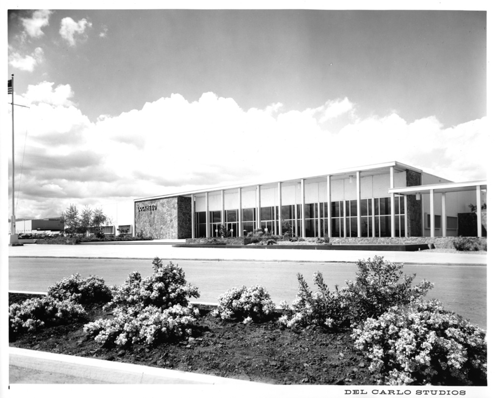
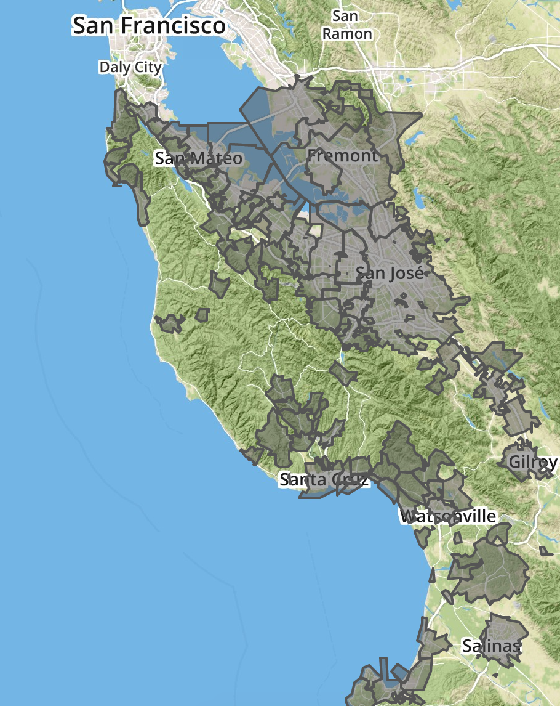
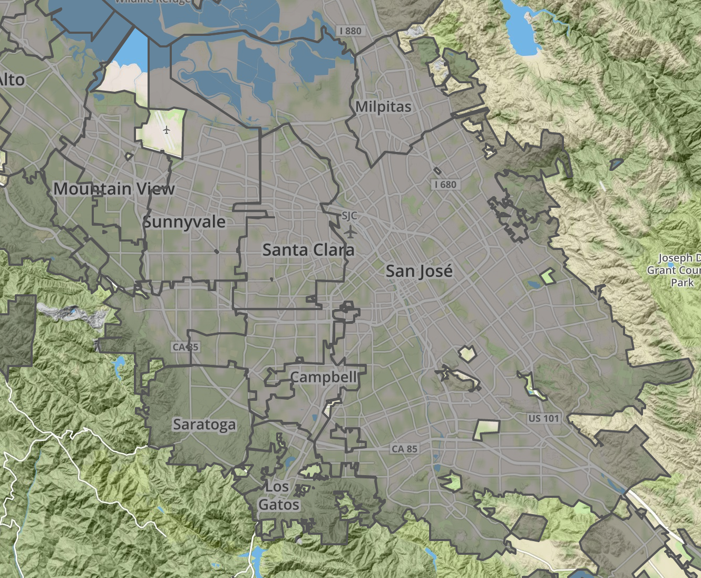

---
author: 
- 'Jason A. Heppler' 
title: | 
  | Chapter 2 
  | The Nature of Business
  | Boosterism, Industrial Recruitment, and Growth Politics
...

\begin{aquote}{Douglas Coupland, \textit{Microserfs} (1995)}
Palo Alto is half bedroom suburb, half futuristic 1970s science fiction movies. . . . The big thing about Palo Alto is that, as a city, it designs tons of incredibly powerful and scarry shit inside its science parks, which are EVERYWHERE.
\end{aquote}

\begin{aquote}{Frederick Terman, 1963}
Universities are rapidly developing into more than mere places of learning. They are becoming major economic influences in the nation's industrial life, affecting the location of industry, population growth, and the character of communities. Universities are in brief a natural resource just as are raw materials, transportation, climate, etc.
\end{aquote}

\begin{aquote}{Karl J. Belser, \textit{Planning Progress 1956}}
Hammer in hand, the county went noisily about the job of transforming itself from a rural to a metropolitan community. Bulldozers leveled orchards for thousands of homesites. The steel webbing of new factories spread over former hay fields. Acres of asphalt marked the parking areas of new suburban shopping centers. Service stations sprang up like mushrooms along our major thoroughfares. Fleets of ready--mix trucks disgorged concrete into the foundation forms of every kind of building---in every part of the county.
\end{aquote}

On Labor Day in 1956 a caravan of 300 moving vans trekked into Santa Clara County carrying the possessions of nearly 600 families and equipment for Lockheed's research labs. One month later, Lockheed's first building on it's 600-acre Sunnyvale campus opened to its employees. Many of the families came from Burbank, California, the home of Lockheed's corporate headquarters, to work in the new missile and space facility established in the northern California city. But the suburban dream that lured Lockheed workers to Santa Clara County were not open to all. Ocie Tinsley, who had joined Lockheed in the late 1960s, found himself living in hotels for two months while his white coworkers immediately found single-family homes.^[Ruffin, *Uninvited Neighbors*, p. 275, n. 62.] The experience of Sunnyvale and Lockheed typified the industrial and suburban growth of Santa Clara County. Once a small agricultural market town of 9,829 in 1950, Sunnyvale's population expanded rapidly and housed 52,898 people by 1964. Employment in electronics research and manufacturing expanded just as quickly, rising from less than 3,000 workers in 1940 to 68,000 in 1963.^["Defense Boom: Lockheed Arrived in '56, Leading to Economic Explosion," *San Jose Mercury News*, December 26, 1999; "Lockheed Aircraft: Midpenninsula's Largest Employ," *Palo Alto Times*, February 3, 1960; interview with Jack Balletto, Silicon Genesis Project, Stanford University, 1--3. Lockheed was not alone in its arrival to Santa Clara County in the postwar era, nor was it the first. Hewlett-Packard, Varian Associates, GTE Sylvania, FMC Corp., and Philco Ford all established operations for space, electronics, and telecommunications research and manufacturing prior to 1956.] David Beers, whose father worked in the Sunnyvale facility, recalled the Chamber of Commerce brochures ensuring an "all-year garden" and "the most beautiful valleys in the world" that enticed his family's relocation to Sunnyvale.^[David Beers, *Blue Sky Dream*, {PG}.]

The spatial transformation of agricultural space to industrial space in Santa Clara County resulted from the imaginations of city builders and boosters during the World War II and postwar eras. Coalitions of city builders, merchants, and industrialists imagined a modern urban setting of single-family homes, separation from a dependence on eastern capital, low taxes, the lack of unions, and plenty of space to accommodate the expansion of cities. Homes and work could occur in what historian Robert Self called the "industrial garden" where workers and their homes were in relative proximity to each other and nestled into the garden landscape that erased distinctions between country and city. Through the process of defining the countryside in the suburbs, boosters relied on California's climate, environment, and landscape to pitch their vision of the modern city.

\thoughtbreak{The introduction of the military economy} in the Santa Clara Valley transformed the landscape in the Santa Clara Valley. The market towns of Palo Alto, Sunnyvale, Mountain View, and San Jose had grown up around agricultural commodities and supporting their production, processing, and distribution. City officials encouraged the construction of city infrastructure to support activity in the hinterlands, including roadways and sewers, and such decisions largely reflected the desires and interests of farmers.

The transition to defense industries began prior to the attacks at Pearl Harbor in 1941. A decade before, the City of Sunnyvale purchased a 1,000 acre parcel of farmland against the San Francisco Bay and sold the land to the Navy for running dirigibles. The newly created Naval Air Station Moffett Field remained relatively dormant until April 1942, when the base was used for staging antisubmarine campaigns and maritime patrols. During the interwar era, scholars at Stanford University initiated research agendas around microwave and radio technology and their military applications.

World War II introduced seismic shifts in Santa Clara County's cities as political leaders began accommodating land use towards the defense industry. Further north in the Bay, the shipyards and manufacturing facilities in San Francisco and Oakland absorbed the bulk of new workers migrating to California to work in defense industries.^[Between 1940 and 1950, western states led the country in population growth. White, *"It's Your Misfortune"*, 507]. The production of agriculture still remained Santa Clara County's dominant contribution to the war effort. Federal spending in defense further tied the west's burgeoning educational and high-technology industries to the desires of the federal government. California, Arizona, Washington, Kansas, Utah, and Colorado were among the top ten states for high-tech jobs. San Diego led the way in California, supporting nearly 215,000 people in 1957. The military became a constant and visible presence in the defense-dependent cities of the West.^[Abbott, *Metropolitan Frontier*, 60-61; Lotchin, "The City and the Sword Through the Ages and the Era of the Cold War," in *Essays on Sunbelt Cities and Recent Urban America*, ed. Robert Fairbanks and Kathleen Underwood (College Station, Tex.: Texas A&M University Press, 1990), 95; @clayton1967coldwar: 449--473; Abbott, "The Metropolitan Region," 82-83. See also Gilbert S. Guinn, "A Different Frontier: Aviation, the Army Air Force, and the Evolution of the Sunshine Belt," *Aerospace Historian* 29 (March 1982): 34-45; James Eastman, "Location and Growth of Tinker Air Force Base and Oklahoma City Air Material Area," Chronicles of Oklahoma 50 (Autumn 1972): 326-346; Leonard J. Arrington and Archer L. Durham, "Anchors Aweigh in Utah: The U.S. Naval Supply Depot at Clearfield, 1942-62," *Utah Historical Quarterly* 31 (September 1963): 109-126; Thomas G. Alexander, "Ogden: A Federal Colony in Utah," *Utah Historical Quarterly* 47 (Summer 1979): 291-309; Martin Schiesl, "Airplanes to Aerospace: Defense Spending and Economic Growth in the Los Angeles Region, 1945-60," in Lotchin, ed., *Martial Metropolis*, 135-150; Stephen B. Oates, "NASA's Manned Spacecraft Center at Houston, Texas," *Southwest Historical Quarterly* 67 (January 1964): 350-375.]

The Cold War policy of industrial dispersion exerted influence on the design and location of industrial centers. Fears of a potential "total war" with the Soviet Union prompted officials in Washington to pursue industrial dispersion as an official policy. The dispersal of industry first appeared in federal legislation in the National Security Act of 1947, which created the National Security Resources Board (NSRB) charged with locating the strategic location of industries, services, governmental, and economic activities deemed essential to national security.^[O'Mara, *Cities of Knowledge*, 29.] A presidential order issued by Harry Truman in August 1951 ordered the movement of government agencies "out of dense urban cores" and specifically noted the policy's importance to "the dispersal of new and expanding industries." The dispersal policy encouraged the movement of industry to "areas adjacent to industrial or metropolitan districts in all sections of the country." Such areas needed to be ten to twenty miles from a potential nuclear ground zero. The dispersal of industry to suburban areas meant fulfilling the policy directives while also maintaining proximity to employees, manufacturing facilities, and the infrastructure of central cities. According to the policy of dispersal, the suburb was the ideal industrial area.^["National Dispersal Program Forecast by President Statement," *Bulletin of the Atomic Scientists* (September 1951): 263--279; @omara2005cities, 28-38; @jackson1985crabgrass, 249.]

The national policy of dispersal aligned with the desires of business. Throughout the nation, industrial leaders expressed concern about inner cities and pointed to dispersion as a potential solution to what they identified as urban problems, especially entrenched unions, high taxes, and an aging infrastructure. To a speech before the San Francisco Bay Area Council, San Francisco's director of city planning noted that "it is more than a great piece of good fortune for city planners that policies which best serve the nation's security are also best for urban development. . . . We claim that this is good for our people and economical for our industry and business."^[Quoted in O'Mara, *Cities of Knowledge*, 33.] Just as the federal government endorsed non-urban cores as ideal locations for defense-related industry, business leaders were already looking to relocate their facilities beyond major American cities. Industry no longer developed in central cities as it historically had. Rather, industrial manufacturing sought cheaper and more spacious outlying lands that had adequate space for parking, loading facilities, and room for plant expansions. Industries also sought more amenable work environments. City ordinances in the middle of the twentieth century began pushing industry to less desirable areas of cities, while simultaneously industrial facilities sought the same amenities as suburbanites: a pleasant environment, suburban design, distance from urban problems, and lower taxes, while remaining in proximity of city services and infrastructure.^[@findlay1993magic, 120; Santa Clara County, Calif., Planning Department, "Directory of Industrial Parks and Industrial Districts in Santa Clara County," *InfoCommentary: Industrial Districts* 1 (January 1966): 1; Robert E. Boley, "Rx for Successful Industrial Park Development," *Urban Land* 26 (June 1967): 3; Victor Roterus, *Planned Industrial Parks: A Case Study* Washington, DC, 1960), 3-4.]

<!--
While the Cold War's military economy exerted its influence on business, changes in urban planning also introduced shifts to the Bay Area's cities. Cities became lower-density and dispersed, {FACT}.
-->

World War II and the location of defense industries along the West Coast drew thousands of new residents to California in search of jobs after a decade of economic depression.^[On the mid-century migration to California, see @gregory1989okie. On the effects of World War II on the American West, see @nash1999landscape; @abbott1995frontier, chapter 1; @lotchin1993worldwarii; @lotchin1992fortress.] Between 1940 and 1947, the nine counties of the Bay Area became home for 676,000 more people, 330,000 new jobs, and $2.5 billion more in annual income.^[@omara2005cities, 103.] The burgeoning Cold War science complex added an additional influx of people and capital to the region. In 1950, Santa Clara County alone counted 800 factory workers, which jumped to 264,000 manufacturing workers and more than 3,000 electronics firms by 1980.^[@abbott2008cities, 181. U.S. Bureau of the Census, 1960 Census, Santa Clara County, n.d., census.abag.ca.gov; U.S. Bureau of the Census, 1970 Census, Santa Clara County, n.d., census.abag.ca.gov; U.S. Bureau of the Census, 1980 Census, Santa Clara County, n.d., census.abag.ca.gov.] The county towns grew rapidly during and after World War II as middle-class families moved to the area to take advantage of new defense and related industries. Menlo Park, located in the northern end of the county, grew from a town of 3,000 to 27,000 between 1940 and 1960, while Palo Alto grew from under 17,000 to 52,000 in the same period. 

<!--
To Stanford's chagrin, however, most commercial activity in the early postwar period located elsewhere on the Peninsula. The majority of commercial development around Stanford remained retail and services industries.^[@omara2005cities, 107.] If Stanford was to become the center of a new western economy and leading research center, they needed to pursue new industries. They found those industries by pursing government funds for science-based research and partnering with technology firms emerging in the area.
-->

In the years after World War II, scientific funding by the federal government rose rapidly, that helped spur new industrial activity centralized around defense and military applications. In 1955, federal expenditures on basic research topped $286 million, a figure that jumped to $693 million by 1960 and, just five years later, topped $1.6 *billion*. The total research and development budget of the federal government had grown from eight percent to twelve percent in ten years.^[@omara2005cities, 47.] Along the Peninsula, cities sought out new ways to attract defense industries to the area in order to capitalize on defense research contracts. Bay Area governmental associations, such as the Bay Area Council (BAC), sought to make California an industrial center not by replicating the industrial Northeast or Midwest but by promoting new industries.^[@omara2005cities, 106]

Bay Area city leaders chased corporate recruitment and grew their economies as other cities faced decline. The Rust Belt in particular, once an industrial powerhouse, began its steady decline in the postwar era while western towns once peripheral to the American industrial economy began to rise. The Sunbelt in particular succeeded in attracting tremendous levels of population, industry, and federal funding.

Regional electronics manufacturing in the Bay Area grew quickly. The Western Electronics Manufacturers Association listed twenty members in the Bay Area in 1951; by 1953 it counted fifty-three, and by 1974 listed eight-hundred and employed around 150,000 people. The bulk of new manufacturers created products for the Department of Defense and NASA. Between 1952 and 1968, electronics firms made at least half of their annual incomes from sales to the federal government for military and space programs.^[G. Bylinsky, "California's Great Breeding Ground for Industry," *Fortune Magazine* (June 1974): 133, 128-129, 130; @findlay1993magic, 145.]  Desires on the part of NASA and the Pentagon for compact systems of missile and rocket guidance as well as wars in Korea and Vietnam and the space race, electronics equipment accounted for as much as twenty percent of the cost of an aircraft and thirty percent of the cost for missiles. While southern California built the aircrafts, northern California provided the electrical components.^[*Blue Sky Metropolis: The Aerospace Century in Southern California*, ed. Peter Westwick; @findlay1993magic, 143-144; Albert Shapero, Richard  Howell, and James R. Tombough, *An Exploratory Study of the Structure and Dynamics of the R&D Industry* (Menlo Park, Calif., 1964), 23-25; @saxenian1983genesis, 27; Siegel and Markoff, *High Cost of High Tech*, 8-9.]

The massive federal investments into industrial dispersion helped shape space. City builders became eager partners to high-tech capital as they made their way into Santa Clara County. {FACT}

<!-- LET'S MOVE THIS TO THE STANFORD PARK SECTION
The new industries also shaped perceptions about the kind of space they produced. Companies prided themselves on their "greenness," noting their landscaped appearances, concealed parking, 

The perception of high technology's "greenness" formed a core component of the booster's assurance to the new white-collar middle-class that the industrial and manufacturing activity of the Valley would be distinct and different from the Rust Belt's smokestacks and pollution.
-->

\thoughtbreak{World War II and the postwar years} witnessed an explosion in the population of northern California. San Francisco, Oakland, and Berkeley, the traditional urban centers in northern California, had seen their populations rise during the war years, but in the postwar years populations began moving to the suburbs. Out of the nine counties of the Bay Area, Santa Clara County ranked first in the size of its population increase. Throughout the 1940s the population of Santa Clara County nearly doubled, and by the mid-1950s, nearly 4,000 new people were moving to the county every month. The county's 1950 population of 290,547 people exploded to 642,365 by 1960, surpassing San Francisco as the region's urban center. The arrival of so many people in a short amount of time led to subdivisions spreading throughout the Valley.^[Belser, *Planning Progress 1956*, 2; U.S. Bureau of the Census, *1960 Census*, Santa Clara County, n.d., census.abag.ca.gov; U.S. Bureau of the Census, *1970 Census*, Santa Clara County, n.d., census.abag.ca.gov; U.S. Bureau of the Census, *1980 Census*, Santa Clara County, n.d., census.abag.ca.gov.]

The rapid rise of the Bay Area followed a wartime and postwar trend throughout the American West. New opportunities in western cities after a decade of economic depression led migrants to metropolitan areas to take jobs in wartime industries in the 1940s. The American West especially felt the impact of this shift, leading urban historian Carl Abbott to remark that the migration led "the entire West into a half-century of head-long urbanization."^[@abbott1995frontier, 4.] Western metropolitan areas---Dallas, San Francisco, San Jose, Denver, Albuquerque---became centers of new economies based on high technology, services, tourism, and recreation.^[On the metropolitan West, see @abbott2008cities; @abbott1995frontier. See also Athur R. Gomez, *Quest for the Golden Circle: The Four Corners and the Metropolitan West, 1945-1970* (Lawrence: University Press of Kansas, 2000); Robert M. Fogelson, *The Fragmented Metropolis: Los Angeles, 1850-1930* (Cambridge: Harvard University Press, 1967); William Issel and Robert Cherny, *San Francisco, 1865-1932: Politics, Power, and Urban Development* (Berkeley: University of California Press, 1986); Peter Wiley and Robert Gottleib, *Empires in the Sun: The Rise of the New American West* (New York: G. P. Putnam's Sons, 1982).] The region that Bernard DeVoto once described as a "plundered province" had become an economic pacesetter in the latter twentieth century, propelled by world war, new economic pursuits, demographic shifts, and federal funding.^[Bernard DeVoto, "The West: A Plundered Province," *Harper's Magazine* 169 (August 1934), 355--364. On the West and World War II, see Gerald D. Nash, *The Federal Landscape: An Economic History of the Twentieth-Century West* (Tucson: University of Arizona Press, 1999). Additional work on World War II and the postwar West include Abraham Shragge, "'A New Federal City': San Diego During World War II," *Pacific Historical Review* 6 (August 1994): 333--361, 333--361; James Clayton, "The Impact of the Cold War on the Economies of California and Utah," *Pacific Historical Review* 36, no. 4 (November 1967): 449--473, 449--473. See also Roger W. Lotchin, *Fortress California, 1911--1960: From Warfare to Welfare* (New York: Oxford University Press, 1992) and Roger W. Lotchin, *The Bad City in the Good War: San Francisco, Los Angeles, Oakland, and San Diego* (Indiana University Press, 2003).]

Encouraging the arrival of a new base of industry and residents were tireless city boosters. While city leaders had grown wary of agriculture as a core economy activity, especially after the Depression plummeted farm incomes to historic lows, they held onto the imagery of the countryside for their cities. Unlike other Sunbelt towns that recast themselves in the wake of the Great Depression, such as Phoenix's slogan shift from "Salt River Valley" to "Valley of the Sun," cities of the Midpeninsula maintained the image of the Santa Clara Valley as a garden. A booster campaign initiated by Palo Alto in 1930 emphasized the city's pleasant climate, proximity to Stanford University, sport and recreation, and good health, framed by photographs of well-tended landscapes, scenic valley vistas, and towering coastal redwoods. A campaign run by San Jose around the same time likewise pointed to the Bay Area's blossoms, ideal climate, "sylvan setting[s] for picturesque home[s]," and described the county as "a 60-mile long Garden."^["Palo Alto, California: Home of Stanford University," Palo Alto Chamber of Commerce, ca. 1930, Folder 19, Box 41, Arbuckle Research Files, California Reading Room, San Jose Public Library; "The Valley of Heart's Delight," San Jose Chamber of Commerce, ca. 1922, Folder 7, Box 58, Arbuckle Research Files, California Reading Room, San Jose Public Library.] 

Climate alone not only shaped the recreational and domestic life for Santa Clara County's boosters. The same amenities mattered for industry. San Jose made special note of the "great industrial and manufacturing opportunities" of the Santa Clara Valley, all made possible by the "favorable living conditions, varied natural resources, ample transportation facilities, cheap potential power, low overhead costs, and highly intelligent labor supply," along with San Francisco serving as a "logical distribution center for the Pacific Coast and foreign markets." San Jose also pointed to the advantages of its neighbors, including Sunnyvale as "the shipping center of the west side of the valley," Saratoga and it's "world-famous . . . annual Blossom Festival," and Mountain View and it's "steadily growing in population and commercial importance."^["The Valley of Heart's Delight," San Jose Chamber of Commerce, ca. 1922, Folder 7, Box 58, Arbuckle Research Files, California Reading Room, San Jose Public Library.] In a 1948 promotional video distributed by the San Jose Chamber of Commerce, the city emphasized to industry they would have little problem finding "desirable sites for space for future expansion . . . on the widespreading outskirts of San Jose," while highlighting the presence of San Jose Steel, General Electric, AMES, and Moffett Airfield. "In this county of home lovers, gardens really flourish," the Chamber's video emphasized, "and job opportunities flourish, too, attracting citizens to take pride in establishing a finer type of community life."^["Valley of Heart's Delight," video recording, San Jose Chamber of Commerce (Three Crown Productions, 1948).]

If Santa Clara County was idealized as a place, it was also a political project. By the 1950s, cities took advantage of New Deal era personal consumption and local efforts to attract consumers and capital to the county. These central themes contained in promotional material suggested the central message emerging from the municipal campaigns. Through promotional material and the pages of national magazines, Santa Clara County was a remarkable place for outdoor living, individual lifestyle choices, and industrial opportunities. The representation mattered because place mattered. The reputation as a place of clear skies, cozy weather, beautiful landscapes, open space, cheap homes, and opportunity attracted "quality of life" residents. Climate and environment shaped the sell of the Valley, cast as an opportune situation for domestic life, recreation, and business. Yet as we will see in later chapters, the environmental amenities that attracted newcomers were not maintained by city builders as open space, air quality, and recreation all suffered as the cities grew. The result were urban forms that came into conflict with the physical environment and the expectations of residents.

\thoughtbreak{San Jose's ideology of growth traces} itself to the mid-1940s when an ambitious group of young merchants, lawyers, industrialists, and property owners endorsed the importance of urban development in order for the city to achieve the greatness they felt it deserved. The taxi service operator and political boss Charles "Boss" Bigley and City Manager C. B. Goodwin controlled the political machinery of San Jose in the early 1940s. Goodwin and Bigley became targets as their critics charged that the leadership failed to entice new industries to the city and help stabilize an economy built on the instability of agriculture and seasonal employment. The 1944 election gave opponents of Bigley and Goodwin an opening. When six of the seven city council seats were open for election, opponents formed the "Progress Committee" and accused Bigley, Goodwin, and the city council of jeopardizing San Jose's future. Voters, and the newspaper, agreed. Aided by the newspaper's endorsement, six members of the Progress Committee---among them the key business and political figures Al Ruffo, Ernest Renzel, Ben Carter, and Fred Watson---swept the city council elections. They committed themselves to building "a new metropolis in the place of sleepy San Jose." Their first step was to promptly fire the police chief, fire chief, and City Manager Goodwin, charging them with "bossism", "mismanagement", and "political interference."^[Quoted in @trounstine1982movers, 87; @mandich1975sanjose, 44-47; Clyde Arbuckle, *San Jose*, 44.]

With the Progress Committee entrenched in city government, the new city council's immediate plans aimed to attract industry to San Jose. With subsidies from city and county government, the Chamber of Commerce began a $60,000 advertising campaign that lured the industries of Food Machinery and Chemical Corporation, already a local to the area, International Business Machines, General Electric, Pittsburgh Steel, Owens-Corning, and Kaiser. The city undertook the construction of its first airport and passed a $1,700,000 bond to construct new sewers. Some of their initiatives fell under criticism when, in 1946, a fellow member called the committee "reactionaries" and accused them of selling municipal land to companies well below market value. Others in city government disagreed with plans for the private ownership of water infrastructure, arguing instead for municipal ownership. The Progress Committee, along with the newspaper, silenced such criticism with accusations of socialism.^[@trounstine1982movers, 88; @mandich1975sanjose, 47-49.]

The city council worked to bring the Progress Committee's vision to life. The Committee desired to see a new city hall, a deep water port north of the city, improved sewer system, streets, storm drains, and an airport. Building such infrastructure projects required the approval of city voters, who voted on general obligation bonds that allowed the city to borrow money long-term at low interest rates. These bonds were paid for by increases on property taxes---a move voters often opposed. Bonds were repeatedly voted down, even as the city dealt with its unique problem of sewage given its large cannery business. Voters refused to give special treatment to canneries, even when the state of California declared San Jose in violation of pollution regulations in 1948.^[@trounstine1982movers, 88.] The Progress Committee dissolved shortly after their victory, but their pro-growth ideology remained entrenched in San Jose politics for the next three decades.

The combination of the population boom and the booster ethos of the city council fueled a political culture that was accommodating to business and favorable towards developers. To fund such growth the city needed long-term, low-interest bonds that required approval by the city's voters, whose property taxes helped pay back the loans. Since the days of the Progress Committee, San Jose city leaders faced reluctant voters who continually refused to fund general obligation bonds. But with the city's rapidly expanding population and attendant needs to support the newcomers---mainly, infrastructure that included roads, utilities, and sewers---the city needed to find someone to convince voters to support the measures they believed necessary for San Jose's growth. The city council found that person in Anthony P. "Dutch" Hamann. Hamann epitomized San Jose's postwar pro-growth outlook. The forty-year-old former businessman, teacher, and oil company representative had a strong attachment to the city and solid connections throughout the community.^[@trounstine1982movers, 89; Arbuckle, *San Jose*, 44-45.] Hamann had not served in political office until his appointment by the city council in 1950 in a split 4 to 3 vote. As the city began its drive for urban growth, Hamann hoped to avoid the fate that had befallen his home of Orange County in Southern California with its many competing medium-sized cities.^["Hamann: San Jose's Growth Guru," *San Jose Mercury*, 1999.] Hamann believed that a large city could better manage urban development and growth than several small towns all looking out for their own interests. He wanted San Jose to dominate the county, and thus avoid what he saw as petty competition among small towns. To grow and make available the funds to sustain growth, Hamann reasoned, the city needed to annex land to raise revenue from taxes.^[@matthews2003dreams, 96.] "You don't build a city by staying in a vacuum," Hamann declared. "You build, you sell. . . . And I was the gun for hire."^[Hamann quoted in @trounstine1982movers, 96.]

And build San Jose did. The city approved over 1,400 annexations between 1945 and 1970 including many narrow strips---"shoestring" annexations---snaking outward, sometimes only on one half of a street, to capture a desirable subdivision, commercial center, or street intersection. In some areas, annexations became a tool of coercion. Annex enough areas around land-owning hold-outs, city officials reasoned, and pockets of non-annexed land would have little choice but to succumb.^["Annexations by Year", 2011, City of San Jose Planning Division; "City Size by Year", 2011, City of San Jose Planning Division; Belser, *Planning Progress 1956*, 47; @trounstine1982movers, 93; "Correcting San Jose's Boomtime Mistake," *Business Week*, September 19, 1970, 74; Stanford Law Review, *San Jose*, 5.] Hamann's drive for land became so aggressive that his staff became known as "Dutch's Panzer division"---named after the swift motorized armored tank squadrons of the Third Reich---as annexations sprawled outward from the city core.^[@trounstine1982movers, 93.] "They say San Jose is going to become another Los Angeles," Hamann rebuked his critics. "Believe me, I'm going to do the best in my power to make that come true."^[Stanford Law Review, *San Jose*, 17.] Under Hamann's tenure, the San Jose Chamber of Commerce spent nearly $1 million to attract new industries to the city. The population boomed and the city sprawled. "It was just growth, growth, growth," Al Ruffo, San Jose's mayor in the 1940s, recalled approvingly. "That was everybody's song. And Dutch sang it the loudest."^["Hamann: San Jose's Growth Guru," *San Jose Mercury*, 1999.]

San Jose's pro-growth contingent received enthusiastic support from the city's newspaper, the *San Jose Mercury*, and its new manager, Joseph Ridder. The Ridder family newspaper empire owned several large publications in the United States, including the *St. Paul Dispatch*, *Duluth Herald*, *Manhattan's Journal of Commerce*, and the *Seattle Times*. When the family of Everis Hayes sold the morning *News* and evening *Mercury* in 1952 after the paper owner's death, the Ridders purchased the newspaper.^["The Ridders Buy Again," *Time*, August 4, 1952.] Joe Ridder was sent to manage the new daily paper and redefined the paper's pro-growth mission, saying that he hoped to make the *Mercury News* "not only among the best newspapers on the Pacific Coast but a vital and constructive force in the development of San Jose and its territory."^[*San Jose Mercury*, July 1952, quoted in @trounstine1982movers, 89; @abbott1995frontier, 40.] When asked why he was so enthusiastic about San Jose's growth, Ridder responded: "Trees don't read newspapers."^[Quoted in Stanford Law Review, *San Jose*, 17.]

The newspaper unabashedly promoted San Jose's growth. In 1956 the paper published a special series called "Metropolitan San Jose---Progress Town U.S.A."---the same year that San Jose christened itself the "City of Progress"---detailing the various changes in the city that the paper took as signs of progress.^["Metropolitan San Jose---Progress Town U.S.A.," *San Jose Mercury*, January 15, 1956.] Residential growth, home ownership, and widespread annexations were among its favorites. The paper applauded the arrival of "new plants bearing some of the biggest names in the nation's business," the "highly diversified farming" of the region, the "educational, recreational and cultural benefits" the city offered, and the growth of retail, outlets, and store chains.^["Metropolitan San Jose---Progress Town U.S.A.," *San Jose Mercury*, January 15, 1956.] The *Mercury News* praised the industrial diversification of the city and its promise of "year-round employment and production" instead of the seasonal (and uncertain) employment found in the agricultural industries. A town less reliant on agriculture meant avoiding economic dips, more opportunities for employment and education, and additional wealth.^["Diversification Gives Solid Balance to Area," *San Jose Mercury*, January 15, 1956.] The *Mercury News*' emphasis on the shifting economic center of the city was important as, over time, the paper devoted less and less space to agricultural news. The paper argued for the importance of the "irreplaceable asset" of farmland and the greenbelts that the land provided urban areas, but continued to promote urban developers, subdivisions, and industry flowing into the city.^["Greenbelts Protect Irreplaceable Asset," *San Jose Mercury*, January 15, 1956.] The amount of page space devoted to agricultural news steadily declined and, as early as 1950, columnist Dorothy Thompson could bemoan farm subsidies as a "program [that] has produced preposterous inequities" without insulting a majority of readers.^[Dorothy Thompson, "Farm Price Program Real Mess," *San Jose Mercury*, April 7, 1950; @alpert2010sjmn, 37.] By 1960, farm news covered only two pages of the newspaper. While agriculture still accounted for $200 million to the county's economy---canning, packing, drying---the figure was rapidly falling as high tech industry overtook the central economic activity of the county. By 1976 the farm editor and farm section disappeared from the newspaper entirely.^[@alpert2010sjmn, 44--45.]

San Jose's rapid growth came with a price. Nearby towns attempted to protect themselves from becoming part of the city. In the 1950s, suburban governments proliferated in the Bay Area. For various reasons, towns were not willing partners in San Jose's growth and instead sought strict economic regulations within their boundaries in order to control the development and character of their municipalities. Some cities used incorporation as one method for protecting themselves from San Jose's sprawling annexations. Campbell became a city in 1952, followed by Milpitas in 1954, Cupertino in 1955, and Saratoga in 1956.^["Hamann: San Jose's Growth Guru," *San Jose Mercury*, 1999.] County-wide, between 1952 and 1957 seven cities incorporated, doubling the number of municipalities in the county.^[Cavin, "Borders of Citizenship," 491.]

In other cases, cities found themselves resisting attempts at municipal consolidation.^[Consolidation and annexation are very different issues. Consolidation means the joining of two independent municipalities; annexation means the expansion of municipal boundaries to control unincorporated land.] Alviso, located to the north of San Jose at the southern tip of the San Francisco Bay, was an incorporated city long desired by civic leaders in San Jose. City leaders valued Alviso for two particular reasons. The first, San Jose desired access to the San Francisco Bay for the location of a deep water port, a dream the city had held on to since the late 1800s.^[Land-locked San Jose began looking to Alviso's port as early as 1895. In the 1930s, the city was so certain it would control the port that it prematurely released a pamphlet boasting of the "San José Deep Water Port." In 1958, the city's Master Plan still mentioned their goal of a deep water port located in Alviso. See Cavin, "Borders of Citizenship," 323; "Trip on Alviso Channel," *San Francisco Call*, August 30, 1895; San Jose City Planning Commission, *Master Plan of the City of San Jose*, 50.] Second, the city wanted to locate a sewage treatment plant on the fringe rather than inside the city. For pro-growth Alvisans, incorporation with San Jose would provide the city with a larger tax base to fund capital improvements in the town. Alvisans, one pro-consolidation advertisement wrote, are "tired of wallowing in the mud, are tired of having our children play in the streets . . . are tired of seeing all of our neighboring areas make great strides forward while we just stand still. SUPPORT PROGRESS."^["Covenant and Betrayal," *San Jose Mercury*, March 28, 1993.] A campaign began to approve the city's annexation to San Jose. While debates continued in Alviso, San Jose annexed a narrow one-hundred-foot strip of land to the border of Alviso, and there built a sewage treatment plant. That plant would become the basis for more annexations as it allowed the city to extend municipal services cheaply to surrounding areas.^[While San Jose prided itself on industrial and commercial development, the city made most of its revenue through residential property taxes. These taxes, however, were unbalanced. The city desired more industrial land to expand its tax base, and locating industrial facilities northward allowed it to tap into the growing industries of Silicon Valley. San Jose City Planning Commission, *Master Plan of the City of San Jose*, 50.] The sewer system of San Jose became a key tool in the city's growth: by offering cities a chance to connect to San Jose's sewer system, which whisked treated sewage away into the San Francisco Bay in a sewer system originally designed to handle the massive amounts of cannery effluence. Neighboring cities had a highly desirable incentive to join the city. Joining the sewer system was the price for annexation.^[@trounstine1982movers, 97; Joel Garreau, *Edge City: Life on the New Frontier* (New York: Anchor Books, 1992), 224-227.] "We're in this fight to the finish," Dutch Hamann argued, "and if we have to use sewage disposal to bring Santa Clara [County municipalities] to some point of reasoning, we'll do it."^[Quoted in @pellowpark2002dreams, 70.]

The very choices of annexation, zoning, and construction introduced environmental problems municipal leaders failed to anticipate. When San Jose located a sewage treatment plant near Alviso, they were attempting to push such services away from the city's downtown in order to maintain a pristine image and high property values. The sewage treatment plant, however, required massive amounts of chlorine, which was shipped to the plant by rail across Alviso's borders. Alvisans not only dealt with the daily stench of the plant but were also exposed to potential chemical spills and sewage leaks. For San Jose, controlling Alviso's space was a method for offloading the environmental consequences of pollution to neighboring cities.

Complaints and campaigns were not enough to stop San Jose's drive. In January 1968, voters approved consolidation by the thin margin of nine votes.^["Covenant and Betrayal," *San Jose Mercury*, March 28, 1993.] However, many of the developments pro-consolidation Alvisans anticipated were never realized. No deep water port could be constructed because the dredging necessary to accommodate large ships ran up against new state environmental laws passed in the early 1970s. The port had also become less important to San Jose since new industries relied less on water for shipping and more on the interstate system. Yet while commercial developments ran aground, the city continued to expand its sanitation facilities. Large land owners sold their land to the city. Tony Santos, a landlord and former Alvisan police chief, city council member, and mayor, sold his land to San Jose that became the site of the city's huge landfill. The site became so polluted that the Environmental Protection Agency declared it a Superfund site in 1986.^["Rules and Regulations," *Federal Register* 51, no. 111 (June 10, 1986): 21054--21077; Cavin, "Borders of Citizenship," 333.] William Zanker, chair of Alviso's planning commission, sold his property to the city for $1.5 million and moved to nearby Sunnyvale. Zanker's land became the site of an expanded sewage plant that encompassed 1,764 acres and quadrupled its capacity. The new sewage plant became San Jose's key to growth, allowing the plant to handle the municipal waste of the whole region, including the industrial effluence from high technology industries. The plant eventually grew to service twenty-four cities.^["Covenant and Betrayal," *San Jose Mercury*; Cavin, "Borders of Citizenship," 333.]

The city's political coalition of businessmen, newspaper publishers, real estate developers, and the Chamber of Commerce allowed the political machinery to pursue growth. Widespread annexation became an avenue for development, provided the city with a broad tax base of industrial, residential, and commercial land, gave itself more power over surrounding cities, and allowed San Jose's leaders think about the city as a regional powerhouse. The combination of environmental politics and the limits of the environment itself shaped contests over metropolitan space, environmental degradation, and municipal government.

\thoughtbreak{Carved out of the southeast corner of Stanford University's} vast land holdings on the San Francisco Peninsula, the Stanford Industrial Park became the epicenter of specialized manufacturing and research activities. By the 1960s Stanford Industrial Park had gained a reputation for industrial and technological innovation that would be mimicked around the country.^[@luger1991garden, 154; @abbott1995frontier, 61-68.] Like many other American colleges and universities, Stanford sought to capitalize on the burgeoning science and technology opportunities in order to fashion itself as a leader in academic research and become a powerful influence in the new industrial age in the American West. As the U.S. government pursued Cold War scientific research and development programs, places like Stanford Industrial Park fostered specialized science-based industries. The Industrial Park's founders succeeded so well in their mission to attract industry that the population exploded throughout the Peninsula.^[I'll refer to the Stanford Industrial Park and Industrial Park interchangeably.] Yet in the wake of these changes emerged a new critique of sprawl and industrialization. Newcomers and old-timers alike began to question the benefits of the new western economy and the impact it was having on the natural surroundings.

The establishment of Stanford Industrial Park emerged from the confluence of several postwar trends: rapid suburbanization, the Cold War impetus for federal research and development, and the need for Stanford to diversify its finances. The Board of Trustees approved a plan to lease land to high technology companies in 1951 and quickly gained a reputation as a favorable site for burgeoning electronics companies.  Roughly five percent of Santa Clara County's workforce was employed in high technology or research and development in 1951 (compared to 9.4% in the US as a whole), and by 1986 the workforce reached twenty percent (compared to 8.5% in the US).^[@luger1991garden, 130.] The rapid industrialization around Stanford occurred just as several postwar trends were colliding. 

Stanford actively pursued close ties with business. As early as 1945, University President Donald Tressider remarked he "hope[d] that in the postwar period Stanford will draw very much closer to business and industry than it has in the past --- by means of cooperative undertakings we hope to develop more and more projects in which both the University and business will have a legitimate stake."^[Quoted in @omara2005cities, 106.] In the postwar era, high ranking officials and professors supported the business/university expansion. Among the most enthusiastic supporters of recruiting and supporting the new economy on the Peninsula was Frederick Terman, the university's first dean of engineering and, later, provost. Terman had spent the war in Cambridge, Massachusetts, studying radar projects under Vannevar Bush. When he came to Stanford after the war, he used what he learned to begin building a new research agenda for the university. The growing availability of federal research month meant support for the university's pursuit of academic reputation in addition to becoming a key player in Cold War research. Due to Terman's efforts, he has been labeled the "Father of Silicon Valley."^[@omara2005cities, 106-110; @gillmor2004terman; @findlay1993magic, 122-125; @leslie1996selling; @leslie2000angel, 48-67; @lowen1997creating, chapter 4.]

To further cement the relationship with the university and business, Terman helped established two educational programs. Starting with the Honors Cooperative Program that allowed employees of surrounding electronics companies to study part-time towards a master's degree at Stanford, and later with the Industrial Affiliates Program, which allowed companies pre-publication access to scientific and technical military-sponsored research. The two educational programs sought to benefit both industry and the university and strengthen the ties between the university and industry.^[@lowen1997creating, 130-131.] To continue supporting such programs, leaders in the university concluded that industry needed to develop near campus. In the early 1950s Stanford began leasing land to light industry and commercial and residential developers.^[@lowen1997creating, 131.]

Stanford's additional motivations for pursing the creation and growth of the Industrial Park included finances. The university faced financial dilemma by 1950, and hoped that the Industrial Park could become a money-making venture to support the university. In the years prior, returning veterans of World War II, aided by the GI Bill, brought a wave of new students to the university. Stanford's income peaked in 1946-1947, when income from tuition amounted to sixty percent of the university's income. By 1952, despite raising tuition, income fell to 47 percent. Between 1940 and 1950 income from endowment fall from 29 percent to 16 percent of total income in general for private universities, figures that were similar to Stanford's own.^[@lowen1997creating, 150; "Questions and Answers About Stanford Land Use," *Campus Report Supplement*, January 1971, 1, Page Mill Road Coordinating Committee Records, Folder 16, Box 1, Stanford University Archives.] The pursuit of land development projects and federal grants and contracts proved to be a lucrative business. In the 1950s Stanford's income rose from less than \$2 million in 1951 to over \$8.3 million by 1960, the bulk of which came from Department of Defense and Atomic Energy Commission grants.^[@omara2005cities, 109.]

Stanford never ran short of potential tenants attracted to the suburban design of the park and its proximity to university researchers. The university privileged those companies working in high technology and medicine --- and thus contributed to Stanford's educational and research programs --- and welcomed several companies to the park, including Eastman Kodack, Varian Associates, Hewlett-Packard, Syntex Pharmaceutical, and Lockheed Missiles. The park expanded quickly as its reputation grew. In 1955, only seven tenants occupied fifty-three acres of the Industrial Park. By 1962 the number had jumped to forty-two tenants occupying 360 acres (around half of the available space) and employed 11,000 people. By 1970, the number of tenants had reached fifty, occupied 500 acres, and employed 17,000 people. The rents generated tremendous profits for the university, by 1978 reaching an annual profit of \$4.3 million, while also generating another \$13.5 million in tax revenue and utility payments for the city of Palo Alto.^[City of Palo Alto, Calif., *Palo Alto Comprehensive Plan, 1977-1990* (Palo Alto, 1976), 15; @findlay1993magic, 140.] The "electronics-nuclear space-age . . . is accelerating the transformation of the Palo Alto area into one of the country's most important national defense facilities," wrote *The Tall Tree*, the publication of the Palo Alto Chamber of Commerce, in 1958. "The Palo Alto-Stanford research community has grown to become an integral part of the science community of the nation."^["The First Fifty Years of Electronics Research," *The Tall Tree* 1:9 (May 1958), 3, FF Palo Alto History, SC 486, 90-052, Stanford University Archives.]

Stanford sought to aid its land development plans by establishing a campus planning office after the war. In 1947, the university hired Lewis Mumford to study how the university could best use its land. The university, however, largely ignored Mumford's advice to concentrate urban development and retain the "rural setting" of the university. The draw of suburban development was too desirable for Stanford to resist. Financially, the university needed new avenues of funding. External pressures were also pushing the university towards land development. Agricultural rents barely covered the taxes on the land. In 1953, the university commissioned the San Francisco architectural firm Skidmore, Owings, and Merrill to suggest land use plans.  They developed the 1953 Master Plan that emphasized an "integrated community." Thinking of the area as a suburb of San Francisco, the plan emphasized high-income housing rather than "small, attractive, light industry plants." They concluded by calling for Stanford to preserve the "present character of the entire suburb area."^[@omara2005cities, 112-115; Skidmore, Owings, and Merrill, *Master Plan for Stanford Lands 1953: Report to the Board of Trustees, Stanford University* (San Francisco, 1953; Land Development, General file, Stanford University Archives.] The university rejected the suggestions of the firm. The Advisory Committee on Land and Building Development wrote to University President Wallace Sterling that the university needed to focus on attracting "a wide variety of national and regional activities which have a direct and immediate value to the University." Such activities revolved around industry.^[Stanford University Advisory Committee on Land and Building Development, "Master Plan for the Stanford Lands: A Review of the Skidmore, Owings, and Merrill Report," June 1, 1954, Land Use and Development file, Stanford University Archives, 2-5, 7-9.]

By the mid-1950s Stanford's land development program focused on high-end housing, a regional shopping center, and an industrial park. Academic and industrial reserves quickly grew; by the 1960s 5,300 acres were set aside for the campus. Acreage for industry and non-academic uses by 1960 amounted to the largest segment of Stanford land use except for the main campus. The Industrial Park was underway before the 1953 Master Plan. The Board of Trustees authorized a light-manufacturing district in the southeast corner of the university's land holdings in 1951. The first tenants arrived a year later.^[@findlay1993magic, 129-141. See also @lowood1988steeples.]

To have the continued support of Palo Alto and surrounding communities, the university recognized the importance of suburban industrial planning. To achieve this, Stanford required new facilities to mirror the open, lush, low-rise, and architecturally appealing design of the university. Stanford maintained close control over the design of buildings and the landscaping of the surroundings. New tenants were required to submit plans detailing off-street parking, green space, roads, setbacks, location, and type of industry. The University required that open space had to be 60% larger than the space occupied by buildings. No buildings could be larger than two-stories, forbade smokestacks, and prohibited noise, odor, and emissions that might disturb the neighboring suburbs.^[Palo Alto Planning Commission, "*Report on the Interim General Plan* (Palo Alto, April, 1955), 42-43; @findlay1993magic, 131; @omara2005cities, 119-120.] 

The development of Stanford Industrial Park marked the emergence of the modern West: a region less reliant on what economist Thomas Michael Power called "folk economics" and more reliant on postindustrial economies of tourism and technology.^[@power1996landscapes, 19-21.] The economic shift meant a cultural shift as well. As farmland, pastures, and ranches became subdivisions, technology companies, research firms, and service industries, the new economic activity began to reshape how people thought about the Valley. Namely, the expansion of industry carried with it a contentious debate about the effects of industrialization on the Valley's landscape and over how it would be shaped.^[On postwar suburban growth, see @jackson1985crabgrass; @fishman1987bourgeois, 155--81; @abbott1995frontier.] By the late 1950s residents in Palo Alto began seeing the Industrial Park as a threat to their suburban lifestyles, especially visible through increased traffic, industrial development of the foothills, contributions to air and noise pollution, and rising housing costs. In 1960, these concerns boiled over and, inadvertently, helped launch an environmental movement. 

## International Business Machines

## Lockheed

## Moffett Airforce Base

# Tables

Tables: Sunbelt Population and Territorial Growth, 1940--1980

City          1940 Land Area (sq mi)    1940 Population
------------  ----------------------    ---------------
Albuquerque   11                        35,449
Austin        25.1                      87,930
Dallas        40.6                      294,734
Denver        57.9                      332,412
Fort Worth    49.8                      177,662
Houston       72.8                      384,514
Los Angeles   448.3                     1,504,277
Phoenix       9.7                       65,414
San Diego     95.3                      203,341
San Jose      14.8                      68,457

City          1950 Land Area (sq mi)    1950 Population
------------  ----------------------    ---------------
Albuquerque   47.9                      96,815
Austin        32.1                      132,459
Dallas        112                       434,462
Denver        66.8                      415,786
Fort Worth    93.7                      278,778
Houston       160                       596,163
Los Angeles   450.9                     1,970,358
Phoenix       17.1                      106,818
San Diego     99.4                      334,387
San Jose      17                        95,280

City          1960 Land Area (sq mi)    1960 Population
------------  ----------------------    ---------------
Albuquerque   58                        201,189
Austin        45                        186,545
Dallas        254                       679,684
Denver        68                        493,887
Fort Worth    138                       356,268
Houston       321                       938,219
Los Angeles   455                       2,479,015
Phoenix       187                       439,170
San Diego     195                       573,287
San Jose      56                        204,196

City          1970 Land Area (sq mi)    1970 Population
------------  ----------------------    ---------------
Albuquerque   82.2                      243,751
Austin        72.1                      255,869
Dallas        265.6                     844,303
Denver        95.2                      514,678
Fort Worth    205                       844,303
Houston       433.9                     1,253,479
Los Angeles   463.7                     2,811,801
Phoenix       247.9                     589,016
San Diego     316.9                     697,027
San Jose      136.2                     461,212

City          1980 Land Area (sq mi)    1980 Population
------------  ----------------------    ---------------
Albuquerque   95.3                      332,920
Austin        116                       345,544
Dallas        333                       904,074
Denver        110.6                     492,686
Fort Worth    240                       904,074
Houston       556                       1,595,167
Los Angeles   464.7                     2,968,528
Phoenix       324                       789,704
San Diego     320                       875,538
San Jose      158                       629,400
