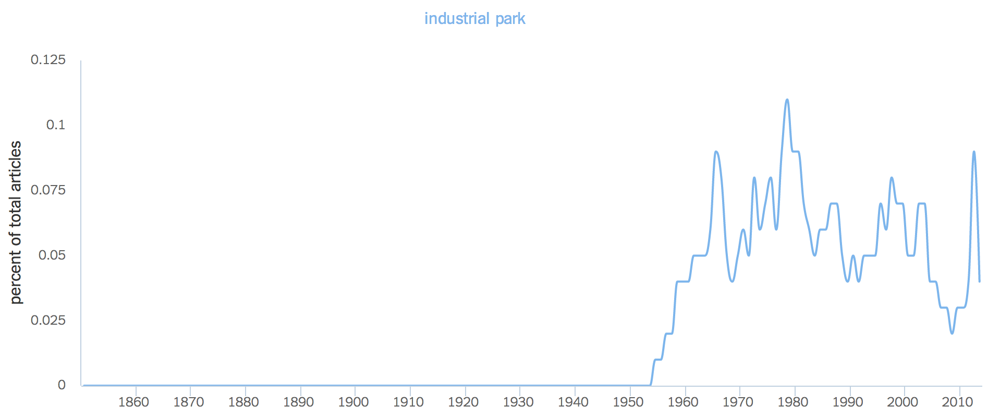
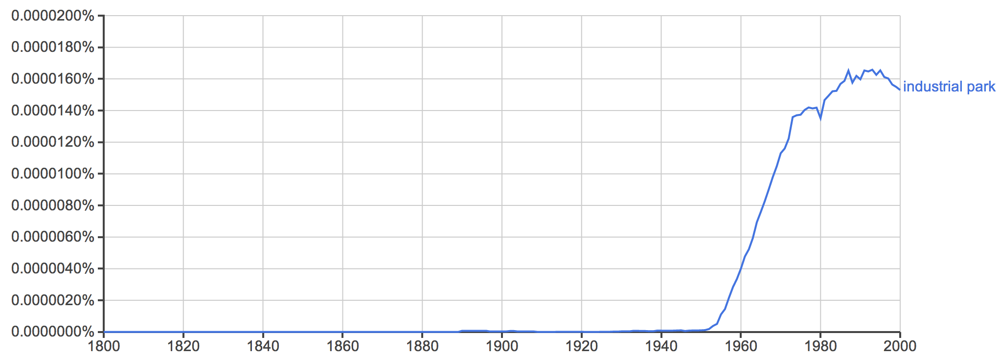

---
author:
- 'Jason A. Heppler'
title: |
  | Chapter 3
  | Machines in the Garden
...

> Palo Alto is half bedroom suburb, half futuristic 1970s science fiction 
> movies. . . . The big thing about Palo Alto is that, as a city, it designs 
> tons of incredibly powerful and scarry shit inside its science parks, which 
> are EVERYWHERE.
> 
> -- Douglas Coupland, *Microserfs* (1995)

> Universities are rapidly developing into more than mere places of learning. 
> They are becoming major economic influences in the nation's industrial life, 
> affecting the location of industry, population growth, and the character of 
> communities. Universities are in brief a natural resource just as are raw 
> materials, transportation, climate, etc.
> 
> -- Frederick Terman (1963)

Carved out of the southeast corner of Stanford's vast land holdings on the San 
Francisco Peninsula, the Stanford Industrial Park became the epicenter of 
specialized manufacturing and research activities. By the 1960s Stanford 
Industrial Park had gained a reputation for industrial and technological 
innovation that would be mimicked around the country.^[@luger1991garden, 154; 
@abbott1995frontier, 61-68.] Like many other American colleges and 
universities, Stanford sought to capitalize on the burgeoning science and 
technology opportunities in order to fashion itself as a leader in academic 
research and become a powerful influence in the new industrial age in the 
American West. As the U.S. government pursued Cold War scientific research 
and development programs, places like Stanford Industrial Park fostered 
specialized science-based industries. The Industrial Park's founders succeeded 
so well in their mission to attract industry that the population exploded 
throughout the Peninsula.^[I'll refer to the Stanford Industrial Park and 
Industrial Park interchangeably.] Yet in the wake of these changes emerged a 
new critique of sprawl and industrialization. Newcomers and old-timers alike 
began to question the benefits of the new western economy and the impact it 
was having on the natural surroundings.

The story of Stanford University and conservationists provides an example of 
how the confluence of suburbanization, the growing Cold War science complex, 
and anxieties over the environment served to launch an environmental movement 
on the San Francisco Peninsula. 

<!-- ## "The Miracle of Palo Alto" -->

\thoughtbreak{The establishment of Stanford Industrial Park emerged} from the confluence of 
several postwar trends: rapid suburbanization, the Cold War impetus for 
federal research and development, and the need for Stanford to diversify its 
finances. The Board of Trustees approved a plan to lease land to high 
technology companies in 1951 and quickly gained a reputation as a favorable 
site for burgeoning electronics companies.  Roughly five percent of Santa 
Clara County's workforce was employed in high technology or research and 
development in 1951 (compared to 9.4% in the US as a whole), and by 1986 the 
workforce reached twenty percent (compared to 8.5% in the 
US).^[@luger1991garden, 130.] The rapid industrialization around Stanford 
occurred just as several postwar trends were colliding. 

Stanford's entry into land development benefited from space and location. The 
railroad magnate and businessman Leland Stanford and his wife, Jane, founded 
the university in 1891 in the memory of their son Leland Stanford, Jr., who 
died at the age fifteen from typhoid fever. The Leland Stanford Junior 
University was established on Leland's vast farmland --- in total, nearly nine 
thousand acres of prime agricultural land --- and bestowed all of the land to 
the university with the stipulation that the university could lease the land 
however it saw fit but could never sell it. The university was the largest 
landholder on the Peninsula, and would own the land permanently. For sixty 
years after the university's founding, "The Farm," as it is colloquially 
known, would remain just that --- leasing most of its land for agricultural 
uses before becoming some of the most valuable land in the country by the 
mid-twentieth century.^[@omara2005cities, 100-103; @findlay1993magic, 120.]

World War II and the location of defense industries along the West Coast drew 
thousands of new residents to California in search of jobs after a decade of 
economic depression.^[On the mid-century migration to California, see 
@gregory1989okie. On the effects of World War II on the American West, see 
@nash1999landscape; @abbott1995frontier, chapter 1; @lotchin1993worldwarii; 
@lotchin1992fortress.] Between 1940 and 1947, the nine counties of the Bay Area 
became home for 676,000 more people, 330,000 new jobs, and \$2.5 billion more 
in annual income.^[@omara2005cities, 103.] The burgeoning Cold War science 
complex, anchored by the Stanford Industrial Park, added an additional influx 
of people and capital to the region.  In 1950, Santa Clara County alone 
counted 800 factory workers, which jumped to 264,000 manufacturing workers and 
more than 3,000 electronics firms by 1980.^[@abbott2008cities, 
181. U.S. Bureau of the Census, 1960 Census, Santa Clara County, n.d., 
census.abag.ca.gov; U.S. Bureau of the Census, 1970 Census, Santa Clara 
County, n.d., census.abag.ca.gov; U.S. Bureau of the Census, 1980 Census, 
Santa Clara County, n.d., census.abag.ca.gov.] The towns around Stanford 
grew rapidly during and after World War II as middle-class families moved 
to the area to take advantage of new defense and related industries. 
Menlo Park, to the north of Stanford, grew from a town of 3,000 to 27,000 
between 1940 and 1960, while Palo Alto grew from under 17,000 to 52,000 
in the same period. To Stanford's chagrin, however, most commercial 
activity in the early postwar period located elsewhere on the Peninsula. 
The majority of commercial development around Stanford remained retail and 
services industries.^[@omara2005cities, 107.] If Stanford was to become 
the center of a new western economy and leading research center, they 
needed to pursue new industries. They found those industries by pursing 
government funds for science-based research and partnering with 
technology firms emerging in the area.

In the years after World War II, scientific funding by the federal government 
rose rapidly, that helped spur new industrial activity centralized around 
defense and military applications. In 1955, federal expenditures on basic 
research topped \$286 million, a figure that jumped to \$693 million by 1960 
and, just five years later, topped \$1.6 *billion*. The total research and 
development budget of the federal government had grown from eight percent to 
twelve percent in just ten years.^[@omara2005cities, 47.] Along the Peninsula, 
cities sought out new ways to attract defense industries to the area in order 
to capitalize on defense research contracts. Bay Area governmental 
associations, such as the Bay Area Council (BAC), sought to make California an 
industrial center not by replicating the industrial Northeast or Midwest but 
by promoting new industries.^[@omara2005cities, 106]

Regional electronics manufacturing grew quickly. The Western Electronics 
Manufacturers Association listed twenty members in the Bay Area in 1951; by 
1953 it counted fifty-three, and by 1974 listed eight-hundred and employed 
around 150,000 people. The bulk of new manufacturers created products for 
the Department of Defense and NASA. Between 1952 and 1968, electronics 
firms made at least half of their annual incomes from sales to the 
federal government for military and space programs.^[G. Bylinsky, 
"California's Great Breeding Ground for Industry," *Fortune Magazine* 
(June 1974): 133, 128-129, 130; @findlay1993magic, 145.]  Desires on the 
part of NASA and the Pentagon for compact systems of missile and rocket 
guidance as well as wars in Korea and Vietnam and the space race, 
electronics equipment accounted for as much as twenty percent of the cost 
of an aircraft and thirty percent of the cost for missiles. While 
southern California built the aircrafts, northern California provided the 
electrical components.^[*Blue Sky Metropolis: The Aerospace Century in 
Southern California*, ed. Peter Westwick; @findlay1993magic, 143-144; 
Albert Shapero, Richard  Howell, and James R.  Tombough, *An 
Exploratory Study of the Structure and Dynamics of the R&D Industry* 
(Menlo Park, Calif., 1964), 23-25; @saxenian1983genesis, 27; Santa Clara 
County, Calif., Planning Department, *Study of the Economy of Santa Clara 
County*, 10-11; Siegel and Markoff, *High Cost of High Tech*, 8-9; SRI 
International, *The Role of Defense in Santa Clara County's Economy* 
(Washington, D.C.: 1980), v-vii.]

To many observers in the 1950s and 1960s the center city appeared to be in 
decline in the face of traffic congestion, vacancies, abandoned property, and 
political patronage. Urban renewal attempted to overcome such challenges 
through the eviction of tenants, the destruction of aging buildings, the 
rezoning of land, the construction of new freeways, the creation of large 
parking lots, new corporate lots, and the segregation of poorer citizens to 
low-income housing. The center city had become undesirable – noisy, crowded, 
expensive, and old. The suburbs offered a sense of improvement and a brighter 
future. New investments by local governments, real estate developers, the 
construction of federal- and state-funded roads, and large swaths of land 
provided a low-density, affordable, and automobile-accessible location for 
middle-class Americans.^[@mozingo2011pastoral, 7-8; @findlay1993magic, chapter 
3; @omara2006uncovering; @fogelson2001downtown; @beauregard2003decline; 
@weiss1987community; @jackson1985crabgrass, 268-269.]

Stanford Industrial Park's location reflected the growing suburbanization of 
corporations.^[The best accounts of Stanford Industrial Park's planning and 
development can be found in @omara2005cities, 99-124, and @findlay1993magic, 
129-142. See also @mozingo2011pastoral, chapter 2.] Thirty-three industrial 
parks existed in the United States in 1940, quickly rising to 307 by 1957. The 
increase in industrial parks coincided with industries becoming less likely to 
locate within cities, leading to 75 percent of parks built after World War II 
being located in areas whose populations were between 25,000 and 500,000 
people. By the 1950s, parks were locating outside of city centers in favor of 
suburbs, allowing firms in the parks to take advantage of a nearby workforce, 
new tax benefits, avoiding traffic congestion, bypassing old infrastructure, 
and locating out of reach from unions in older industrial cities. Although 
many firms remained in city centers to take advantage of certain benefits -- 
proximity to services such as public transportation -- many located themselves 
in suburban areas.^[@omara2005cities, 66; @findlay1993magic, 118; 
@luger1991garden, 1-13.] The suburbanization of industry led land developers 
to adhere to higher standards in urban design.  The real estate consultancy 
Arthur D. Little, Inc., noted in 1958 that industrial parks were organized 
according to "a comprehensive plan" designed to "insure compatibility between 
the industrial operations therein and the existing activities and character of 
the community in which the park is located." These parks were designed 
according to "proper setbacks, lot size minimums, land/use ratio minimums, 
architectural provisions, landscaping requirements, and specific use 
requirements" in order to maintain a "harmonious integration into the 
neighborhood."^[Quoted in @omara2005cities, 65.] The principles of open spaces, 
architectural uniformity, and land use restrictions shaped the spatial influence 
parks had on suburban areas as well as the suburban design of the parks themselves.

An additional influence on the design and location of industrial parks was the 
Cold War policy of industrial dispersion. Fears of a potential "total war" 
with the Soviet Union prompted officials in Washington to pursue industrial 
dispersion as an official policy. A presidential order issued in August 1951 
ordered the movement of government agencies "out of dense urban cores" and 
specifically noted the policy's importance to "the dispersal of new and 
expanding industries." The dispersal policy encouraged the movement of 
industry to "areas adjacent to industrial or metropolitan districts in all 
sections of the country." Such areas needed to be ten to twenty miles from a 
potential nuclear ground zero. The dispersal of industry to suburban areas 
meant fulfilling the policy directives while also maintaining proximity to 
employees, manufacturing facilities, and the infrastructure of central 
cities. The suburb was the ideal industrial area.^[@omara2005cities, 28-38; 
policy quotes from @omara2005cities, 38-39; @jackson1985crabgrass, 249.]

Affluent suburbanites were willing to take advantage of new tax revenues and 
job opportunities present in new industries, but were unwilling to accommodate 
those industries if they had an affect on their quality of life. A 1958 
pamphlet from the Palo Alto Chamber of Commerce noted that, just a few years 
after the opening of the Stanford Industrial Park, the city was "a well 
planned community with a favorable atmosphere for light industry."^["Light 
Industry in the Palo Alto Area," 1958, Folder 5 Palo Alto History, Box 5 
ARCH-1990-052, Stanford University Land Use Planning Office, Stanford University Archives,  1.] 
Smokestacks, traffic congestion, and air or noise pollution would not be 
tolerated, and new industries were quick to point out that their brand of 
industrialization would not carry such blemishes on the landscape.

Spatial ideas for industrial design shaped where and what sorts of industries 
moved into the Stanford Industrial Park. The Industrial Park's location itself 
was a product of spatial thinking. Silicon Valley's growth achieved its 
prominence thanks to the availability of land. Unlike the dense metropolitan 
areas of New York and Atlanta, where decades of urbanization meant new high 
tech ventures were restricted to existing infrastructure, the Valley had the 
space necessary to accommodate new manufacturing and industrial buildings. 
Stanford especially was well-suited to provide the physical space necessary 
for low-rise, horizontal buildings. As the largest land owner on the 
Peninsula, the university had the unique opportunity to lease chunks of its 
nearly 9,000 acres to pursue nonacademic uses for its lands.^[The importance 
of space to develop and its comparisons to Philadelphia, Atlanta, and Palo 
Alto is most thoroughly argued by @omara2005cities.] Not only would industry 
have room to build the sprawling warehouses and manufacturing facilities, but 
they would be able to follow Stanford's strict design guidelines for green 
belts, landscaping, hidden parking areas, wide lawns, and abundant trees. In 
this way, Stanford envisioned a corporate suburban nature that blended into the 
surrounding communities and architectural design of the campus.

The spatial distribution of industry followed a postwar trend in industrial 
design and development. Industry no longer developed in central cities as it 
historically had. Rather, industrial manufacturing sought cheaper and more 
spacious outlying lands that had adequate space for parking, loading 
facilities, and room for plant expansions. Industries also sought more 
amenable work environments. City ordinances in the latter half of the 
twentieth century began pushing industry to less desirable areas of cities, 
while industrial facilities sought the same amenities as suburbanites: a 
pleasant environment, suburban neighborhoods, distance from urban problems, 
and lower taxes, while remaining in proximity of city services and 
infrastructure.^[@findlay1993magic, 120; Santa Clara County, Calif., Planning 
Department, "Directory of Industrial Parks and Industrial Districts in Santa 
Clara County," *InfoCommentary: Industrial Districts* 1 (January 1966): 1; 
Robert E. Boley, "Rx for Successful Industrial Park Development," *Urban Land* 
26 (June 1967): 3; Victor Roterus, *Planned Industrial Parks: A Case Study* 
Washington, DC, 1960), 3-4.]

Industry had another reason to locate near suburban areas: to strengthen its 
ties to research institutions. Stanford actively pursued close ties with 
business. As early as 1945, University President Donald Tressider remarked he 
"hope[d] that in the postwar period Stanford will draw very much closer to 
business and industry than it has in the past --- by means of cooperative 
undertakings we hope to develop more and more projects in which both the 
University and business will have a legitimate stake."^[Quoted in 
@omara2005cities, 106.] In the postwar era, high ranking officials and 
professors supported the business/university expansion. Among the most 
enthusiastic supporters of recruiting and supporting the new economy on the 
Peninsula was Frederick Terman, the university's first dean of engineering 
and, later, provost. Terman had spent the war in Cambridge, Massachusetts, 
studying radar projects under Vannevar Bush. When he came to Stanford after 
the war, he used what he learned to begin building a new research agenda for 
the university. The growing availability of federal research month meant 
support for the university's pursuit of academic reputation in addition to 
becoming a key player in Cold War research. Due to Terman's efforts, he has 
been labeled the "Father of Silicon Valley."^[@omara2005cities, 106-110; 
@gillmor2004terman; @findlay1993magic, 122-125; @leslie1996selling; 
@leslie2000angel, 48-67; @lowen1997creating, chapter 4.]

To further cement the relationship with the university and business, Terman 
helped established two educational programs. Starting with the Honors 
Cooperative Program that allowed employees of surrounding electronics 
companies to study part-time towards a master's degree at Stanford, and later 
with the Industrial Affiliates Program, which allowed companies 
pre-publication access to scientific and technical military-sponsored 
research. The two educational programs sought to benefit both industry and the 
university and strengthen the ties between the university and 
industry.^[@lowen1997creating, 130-131.] To continue supporting such programs, 
leaders in the university concluded that industry needed to develop near 
campus. In the early 1950s Stanford began leasing land to light industry and 
commercial and residential developers.^[@lowen1997creating, 131.]

Stanford's additional motivations for pursing the creation and growth of the 
Industrial Park included finances. The university faced financial dilemma by 
1950, and hoped that the Industrial Park could become a money-making venture 
to support the university. In the years prior, returning veterans of World War 
II, aided by the GI Bill, brought a wave of new students to the university. 
Stanford's income peaked in 1946-1947, when income from tuition amounted to 
sixty percent of the university's income. By 1952, despite raising tuition, 
income fell to 47 percent. Between 1940 and 1950 income from endowment fall 
from 29 percent to 16 percent of total income in general for private 
universities, figures that were similar to Stanford's 
own.^[@lowen1997creating, 150; "Questions and Answers About Stanford Land 
Use," *Campus Report Supplement*, January 1971, 1, Page Mill Road Coordinating 
Committee Records, Folder 16, Box 1, Stanford University Archives.] The pursuit of land development 
projects and federal grants and contracts proved to be a lucrative business. 
In the 1950s Stanford's income rose from less than \$2 million in 1951 to over 
\$8.3 million by 1960, the bulk of which came from Department of Defense and 
Atomic Energy Commission grants.^[@omara2005cities, 109.]

Stanford never ran short of potential tenants attracted to the suburban design 
of the park and its proximity to university researchers. The university 
privileged those companies working in high technology and medicine --- and 
thus contributed to Stanford's educational and research programs --- and 
welcomed several companies to the park, including Eastman Kodack, Varian 
Associates, Hewlett-Packard, Syntex Pharmaceutical, and Lockheed Missiles. The 
park expanded quickly as its reputation grew. In 1955, only seven tenants 
occupied fifty-three acres of the Industrial Park. By 1962 the number had 
jumped to forty-two tenants occupying 360 acres (around half of the available 
space) and employed 11,000 people. By 1970, the number of tenants had reached 
fifty, occupied 500 acres, and employed 17,000 people. The rents generated 
tremendous profits for the university, by 1978 reaching an annual profit of 
\$4.3 million, while also generating another \$13.5 million in tax revenue and 
utility payments for the city of Palo Alto.^[City of Palo Alto, Calif., *Palo 
Alto Comprehensive Plan, 1977-1990* (Palo Alto, 1976), 15; @findlay1993magic, 
140.] The "electronics-nuclear space-age . . . is accelerating the 
transformation of the Palo Alto area into one of the country's most important 
national defense facilities," wrote *The Tall Tree*, the publication of the 
Palo Alto Chamber of Commerce, in 1958. "The Palo Alto-Stanford research 
community has grown to become an integral part of the science community of the 
nation."^["The First Fifty Years of Electronics Research," *The Tall Tree* 1:9 
(May 1958), 3, FF Palo Alto History, SC 486, 90-052, Stanford University Archives.]

Stanford sought to aid its land development plans by establishing a campus 
planning office after the war. In 1947, the university hired Lewis 
Mumford to study how the university could best use its land. The university, 
however, largely ignored Mumford's advice to concentrate urban development and 
retain the "rural setting" of the university. The draw of suburban development 
was too desirable for Stanford to resist. Financially, the university needed 
new avenues of funding. External pressures were also pushing the university 
towards land development. Agricultural rents barely covered the taxes on the 
land. In 1953, the university commissioned the San Francisco architectural 
firm Skidmore, Owings, and Merrill to suggest land use plans.  They developed 
the 1953 Master Plan that emphasized an "integrated community." Thinking of 
the area as a suburb of San Francisco, the plan emphasized high-income housing 
rather than "small, attractive, light industry plants." They concluded by 
calling for Stanford to preserve the "present character of the entire suburb 
area."^[@omara2005cities, 112-115; Skidmore, Owings, and Merrill, *Master Plan 
for Stanford Lands 1953: Report to the Board of Trustees, Stanford 
University* (San Francisco, 1953; Land Development, General file, Stanford University Archives.] The university rejected the suggestions of the 
firm. The Advisory Committee on Land and Building Development wrote to 
University President Wallace Sterling that the university needed to focus on 
attracting "a wide variety of national and regional activities which have a 
direct and immediate value to the University." Such activities revolved around 
industry.^[Stanford University Advisory Committee on Land and Building 
Development, "Master Plan for the Stanford Lands: A Review of the Skidmore, 
Owings, and Merrill Report," June 1, 1954, Land Use and Development file, Stanford University Archives, 
2-5, 7-9.]

By the mid-1950s Stanford's land development program focused on high-end 
housing, a regional shopping center, and an industrial park. Academic and 
industrial reserves quickly grew; by the 1960s 5,300 acres were set aside for 
the campus. Acreage for industry and non-academic uses by 1960 amounted to the 
largest segment of Stanford land use except for the main campus. The 
Industrial Park was underway before the 1953 Master Plan. The Board of 
Trustees authorized a light-manufacturing district in the southeast corner of 
the university's land holdings in 1951. The first tenants arrived a year 
later.^[@findlay1993magic, 129-141. See also @lowood1988steeples.]

To have the continued support of Palo Alto and surrounding communities, the 
university recognized the importance of suburban industrial planning. To 
achieve this, Stanford required new facilities to mirror the open, lush, 
low-rise, and architecturally appealing design of the university. Stanford 
maintained close control over the design of buildings and the landscaping of 
the surroundings. New tenants were required to submit plans detailing 
off-street parking, green space, roads, setbacks, location, and type of 
industry. The University required that open space had to be 60% larger than 
the space occupied by buildings. No buildings could be larger than 
two-stories, forbade smokestacks, and prohibited noise, odor, and emissions 
that might disturb the neighboring suburbs.^[Palo Alto Planning Commission, 
"*Report on the Interim General Plan* (Palo Alto, April, 1955), 42-43; 
@findlay1993magic, 131; @omara2005cities, 119-120.] 

The development of Stanford Industrial Park marked the emergence of the modern 
West: a region less reliant on what economist Thomas Michael Power called 
"folk economics" and more reliant on postindustrial economies of tourism and 
technology.^[@power1996landscapes, 19-21.] The economic shift meant a cultural 
shift as well. As farmland, pastures, and ranches became subdivisions, 
technology companies, research firms, and service industries, the new economic 
activity began to reshape how people thought about the Valley. Namely, the 
expansion of industry carried with it a contentious debate about the effects 
of industrialization on the Valley's landscape and over how it would be 
shaped.^[On postwar suburban growth, see @jackson1985crabgrass; 
@fishman1987bourgeois, 155–81; @abbott1995frontier.] By the late 1950s 
residents in Palo Alto began seeing the Industrial Park as a threat to their 
suburban lifestyles, especially visible through increased traffic, industrial 
development of the foothills, contributions to air and noise pollution, and 
rising housing costs. In 1960, these concerns boiled over and, inadvertently, 
helped launch an environmental movement. 

## A Climate for Business

<!-- promotional material selling the climate, recreation -->

<!-- ## Nature, Identity, and the Battle of the Hills -->

\thoughtbreak{Anxieties over suburban growth and issues} of clean air and water, open space, 
sprawl, and pollution defined environmental politics in the Bay Area. Postwar 
American environmentalism largely became issues over quality-of-life as new 
worries about chemicals used in products, pollution of water resources, 
pesticides, and overrun national parks became key political issues. The 
publication of bestselling books, including Stewart Udall's *The Quiet Crisis*, 
Rachel Carson's *The Silent Spring*, and Paul Ehrlich's *The Population Bomb*, 
made the case for greater regulation of urban growth and pollution. The 
passage of new legislation embodied new attempts to protect land, air, and 
water, such as the Wilderness Act of 1964, the National Environmental Policy 
Act of 1970, the creation of the Environmental Protection Agency, the Clean 
Air Act of 1972, and Endangered Species Act of 1973.^[On the emergence of 
wilderness protection, see @turner2012wilderness; @nash1967wilderness; 
@harvey2005zahniser; @sutter2002driven; @nicholas2003imagining. The historiography of the 
environmental movement is vast. See, for example, @hays1987beauty; 
@rome2001bulldozer; @rothman2000saving; @wellock2007environmentalism; 
@shabecoff2000rising; @scheffer1991environmentalism; @gottleib2005forcing.]

Against this backdrop, rapid growth in western cities encouraged new concerns 
about their environmental impact, which had the effect of shaping local and 
regional politics. World War II defense industries, Cold War military and 
industrial buildup, and tourism and recreation encouraged the growth of 
western cities, and, while growth brought new prosperity and wealth, it also 
unsettled westerners who watched rural landscapes vanish under four-lane 
highways, parking lots, office buildings, and residential developments. By the 
1960s, some westerners began pushing back against the tide of change and 
fueled new antigrowth and environmental politics throughout the region. 
Comprised mostly of middle-class professionals, suburban liberals and 
conservatives found common ground over environmental damage, uncontrolled 
growth, poor planning and development, trampled wilderness, and disappearing 
open space.

The economic and infrastructural changes wrought by World War II, the 
militarization of western industry, and the growing recreational and tourism 
economy led to breakneck metropolitan growth throughout the region between 
1940 and 1960. Westerners witnessed diminishing rural lands, growing suburbs, 
and four-lane highways, giving rise to a cultural and political backlash 
throughout the region that manifested itself in antigrowth activism and 
quality-of-life politics. Largely comprised of middle-class professionals, 
metropolitan growth and environmental and social problems identified by growth 
and quality-of-life activists lay at the center of their motivations. The 
millions of Americans coming to western states like Colorado, Oregon, and 
California since World War II came to take advantage of these state's air 
quality, federal public lands, recreation, and economic opportunities. By the 
1960s, however, newcomers and old-timers alike believed too many people were 
moving in and threatening their quality of life.^[On quality-of-life politics, 
see @abbott2008cities, 205; @carney2007suburbanizing, 480-481; @scott2008hip, 
253-255; @childers2012ski, 71-73.] 

In California, rapid growth brought prosperity to the state, but by the 1960s 
Californians were questioning these benefits.  Stanford was aware of a growing 
constituency in Palo Alto that was critical of the university's land 
development policies. Alf Brandin, the university's Vice President of Business 
Affairs, noted in a local town meeting that "certain factions in attendance" 
were trying to convince homeowners that "industrial property, as such, holds 
little or no advantage for the City of Palo Alto. . .  . I took the 
opportunity of presenting a point of view that industrial property, as we are 
planning and developing, has a great many more advantages to the City of Palo 
Alto than otherwise."^[Quoted in @omara2005cities, 133.] Stanford officials 
would continue this line of reasoning throughout the 1950s and 1960s in the 
face of growing criticism.

<!--The environmental critique that emerged in the 1960s around Stanford 
epitomized by the Citizens Committee for Regional Planning and the Committee 
for Green Foothills reveals an emerging movement for the protection of the 
environment and an ideal of protecting nature.-->

