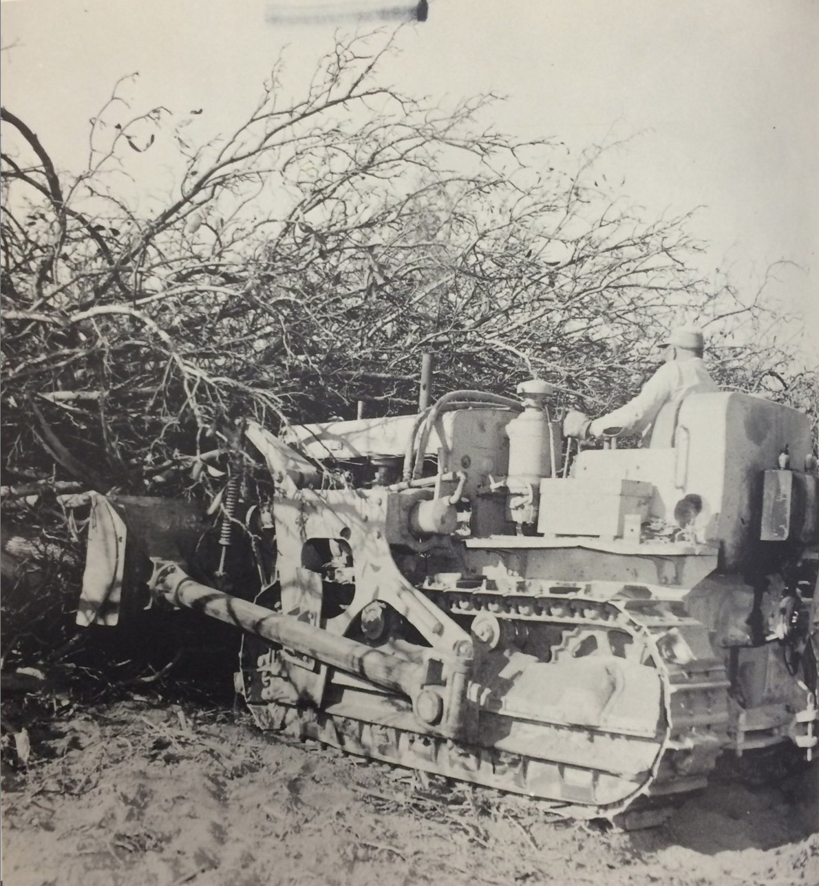

---
author:
- 'Jason A. Heppler'
title: |
  | Chapter 3
  | A Home in the Countryside
  | Nature, Politics, and the Varieties of Suburban Development
...

\begin{aquote}{\textit{Seattle Times}}
Do you know the way to San Jose? It's simple: annex more, plan less density and develop, develop, develop.
\end{aquote}

\begin{aquote}{Dutch Hamann}
We'd hate to think of the communities of the Midpeninsula as just little pieces of San Jose.
\end{aquote}

\begin{aquote}{"Beneath the Shadow of the Freeway," Lorna Dee Cervantes}
Across the street---the freeway,\\
blind worm, wrapping the valley up\\ 
from Los Altos to Sal Si Puedes.\\
I watched it from my porch \\
unwinding. Every day at dusk\\
as Grandma watered geraniums\\
the shadow of the freeway lengthened.\\
\end{aquote}

Cold War defense policies not only bolstered the position of Santa Clara Valley's industrial leaders. The legacy of New Deal housing policies and postwar homeownership incentives also allowed housing markets to secure anchors into the Valley landscape. The industrial expansion of the Valley intersected with the growth-based strategies of city leaders to attract new white-collar middle-class residents to the area. As newcomers arrived in the Valley, however, their expectations for the landscape shaped growth politics. As early as the mid-1950s, critics launched attacks against growth and its promoters. Their critiques were wide-ranging: racial inequality, environmental concerns, suburban sprawl, vanishing farmland. The emergence of so many critiques from various avenues of concern illustrated a growing need to redirect development in Santa Clara Valley. When the much-anticipated Rockefeller Brothers Fund published its book-length report from its bipartisan Task Force on Land Use and Growth in 1973, they concluded there existed "a new mood in America" as citizens questioned "what urban growth will add to the quality of their lives." The questioning of "growth is good, that growth is inevitable" that the Rockefeller report identified in the 1970s existed nearly two decades earlier in the Santa Clara Valley.

\thoughtbreak{The Santa Clara Valley of the 1940s} was a relatively small place, especially in comparison to the urban cores of San Francisco and Oakland. Santa Clara County housed 145,118 people, the bulk of which lived in San Jose---around 68,457 people on roughly 14 square miles. By 1960, San Jose's population ballooned to 204,196 and covered 56 square miles. Between 1940 and 2000, the city's land cover expanded 968% and its population rose by 819%. As farmland converted to residential and industrial suburbs, the Midpeninsula cities embarked on aggressive annexation campaigns to maintain control over territory and enjoy new tax dollars.

While the greatest financial benefits for cities came from taxing industry, municipalities of the Midpeninsula encouraged suburban growth. In the wake of the "monetary and credit revolution," in the words of historian David Freund, that "made it easier---in many cases risk free---for the private sector to lend and borrow," thousands of new homeowners flooded housing markets.^[David Freund, "Marketing the Free Market: State Intervention and the Politics of Prosperity in Metropolitan America," in Sugrue and Kruse, *The New Suburban History*, 15, 26.] Aided by the Federal Housing Authority (FHA), created under the National Housing Act of 1934, guaranteed mortgage loans up to eighty percent of the value of a home encouraged widespread purchasing of homes. The federal subsidy into housing, Kenneth Jackson noted, meant there was "very little risk to the banker if a loan turned sour."^[Jackson, *Crabgrass Frontier*, 203--205.] The new lending terms under the FHA of low down payments, larger loans in proportion to a home's value, low interest rates, and longer loan repayments ushered in a dramatic rise in demand. Nationally, single-family housing sales and starts doubled between 1936 and 1941, and rose almost fifteen-fold between 1944 and 1950.^[Kenneth T. Jackson, *Crabgrass Frontier*, chapter 11.] The federal tax code also allowed home ownership to blossom by allowing homeowners to take deductions from their mortgage interest and property taxes. Renters, however, received no similar federal subsidy. Thus, federal policies encouraged building in suburbs rather than city cores. Federal tax policies also allowed developers to write off construction costs on commercial buildings, tipping incentives towards new construction instead of renovation.^[Marion Clawson, *Suburban Land Conversion in the United States: An Economic and Governmental Process* (Baltimore: Resources for the Future, Inc. / The John Hopkins Press, 1971), 41--44; Dreier et al., *Place Matters*, 110--111.]

San Jose lay at the center of northern California's suburban population boom. A rural farming community of 68,457 in 1940, San Jose would be among the top ten largest metropolitan areas in the nation by the century's end. By the 1960s the town's population numbered 204,196, and doubled by 1970 to 445,779.^[U.S. Bureau of the Census, *1960 Census*, Santa Clara County, n.d., census.abag.ca.gov; U.S. Bureau of the Census, *1970 Census*, Santa Clara County, n.d., census.abag.ca.gov.] San Jose became the largest city in northern California and largely served as the suburban home for the Bay Area's technology commuters working in Sunnyvale, Mountain View, and Palo Alto.^[U.S. Bureau of the Census, *1950 Census*, Santa Clara County, n.d., census.abag.ca.gov; U.S. Bureau of the Census, *1960 Census*, Santa Clara County, n.d., census.abag.ca.gov; U.S. Bureau of the Census, *1970 Census*, Santa Clara County, n.d., census.abag.ca.gov; U.S. Bureau of the Census, *1980 Census*, Santa Clara County, n.d., census.abag.ca.gov.] The city limits rapidly expanded from 17 square miles in 1950 to 137 square miles in 1970, sprawling awkwardly across the Valley floor and foothills.^[Stanford Environmental Law Review, *San Jose: Sprawling City: A Report on Land use Policies and Practices in San Jose*, California, March 1971, 2.] The city grew so rapidly that street map makers could not keep up with the changes, finding their maps outdated just five months after printing. The city began selling monthly packets of stickers with corrections that people placed upon their maps to maintain their accuracy.^["County Grows Too Fast for Mapmakers," *Palo Alto Times*, September 12, 1952; "Notes for a Gazetteer," *The New Yorker*, May 4, 1963, 148.]

<!-- San Jose -->
Although much of San Jose's drive aimed at attracting industry to the city, San Jose instead witnessed the most growth in housing and residential development. San Jose gained 25,000 new residents in 1953, and another 31,400 a year later. Residential construction totaled $84 million in 1954, much of which was in unincorporated county territory. Residential construction employed 35,000 people and built 8,300 homes, while industrial and commercial construction topped $48 million. Banks in the county lent out more than $202 million through FHA, Cal-Vet, and other programs meant to entice the construction of homes.^["1954---A Year of Amazing Growth in County," *San Jose Mercury*, January 3, 1955.] Throughout the entire county, housing subdivisions continued to increase. In 1950 Santa Clara County witnessed 144 subdivisions and homes on 6,833 lots. A year later the figures dropped slightly with only ninety-eight subdivisions and 4,616 homes. But in 1952 construction jumped again, reaching 144 subdivisions and 6,437 homes. By 1955, the county saw 177 subdivisions and the construction of 10,157 homes for families moving to the area.^["Population Growth Created Demand for Housing; Subdivisions on Grand Scale Provided the Homes," *San Jose Mercury*, January 15, 1956; "198 Tracts Provide 11,631 Home Sites," *San Jose Mercury*, January 15, 1960.] The county estimated that as much as 75% of the population owned their homes.^["Estimate of Homeowners: 75%," *San Jose Mercury*, January 15, 1956.]

Along with suburban growth came new municipal projects. The city council finally convinced voters to approve bond measures beginning in 1955 when San Jose voters approved bonds supporting the construction of a new City Hall, new hospital facilities, new jail and court buildings, and a new YMCA facility. The Progress Committee ran up against resistance from voters in the 1940s as they rejected general obligation bond votes. But by the late 1950s residents started reversing course and approved over $134 million in general obligation bonds in elections held in 1957, 1961, 1966, and 1969.[[@trounstine1982movers 95--96.]]

Like other cities in the nation, New Deal housing policies made homeownership nearly nonexistent by nonwhites. The FHA determined at its inception that integration introduced risk to property values and instituted policies preventing the agency from supporting neighborhoods that housed a majority of nonwhite populations. Simultaneously, the FHA rejected nonwhite applications for homes in the country's new subdivisions. "That the entry of Non-Caucasian[s] into districts where distinctly Caucasian residents live tends to depress real estate values," wrote realtor Stanley McMichael in the industry textbook *Real Estate Subdivisons*, "is agreed to by practically all real estate subdividers and students of city life and growth."^[McMichael quoted in Needham, *Power Lines*, 84. See also Federal Housing Administration, *Underwriting Manual: Underwriting and Valuation Procedure Under Title II of the National Housing Act With Revisions to February, 1938* (Washington, D.C.: Government Printing Office, 1938), Part II, Section 9, Rating of Location.] These ideas followed through in Santa Clara County. While minority populations in the South Bay were much smaller than the North and East Bay's urban cores of San Francisco, Richmond, and Oakland, where job opportunities and access to government-subsidized housing was more accessible, minority populations still faced the brunt of discriminatory housing policies in the South Bay. When black realtor Mary Anne Smith took a black family to a home in the San Jose neighborhood of Willow Glen, she received a terse phone call from a white agent from a different brokerage who told her "in no uncertain terms that there were areas where black people are not welcome, and that Willow Glen was one of them."^[Smith, "Unsung Hero---In Her Quiet Way, Mary Anne Smith Has Introduced San Jose to Color, Diversity, Acceptance," *San Jose Mercury News*, October 29, 1995, quoted in Ruffin, *Uninvited Neighbors*, 100.] One study concluded that the suburbs of Santa Clara County "are almost totally white."^["Proposal for a Metropolitan Bay Area Housing Development Corporation," n.d., Folder 32, Box 73, Don Edwards Congressional Papers, MSS-1995-01, San Jose State University Library Special Collections and Archives.]

Restrictive covenants also shaped the urban space. Restrictive covenants and redlining initially forced African Americans into Northside properties. By the 1950s, roughly 40% of the South Bay's 1,718 black population lived in Northside. Similarly, the county's Mexican Americans occupied the enclave of East San Jose, known as Eastside, while Japanese Americans were restricted to downtown and Northside. Southern and western neighborhoods of San Jose were essentially off limits to nonwhites.^[Ruffin, *Uninvited Neighbors*, 74-75. In 1967, the U.S. Civil Rights Commission chastised the Bay Area FHA for "dragging its heels" on President Kennedy's open housing policy. See United States Commission on Civil Rights, *Hearing Before the United States Commission on Civil Rights: Hearing Held in San Francisco, May 1--3, 1967, and Oakland, California, May 4--6, 1967*, 143.]

Yet while racial discrimination continued to lock minorities out of particular neighborhoods, other homebuilders confronted racial restrictions head-on. Among the most prominent was Eichler Homes, founded by Joseph Eichler in 1947. Eichler Homes built homes for the professional middle-class: single-family, modern, and suburban. Yet they also gained a reputation as racially progressive. By the end of the 1960s, Eichler Homes were responsible for 6,000 houses built in the Bay Area, largely located in San Mateo and Santa Clara Counties.^[Cavin, "Borders of Citizenship," 366.] After the FHA and Veteran's Administration ended racial restrictions after 1950, Eichler sold their first homes to people of color. Asian Americans and African Americans were Eichler's first minority customers, purchasing new homes in Palo Alto in the early 1950s.^[Edward P. Eichler, *Race and Housing: An Interview with Edward P. Eichler, President, Eichler Homes, Inc.* (Santa Barbara: Center for the Study of Democratic Institutions, 1964).] By the end of the 1950s, Eichler Homes adopted an "open occupancy policy" that they would sell homes regardless of race. Realtors and competitors questioned the policy and attempted to use the policy against the Eichlers. Yet the company continued to build and sell homes, in part due to educated, white professionals who seemed more agreeable to open occupancy.^[Starr, *Golden Dreams*, 46--49.] When residents complained of an Asian American family purchasing a home in their neighborhood in Palo Alto, Eichler parner Jim San Jule told the residents that "we don't even want people like you in our subdivisions."^[Adamson, Arbunich, and Braun, *Eichler: Modernism Rebuilds the American Dream*, 199.]

The county's largest minority population were Latinos, comprising roughly eighteen percent of the county's population in 1970.^[Testimony of Jack Ybarra, May 15, 1972, Folder 3, Box 56, Don Edwards Papers, SJSU.] In East San Jose---known simply as East Side---a small group of Latino laborers banded together in the early 1950s to confront the problems of urban sprawl and urban policy discrimination. The Mayfair District was a key site of Latino activism focused on halting racial discrimination, calling for greater participation in electoral politics, labor rights, and a critique of San Jose's growth policies. Chicano activism and environmental regulations became entwined with debates over citizenship and discrimination, prompting activists to call for environmental equality alongside their challenges to racial inequality, citizenship, and segregation. Even economic issues that appeared neutral, such as zoning, sewer hookups, and street paving became a core tenant of Chicano politics. In the drive for progress, city leaders in San Jose created spaces that were disconnected from urban services and lacking good roads, adequate sewers, and city utilities.

Perhaps no place better represented frustrations in Mayfair than Sal Si Puedes. Originally a neighborhood populated predominantly by Puerto Rican farm laborers, Latinos living in Sal Si Puedes moved to the neighborhood in greater numbers the 1940s to work in the orchards, packing houses, and on construction crews building San Jose's suburban future.^[Clark, *Health in the Mexican American Community*, 49--51, 79; *The Spanish-American Community of the San Francisco Bay Area* (U.S. Commission on Civil Rights, April 28, 1967), 3.] In the early 1950s, agriculture remained a steadily profitable industry. By the mid-1950s, the county boasted the highest levels of agricultural profits before agricultural industries began their steady decline towards the end of the decade. "Agriculture and industry are synonymous words in the Santa Clara Valley," the *San Jose Mercury* could boast in 1955. Food processing employed a third of the county's manufacturing workforce.^["Agriculture," *San Jose Mercury*, January 15, 1956.] The presence of San Jose's agricultural industry attracted many migrants seeking job opportunities.

East Side reflected the spatial influences of industrialization in the Bay Area. High tech industries tended to cluster west and south in San Jose, staying close to the highways that channeled traffic and freight north and south. Zoning decisions by city and county government likewise determined the spatial layout of industrialization. Few of the Bay Area's new high-tech industries located themselves in the eastern parts of San Jose. East Side tended to be the site of homes rather than industry, a feature made more prominent through the city's decision to zone for low-density residential and federally-subsidized housing that clustered heavily in East Side. The density of housing caused severe traffic congestion on roads inadequate to carry the thousands of commuters traveling to their north county jobs.^["East Siders form alliance to increase political clout," *San Jose Mercury*, March 22, 1978; Cavin, "Borders of Citizenship," 293--294.] The pattern and policies of the Bay Area's postwar development introduced uneven environmental effects to barrio neighborhoods. Space, race, class, and environmental politics became tangled in East Side, expressed through Latino activists in the South Bay.

Cesar Chavez was among those Latinos coming to East Side in the 1950s seeking out ways to make a living and support his family. Chavez, his wife, and four children moved to San Jose in 1952, where he found irregular work in canneries, orchards, and lumberyards. A native of Yuma, Arizona, Chavez's family moved to Los Angeles when he was ten years old and later to San Jose, where his family worked in fruit packing houses. After a stint in the Navy during World War II, Chavez married and moved to foothills of San Jose where he sharecropped for a few years. Unable to scrape together much of a living, he moved his family into the city where Chavez worked in fields and lumberyards.^[[@castillo1995chavez, 24]; [@pitti2004devil, 150--154.]]

Chavez lived in the neighborhood known as Sal Si Puedes ("Get out if you can"), a suburban barrio in East San Jose that served as home for many of the area's seasonal workers. Sal Si Puedes became an epicenter of environmental justice for the city's Mexican American residents. By the early 1950s, Fred Ross, a community organizer from Los Angeles who helped Chavez establish the Community Service Organization (CSO) in 1952, wrote of the neighborhood's lack of sewers, the presence of cesspools that led to amoebic dysentery outbreaks, and flooding, muddy streets that occasionally left children unable to attend school.^[Fred Ross, "The Saga of Sal Si Puedes," 3--6.] Environmental hazards formed a critique of the city's public policies that overlooked it's minority communities. Even the very name of the community became a rallying point for activists. Puerto Rican families jokingly coined "Sal Si Puedes" due to its muddy streets that became filled with potholes in the winter rains. Residents continued to use the name because of its housing and socioeconomic problems, not so much as a joke but as an aspiration.^[[@clark1959health, 35]. Herman E. Gallegos, who became the first president of the San Jose CSO in 1952, recalled three stories as to how Sal Si Puedes got its name. See Gallegos, "Equity and Diversity: Hispanics in the Nonprofit World," interview by Gabrielle Morris, 1988, 16, Regional Oral History Office, Bancroft Library, University of California,Berkeley.] 

Ross, Chavez, Herman Gallagos, who served as the CSO's first president, organized the community to act, turning to electoral politics to get the city's attention. While the CSO predominantly focused on anti-poverty programs, ending racial discrimination, and embraced the postwar welfare state, their platform was framed, in part, around the uneven environmental hazards their neighborhoods experienced. Ross told members of San Jose's first CSO meeting that election drives he helped organize in Los Angeles brought streetlights, paved roads, and medical care to the barrio. East San Jose, Ross promised, could achieve the same.^[Ross, "The Saga of Sal si Puedes," 8.] Armed with Ross's know-how for organizing, an eighty-five-day voter drive registered 6,000 new Mexican American voters. The move caught the attention of city officials. Fearing that the wave of Latino voters might sway city politics, city officials approved new urban services to Sal Si Puedes within months after the election drive. New public works systems to fix chronic flooding, clearing out cesspools, and paved roads were brought to the barrio. Fruit packinghouses and canneries were forced to cease dumping effluence into creeks.^[Ross, "The Saga of Sal si Puedes," 16, 22--23; [@clark1959health, 28]; Levy, *Cesar Chavez*, 104.] 

Yet despite the city's move to connect the barrios to urban services, such places were still considered expendable. Encouraged under the 1949 federal housing act that granted Title I money to demolish substandard housing, local officials looked to secure funds to partake in urban renewal programs. Nationwide, Title I money was used for the demolition of neighborhoods considered "blight," which were then redeveloped often as housing, commercial, or civic projects. San Jose leaders and planners saw barrios as signs of decay. "Each segment of the city," the city's 1958 master plan noted, "has a natural cycle of growth---obsolescence and decay---and then renewal."^[San Jose City Planning Commission, *Master Plan of the City of San Jose*, 89.] The planning commission's map of blighted areas closely followed the city's barrios, identifying blight primarily in East Side. The city, the commission warned, needed to pursue urban renewal programs to prevent blight from spreading so "that the vast private investment in our city will remain sound an continue to expand."^[Planning Commission, *Master Plan of the City of San Jose*, 94--95.] Renewal needed to "clear and rebuild areas that economically are not worth saving."^[Planning Commission, *Master Plan of the City of San Jose*, 89.] The suggestions for renewal also aligned with federal transportation programs. Beginning in the mid-1940s, federal loans to states for road building increased rapidly. After the 1956 Interstate and Defense Highway Act, a larger pool of federal money for transportation became available to states. Over the next decade, 41,000 miles of new highway were authorized nationwide.^[Mark H. Rose, *Interstate: Express Highway Politics, 1939--1989* (Knoxville: University of Tennessee Press, 1990); Raymond A. Mohl, "Race and Space in the Modern City: Interstate-95 and the Black Community in Miami," in Arnold R. Hirsch and Raymond A. Mohl, eds., *Urban Policy in Twentieth-Century America* (New Brunswick: Rutgers University Press, 1993), 108; Edward Weiner, *Urban Transportation Planning in the United States: An Historical Overview* (Washington, D.C.: U.S. Department of Transportation, 1988), chapter 3. See also Teaford, *Rough Road to Renaissance*, 93--97; Rose, *Interstate*, chapter 5; Annmarie Hauck Walsh, *The Public's Business: The Politics and Practices of Government Corporations* (Cambridge: MIT Press, 1978.)] 

In Santa Clara County, city officials turned to the newly available pool of transportation money to aid their demolition of blighted areas as well as provide a short-term stimulus of subsidized construction. Plans for three interstate highways and an expressway through East Side emerged in the late-1950s: Highways 280 and 680 would shuffle traffic between northern and southern Santa Clara County, while Capitol Expressway skirted the eastern edge of San Jose to allow traffic to flow east and west. The federal funds also went into the construction of Bayshore Freeway (Highway 101) and Highway 280 running north and south up the Peninsula. In the process of constructing the new highway system, many of the East Side barrios were demolished.^["Housing for Freeway Displace-ees,", newspaper clipping, n.d., Box 5, Folder 19, Fred Ross Papers, Department of Special Collections, Stanford University Libraries, Stanford, California.] 

The social and environmental considerations were rarely taken into account under such development policies. The quickly-crowding Peninsula meant that new road construction projects would almost guarantee the displacement of people and business. But such concerns ran low for highway engineers and civic leaders.^[Nationally, between 1957 and 1968 nearly 330,000 homes were destroyed to make way for highways. In the 1960s, new interstate highways in urban areas displaced roughly 32,400 families annually. Mohl, "Race and Space in the Modern City," 100--101, 134--136.] The bulk of San Jose's lower-income Mexican Americans displaced under new road projects relocated to a centralized barrio in East Side and remained physically and symbolically separated from white communities by the freeways. The eastern edge of the city also became home to many of the city's federally-financed public housing projects administered through San Jose's Housing Authority, established in 1966.^["Housing for Freeway Displace-ees," Fred Ross Papers.] Urban renewal plans sealed the fate of Sal Si Puedes. What had once housed a community of 422 people became the site for highways. San Jose's policies of transportation, urban renewal, and annexations overwhelmed the CSO activists. "What use to be a very small neighborhood is now . . . hundreds of hastily-built tract homes that have become quite blighted," Gallegos noted. San Jose's growth "happened so rapidly," he continued, "[that] it was just incredible." The problems of Sal Si Puedes "were exacerbated by the sudden growth."^[Gallegos oral history, 17--18.]

By framing community problems around environmental issues, Mexican Americans in East Side shaped a conversation about their lack of access to the suburban lifestyle enjoyed by the majority of white residents in the city, but also demanded that the city ensure an environment that promoted health and quality-of-life. The conditions of their neighborhoods went hand-in-hand with the environment, a point that residents of Sal Si Puedes understood well. In shaping their political organizing around the community, activists argued for a suburban vision that included them while promoting an environmental critique of San Jose's sprawl.^[Pitti, *Devil in Silcion Valley*, 157.]

<!-- Alviso info: new section -->
\thoughtbreak{San Jose's rapid growth came with} a price. Nearby towns attempted to protect themselves from becoming part of the city. In the 1950s, suburban governments proliferated in the Bay Area. For various reasons, towns were not willing partners in San Jose's growth and instead sought strict economic regulations within their boundaries in order to control the development and character of their municipalities. Some cities used incorporation as one method for protecting themselves from San Jose's sprawling annexations. Campbell became a city in 1952, followed by Milpitas in 1954, Cupertino in 1955, and Saratoga in 1956.^["Hamann: San Jose's Growth Guru," *San Jose Mercury*, 1999.] County-wide, between 1952 and 1957 seven cities incorporated, doubling the number of municipalities in the county.^[Cavin, "Borders of Citizenship," 491.]

In other cases, cities found themselves resisting attempts at municipal consolidation.^[Consolidation and annexation are very different issues. Consolidation means the joining of two independent municipalities; annexation means the expansion of municipal boundaries to control unincorporated land.] Alviso, located to the north of San Jose at the southern tip of the San Francisco Bay, was an incorporated city long desired by civic leaders in San Jose. City leaders valued Alviso for two particular reasons. First, San Jose desired access to the San Francisco Bay for the location of a deep water port, a dream the city had held on to since the late 1800s.^[Land-locked San Jose began looking to Alviso's port as early as 1895. In the 1930s, the city was so certain it would control the port that it prematurely released a pamphlet boasting of the "San José Deep Water Port." In 1958, the city's Master Plan still mentioned their goal of a deep water port located in Alviso. See Cavin, "Borders of Citizenship," 323; "Trip on Alviso Channel," *San Francisco Call*, August 30, 1895; San Jose City Planning Commission, *Master Plan of the City of San Jose*, 50.] Second, the city wanted to locate a sewage treatment plant on the fringe rather than inside the city. For pro-growth Alvisans, incorporation with San Jose would provide the city with a larger tax base to fund capital improvements in the town. Alvisans, one pro-consolidation advertisement wrote, are "tired of wallowing in the mud, are tired of having our children play in the streets . . . are tired of seeing all of our neighboring areas make great strides forward while we just stand still. SUPPORT PROGRESS."^["Covenant and Betrayal," *San Jose Mercury*, March 28, 1993.] A campaign began to approve the city's annexation to San Jose. While debates continued in Alviso, San Jose annexed a narrow one-hundred-foot strip of land to the border of Alviso, and there built a sewage treatment plant. That plant would become the basis for more annexations as it allowed the city to extend municipal services cheaply to surrounding areas.^[While San Jose prided itself on industrial and commercial development, the city made most of its revenue through residential property taxes. These taxes, however, were unbalanced. The city desired more industrial land to expand its tax base, and locating industrial facilities northward allowed it to tap into the growing industries of Silicon Valley. San Jose City Planning Commission, *Master Plan of the City of San Jose*, 50.] The sewer system of San Jose became a key tool in the city's growth: by offering cities a chance to connect to San Jose's sewer system, which whisked treated sewage away to outfalls dumping  into the San Francisco Bay in a sewer system originally designed to handle the massive amounts of cannery effluence. Neighboring cities had a highly desirable incentive to join the city. Joining the sewer system was the price for annexation.^[[@trounstine1982movers 97]; Joel Garreau, *Edge City: Life on the New Frontier* (New York: Anchor Books, 1992), 224-227.] "We're in this fight to the finish," Dutch Hamann argued, "and if we have to use sewage disposal to bring Santa Clara [County municipalities] to some point of reasoning, we'll do it."^[[@pellowpark2002dreams, 70].]

The very choices of annexation, zoning, and construction introduced environmental problems municipal leaders failed to anticipate. When San Jose located a sewage treatment plant near Alviso, they were attempting to push such services away from the city's downtown in order to maintain a pristine image and high property values. The sewage treatment plant, however, required massive amounts of chlorine, which was shipped to the plant by rail across Alviso's borders. Alvisans not only dealt with the daily stench of the plant but were also exposed to potential chemical spills and sewage leaks. For San Jose, controlling Alviso's space was a method for offloading the environmental consequences of pollution to neighboring cities.

Complaints and campaigns were not enough to stop San Jose's drive. In January 1968, voters approved consolidation by the thin margin of nine votes.^["Covenant and Betrayal," *San Jose Mercury*, March 28, 1993.] However, many of the developments pro-consolidation Alvisans anticipated were never realized. No deep water port could be constructed because the dredging necessary to accommodate large ships ran up against new state environmental laws passed in the early 1970s. The port had also become less important to San Jose since new industries relied less on water for shipping and more on the interstate system. Yet while commercial developments ran aground, the city continued to expand its sanitation facilities. Large land owners sold their land to the city. Tony Santos, a landlord and former Alvisan police chief, city council member, and mayor, sold his land to San Jose that became the site of the city's huge landfill. The site became so polluted that the Environmental Protection Agency declared it a Superfund site in 1986.^[Cavin, "Borders of Citizenship," 333.] William Zanker, chair of Alviso's planning commission, sold his property to the city for $1.5 million and moved to nearby Sunnyvale. Zanker's land became the site of an expanded sewage plant that encompassed 1,764 acres and quadrupled its capacity. The new sewage plant became San Jose's key to growth, allowing the plant to handle the municipal waste of the whole region, including the industrial effluence from high technology industries. The plant eventually grew to service twenty-four cities.^["Covenant and Betrayal," *San Jose Mercury*; Cavin, "Borders of Citizenship," 333.]

The city's political coalition of businessmen, newspaper publishers, real estate developers, and the Chamber of Commerce allowed the political machinery to pursue growth. Widespread annexation became an avenue for development, provided the city with a broad tax base of industrial, residential, and commercial land, gave itself more power over surrounding cities, and allowed San Jose's leaders think about the city as a regional powerhouse. The combination of environmental politics and the limits of the environment itself shaped contests over metropolitan space, environmental degradation, and municipal government.

Similar patterns of offloading environmental problems to outside communities occurred elsewhere on the Midpeninsula. In the North Bay next to Palo Alto lay East Palo Alto, a predominantly African American community along the San Francisco Bay. East Palo Alto incorporated for the same reasons other small communities did during the postwar era: they feared the loss of independence. After the City of Menlo Park acquired the Belle Haven subdivision---one-quarter of East Palo Alto's population and property---in 1949, the city made overtures towards incorporation. The city itself had grown dramatically in the postwar era, from 1,500 residents in 1947 to 12,000 by 1953.^[U.S. Census, 1952.] But incorporation efforts were upended by the Kavanaugh family, the largest property owners in East Palo Alto who worried that incorporation would mean higher taxes.^[Bayinnah R. Jones, "The Tinsley Case Decision," Ph.D. diss., University of North Carolina-Chapel Hill, 17---18.]

The widening of Bayshore Freeway (Highway 101), under the same federal funding that allowed San Jose to drive freeways through its neighborhoods, marked a physical boundary between Palo Alto and East Palo Alto that the NAACP's *The Crisis* referred to as the "concrete curtain."^[Rachelle Marshall, "Concrete Curtain---the East Palo Alto Story," *The Crisis* (November 1957): 543--548.] When the California State Planning Commission went ahead with plans to widen the freeway in the late 1950s as a major corridor for traffic between San Francisco and the growing tech industries of Santa Clara Valley, little effort was made to preserve East Palo Alto businesses which mostly lined the freeway. The freeway project appeared willing to curve around other commercial districts, but the fifty-three East Palo Alto businesses lining the old four-lane freeway were displaced. The widening of the freeway also caused greater flooding problems in the city and lowered land values, causing residential and business developers to look elsewhere.^[Bayinnah R. Jones, "The Tinsley Case Decision," Ph.D. diss., University of North Carolina-Chapel Hill, 18; *Palo Alto Times*, January 11, 1956.] 

Exacerbating the environmental problems in East Palo Alto was the location of the Romic waste management facility. Opened in 1956, the facility first run by the Hird Chemical Corporation before it was sold to Carad Chemical Corporation in 1959 followed by the purchase of the facility by P.D. Electronics in 1964 before its eventual sale to Romic in 1979. The facility largely existed for the processing of solvent wastes and wastewaters from industrial activity, including the manufacturing waste from aerospace and electronics. Like the Alviso sewage treatment plant in San Jose that located the facility outside the city, Romic lay outside of Greater Palo Alto but close enough to East Palo Alto that the community would be left dealing with potential problems. A major environmental problem occurred in the winter of 1972 when tidal flooding breeched wastewater receiving pond levees, causing 20,000 gallons of waste liquids to dump into adjacent tidal sloughs along the San Francisco Bay. The California Regional Quality Control Board issued a Cleanup and Abatement Order in March 1973 commanding Romic to rebuild levees, improve surface drainage, and connect the facility to sanitary sewers.^[The Environmental Protection Agency initiated investigations into the Romic contamination sites in April 1985 and found various volatile organic compounds in the soil including dry cleaning chemicals, carburetor cleaning liquids, paint thinners, and various industrial solvents. See "Statement of Basis for Proposed Soil and Ground Water Remedy," Environmental Protection Agency, September 14, 2007 <http://www.epa.gov/Region9/waste/romic-eastpaloalto/pdf/romic-sob.pdf>. On June 5, 2006, a chemical release of roughly 4,000 gallons of a chemical mixture caused East Palo Alto police to issue a shelter-in-place order. The EPA fined Romic $20,000 for failing to immediately notify the agency of the problem. See "U.S. EPA finds Romic $20,000 for failing to notify authorities after chemical release," EPA News Release, August 20, 2007 <http://yosemite.epa.gov/opa/admpress.nsf/6427a6b7538955c585257359003f0230/2c861bd40017ca988525735600604ee3!OpenDocument&Start=3.2&Count=5&Expand=3.4>.] East Palo Alto Vice Mayor A. Peter Evans, who had once worked at the Romic facility in the late-1950s, regretted the facility's presence in the city. East Palo Alto, he recalled, had become "the dumping ground for San Mateo County."^["Romic waste facility fuels toxic debates," *Inside Bay Area*, July 14, 2006 <http://www.insidebayarea.com/argus/localnews/ci_4050135>.]

The emergence of urban black and Latino politics in the 1950s did not blossom completely from environmental concerns. Throughout the 1950s growth programs throughout the Midpeninsula faced little resistance. Indeed, political organizing focused more specifically on ending segregation, housing discrimination, and political participation. Yet opposition and critique of urban growth policies promised to unleash new political energies focused on the health of neighborhoods and communities, a alternate expression of environmentalism than that emerging among lifestyle liberals who valued countryside homes, open spaces, and recreation.

\thoughtbreak{As city leaders defined the details} of San Jose's suburban and industrial future, a sizable contingent of city residents began questioning whether the link between growth and prosperity was guaranteed. In the mid-1950s, debates over the landscape's identity as an agricultural powerhouse rose to fruition, resulting in legal challenges to San Jose's unrestricted growth and initiated a campaign to conserve farmland. The extension of subdivisions into farmland, however, was not a clean story of transition from agricultural to suburban space. Yet given the physical space restrictions in the Santa Clara Valley, farms rarely stayed in the Valley when they were bought up. Many farmers took their new-found capital and moved their operations to other parts of the state, most commonly to the Central Valley straight east of the Santa Clara Valley. 

The expansion of the city into agricultural land was part of a large cycle of capital flowing into the county. Federal money, the nation's political and financial centers, and investment dollars became fixed in space in neighborhoods like Willow Glen, Los Altos Hills, and Cupertino, subdivisions built on the periphery of the urban cores of San Jose, Palo Alto, and Sunnyvale. Growth liberalism provided the structure for capital and incentive, allowing banks to aggressively bet on mortgages with the mitigation of risk through the FHA. New Deal housing policies allowed banks in the Valley to become anchors by which capital entered the Valley, establishing homebuilders and city leaders as central figures in the Valley's postwar growth and steady erosion of agricultural land.^[Needham, *Power Lines*, 72.]

Despite the dramatic rise of subdivisions and neighborhoods, Santa Clara Valley maintained its reputation as a major producer of fruit, food preservation, and food processing in the immediate postwar era, even after farm incomes peaked in 1955.^[County of Santa Clara Planning Department, "Land Use Issues in Santa Clara County," (San Jose: County of Santa Clara Planning Department, 1963), 8.] The orchards of the Valley remained abundant enough in 1953 that the Chamber of Commerce published a postcard advertising the blossom tours in the "land of sunshine, fruit and flowers." The blossoming trees lured tourists to the city, giving visitors a chance to see the abundant flowering of cherry, almonds, apricots, prunes, and pears in "famous Santa Clara County, California."^[Greater San Jose Chamber of Commerce, "Blossomtime Tours: Santa Clara Valley Blossom Routes", ca. 1953, Santa Clara City Library.]  In 1960 the county contained eighty-five canneries, twenty-three dried fruit plants, twenty-five frozen food operations, and eighty-five fresh fruit and vegetable packing facilities.^["Agriculture," *San Jose Mercury*, January 15, 1956; [@alpert2010sjmn, 16]; Cavin, "Borders of Citizenship," 224.]

The county's suburbanization attracted its critics, most prominently from the suburban critic William H. Whyte. In 1958 in the pages of the *New York Times* Whyte described Santa Clara County cities as a "vast, smog-filled deserts that are neither city, suburb, nor country." Like other observers of suburban America, Whyte considered suburbanization as a symbol of progress, but he questioned its application to the Santa Clara Valley. "You can't stop progress, they say," he wrote, "yet much more of this kind of progress and we shall have the paradox of prosperity lowering our real standard of living." Whyte's greatest concern for the Valley was the farmlands. "In a maze of signs and neon lights," Whyte bemoaned, "the unspoiled country had almost disappeared."^[Whyte, "Urban Sprawl," 124. See also Rome, *Bulldozer in the Countryside*, 119--152.]

Beginning in the early 1950s the children and grandchildren of farmers and ranchers began selling their land to developers. Many times smaller farms could not hold out against the pressures of urbanization, while larger land owners waited for a high enough offer. The experience of Carl Wesley Haman's land was typical. When the Santa Clara fruit grower died in 1955, a Palo Alto developer purchased his 41.44-acre lot for $287,000---seventeen times more than what Haman paid originally. Farmland desired by developers had the opportunity to fetch upwards of $7,000 an acre by the mid-1950s.^["41.44 Acres Bring Price of $287,000," *San Jose Mercury*, September 17, 1955; Cavin, "Borders of Citizenship," 212.] Smaller farmers had similar experiences. Joe Ruscigno spent his lifetime working the land on his San Jose farm. Son of first-generation Italian immigrants, Ruscigno and his family had run the farm since the 1940s.^[U.S. Census, 1940. http://www.archives.com/1940-census/joe-ruscigno-ca-34378841.] But in 1952 he gave up tending land for tearing up land. "Guess I've pulled out 150 acres of trees since the first of the year," he told a *San Francisco Chronicle* reporter. Ruscigno lamented the uprooting of the fruit trees to the bulldozer he now controlled, but "what can you do? . . . The subdivisions were coming in all around us and when they made a good offer I sold out."^["Santa Clara County--Scene of the Big Boom," *San Francisco Chronicle*, May 11, 1952.] By the 1970s, pockets of agricultural land were being sold for $18,000 an acre, and one land owner refused an offer of $2,300,000.^[Stanford Law Review, *San Jose*, 8.] San Jose, T. H. Bowden was already noting in 1937, "might literally be said to have been carved from a forest of fruit trees, as most of the residential sections were orchards prior to being subdivided, and many of the original trees still ornament the gardens of the invading residences."^[T. H. Bowden, *Report of a Survey in San Jose, California*, (Washington, D.C.: Division of Research and Statistics, Home Owners' Loan Corporation, September 18, 1937), 2, quoted in Cavin, "Borders of Citizenship," 208.] The land's use for agriculture was under threat despite its persistence. Local historian Yvonne Jacobson estimated that 77,000 acres left production in a span of thirty years. By 1982, 20,000 acres of agricultural land remained in the Valley, which fell to just 4,500 by 2001, mostly located near the South Bay cities of Morgan Hill and Gilroy.^[Jacobson, *Passing Farms, Enduring Values*, 231--236; Paul F. Griffin and Ronald L. Chatham, "Urban Impact on Agriculture in Santa Clara County, California," *Annals of the Association of American Geographers* 48 (September 1958): 203; "From Fertile Fields, a High-Tech Harvest," *San Jose Mercury News*, June 20, 2001; Roy Hitchock, "Taking the Pulse of the Prune," *California Farmer*, September 4, 1957; "The Indispensable Man at Harvest Time," *San Jose Mercury*, August 28, 1955.] "As the people came," the *San Jose Mercury* noted in 1956, "the orchards went."^["Population Growth Created Demand for Housing; Subdivisions on Grand Scale Provided the Homes," *San Jose Mercury*, January 15, 1956.]

City leaders had no problem annexing land for what they saw as the appropriate and correct use for land: new industry and new suburban homes. But this vision of the landscape came into conflict with farmers, whose own ideas about land use also meant protecting their livelihoods. Right as suburbs were expanding across the valley floor, their farming neighbors began organizing an effort at agricultural land preservation. Farmers worked with the County Planning Commission to create new zoning ordinances that would maintain greenbelts between cities and leave pockets of land to the exclusive use of agriculture.

The combined efforts of Santa Clara County Planning Director Karl Belser and County Planning Commissioner Will Weston drove the county's early efforts at farmland conservation. On April 8, 1953, the county proposed an amendment to the zoning ordinance establishing exclusive agricultural zoning after fifteen pear growers near the community of Agnew in the City of Santa Clara appealed to the county for help. The amendment passed in April 1954 with little opposition---perhaps due to its broad definition of agricultural land that included nurseries, botanical conservancies, riding academies, stables, and other land uses pursued by hobby farmers---and established the county's first greenbelt of 744 acres for pear orchards in Agnew controlled by fifteen owners.^[[@conard1985green, 6-8].]

Belser and the county planning commission continued to advocate for the importance of agricultural zoning. County planners contributed to a 1954 report to the state legislature identifying areas where the state could improve its role in helping shape chaotic urban growth around the state. The report pointed specifically to agricultural land in Santa Clara County, arguing that unplanned urban growth posed a "direct threat" to the "agricultural base of Santa Clara County, and the hastening of the day that it ceases to contribute to the economy of Santa Clara County and the state as a whole."^[Assembly Interim Committee on Conservation, *Planning and Public Works, Planning for Growth: A Report on the Status of City and County Planning in California* (Sacramento: Assembly of the State of California, January 1955), 43.] Four years later the county published "Green Gold," a county publication that argued for "permanent agricultural reserves" for protecting the "priceless reserve" of farmland threatened to succumb to an "endless, monotonous megalopolis."^[Santa Clara County Planning Department, "Green Gold: A Proposal for a Pilot Experiment in the Conservation of Agricultural Open Space," (San Jose, 1958), n.p., quoted in Conard, "Green Gold," 12.] Farms, they argued, required growth control if they hoped to survive urban development.

Pressure by farmers and the county, with the support of the Santa Clara County Farm Bureau and California Farm Bureau Federation, led the state legislature to pass the Green Belt Exclusion Law in 1955 and the Agricultural Assessment Law in 1957, both efforts thought to help farmers hold on to their land.^[Although the county and state level farm bureaus supported the local plan, Rebecca Conard argues that the planner-farmer coalition at the local level collapsed once land use issues reached the state level. Conard, "Green Gold," 14.] The Green Belt Exclusion Law created zones where no subdivisions, industry, or commerce could establish itself. The land would remain the exclusive use of agricultural production. This was aided by the Agricultural Assessment Law, which sought to help farmers maintain low tax assessments on their land. By allowing green belts to be preserved, assessments of land would remain low since no non-farming activity would be located on neighboring land. The exclusive zoning expanded the county's zoned agricultural land by almost sixty percent, from 40,000 acres in 1958 to 70,000 acres in 1960.^[Robert C. Fellmeth, *Politics of Land: Ralph Nader's Study Group Report on Land Use in California* (Grossman Publishers, 1973), 32--34.]

Many of those supporting the zoning of agricultural preserves did not think of themselves as environmentalists, but, as Adam Rome has observed, they were "grassroots activists and government officials [that] saw the difficulty of acquiring open space as part of a larger problem---uncontrolled growth."^[[@rome2001bulldozer, 135]. Rome suggests that open space regulations became a phenomenon in the 1970s, but Santa Clara County was ahead of the trend by applying land-use controls to agricultural land in the 1950s. The same is true for other parts of California. See, for example, [@brosnan2010napa].] Most farmers aimed to protect their way of life, seeing sprawl as a threat to their lands and living. Yet others also saw themselves as protectors of the land, notably Belser and others in county government. The coalition worked to protect agricultural land and hoped to maintain alternating patches of agricultural land and urban areas, but their efforts were overwhelmed by the growing cities.

The San Jose Chamber of Commerce noted those in the community who feared the encroachment of industrial development. In an industrial survey, the Chamber noted that

> there were some sincere and intelligent people who looked askance at this
> industrial development. They had genuine fears that smokestacks would
> "encircle the city"; that "blighted areas" would spring up in industrial
> sections; that orchards would be torn up "by the hundreds"; and that by past
> standards, this accelerated trend in the establishment of new industry might
> result in an unbalanced, top-heavy economy destined to collapse at some
> undetermined time in the future.^[Quoted in Scott, *Bay Area*, 273.]

\noindent Such fears seemed confirmed by the mid-1960s as the exclusive agricultural zoning would begin to fall under the gerrymandered annexations of the county's municipalities. Although farmers had felt themselves under pressure in the early 1950s to preserve their lands, many, like Haman and Ruscigno, began to realize the value they could extract from the sale of their lands.^[Fellmeth, *Politics of Land*, 35.] The patterns of leapfrogged annexations angered growers as well, which encouraged other farmers to sell their land to urban developers well before the land was needed for the city.^[Conard, "Green Gold," 5--18, 6.]

Yet if county government saw the value in protecting farmlands and developers found value in marketing those lands to suburbanites desiring countryside homes, the experience of living among the orchards was another matter entirely. Living near the accouterments of the farm economy upended suburbanites' views of the countryside. Homeowners complained about farm labor camps for largely Latino farmhands and their mingling with suburban property. When farmer Walter Seagraves announced plans to build a labor camp near Saratoga in 1955, homeowners argued that such development would lower property values in the residential area. Hundreds of residents protested at a County Board of Supervisors meeting about Seagraves' plans, and residents eventually hired a lawyer to make their case, arguing that Seagraves' property should be subdivided rather than developed for the camp. The County Board of Supervisors and Seagraves bowed to public pressure.^["Saratoga Residents Win Labor Camp Ban Fight," *San Jose Mercury*, August 9, 1955; "Saratogans to Protest Farm Labor Camp," *San Jose Mercury*, July 27, 1955; Cavin, "Borders of Citizenship," 213--214.] Nor were suburban residents pleased about the byproducts of agriculture. While orchards and gardens mingled with suburban properties and were desirable for their amenities, canneries and packinghouses were pocks on the suburban landscape. Odors from a meatpacking and tallow facility near the new Berryessa housing development upset the air quality of the suburb. At a meeting of the Board of Supervisors, one resident complained about the odors. "We want real action taken immediately and this cleaned up," he threatened the Board, "otherwise we will do our best to do some cleaning up in the next election."^["Still Smells, Berryessa Road Dweller Tells Supervisors," *San Jose Mercury*, 1950, quoted in Alpers, "Valley of Heart's Delight," 36.]

Such sentiment reveals the shifting political patterns in Santa Clara County. Growers and their issues dominated Valley politics until the 1950s as suburban voters displaced farmers. The concerns of the *San Jose Mercury Herald* indicate the importance of agriculture to the Valley until the 1950s. The column "Let's Grow It!" about home gardens and fruit trees appeared regularly for several years, and in the immediate postwar era the newspaper ran a Sunday insert called "Ranch, Home, Garden" that provided agricultural news and technology.^[Alpers, "Valley of Heart's Delight," 32.] Yet by 1960, the farm news section of the *Mercury* fell to one or two pages on Sundays and Frank Freeman, the paper's columnist for local news, implored readers to remember that "this county is among the 25 most important counties in agricultural production in the United States."^[Frank Freeman, "Agriculture's Still S.C. County's Biggest Industry," *San Jose Mercury News*, April 4, 1965.] After 1976, the farm section and farm editor were gone from the *Mercury*.^[Alpers, "Valley of Heart's Delight," 44--45.] 

The contest over the agricultural landscape revealed not only an effort by farmers to protect their livelihoods, but a broader debate about land use and the environmental costs exacted on the land for its various uses. The hope for orderly planning separated by "nature"---the greenbelts of orchards---sought to impose the environment into urban space. The agricultural landscape not only dealt with the livelihoods and economics of food production, but was valued for what appeared to be an inherent ability to control urban growth. Farmlands needed acreages to produce crops, the argument went, necessarily causing pockets of land to separate urban areas. But the rural landscape would be valued for another reason: its suburban aesthetics.

\thoughtbreak{Land developers in San Jose were operating} at a time when planning and zoning regulations of undeveloped areas was virtually nonexistent. The City of San Jose rarely hesitated in granting land uses to industry and residential subdivisions with no regard to planning guidelines. The city's original master plan created in 1934 was routinely ignored and was not revised until 1958, when state regulations required the city to update its general plan. The city continued to paid little heed to the goals outlined in the document. The city also routinely ignored the recommendations of the Santa Clara County Planning Commission. In some cases, land originally deemed unfit for development by the county was nevertheless developed once the city acquired the land through annexations. Many times, the decisions of city leaders, developers, and industrialists failed to take into account the best interests of residents as the city permitted construction in flood plains, hillsides, and along fault lines. The lack of such considerations led to problems homeowners would have to manage in the future.

Historian Hal Rothman has noted that Americans could develop land while still considering themselves conservationists because "progress and the ethic of conservation were entirely compatible. Space was either sacred or profane, either reserved because of its special value or open to development."^[Rothamn, *Saving the Planet*, 95.] The desire for scenic nature and the eagerness to develop the land accompanied, ironically, the devaluation of agricultural land. The suburban characteristics of the South Bay were marketed to residents seeking natural amenities. Promotional material and advertisements from realtors, the Chamber of Commerce, and developers frequently promoted the Bay Area's pleasant climate and natural setting. Beginning in the 1950s, land developers began buying up farmland and marketing these places as scenic, suburban areas located away from urban cores. This reflected a shift in thinking about the land---no longer was land thought of for extractive industries. Instead, the land would be tended in order to preserve the Valley's views. Farms were no longer valued for the production of food, but instead culturally and spatially valued for their aesthetics.

The development of county lands followed a pattern identified by historian Jon Teaford, writing about a different region but whose findings equally apply to Santa Clara Valley. Developers, Teaford argued, took advantage of county land's lax zoning laws and low property taxes in order to develop suburban areas away from urban centers. Only after the initial phase of development did localities attempt to pass and enforce more strict zoning and planning regulations. In San Jose, county lands followed Teaford's pattern of little governance and rapid growth.^[Jon Teaford, *Post-Suburbia: Government and Politics in Edge Cities* (Baltimore: John Hopkins University Press, 1997), 7.] Much of the housing developments anchored themselves into unincorporated county land at the outskirts of the city. Such growth made Santa Clara County the fastest growing county in the Bay Area. These unincorporated lands had been owned or leased to orchardists, wheat and nut farmers, and horse and cattle ranchers. Productive farmland became a draw for suburbanites lured to the region's growing high-tech economy.

Advertisements for homes noted the bloom-time beauty of the orchards, the rolling foothills, the pleasant climate, and the countryside character of the South Bay, offering suburbanites the natural beauty they expected with their new homes. Yet often these "countryside" landscapes quickly gave way to more suburban housing developments. It was not uncommon for a new homeowner, enticed by the idea of a countryside home, to suddenly be in the midst of sprawling subdivisions in only a few years.^[Stanford Law Review, *San Jose*, 23-24.]

Suburban homeowners came to expect that the places they moved to not only had low property taxes, provided property ownership as an avenue for upward mobility, and segregated neighborhoods, but a pleasant environment as well.^[On the issues of social mobility, racialized suburban space, and taxes, see [@self2003babylon, 96--100]; Ronald Tobey, Charles Wetherell, and Jay Bringham, "Moving Out and Settling In: Residential Mobility, Home Owning, and the Public Enframing of Citizenship, 1921-1950," *American Historical Review* 95 (December 1990); Nicolaides, *My Blue Heaven*, 185-237.] Such views put residents at odds with the concerns of developers and boosters, who tended to privilege the sale of land for profit, taxes, and jobs---the very core of "growth." But home-owning suburbanites approached property differently, expecting that the place they inhabited had access to public parks, open space, well-kept lawns, and access to recreation. Property, then, was more than just the accumulation (and production) of capital. Property's proximity to nature mattered a great deal to suburbanites, manifesting itself in a sort of "aesthetic capital" that could not be measured by dollar amounts. Suburbs were not just efforts towards organizing space; their very proximity to natural surroundings led suburbanites to define their space in aesthetic terms and take measures to protect their idea of "nature."

The very location of annexations and subdivisions ignored potential environmental issues, or introduced new problems the city failed to anticipate. The City of San Jose eagerly approved subdivisions in floodplains, hillsides, fault lines, and wetlands. Such flexible land use gave San Jose city leaders what they wanted, drawing developers to the city rather than its neighbors whose land use policies were more restrictive.^[[@trounstine1982movers 95].] Sometimes housing developments occurred on land originally blocked by the county as improper for development, only to be annexed by a city and opened to development.^["Proper Storm Drainage Possible, Says Planner," *San Jose Mercury*, January 5, 1956.] No type of land, it seemed, would be off the table for San Jose civic leaders.

San Jose had to confront more than the politics surrounding land use. They confronted the land itself, which had its own ways of dictating the limits of urban growth. The approval of development in areas prone to flooding provides one example of the environmental limits of growth. The city's poor planning exacerbated flooding problems. As more and more soil was paved over and built upon, the less area remained to absorb excess water.^[Leonard Downie Jr., "A Misplanned Suburb," *Washington Post*, December 30, 1973.] Urban development changed the Valley's drainage system, upsetting centuries of drainage patterns that had created hundreds of small streams and areas for groundwater absorption. Storm runoff and flooding became problems in ways it had previously not been.^[Bill Zanker to Don Edwards, February 11, 1966, Box 72, Folder 3, Don Edwards Congressional Papers, MSS-1995-001, San Jose State University Library Special Collections and Archives.] Furthermore, building in low areas frequently flooded in winter and spring rains, places often sold to lower-income families.^[Downie, "A Misplanned Suburb," *Washington Post*, December 30, 1973. According to Downie, such sales were made primarily to lower-income families and allowed developers "profit risk-free." The homes were guaranteed by FHA loans, which were often leased to black and Hispanic homebuyers.]

In addition to runoff and drainage issues, communities faced an issue with the earth sinking beneath them, a phenomenon known as subsidence. Subsidence occurred as groundwater stores were depleted and the soil and clay above the aquifer compressed from the weight above. The area had been facing problems of subsidence since the early twentieth century as groundwater levels dropped as much as ninety-five feet from heavy pumping from the county's more than 2,000 wells.^[Scott, *San Francisco Bay Area*, 229-230.] Alviso sank six feet in the postwar years through a combination of agricultural groundwater pumping and, later, increased water draws to supply residential subdivisions. By comparison, San Jose's downtown sank fourteen feet before groundwater replenishment efforts finally ended the subsidence in the late 1960s. The combined issues of subsidence and altered drainage patterns dramatically collided in a Christmas 1955 deluge that flooded nearby Sunnyvale and Alviso, requiring the Santa Clara County Flood Control and Water District and the Army Corps of Engineers to begin building a system of levies and dikes to protect the communities.^[Andrew Trice, *Review of Economic Aspects of the Corps of Engineers' Draft Report on Coyote Creek*, March 22, 1971, Box 84, Folder 140, Don Edwards Congressional Papers, MSS-1995-01, San Jose State University Library Special Collections and Archives; "Proper Storm Drainage Possible, Says Planner," *San Jose Mercury*, January 5, 1956; "Orchardist Orders Dike Builders Off His Land," *San Jose Mercury*, January 5, 1956; "A 'Walled' City of Alviso May Be Answer to Problem," *San Jose Mercury*, January 6, 1956, p. 4.] Changes to the drainage channels altered the rivers and creeks of the area as well. The Guadalupe River and Coyote Creek, which whisk water from the southern rim of the Diablo Mountains to the San Francisco Bay, experienced a change in their grade from the subsidence. The sinking land caused the rivers to adjust their angle more sharply downward, causing them to transport more and larger river material than they had previously.^[J. Robert Roll, "Effect of Subsidence on Well Fields," *American Water Works Association* 59 (January 1967): 80--88.]

Subsidence unwittingly caused infrastructure problems as well. As aquifer levels fell, farmers had to run their wells deeper and, in turn, use more electrical power and larger pump equipment to bring the water to the surface. Furthermore, the sinking of the ground caused damage to well casings, sewers, water mains, and other underground infrastructure. At the very moment that the city needed its infrastructure the most, the rapid urbanization it was promoting was putting stress on existing facilities.^[Scott, *San Francisco Bay Area*, 230.]

Rapid urbanization also resulted in the disappearance of open spaces and undeveloped land, despite the goals of the agricultural zoning laws. When county planning director Karl Belser issued the county's planning goals in 1956, he urged the "preservation of scenic beauty" and the maintenance of undeveloped land for the purpose of "relief" from the city. The county sought scenic roads projects to limit the "unsightly development" on the land and provide "visual amenity" for the area.^[Belser, *Planning Progress 1956*, 12. See also Belser's remarks in *Beauty for America: Proceedings of the White House Conference on Natural Beauty* (Washington, D.C.: Government Printing Office, 1965), 190-295.] Yet by the early 1970s journalist Leonard Downie concluded that all that remained of scenic open space was the "carefully tended and regularly watered greenery along the shoulders of the county's many freeways."^[Downie, "A Misplanned Suburb," *Washington Post*, December 30, 1973.] Ironically, the countryside amenities that had attracted new people to the region were rapidly giving way to roads, commercial districts, industrial parks, and residential subdivisions.

The dwindling amount of agricultural land, the growth of industrial and residential areas, and the expansion of energy, water and city infrastructure allowed San Jose to exert authority over space beyond its borders. Through this process, a new region took shape largely defined by San Jose's desires to become the Los Angeles of the North. Although the conservation politics of the 1950s attempted to slow San Jose's expansionist drive, the city had already come to dominate and define a new region in the South Bay. But the drive to dominate was not simply a matter of greed, as observers at the time identified. Rather, San Jose's sprawl resulted from a desire to take advantage of nature as an aesthetic experience for new suburban subdivisions. 

Anchored by the growing high technology industry, the construction of new homes, interstate highways, and city infrastructure led to unprecedented growth in the Bay Area, transforming the once agriculturally-dominated region of rural communities into a sprawling metropolis that quickly filled the flatlands of the valley. San Jose became the model of urban development. Widespread annexation combined with real estate development, retail services, and high tech industries became drivers of population growth. Simultaneously, the concerns of conservationists and environmentalists over urban growth and the loss of open space was the first salvo in future struggles over the environment. City competition over land use and control would only increase over the next two decades, leading to a growing intensity of environmental critique and more strident demands for open space and growth limits. 

\thoughtbreak{In California, rapid growth brought prosperity to the state}, but by the 1960s Californians were questioning these benefits. Many communities of the Midpeninsula attempted to participate in suburban growth, and those who desired to sustain their suburban lifestyles generated an environmental politics. But those politics failed to live up to alternative forms of growth patterns pursued by critics. The varieties of suburban development and efforts to participate in that experience defined responses to environmental health and hazards. Often times that experience was rooted in an ideal of the orchard for many middle class families, but more often than not it also predicated itself on the health of communities, especially among Latinos and African Americans whose communities were often separated physically and culturally from the core of city services. Urban growth took various forms in urban and suburban settings, and oftentimes growth ignored communities on the margin of society.
