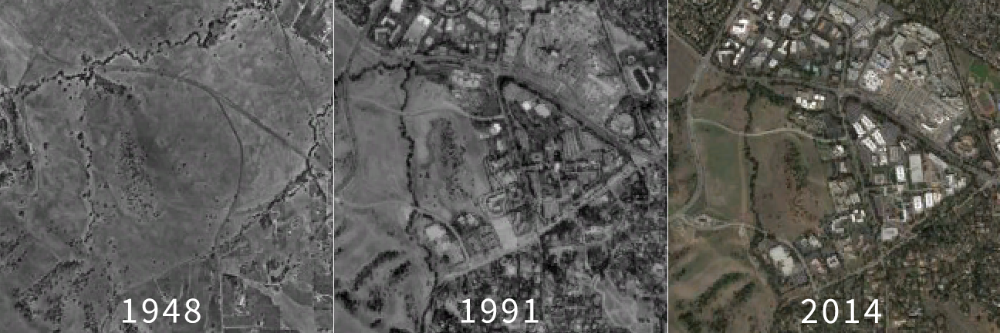
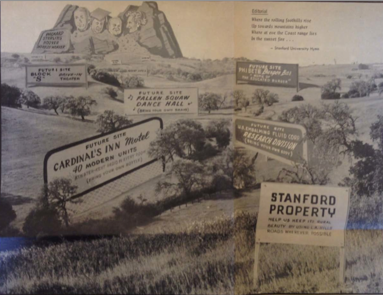
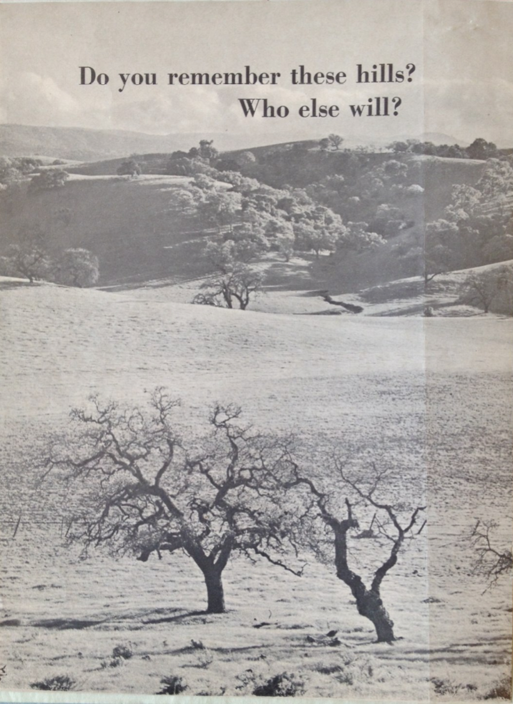
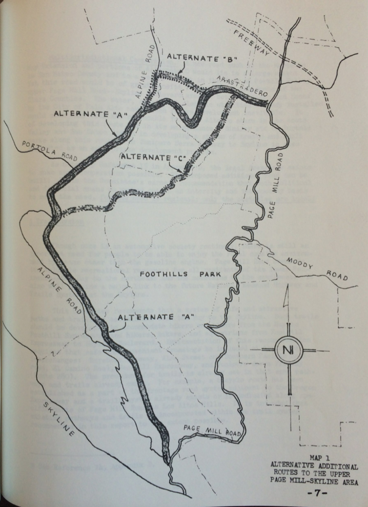
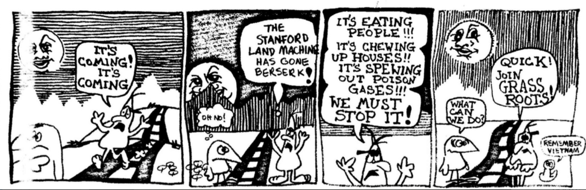
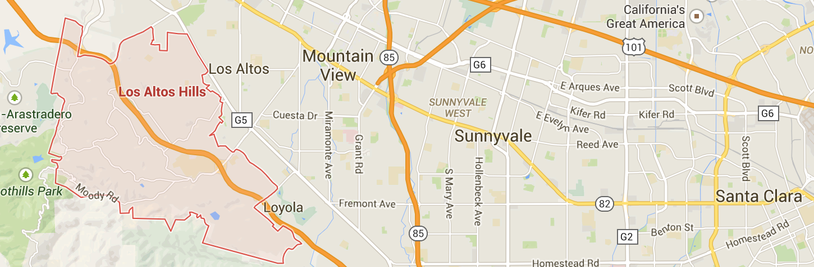

---
author:
- Jason A. Heppler
title: |
    | Chapter 4
	| A Place for Nature
	| The Politics of Growth and Planning
...

\begin{aquote}{Stewart Udall, 1965}
We stand today poised on a pinnacle of wealth and power, yet we live in a land of vanishing beauty, of increasing ugliness, of shrinking open space and of an overall environment that is diminished daily by pollution and noise and blight. This, in brief, is the quiet conservation crisis.
\end{aquote}

\begin{aquote}{Tom Wolfe, 1983}
From the work bays of the light-industry sheds that the speculators were beginning to build in the valley, you could look out and see the raggedy little apricot trees they had never bothered to bulldoze after they bought the land from the farmers.
\end{aquote}

\begin{aquote}{"Pollution," Tom Lehrer, 1960}
The breakfast garbage you throw in the Bay, they drink as lunch in San Jose.
\end{aquote}

Journalist Leonard Downie could scarcely find nature in Santa Clara County. Visiting San Jose in the early 1970s, he concluded that the only remaining open space existed along the "carefully tended and regularly watered greenery along the shoulders of the county's many freeways." The Santa Clara Valley had become defined by the clusters of poorly-built and quickly constructed homes, traffic that had given the air a "mustard-colored haze," and urban space so compact that there existed no "open spaces, parks or even sidewalks." Downie blamed poor planning and greed for the Valley's urban problems, citing a study that found residential density could be maintained near 1973 levels in just thirty square miles instead of 134, saving miles of open space and orchards. Santa Clara County, Downie concluded, had become a "jigsaw puzzle of intertwined suburbs" and the land "systematically ravaged" by "speculators, developers, other entrepreneurs and homebuyers."[^4] Downie was not alone in questioning the value of urban growth at the expense of disappearing open space. After a decade-long boom that saw Bay Area cities sprawl across the landscape, activists, journalists, homeowners, and critics promoted the protection of open space for recreation, aesthetics, and ecological health. Environmental advocates argued for new restrictions on city growth and the protection of greenbelts, public parks, and wilderness areas. "Already we have filled the San Francisco basin with housing, industry, airfields, and highways, from the tops of the hills to the edge of the water," wrote Raymond Dasmann, a Berkeley-trained biologist and conservationist. If the process proceeded, Dasmann feared a "gigantic, disorganized metropolis" "engulfing farm and forest, marsh and pasture with no end in sight."[^5]

Anxieties over suburban growth and issues of clean air and water, open space, sprawl, discrimination, and pollution defined environmental politics in the Bay Area. Postwar American environmentalism largely became issues over quality-of-life as new worries about chemicals used in products, pollution of water resources, pesticides, and overrun national parks became key political issues. The publication of bestselling books, including Stewart Udall's *The Quiet Crisis*, Rachel Carson's *The Silent Spring*, and Paul Ehrlich's *The Population Bomb*, made the case for greater regulation of urban growth and pollution. The passage of new legislation embodied attempts to protect land, air, and water, such as the Wilderness Act of 1964, the National Environmental Policy Act of 1970, the creation of the Environmental Protection Agency, the Clean Air Act of 1972, and Endangered Species Act of 1973.^[On the emergence of wilderness protection, see @turner2012wilderness; @nash1967wilderness; @harvey2005zahniser; @sutter2002driven; @nicholas2003imagining. The historiography of the environmental movement is vast. See, for example, @hays1987beauty; @rome2001bulldozer; @rothman2000saving; @wellock2007environmentalism; @shabecoff2000rising; @scheffer1991environmentalism; @gottleib2005forcing.] 

Against this backdrop, rapid growth in western cities encouraged new concerns about their environmental impact, which had the effect of shaping local and regional politics. World War II defense industries, Cold War military and industrial buildup, and tourism and recreation encouraged the growth of western cities, and, while growth brought new prosperity and wealth, it also unsettled westerners who watched rural landscapes vanish under four-lane highways, parking lots, office buildings, and residential developments. By the 1960s, some westerners began pushing back against the tide of change and fueled new antigrowth and environmental politics throughout the region. Comprised mostly of middle-class professionals, suburban liberals and conservatives found common ground over environmental damage, uncontrolled growth, poor planning and development, trampled wilderness, and disappearing open space.

The economic and infrastructural changes wrought by World War II, the militarization of western industry, and the growing recreational and tourism economy led to breakneck metropolitan growth throughout the region between 1940 and 1960. Westerners witnessed what they perceived as environmental damage, giving rise to a cultural and political backlash throughout the region that manifested itself in antigrowth activism and quality-of-life politics. Largely comprised of middle-class professionals, metropolitan growth and environmental and social problems identified by growth and quality-of-life activists lay at the center of their motivations. The millions of Americans coming to western states like Colorado, Oregon, and California since World War II came to take advantage of these state's air quality, federal public lands, recreation, and economic opportunities. By the 1960s, however, newcomers and old-timers alike believed too many people were moving in and threatening their quality of life.^[On quality-of-life politics, see @abbott2008cities, 205; @carney2007suburbanizing, 480-481; @scott2008hip, 253-255; @childers2012ski, 71-73.]

This chapter traces the chronological contours of urban sprawl debates in Silicon Valley. Debates over open space in Santa Clara Valley roughly followed three branches. One branch emerged among expert urban planners and residential activists, who relied on professionals to form a critique of poor urban planning and the loss of natural landscapes. As Adam Rome has demonstrated, homeowner's sense of environmentalism emerged from professionals and experts.[^6] In the process, they pressured politicians to craft new zoning restrictions that required environmental impact studies and strict zoning requirements. A second branch came from anti-growth and no-growth advocates who urged tightened restrictions on the places that cities were allowed to expand. Simultaneously, elite suburbanites were challenged by communities on the margins of the suburbs---Chicanos, African Americans, Asian Americans---who formed a critique of sprawl based not on aesthetics but out of concerns for human health and safety. Together, these activists shared a common language---using terms such as "beauty," "wilderness," "ecology", "health", "sprawl"---but used that vocabulary to defend and define different goals. Environmental advocates revealed a clash between competing political ideas and urban priorities, placing ecology and its relationship to cities at the center of the conflict. Environmental activists influenced urban planning, arguing that prevailing trends in land use, density, and urban design harmed sustainability and the economic viability of their communities.

<!-- CFG -->

\thoughtbreak{In 1960, a short but intense fight} over the proposed industrial development of the Stanford foothills to the southeast of the main campus marked the beginning of a cultural and political shift in the Bay Area. Stanford announced in January plans to expand foothills development southward from the existing Industrial Park. In particular, Stanford received interest from the Ampex Corporation, a manufacturer of high-end sound recording and broadcasting electronics, to build a new research facility in the foothills. Surrounding neighborhoods, however, fiercely opposed the development on Stanford's property eventually leading to a referendum campaign. Stanford President Wallace Sterling referred to the year-long contest as "the Battle of the Hills."^[Letter from Wallace Sterling to John Francis Neylan, April 11, 1960, Folder 8, Box A29, SC 216, Stanford University Archives. Margaret O'Mara provides an excellent overview of the Battle of the Hills in *Cities of Knowledge*, 132-139.] 

Roughly six-hundred acres of undeveloped university land lay between Junipero Serra, West Fremont, Arastradero, and Page Mill roads. Originally zoned for residential development, Stanford administrators submitted an annexation proposal to the City of Palo Alto, who would then have the authority to rezone the land for light industry. Electronics manufacturers had already sought out the area as prime real estate for establishing research facilities, taking advantage of nearby residential neighborhoods for employees to live, proximity to researchers at Stanford and the Industrial Park, city infrastructure, and a favorable tax climate. In January 1960, Ampex and General Telephone and Electronics Laboratories Corporation (GT&E) announced plans to build and expand their operations in the Stanford foothills both north and south along Page Mill Road, in part to take advantage of the proposed route of the new Junipero Serra Freeway.^["Ampex plant just first in Stanford plan," *Palo Alto Times*, January 14, 1960, 2; "Electronics research plant planned for foothills area," *Palo Alto Times*, January 28, 1960, 1; letter from Wallace Sterling to Gordon Johnson, March 16, 1960, FF8, Box A29, SC 216, Stanford University Archives.] Additional development plans were laid out for a new shopping center and luxury homes in the Palo Alto--Los Altos Hills foothills.^["103-acre foothill plan told," *Palo Alto Times*, January 29, 1960, 1-2.] In May 1960, the Palo Alto City Council approved the rezoning in a 9 to 4 vote.^[Letter from Thomas Hunt to Alumni, May 9, 1960, 2, Folder 8, Box A29, SC 216, Stanford University Archives.]

Residents had few objections for the proposed residential and shopping center developments in the foothills. Industrialization, however, was unacceptable. Ampex's proposed eighty-acre development location ran up against resistance from neighboring communities, fueling quality-of-life and environmental politics in surrounding neighborhoods. The proposed site ran along the Los Altos Hills city line and raised concerns among property owners and Los Altos Hills city officials who feared the loss of scenic beauty and the residential ambiance of the area.^["Decision now will determine future," *Palo Alto Times*, February 11, 1960, 16.] Furthermore, residents were growing suspicious of Stanford's role as a land developer and apparent disregard for planning. One resident summed up the issue saying, "there has been growing concern over Stanford's policy of presenting pre-packaged zoning requests. . . . They resemble closely the tactics of many a Land Developer asking for variances from planned uses."^[Morgan Stedman, text of prepared meeting with Sterling, March 14, 1960, FF11, Box A29, SC 216, Stanford University Archives. Quoted in @omara2005cities, 136.] Another resident wrote the Stanford Board of Trustees urging the foothills to remain closed to industrial development: "The Peninsula is already too crowded -- therefore, new industry should not locate here."^[Letter from Mrs. H.  Wilson to Stanford Trustees, March 4, 1960, FF8, Box A29, SC 216, Stanford University Archives.] Palo Alto resident Richard Bell in a letter to Stanford President Wallace Sterling lamented the "program of land exploitation pursued by the school during the past ten years" which has "succeeded . . . in eliminating much of the natural beauty and attraction . .  . [that] contributed so much toward making Stanford the top school in the west."^[Letter from Richard Bell to Wallace Sterling, August 2, 1960, FF8, Box A29, SC 216, Stanford University Archives.] The goals of Stanford's development plans were unclear to residents which, from their perspective, seemed to indicate the university was planning to overrun the natural beauty of the area.^[Letter from Thomas Hunt to Wallace Sterling, May 14, 1960, Folder 8, Box A29, SC 216, Stanford University Archives.]

Complaints of potential industrialization of the foothills reflected not only arguments about the area's beauty, but also noise and air pollution that accompanied development. The sounds of hammers driving nails into two-by-fours were only part of a chorus of common sounds experienced by suburbanites. The whirring and grinding of manufacturing equipment, the clattering of dump trucks, the drone of automobile traffic, the belching of bulldozers---these became common sounds of the growing city. Concerned that such realities would become even more common in Palo Alto, critics spoke up in newspaper editorials and letters. In a letter to the *Palo Alto Times*, Morgan Stedman, a member of the Santa Clara County Planning Commission, argued that new foothills industrialization would increase traffic flow through neighborhoods, thus increasing smog, noise, and danger, large-scale cutting and filling of land would be required to support new buildings, parking lots, and roads, the loss of rainwater through runoff, and "irreparable damage to natural beauty."^[Newspaper clipping, "Area planning seen as needed," *Palo Alto Times*, March 12, 1960, from FF8, Box A29, SC 216, Stanford University Archives.] 

The spatial arrangements of cities and zoning shaped how residents responded to the proposed industrialization. The foothills area  was originally zoned for residential or agricultural use and excluded the establishment of industrial and commercial developments. Furthermore, the community of Los Altos Hills incorporated as a residential-only city. But encroachments of industry into these areas raised concerns about the potential environmental damage that industrialization would bring to surrounding communities. Stanford claimed that the industrialization would result in clean and well-kept facilities, reassuring residents that the smoke pollution of the Midwest and East would never be present in Santa Clara Valley.^[Transcript of interview with Alf Brandin by Bob DeRoos, Regional Oral History Office, The Bancroft Library, University of California-Berkeley, n.d., 42.] However, a greater concern for local residents revolved around the issue of smog and traffic.  In a letter to Wallace Sterling, one resident summed up the attitude of many of the area's environmental critics:

> We now have smog, congestion, and acres of asphalt where we once had fresh 
> air and freedom of movement in a beautiful countryside -- in one of the 
> finest climates on earth! The responsibility for developing such a unique 
> area should be in the hands of the most intelligent and PERCEPTIVE people 
> available! There seems to be little concern about total environment. . . . 
> The area sorely needs parks, golf courses, and low density housing. We need 
> cultural and recreational centers for all age levels. A University such as 
> Stanford could well promote an interest in fields that enrich life. 
> Industrial and commercial interests are far from being neglected but the 
> humanities certainly are!^[Letter from Gordon Johnson to Wallace Sterling, 
> March 6, 1960, FF8, Box A29, SC 216, Stanford University Archives.]

Heavy commuter traffic, smog, concerns about the loss of the foothills pastoral beauty, and Stanford's seemingly smug handling of community relations resulted in new political energy that would spread through the community and alumni networks.^[@omara2005cities, 135; letter from Jerrold and Sara Hunt to Wallace Sterling, May 14, 1960, 1, Folder 8, Box A29, SC 216, Stanford University Archives.] In the wake of such concerns and criticisms, ad hoc community and environmental coalitions formed, led by the Citizens Committee on Regional Planning (CCRP). The organization, under the initial leadership of Robert Mahan, an insurance executive from Palo Alto, organized a letter writing campaign to voice their opposition to the foothills proposal. A few weeks before the group officially named itself, some of the founding members ran an insert in the *Palo Alto Times* that urged readers to clip from the paper and mail to the Stanford Board of Trustees to illustrate grassroots opposition to industrialization.^["Anti-foothill industry drive launched here," *Palo Alto Times*, March 8, 1960, 2; "Industry opponents organize, name head," *Palo Alto Times*, March 11, 1960, 1.] Within two days of publishing the letter, the Stanford Board of Trustees had received 250 letters voicing opposition to the plan, many of which were clipped from CCRP's *Palo Alto Times* insert.^["Industry opponents organize," *Palo Alto Times*, March 11, 1960, 1; "13 residents protest foothill zoning change," *Palo Alto Times*, March 4, 1960, 17.] 

Resistance from residents targeted the city council as well. The Palo Alto Residents Association (PARA) called for "a vigorous campaign" against the Palo Alto City Council's plans to allow industrial development in the foothills.^["Residents oppose industry," *Palo Alto Times*, March 10, 1960, 1. Residents also pointed to a potential conflict of interest relationship between Palo Alto Mayor Noel Porter and David Packard. Porter was serving as vice president of Hewlett-Packard at the time. See "Industry opponents organize, name head," *Palo Alto Times*, March 11, 1960.] Peter Hughes, an officer of PARA, charged that developing the foothills would destroy the landscape. Calculating that the Ampex site would cover thirty acres of parking lot and another twelve acres for buildings, Hughes challenged that "if anyone can lay down that amount of building without changing the contour of the land he is an engineer the like of which I have never seen."^["Residents oppose industry," *Palo Alto Times*, March 10, 1960, 1.] Other residents charged that industrialization of the foothills would inevitably result in the ruin of a pastoral landscape, no matter how much planning went in to the design of industrial areas.^[Letter from Gordon Johnson to Wallace Sterling, March 6, 1960, 1-2, Folder 8, Box A29, SC 216, Stanford University Archives; letter from Jerrold and Sara Hunt to Wallace Sterling, May 14, 1960, 1-2, Folder 8, Box A29, SC 216, Stanford University Archives.] Los Altos Hills resident Thomas Hunt put it more bluntly: "The foothills can be kept green and will be kept green, IF WE ARE DETERMINED TO KEEP THEM SO!"^[Letter from Thomas Hunt to Alumni, May 9, 1960, 2, Folder 8, Box A29, SC 216, Stanford University Archives.]

The neighboring community of Los Altos Hills also expressed their disapproval of the plans. Residents, irate that their residential-only incorporation would be blemished by industrialized foothills, expressed their displeasure through letters and newspaper editorials. Mayor John Fowle and the city council rebuffed Stanford in a letter to Alf Brandin, accusing Stanford of "jeopardizing existing zoning and land development" and charged that the university's plans were never "subject to public scrutiny." Furthermore, contrary to Stanford's claims that it was working with surrounding communities, Los Altos Hills claimed it was caught unaware of the university's plans.^["Stanford foothills plans hit by Hills," *Palo Alto Times*, February 10, 1960.] Sterling responded to one such letter claiming that "Stanford has made a conscientious effort to keep the communities surrounding the campus informed of our plans, an effort which could easily be documented."^["Sterling Answers Alumni," *Palo Alto Times*, February 24, 1960, Folder 11, Box A29, SC 216, Stanford University Archives.] Letters continued to pour into Stanford and the *Palo Alto Times*. President Sterling received around 400 letters in opposition to the plan and around fifty in support over the course of four months.^[@omara2005cities , 134.] The editorial pages of the *Palo Alto Times* also became a key outlet for residents to voice their frustrations and concerns.

For its part, Stanford pushed back by arguing that it needed to develop the lands in order to generate income for the University. Thomas Ford, staff council for the university, claimed that he desired to see the land remain undeveloped but "the university's need for funds makes that impossible."^["Foothills industry can be beautiful," *Palo Alto Times*, March 2, 1960.] Stanford had good reason to pursue this line of argument. The university had indeed fallen on financial hard times, and its endowment was far below its peer institutions.^[@lowen1997creating, 130.]

Stanford also continued their refrain that the development of the foothills would not become industrial blight, but rather, in the words of Thomas Ford, would "be a thing of beauty" due to the University's enforcement of strict design regulations.^["Foothill industry can be beautiful," *Palo Alto Times*, March 2, 1960.] Furthermore, Stanford positioned itself as a reluctant land developer only in the business of supporting education and research. Alf Brandin took to the pages of the *Palo Alto Times* to argue that the university was not "in the land development business per se" but that the university was "doing everything we possibly can to produce income [to support education]."^["Undeveloped acres prime resource," *Palo Alto Times*, March 4, 1960.] "People should feel thankful Stanford owns the land and not someone else," Brandin chided. "We try to look at the problems politically, sociologically, aesthetically, and economically."^["Stanford wouldn't do anything detrimental," *Palo Alto Times*, March 4, 1960.] Stanford urged residents to realize the role the university had played in preserving open space, the role residents played in causing traffic congestion, and Stanford's road construction efforts. Without Stanford, the university seemed to argue, none of these improvements would exist.^["Foothills industry can be beautiful," *Palo Alto Times*, March 2, 1960; "Stanford wouldn't do anything detrimental," *Palo Alto Times*, March 4, 1960; Letter from Gordon Johnson to Wallace Sterling, March 6, 1960, FF8, Box A29, SC 216, Stanford University Archives.]

When letter and editorial campaigns failed to initiate the planning that critics wanted to see, they turned to the next available civic tool: the referendum. In June a petition campaign initiated by opponents of foothills industrialization circulated through Palo Alto. The petition called on the city council to either rescind its decision to rezone the land for light industry or to allow residents a vote on the issue. Four days before the rezoning ordinance was to become official, the referendum petition was filed to the City of Palo Alto having collected over two thousand signatures above the necessary 1,000 that was needed. The Stanford lands were now in the hands of the voters. Placed on the ballot for the November elections, a "yes" vote would allow for Stanford to carry forward with its expansion of the Industrial Park and pave the way for Ampex's research facility.^[Details about the petition's criticisms and intent can be found in a letter from Morgan Stedman to Wallace Sterling, June 20, 1960, FF 8, Box A29, SC 216, Stanford University Archives. In an explanatory sheet given to solicitors and signers of the petition, the referendum called for better planning of residential, industrial, and commercial areas and specifically criticized the sudden zoning change to light manufacturing, housing and traffic pressures that new industrialization would add to the area, the leveling of hills to accommodate new construction, and pointed to undeveloped lots already zoned for industry as alternatives to foothills development. Letter from Stedman to Sterling, June 20, 1960, FF 8, Box A29, SC 216, Stanford University Archives.]

As referendum supporters spent the month of June collecting signatures, additional pressure to alter land development policies came from Stanford alumni. In June, a group calling themselves the Bay Area Stanford Alumni printed an insert in the *Stanford Review*, the alumni news organ of the University, accusing Stanford of ignoring land development policies implemented by the Board of Trustees in 1958. The petition called on Stanford to find alternatives for earning money other than "defacing the beauty of the green and summertimes golden hills" and called on the university to consult with the master plans of surrounding communities before making plans to rezone nearby areas.^["A Message from Bay Area Stanford Alumni to President Sterling and the Board of Trustees," 1960, FF 8, Box A29, SC 216, Stanford University Archives, p 2-3.] 

The *Review* was quick to distance itself from the Bay Area Stanford Alumni. In the issue in which the insert ran, Kemper Freeman, president of the Stanford Alumni Association, noted that the official alumni organization "emphatically disagrees with the views and impressions" of the insert. The *Review* ran the insert, Freeman argued, because the periodical "stands for freedom of expression," but "reject[ed] their assumptions, criticisms, and conclusions."^[Kemper Freeman to Stanford Alumnus, Stanford Review, June-July 1960, Folder 8, Box A29, SC 216, Wallace Sterling Papers, Stanford University Archives,  1.] Freeman placed distance between the alumni association and the Bay Area group, noting that the group's members accounted for "less than half of one per cent of the total" number of Stanford alumni living in the Bay Area. Kemper's letter responded to the insert's criticism point by point, arguing that the Stanford lands were "never intended to be a wilderness" and concluded that the development of lands not "needed for academic purposes is overdue." Furthermore, the insert gave "no hint" that Stanford was "preserving 4,800 of its 8,800 acres for academic purposes or that this reserve includes the greater part of the 'rolling hills.' Nor does it reveal that for every two acres of its land which Stanford has leased in the past decade, one acre has been condemned for use by some governmental unit or agency." The claims of the Bay Area Alumni, Freeman concluded, were misleading and without merit.

As the referendum campaign dragged on through the summer, editorials to the *Palo Alto Times* attempted to flip complaints about the loss of the foothills upside-down, using the critic's nostalgia of the environment as an argument in Stanford's favor.^[@omara2005cities, 137.] One such editorial in the *Palo Alto Times* expressed "gratitude" to Stanford for "so generously permitting thousands of people to freely enjoy the rolling, tree-studded hills, the lakes, and views of the campus."^[Esther B. Clark, M.D., Letter to the Editor, *Palo Alto Times*, March 28, 1960, FF 11, Box A29, SC 216, Stanford University Archives.] The *Times* itself continued its enthusiasm for Stanford's land development plans, writing that the community owed Stanford a debt for keeping the area's lands free of intrusive industry.  The *Times* argued that Stanford's large landholdings "constituted a free park" for Palo Alto and surrounding communities. Had these lands fallen into the hands of private owners, they "long ago would have been converted to the houses, business places and industries where so many of us live and work."^[Editorial, *Palo Alto Times*, November 1960, Stanford Lands Scrapbook V, 1960-61, Subject File 1300/9, Stanford University Archives.] One editorial writer to the *Times* admonished the former "solid supporters of free enterprise" who were now staging "violent public quarrels about what they're going to do with someone else's property" that "the land isn't theirs" and Stanford should do what it needed to do.^[Editorial by Daniel S. Endsley, *Palo Alto Times*, November 1, 1960.] Stanford itself was quick to remind critics of the efforts the university had put towards city development. As Sterling reminded one critic, overseeing the vast domain of land on the Peninsula meant "the hills are not likely to be overrun by any commercial developments in your lifetime or mine."^["Letter from Wallace Sterling to Gordon Johnson," March 6, 1960, FF8, Box A29, SC 216, Stanford University Archives. Editorials to the *Palo Alto Times* made the same claims. See, for example, the editorial by Louise Brisebat, *Palo Alto Times*, November 4, 1960.] In other cases, university officials were willing to dismiss them entirely.  Donald Carlson referred to critics as "malcontents in the community" and complained in another letter that industrialization would only affect "one little foothill," dismissing their concerns as something trivial.^[Letter from Donald Carlson to Ben Allen, May 12, 1960, FF 8, Box A29, SC 216, Stanford University Archives; "Groups Clash over Use of Stanford Land," *San Francisco Examiner*, March 18, 1960.]

In November, the referendum was defeated in a close vote. The University's arguments and own grassroots campaign helped to turn the referendum in their favor and allowed for the expansion of the Industrial Park. On the one hand, the campaign against the Ampex development could be considered a victory. The company, after the year-long, drawn-out political process, decided to build its research facility elsewhere. However, the new zoning of the foothills opened a new area for new light industry to join the Stanford Industrial Park.^[Stanford learned lessons about community engagement through the "Battle of the Hills." An example of this came a year later when a proposal for the expansion of Oregon Expressway, which cut through a highly desirable residential community, met resistance of area residents. But a community organization calling itself the Traffic Action Committee emerged to support the expansion. The pro-expressway movement arose from grassroots, but appears to have also been supported (if not encouraged) by Stanford administrators. See @omara2005cities, 137-138; letter from Donald Carlson to Frederic Glover, September 20, 1961, Box A22, Stanford University Archives.]

Stanford administrators never understood why residents were upset about Stanford's development plans. Alf Brandin recalled that Stanford had an issue with semantics, arguing that "we tried to say it has got to be clean, no smoke, no heavy manufacturing. Light manufacturing that is clean and electronic."^[Brandin interview, 42.] Stanford took this to heart, renaming the *Industrial* Park to Stanford *Research* Park shortly after the Battle of the Hills in order to avoid industrialization's association with the area. But Stanford's belief that the issue revolved around semantics---that the word "industry" in Stanford Industrial Park was confusing residents---reveals that Stanford had no understanding of citizen's real concerns. Citizens rightfully argued that industrialization---light manufacturing or otherwise---was going to have an enormous impact on the environment. Stanford's frequent claims of "clean" industry often turned out to be false. Stanford could control complaints about light and noise pollution to a degree, but other pollutants---radiation, smog, and toxic solvents---would remain harder to regulate, sometimes invisible, and have great repercussions. One resident noted in the heat of the Battle of the Hills debate that a Lockheed plant near his home resulted in a "federal agency [that] has been checking the shrubs in our back yard for radioactivity."^["Pros and Cons of Foothill Industry Zone Debated," *Palo Alto Times*, April 21, 1960, 13.] No amount of planning, architectural prowess, and superb landscaping could get around the visible and invisible pollution resulting from high technology manufacturing and urban sprawl.

<!-- ## A Citizens' Campaign to Protect the Foothills -->

\thoughtbreak{The grassroots activists spent the 1960s building networks} in order to support a growing citizens' movement to protect the foothills. The controversies over Stanford Industrial Park and Stanford's economic development plans spurred the emergence of grassroots environmental activism. In the wake of Stanford's victory, residents of the area, increasingly concerned that Stanford might overrun the foothills and irritated by the university's seemingly dismissive attitude towards citizen's concerns and favoritism towards industry, continued to pressure the university. Among the most prominent and long-lasting groups to emerge was the Committee for Green Foothills. Formed in the living room of Ruth Spangenberg in 1962, the Committee included Stanford alumni and area professionals, including the well-known writer and Stanford creative writing professor Wallace Stegner and former Santa Clara County planner Morgan Stedman.^[Stegner oral history, Bancroft,  8; @walker2007countrycity,  101.] The Committee was founded, Wallace Stegner explained, because "of things that seemed to be happening in the hills that we didn't like to see happen" and motivated by a "fear of what Stanford might do in the hills."^[Stegner oral history, Bancroft, p 7-8.] The impulse to protect land that emerged in the Battle of the Hills continued throughout the rest of the decade as Stanford pursued land development initiatives on the Peninsula. 

The organization was not anti-growth per se, and thus distinct from the no-growth activists that would come in the 1970s. Rather, the organization and its members feared that city leaders and the university were not giving enough attention to the potential problems of industrial growth. Members of the Committee would still argue that Stanford played an important and positive role in their communities. But they also recognized the immense influence the university would have on the landscape around them. The Battle of the Hills and the rising criticism of urban growth would be only the first conflict for the burgeoning environmental coalitions in the Bay Area. 

Some of the original members of the Committee for Green Foothills had earned reputations as conservationists before CGF's establishment. Wallace Stegner had risen to prominence as a conservationist in the late 1950s. His famous "Wilderness Letter" published in 1960 established Stegner as a bona fide defender of the environment.^[Wallace Stegner, "Wilderness Idea," in *The Sound of Mountain Water* (1969); originally written to the Outdoor Recreation Resources Review Commission in 1960 to support legislation that would designate wilderness areas in the United States.] Several additional members of the Committee for Green Foothills had either been long-time conservationists or would get their first exposure to environmental activism with the Committee. Morgan Stedman, an architect who had served on the Palo Alto Planning Commission and the Santa Clara County Planning Commission, became a vocal critic of poor urban planning throughout Santa Clara County. Many other members later devoted themselves to various conservation and environmental protection campaigns throughout the Bay Area. Barbara Eastman, for example, served as a key organizer of the Save Our Seashore organization, founded in 1969 to expand the protection of Point Reyes from logging and freeway construction along the western edge of Marin County.^[@walker2007countrycity, 91.] Lois Hogle, Ruth Spangenberg, Morgan and Katy Stedman, and Gary Girard would go on to lead several environmental campaigns throughout the Peninsula, and in some cases find themselves in civic leadership positions in their communities.^[Transcript of interview of Wallace Stegner by Ann Lage. Regional Oral History Office, The Bancroft Library, University of California-Berkeley, 1982,  10.] The Committee counted among their powerful allies Bill and Mel Lane, owners of *Sunset* Magazine; Dorothy Varian, wife of Varian Associates founder Russell Varian and member of the Conservation Associates; and Tom Ford, a real estate developer in the Bay Area.^[@walker2007countrycity, 101-103.] 

The Committee's first major test came in 1965 when plans were announced to straighten and widen Page Mill Road, a historic roadway running northeast-to-southwest from downtown Palo Alto into the Santa Cruz foothills.  Page Mill had become a major thoroughfare for commuter traffic going into and coming out of Stanford Industrial Park. But by the mid-1960s, city planners and the university determined that the winding and narrow road was inadequate for the increased traffic flow. The City of Palo Alto announced plans to widen and straighten the road in late 1964. In response, the Committee for Green Foothills formed a subcommittee called the Page Mill Road Coordinating Committee (PMRCC). The proposed changes to Page Mill, the Committee for Green Foothills argued, would mean deep cuts into the hillsides, the pouring of a cement canal to replace Matadero Creek that ran along the road, the removal of nearly a thousand trees, and potentially threatened Frenchman's Tower, a local historic landmark at the base of the hills.^[Stegner interview,  9; letter from the Committee for Green Foothills to Friends of the Foothills, May 20, 1964, Folder 1, Box 1, Page Mill Road Coordinating Committee Records, M0970, Stanford University Archives,  1; letter from Wallace Stegner to Martin Spangler, July 28, 1964, Folder 1, Box 1, Page Mill Road Coordinating Committee Records, M0970, Stanford University Archives, 1. Page Mill Road dates to the late nineteenth century and was used by William Page, who operated a lumber mill along Mill Creek. "Page's Mill Road" was a main avenue for horse teams to haul lumber into Palo Alto for shipping and construction.  Peter Coutts, a French land developer who purchased land along the road in 1876, constructed Frenchman's Tower for the storage of water.  Leland Stanford bought Frenchman's Tower and the surrounding land in 1882. See Ralph Hansen to Alf Brandin and Lois Hogle, August 11, 1964, Folder 9, Box 1, Page Mill Road Coordinating Committee Records, M0970, Stanford University Archives, 1-3.  See also "Historical Notes of Interest Surrounding Page Mill Road and Environs," Ralph Hansen, Palo Alto City Historian, n.d., Folder 9, Box 1, Page Mill Road Coordinating Committee Records, M0970, Stanford University Archives.]

Unlike the Battle of the Hills where *aesthetics* and *conservation* defined the political response, the convergence of *recreation* and *conservation* formed the crux of criticism charged at the proposed changes to Page Mill Road. The protection of the environment around Page Mill became their central concern, largely revolving around recreational access. In addition to cutting into hills and threatening the creek and numerous trees, changes to the road had the potential to aggravate flooding hazards. A straight four-lane road cutting through the foothills meant the potential for "such a paved canyon" to increase water runoff that could overflow Matadero Creek.^[Letter from Wallace Stegner to Martin Spangler, July 28, 1964, Folder 1, Box 1, Page Mill Road Coordinating Committee Records, M0970, Stanford University Archives, 1. In a letter to the County Board of Supervisors, several sponsoring organizations expressed their view that runoff hazards would increase. "Saving Old Page Mill Road," September 10, 1964, Folder 1, Box 1, Page Mill Road Coordinating Committee Records, M0970, Stanford University Archives, 1.] The road, Stegner argued, "offers the easiest access to the hills for citizens of Palo Alto and surrounding towns" by serving as a "natural route to Palo Alto's Foothills Park" and is "used by children on bicycles and horses, and by families on picnics." Changes to Page Mill Road would mean destroying "these amenities, more valuable with every passing year."^[Letter from Wallace Stegner to Martin Spangler, July 28, 1964, Folder 1, Box 1, Page Mill Road Coordinating Committee Records, M0970, Stanford University Archives, 2.] Furthermore, changes to the road meant mixing vehicular and non-vehicular traffic that posed potential dangers to equestrianism---"an important part of life of the rural foothills"---pedestrians, and cyclists who used the winding roadway for recreation.^["Report on Page Mill Road - Serra Freeway Interchange," from Page Mill Co-ordinating Committee to Alan Hart, August 3, 1965, Box 1, Folder 10, Page Mill Road Coordinating Committee Records, M0970, Stanford University Archives, 3.] A census conducted by the Los Altos Hills Junior Horsemen's Associated counted 945 horses in the area---residing at the large horse stables at Stanford University, Crook's Ranch, and Fox Tail Farm---as well as eighty-nine children, eighty-two bicyclists, and forty-three hikers.^["Report on Page Mill Road - Serra Freeway Interchange," from Page Mill Co-ordinating Committee to Alan Hart, August 3, 1965, Box 1, Folder 10, Page Mill Road Coordinating Committee Records, M0970, Stanford University Archives, 3.] Mixing vehicular and non-vehicular traffic, the Committee argued, would "create a dangerous situation" and "curtail the traditional uses of Page Mill Road as a main access route to and from the foothills."^["Report on Page Mill Road - Serra Freeway Interchange," from Page Mill Co-ordinating Committee to Alan Hart, August 3, 1965, Box 1, Folder 10, Page Mill Road Coordinating Committee Records, M0970, Stanford University Archives, 5. See also letter from Leonard Ginzton to Mary Gordon, July 18, 1965, Folder 10, Box 1, Page Mill Road Coordinating Committee Records, M970, Stanford University Archives, 1-2.]

<!-- CONTEXT RECREATION -->

In 1965 the Page Mill Road Coordinating Committee began studying the potential environmental impact of widening and straightening Page Mill in order to offer suggestions for alternate routes. The Committee released its study in December 1965 with suggestions for a parallel road that ran near Page Mill Road but left the original road alone. Page Mill's status as a "scenic resource," the study concluded, needed to be protected by both rerouting the new road and the establishing a new system of parks and trails near Page Mill.^["A Study of Page Mill Road," December 1965, Folder 12, Box 1, Page Mill Coordinating Committee Records, M0970, Stanford University Archives, 2.] The Page Mill Committee commenced with a petition campaign as well, gathering the signatures of nearby residents to urge the designation Page Mill a recreation road with "possible scenic easements and 'protection from progress'."^[Page Mill Road mailer, March 23, 1965, Folder 2, Box 1, Page Mill Road Coordinating Committee Records, M0970, Stanford University Archives.] The Page Mill Committee enjoyed wide support from other conservation and recreation organizations, including the Page Mill-Arastradero Association, the Loma Prieta Chapter of the Sierra Club, the California Roadside Council, and the National Campers and Hikers Association.

In the end, the Page Mill Coordinating Committee succeeded in convincing Stanford University, the City of Palo Alto, and the County Board of Supervisors to look into alternative routes. The majority of Page Mill Road was left alone and no major alterations for a second route were made save for the Junipero Serra Freeway and Page Mill interchange, where a four-lane alternative route running parallel to the now named Old Page Mill Road was established to the east of the scenic route.

The resolve of environmentalists in halting industrialization projects would be tested again by the end of the decade. In the fall of 1967 Stanford announced a request for the rezoning of the land between Hillview Avenue and Arastradero Avenue encompassing Coyote Hill, primarily for the new zoning of residential estates and single-family residences. The Coyote Hill development would also house a medical research center operated jointly by Stanford and the pharmaceutical company Syntex and a grazing area on top of Coyote Hill to house animals used in research. Additional real estate and land development programs spearheaded by Stanford included a financial center called Dillingham along Sand Hill Road that included plans for office towers, a hotel convention center, and parking.  On a newspaper clipping announcing public hearings on the proposed zoning changes, an activist circled the included map and scrawled "here we go again."^[Newspaper clipping, September 16, 1967, *Palo Alto Times*, Folder 16, Box 1, Page Mill Coordinating Committee Records, Stanford University Archives. The writer included their initials, "PMB," which is likely Patricia M. Brown, who had been part of the original 1960 Battle of the Hills fight. Brown was a signatory on the insert "What is the future of the Stanford lands" that ran in the *Palo Alto Times* in 1960 (see "What is the future of the Stanford lands?" newspaper clipping, *Palo Alto Times*, n.d., Folder 16, Box 1, Page Mill Coordinating Committee Records, Stanford University Archives.) A "Pat B." is also noted in some handwritten notes from a Palo Alto city council meeting in Folder 16, Box 1, Page Mill Road Coordinating Committee Records, Stanford University Archives. ]

By the late 1960s conservation and environmental organizations were no longer willing to compromise with Stanford. In November 1969, the Committee for Green Foothills filed suit against the University and the City of Palo Alto citing irregularities in the rezoning process and a conflict of interest with two City Council members in the development of Coyote Hill.^["Questions and Answers about Stanford Land Use," *Campus Report Supplement*, January 1971, Folder 16, Box 1, Page Mill Road Coordinating Committee Records, Stanford University Archives, 11; @walker2007countrycity, 101.] On-campus organizers also expressed their disapproval of Stanford's land development plans. Among these groups was GRASS ROOTS, a coalition that issued sharp criticisms toward Stanford and specifically targeted the Dillingham plans.^[GRASS ROOTS, for example, charged that Stanford pursued “destructive trends in land use” and led to “smog, overcrowding, the destruction of the foothills, and a housing shortage.” The privileging of offices and factories over housing was “escalating the environmental crisis.” See GRASS ROOTS flyer, Folder 16, Box 1, Page Mill Road Coordinating Committee Records, M0970, Stanford University Archives. See also “House People, Not Profits: A Grass Roots Commentary on the planned Dillingham ‘Palo Alto Square’,” Grass Roots, Folder 16, Box 1, Page Mill Road Coordinating Committee Records, M0970, Stanford University Archives.] Although Stanford won the lawsuit against the Committee for Green Foothills, the activists did succeed in placing restrictions on further expansion beyond Junipero Serra Way into the foothills. Despite the Coyote Hill and Sand Hill developments moving forward, the criticisms of Stanford were effective enough that by 1970 Stanford's own reports on land use began addressing the potential environmental impact explicitly than the University had previously.^["Questions and Answers About Stanford Land Use," Campus Report Supplement, January 1971, Folder 16, Box 1, Page Mill Road Coordinating Committee Records, M0970, Stanford University Archives, 2.]

By the end of the 1960s, nascent conservation and environmental coalitions pushed back against suburban growth and the encroachment of corporate suburbs near their communities. Stanford attempted to engage with a pastoral vision of suburban nature through campus planning that, outwardly, integrated neatly into surrounding communities. But the spatial arrangement of suburbs and industry led to conflicts with communities at a moment when environmental issues were becoming politically significant. Many of the very critics had been newcomers attracted to the region's new jobs, climate, and affordable housing. By decade's end, these amenities appeared threatened as machinery cut, filled, paved, released smog, whined, and radiated. Stanford claims to the contrary, residents no longer considered high technology industry "clean." Urban sprawl and industrial expansion met a challenge in the next decade: the rise of no-growth activism and promoters of open space.

<!--  CONTINUE FROM HERE FOR EDITING -->

\thoughtbreak{The battle over zoning, race, and environment} would emerge further north in Silicon Valley in the town of Los Altos Hills, to the southeast of Mountain View. The town incorporated in 1956 as an exclusively residential town and implemented some of the strictest zoning requirements in the Bay Area. Los Altos Hills residential zoning required a minimum of one acre lot sizes, among the largest lot sizes in northern California.[^23] The community zoned itself to be rural and exclusive, a place defined by horse stables, tennis courts, and swimming pools insulated from the pressures of urbanization and the land-hungry municipalities of Palo Alto and Los Altos. Fearing that newcomers would overwhelm the community's sense of open space, city leaders sought to preserve the rural characteristics of the town by minimizing public services and taxes.[^24] Los Altos Hills also couched its regulations in the language of conservation, arguing that steep slopes, unstable soils, the preservation of open space, and protection of wilderness were of paramount concern.[^25]

While residents argued that such strict zoning requirements served environmental aims, others saw restrictive zoning that only served as an exclusionary tactic. Los Altos Hills' zoning policies drove up housing prices and its 7,000 residents lived in one of the wealthiest communities in Santa Clara County.[^26] To Jack Ybarra, president of La Confederacion de la Raza Unida (CRU), Los Altos Hills typified suburbia's exclusionary affluence.[^27] Like many of Santa Clara County's suburban Chicano activists, Ybarra's politics emerged out of farmwork and housing shortages. He started working for the National Farmworkers Association in 1966 and the Tropicana-Hillview Organization United. Ybarra identified sprawl as a key problem for Latinos in Santa Clara County.[^28] The rapid urbanization of the Valley, he argued, had destroyed agriculture and in the process "displaced the Mexican-American not only from his employment, but from his home." The county's growth came at the expense "of thousands of its poorest and most defenseless citizens."[^29]

Following a successful 1970 lawsuit against Saratoga, a wealthy suburb in the Santa Cruz foothills, that charged the city violated a new state law requiring housing for all economic segments, CRU filed another suit against Los Altos Hills. The organization had applied for a low-income housing permit in 1971 on land near the edge of town to become a 200-unit apartment that could accommodate 800 persons. The town refused, and Ybarra filed suit charging that the city violated California law. During the three-day trial, representatives for CRU argued that the city's zoning requirements were exclusionary and served only to maintain an enclave of white, upper-class families. The city responded that their zoning requirements sought to maintain the "rural" character of the town. Furthermore, they claimed, such additions to the town posed an environmental threat. Nor could the city fully provide the urban services that would be needed.[^30] To Ybarra, such claims were empty, telling the *San Jose Mercury* that "if they're interested in preserving the foothills for a certain class of people then the conservationists are our enemies, too."[^31] In November, Judge Stanely Wiegel rejected Los Altos Hills' argument that infrastructure and environmentalism supported the town's restrictive zoning, but Wiegel upheld the zoning law. When CRU appealed, the Ninth Circuit upheld the district ruling on the basis that low-income housing was available elsewhere in the county.[^32]

Landscape aesthetics and appeals to environmentalism formed the core justification for suburban exclusivity in Los Altos Hills. Special zoning allowed affluent suburbs to maintain their "rural" environments, maintaining a sense of countryside living that had drawn them to the foothills in the first place. Yet zoning for environmental reasons, whether intentional or not, introduced exclusive spaces. What environmentalists and homeowners neglected was that the protection of environments not only served to redefine what could or could not happen in space, but also those protections came with a social cost. 

<!-- Saving Open Space for the Cost of Wine and Bread -->

\thoughtbreak{The problems of urban growth and environmental consequences} in the South Bay caught the attention of expert planners, intellectuals, scholars, journalists, and students. Emanating most forcefully from Berkeley, a new wave of environmental thought began to shape the conversation about the entirety of the Bay Area's environment. These emerging conservation groups formed a vision at once utopian and regional. Rather than leaving planning at the whims of local governments, these environmentalists called for thinking about a *regional environment* where local governments could improve its coordination, cooperation, and urban planning. These critics were what geographer Richard Walker labeled "midcentury Modernists" who believed in "the enlightened application of foresight, science, and good government" to the Bay Area's problems.[^33] The expert critics made their case through book publications, conferences, educational workshops, teach-ins, and editorials and, in so doing, helped reshape the conversation about urban growth and environmental degradation.

Students and scholars at the University of California-Berkeley led the way. In 1939, students formed an organization called Telesis, a Greek word meaning "planned progress," that included T. J. (Jack) Kent, Mel Scott, and Francis Violich, who would not only become future Berkeley professors but also formed an important intellectual core of the Bay Area's midcentury critics. Inspired by the New Deal, housing reformer Catherine Bauer, and civic planner Lewis Mumford, the students outlined a vision for the Bay Area focused on planning, architecture, and greenbelts.[^34] The university's Bureau of Public Administration, under the leadership of Samuel May, attempted to establish a state planning commission in 1940 under Governor Culbert Olson's tenure. The bureau, renamed the Institute for Governmental Studies (IGS) in the 1950s, continued to advocate for region-wide governance throughout the postwar era.[^35]

Ideas of regionalism pervaded the thinking of the Bay Area's midcentury environmental critics. In 1959 IGS helped publish Mel Scott's study of the Bay Area, the first study of the region's urban history and a plea for regional governance.[^36] Bay Area cities, Scott argued, all faced the same problems of "air pollution, vanishing open space, bay pollution, inadequate transit, [and] uncoordinated planning." These challenges were "so pervasive," Scott concluded, that "the oneness of the area cannot be denied."[^37] The lack of coordinated planning---or any planning at all---had become most apparent in Santa Clara County, Scott urged. He pointed to the "lack of zoning, inappropriate zoning, or changes in zoning ordinances made under pressure from developers and landowners" that "accounted for these ill-advised and detrimental uses of the land."[^38] The "oneness" of the Peninsula environment could not be ignored. Smog and water pollution recognized no municipal boundaries. The only sensible way forward, according to Scott and others, was a new form of coordinated regional government.

As intellectuals pushed the agenda of metropolitan-wide planning, the California state legislature took legal action. The Bay Area had grown remarkably beyond the old urban cores of San Francisco and Oakland, encompassing the nine counties that touched the Bay, one-hundred cities, 108 special districts overseeing parks, sewage, and water, and twenty-four transit districts.[^39] Metropolitan fragmentation had led to a chaotic, complicated, and confusing mixture of special interests and local governments. In the late 1950s the California Legislature attempted to intervene, creating the state's Office of Planning in 1959 and appointing a Governor's Council on Metropolitan Area Problems to study what the state could do to confront challenges to urban growth. The council recommended the establishment of regional districts to oversee transportation, recreation, and planning, but resistance by local governments forced the commission to revise their proposal to a metropolitan-level commission.[^40]

Some metropolitan areas like San Jose resisted the call for regionalism and sought to maintain their local autonomy, going so far as to reject being included with the San Francisco-Oakland Statistical Metropolitan Area in favor of its own census designation and rejecting a connection to the Peninsula-wide Bay Area Rapid Transit (BART) system. By the late 1950s and early 1960s planning professionals and state legislatures were formalizing plans to correct what they viewed as a fragmented regionalism that did a disservice to urban planning and introduced environmental degradation.

Despite resistance to any state intervention into local land-use planning by the League of California Cities and the County Supervisors Association, the Coordinating Council continued to argue for a regulatory body in the belief that problems of growth stemmed from jurisdictional boundaries. The State Legislature's passage of the Knox-Nisbet Act in 1963 resulted in their intervention into urban planning. Under the Act, every county in the state was required to create a Local Area Formation Commission (LAFCO) whose mandate primarily revolved around the approval of annexations and incorporations. LAFCO's authority attempted to discourage urban sprawl and maintained the ability to regulate many special districts, including sewers and sanitation, police, irrigation, county services, water districts, reclamation, and parks and recreation. LAFCOs also established "sphere of influence" boundaries for cities in an attempt to prevent one city from annexing into the area of interest of another city, as well as requiring all counties and cities to draw up general plans. An extension of the Act under the 1965 Quimby Act required developers to dedicate space to parks and open space.[^41]

Although LAFCO attempted to intervene in local political issues, the regionalist thinking of the Bay Area environmentalists remained, perhaps because the LAFCO ideal simply threw power back to local governining elites. A new coalition of planners and citizen activists formed under the aegis Citizens for Regional Recreation and Parks (CRRP), emerging after a June 1958 conference in San Francisco called "The Peril To Our Public Lands--A Discussion of Regional Recreation." The organization's core concern was the lack of accessible spaces for recreation in California's metropolitan areas and the rapid disappearance of such spaces under urban expansion. Leading the charge were Dorothy Erskine and Jack Kent, who immediately set themselves to creating an inventory of public lands, sponsored conferences on open space and conservation, and fostered partnerships with regional conservationists and national organizations like the Sierra Club.[^42]

Kent and Erskine were natural activists. Kent earned a degree in architecture at Berkeley in 1938 and spent a year in Europe studying under Lewis Mumford before returning to Berkeley to help found Telesis. Kent quickly jumped into various planning roles, first working as a junior planning assistant with the Marin County Planning Commission and a planning technician with the Pacific Southwest Regional Office of the National Resources Planning Board. He earned a Masters degree in 1943 in City Planning from the Massachusetts Institute of Technology and became the Associate City Planner for the San Francisco City Planning Commission in 1943, but his tenure was cut short when he was drafted into the Army during World War II. Kent served in Washington, D.C., during the war, and was stationed in Berlin between 1945 and 1946 before returning to San Francisco and beginning work as the Director of City Planning under Mayor Roger Lapham. He was recruited to teach at Berkeley and, along with other planning professors, founded the Department of City and Regional Planning in 1948. Along with serving as a Berkeley professor, he maintained an active role in the Berkeley City Planning Commission and, in 1957, was elected to the Berkeley City Council.[^43]

Like his mentor Mumford, Kent maintained a firm belief in careful planning to manage urban growth and prevent suburban sprawl. He was wary of local governments and their penchant for bucking regional efforts at controlling land use. He supported the formation of the Association of Bay Area Governments (ABAG), a voluntary association of Bay Area municipalities, helping draft its first constitution and bylaws in 1958 and serving on its executive committee. Regional planning was essential, Kent believed, in protecting open space and environmental quality. As he explained in 1963:

> Without a regional plan, the so-called "natural" forces of economic
> development will overwhelm the best efforts of local governments to
> control them. . . . Speculative land development forces now operate on
> a metropolitanwide basis. They are commanded by men of great
> enterprise and ability. These men---the builders and does of
> today---will wipe out the vineyards of the upper Napa Valley and fill
> it with suburban tracts; they will overrun the Livermore Valley; they
> will mop up Stinson Beach, Bolinas, and the Olema Valley. They will
> spread to the northeast, beyond Vallejo and Fairfield toward
> Sacramento; to the south, below San Jose to Hollister; and to the
> west, beyond Santa Rosa to Sebastopol and the Pacific Ocean. . . .
> Freeways will precede the initial wave of surging growth, and more
> freeways will follow. Predictably inadequate bridges for trucks and
> automobiles will be constructed [and] tidelands will be filled. The
> central districts of San Francisco, Oakland, and San Jose will become
> inaccessible, and will decay.[^44]

Like Kent, Erskine's political education was rooted in progressive politics stemming from her immersion with socialism and labor activism. Erskine established herself as a dedicated conservationist and social activist for various Bay Area causes. Erskine helped found the Marin Conservation League in the early 1930s. In 1938, she traveled to the Soviet Union to seek how the nation handled urban planning, particularly housing for laborers.[^45] She became a proponent of public housing in San Francisco, helping revitalize the San Francisco Housing Association, originally formed after the 1906 earthquake, in 1938.[^46] Her interest in housing led to a growing awareness of the role city planning played in creating livable spaces for people, and by the late-1950s Erskine had taken an interest in greenbelt planning. Erskine devoted her energies to CRRP, which played a significant role in crafting the California Public Outdoor Recreation Plan in 1960, and aided in the establishment of the Save San Francisco Bay organization and served on the board of directors of the Bay Conservation and Development Commission.[^47]

Erskine located in postindustrial capitalism a warped idea about land. "Land is a resource," she argued, "not a commodity subject to speculation and mindless use."[^48] She distrusted local decision-makers, writing to Sierra Club executive director Michael McCloskey that the "pressures of self-interest and greed are too powerful on local agencies to protect the great mass from serious harm." Erskine put her faith in federal programs, arguing for their use in reclamation projects, building recreational areas, improving land values, and preventing air and water pollution. "Apparently we don't try to change our system or tinker with men's minds too much... That might be called 'socialism,'" she wrote. "Instead, we put a 'price tag' on a social reform at the Federal level and then do the job. That's just another business transaction."[^49]

Part of the solution to the open space problem was the preservation of agricultural land. The rapid loss of agricultural land---as much as one million acres left production between 1945 and 1968---led to discussion about defining city boundaries to protect open lands.[^50] By the mid-1950s studies were pointing to the problems of lost agricultural land in the Valley. A study by the California State Planning Commission noted the sprawling nature of urbanization in northern Santa Clara County, finding that all of the subdivisions established between 1945 and 1955 covered just seven square miles if combined. But instead of dense development, subdivisions "dotted over 200 square miles of prime agricultural land."[^51] If such growth continued, the state planning board concluded, Santa Clara Valley would lose nearly all farmland by 1960.[^52] Land selling for between \$800 and \$1,200 an acre for agricultural uses was fetching upwards of \$8,000 an acre for industrial or residential uses. The disparity between the price of land for agriculture and the price of land for subdivisions introduced a capital imbalance for tax assessments. As a result of rising land prices nearby agricultural land, county tax assessors likewise raised the value of agricultural land and, therefore, the burden of taxes farmers owed.[^53]

Concerns about the increasing value of agricultural land and threat of urban sprawl led the state legislature to act. The California Legislature passed the Land Conservation Act in 1965. Known as the Williamson Act, the state legislation ostensibly provided protections for open space and greenbelts. Under the Williamson Act, agricultural land had the option to be removed from markets by entering into a contract with county governments. The contract restricted the land's use to agricultural purposes for a minimum of ten years. In return, farmers enjoyed a tax benefit. County assessors valued the land at agricultural value rather than market value, allowing farmers to pay lower taxes on their land and, both parties hoped, allowed the land to remain perennially agricultural. Contracts were renewed annually unless notice for nonrenewal was given. By 1969, twenty-three counties in California placed more than two million acres of private land into the agricultural preserve.[^54]

Despite the availability of state law to control land use, it fell short of its intended goals in Santa Clara County. Farmers, after all, still had the voluntary option of selling their land at some point in the future. Farmers oftentimes waited as land values rose for the right moment to sell, fetching prices well above what they had originally paid. Open space land was not held as a public good, and once farmland became a place for subdivisions it no longer served its open space purpose. The Williamson Act contained the potential for perpetual agricultural reserves under its renewable ten-year contracts, but in reality farmers often bowed to market pressures. Faced with shrinking agricultural land, citizens began seeking alternative and long-term methods for sustaining the presence of open space throughout the Peninsula. Community organizing continued to shape the local policies guiding land use with an increasing focus on recreation and public lands. In 1968, CRRP filed for nonprofit, tax-exempt status and renamed themselves People for Open Space (POS). Their new status as nonprofit allowed them to pursue a \$59,000 Ford Foundation grant to examine the economic impact of open space in the Bay Area.[^55] Completed in 1969 and published as both a main report and as a summary pamphlet, POS laid out a vision for Peninsula open space that fulfilled their desire to guide places against urban expansion. "A major open space system can be created only on a regional basis," argued the study, " because open space exists without regard to city or county boundaries. . . . To establish permanent open space, all parts of the region must act together, probably using types of legislation not currently available to counties or even special districts."[^56]

People for Open Space applauded the Williamson Act, but remained skeptical about its implementation. Finding that "very little high quality agricultural land has been conserved" and concerned about the lack of a "guarantee of permanence," they conclude that the voluntary contracts were ultimately an unsatisfactory solution to open space preservation.[^57] A more desirable action was for a regional governmental body to purchase all available open space and regulate its preservation. Such a plan, they argued, would hardly place a financial burden onto Bay Area residents. In assessing the costs of such a program that factored in land value and the offsetting of expenses that would come from providing urban services to densely-populated areas versus sprawling cities, People for Open Space estimated that the net costs for each person in the Bay Area would amount to only $2 to $3 dollars per year---"about the cost of a good bottle of California wine and a loaf of sourdough French bread."[^58]

The loss of agricultural land was only one feature among many that motivated environmentalists. Frustrated by the state's lack of any comprehensive planning for California and believing that local government was the source of urban California's problems, a new nonprofit educational organization called California Tomorrow entered the political scene with its 1962 publication of *California Going, Going...*, whose opening sentences reiterated the "serious, progressively disastrous lack of coordinated land planning and development" in California.[^59] California Tomorrow was the brainchild of Alfred Heller and Samuel Wood. Heller served as the editor and publisher of the *Nevada County Nugget* newspaper and became involved with planning after fighting for a rerouting of a freeway through Nevada City. Wood got his start working as an official with the Interior and Agriculture departments before moving into state government as the staff director of California legislative committees working on conservation. He helped draft the bill establishing the State Office of Planning in 1959 and, after leaving government service, became a consultant and a professor of political science at the University of California-Berkeley in the Department of City and Regional Planning. Heller and Wood met through their mutual friend, Berkeley professor Catherine Bauer Wurster. California Tomorrow reflected a belief in scientific and expert knowledge in overcoming urban planning and environmental degradation, forcefully arguing for a central regulatory body to solve the state's rapidly disappearing open spaces. California Tomorrow urged the state to think about both urban and rural areas. A year later, Heller and Wood published *The Phantom Cities of California*, arguing that weak planning allowed political power to aggregate among regional actors---phantom cities---that enacted sprawling urban growth. Without regional planning, Heller and Wood concluded, California was destined to become "unsightly intrusions of subdivisions, cars, roads, parking spaces, sewage, exhaust, strip development, *slurbs*---sloppy, sleezy, slovenly, slipshod, semi-cities."[^60]

As part of their efforts towards shaping the state's conversation about planning, California Tomorrow published a quarterly magazine *Cry California* starting in 1966, dedicated to covering issues of environmental decline, race and class discrimination, housing shortages, and job inequalities. The journal attracted many leading environmentalist and conservationists including William Bronson, who served as the journal's editor, landscape architect Garrett Eckbo, environmental writer T. H. Watkins, journalist Mel Wax, and an editorial board that included Wallace Stegner, columnist Neil Morgan, architect Nathaniel Owings, attorney Clarence Heller, and Caspar Weinberger. The journal had a northern California tilt, dominated mostly by writers (and issues) facing the San Francisco Bay Area and surrounding areas.[^61] California Tomorrow believed that state intervention into urban growth could allow regional government to act, as political scientist Stephanie Pincetl has noted, "as a redistributive entity and actively redress revenue and housing inequities."[^62] <!-- what else here? -->

Former Santa Clara County Planning Department director Karl Belser, who had attempted to limit San Jose's growth into unincorporated county lands in the 1950s, took to the pages of *Cry California* to bemoan the state's lack of coordinated planning. The mix of federal, state, and local agencies that "dabble in the planning business" lacked regulatory authority resulting in "fragmented plans" without clear goals to ensure the protection of open space and maintain quality of life.[^63] Despite the presence of these various regulatory bodies, Belser asserted, "the bay is being filled in, air and water are being polluted, hillsides are being mutilated and prime cropland is being paved over."[^64]

Belser placed blame for environmental degradation onto the "economic elite"---"landowners," "money controllers", and "mass communication media"---who "operate in a realm of their own with little concern for *any* but their private interests." To Besler, the *laissez-faire* approach to land use was a symptom of the failings of postindustrial capitalism. The public was beholden to the elite's plans, not because they agreed with the planners but because they lacked power.[^65] Adding to the problem of economic elites was the presence of "competitive jealousy" among local governments who abandoned proper planning and instead "spend sleepless nights figuring out how to throw the gig into their neighbors."[^66] The end result from this lack of coordinated planning resulted in "the most tragic and dangerous trend" of ignoring the conservation of resources. "What has already happened should certainly indicate to anyone with common sense that our state faces not only the disfigurement of its natural beauty," Belser argued, "but also the ruin of its primary economy."[^67] While governments bicker, "our prime soils are being lost, our forests are being butchered, our scenic areas are being raped, and our air and water are being polluted beyond reclamation."[^68]

Three years later the situation had not improved, and Belser's warnings about the lack of planning took on an even more seething tone in the pages of *Cry California*. Pointing to the Santa Clara Valley as an example of "slurban" development, he wrote of the "flagrant ruination" and "irrelevant urban development of massive size and questionable quality" that had come to dominate the valley.[^69] The environmental problems attending such growth had become the primary concern for Belser. Increased traffic on roadways introduced high levels of air pollution, exacerbated by the San Francisco Bay's impenetrable inversion layer that trapped smog in the Valley. Overdraft on underground water supplies and the resulting subsidence threatened to ruin underground utilities and stretch the natural limits of water availability for cities.[^70] "Wild urban growth," he wrote, "attacked the valley much as cancer attacks the human body."[^71]

By the late 1960s the efforts by conservationists to overcome poor land use planning was failing. No regional restrictions on urban growth had successfully reversed the trend of sprawl in Bay Area cities. San Jose continued to expand rapidly, adding roughly 55,110 acres (or eighty-two square miles) to the city between 1960 and 1970. California Tomorrow argued in 1969 in a proposed study of Bay Area open space that

> the rapid disappearance of the orchards of the Santa Clara Valley is
> perhaps the most dramatic example of the pattern which urban
> development will take unless *permanent* measures are taken to
> preserve open spaces within the urbanized areas. It should be
> remembered that as recently as 1960, Santa Clara County was considered
> a model throughout the country in terms of progressive "greenbelt"
> ordinances to preserve agriculture.[^72]

\noindent Despite the lobbying, educational, and political efforts of California Tomorrow, People for Open Space, and other regional environmental organizations, open space continued shrinking and land converted into urban space. At the state-wide level, at least, very little action took place in protecting open spaces aside from the 1972 Coastal Protection Initiative. Not to be deterred, California Tomorrow published the *California Tomorrow Plan* in 1971. The *California Tomorrow Plan* proposed a comprehensive initiative to address state infrastructure and environment. The monograph argued that there existed a "California One" and a "California Two"---two potential paths that the state could follow given the current problems of environmental degradation and widespread urbanization. California One imagined a California without any change to these policies. California One would be unable to meet the state's energy needs, deteriorate water quality and accessibility, continue the urbanization of farmland, lose wilderness areas and open spaces, worsen air quality, increase noise pollution, clog roadways, cause greater housing shortages, result in underfunded and understaffed schools, widespread unemployment especially among minorities, fall short in recreational areas, and emphasize punitive rather than rehabilitative treatment of criminals.[^73] To overcome these challenges, California Tomorrow envisioned a different California comprised of a State Planning Council to develop comprehensive policies addressing a wide range of environmental, social, and economic issues in the state. Under their imagined Planning Council, California Tomorrow envisioned ten regional governments to absorb the many single-issue agencies and districts, drawing up regional plans regarding land use, infrastructure, and socioeconomic issues.[^74] By devising regional plans rather than piecemeal local decisions, California Tomorrow leaned on a belief in good government, scientific evidence, and expert knowledge in solving the state's urban problems.

The themes identified by Alfred Heller, Dorothy Erskine, Sam Wood, Jack Kent, and Mel Scott were picked up by a range of intellectuals, journalists, and observers throughout the 1960s, including William Bronson's photojournalistic *How to Kill a Golden State* (1968), Berkeley-trained biologist Raymond F. Dasmann's *The Destruction of California* (1965), Dorothea Lange and Pirkle Jones' *Death of a Valley* (1960), Richard G. Lillard's *Eden in Jeopardy* (1966), and journalist Harold Gilliam, who served as Secretary of the Interior Stuart Udall's assistant and published a series of books and articles in the *San Francisco Chronicle* about the Bay Area.[^75] Collectively, the intelligentia gave expression to a growing anxiety about unplanned, runaway urban growth and the environmental, social, economic, and political chaos that accompanied the lack of planning. Above all, these writers and advocates argued for a philosophy that fused environmentalism and regulated, regional urban development.

<!-- "Indiscriminate, Unplanned, Opportunistic, Premature Annexation and Urbanization" -->

\thoughtbreak{"We were going to have a city of 60,000 people} in the hills [above Palo Alto]," Lennie Roberts recalled years after the founding of the Committee for Green Foothills. "And a number of people got together and decided, well, we'll be for something---we'll be for the Green Foothills."[^76] As the political efforts of California Tomorrow and People for Open Space accelerated, primarily in northern counties and East Bay communities like Napa and Marin, further south on the Midpeninsula ideas about restricting urban growth and critiquing environmental degradation influenced local politics. The legislative efforts of California Tomorrow and People for Open Space failed to gain much traction at the state level by the end of the 1960s, but the advocates of urban development for the sake of "progress" would find their greatest challengers coming out of grassroots politics and local action.

In Palo Alto, the Committee for Green Foothills initiated a campaign shortly after their first fight with Stanford University to enact policies for setting aside lands for recreation. Members of the Committee worked closely with the county in establishing the Midpeninsula Regional Open Space District (MROSD). In 1972, a referendum placed Measure R onto the ballot that would establish the Open Space District, originally focused on the northwestern portion of Santa Clara County. Inspired by the San Francisco-based Livingston and Blayney planning agency report in 1971 that concluded it would be cheaper for open space to be acquired and preserved rather than infrastructure extended into the foothills, the Committee for Green Foothills cited the report as a means for passing the MROSD measure.[^77] Since MROSD existed as a special district, it required no legislative intervention by the state---only the approval of county voters.[^78]

Perhaps no place better represented the shifting philosophy of growth-as-progress better than San Jose. Challenges to San Jose's growth interests on the city council began to mount in the early 1960s as homeowners in the suburban fringes of the city began opposing the city's sprawl. In 1962, Virginia Shaffer, a Republican and the first woman to be voted onto San Jose's city council, rose to office representing the interests of homeowners and taxpayers.[^79] The *Mercury News* referred to Shaffer as "Mrs. No" based on a voting record that frequently opposed rezoning decisions. Shaffer represented the expression of new interests guiding ideas about the city's future growth, but to call her platform conservation would misrepresent her attitude towards urban growth. Although her criticisms of San Jose found sympathy among conservationists, her concerns revolved primarily around slowing growth to ease the tax burden on homeowners and limiting government spending. Shaffer and her homeowner constituency had grown frustrated by the city's continual emphasis on growth without paying mind to the adequacy of city services, high taxes, and development policies that allowed construction on landslide-prone hillsides and floodplains.[^80] The 1962 elections rattled the pro-growth advocates in San Jose. "The election of 1962 cast a shadow that falls across our political scene even today," recalled former councilman and mayor George Starbird. The pro-growth council still had an ally in Dutch Hamann, who voters retained as city manager in 1962, but homeowners would be watching the council closely in their decisions about zoning, recreation, taxes, and annexations.[^81] 

Growth interests in San Jose continued to influence the city's sprawling development until 1969 when antigrowth sentiment and a growing awareness of environmentalism led voters to elect the city's first environmentalist candidates. Hamann, sensing the shift in voter attitude, resigned shortly after and was replaced by a new manager, Thomas Fletcher, in 1970. Annexations declined sharply after 1970 as the city council moved its focus instead to urban renewal projects and in-fill of the city's existing boundaries. "The voices of the builders and doers became lost in the many-voiced demands of the users," Starbird lamented. "The veto was back."[^82] The end of growth-as-progress spelled disaster for city boosters by the end of the 1960s.

San Jose was among a wave of no-growth and slow-growth regulations in the Bay Area. Although San Jose's growth control measures never became quite as strident as those pursued in the northern peninsula cities of Menlo Park, Los Altos Hills, Palo Alto, and Atherton, homeowners demanded new policies to protect their natural views and aesthetics. Following the nation-wide trend in establishing land use controls to slow urban growth, only a single Bay Area town had growth control laws in 1972 but by 1975 thirty-one had established new regulations.[^83] These regulations sought to preserve a suburban and rural character of middle-class neighborhoods. For some municipalities on the Peninsula, environmental protections emerged not out of genuine concern for the environment but as a method for preserving property values or setting down symbolic boundaries between race and class. In other towns, environmental regulations did reflect a concern for the environment. Whereas San Jose politics in the 1950s sought to become the "Los Angeles of the North," in Dutch Hamann's words, the San Jose of the 1970s jettisoned its L.A. envy. "People in San Jose want limited growth," future Mayor Janet Gray Hayes remarked in 1978. "They don't want another Los Angeles."[^84] The changing contours of San Jose's green political culture grappled with two decades of unrestrained urban growth, leading voters to support new local regulations and support local political leaders that made the environment a key component of their platform.

One method of growth control came in the form of zoning for residential density. San Jose reduced residential density throughout the city from twelve to eighteen housing units per acre to six to eight units. New policies also required that no new development could be permitted until developers submitted environmental impact statements that specified how they would handle storm runoff, maintain open space, ensure the availability of city infrastructure, and accessible schools.[^85] In 1973, San Jose voters passed Measure B that prevented new residential development until adequate school space was provided for future residents.[^86] Many of these regulations, however, had the unintended affect of offloading the costs of development and environmental regulations onto consumers, and made low- and mid-size developments unprofitable for most developers. In response, developers built pricier housing affordable only to high-income residents.[^87] Various maneuvers to build low-income housing in Los Altos Hills, San Jose, and elsewhere in Silicon Valley faced challenges by conservationists who complained that such projects threatened environmental land use regulations.

Concerns about the environmental impact of the region's rapid growth moved to the forefront of electoral politics in the early 1970s. Among the most influential critics of sprawl was Janet Gray Hayes. A native of Indiana who came to San Jose in 1956, Hayes involved herself in local politics almost immediately, becoming a key member of the League of Women Voters and president of the organization. In 1966, Governor Pat Brown nominated Hayes to the state's Redevelopment Board and, in 1971, she held her first political office by winning a seat on the San Jose city council. Hayes narrowly won the 1974 mayoral race against former police officer Bart Collins to fill a seat vacated by Norman Mineta, who voters sent to Congress. Hayes was the first woman to serve as mayor of a major metropolitan center and among a wave of female political leaders taking office in Santa Clara County. San Jose was quickly given the distinction of "feminist capital of the world" as female political leaders assumed positions of power throughout city and county government.[^88] Hayes ran on a platform of responsible growth and environmental consciousness, epitomized by her campaign promise to "make San Jose better before we make it bigger."

Hayes meshed well with the growing concerns of San Jose voters. Many had become increasingly suspicious of urban growth and its synonym of progress. In one survey, voters identified open space, urban growth, and the environment as key challenges facing the city. Among their top concerns, voters identified pollution, overpopulation, land use planning and zoning, and parks and recreation as major concerns leading up to the 1974 mayoral elections.[^89] Sixty-six percent of the survey's respondents listed protecting the environment as the top task the city needed to take on, and fifty-nine percent felt that curbing growth and protecting open space was necessary.[^90] Many city council members began to distance themselves from real estate interests in the city, identifying an association with developers as a political liability.[^91] San Jose had become a popular symbol of poor urban growth, lambasted by popular media, books, and studies.[^92] Residents wanted that image---and reality---corrected.

Controlling urban growth became a feature of Valley politics stemming from desire among homeowners to preserve their aesthetic views, one of the very amenities that drew newcomers to suburbs throughout the Bay Area. In 1970, City Manager Fletcher hired Rand researchers to study the ways San Jose could curtail growth. The researchers concluded little could be done by the city. While city leaders accommodated to the demands of developers, the drivers of urban growth were external---federal investments into suburban homeownership, the decentralization of industry, and highway construction created a situation where Santa Clara County followed similar urban trends throughout the country.[^93] But land use regulations were popular among homeowners because it promised protections of aesthetic vistas. The Rand researchers noted a "growing concern for the natural environment and continued concern for one's family environment." Many homeowners found "their fortunes are tied, not to continued growth . . . , but to keeping out those who would move in to change the area further and who, by virtue of moving in, would destroy the reasons for which those who are already in the County moved there."[^94] Whether avowed environmentalists or not, homeowners saw the protection of their environments as a key component of their suburban lifestyles.[^95]

Against the backdrop of skepticism towards developers and frustrations with urban growth, the 1978 San Jose mayoral campaign centered almost exclusively around limiting urban growth, what the *San Francisco Chronicle* simply called "The Issue."[^96] Hayes, who had risen to prominence on the basis of her commitment to controlling sprawl in San Jose, was challenged by city council member Al Garza. A native of East San Jose who worked as a school teacher and administrator, Garza was appointed to the council to fill a seat vacated by the death of Vice Mayor Kurt Gross in 1971. He successfully ran for reelection in 1973 and 1976. Garza took aim at Hayes' campaign promises of "better before bigger," in particular accusing the city's lack of attention in providing East Side with the "services and amenities" of the rest of the city.[^97]

Debates around the two candidates positions focused on specific spaces in the city. Hayes insisted early in the campaign that she was a limited growth---not anti-growth---candidate, while Garza represented pro-growth interests in the city. Hayes pointed to her support to various plans included attracting new industry, using a policy of fill-in to build in areas already adequately served by city services, an expansion of city parks, and capital improvements. Garza pointed to other areas of the city, such as Hayes' approval of a commercial development in the Evergreen district in southeast San Jose where existing roads could not handle the influx of traffic.[^98] Yet even the pro-growth sympathies of the *San Jose Mercury* evaporated by the mid-1970s. The *Mercury* editorialized in support of reelecting Hayes, arguing that her policy of in-filling, improving the city tax base, promoting urban redevelopment, and cutting government spending had served to control growth and take advantage of existing city services.[^99]

A strong anti-incumbent sensibility among San Jose voters contributed to a runoff election between Hayes and Garza after neither managed to gain a majority vote in the June primaries. The political interest in land use bled into other city and county campaigns, primarily the Santa Clara County supervisor seat vacated by the retirement of Sig Sanchez. A runoff between Susanne Wilson, a city council member, and Ivan Zubow, a South County land developer who funded his campaign out of his own pockets, exposed political faultlines around growth. Wilson emphasized her voting record of slow growth, while Zubov charged that her record failed to reflect her claim. Zubow argued his role as a land developer made him more than qualified for the position.[^100]

Builders and developers were central figures in the campaign. The Hayes-Garza race achieved prominence as the most expensive campaign waged in San Jose's history, supported largely by developer interests that poured money into both candidates. The Builders and Contractors Committee, comprised of thirty members of builders, contractors, bankers, and associated industries, pledged \$14,000 to Garza's campaign and planned donations of \$10,000 to Councilman Joe Colla, who faced a challenge from limited growth advocate Jerry Estruth. Bill Williams, a member of the Committee and builder for Sea Homes, remarked that he could "only surmise that the majority of our members felt that those two people [Garza and Colla] are better for our industry."[^101] By the end of the mayoral campaign, sixty percent of Garza's political donations came from developers.[^102] Hayes, Garza, Estruth, Colla, Zubow, and Wilson all received major contributions from local developers.[^103]

The mayoral campaign became mired in controversy as it entered the final three months. In a maneuver that rhymed with the Progress Committee's firing of the city manager in the 1940s, the pro-growth contingency on the city council sought to strike at the Hayes campaign by orchestrating an ouster of City Manager Ted Tedesco. Tedesco assumed office in 1973 and had guided San Jose's in-fill policy. In a four-to-three vote, the city council voted to remove Tedesco from his position. The council members opposing Tedesco---Garza, David Runyon, a real estate developer, Joe Colla, a drugstore owner known for being a maverick, and Larry Pegram, the council's only Republican---overruled the votes of Hayes, Wilson, and Jim Self. Local media quickly dubbed the pro-growth members the "Fearsome Foursome." The opponents of Tedesco were open about their reasoning. Garza explained that Tedesco's ouster reflected his unwillingness to serve the will of the council majority, suggesting that the city manager's slow-growth sensibilities had gotten in the way of the city's operation.[^104] Joe Colla reasoned frankly: "He was anti-growth, and this is now a pro-growth city."[^105] In the midst of the Tedesco ouster, the Fearsome Foursome also pushed through additional pro-growth policies including the abolishment of a city policy tying new growth to adequate streets, adopting a \$28 million road program to build new roads rather than improve existing infrastructure, and approved a new tax on urban development days before Proposition 13 made it illegal.[^106]

In November, the pro-growth outlook of the Fearsome Foursome failed to resonate with voters. Hayes swept past Garza, who claimed over 70% of the vote, while Colla was unseated from the council by Estruth, who received 60% of the vote. Shortly after the campaigns, David Runyon was forced to resign after a public drinking scandal and was replaced by Tom McEnery, another limited-growth advocate.[^107] The public rejection of Garza and the pro-growth interests in the city council reflected the political shift happening throughout California and the West as concerns about growth and the environment shaped the region's politics. Jubilant victors and outside observers saw Hayes' victory as a sign that the city's incessant drive for expansion had come to an end. Hayes herself saw her victory as "a clear mandate" that San Joseans were through with the growth-as-progress philosophy.[^108]

Just as voters helped enable urban growth through their sanction of municipal bonds in the 1950s and 1960s coupled with their desire for countryside living, so to did people begin to have second thoughts about such growth. Inadequate city services, high taxes, gridlocked roads, environmental damage, and a sense that quality of life was declining contributed to a state of alarm and calls for reform. Voters were motivated to action through various sentiments. Sometimes these reflected genuine ecological concerns, arrived at through their exposure to expert literature. Other times, responses to growth came in the form of quality-of-life concerns and a loss of aesthetics, a concern that the foothills of the Santa Cruz and Diablo ranges would be filled with homes or obscured by daily smog. They frequently tied economic issues to environmental issues. Citing the Marshall Plan, urban redevelopment, and the moon landings, Dorothy Erskine pleaded with Michael McCloskey to find out how "can we make environmental protection fit this pattern and perhaps save us from war and a worse fate?"[^109] The political contests over sprawl and growth highlighted how ecological, economic, and social issues intertwined in postwar Santa Clara County. The cities had managed to co-opt regional government, but in the process sparked a grassroots protest. They enjoyed the amenities of the Peninsula, and when those were threatened they pushed for reform.[^110]

Yet while Hayes and her supporters appeared to have achieved victory over the growth-is-progress ideology that had dominated San Jose politics since the 1940s---and most local politics for several municipalities in Santa Clara County---the case for reform did not always mean more effective government. Slow-growth interests succeeded in slowing growth, including the San Jose city council's approval of a 1976 General Plan that was seen as a bridle on growth, development moratoriums throughout the Peninsula, and successful efforts and shutting down proposed residential developments.[^111] Yet local governments remained at odds with one another. Despite maneuvers by San Jose to preserve foothills from residential development, for example, proposals by Santa Clara County planners sought to open up hillsides in the Santa Cruz and Diablo mountains for residential development. Environmentalists decried the threats of earthquakes, landslides, and sewer systems that could threaten mountain reservoirs, yet to county planners the decision to open up lands for construction only helped to reduce pressure for more development.[^112] The county's plans were all the more troubling to environmentalists following an amended 1980 county General Plan that loosened the slope-density formula that restricted the number of subdivisions that could appear in a 100-acre lot with an average slope of twenty degrees. To the editors of the *San Jose Mercury*, county planners lacked "political will." [^113]

Developers no longer ruled the Valley's future. In November 1982, developer Lee Brandenburg won the approval of the San Jose city council to begin construction on a hillside development, the first such development in the city since 1976. Brandenburg had built housing developments throughout the South Bay in Saratoga, Los Gatos, Almaden, Willow Glen, and West San Jose.[^114] Brandenburg saw himself adding to San Jose's cultural and economic capital. Casting himself as an environmentalist and lifelong member of the Nature Conservancy, Brandenburg assured the council and critics at a public hearing that he submitted careful studies of Urban Service Area expansion, archaeological reports, geological and seismic investigations, engineering analysis, and traffic analysis to ensure the development would not become a burden upon the city or its residents. Furthermore, Brandenburg argued, just as he had when one of his proposals came before the city council in 1978, that such high-end developments would attract wealthy and powerful residents, many of whom "do business in San Jose [but] don't live there."[^115] Located north of Silver Creek in the southeast end of the city, the Silver Creek Hills development sought to be a resort complete with an Arnold Palmer-designed golf course, resort hotel, shops, and 2,610 luxury homes and condominiums. The League of Women Voters and an ad hoc coalition calling themselves San Joseans for Limited Growth filed suit against the city council, arguing that the city failed to follow state environmental laws and, therefore, their approval to amend the General Plan for the Brandenburg development was illegal. Nor, they argued, could the sustainability of the planned community be assured. Not only would Silver Creek Hills reside on extremely steep hillsides, argued H.G. Wilshire, a member of the Committee for Green Foothills, but construction would disturb "underlain . . . rocks that are notoriously difficult to stabilize." The threats of landslides and unsuitability of city services to reach the community, Wilshire concluded, reflected "risk-taking with innocent lives" by the city council.[^116] In the end, a county judge overruled the council's approval. The environmentalists had won.

\thoughtbreak{Shortly after her election} as mayor, Janet Gray Hayes spoke before an audience at the Conference on Bay Area Urban Growth held in San Francisco. Growth management, Hayes posited, was defined by the three "Ps"---"piecemeal, patchwork, and prop-up." Her message that day was the role of politics and cities. "Political process can be used in a positive way," she told the audience. "Cities can't solve urban problems on their own. Government's can solve urban problems on their own. Governmental policies and programs should set the stage for private initiative and innovation. Both the public and the private sectors have an obligation for tomorrow. We need less conflict and confrontation, and more cooperation and coordination."[^117] By the end of the 1980s, cities throughout the Peninsula had placed development limits into their urban plans. Local governments responded to the demands of grassroots activists who expected more from their political leaders. Local opposition to boosters owed much to the new environmental regulations and environmentalists. Plans to expand cities further into the foothills drew attention of environmental organizations whose efforts shaped the proposals. Yet even as environmentalists had halted new development, it could not reverse the original land grab. Once the political ability to confront powerful growth interests became viable, the geography of the postindustrial space had already been set. Capital was fixed in space, shaping suburban and industrial spaces that introduced uneven impacts on housing and environmental risk. The consequences of that history would become apparent in the 1980s, as the following chapter explores, when the landscape of industry and the landscape of suburbs collided over the pollution of space.

[^1]: Stewart Udall, *The Quiet Crisis* (New York: Holt, Reinhart and
    Winston, 1963), xvii.

[^2]: *Esquire*, 1983, 356.

[^3]: *Latin American Literary Review*, (Spring 1977): 176.

[^4]: Leonard Downie, Jr., "A Misplanned Suburb," *Washington Post*,
    December 30, 1973.

[^5]: @dasmann1965destruction, 19.

[^6]: See @rome2001bulldozer. Christopher Sellers argues that Rome overlooks
  a genuine environmentalism emerging from the suburbs. @sellers2012crucible. 

[^7]: @clark1959health, 49--51, 79; *The Spanish-American Community of
    the San Francisco Bay Area* (U.S. Commission on Civil Rights, April
    28, 1967), 3.

[^8]: "Agriculture," *San Jose Mercury*, January 15, 1956.

[^9]: "East Siders form alliance to increase political clout," *San Jose
    Mercury*, March 22, 1978; @cavin2012siliconvalley, 293--294.

[^10]: See, for example, @dewey1998working.

[^11]: @castillo1995chavez, 24; @pitti2004devil, 150--154.

[^12]: Fred Ross, "The Saga of Sal Si Puedes," 3--6.

[^13]: @clark1959health, 35. Herman E.
    Gallegos, who became the first president of the San Jose CSO in
    1952, recalled three stories as to how Sal Si Puedes got its name.
    See Gallegos, "Equity and Diversity: Hispanics in the Nonprofit
    World," interview by Gabrielle Morris, 1988, 16, Regional Oral
    History Office, Bancroft Library, University of California,
    Berkeley.

[^14]: Ross, "The Saga of Sal si Puedes," 8.

[^15]: Ross, "The Saga of Sal si Puedes," 16, 22---23; @clark1959health, 28; 
    Levy, *Cesar Chavez*, 104

[^16]: San Jose City Planning Commission, *Master Plan of the City of
    San Jose*, 89.

[^17]: Planning Commission, *Master Plan of the City of San Jose*, 94--95.

[^18]: Planning Commission, *Master Plan of the City of San Jose*, 89.

[^19]: "Housing for Freeway Displace-ees,", newspaper clipping, n.d.,
    Box 5, Folder 19, Fred Ross Papers, Department of Special
    Collections, Stanford University Libraries, Stanford, California.

[^20]: "Housing for Freeway Displace-ees," Fred Ross Papers.

[^21]: Gallegos oral history, 17--18.

[^22]: @pitti2004devil, 157.

[^23]: Social Planning Council of Santa Clara County, Inc. and Santa
    Clara County Planning Department, "Profile '70: A Socio-Economic
    Data Book for Santa Clara County", (County of Santa Clara Planning Department, 1973).

[^24]: @mensinger1981losaltos, 21-22.

[^25]: @mensinger1981losaltos, 23.

[^26]: Social Planning Council of Santa Clara County, Inc. and Santa
    Clara County Planning Department, "Profile '70: A Socio-Economic
    Data Book for Santa Clara County".

[^27]: "Scatter Low-Cost Housing," *San Jose Mercury News*, September
    10, 1970.

[^28]: "Mexican Americans Sound Call for Unity," *San Jose Mercury*,
    September 17, 1969; "Thou Tells Ybarra: Get Thee Out," *San Jose
    Mercury News*, August 9, 1968; "Mexican Americans Split from THOU
    Group," *San Jose Mercury News*, August 12, 1968; "The 'U' Is
    Dropped Off THOU," *San Jose Mercury News*, August 13, 1968;
    @cavin2012siliconvalley, 515--517.)

[^29]: *San Jose Mercury*, March 11, 1972.

[^30]: *San Jose Mercury*, November 24, 1972; *San Jose Mercury*,
    November 22, 1972; *San Jose Mercury*, December 4, 1972; *San Jose
    Mercury*, November 21, 1972; "One-Acre Zoning Draws Criticism," *San
    Jose Mercury*, December 16, 1970; @cavin2012siliconvalley, 527--528.

[^31]: *San Jose Mercury*, December 21, 1970; @cavin2012siliconvalley,
    489--490.

[^32]: "Hills City Zoning Upheld by Court," *San Jose Mercury*,
    September 12, 1974; *Ybarra v. Los Altos Hills*.

[^33]: @walker2007countrycity, 133.

[^34]: @walker2007countrycity, 133.

[^35]: @walker2007countrycity, 132---133; @vieg1955two, 244---246.

[^36]: @walker2007countrycity, 133.

[^37]: @scott1959bayarea, 2.

[^38]: @scott1959bayarea, 274.

[^39]: @walker2007countrycity, 136.

[^40]: @pincetl1999transforming, 140--141.

[^41]: "Guidelines, Santa Clara County Local Agency Formation
    Commission," September 1974, Folder 7, Carton 53, California
    Tomorrow Records, MS 3641, California Historical Society;
    @walker2007countrycity, 137; @pincetl1999transforming, 141--143.

[^42]: @kent1970openspace, 69.

[^43]: @dyble2009toll, 175--176.

[^44]: Jack Kent, *City and Regional Planning for the Metropolitan San
    Francisco Bay* (Berkeley: Institute of Governmental Studies, 1963),
    1--2; quoted in @dyble2009toll, 176.

[^45]: @theissen2010erskine, 45--53.

[^46]: @theissen2010erskine, 57.

[^47]: @walker2007countrycity, 134--136; @theissen2010erskine, 117--128.

[^48]: Quoted in @walker2007countrycity, 136.

[^49]: Letter from Dorothy Erskine to Michael McCloskey, April 12, 1969,
    Folder 4, Carton 2, California Tomorrow Records MS 3641, California Historical Society; ellipses in original.

[^50]: @pincetl1999transforming, 147--148.

[^51]: "Planning for Growth", 1955, 43.

[^52]: "Planning for Growth," 45.

[^53]: "Planning for Growth," 43---44.

[^54]: California Legislature, *Joint Committee on Open Space Land,
    Preliminary Report* (Sacramento, March 1969), 10;
    @brucebiggs1975landuse; @snyder1966landuse; @walker2007countrycity,
    43. See also @brosnan2010napa, 36.

[^55]: @kent1970openspace, 74; "Ideas for Discussion with Ford
    Foundation," November 19, 1968, Folder 4, Carton 2, California
    Tomorrow Records MS 3641, California Historical Society.

[^56]: People for Open Space, "The Case for Open Space," January 1969,
    4, Folder 4, Carton 2, California Tomorrow Records, MS 3641, California Historical Society.

[^57]: People for Open Space, "The Case for Open Space," report, 7,
    Folder 4 People for Open Space, Carton 2, California Tomorrow
    Records MS 3641, California Historical Society.

[^58]: People for Open Space, "The Case for Open Space," report, 10,
    Folder 4 People for Open Space, Carton 2, California Tomorrow
    Records MS 3641, California Historical Society. See also Association of Bay
    Area Governments, *Regional Open Space Element*, Supplemental Report
    RP-3, (Berkeley, October 1969), 9--10.

[^59]: @wood1962goinggoing, 6.

[^60]: @wood1963phantom, 5; @starr2009golden, 418--419.

[^61]: @starr2009golden, 422.

[^62]: @pincetl1999transforming, 153.

[^63]: Karl Belser, "The Planning Fiasco in California," *Cry California*
    (Summer 1967), 10.

[^64]: Belser, "Planning Fiasco," *Cry California*, 11.

[^65]: Belser, "Planning Fiasco," 11.

[^66]: Belser, "Planning Fiasco," 13.

[^67]: Belser, "Planning Fiasco," 13.

[^68]: Belser, "Planning Fiasco," 13.

[^69]: Karl Belser, "The Making of Slurban America," (Fall 1970), 1.

[^70]: Belser, "The Making of Slurban America," 17.

[^71]: Belser, "The Making of Slurban America," 5.

[^72]: "Regional Open Space Study," August 1, 1968, 1, Carton 2, Folder
    4, California Tomorrow Records MS 3641, California Historical Society.

[^73]: *California Tomorrow Plan*, 24--36.

[^74]: *California Tomorrow Plan*, 46--48. See also
    @pincetl1999transforming, 161--162.

[^75]: @bronson1968golden; @dasmann1965destruction; @lange1960death;
    @lillard1966eden; @gilliam1972betterworse; @walker2007countrycity,
    133; @starr2009golden, 416--420.

[^76]: Roberts quoted in @press2002openspace, 41.

[^77]: @press2002openspace, 42; @walker2007countrycity, 164.

[^78]: California state law defines special districts as "any agency of
    the state for the local performance of governmental or proprietary
    functions within limited boundaries." For an explanation on the role
    of special district in California, see *What's So Special About
    Special Districts? A Citizen's Guide to Special District in
    California,*, 4th ed., Senate Local Government Committee, October
    2010.

[^79]: @trounstine1982movers, 77.

[^80]: "Voters Pass on Manager, 3 For Council Tuesday," *San Jose
    Mercury*, April 8, 1962; "Voters Will Decide on Council Posts," *San
    Jose Mercury*, April 10, 1962; "6 Will Vie for S.J. Council in
    Runoff!" *San Jose Mercury*, April 11, 1962; @trounstine1982movers,
    100--101; @matthews2003dreams, 191--192; @johnston1994success,
    94--95.

[^81]: @trounstine1982movers, 99--101.

[^82]: Quoted in @trounstine1982movers, 103.

[^83]: @rosen1981growth, 332--333.

[^84]: "Sweet Triumph for San Jose's Mayor," *San Francisco Chronicle*,
    November 9, 1978, Folder 13, Box 1, Hayes papers.

[^85]: Santa Clara County Planning Policy Committee, *Zoning and
    Housing* (San Jose: Santa Clara County Planning Department, 1970);
    Santa Clara County Planning Policy Committee, "Urban
    Development/Open Space Plan for Santa Clara County, 1973--1978"
    (Santa Clara County Planning Department, n.d.), Box 4, Folder 96,
    League of Women Voters, San Jose/Santa Clara Chapter Records, MSS-2006-09-01, San
    Jose State University Library Special Collections and Archives;
    Social Planning Council of Santa Clara County, Inc. and Santa Clara
    County Planning Department, "Profile '70: A Socio-Economic Data Book
    for Santa Clara County"; San Jose City Planning Commission, Master
    Plan of the City of San Jose; San Jose City Planning Commission,
    *1981 Annual Review: The General Plan, List of Potential Land
    Use/Transportation Diagram and Text Amendments*; "General Plan
    Amendment Report, 1981 Annual Review, Text Amendments, Number 139",
    1981, Box 3, Folder 50, League of Women Voters, MSS-2006-09-01, San Jose/Santa Clara
    Chapter Records, San Jose State University Library Special
    Collections and Archives; San Jose City Planning Commission,
    *Conforming Zoning Ordinance and Management Task Force Report* (San
    Jose: City of San Jose, July 16, 1981), Box 4, Folder 94, League of
    Women Voters, San Jose/Santa Clara Chapter Records, MSS-2006-09-01, San Jose State University Library Special Collections and Archives.

[^86]: @rosen1981growth, 332--333.

[^87]: @rosen1981growth, 328--331.

[^88]: "But She Picks Political Ring," *San Jose Mercury News*, June 13,
    1971, Folder 10, Box 1, Janet Hayes Papers, SJSU; "San Jose's First
    Lady, The Mayor," *San Jose Mercury*, ca. 1974, Folder 12, Box 1,
    Janet Hayes Papers, SJSU; "City Council Race," *San Jose Mercury*,
    March 3, 1974, Folder 12, Box 1, Hayes Papers, SJSU;
    @flammang1985feminist; @matthews2003dreams, 191--195.

[^89]: Diridon Research Corporation, "A Survey of Voter Attitudes in the
    City of San José," August 26, 1974, 13, 16, Folder 20, Box 1, Janet
    Gray Hayes Papers, MSS-2002-01, San Jose State University Library
    Special Collections and Archives.

[^90]: "Survey of Voter Attitudes," 1--2, 1974, Folder 20, Box 1, Janet Gray Hayes Papers, MSS-2002-01, San Jose State University.

[^91]: "Forerunner," March 1973, Folder 405, Box 88, Don Edwards
    Congressional Papers, MSS-1995-01, San Jose State University Library
    Special Collections and Archives.

[^92]: Stanford Environmental Law Review, *San Jose: Sprawling City; A
    Study of the Causes and Effects of Urban Sprawl in San Jose,
    California*, March 1971; @nader1973land; "Correcting San Jose's
    Boomtime Mistake," *Businessweek*, September 19, 1970; "Boom Town,"
    *Newsweek*, September 14, 1970.

[^93]: Alesch, *Local Government's Ability to Manage Growth in a
    Metropolitan Context*, 10, 15, 18, 49; Alesch, *Growth in San Jose*,
    viii; @cavin2012siliconvalley, 500.

[^94]: Alesch, "Managing Growth," 29.

[^95]: Alesch, "Managing Growth," 45; @frieden1979regulation, 15--27;
    @frieden1979hustle; @cavin2012siliconvalley, 501--502.

[^96]: "A Tough Race for Mayor of Sprawling San Jose," *San Francisco
    Chronicle*, October 14, 1978, Folder 13, Box 1, Janet Gray Hayes Papers, MSS-2002-01, San Jose State University Library Special Collections and Archives.

[^97]: "Garza berates mayor in bid to unseat her," *San Jose Mercury*,
    March 6, 1978, Folder 13, Box 1, Janet Gray Hayes Papers, MSS-2002-01, San Jose State University Library Special Collections and Archives; "Garza on
    attack in mayor debate," *San Jose Mercury*, April 27, 1978, Box 13,
    Folder 1, Janet Gray Hayes Papers, MSS-2002-01, San Jose State University Special Collections and Archives; "The Politics of Growth in San Jose,"
    *California Journal*, October 1978, Folder 13, Box 1, Janet Gray Hayes Papers, MSS-2002-01, San Jose State University Special Collections and Archives.

[^98]: "Garza on attack in mayor debate," *San Jose Mercury*, April 27,
    1978, Box 13, Folder 1, Janet Gray Hayes Papers, MSS-2002-01, San Jose State University Special Collections and Archives; "Difference is 'clear,'
    says mayor of rival," *San Jose Mercury*, May 12, 1978, Folder 13,
    Box 1, Janet Gray Hayes Papers, San Jose State University Special Collections and Archives; "Five in crowded mayor's race; Hayes,
    Garza emerge as favorites," *San Jose Mercury*, May 24, 1978, Folder
    13, Box 1, Janet Gray Hayes Papers, San Jose State University Library Special Collections and Archives.

[^99]: "Re-elect Mayor Hayes," *San Jose Mercury*, May 22, 1978, Folder
    13, Box 1, Janet Gray Hayes Papers, MSS-2002-01, San Jose State University Library Special Collections and Archives.

[^100]: "Supervisor runoff to focus on land use," *San Jose Mercury*
    June 8, 1978, Folder 13, Box 1, Janety Gray Hayes Papers, San Jose State University Library Special Collections and Archives.

[^101]: "Builders giving Garza, Colla \$24,000," *San Jose Mercury*,
    October 13, 1978, Folder 13, Box 1, Janet Gray Hayes Papers, MSS-2002-01, San Jose State University Library Special Collections and Archives.

[^102]: "San Jose's future growth main issue in campaign," *San Jose
    Mercury*, November 3, 1978.

[^103]: "Finding money the key play in the campaign game," *San Jose
    Mercury*, October 8, 1978, Folder 13, Box 1, Janet Gray Hayes Papers, MS-2002-01, San Jose State University Library Special Collections and Archives.

[^104]: "Challenger Al Garza," *San Jose Mercury*, October 31, 1978,
    Folder 13, Box 1, Janet Gray Hayes Papers, MSS-2002-01, San Jose State University Library Special Collections and Archives.

[^105]: "The Politics of Growth in San Jose," *California Journal*,
    October 1978, Folder 13, Box 1, Janet Gray Hayes Papers, MSS-2002-01, San Jose State University Library Special Collections and Archives.

[^106]: "It's a single issue race," *San Jose Sun*, October 24, 1978,
    Folder 13, Box 1, Hayes Papers; "A Tough Race for Mayor of Sprawling
    San Jose," *San Francisco Chronicle*, October 14, 1978, Folder 13,
    Box 1, Janet Gray Hayes Papers, MSS-2002-01, San Jose State University Library Special Collections and Archives; letter from Susan Hammer, et al., to Friends,
    n.d., Folder 13a, Box 1, Janet Gray Hayes Papers, MSS-2002-01, San Jose State University Library Special Collections and Archives.

[^107]: "Sweet Triumph for San Jose's Mayor," *San Francisco Chronicle*,
    November 9, 1978, Folder 13, Box 1, Janet Gray Hayes Papers, MSS-2002-01, San Jose State University Library Special Collections and Archives.

[^108]: "Sweet Triumph for San Jose's Mayor," *San Francisco Chronicle*,
    November 9, 1978, Folder 13, Box 1, Janet Gray Hayes Papers, MSS-2002-01, San Jose State University Library Special Collections and Archives.

[^109]: Letter from Erskine to to McCloskey, 2, April 12, 1969,
    California Tomorrow Papers, California Historical Society.

[^110]: "Anti-Sprawl Initiative: The Citizen's Initiative for Organized
    Growth and Fiscal Responsibility, An Initiative Ordinance,"
    petition, 1978, Folder 115, Box 4, League of Women Voters, San Jose State University Library Special Collections and Archives.

[^111]: "Rancho San Jose Loses in City Vote," *San Jose Mercury*, January 18,
  1978, Folder 115, Box 4, League of Women Voters, MSS-2006-09-01, San Jose
  State University Library Special Collections and Archives; letter from Lennie
  Roberts to LAFCO Commissioners, May 1, 1979, Folder 115, Box 4, League of
  Women Voters, MSS-2006-09-01, San Jose State University Library Special
  Collections and Archives; "Development Moratorium of West S.J. Considered,"
  *San Jose Mercury*, August 18, 1978, Folder 115, Box 4, League of Women
  Voters, MSS-2006-09-01, San Jose State University Library Special Collections
  and Archives; *League of Women Voters of San Jose/Santa Clara, Inc., v. San
  Jose City Council*, Superior Court of California, December 21, 1981,
  League of Women Voters Papers, MSS-2006-09-01, San Jose State University
  Library Special Collections and Archives.

[^112]: "Increased Density in Hills Urged," *San Jose Mercury*, n.d., Folder
  96, Box 4, League of Women Voters, MSS-2006-09-01, San Jose State University
  Library Special Collections and Archives.

[^113]: "Keep Hillsides Deal," *San Jose Mercury News*, October 24, 1984,
  Folder 96, Box 4, League of Women Voters, MSS-2006-09-01, San Jose State
  University Library Special Collections and Archives.

[^114]: "Partial Transcript of Public Hearing on 1981 General Plan Amendments,"
  November 19, 1981, 1 of 4, 15, Folder 50, Box 3, League of Women Voters,
  MSS-2006-09-01, San Jose State University Library Special Collections and
  Archives.

[^115]: "Partial Transcript of Public Hearing on 1981 General Plan
    Amendments," November 19, 1981, 3 of 4, 10, Folder 50, Box 3, League of Women Voters, San Jose State University Library Special Collections and Archives.

[^116]: "Safety first," n.d., no source, news clipping, Folder 49, Box
    3, League of Women Voters, MSS-2006-09-01, San Jose State University Library Special Collections and Archives. See also *League of Women Voters of
    San Jose/Santa Clara, Inc., and San Joseans for Limited Growth v.
    San Jose City Council*, December 21, 1981, Folder 49, Box 3,
    League of Women Voters, MSS-2006-09-01, San Jose State University Library Special Collections and Archives; "Needed: An Environmental Impact Report," n.d., no
    source, news clipping, Folder 49, Box 3, League of Women Voters, MSS-2006-09-01, San Jose State University Library Special Collections and Archives;
    "Luxury homes, public hearings," *San Jose Mercury News*, September
    9, 1982, Folder 49, Box 3, League of Women Voters, MSS-2006-09-01, San Jose State University Library Special Collections and Archives; "Hillside
    Developer Asks Dismissal of Suit," *San Jose Mercury News*, April
    20, 1982, Folder 49, Box 3, League of Women Voters, MSS-2006-09-01, San Jose State University Library Special Collections and Archives; "Partial Transcript of Public
    Hearing on 1981 General Plan Amendments," November 19, 1981, 3 of 4,
    10, Folder 50, Box 3, League of Women Voters, San Jose State University Library Special Collections and Archives.

[^117]: "Presentation by Mayor Janet Gray Hayes, City of San Jose,
    California, to the Conference on Bay Area Urban Growth: Yes or No?
    Up or Out? A Conference on Revitalizing Bay Area Cities," November
    1, 1975, 9 and 15, San Francisco Hotel, San Francisco, California,
    Folder 16, Carton 19, California Tomorrow Records, California Historical Society.

