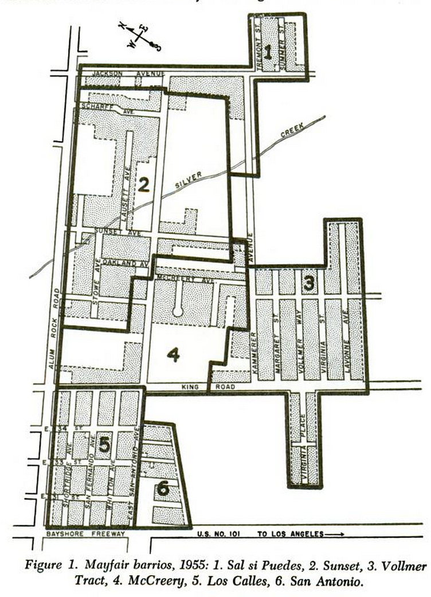
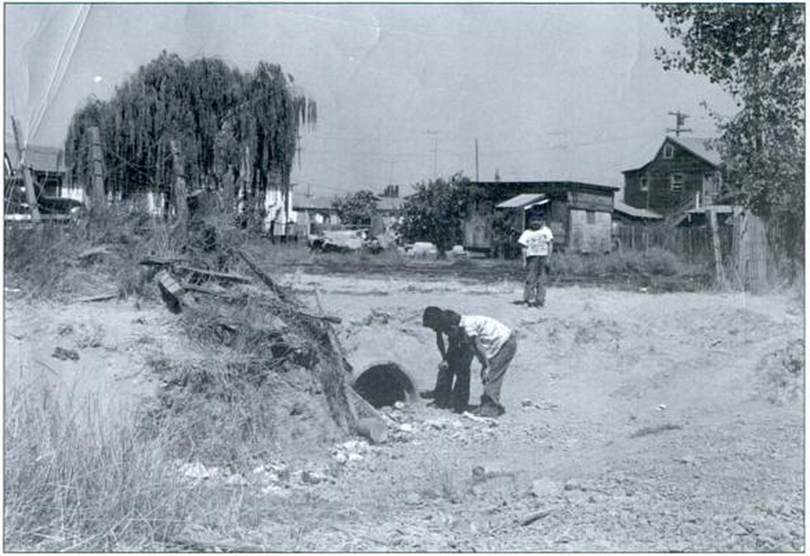
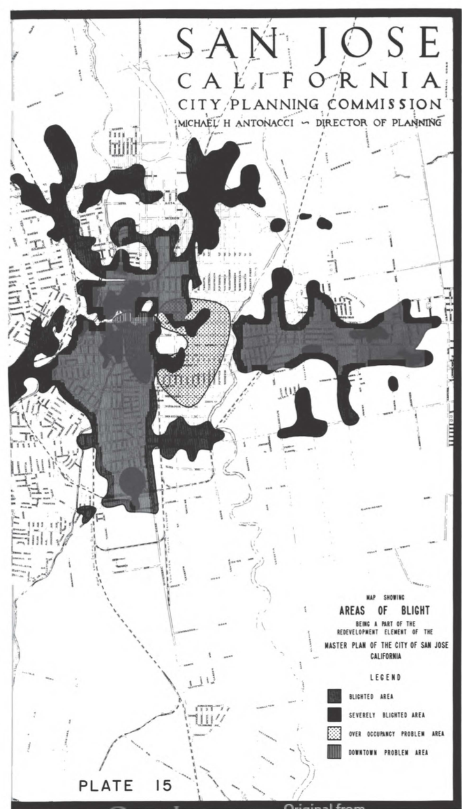

--- 
author: 
- Jason A. Heppler 
title: | 
	| Chapter 4 
	| A Place for Nature 
	| The Politics of Planning and Growth
...

> We stand today poised on a pinnacle of wealth and power, yet we live in a land of vanishing beauty, of increasing ugliness, of shrinking open space and of an overall environment that is diminished daily by pollution and noise and blight. This, in brief, is the quiet conservation crisis. 
>
> ---Stewart Udall, *The Quiet Crisis*, 1965^[citation needed]

> From the work bays of the light-industry sheds that the speculators were beginning to build in the valley, you could look out and see the raggedy little apricot trees they had never bothered to bulldoze after they bought the land from the farmers. 
> 
> ---Tom Wolfe, 1983^[*Esquire*, 1983, 356.]

> The "Fruit Bowl of America," fertile Santa Clara Valley, has come of age. Suburbs, shopping centers, freeways and industrial parks are marching through the orchards that until recently produced half the world's prunes and a bounty of apricots, cherries and walnuts. 
> 
> ---"Living in Santa Clara County," Bank of America^[citation needed]

> Across the street -- the freeway,  
> blind worm, wrapping the valley up  
> from Los Altos to Sal Si Puedes.  
> I watched it from my porch 
> unwinding. Every day at dusk  
> as Grandma watered geraniums 
> the shadow of the freeway lengthened.  
> 
> --- "Beneath the Shadow of the Freeway," Lorna Dee Cervantes^[*Latin American Literary Review*, (Spring 1977): 176.]

<!-- Various voices of anti-growth - a combination of political actors -- those in established power and those without -- contributed to the rising environmentalism of the Bay Area. -->

Journalist Leonard Downie could scarcely find nature in Santa Clara County. Visiting San Jose in the early 1970s, he concluded that the only remaining open space existed along the "carefully tended and regularly watered greenery along the shoulders of the county's many freeways." The Santa Clara Valley had become defined by the clusters of poorly-built and quickly constructed homes, traffic that had given the air a "mustard-colored haze," and urban space so compact that there existed no "open spaces, parks or even sidewalks." Downie blamed poor planning and greed for the valley's urban problems, citing a study that found residential density could be maintained near 1973 levels in just thirty square miles that could have saved miles of open space and orchards. Santa Clara County, Downie concluded, had become a "jigsaw puzzle of intertwined suburbs" and the land "systematically ravaged" by "speculators, developers, other entrepreneurs and homebuyers."^[Leonard Downie, Jr., "A Misplanned Suburb," *Washington Post*, December 30, 1973.] Downie was not alone in questioning the value of urban growth at the expense of disappearing open space. After a decade-long boom that saw Bay Area cities sprawl throughout the San Francisco Peninsula, activists began promoting the protection of open space open space for recreation, aesthetics, and health. All along the Peninsula, advocates argued for new restrictions on city growth and the protection of greenbelts, public parks, and wilderness areas. "Already we have filled the San Francisco basin with housing, industry, airfields, and highways, from the tops of the hills to the edge of the water," wrote Raymond Dasmann, a Berkeley-trained biologist. If the process proceeded, Dasmann feared a "gigantic, disorganized metropolis" "engulfing farm and forest, marsh and pasture with no end in sight."^[Dasmann, *The Destruction of California*, 19.]

This chapter traces the chronological contours of urban sprawl debates in Silicon Valley. Debates over open space in Santa Clara Valley roughly followed three branches. The first emerged among expert urban planners and residential activists, who relied on professionals to form a critique of poor urban planning and the loss of natural landscapes. In the process, they began crafting new zoning restrictions that required environmental impact studies and land-use regulations. The second came from anti-growth and no-growth advocates who urged tightened restrictions on the places that cities were allowed to expand. Simultaneously, elite suburbanites were challenged by communities forced to the margins of the suburbs---Chicanos, African Americans, Asian Americans---who formed their own critique of conservation at once apart and in conflict with California's mainstream environmental organizations. Finally, another branch of activists focused their argument around issues of recreation and the "best use" for land. Together, these activists shared a common language---using terms such as "beauty," "wilderness," "ecology"---but used that vocabulary to defend and define different goals. Environmental advocates revealed a clash between competing political ideas and urban priorities, and the very definition of "nature" sat at the middle of the conflict.

## Professionalization

The professionalization of environmentalism began emerging by the late 1950s among a group of urban planners coming out of the University of California-Berkeley. They thought of the environment differently. Whereas the neighborhood activists defined their concerns around specific local concerns, the new wave of environmentalists urged policymakers and cities to think more regionally.

<!-- Professionalization also came with another consequence: the overwhelming affluence of the environmental movement in the Bay Area. -->

<!-- what does some text analysis of the gov docs say? -->

<!-- ## Losing Amenities -->

Environmental activists made a point to suggest that sprawl, loss of open space, smog, traffic, and other concerns would lead to industries deciding to relocate elsewhere. If boosters were wont to point to climate, space, and the landscape as a benefit for industry and its employees, environmentalists were quick to point out that threatening those benefits also meant industry would be less likely to come to the Bay Area. Business and cultural institutions that had come to the Bay Area because of its quality of life reputation, argued People for Open Space, "are here because of the quality of the physical environment. The Bay, the rolling hills, the wooded ridges, the beaches, the orchards and vineyards---all combine to provide an unmatched setting."^[People for Open Space, "The Case for Open Space," report (January 1969), Folder 4, Carton 2, Calif. Tomorrow records {DETAIL}.]

Like many postwar environmental critics, Santa Clara County conservationists argued for the importance of farmland and the loss of the country's ability to produce food if prime soils were paved over for subdivisions and industrial parks.

<!-- {TODO} LAFCO as a regional response; ties together with POS/CA Tomorrow calls for regional thinking and regional fragmentation -->

While some metropolitan areas like San Jose resisted the call for regionalism and sought to maintain their local autonomy, going so far as to reject being included with the San Francisco-Oakland Statistical Metropolitan Area in favor of its own census designation and rejecting a connection to the Peninsula-wide Bay Area Rapid Transit system. By the late 1950s and early 1960s planning professionals and state legislatures were formalizing plans to correct what they viewed as a fragmented regionalism that did a disservice to urban planning and introduced environmental degradation.

## Silicon Aztlán

Among the communities giving voice to environmental concerns was the Mexican American community in East San Jose. In the early 1950s the Mayfair district in San Jose became the epicenter of Latino activism that, among their demands for halting racial discrimination, calls for greater participation in electoral politics, and labor rights, included a critique of San Jose's growth policies and its environmental consequences. Chicano activism and environmental regulations overlapped throughout the Santa Clara Valley in the 1960s and 1970s, prompting activists to call for environmental equality alongside their challenges to inequality, citizenship, and segregation. Economic issues that appeared neutral, such as zoning, sewer hookups, street paving, and environmental land zoning were entangled with Chicano politics.

Originally a neighborhood populated predominantly by Puerto Rican farm laborers, Latinos living in Sal Si Puedes moved to the neighborhood in greater numbers the 1940s to work in the orchards, packing houses, and on construction crews building San Jose's suburban future.^[@clark1959health, 49--51, 79; *The Spanish-American Community of the San Francisco Bay Area* (U.S. Commission on Civil Rights, April 28, 1967), 3.] These industries tended to concentrate in eastern San Jose. In the early 1950s, agriculture remained a steadily profitable industry. By the mid-1950s, the county boasted the highest levels of agricultural profits before agricultural industries began their steady decline towards the end of the decade. "Agriculture and industry are synonymous words in the Santa Clara Valley," the *San Jose Mercury* could boast in 1955. Food processing employed a third of the county's manufacturing workforce.^["Agriculture," *San Jose Mercury*, January 15, 1956.] The presence of San Jose's agricultural industry attracted many migrants seeking job opportunities.

East Side reflected the spatial influences of industrialization in the Bay Area. Industries tended to cluster west and south in San Jose, staying close to the highways that channeled traffic and freight north and south on the Peninsula. Zoning decisions by city and county government likewise determined the spatial layout of industrialization throughout the county. Few of the Bay Area's new high-tech industries located themselves in the eastern parts of San Jose. Rather, East Side tended to be the site of homes rather than industry. The city's decision to zone for low-density residential and federally-subsidized housing clustered heavily in East Side, causing severe traffic congestion on roads inadequate to carry the thousands of commuters moving through the city.^["East Siders form alliance to increase political clout," *San Jose Mercury*, March 22, 1978; @cavin2012siliconvalley, 293--294.]

<!-- The congregation of seasonal workers in East Side caught the attention of Elizabeth Clark -->

Among those coming to East Side in the 1950s was Cesar Chavez. Chavez, his wife, and four kids moved to San Jose in 1952, where he found irregular work in canneries and orchards. A native of Yuma, Arizona, Chavez's family moved to Los Angeles when he was ten years old and then San Jose, where his family worked in fruit packing houses. After a stint in the Navy during World War II, Chavez married and moved to foothills of San Jose where they sharecropped for a few years. Unable to scrape together much of a living, they moved into the city where Chavez worked in harvesting crops and lumberyards.^[@castillo1995chavez, 24; @pitti2004devil, 150--154.]

The pattern and policies of the Bay Area's postwar development introduced uneven environmental effects to barrio neighborhoods. Space, race, class, and environmental politics became tangled in Sal Si Puedes, expressed through Chavez and other Latino activists in the South Bay. Historians have noted the connection between organized labor and its connections to environmentalism, in particular the maneuvers of the United Farm Workers and Chavez to point out the dangers of working with pesticides.^[See, for example, @dewey1998working.] Fewer historians have looked at how environmental thinking traced itself, in part, to the communities laborers called home.

Chavez hosted the first Community Services Organization (CSO) meeting in San Jose in 1952. Chavez lived in the neighborhood known as Sal Si Puedes ("Get out if you can"), a suburban barrio in East San Jose that served as home for many of the area's seasonal workers. Sal Si Puedes was overlooked by the city. The majority of the concerns at the first CSO meeting revolved around environmental issues: floods, polluted creeks, cesspools that spread dysentery.^[Cesar Chavez, "The Organizer's Tale," *Ramparts*, July 1966; Levy, *Cesar Chavez*, 97--98; Ross, *Conquering Goliath* 3; Ross, "The Saga of Sal Si Puedes" 5.] Although the CSO's primary expression of political energy focused around voting rights and citizenship, the organization also became an expression of political power for barrio residents concerned about urban growth and its attendant problems. The urban transformations in East San Jose led to a kind of environmental politics among barrio residents. Unlike the affluent, middle-class whites that defined their environmental concerns around aesthetics, East Side Mexicans and Mexican Americans began crafting a vision of environmental justice within the suburban barrio that revolved around health and safety.

Located in the Mayfair district east of Highway 101, Sal Si Puedes occupied the very eastern edge of the neighborhood.^[Sal Si Puedes no longer exists today. The original site of Sal Si Puedes is now overlaid by Highway 680. The interchange between Highway 680 and Highways 101/280 was completed in the 1970s.] Sal Si Puedes had become a site of environmental concern for the city's Mexican American residents. By the early 1950s, Fred Ross wrote of the area's lack of sewers, the presence of cesspools that led to amoebic dysentery outbreaks, and flooding, muddy streets that occasionally left children unable to attend school.^[Ross, "The Saga of Sal Si Puedes," 3--6.] In the 1950s the residents of Sal Si Puedes criticized the environmental hazards that had overtaken their community, using environmental concerns to form a critique of the city's public policies that overlooked its minority communities. In the first meeting of the CSO, residents took the opportunity to denounce "every rat, mosquito, cesspool, traffic hazard and flooded road" that had come to characterize the neighborhood.^[Ross, "The Saga of Sal si Puedes," {PAGE}, quoted in @cavin2012siliconvalley, 261.] Even the very name of the community became a rallying point for activists. Originally coined "Sal Si Puedes" by Puerto Rican families who gave it the name due to its muddy streets that became filled with potholes in the winter rains. Residents continued to use the name because of its housing and socioeconomic problems.^[Clark, *Health in Mexican American Culture*,35. Herman E. Gallegos, who became the first president of the San Jose CSO in 1952, recalled three stories as to how Sal Si Puedes got its name. See Gallegos, "Equity and Diversity: Hispanics in the Nonprofit World," interview by Gabrielle Morris, 1988, 16, Regional Oral History Office, Bancroft Library, University of California, Berkeley.]

Ross, Chavez, Gallagos, and others began organizing the community to act, turning to electoral politics to get the city's attention. The concerns of the activists were generally focused on anti-poverty, ending racial discrimination, and embracing the postwar welfare state. The CSO, after all, was primarily an organization dedicated to the citizenship of its constituency. But their platform was framed, in part, around environmental concerns and the uneven exposure the neighborhood faced to hazards. Ross told members of the CSO meeting that election drives he helped organize in Los Angeles had helped bring streetlights, paved roads, and medical care to the barrio. East San Jose, Ross promised, could achieve the same.^[Ross, "The Saga of Sal si Puedes," {PAGE}.] Armed with Ross's know-how for organizing, an 85-day registration drive managed to register 6,000 Mexican American voters. The move caught the attention of city officials, who responded by bringing urban services to Sal Si Puedes within months after the election drive. New public works systems to fix chronic flooding, clearing out cesspools, and paved roads were brought to the barrio. Packinghouses and canneries were forced to cease dumping effluence into creeks.^[Ross, "The Saga of Sal si Puedes," 16, 22---23; Clark, *Health in the Mexican American Culture*, 28; Levy, *Cesar Chavez*, 104]

In the drive for progress, city leaders in San Jose created spaces that were disconnected from urban services and lacking good roads, adequate sewers, and city utilities.

Yet despite the city's move to connect the barrios to urban services, such places were still considered expendable. To the City of San Jose, the barrios were signs of decay. "Each segment of the city," the 1958 master plan noted, "has a natural cycle of growth---obsolescence and decay---and then renewal."^[San Jose City Planning Commission, *Master Plan of the City of San Jose*, 89.] The planning commission's map of blighted areas closely followed the city's barrios. The city, the commission warned, needed to pursue renewal programs to prevent blight from spreading so "that the vast private investment in our city will remain sound an continue to expand."^[Planning Commission, *Master Plan*, 94--95.] Renewal needed to "clear and rebuild areas that economically are not worth saving."^[Planning Commission, *Master Plan of the City of San Jose*, 89.] The suggestions for renewal aligned with the federal transportation program, which city officials turned to for helping in aiding demolition of blighted areas. Municipal planners began planning three interstate highways and an expressway through East Side. The planned Highways 280 and 680 would shuffle traffic between northern and southern Santa Clara County. Capitol Expressway skirted the eastern edge of the city, allowing traffic to flow east and west. In the process of constructing the new highway system, many of the East Side barrios were demolished.^["Housing for Freeway Displace-ees,", newspaper clipping, n.d., Box 5, Folder 19, Fred Ross Papers, Department of Special Collections, Stanford University Libraries, Stanford, California.] As a response, Mexican Americans relocated to a centralized barrio in East Side and remained physically and symbolically separated from white communities by the freeway. The eastern edge of the city also became home to many of the city's federally-financed public housing projects administered through San Jose's Housing Authority, established in 1966.^["Housing for Freeway Displace-ees," Fred Ross Papers.]

Urban renewal plans sealed the fate of Sal Si Puedes. What had once housed a community of 422 people became the site for Highway 680, built on top of the neighborhood in the 1960s. San Jose's policies of transportation, urban renewal, and annexations overwhelmed the CSO activists. "What use to be a very small neighborhood is now . . . hundreds of hastily-built tract homes that have become quite blighted," Gallegos noted. San Jose's growth "happened so rapidly," he continued, "[that] it was just incredible." The problems of Sal Si Puedes "were exacerbated by the sudden growth."^[Gallegos oral history, 17--18.]

But what were the environmental consequences of blight and it's eradication under public policies? Urban historian Colin Gordon has noted the tendency of cities to define blight and urban renewal in order to support greater concentrations of commercialization and industrialization.^[@gordon2008stlouis, {PAGE}.] In East Side, the result of the new freeways was to accelerate zoning for residential housing. While the eastern half of Highway 680 became a dense site of public housing, the western edge filled in with large-lot housing for single family homes.

By framing community problems around environmental issues, Mexican Americans in East Side shaped a conversation about their lack of access to the suburban lifestyle enjoyed by the majority of white residents in the city, but also demanded that the city ensure an environment that promoted health and quality-of-life. The conditions of the barrio went hand-in-hand with the environment, a point that residents of Sal Si Puedes understood well. In shaping their political organizing around the community, Sal Si Puedes activists argued for a suburban vision that included them while promoting an environmental critique of San Jose's sprawl. Rather than couching their arguments in appeals to whiteness, Mexican American activists argued for a vision that simply included the same rights and privileges enjoyed by others in the city.^[@pitti2004devil, 157.]

<!-- {TODO} Map Los Altos Hills -->

The battle over zoning, race, and environment would emerge further north in Silicon Valley in the town of Los Altos Hills, to the southeast of Palo Alto. The town incorporated in 1956 as an exclusively residential town and implemented some of the strictest zoning requirements in the Bay Area. Los Altos Hills residential zoning required a minimum of one acre lot sizes, among the largest lot sizes in northern California.^[Social Planning Council of Santa Clara County, Inc. and Santa Clara County Planning Department, "Profile '70: A Socio-Economic Data Book for Santa Clara County", ({DETAIL}, 1973).]

To Jack Ybarra, president of La Confederacion de la Raza Unida (CRU) representing the 20,000 Mexicans and Mexican Americans living in the Midpeninsula.

While special zoning allowed affluent communities to maintain their status of suburban privileges, they also reflected an environmental consciousness but at the cost to poor communities.

Landscape aesthetics formed the core justification for restrictive zoning.

## Saving Open Space for the Cost of Wine and Bread

The problems of urban growth and environmental consequences in the South Bay caught the attention of expert planners, intellectuals, scholars, journalists, and students. Emanating most forcefully from Berkeley, a new wave of environmental thought began to shape the conversation about the entirety of the Bay Area's environment. These emerging conservation groups formed a vision at once utopian and regional. Rather than leaving planning at the whims of local governments, these environmentalists called for thinking about a *regional environment* where local governments could improve its coordination, cooperation, and urban planning. These critics, Richard Walker has argued, were what he called "midcentury Modernists" who believed in "the enlightened application of foresight, science, and good government" to the Bay Area's problems.^[@walker2007countrycity, 133.] The expert critics made their case through book publications, conferences, educational workshops, teach-ins, and editorials and, in so doing, helped reshape the conversation about urban growth and environmental degradation. 

Students and scholars at the University of California-Berkeley led the way. In 1939, students formed an organization called Telesis that included T. J. (Jack) Kent, Mel Scott, and Francis Violich, who would not only become future Berkeley professors but also formed an important intellectual core of the Bay Area's midcentury critics. Inspired by the New Deal, housing reformer Catherine Bauer, and civic planner Lewis Mumford, the students outlined a vision for the Bay Area focused on planning, architecture, and greenbelts. Out of the university's Bureau of Public Administration, under the leadership of Samuel May, attempted to establish a state planning commission in 1940 under Governor Culbert Olson's tenure. The bureau, renamed the Institute for Governmental Studies (IGS) in the 1950s, continued to advocate for region-wide governance throughout the postwar era.^[@walker2007countrycity, 132---133; @Vieg1955Two, 244---246.]

Ideas of regionalism pervaded the thinking of the Bay Area's midcentury environmental critics. In 1959 IGS helped publish Mel Scott's study of the Bay Area, the first study of the region's urban history and a plea for regional governance.^[@walker2007countrycity, 133.] Bay Area cities, Scott argued, all faced the same problems of "air pollution, vanishing open space, bay pollution, inadequate transit, [and] uncoordinated planning." These challenges were "so pervasive," Scott concluded, that "the oneness of the area cannot be denied."^[@scott1959bayarea, 2.] The lack of coordinated planning---or any planning at all---had become most apparent in Santa Clara County, Scott urged. He pointed to the "lack of zoning, inappropriate zoning, or changes in zoning ordinances made under pressure from developers and landowners" that "accounted for these ill-advised and detrimental uses of the land."^[@scott1959bayarea, 274.] The "oneness" of the Peninsula environment could not be ignored. Smog and water pollution recognized no municipal boundaries. The only sensible way forward, according to Scott and others, was a new form of coordinated regional government. 

As intellectuals pushed the agenda of metropolitan-wide planning, the California state legislature took notice. Part of the growing concern about local governance and uncoordinated planning as a result of the new realities of the Bay Area. The Bay Area had grown remarkably beyond the old urban cores of San Francisco and Oakland, encompassing the nine counties that touched the Bay, one-hundred cities, 108 special districts overseeing parks, sewage, and water, and twenty-four transit districts.^[@walker2007countrycity, 136.] Metropolitan fragmentation had led to a chaotic, complicated, and confusing mixture of special interests and local governments. In the late 1950s the California Legislature attempted to intervene, creating the state's Office of Planning in 1959 and appointing a Governor's Council on Metropolitan Area Problems to study what the state could do to confront regional challenges to urban growth. The council recommended the establishment of regional districts to oversee transportation, recreation, and planning, but resistance by local governments forced the commission to revise their proposal to a metropolitan-level commission.^[@pincetl1999transforming, 140--141.]

Despite resistance to any state intervention into local land-use planning by the League of California Cities and the County Supervisors Association, the Coordinating Council continued to push for a regulatory body in the belief that problems of growth stemmed from jurisdictional boundaries. The State Legislature's passage of the Knox-Nisbet Act in 1963 resulted in their intervention in the issues of urban planning. Under the act, every county in the state was required to create a Local Area Formation Commission (LAFCO) whose mandate primarily revolved around the approval of annexations and incorporations. LAFCO's authority attempted to discourage urban sprawl and maintained the ability to regulate many special districts, including sewers and sanitation, police, irrigation, county services, water districts, reclamation, and parks and recreation. LAFCOs also established "sphere of influence" boundaries for cities in an attempt to prevent one city from annexing into the area of interest of another city, as well as requiring all counties and cities to draw up general plans. An extension of the Act under the 1965 Quimby Act required developers to dedicate space to parks and open space.^["Guidelines, Santa Clara County Local Agency Formation Commission," September 1974, Folder 7, Carton 53, California Tomorrow records, California Historical Society {FACT}; @walker2007countrycity, 137; @pincetl1999transforming, 141--143. See also @miller1981contract, 102--103.]

<!--Local governments reacted strongly against the implementation of LAFCO and, in response, formed their own regional association under the name the Association of Bay Area Governments (ABAG).--> <!-- need to look into this more; Walker says its a reaction against LAFCO (137-138) but I'm not so sure. Because they're still involved with regional planning, e.g., their open space plans. -->

The regionalist thinking of the Bay Area environmentalists remained, perhaps because the LAFCO ideal simply threw power back to local governining elites. New coalitions of planners and citizen activists formed under the aegis of People for Open Space. Originally called Citizens for Regional Recreation and Parks (CRRP), the organization emerged following a June 1958 conference in San Francisco called "The Peril To Our Public Lands--A Discussion of Regional Recreation." The organization's core concern was the lack of accessible spaces for recreation in California's metropolitan areas. Leading the charge were Dorothy Erskine and Jack Kent and immediately set themselves to creating an inventory of public lands, sponsored conferences on open space and conservation, and fostered partnerships with regional conservationists and national organizations like the Sierra Club.^[@kent1970openspace, 69.] 

Kent and Erskine made a formidable team. Kent earned a degree in architecture at Berkeley in 1938 and spent a year in Europe studying under Lewis Mumford before returning to Berkeley to help found Telesis. Kent quickly jumped into various planning roles, first working as a junior planning assistant with the Marin County Planning Commission, a planning technician with the Pacific Southwest REgional Office of the National Resources Planning Board. He earned a Masters degree in 1943 in City Planning from the Massachusetts Institute of Technology and became the Associate City Planner for the San Francisco City Planning Commission in 1943, but his tenure was cut short when he was drafted into the Army during World War II. Kent served in Washington, D.C., during the war, and was stationed in Berlin between 1945 and 1946 before returning to San Francisco and beginning work as the Director of City Planning under Mayor Roger Lapham. He was recruited to teach at Berkeley and, along with other planning professors, founded the Department of City and Regional Planning in 1948. Along with serving as a Berkeley professor, he maintained an active role in the Berkeley City Planning Commission and, in 1957, was elected to the Berkeley City Council.^[dybleYEARtoll, 175-176.]

Like his mentor Mumford, Kent maintained a firm belief in careful planning to manage urban growth and prevent suburban sprawl. He was wary of local governments and their penchant for bucking regional efforts at controlling land use. In 1958 he supported the formation of the Association of Bay Area Governments (ABAG), a voluntary association of {DETAIL}, helping drafts its first constitution and bylaws and serving on its executive committee. Regional planning was essential, Kent believed, in protecting open space and environmental quality. As he explained in 1963:

> Without a regional plan, the so-called "natural" forces of economic development will overwhelm the best efforts of local governments to control them. . . . Speculative land development forces now operate on a metropolitanwide basis. They are commanded by men of great enterprise and ability. These men---the builders and does of today---will wipe out the vineyards of the upper Napa Valley and fill it with suburban tracts; they will overrun the Livermore Valley; they will mop up Stinson Beach, Bolinas, and the Olema Valley. They will spread to the northeast, beyond Vallejo and Fairfield toward Sacramento; to the south, below San Jose to Hollister; and to the west, beyond Santa Rosa to Sebastopol and the Pacific Ocean. . . . Freeways will precede the initial wave of surging growth, and more freeways will follow. Predictably inadequate bridges for trucks and automobiles will be constructed [and] tidelands will be filled. The central districts of San Francisco, Oakland, and San Jose will become inaccessible, and will decay.^[Kent, *City and Regional Planning for the Metropolitan San Francisco Bay* (Berkeley: Institute of Governmental Studies, 1963), 1-2; quoted in @dybleYEARtoll, 176.]

Kent and Erskine met in 1939 through the formation of Telesis. Erskine quickly established herself as a dedicated conservationist and social activist for various Bay Area causes. She became a proponent of public housing in San Francisco, helping form the San Francisco Planning and Housing Association. Her interest in housing led to a growing awareness of the role city planning played in creating livable spaces for people, and by the late-1950s Erskine had taken an interest in greenbelt planning. Her first foray into environmental activism came with the protection of the Butano Forest {FACT}. With Jack Kent she formed the Citizens for Regional Recreation and Parks which served a key role in contributing to the California Public Outdoor Recreation Plan of 1960. Erskine devoted her energies to the establishment of the Save San Francisco Bay organization and served on the board of directors of the Bay Conservation and Development Commission.^[@walker2007countrycity, 134-136.] 

Like Kent, Erskine located in postindustrial capitalism a warped idea about land. "Land is a resource," she argued, "not a commodity subject to speculation and mindless use."^[Quoted in @walker2007countrycity, 136.] She distrusted local decision-makers, writing to Sierra Club executive director Michael McCloskey that the "pressures of self-interest and greed are too powerful on local agencies to protect the great mass from serious harm." Erskine put her faith in federal programs, arguing their use in reclamation projects, building recreational areas, improving land values, and preventing air and water pollution. Yet she also saw capitalism as the potential solution. "Apparently we don't try to change our system or tinker with men's minds too much... That might be called 'socialism,'" she wrote. "Instead, we put a 'price tag' on a social reform at the Federal level and then do the job. That's just another business transaction."^[Letter from Dorothy Erskine to Michael McCloskey, April 12, 1969, Folder 4, Carton 2, California Tomorrow records, CHS; ellipses in original.]

The rapid loss of agricultural land---as much as one million acres left production between 1945 and 1968---led to discussion about defining city boundaries to protect open lands.^[@pincetl1999transforming, 147-148.] By the mid-1950s studies were pointing to the problems of lost agricultural land in the Valley. A study by the California State Planning Commission noted the sprawling nature of urbanization in northern Santa Clara County, finding that all of the subdivisions established between 1945 and 1955 covered just seven square miles if combined. But instead of dense development, subdivisions "dotted over 200 square miles of prime agricultural land."^["Planning for Growth", 1955, 43.] If such growth continued, the state planning board concluded, Santa Clara Valley would lose nearly all farmland by 1960.^["Planning for Growth," 45.] Land selling for between $800 and $1,200 an acre for agricultural uses was fetching upwards of $8,000 an acre for industrial or residential uses. The disparity between the price of land for agriculture and the price of land for subdivisions introduced a capital imbalance for tax assessments. As a result of rising land prices nearby agricultural land, county tax assessors likewise raised the value of agricultural land and, therefore, the burden of taxes farmers owed.^["Planning for Growth," 43---44.]

Concerns about the increasing value of agricultural land and threat of urban sprawl led the state legislature to act. The California Legislature passed the Land Conservation Act in 1965. Known as the Williamson Act, the state legislation ostensibly provided protections for open space and greenbelts. Under the Williamson Act, agricultural land had the option to be removed from markets by entering into a contract with county governments that restricted the land's use to agricultural uses for a minimum of ten years. In return, farmers enjoyed a tax benefit. County assessors valued the land at agricultural value rather than market value, allowing farmers to pay lower taxes on their land and, both parties hoped, allowed the land to remain agricultural perennially. Contracts were renewed annually unless notice for nonrenewal was given. An amendment to the Williamson Act in provided additional incentive to property owners by requiring value assessments at least twenty-five percent. By 1969, twenty-three counties in California placed more than two million acres of private land into the agricultural preserve.^[California Legislature, *Joint Committee on Open Space Land, Preliminary Report* (Sacramento, March 1969), 10; @brucebiggs1975landuse, 1--13; @snyder1966landuse, 1306--1313; @walker2007countrycity, 43. See also @brosnan2010napa, 36.]

Despite the availability of state law to control land use, the law fell short of its intended goals in Santa Clara County. Farmers, after all, still had the voluntary option of selling their land at some point in the future. Open space land was not held as a public good, and once farmland became a place for subdivisions it no longer served its open space purpose. The Williamson Act contained the potential for perpetual agricultural reserves under its renewable ten-year contracts, but in reality farmers often bowed to market pressures. Faced with shrinking agricultural land, citizens began seeking alternative and long-term methods for sustaining the presence of open space throughout the Peninsula. Community organizing continued to shape the local policies guiding land use with an increasing focus on recreation and public lands. In 1968, CRRP filed for nonprofit, tax-exempt status and renamed themselves People for Open Space (POS). Their new status as nonprofit allowed them to pursue a $59,000 Ford Foundation grant to examine the economic impact of open space in the Bay Area.^[@kent1970openspace, 74; "Ideas for Discussion with Ford Foundation," November 19, 1968, Folder 4, Carton 2, California Tomorrow Records, California Historical Society.] Completed in 1969 and published as both a main report and as a summary pamphlet, POS laid out a vision for Peninsula open space that fulfilled their desire to guide places against urban expansion. "A major open space system can be created only on a regional basis," argued the study, " because open space exists without regard to city or county boundaries. . . . To establish permanent open space, all parts of the region must act together, probably using types of legislation not currently available to counties or even special districts."^[People for Open Space, "The Case for Open Space," January 1969, 4, Folder 4, Carton 2, California Tomorrow records, CHS.]

People for Open Space applauded the Williamson Act, but remained skeptical about its implementation. Finding that "very little high quality agricultural land has been conserved" and concerned about the lack of a "guarantee of permanence," they conclude that the voluntary contracts are ultimately an unsatisfactory solution to open space preservation.^[People for Open Space, "The Case for Open Space," report, 7, Folder 4 People for Open Space, Carton 2, California Tomorrow Records, California Historical Society.] A more desirable action was for a regional governmental body to purchase all available open space for preservation. Such a plan, they argued, would hardly place a financial burden onto Bay Area residents. In assessing the costs of such a program that factored in land value and the offsetting of expenses that would come from providing urban services to densely-populated areas versus sprawling cities, People for Open Space estimated that the net costs for each person in the Bay Area would amount to only $2 to $3 dollars per year---"about the cost of a good bottle of California wine and a loaf of sourdough French bread."^[People for Open Space, "The Case for Open Space," report, 10, Folder 4 People for Open Space, Carton 2, California Tomorrow Records, California Historical Society. See also Association of Bay Area Governments, *Regional Open Space Element*, Supplemental Report RP-3, (Berkeley, October 1969), 9--10.]

<!--
The appearance of POS into debates about land use reshaped discussions about land. While early state and county legislative action sought to protect agricultural land for its productive purposes, midcentury conservationists also began to see the presence of agricultural land as an aesthetic commodity.  --> <!-- keep pushing this -->

The loss of agricultural land was only one feature among many that motivated environmentalists. Frustrated by the state's lack of any comprehensive planning for California and believing that local government was the source of urban California's problems, a new nonprofit educational organization called California Tomorrow entered the political scene with its 1962 publication of *California Going, Going...*, whose opening sentences reiterated the "serious, progressively disastrous lack of coordinated land planning and development" in California.^[Alfred Heller and Samuel Wood, *California Going, Going...*, 6.] Written by Alfred Heller and Samuel Wood,  California Tomorrow reflected a belief in scientific and expert knowledge in overcoming urban planning and environmental degradation and forcefully argued for a central regulatory state to solve the state's rapidly disappearing open spaces. California Tomorrow urged the state to think about both urban and rural areas. A year later, Heller and Wood published *The Phantom Cities of California*, arguing that weak planning allowed political power to aggregate among regional actors---phantom cities---that enacted sprawling urban growth. Without regional planning, Heller and Wood concluded, California was destined to  "unsightly intrusions of subdivisions, cars, roads, parking spaces, sewage, exhaust, strip development, *slurbs*---sloppy, sleezy, slovenly, slipshod, semi-cities."^[Heller and Wood, *Phantom Cities*, {PG}; @starr2009golden, 418-419.]

As part of their efforts towards shaping the state's conversation about planning, California Tomorrow published a quarterly magazine *Cry California* starting in 1966 dedicated to covering issues of environmental decline, race and class discrimination, housing shortages, and job inequalities. The journal attracted many leading environmentalist and conservationists including William Bronson, its editor, landscape architect Garrett Eckbo, environmental writer T. H. Watkins, journalist Mel Wax, and an editorial board that included Wallace Stegner, columnist Neil Morgan, architect Nathaniel Owings, attorney Clarence Heller, and Caspar Weinberger. The journal had a northern California tilt, dominated mostly by writers (and issues) facing the San Francisco Bay Area and surrounding areas.^[@starr2009golden, 422.] California Tomorrow believed that state intervention into urban growth could allow regional government to act, as political scientist Stephanie Pincetl has argued, "as a redistributive entity and actively redress revenue and housing inequities."^[@pincetl1999transforming, 153.]  <!-- what else here? -->

Former Santa Clara County Planning Department director Karl Belser, who had attempted to limit San Jose's growth into unincorporated county land in the 1950s, took to the pages of *Cry California* to bemoan the state's lack of coordinated planning. The mix of federal, state, and local agencies that "dabble in the planning business" lacked regulatory authority resulting in "fragmented plans" without clear goals that would ensure the protection of open space and maintain an urban quality of life.^[Belser, "The Planning Fiasco in California," *Cry California* (Summer 1967), 10.] Despite the presence of these various regulatory bodies, Belser asserted, "the bay is being filled in, air and water are being polluted, hillsides are being mutilated and prime cropland is being paved over."^[Belser, "Planning Fiasco," *Cry California*, 11.] 

Belser placed blame for environmental degradation onto the "economic elite"---"landowners," "money controllers", and "mass communication media"---who "operate in a realm of their own with little concern for *any* but their private interests." To Besler, the *laissez-faire* approach to land use was a symptom of the failings of postindustrial capitalism. The public was beholden to the elite's plans, not because they agreed with the planners but because they lacked power.^[Belser, "Planning Fiasco," 11.] Adding to the problem of economic elites were the "competitive jealousy" among local governments who abandoned proper planning and instead "spend sleepless nights figuring out how to throw the gig into their neighbors."^[Belser, "Planning Fiasco," 13.] The end result from this lack of coordinated planning results in "the most tragic and dangerous trend" of ignoring conservation of resources. "What has already happened should certainly indicate to anyone with common sense that our state faces not only the disfigurement of its natural beauty," Belser argued, "but also the ruin of its primary economy."^[Belser, "Planning Fiasco," 13.] While governments bicker, "our prime soils are being lost, our forests are being butchered, our scenic areas are being raped, and our air and water are being polluted beyond reclamation."^[Belser, "Planning Fiasco," 13.] 

Three years later the situation had not improved, and Belser's warnings about the lack of planning took on an even more seething tone in the pages of *Cry California*. Pointing to the Santa Clara Valley as an example of "slurban" development, he wrote of the "flagrant ruination" and "irrelevant urban development of massive size and questionable quality" that had come to dominate the valley.^[Belser, "The Making of Slurban America," (Fall 1970), 1.] The environmental problems attending such growth had become the primary concern for Belser. Greater levels of traffic introduced high levels of air pollution, exacerbated by the San Francisco Bay's impenetrable inversion layer that trapped smog in the valley. Overdraft on underground water supplies and its resulting subsidence threatened to ruin underground utilities and stretch the natural limits of water availability for cities.^[Belser, "The Making of Slurban America," 17.] "Wild urban growth," he wrote, "attacked the valley much as cancer attacks the human body."^[Belser, "The Making of Slurban America," 5.] 

By the late 1960s the efforts by environmentalists to overcome poor land use planning was failing. By 1969, California Tomorrow argued in a proposed study of Bay Area open space that 

> the rapid disappearance of the orchards of the Santa Clara Valley is perhaps the most dramatic example of the pattern which urban development will take unless *permanent* measures are taken to preserve open spaces within the urbanized areas. It should be remembered that as recently as 1960, Santa Clara County was considered a model throughout the country in terms of progressive "greenbelt" ordinances to preserve agriculture.^["Regional Open Space Study," August 1, 1968, 1, Carton 2, Folder 4, California Tomorrow records, CHS.] 

\noindent Despite the lobbying, educational, and political efforts of California Tomorrow, People for Open Space, and other regional environmental organizations, open space continued to shrink and land converted into urban space. At the state-wide level, at least, very little action took place in protecting open spaces aside from the 1972 Coastal Protection Initiative. Not to be deterred, California Tomorrow published the *California Tomorrow Plan* in 1971. The *California Tomorrow Plan* sought to propose a comprehensive initiative to address state infrastructure and environment. The monograph argued that there existed a California One and a California Two---two potential paths that the state could follow given the current problems of environmental degradation and widespread urbanization. California One imagined what California would be like without any change to policies. California One would be unable to meet the state's energy needs, deteriorating water quality and accessibility, the continued urbanization of farmland, the loss of wilderness areas and open spaces, declining air quality, worsening noise pollution, clogged roadways, housing shortages, underfunded and understaffed schools, widespread unemployment especially among minorities, the lack of recreational areas, and punitive rather than rehabilitative treatment of criminals.^[*California Tomorrow Plan*, 24-36.] To overcome these challenges, California Tomorrow envisioned a different California comprised of a State Planning Council to develop comprehensive policies addressing a wide range of environmental, social, and economic issues in the state. Under the Planning Council, California Tomorrow envisioned ten regional governments that would absorb the single-issue agencies and districts, drawing up regional plans regarding land use, infrastructure, and socioeconomic issues.^[*California Tomorrow Plan*, 46-48. See also @pincetl1999transforming, 161-162.] By devising regional plans rather than piecemeal local decisions, California Tomorrow leaned on a belief in good government, scientific evidence, and expert knowledge.

<!--
The plan had little effect in state government, serving only to inform parts of environmental protection bills passed in the early 1970s. Municipalities saw the plan as threatening their power by a new regional entity that would subsume many of their responsibilities.  
-->

<!--
POS remained active in open space protections throughout the 1970s, pioneering the establishment of the Mid-Peninsula Open Space District in 1972 as well as various conservation programs that protected the Suisan Marsh, agricultural preserves in Napa Valley, and the conservation of Angel Island State Park.
-->

<!--

1. Dorothy Erskine & POS
2. California Tomorrow
3. Defeat of planning in the 1970s ---- ironic since its shortly after this that so many slow growth/no growth laws are put in place.

-->

The themes identified by Alfred Heller, Dorothy Erskine, Sam Wood, Jack Kent, and Mel Scott were picked up by a range of intellectuals, journalists, and observers throughout the 1960s, including William Bronson's photojournalistic *How to Kill a Golden State* (1968), Berkeley-trained biologist Raymond F. Dasmann's *The Destruction of California* (1965), Dorothea Lange and Pirkle Jones' *Death of a Valley* (1960), Richard G. Lillard's *Eden in Jeopardy* (1966), and journalist Harold Gilliam, who served as Secretary of the Interior Stuart Udall's assistant, published a series of books and articles in the *San Francisco Chronicle* about the Bay Area.^[@bronson1968golden; @dasmann1965destruction; @lange1960death; @lillard1966eden; @walker2007countrycity, 133; @starr2009golden, 416-420.] Collectively, the intelligentia reflected a growing anxiety about unplanned, runaway urban growth and the environmental, social, economic, and political fallout that accompanied urban growth. But to suggest these observers were fatalistic in their viewpoint is not quite accurate. They remained hopeful. As Bronson argued in the pages of *How to Kill a Golden State*, "between pollution, which is reversable, and destruction, which is not . . . . Nothing is impossible; if we can go to the moon, we can re-create a decent environment."^[@bronson1968golden, 10.] Dorothy Erskine used a similar space-age metaphor: "The very program of landing a man on the moon (than which nothing could be more dreamy and far out!) get its quota of billions of dollars because it is benefitting the electronic and allied industries.... Now how can we make environmental protection fit this pattern and perhaps save us from war and a worse fate?"^[Letter from Erskine to McCloskey, April 12, 1969, Folder 4, Carton 2, California Tomorrow, CHS.] Above all, these writers and advocates argued for a philosophy fusing environmentalism and managed urban development. 

## "Indiscriminate, Unplanned, Opportunistic, Premature Annexation and Urbanization"

<!-- ## Sprawl Brawl-->

While most of the political efforts of California Tomorrow and People for Open Space tended to focus around San Francisco, northward towards Marin and Napa, and the communities of the East Bay, south in Silicon Valley ideas about restricting urban growth and critiques of environmental degradation were creeping into local politics. The legislative efforts by California Tomorrow and People for Open Space failed to gain much traction at the state level by the end of the 1960s, but the advocates of urban development for the sake of "growth" would instead find their greatest challenges coming from local politics.

San Jose's drive for growth began to slow in the early 1960s as homeowners in the suburban fringes of the city began opposing growth interests in city government. In 1962, voters elected the first council candidate to oppose urban sprawl. Virginia Shaffer, a Republican and the first woman to be voted onto San Jose's city council, rose to office representing the interests of homeowners, including being the only city council member opposing consolidation with Alviso toward the end of the 1960s.^[@trounstine1982movers, 77.] The *Mercury News* began referring to Shaffer as "Mrs. No" based on a voting record that frequently opposed rezoning. Shaffer represented the expression of new interests were starting to guide ideas about the city's future growth, but to call her platform environmentalism would misrepresent her attitude towards urban growth. Although her criticisms of San Jose found sympathy among conservationists, her concerns revolved primarily around slowing growth, easing the tax burden on homeowners, and limiting government spending. Shaffer and her homeowner constituency had grown frustrated by the city's continual emphasis on growth without paying mind to the adequacy of city services, high taxes, and development policies that allowed construction on hillsides and floodplains.^[@trounstine1982movers, 100-101; @matthews2003dreams, 191-192.] 

Shaffer did not represent environmental interests even though her criticisms found sympathy from conservationists. Her concerns revolved primarily around slowing growing and limiting government spending. Shaffer and her homeowner constituency had grown frustrated by the city's continual emphasis on growth without paying mind to the adequacy of city services, high taxes, and development policies that allowed construction on hillsides subject to landslides.^[@trounstine1982movers, 100-101.]

Shaffer and two other anti-incumbent city council members elected in 1962 attempted an immediate ouster of the pro-growth members on the council and sought to unseat Hamann from his position as city manager. Growth had come to harm the city, they argued, most apparent through large sections of the city that lacked urban services or faced environmental catastrophes of flooding and landslides. 

<!--
p. 100: Shaffer and homeowners reflected anger towards inadequate city services, tax burdens, and the emphasis on growth. They condemned poor developments, some built on hillsides subject to earthslides, and unconnected or poorly constructed water connections.

pp. 100-101: A recall effort to oust council members who supported Hamann was launched by Shaffer and supporters in 1962, but the Mercury News and the old guard rallied around Hamann. They survived the recall, but their share of the vote was below landslide. Trounstine argues this is evidence that "changes were brewing, but they chose to ignore them: immediately after the election they reaffirmed the city's aggressive annexation policy."
-->

<!-- By 1970, the brakes were firmly pressed. Although San Jose's growth control measures never became quite as strident as those pursued in the northern peninsula cities of Menlo Park, Palo Alto, and Atherton, homeowners began demanding new policies to protect their natural views. Following the nation-wide trend in establishing land use controls to slow urban growth, only a single Bay Area town had growth control laws in 1972 but by 1975 thirty-one had established new regulations. -->

By 1970, the brakes were firmly pressed. Although San Jose's growth control measures never became quite as strident as those pursued in the northern peninsula cities of Menlo Park, Los Altos Hills, Palo Alto, and Atherton, homeowners began demanding new policies to protect their natural views and aesthetics. Following the nation-wide trend in establishing land use controls to slow urban growth, only a single Bay Area town had growth control laws in 1972 but by 1975 thirty-one had established new regulations. These regulations sought to preserve a suburban/rural character of middle-class neighorhoods. For some municipalities on the Peninsula, environmental protections emerged not out of genuine concern for the environment but as a method for preserving property values or setting down symbolic boundaries between race and class. In other towns, environmental regulations did reflect a concern for the environment. Whereas San Jose politics in the 1950s sought to become the "Los Angeles of the North," in Dutch Hamann's words, the San Jose of the 1970s jettisoned its Los Angeles envy. <!-- Hayes LA quote --> The changing contours of San Jose's green political culture grappled with two decades of unrestrained urban growth, leading voters to support new local regulations and support local political leaders that made the environment a key component of their platform.

San Jose followed the trend. One method of growth control came in the form of zoning for residential density. The City reduced residential density throughout the city from twelve to eighteen housing units per acre to six to eight units. New policies also required that no new development could be permitted until developers submitted environmental impact statements that specified how they would handle storm runoff, maintain open space, ensure the availability of city infrastructure, and accessible schools.^[Santa Clara County Planning Policy Committee, *Zoning and Housing* (San Jose: Santa Clara County Planning Department, 1970); Santa Clara County Planning Policy Committee, "Urban Development/Open Space Plan for Santa Clara County, 1973--1978" (Santa Clara County Planning Department, n.d.), Box 4, Folder 96, League of Women Voters, San Jose/Santa Clara Chapter Records, San Jose State University Library Special Collections and Archives; Social Planning Council of Santa Clara County, Inc. and Santa Clara County Planning Department, "Profile '70: A Socio-Economic Data Book for Santa Clara County"; San Jose City Planning Commission, Master Plan of the City of San Jose; San Jose City Planning Commission, *1981 Annual Review: The General Plan, List of Potential Land Use/Transportation Diagram and Text Amendments*; "General Plan Amendment Report, 1981 Annual Review, Text Amendments, Number 139", 1981, Box 3, Folder 50, League of Women Voters, San Jose/Santa Clara Chapter Records, San Jose State University Library Special Collections and Archives; San Jose City Planning Commission, *Conforming Zoning Ordinance and Management Task Force Report* (San Jose: City of San Jose, July 16, 1981), Box 4, Folder 94, League of Women Voters, San Jose/Santa Clara Chapter Records, San Jose State University Library Special Collections and Archives.]. In 1973, San Jose voters passed Measure B that prevented new residential development until adequate school space was provided for future residents.^[Kenneth T. Rosen and Lawrence F. Katz, "Growth Management and Land Use Controls: The San Francisco Bay Area Experience," *Real Estate Economics* 9, no. 4 (December 1981): 332--333.]

Many of these regulations, however, had the unintended affect of offloading the costs of development to consumers and made low- and mid-size developments unprofitable. In response, developers began building pricier housing that could only be purchased by high-income residents.^[Rosen and Katz, "Growth Management and Land Use Controls: The San Francisco Bay Area Experience," 328--331.] Various maneuvers to build low-income housing in Los Altos Hills, San Jose, and elsewhere in Silicon Valley were challenged by conservationists who complained that such projects threatened environmental land use regulations. Such conflicting concerns led Jack Ybarra, president of La Confederacion de la Raza Unida, to lash out at environmentalists. "If they're interested in preserving the foothills for a certain class of people," he argued, "then the conservationists are our enemies, too."^[*San Jose Mercury*, December 21, 1970. See also *Ybarra v. Town of Los Altos Hills*, 503 F.2d 250 (1974).] The landscape was a site of economic conflict.

Concerns about the environmental impact of growth moved to the forefront of electoral politics in the early 1970s, voiced most forcefully by Janet Gray Hayes. A native of Indiana who came to San Jose in 1956, Hayes involved herself in local politics immediately, becoming a key member of the League of Women Voters and, later, presidency of the organization. In 1966, Governor Brown nominated Hayes to the state's Redevelopment Board. In 1971 she held her first political office, winning a seat on the city council. Hayes won the 1974 mayoral race against former police officer Bart Collins to fill a seat vacated by Norman Mineta, who had moved to Congress. Hayes won narrowly against Collins in a 50.6 to 49.3 percent vote. Hayes was the first woman to serve as mayor of a major metropolitan center.  San Jose was quickly dubbed the "feminist capital of the world" as female politicians assumed positions of political power throughout city and county government.^[@flammang1985feminist.] Hayes was explicitly an environmentalist, identifying her own platform as {DETAIL}.

Hayes appeared to mesh well with the concerns of voters. Voters had become increasingly suspicious of urban growth and its synonym progress. In one survey, voters identified open space, urban growth, and the environment as primary issues. Among their top concerns, voters identified pollution, overpopulation, land use planning and zoning, and parks and recreation as major concerns leading up to the 1974 election.^["Survey of Voter Attitudes," 16.]

The 1978 San Jose mayoral campaign came to center around limiting growth. 

Her challenger, Al Garza, represented a different set of interests. Garza got his start in San Jose politics in {DETAIL}, speaking on behalf of developers and maintained his support of San Jose urban growth. <!-- how does he define growth? What does that look like? What is "growth"? -->

<!-- OUTLINE

	•	Anti-growth legislation ⁃	Local Area Formation Commission (LAFCO) created in 1963 ⁃	Quimby Act 1965 ⁃	Knox-Nisbet Act 1963 ⁃	Bay Area Transportation Study early 1960s ⁃	A state Office of Planning created in 1959, and a Governor's Council on Metropolitan Area Problems ⁃	Local governments wanted no part of the metropolitan plans, and came together to create a new forum. Suburban officials decided to create the Association of Bay Area Governments (ABAG) in 1961. •	Hayes / Garza Mayoral Race -->

<!-- Janet Gray & Al Garza -->

## Palo Alto Stops Industrialization

Palo Alto stops growth; industry moves elsewhere (Mountain View; Sunnyvale)

## Recreation in the Foothills

