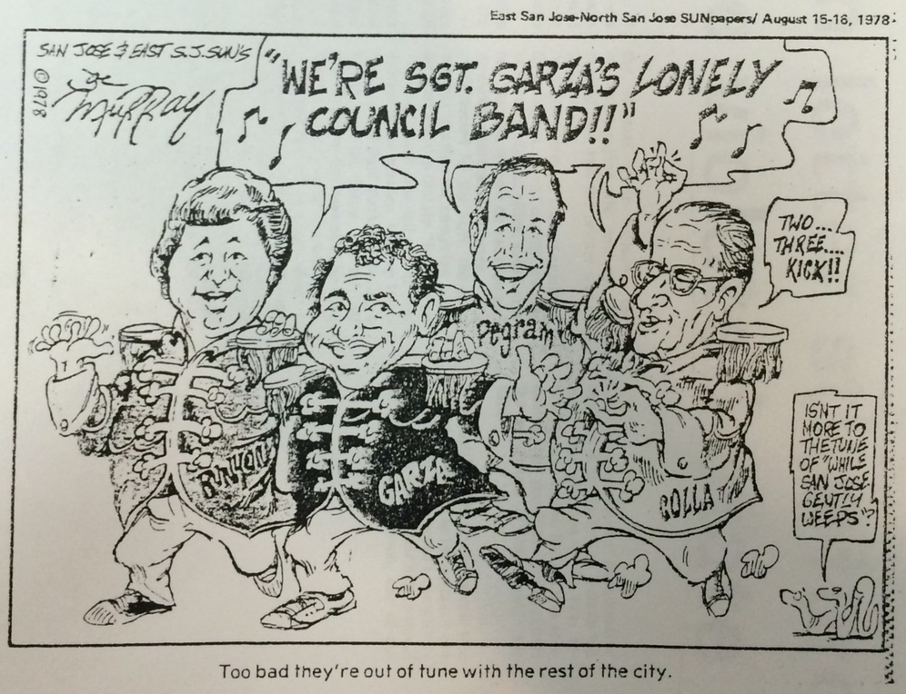

--- 
author: 
- Jason A. Heppler 
title: | 
	| Chapter 4 
	| A Place for Nature 
	| The Politics of Planning and Growth
...

> We stand today poised on a pinnacle of wealth and power, yet we live in a land of vanishing beauty, of increasing ugliness, of shrinking open space and of an overall environment that is diminished daily by pollution and noise and blight. This, in brief, is the quiet conservation crisis. 
>
> ---Stewart Udall, *The Quiet Crisis*, 1965^[Stewart Udall, *The Quiet Crisis* (New York: Holt, Reinhart and Winston, 1963), xvii.]

> From the work bays of the light-industry sheds that the speculators were beginning to build in the valley, you could look out and see the raggedy little apricot trees they had never bothered to bulldoze after they bought the land from the farmers. 
> 
> ---Tom Wolfe, 1983^[*Esquire*, 1983, 356.]

<!--

> The "Fruit Bowl of America," fertile Santa Clara Valley, has come of age. Suburbs, shopping centers, freeways and industrial parks are marching through the orchards that until recently produced half the world's prunes and a bounty of apricots, cherries and walnuts. 
> 
> ----"Living in Santa Clara County," Bank of America^[citation needed]

-->

> The breakfast garbage you throw in the Bay, they drink as lunch in San Jose.
>
> ---"Pollution," Tom Lehrer, 1960

> Across the street -- the freeway,  
> blind worm, wrapping the valley up  
> from Los Altos to Sal Si Puedes.  
> I watched it from my porch 
> unwinding. Every day at dusk  
> as Grandma watered geraniums 
> the shadow of the freeway lengthened.  
> 
> --- "Beneath the Shadow of the Freeway," Lorna Dee Cervantes, 1977^[*Latin American Literary Review*, (Spring 1977): 176.]

<!-- THESIS: Enviro. activists influenced urban planning, arguing that prevailing trends in land use, density, and urban design harmed sustainability and economic viability of their communities. -->

Journalist Leonard Downie could scarcely find nature in Santa Clara County. Visiting San Jose in the early 1970s, he concluded that the only remaining open space existed along the "carefully tended and regularly watered greenery along the shoulders of the county's many freeways." The Santa Clara Valley had become defined by the clusters of poorly-built and quickly constructed homes, traffic that had given the air a "mustard-colored haze," and urban space so compact that there existed no "open spaces, parks or even sidewalks." Downie blamed poor planning and greed for the Valley's urban problems, citing a study that found residential density could be maintained near 1973 levels in just thirty square miles instead of 134, saving miles of open space and orchards. Santa Clara County, Downie concluded, had become a "jigsaw puzzle of intertwined suburbs" and the land "systematically ravaged" by "speculators, developers, other entrepreneurs and homebuyers."^[Leonard Downie, Jr., "A Misplanned Suburb," *Washington Post*, December 30, 1973.] Downie was not alone in questioning the value of urban growth at the expense of disappearing open space. After a decade-long boom that saw Bay Area cities sprawl across the landscape, activists, journalists, homeowners, and critics promoted the protection of open space for recreation, aesthetics, and ecological health. Environmental advocates argued for new restrictions on city growth and the protection of greenbelts, public parks, and wilderness areas. "Already we have filled the San Francisco basin with housing, industry, airfields, and highways, from the tops of the hills to the edge of the water," wrote Raymond Dasmann, a Berkeley-trained biologist and conservationist. If the process proceeded, Dasmann feared a "gigantic, disorganized metropolis" "engulfing farm and forest, marsh and pasture with no end in sight."^[Dasmann, *The Destruction of California*, 19.]

This chapter traces the chronological contours of urban sprawl debates in Silicon Valley. Debates over open space in Santa Clara Valley roughly followed three branches. The first emerged among expert urban planners and residential activists, who relied on professionals to form a critique of poor urban planning and the loss of natural landscapes. As Adam Rome has demonstrated, homeowner's sense of environmentalism emerged from professionals and experts.^[@rome2001bulldozer. Christopher Sellers argues that Rome and others have concluded that such an analysis overlooks a genuine environmentalism emerging from the suburbs. @sellers2012crabgrass.] In the process, they pressured politicians to craft new zoning restrictions that required environmental impact studies and strict zoning requirements. The second branch came from anti-growth and no-growth advocates who urged tightened restrictions on the places that cities were allowed to expand. Simultaneously, elite suburbanites were challenged by communities on the margins of the suburbs---Chicanos, African Americans, Asian Americans---who formed a critique of sprawl based not on aesthetics but out of concerns for human health and safety. Together, these activists shared a common language---using terms such as "beauty," "wilderness," "ecology", "health", "sprawl"---but used that vocabulary to defend and define different goals. Environmental advocates revealed a clash between competing political ideas and urban priorities, placing ecology and its relationship to cities at the center of the conflict. Environmental activists influenced urban planning, arguing that prevailing trends in land use, density, and urban design harmed sustainability and the economic viability of their communities.

<!--
## Professionalization

The professionalization of environmentalism began emerging by the late 1950s among a group of urban planners coming out of the University of California-Berkeley. They thought of the environment differently. Whereas the neighborhood activists defined their concerns around specific local concerns, the new wave of environmentalists urged policymakers and cities to think more regionally.
-->

<!-- Professionalization also came with another consequence: the overwhelming affluence of the environmental movement in the Bay Area. -->

<!-- what does some text analysis of the gov docs say? -->

<!-- ## Losing Amenities -->

<!--
Environmental activists made a point to suggest that sprawl, loss of open space, smog, traffic, and other concerns would lead to industries deciding to relocate elsewhere. If boosters were wont to point to climate, space, and the landscape as a benefit for industry and its employees, environmentalists were quick to point out that threatening those benefits also meant industry would be less likely to come to the Bay Area. Business and cultural institutions that had come to the Bay Area because of its quality of life reputation, argued People for Open Space, "are here because of the quality of the physical environment. The Bay, the rolling hills, the wooded ridges, the beaches, the orchards and vineyards---all combine to provide an unmatched setting."^[People for Open Space, "The Case for Open Space," report (January 1969), Folder 4, Carton 2, Calif. Tomorrow records {DETAIL}.]

Like many postwar environmental critics, Santa Clara County conservationists argued for the importance of farmland and the loss of the country's ability to produce food if prime soils were paved over for subdivisions and industrial parks.
-->
<!-- {TODO} LAFCO as a regional response; ties together with POS/CA Tomorrow calls for regional thinking and regional fragmentation -->

## Silicon Aztlán

In East San Jose---known simply as East Side---a small group of Latino laborers banded together in the early 1950s to confront the problems of urban sprawl and urban policy discrimination. The Mayfair District became the epicenter of Latino activism focused on halting racial discrimination, calling for greater participation in electoral politics, labor rights, and a critique of San Jose's growth policies. Chicano activism and environmental regulations became entwined with debates over citizenship and discrimination, prompting activists to call for environmental equality alongside their challenges to racial inequality, citizenship, and segregation. Even economic issues that appeared neutral, such as zoning, sewer hookups, and street paving became a core tenant of Chicano politics. In the drive for progress, city leaders in San Jose created spaces that were disconnected from urban services and lacking good roads, adequate sewers, and city utilities.

Perhaps no place better represented frustrations in Mayfair than Sal Si Puedes. Originally a neighborhood populated predominantly by Puerto Rican farm laborers, Latinos living in Sal Si Puedes moved to the neighborhood in greater numbers the 1940s to work in the orchards, packing houses, and on construction crews building San Jose's suburban future.^[@clark1959health, 49--51, 79; *The Spanish-American Community of the San Francisco Bay Area* (U.S. Commission on Civil Rights, April 28, 1967), 3.] In the early 1950s, agriculture remained a steadily profitable industry. By the mid-1950s, the county boasted the highest levels of agricultural profits before agricultural industries began their steady decline towards the end of the decade. "Agriculture and industry are synonymous words in the Santa Clara Valley," the *San Jose Mercury* could boast in 1955. Food processing employed a third of the county's manufacturing workforce.^["Agriculture," *San Jose Mercury*, January 15, 1956.] The presence of San Jose's agricultural industry attracted many migrants seeking job opportunities.

East Side reflected the spatial influences of industrialization in the Bay Area. High tech industries tended to cluster west and south in San Jose, staying close to the highways that channeled traffic and freight north and south. Zoning decisions by city and county government likewise determined the spatial layout of industrialization. Few of the Bay Area's new high-tech industries located themselves in the eastern parts of San Jose. Rather, East Side tended to be the site of homes rather than industry. Furthermore, the city's decision to zone for low-density residential and federally-subsidized housing clustered heavily in East Side, causing severe traffic congestion on roads inadequate to carry the thousands of commuters left for their jobs further north in the county.^["East Siders form alliance to increase political clout," *San Jose Mercury*, March 22, 1978; @cavin2012siliconvalley, 293--294.] The pattern and policies of the Bay Area's postwar development introduced uneven environmental effects to barrio neighborhoods. Space, race, class, and environmental politics became tangled in East Side, expressed through Latino activists in the South Bay. Historians have noted the connection between organized labor and its connections to environmentalism.^[See, for example, @dewey1998working.] But fewer historians have looked at how environmental thinking traced itself, in part, to the communities laborers called home.

<!-- The congregation of seasonal workers in East Side caught the attention of Elizabeth Clark -->

Cesar Chavez was among those Latinos coming to East Side in the 1950s seeking out ways to make a living and support his family. Chavez, his wife, and four children moved to San Jose in 1952, where he found irregular work in canneries, orchards, and lumberyards. A native of Yuma, Arizona, Chavez's family moved to Los Angeles when he was ten years old and later to San Jose, where his family worked in fruit packing houses. After a stint in the Navy during World War II, Chavez married and moved to foothills of San Jose where he sharecropped for a few years. Unable to scrape together much of a living, he moved his family into the city where Chavez worked in fields and lumberyards.^[@castillo1995chavez, 24; @pitti2004devil, 150--154.]

Chavez lived in the neighborhood known as Sal Si Puedes ("Get out if you can"), a suburban barrio in East San Jose that served as home for many of the area's seasonal workers. Sal Si Puedes became an epicenter of environmental justice for the city's Mexican American residents. By the early 1950s, Fred Ross, a community organizer from Los Angeles who helped Chavez establish the Community Service Organization (CSO) in 1952, wrote of the neighborhood's lack of sewers, the presence of cesspools that led to amoebic dysentery outbreaks, and flooding, muddy streets that occasionally left children unable to attend school.^[Ross, "The Saga of Sal Si Puedes," 3--6.] Environmental hazards formed a critique of the city's public policies that overlooked it's minority communities. Even the very name of the community became a rallying point for activists. Puerto Rican families jokingly coined "Sal Si Puedes" due to its muddy streets that became filled with potholes in the winter rains. Residents continued to use the name because of its housing and socioeconomic problems, not so much as a joke but as an aspiration.^[Clark, *Health in Mexican American Culture*,35. Herman E. Gallegos, who became the first president of the San Jose CSO in 1952, recalled three stories as to how Sal Si Puedes got its name. See Gallegos, "Equity and Diversity: Hispanics in the Nonprofit World," interview by Gabrielle Morris, 1988, 16, Regional Oral History Office, Bancroft Library, University of California, Berkeley.]
<!--
Sal Si Puedes was overlooked by the city. The majority of the concerns at the first CSO meeting revolved around environmental issues: floods, polluted creeks, cesspools that spread dysentery.^[Cesar Chavez, "The Organizer's Tale," *Ramparts*, July 1966; Levy, *Cesar Chavez*, 97--98; Ross, *Conquering Goliath* 3; Ross, "The Saga of Sal Si Puedes" 5.] Although the CSO's primary expression of political energy focused around voting rights and citizenship, the organization also became an expression of political power for barrio residents concerned about urban growth and its attendant problems. The urban transformations in East San Jose led to a kind of environmental politics among barrio residents. Unlike the affluent, middle-class whites that defined their environmental concerns around aesthetics, East Side Mexicans and Mexican Americans began crafting a vision of environmental justice within the suburban barrio that revolved around health and safety.
-->
<!--
Located in the Mayfair district east of Highway 101, Sal Si Puedes occupied the very eastern edge of the neighborhood.^[Sal Si Puedes no longer exists today. The original site of Sal Si Puedes is now overlaid by Highway 680. The interchange between Highway 680 and Highways 101/280 was completed in the 1970s.] Sal Si Puedes had become a site of environmental concern for the city's Mexican American residents. By the early 1950s, Fred Ross wrote of the area's lack of sewers, the presence of cesspools that led to amoebic dysentery outbreaks, and flooding, muddy streets that occasionally left children unable to attend school.^[Ross, "The Saga of Sal Si Puedes," 3--6.] In the 1950s the residents of Sal Si Puedes criticized the environmental hazards that had overtaken their community, using environmental concerns to form a critique of the city's public policies that overlooked its minority communities. In the first meeting of the CSO, residents took the opportunity to denounce "every rat, mosquito, cesspool, traffic hazard and flooded road" that had come to characterize the neighborhood.^[Ross, "The Saga of Sal si Puedes," {PAGE}, quoted in @cavin2012siliconvalley, 261.] Even the very name of the community became a rallying point for activists. Originally coined "Sal Si Puedes" by Puerto Rican families who gave it the name due to its muddy streets that became filled with potholes in the winter rains. Residents continued to use the name because of its housing and socioeconomic problems.^[Clark, *Health in Mexican American Culture*,35. Herman E. Gallegos, who became the first president of the San Jose CSO in 1952, recalled three stories as to how Sal Si Puedes got its name. See Gallegos, "Equity and Diversity: Hispanics in the Nonprofit World," interview by Gabrielle Morris, 1988, 16, Regional Oral History Office, Bancroft Library, University of California, Berkeley.]
-->

<!-- Chavez: "Do you think that we like our kids to grow up in this neighborhood? . . . Sure we want out, but where can we rent outside of Eastside? . . . I guess our best bet is to work with what we've got and fix up where we are." (Cavin, 511-512) -->

Ross, Chavez, Herman Gallagos, who served as the CSO's first president, organized the community to act, turning to electoral politics to get the city's attention. While the CSO predominantly focused on anti-poverty programs, ending racial discrimination, and embraced the postwar welfare state, their platform was framed, in part, around the uneven environmental hazards their neighborhoods experienced. Ross told members of San Jose's first CSO meeting that election drives he helped organize in Los Angeles brought streetlights, paved roads, and medical care to the barrio. East San Jose, Ross promised, could achieve the same.^[Ross, "The Saga of Sal si Puedes," 8.] Armed with Ross's know-how for organizing, an eighty-five-day voter drive registered 6,000 new Mexican American voters. The move caught the attention of city officials. Fearing that the wave of Latino voters might sway city politics, city officials approved new urban services to Sal Si Puedes within months after the election drive. New public works systems to fix chronic flooding, clearing out cesspools, and paved roads were brought to the barrio. Fruit packinghouses and canneries were forced to cease dumping effluence into creeks.^[Ross, "The Saga of Sal si Puedes," 16, 22---23; Clark, *Health in the Mexican American Culture*, 28; Levy, *Cesar Chavez*, 104]

Yet despite the city's move to connect the barrios to urban services, such places were still considered expendable. San Jose leaders and planners saw barrios as signs of decay. "Each segment of the city," the 1958 master plan noted, "has a natural cycle of growth---obsolescence and decay---and then renewal."^[San Jose City Planning Commission, *Master Plan of the City of San Jose*, 89.] The planning commission's map of blighted areas closely followed the city's barrios, identifying blight primarily in East Side. The city, the commission warned, needed to pursue urban renewal programs to prevent blight from spreading so "that the vast private investment in our city will remain sound an continue to expand."^[Planning Commission, *Master Plan*, 94--95.] Renewal needed to "clear and rebuild areas that economically are not worth saving."^[Planning Commission, *Master Plan of the City of San Jose*, 89.] The suggestions for renewal also aligned with federal transportation programs, which city officials turned to for helping in aiding demolition of blighted areas. Municipal planners planned three interstate highways and an expressway through East Side. The planned Highways 280 and 680 would shuffle traffic between northern and southern Santa Clara County. Capitol Expressway skirted the eastern edge of the city, allowing traffic to flow east and west. In the process of constructing the new highway system, many of the East Side barrios were demolished.^["Housing for Freeway Displace-ees,", newspaper clipping, n.d., Box 5, Folder 19, Fred Ross Papers, Department of Special Collections, Stanford University Libraries, Stanford, California.] As a response, Mexican Americans relocated to a centralized barrio in East Side and remained physically and symbolically separated from white communities by the freeway. The eastern edge of the city also became home to many of the city's federally-financed public housing projects administered through San Jose's Housing Authority, established in 1966.^["Housing for Freeway Displace-ees," Fred Ross Papers.]

Urban renewal plans sealed the fate of Sal Si Puedes. What had once housed a community of 422 people became the site for highways. San Jose's policies of transportation, urban renewal, and annexations overwhelmed the CSO activists. "What use to be a very small neighborhood is now . . . hundreds of hastily-built tract homes that have become quite blighted," Gallegos noted. San Jose's growth "happened so rapidly," he continued, "[that] it was just incredible." The problems of Sal Si Puedes "were exacerbated by the sudden growth."^[Gallegos oral history, 17--18.]

<!--
But what were the environmental consequences of blight and it's eradication under public policies? Urban historian Colin Gordon has noted the tendency of cities to define blight and urban renewal in order to support greater concentrations of commercialization and industrialization.^[@gordon2008decline, {PAGE}.] In East Side, the result of the new freeways was to accelerate zoning for residential housing. While the eastern half of Highway 680 became a dense site of public housing, the western edge filled in with large-lot housing for single family homes.
-->
By framing community problems around environmental issues, Mexican Americans in East Side shaped a conversation about their lack of access to the suburban lifestyle enjoyed by the majority of white residents in the city, but also demanded that the city ensure an environment that promoted health and quality-of-life. The conditions of the barrio went hand-in-hand with the environment, a point that residents of Sal Si Puedes understood well. In shaping their political organizing around the community, Sal Si Puedes activists argued for a suburban vision that included them while promoting an environmental critique of San Jose's sprawl.^[@pitti2004devil, 157.]

<!-- {TODO} Map Los Altos Hills -->

The battle over zoning, race, and environment would emerge further north in Silicon Valley in the town of Los Altos Hills, to the southeast of Mountain View. The town incorporated in 1956 as an exclusively residential town and implemented some of the strictest zoning requirements in the Bay Area. Los Altos Hills residential zoning required a minimum of one acre lot sizes, among the largest lot sizes in northern California.^[Social Planning Council of Santa Clara County, Inc. and Santa Clara County Planning Department, "Profile '70: A Socio-Economic Data Book for Santa Clara County", ({DETAIL}, 1973).] The community zoned itself to be rural and exclusive, a place defined by horse stables, tennis courts, and swimming pools insulated from the pressures of urbanization and the land-hungry municipalities of Palo Alto and Los Altos. Fearing that newcomers would overwhelm the community's sense of open space they sought to preserve the rural characteristics of the town by minimizing public services and taxes.^[@mensinger1982losaltos, 21-22.] Los Altos Hills also couched its regulations in the language of conservation, arguing that steep slopes, unstable soils, the preservation of open space, and protection of wilderness.^[@mensinger1982losaltos, 23.]

While residents argued that such strict zoning requirements served environmental aims, others saw restrictive zoning that only served as an exclusionary tactic. Los Altos Hills' zoning policies drove up housing prices and its 7,000 residents lived in wealthiest community in Santa Clara County.^[Social Planning Council of Santa Clara County, Inc. and Santa Clara County Planning Department, "Profile '70: A Socio-Economic Data Book for Santa Clara County", 1973.] To Jack Ybarra, president of La Confederacion de la Raza Unida (CRU), Los Altos Hills typified West Side's exclusionary affluence.^["Scatter Low-Cost Housing," *San Jose Mercury News*, September 10, 1970.] Like many of Santa Clara County's suburban Chicano activists, Ybarra's politics emerged out of farmwork and housing shortages. He started working for the National Farmworkers Association in 1966 and the Tropicana-Hillview Organization United. Ybarra identified sprawl as a key problem for Latinos in Santa Clara County.^["Mexican Americans Sound Call for Unity," *San Jose Mercury*, September 17, 1969; "Thou Tells Ybarra: Get Thee Out," *San Jose Mercury News*, August 9, 1968; "Mexican Americans Split from THOU Group," *San Jose Mercury News*, August 12, 1968; "The 'U' Is Dropped Off THOU," *San Jose Mercury News*, August 13, 1968; @cavin2012citizenship, 515--517.)] The rapid urbanization of the Valley, he argued, had destroyed agriculture and in the process "displaced the Mexican-American not only from his employment, but from his home." The county's growth came at the expense "of thousands of its poorest and most defenseless citizens."^[*San Jose Mercury*, March 11, 1972.]

Following a successful lawsuit against Saratoga, a wealthy suburb in the Santa Cruz foothills, in 1970 that charged the city violated a new state law requiring housing for all economic segments, CRU filed suit against Los Altos Hills. The organization had applied for a low-income housing permit in 1971 on land near the edge of town to become a 200-unit apartment that could accommodate 800 persons. The town refused, and Ybarra filed suit charging that the city violated California law. During the three-day trial, representatives for CRU argued that the city's zoning requirements were exclusionary and served only to maintain an enclave of white, upper-class families. The city responded that their zoning requirements sought to maintain the "rural" character of the town. Furthermore, they claimed, such additions to the town posed an environmental threat. Nor could the city fully provide the urban services that would be needed.^[*San Jose Mercury*, November 24, 1972; *San Jose Mercury*, November 22, 1972; *San Jose Mercury*, December 4, 1972; *San Jose Mercury*, November 21, 1972; "One-Acre Zoning Draws Criticism," *San Jose Mercury*, December 16, 1970; @cavin2012citizenship, 527--528.] To Ybarra, such claims were empty, telling the *San Jose Mercury* that "if they're interested in preserving the foothills for a certain class of people then the conservationists are our enemies, too."^[*San Jose Mercury*, December 21, 1970; @cavin2012siliconvalley, 489--490.] In November, Judge Stanely Wiegel rejected Los Altos Hills' argument that infrastructure and environmentalism supported the town's restrictive zoning, but Wiegel upheld the zoning law. When CRU appealed, the Ninth Circuit upheld the district ruling on the basis that low-income housing was available elsewhere in the county.^["Hills City Zoning Upheld by Court," *San Jose Mercury*, September 12, 1974; *Ybarra v. Los Altos Hills*.]

Landscape aesthetics and appeals to environmentalism formed the core justification for suburban exclusivity in Los Altos Hills. Special zoning allowed affluent suburbs to maintain their "rural" environments, but at the cost of poor communities. <!-- finish this up -->

## Saving Open Space for the Cost of Wine and Bread

The problems of urban growth and environmental consequences in the South Bay caught the attention of expert planners, intellectuals, scholars, journalists, and students. Emanating most forcefully from Berkeley, a new wave of environmental thought began to shape the conversation about the entirety of the Bay Area's environment. These emerging conservation groups formed a vision at once utopian and regional. Rather than leaving planning at the whims of local governments, these environmentalists called for thinking about a *regional environment* where local governments could improve its coordination, cooperation, and urban planning. These critics were what geographer Richard Walker labeled "midcentury Modernists" who believed in "the enlightened application of foresight, science, and good government" to the Bay Area's problems.^[@walker2007countrycity, 133.] The expert critics made their case through book publications, conferences, educational workshops, teach-ins, and editorials and, in so doing, helped reshape the conversation about urban growth and environmental degradation. 

Students and scholars at the University of California-Berkeley led the way. In 1939, students formed an organization called Telesis, a Greek word meaning "planned progress," that included T. J. (Jack) Kent, Mel Scott, and Francis Violich, who would not only become future Berkeley professors but also formed an important intellectual core of the Bay Area's midcentury critics. Inspired by the New Deal, housing reformer Catherine Bauer, and civic planner Lewis Mumford, the students outlined a vision for the Bay Area focused on planning, architecture, and greenbelts.^[@walker2007countrycity, 133.] The university's Bureau of Public Administration, under the leadership of Samuel May, attempted to establish a state planning commission in 1940 under Governor Culbert Olson's tenure. The bureau, renamed the Institute for Governmental Studies (IGS) in the 1950s, continued to advocate for region-wide governance throughout the postwar era.^[@walker2007countrycity, 132---133; @vieg1955two, 244---246.]

Ideas of regionalism pervaded the thinking of the Bay Area's midcentury environmental critics. In 1959 IGS helped publish Mel Scott's study of the Bay Area, the first study of the region's urban history and a plea for regional governance.^[@walker2007countrycity, 133.] Bay Area cities, Scott argued, all faced the same problems of "air pollution, vanishing open space, bay pollution, inadequate transit, [and] uncoordinated planning." These challenges were "so pervasive," Scott concluded, that "the oneness of the area cannot be denied."^[@scott1959bayarea, 2.] The lack of coordinated planning---or any planning at all---had become most apparent in Santa Clara County, Scott urged. He pointed to the "lack of zoning, inappropriate zoning, or changes in zoning ordinances made under pressure from developers and landowners" that "accounted for these ill-advised and detrimental uses of the land."^[@scott1959bayarea, 274.] The "oneness" of the Peninsula environment could not be ignored. Smog and water pollution recognized no municipal boundaries. The only sensible way forward, according to Scott and others, was a new form of coordinated regional government. 

As intellectuals pushed the agenda of metropolitan-wide planning, the California state legislature took legal action. The Bay Area had grown remarkably beyond the old urban cores of San Francisco and Oakland, encompassing the nine counties that touched the Bay, one-hundred cities, 108 special districts overseeing parks, sewage, and water, and twenty-four transit districts.^[@walker2007countrycity, 136.] Metropolitan fragmentation had led to a chaotic, complicated, and confusing mixture of special interests and local governments. In the late 1950s the California Legislature attempted to intervene, creating the state's Office of Planning in 1959 and appointing a Governor's Council on Metropolitan Area Problems to study what the state could do to confront challenges to urban growth. The council recommended the establishment of regional districts to oversee transportation, recreation, and planning, but resistance by local governments forced the commission to revise their proposal to a metropolitan-level commission.^[@pincetl1999transforming, 140--141.]

While some metropolitan areas like San Jose resisted the call for regionalism and sought to maintain their local autonomy, going so far as to reject being included with the San Francisco-Oakland Statistical Metropolitan Area in favor of its own census designation and rejecting a connection to the Peninsula-wide Bay Area Rapid Transit system. By the late 1950s and early 1960s planning professionals and state legislatures were formalizing plans to correct what they viewed as a fragmented regionalism that did a disservice to urban planning and introduced environmental degradation.

Despite resistance to any state intervention into local land-use planning by the League of California Cities and the County Supervisors Association, the Coordinating Council continued to argue for a regulatory body in the belief that problems of growth stemmed from jurisdictional boundaries. The State Legislature's passage of the Knox-Nisbet Act in 1963 resulted in their intervention into urban planning. Under the Act, every county in the state was required to create a Local Area Formation Commission (LAFCO) whose mandate primarily revolved around the approval of annexations and incorporations. LAFCO's authority attempted to discourage urban sprawl and maintained the ability to regulate many special districts, including sewers and sanitation, police, irrigation, county services, water districts, reclamation, and parks and recreation. LAFCOs also established "sphere of influence" boundaries for cities in an attempt to prevent one city from annexing into the area of interest of another city, as well as requiring all counties and cities to draw up general plans. An extension of the Act under the 1965 Quimby Act required developers to dedicate space to parks and open space.^["Guidelines, Santa Clara County Local Agency Formation Commission," September 1974, Folder 7, Carton 53, California Tomorrow records, California Historical Society {FACT}; @walker2007countrycity, 137; @pincetl1999transforming, 141--143.]

<!--Local governments reacted strongly against the implementation of LAFCO and, in response, formed their own regional association under the name the Association of Bay Area Governments (ABAG).--> <!-- need to look into this more; Walker says its a reaction against LAFCO (137-138) but I'm not so sure. Because they're still involved with regional planning, e.g., their open space plans. -->

Although LAFCO attempted to intervene in local political issues, the regionalist thinking of the Bay Area environmentalists remained, perhaps because the LAFCO ideal simply threw power back to local governining elites. A new coalition of planners and citizen activists formed under the aegis Citizens for Regional Recreation and Parks (CRRP), emerging after a June 1958 conference in San Francisco called "The Peril To Our Public Lands--A Discussion of Regional Recreation." The organization's core concern was the lack of accessible spaces for recreation in California's metropolitan areas and the rapid disappearance of such spaces under urban expansion. Leading the charge were Dorothy Erskine and Jack Kent, who immediately set themselves to creating an inventory of public lands, sponsored conferences on open space and conservation, and fostered partnerships with regional conservationists and national organizations like the Sierra Club.^[@kent1970openspace, 69.] 

Kent and Erskine were natural activists. Kent earned a degree in architecture at Berkeley in 1938 and spent a year in Europe studying under Lewis Mumford before returning to Berkeley to help found Telesis. Kent quickly jumped into various planning roles, first working as a junior planning assistant with the Marin County Planning Commission and a planning technician with the Pacific Southwest Regional Office of the National Resources Planning Board. He earned a Masters degree in 1943 in City Planning from the Massachusetts Institute of Technology and became the Associate City Planner for the San Francisco City Planning Commission in 1943, but his tenure was cut short when he was drafted into the Army during World War II. Kent served in Washington, D.C., during the war, and was stationed in Berlin between 1945 and 1946 before returning to San Francisco and beginning work as the Director of City Planning under Mayor Roger Lapham. He was recruited to teach at Berkeley and, along with other planning professors, founded the Department of City and Regional Planning in 1948. Along with serving as a Berkeley professor, he maintained an active role in the Berkeley City Planning Commission and, in 1957, was elected to the Berkeley City Council.^[@dyble2009toll, 175--176.]

Like his mentor Mumford, Kent maintained a firm belief in careful planning to manage urban growth and prevent suburban sprawl. He was wary of local governments and their penchant for bucking regional efforts at controlling land use. He supported the formation of the Association of Bay Area Governments (ABAG), a voluntary association of Bay Area municipalities, helping draft its first constitution and bylaws in 1958 and serving on its executive committee. Regional planning was essential, Kent believed, in protecting open space and environmental quality. As he explained in 1963:

> Without a regional plan, the so-called "natural" forces of economic development will overwhelm the best efforts of local governments to control them. . . . Speculative land development forces now operate on a metropolitanwide basis. They are commanded by men of great enterprise and ability. These men---the builders and does of today---will wipe out the vineyards of the upper Napa Valley and fill it with suburban tracts; they will overrun the Livermore Valley; they will mop up Stinson Beach, Bolinas, and the Olema Valley. They will spread to the northeast, beyond Vallejo and Fairfield toward Sacramento; to the south, below San Jose to Hollister; and to the west, beyond Santa Rosa to Sebastopol and the Pacific Ocean. . . . Freeways will precede the initial wave of surging growth, and more freeways will follow. Predictably inadequate bridges for trucks and automobiles will be constructed [and] tidelands will be filled. The central districts of San Francisco, Oakland, and San Jose will become inaccessible, and will decay.^[Kent, *City and Regional Planning for the Metropolitan San Francisco Bay* (Berkeley: Institute of Governmental Studies, 1963), 1--2; quoted in @dyble2009toll, 176.]

Like Kent, Erskine's political education was rooted in progressive politics stemming from her immersion with socialism and labor activism. Erskine established herself as a dedicated conservationist and social activist for various Bay Area causes. Erskine helped found the Marin Conservation League in the early 1930s. In 1938, she traveled to the Soviet Union to seek how the nation handled urban planning, particularly housing for laborers.^[Erskine book, 45--53.] She became a proponent of public housing in San Francisco, helping revitalize the San Francisco Housing Association, originally formed after the 1906 earthquake, in 1938.^[Erskine book, 57.] Her interest in housing led to a growing awareness of the role city planning played in creating livable spaces for people, and by the late-1950s Erskine had taken an interest in greenbelt planning. Erskine devoted her energies to CRRP, which played a significant role in crafting the California Public Outdoor Recreation Plan in 1960, and aided in the establishment of the Save San Francisco Bay organization and served on the board of directors of the Bay Conservation and Development Commission.^[@walker2007countrycity, 134--136; Erskine book, 117--128.] 

Erskine located in postindustrial capitalism a warped idea about land. "Land is a resource," she argued, "not a commodity subject to speculation and mindless use."^[Quoted in @walker2007countrycity, 136.] She distrusted local decision-makers, writing to Sierra Club executive director Michael McCloskey that the "pressures of self-interest and greed are too powerful on local agencies to protect the great mass from serious harm." Erskine put her faith in federal programs, arguing their use in reclamation projects, building recreational areas, improving land values, and preventing air and water pollution. "Apparently we don't try to change our system or tinker with men's minds too much... That might be called 'socialism,'" she wrote. "Instead, we put a 'price tag' on a social reform at the Federal level and then do the job. That's just another business transaction."^[Letter from Dorothy Erskine to Michael McCloskey, April 12, 1969, Folder 4, Carton 2, California Tomorrow records, CHS; ellipses in original.]

Part of the solution to the open space problem was the preservation of agricultural land. The rapid loss of agricultural land---as much as one million acres left production between 1945 and 1968---led to discussion about defining city boundaries to protect open lands.^[@pincetl1999transforming, 147--148.] By the mid-1950s studies were pointing to the problems of lost agricultural land in the Valley. A study by the California State Planning Commission noted the sprawling nature of urbanization in northern Santa Clara County, finding that all of the subdivisions established between 1945 and 1955 covered just seven square miles if combined. But instead of dense development, subdivisions "dotted over 200 square miles of prime agricultural land."^["Planning for Growth", 1955, 43.] If such growth continued, the state planning board concluded, Santa Clara Valley would lose nearly all farmland by 1960.^["Planning for Growth," 45.] Land selling for between $800 and $1,200 an acre for agricultural uses was fetching upwards of $8,000 an acre for industrial or residential uses. The disparity between the price of land for agriculture and the price of land for subdivisions introduced a capital imbalance for tax assessments. As a result of rising land prices nearby agricultural land, county tax assessors likewise raised the value of agricultural land and, therefore, the burden of taxes farmers owed.^["Planning for Growth," 43---44.]

Concerns about the increasing value of agricultural land and threat of urban sprawl led the state legislature to act. The California Legislature passed the Land Conservation Act in 1965. Known as the Williamson Act, the state legislation ostensibly provided protections for open space and greenbelts. Under the Williamson Act, agricultural land had the option to be removed from markets by entering into a contract with county governments. The contract restricted the land's use to agricultural purposes for a minimum of ten years. In return, farmers enjoyed a tax benefit. County assessors valued the land at agricultural value rather than market value, allowing farmers to pay lower taxes on their land and, both parties hoped, allowed the land to remain  perennially agricultural. Contracts were renewed annually unless notice for nonrenewal was given. By 1969, twenty-three counties in California placed more than two million acres of private land into the agricultural preserve.^[California Legislature, *Joint Committee on Open Space Land, Preliminary Report* (Sacramento, March 1969), 10; @brucebiggs1975landuse; @snyder1966landuse; @walker2007countrycity, 43. See also @brosnan2010napa, 36.]

Despite the availability of state law to control land use, it fell short of its intended goals in Santa Clara County. Farmers, after all, still had the voluntary option of selling their land at some point in the future. Farmers oftentimes waited as land values rose for the right moment to sell, fetching prices well above what they had originally paid. Open space land was not held as a public good, and once farmland became a place for subdivisions it no longer served its open space purpose. The Williamson Act contained the potential for perpetual agricultural reserves under its renewable ten-year contracts, but in reality farmers often bowed to market pressures. Faced with shrinking agricultural land, citizens began seeking alternative and long-term methods for sustaining the presence of open space throughout the Peninsula. Community organizing continued to shape the local policies guiding land use with an increasing focus on recreation and public lands. In 1968, CRRP filed for nonprofit, tax-exempt status and renamed themselves People for Open Space (POS). Their new status as nonprofit allowed them to pursue a $59,000 Ford Foundation grant to examine the economic impact of open space in the Bay Area.^[@kent1970openspace, 74; "Ideas for Discussion with Ford Foundation," November 19, 1968, Folder 4, Carton 2, California Tomorrow Records, California Historical Society.] Completed in 1969 and published as both a main report and as a summary pamphlet, POS laid out a vision for Peninsula open space that fulfilled their desire to guide places against urban expansion. "A major open space system can be created only on a regional basis," argued the study, " because open space exists without regard to city or county boundaries. . . . To establish permanent open space, all parts of the region must act together, probably using types of legislation not currently available to counties or even special districts."^[People for Open Space, "The Case for Open Space," January 1969, 4, Folder 4, Carton 2, California Tomorrow records, CHS.]

People for Open Space applauded the Williamson Act, but remained skeptical about its implementation. Finding that "very little high quality agricultural land has been conserved" and concerned about the lack of a "guarantee of permanence," they conclude that the voluntary contracts are ultimately an unsatisfactory solution to open space preservation.^[People for Open Space, "The Case for Open Space," report, 7, Folder 4 People for Open Space, Carton 2, California Tomorrow Records, California Historical Society.] A more desirable action was for a regional governmental body to purchase all available open space for preservation. Such a plan, they argued, would hardly place a financial burden onto Bay Area residents. In assessing the costs of such a program that factored in land value and the offsetting of expenses that would come from providing urban services to densely-populated areas versus sprawling cities, People for Open Space estimated that the net costs for each person in the Bay Area would amount to only $2 to $3 dollars per year---"about the cost of a good bottle of California wine and a loaf of sourdough French bread."^[People for Open Space, "The Case for Open Space," report, 10, Folder 4 People for Open Space, Carton 2, California Tomorrow Records, California Historical Society. See also Association of Bay Area Governments, *Regional Open Space Element*, Supplemental Report RP-3, (Berkeley, October 1969), 9--10.]

<!--
The appearance of POS into debates about land use reshaped discussions about land. While early state and county legislative action sought to protect agricultural land for its productive purposes, midcentury conservationists also began to see the presence of agricultural land as an aesthetic commodity.  --> <!-- keep pushing this -->

The loss of agricultural land was only one feature among many that motivated environmentalists. Frustrated by the state's lack of any comprehensive planning for California and believing that local government was the source of urban California's problems, a new nonprofit educational organization called California Tomorrow entered the political scene with its 1962 publication of *California Going, Going...*, whose opening sentences reiterated the "serious, progressively disastrous lack of coordinated land planning and development" in California.^[Alfred Heller and Samuel Wood, *California Going, Going...*, 6.] California Tomorrow as the brainchild of Alfred Heller and Samuel Wood {FACT} California Tomorrow reflected a belief in scientific and expert knowledge in overcoming urban planning and environmental degradation, forcefully arguing for a central regulatory state to solve the state's rapidly disappearing open spaces. California Tomorrow urged the state to think about both urban and rural areas. A year later, Heller and Wood published *The Phantom Cities of California*, arguing that weak planning allowed political power to aggregate among regional actors---phantom cities---that enacted sprawling urban growth. Without regional planning, Heller and Wood concluded, California was destined to become "unsightly intrusions of subdivisions, cars, roads, parking spaces, sewage, exhaust, strip development, *slurbs*---sloppy, sleezy, slovenly, slipshod, semi-cities."^[Heller and Wood, *Phantom Cities*, {PG}; @starr2009golden, 418--419.]

As part of their efforts towards shaping the state's conversation about planning, California Tomorrow published a quarterly magazine *Cry California* starting in 1966, dedicated to covering issues of environmental decline, race and class discrimination, housing shortages, and job inequalities. The journal attracted many leading environmentalist and conservationists including William Bronson, who served as the journal's editor, landscape architect Garrett Eckbo, environmental writer T. H. Watkins, journalist Mel Wax, and an editorial board that included Wallace Stegner, columnist Neil Morgan, architect Nathaniel Owings, attorney Clarence Heller, and Caspar Weinberger. The journal had a northern California tilt, dominated mostly by writers (and issues) facing the San Francisco Bay Area and surrounding areas.^[@starr2009golden, 422.] California Tomorrow believed that state intervention into urban growth could allow regional government to act, as political scientist Stephanie Pincetl has noted, "as a redistributive entity and actively redress revenue and housing inequities."^[@pincetl1999transforming, 153.]  <!-- what else here? -->

Former Santa Clara County Planning Department director Karl Belser, who had attempted to limit San Jose's growth into unincorporated county lands in the 1950s, took to the pages of *Cry California* to bemoan the state's lack of coordinated planning. The mix of federal, state, and local agencies that "dabble in the planning business" lacked regulatory authority resulting in "fragmented plans" without clear goals to ensure the protection of open space and maintain quality of life.^[Belser, "The Planning Fiasco in California," *Cry California* (Summer 1967), 10.] Despite the presence of these various regulatory bodies, Belser asserted, "the bay is being filled in, air and water are being polluted, hillsides are being mutilated and prime cropland is being paved over."^[Belser, "Planning Fiasco," *Cry California*, 11.] 

Belser placed blame for environmental degradation onto the "economic elite"---"landowners," "money controllers", and "mass communication media"---who "operate in a realm of their own with little concern for *any* but their private interests." To Besler, the *laissez-faire* approach to land use was a symptom of the failings of postindustrial capitalism. The public was beholden to the elite's plans, not because they agreed with the planners but because they lacked power.^[Belser, "Planning Fiasco," 11.] Adding to the problem of economic elites was the presence of "competitive jealousy" among local governments who abandoned proper planning and instead "spend sleepless nights figuring out how to throw the gig into their neighbors."^[Belser, "Planning Fiasco," 13.] The end result from this lack of coordinated planning resulted in "the most tragic and dangerous trend" of ignoring the conservation of resources. "What has already happened should certainly indicate to anyone with common sense that our state faces not only the disfigurement of its natural beauty," Belser argued, "but also the ruin of its primary economy."^[Belser, "Planning Fiasco," 13.] While governments bicker, "our prime soils are being lost, our forests are being butchered, our scenic areas are being raped, and our air and water are being polluted beyond reclamation."^[Belser, "Planning Fiasco," 13.] 

Three years later the situation had not improved, and Belser's warnings about the lack of planning took on an even more seething tone in the pages of *Cry California*. Pointing to the Santa Clara Valley as an example of "slurban" development, he wrote of the "flagrant ruination" and "irrelevant urban development of massive size and questionable quality" that had come to dominate the valley.^[Belser, "The Making of Slurban America," (Fall 1970), 1.] The environmental problems attending such growth had become the primary concern for Belser. Increased traffic on roadways introduced high levels of air pollution, exacerbated by the San Francisco Bay's impenetrable inversion layer that trapped smog in the Valley. Overdraft on underground water supplies and the resulting subsidence threatened to ruin underground utilities and stretch the natural limits of water availability for cities.^[Belser, "The Making of Slurban America," 17.] "Wild urban growth," he wrote, "attacked the valley much as cancer attacks the human body."^[Belser, "The Making of Slurban America," 5.] 

By the late 1960s the efforts by conservationists to overcome poor land use planning was failing. No regional restrictions on urban growth had successfully reversed the trend of sprawl in Bay Area cities. San Jose continued to expand rapidly, adding {FACT} acres to the city between 1960 and 1970. California Tomorrow argued in 1969 in a proposed study of Bay Area open space that 

> the rapid disappearance of the orchards of the Santa Clara Valley is perhaps the most dramatic example of the pattern which urban development will take unless *permanent* measures are taken to preserve open spaces within the urbanized areas. It should be remembered that as recently as 1960, Santa Clara County was considered a model throughout the country in terms of progressive "greenbelt" ordinances to preserve agriculture.^["Regional Open Space Study," August 1, 1968, 1, Carton 2, Folder 4, California Tomorrow records, CHS.] 

\noindent Despite the lobbying, educational, and political efforts of California Tomorrow, People for Open Space, and other regional environmental organizations, open space continued shrinking and land converted into urban space. At the state-wide level, at least, very little action took place in protecting open spaces aside from the 1972 Coastal Protection Initiative. Not to be deterred, California Tomorrow published the *California Tomorrow Plan* in 1971. The *California Tomorrow Plan* proposed a comprehensive initiative to address state infrastructure and environment. The monograph argued that there existed a "California One" and a "California Two"---two potential paths that the state could follow given the current problems of environmental degradation and widespread urbanization. California One imagined a California without any change to these policies. California One would be unable to meet the state's energy needs, deteriorate water quality and accessibility, continued urbanization of farmland, lose wilderness areas and open spaces, worsen air quality, increase noise pollution, clog roadways, cause greater housing shortages, result in underfunded and understaffed schools, widespread unemployment especially among minorities, fall short in recreational areas, and emphasize punitive rather than rehabilitative treatment of criminals.^[*California Tomorrow Plan*, 24--36.] To overcome these challenges, California Tomorrow envisioned a different California comprised of a State Planning Council to develop comprehensive policies addressing a wide range of environmental, social, and economic issues in the state. Under the Planning Council, California Tomorrow envisioned ten regional governments to absorb the many single-issue agencies and districts, drawing up regional plans regarding land use, infrastructure, and socioeconomic issues.^[*California Tomorrow Plan*, 46--48. See also @pincetl1999transforming, 161--162.] By devising regional plans rather than piecemeal local decisions, California Tomorrow leaned on a belief in good government, scientific evidence, and expert knowledge in solving the state's urban problems.

<!--
The plan had little effect in state government, serving only to inform parts of environmental protection bills passed in the early 1970s. Municipalities saw the plan as threatening their power by a new regional entity that would subsume many of their responsibilities.  
-->

<!--
POS remained active in open space protections throughout the 1970s, pioneering the establishment of the Mid-Peninsula Open Space District in 1972 as well as various conservation programs that protected the Suisan Marsh, agricultural preserves in Napa Valley, and the conservation of Angel Island State Park.
-->

<!--

1. Dorothy Erskine & POS
2. California Tomorrow
3. Defeat of planning in the 1970s ---- ironic since its shortly after this that so many slow growth/no growth laws are put in place.

-->

The themes identified by Alfred Heller, Dorothy Erskine, Sam Wood, Jack Kent, and Mel Scott were picked up by a range of intellectuals, journalists, and observers throughout the 1960s, including William Bronson's photojournalistic *How to Kill a Golden State* (1968), Berkeley-trained biologist Raymond F. Dasmann's *The Destruction of California* (1965), Dorothea Lange and Pirkle Jones' *Death of a Valley* (1960), Richard G. Lillard's *Eden in Jeopardy* (1966), and journalist Harold Gilliam, who served as Secretary of the Interior Stuart Udall's assistant and published a series of books and articles in the *San Francisco Chronicle* about the Bay Area.^[@bronson1968golden; @dasmann1965destruction; @lange1960death; @lillard1966eden; @gilliam1972betterworse; @walker2007countrycity, 133; @starr2009golden, 416--420.] Collectively, the intelligentia gave expression to a growing anxiety about unplanned, runaway urban growth and the environmental, social, economic, and political chaos that accompanied the lack of planning. Above all, these writers and advocates argued for a philosophy that fused environmentalism and regulated, regional urban development. 

## "Indiscriminate, Unplanned, Opportunistic, Premature Annexation and Urbanization"

"We were going to have a city of 60,000 people in the hills [above Palo Alto]," Lennie Roberts recalled years after the founding of the Committee for Green Foothills. "And a number of people got together and decided, well, we'll be for something---we'll be for the Green Foothills."^[Roberts quoted in @press2002openspace, 41.] As the political efforts of California Tomorrow and People for Open Space accelerated, primarily in northern counties and East Bay communities like Napa and Marin, further south on the Midpeninsula ideas about restricting urban growth and critiquing environmental degradation influenced local politics. The legislative efforts of California Tomorrow and People for Open Space failed to gain much traction at the state level by the end of the 1960s, but the advocates of urban development for the sake of "progress" would find their greatest challengers coming out of grassroots politics and local action.

In Palo Alto, the Committee for Green Foothills initiated a campaign shortly after their first fight with Stanford University to enact policies for setting aside lands for recreation. Members of the Committee worked closely with the county in establishing the Midpeninsula Regional Open Space District (MROSD). In 1972, a referendum placed Measure R onto the ballot that would establish the Open Space District, originally focused on the northwestern portion of Santa Clara County. Inspired by the San Francisco-based Livingston and Blayney planning agency report in 1971 that concluded it would be cheaper for open space to be acquired and preserved rather than infrastructure extended into the foothills, the Committee for Green Foothills cited the report as a means for passing the MROSD measure.^[press2002openspace, 42; @walker2007countrycity, 164.] Since MROSD existed as a special district, it required no legislative intervention by the state---only the approval of county voters.^[California state law defines special districts as "any agency of the state for the local performance of governmental or proprietary functions within limited boundaries." For an explanation on the role of special district in California, see *What's So Special About Special Districts? A Citizen's Guide to Special District in California,*, 4th ed., Senate Local Government Committee, October 2010.]

Perhaps no place better represented the shifting philosophy of growth-as-progress better than San Jose. Challenges to San Jose's growth interests on the city council began to mount in the early 1960s as homeowners in the suburban fringes of the city began opposing the city's sprawl. In 1962, Virginia Shaffer, a Republican and the first woman to be voted onto San Jose's city council, rose to office representing the interests of homeowners and taxpayers.^[@trounstine1982movers, 77.] The *Mercury News* referred to Shaffer as "Mrs. No" based on a voting record that frequently opposed rezoning decisions. Shaffer represented the expression of new interests guiding ideas about the city's future growth, but to call her platform conservation would misrepresent her attitude towards urban growth. Although her criticisms of San Jose found sympathy among conservationists, her concerns revolved primarily around slowing growth to ease the tax burden on homeowners and limiting government spending. Shaffer and her homeowner constituency had grown frustrated by the city's continual emphasis on growth without paying mind to the adequacy of city services, high taxes, and development policies that allowed construction on landslide-prone hillsides and floodplains.^["Voters Pass on Manager, 3 For Council Tuesday," *San Jose Mercury*, April 8, 1962; "Voters Will Decide on Council Posts," *San Jose Mercury*, April 10, 1962; "6 Will Vie for S.J. Council in Runoff!" *San Jose Mercury*, April 11, 1962; @trounstine1982movers, 100--101; @matthews2003dreams, 191--192; @johnston1994success, 94--95.] The 1962 elections rattled the pro-growth advocates in San Jose. "The election of 1962 cast a shadow that falls across our political scene even today," recalled former councilman and mayor George Starbird. The pro-growth council still had an ally in Dutch Hamann, who voters retained as city manager in 1962, but homeowners would be watching the council closely in their decisions about zoning, recreation, taxes, and annexations.^[@trounstine1982movers, 99--101.]

<!-- By 1970, the brakes were firmly pressed. Although San Jose's growth control measures never became quite as strident as those pursued in the northern peninsula cities of Menlo Park, Palo Alto, and Atherton, homeowners began demanding new policies to protect their natural views. Following the nation-wide trend in establishing land use controls to slow urban growth, only a single Bay Area town had growth control laws in 1972 but by 1975 thirty-one had established new regulations. -->

Growth interests in San Jose continued to influence the city's sprawling development until 1969 when antigrowth sentiment and a growing awareness of environmentalism led voters to elect the city's first environmentalist candidates. Hamann, sensing the shift in voter attitude, resigned shortly after and was replaced by a new manager, Thomas Fletcher, in 1970. Annexations declined sharply after 1970 as the city council moved its focus instead to urban renewal projects and in-fill of the city's existing boundaries. "The voices of the builders and doers became lost in the many-voiced demands of the users," Starbird lamented. "The veto was back."^[Quoted in @trounstine1982movers, 103.] The end of growth-as-progress spelled disaster for city boosters by the end of the 1960s.

San Jose was among a wave of no-growth and slow-growth regulations in the Bay Area. Although San Jose's growth control measures never became quite as strident as those pursued in the northern peninsula cities of Menlo Park, Los Altos Hills, Palo Alto, and Atherton, homeowners demanded new policies to protect their natural views and aesthetics. Following the nation-wide trend in establishing land use controls to slow urban growth, only a single Bay Area town had growth control laws in 1972 but by 1975 thirty-one had established new regulations.^[Rosen and Katz, "Growth Management," 332--333.] These regulations sought to preserve a suburban and rural character of middle-class neighborhoods. For some municipalities on the Peninsula, environmental protections emerged not out of genuine concern for the environment but as a method for preserving property values or setting down symbolic boundaries between race and class. In other towns, environmental regulations did reflect a concern for the environment. Whereas San Jose politics in the 1950s sought to become the "Los Angeles of the North," in Dutch Hamann's words, the San Jose of the 1970s jettisoned its L.A. envy. "People in San Jose want limited growth," future Mayor Janet Gray Hayes remarked in 1978. "They don't want another Los Angeles."^["Sweet Triumph for San Jose's Mayor," *San Francisco Chronicle*, November 9, 1978, Folder 13, Box 1, Hayes papers.] The changing contours of San Jose's green political culture grappled with two decades of unrestrained urban growth, leading voters to support new local regulations and support local political leaders that made the environment a key component of their platform.

One method of growth control came in the form of zoning for residential density. San Jose reduced residential density throughout the city from twelve to eighteen housing units per acre to six to eight units. New policies also required that no new development could be permitted until developers submitted environmental impact statements that specified how they would handle storm runoff, maintain open space, ensure the availability of city infrastructure, and accessible schools.^[Santa Clara County Planning Policy Committee, *Zoning and Housing* (San Jose: Santa Clara County Planning Department, 1970); Santa Clara County Planning Policy Committee, "Urban Development/Open Space Plan for Santa Clara County, 1973--1978" (Santa Clara County Planning Department, n.d.), Box 4, Folder 96, League of Women Voters, San Jose/Santa Clara Chapter Records, San Jose State University Library Special Collections and Archives; Social Planning Council of Santa Clara County, Inc. and Santa Clara County Planning Department, "Profile '70: A Socio-Economic Data Book for Santa Clara County"; San Jose City Planning Commission, Master Plan of the City of San Jose; San Jose City Planning Commission, *1981 Annual Review: The General Plan, List of Potential Land Use/Transportation Diagram and Text Amendments*; "General Plan Amendment Report, 1981 Annual Review, Text Amendments, Number 139", 1981, Box 3, Folder 50, League of Women Voters, San Jose/Santa Clara Chapter Records, San Jose State University Library Special Collections and Archives; San Jose City Planning Commission, *Conforming Zoning Ordinance and Management Task Force Report* (San Jose: City of San Jose, July 16, 1981), Box 4, Folder 94, League of Women Voters, San Jose/Santa Clara Chapter Records, San Jose State University Library Special Collections and Archives.] In 1973, San Jose voters passed Measure B that prevented new residential development until adequate school space was provided for future residents.^[Kenneth T. Rosen and Lawrence F. Katz, "Growth Management and Land Use Controls: The San Francisco Bay Area Experience," *Real Estate Economics* 9, no. 4 (December 1981): 332--333.]

Many of these regulations, however, had the unintended affect of offloading the costs of development and environmental regulations onto consumers, and made low- and mid-size developments unprofitable for most developers. In response, developers builot pricier housing affordable only to high-income residents.^[Rosen and Katz, "Growth Management and Land Use Controls: The San Francisco Bay Area Experience," 328--331.] Various maneuvers to build low-income housing in Los Altos Hills, San Jose, and elsewhere in Silicon Valley faced challenges by conservationists who complained that such projects threatened environmental land use regulations.

Concerns about the environmental impact of the region's rapid growth moved to the forefront of electoral politics in the early 1970s. Among the most influential critics of sprawl was Janet Gray Hayes. A native of Indiana who came to San Jose in 1956, Hayes involved herself in local politics almost immediately, becoming a key member of the League of Women Voters and president of the organization. In 1966, Governor Pat Brown nominated Hayes to the state's Redevelopment Board and, in 1971, she held her first political office by winning a seat on the city council. Hayes narrowly won the 1974 mayoral race against former police officer Bart Collins to fill a seat vacated by Norman Mineta, who voters sent to Congress. <!--Hayes won narrowly against Collins in a 50.6 to 49.3 percent vote.--> Hayes was the first woman to serve as mayor of a major metropolitan center and among a wave of female political leaders taking office in Santa Clara County. San Jose was quickly given the distinction of "feminist capital of the world" as female political leaders assumed positions of power throughout city and county government.^["But She Picks Political Ring," *San Jose Mercury News*, June 13, 1971, Folder 10, Box 1, Janet Hayes Papers, SJSU; "San Jose's First Lady, The Mayor," *San Jose Mercury*, ca. 1974, Folder 12, Box 1, Janet Hayes Papers, SJSU; "City Council Race," *San Jose Mercury*, March 3, 1974, Folder 12, Box 1, Hayes Papers, SJSU; @flammang1985feminist; @matthews2003dreams, 191--195.] Hayes ran on a platform of responsible growth and environmental consciousness, epitomized by her campaign promise to "make San Jose better before we make it bigger."

Hayes meshed well with the growing concerns of San Jose voters. Many had become increasingly suspicious of urban growth and its synonym of progress. In one survey, voters identified open space, urban growth, and the environment as key challenges facing the city. Among their top concerns, voters identified pollution, overpopulation, land use planning and zoning, and parks and recreation as major concerns leading up to the 1974 mayoral elections.^[Diridon Research Corporation, "A Survey of Voter Attitudes in the City of San José," August 26, 1974, 13, 16, Box 1, Folder 20, Janet Gray Hayes Papers, MSS-2002-01, San Jose State University Library Special Collections and Archives.] Sixty-six percent of the survey's respondents listed protecting the environment as the top task the city needed to take on, and fifty-nine percent felt that curbing growth and protecting open space was necessary.^["Survey of Voter Attitudes," 1--2, Hayes Papers, SJSU.] Many city council members began to distance themselves from real estate interests in the city, identifying an association with developers as a political liability.^["Forerunner," March 1973, Folder 405, Box 88, Don Edwards Congressional Papers, MSS-1995-01, San Jose State University Library Special Collections and Archives.] San Jose had become a popular symbol of poor urban growth, lambasted by popular media, books, and studies.^[Stanford Environmental Law Review, *San Jose: Sprawling City; A Study of the Causes and Effects of Urban Sprawl in San Jose, California*, March 1971; @nader1973land; "Correcting San Jose's Boomtime Mistake," *Businessweek*, September 19, 1970; "Boom Town," *Newsweek*, September 14, 1970.] Residents wanted that image---and reality---corrected.

Controlling urban growth became a feature of Valley politics stemming from desire among homeowners to preserve their aesthetic views, one of the very amenities that drew newcomers to suburbs throughout the Bay Area. In 1970, City Manager Fletcher hired Rand researchers to study the ways San Jose could curtail growth. The researchers concluded little could be done by the city. While city leaders accommodated to the demands of developers, the drivers of urban growth were external---federal investments into suburban homeownership, the decentralization of industry, and highway construction created a situation where Santa Clara County followed similar urban trends throughout the country.^[Alesch, *Local Government's Ability to Manage Growth in a Metropolitan Context*, 10, 15, 18,49; Alesch, *Growth in San Jose*, viii; @cavin2012siliconvalley, 500.] But land use regulations were popular among homeowners because it promised protections of aesthetic vistas. The Rand researchers noted a "growing concern for the natural environment and continued concern for one's family environment." Many homeowners found "their fortunes are tied, not to continued growth . . . , but to keeping out those who would move in to change the area further and who, by virtue of moving in, would destroy the reasons for which those who are already in the County moved there."^[Alesch, "Managing Growth," 29.] Whether avowed environmentalists or not, homeowners saw the protection of their environments as a key component of their suburban lifestyles.^[Alesch, "Managing Growth," 45; @frieden1979regulation, 15--27; @frieden1979hustle; @cavin2012siliconvalley, 501--502.] 

Against the backdrop of skepticism towards developers and frustrations with urban growth, the 1978 San Jose mayoral campaign centered almost exclusively around limiting urban growth, what the *San Francisco Chronicle* simply called "The Issue."^["A Tough Race for Mayor of Sprawling San Jose," *San Francisco Chronicle*, October 14, 1978, Folder 13, Box 1, Hayes Papers.] Hayes, who had risen to prominence on the basis of her commitment to controlling sprawl in San Jose, was challenged by city council member Al Garza. A native of East San Jose who worked as a school teacher and administrator, Garza was appointed to the council to fill a seat vacated by the death of Vice Mayor Kurt Gross in 1971. He successfully ran for reelection in 1973 and 1976. Garza took aim at Hayes' campaign promises of "better before bigger," and took particular aim at the city's lack of attention in providing East Side with the "services and amenities" of the rest of the city.^["Garza berates mayor in bid to unseat her," *San Jose Mercury*, March 6, 1978, Folder 13, Box 1, Hayes Papers, SJSU; "Garza on attack in mayor debate," *San Jose Mercury*, April 27, 1978, Box 13, Folder 1, Hayes Papers, SJSU; "The Politics of Growth in San Jose," *California Journal*, October 1978, Folder 13, Box 1, Hayes Papers]  <!-- how does he define growth? What does that look like? What is "growth"? -->

Debates around the two candidates positions focused on specific spaces in the city. Hayes insisted early in the campaign that she was a limited growth---not anti-growth---candidate, while Garza represented pro-growth interests in the city. Hayes pointed to her support to various plans included attracting new industry, using a policy of fill-in to build in areas already adequately served by city services, an expansion of city parks, and capital improvements. Garza pointed to other areas of the city, such as Hayes' approval of a commercial development in the Evergreen district in southeast San Jose where existing roads could not handle the influx of traffic.^["Garza on attack in mayor debate," *San Jose Mercury*, April 27, 1978, Box 13, Folder 1, Hayes Papers, SJSU; "Difference is 'clear,' says mayor of rival," *San Jose Mercury*, May 12, 1978, Folder 13, Box 1, Hayes Papers, SJSU; "Five in crowded mayor's race; Hayes, Garza emerge as favorites," *San Jose Mercury*, May 24, 1978, Folder 13, Box 1, Hayes Papers, SJSU.] Yet even the pro-growth sympathies of the *San Jose Mercury* evaporated by the mid-1970s. The *Mercury* editorialized in support of reelecting Hayes, arguing that her policy of in-filling, improving the city tax base, promoting urban redevelopment, and cutting government spending had served to control growth and take advantage of existing city services.^["Re-elect Mayor Hayes," *San Jose Mercury*, May 22, 1978, Folder 13, Box 1, Hayes Papers, SJSU.] 

A strong anti-incumbent sensibility among San Jose voters contributed to a runoff election between Hayes and Garza after neither managed to gain a majority vote in the June primaries. The political interest in land use bled into other city and county campaigns, primarily the Santa Clara County supervisor seat vacated by the retirement of Sig Sanchez. A runoff between Susanne Wilson, a city council member, and Ivan Zubow, a South County land developer who funded his campaign out of his own pockets, exposed political faultlines around growth. Wilson emphasized her record of voting record of slow growth, while Zubov charged that her record failed to reflect her claim. Zubow argued his role as a land developer made him more than qualified for the position.^["Supervisor runoff to focus on land use," *San Jose Mercury* June 8, 1978, Folder 13, Box 1, Hayes Papers, SJSU.]

Builders and developers were central figures in the campaign. The Hayes-Garza race achieved prominence as the most expensive campaign waged in San Jose's history, supported largely by developer interests that poured money into both candidates. The Builders and Contractors Committee, comprised of thirty members of builders, contractors, bankers, and associated industries, pledged $14,000 to Garza's campaign and planned donations of $10,000 to Councilman Joe Colla, who faced a challenge from limited growth advocate Jerry Estruth. Bill Williams, a member of the Committee and builder for Sea Homes, remarked that he could "only surmise that the majority of our members felt that those two people [Garza and Colla] are better for our industry."^["Builders giving Garza, Colla $24,000," *San Jose Mercury*, October 13, 1978, Folder 13, Box 1, Janet Hayes Papers.] By the end of the mayoral campaign, sixty percent of Garza political donations came from developers.^["San Jose's future growth main issue in campaign," *San Jose Mercury*, November 3, 1978.] Hayes, Garza, Estruth, Colla, Zubow, and Wilson all received major contributions from local developers.^["Finding money the key play in the campaign game," *San Jose Mercury*, October 8, 1978, Folder 13, Box 1, Hayes Papers.] 

The mayoral campaign became mired in controversy as it entered the final three months. In a maneuver that rhymed with the Progress Committee's firing of the city manager in the 1940s, the pro-growth contingency on the city council sought to strike at the Hayes campaign by orchestrating an ouster of City Manager Ted Tedesco. Tedesco assumed office in 1973 and had guided San Jose's in-fill policy. In a four-to-three vote, the city council voted to remove Tedesco from his position. The council members opposing Tedesco---Garza, David Runyon, a real estate developer, Joe Colla, a drugstore owner known for being a maverick, and Larry Pegram, the council's only Republican---overruled the votes of Hayes, Wilson, and Jim Self. Local media quickly dubbed the pro-growth members the "Fearsome Foursome." The opponents of Tedesco were open about their reasoning. Garza explained that Tedesco's ouster reflected his unwillingness to serve the will of the council majority, suggesting that the city manager's slow-growth sensibilities had gotten in the way of the city's operation.^["Challenger Al Garza," *San Jose Mercury*, October 31, 1978, Folder 13, Box 1, Hayes papers.] Joe Colla reasoned frankly:  "He was anti-growth, and this is now a pro-growth city."^["The Politics of Growth in San Jose," *California Journal*, October 1978, Folder 13, Box 1, Hayes Papers.] In the midst of the Tedesco ouster, the Fearsome Foursome also pushed through additional pro-growth policies including the abolishment of a city policy tying new growth to adequate streets, adopting a $28 million road program to build new roads rather than improve existing infrastructure, and approved a new tax on urban development days before Proposition 13 made it illegal.^["It's a single issue race," *San Jose Sun*, October 24, 1978, Folder 13, Box 1, Hayes Papers; "A Tough Race for Mayor of Sprawling San Jose," *San Francisco Chronicle*, October 14, 1978, Folder 13, Box 1, Hayes Papers; letter from Susan Hammer, et al., to Friends, n.d., Folder 13a, Box 1, Hayes Papers, SJSU.]

In November, the pro-growth outlook of the Fearsome Foursome failed to resonate with voters. Hayes swept past Garza, who claimed over 70% of the vote, while Colla was unseated from his council seat by Estruth, who received 60% of the vote. Shortly after the campaigns, David Runyon was forced to resign after a public drinking scandal and was replaced by Tom McEnery, another limited-growth advocate.^["Sweet Triumph for San Jose's Mayor," *San Francisco Chronicle*, November 9, 1978, Folder 13, Box 1, Hayes papers.] The public rejection of Garza and the pro-growth interests in the city council reflected the political shift happening throughout California and the West as concerns about growth and the environment shaped the region's politics. Jubilant victors and outside observers saw Hayes' victory as a sign that the city's incessant drive for expansion had come to an end. Hayes saw her victory as "a clear mandate" that San Joseans were through with the growth-as-progress philosophy.^["Sweet Triumph for San Jose's Mayor," *San Francisco Chronicle*, November 9, 1978, Folder 13, Box 1, Hayes Papers, SJSU.]

Just as voters helped enable urban growth through their sanction of municipal bonds in the 1950s and 1960s coupled with their desire for countryside living, so to did people begin to have second thoughts about such growth. Inadequate city services, high taxes, gridlocked roads, environmental damage, and a sense that quality of life was declining contributed to a state of alarm and calls for reform. Voters were motivated to action through various sentiments. Sometimes these reflected genuine ecological concerns, arrived at through their exposure to expert literature. Other times, responses to growth came in the form of quality-of-life concerns and a loss of aesthetics, a concern that the foothills of the Santa Cruz and Diablo ranges would be filled with homes or obscured by daily smog. They frequently tied economic issues to environmental issues. Citing the Marshall Plan, urban redevelopment, and the moon landings, Dorothy Erskine pleaded with Michael McCloskey to find out how "can we make environmental protection fit this pattern and perhaps save us from war and a worse fate?"^[Letter from Erskine to to McCloskey, 2, April 12, 1969, California Tomorrow Papers, CHS.] The political contests over sprawl and growth highlighted how ecological, economic, and social issues intertwined in postwar Santa Clara County. The cities had managed to co-opt regional government, but in the process sparked a grassroots protest. They enjoyed the amenities of the Peninsula, and when those were threatened they pushed for reform.^["Anti-Sprawl Initiative: The Citizen's Initiative for Organized Growth and Fiscal Responsibility, An Initiative Ordinance," petition, 1978, Folder 115, Box 4, League of Women Voters, SJSU.]

Yet while Hayes and her supporters appeared to have achieved victory over the growth-is-progress ideology that had dominated San Jose politics since the 1940s---and most local politics for several municipalities in Santa Clara County---the case for reform did not always mean more effective government. Slow-growth interests succeeded in slowing growth, including the San Jose city council's approval of a 1976 General Plan that was seen as a bridle on growth, development moratoriums throughout the Peninsula, and successful efforts and shutting down proposed residential developments.^["Rancho San Jose Loses in City Vote," *San Jose Mercury*, January 18, 1978, Folder 115, Box 4, League of Women Voters; letter from Lennie Roberts to LAFCO Commissioners, May 1, 1979, Folder 115, Box 4, League of Women Voters; "Development Moratorium of West S.J. Considered," *San Jose Mercury*, August 18, 1978, Folder 115, Box 4, League of Women Voters; *League of Women Voters of San Jose/Santa Clara, Inc., v. San Jose City Council*, Superior Court of California, {FACT} December 21, 1981, League of Women Voters Papers, SJSU.] Yet local governments remained at odds with one another. Despite maneuvers by San Jose to preserve foothills from residential development, for example, proposals by Santa Clara County planners sought to open up hillsides in the Santa Cruz and Diablo mountains for residential development. Environmentalists decried the threats of earthquakes, landslides, and sewer systems that could threaten mountain reservoirs, yet to county planners the decision to open up lands for construction only helped to reduce pressure for more development.^["Increased Density in Hills Urged," *San Jose Mercury*, n.d., Folder 96, Box 4, League of Women Voters.] The county's plans were all the more troubling to environmentalists following an amended 1980 county General Plan that loosened the slope-density formula in 1982 that restricted the number of subdivisions that could appear in a 100-acre lot with an average slope of twenty degrees. To the editors of the *San Jose Mercury*, county planners lacked "political will." ^["Keep Hillsides Deal," *San Jose Mercury News*, October 24, 1984, Folder 96, Box 4, League of Women Voters.] 

Developers no longer ruled the Valley's future. In November 1982, developer Lee Brandenburg won the approval of the San Jose city council to begin construction on a hillside development, the first such development in the city since 1976. Brandenburg had built housing developments throughout the South Bay in Saratoga, Los Gatos, Almaden, Willow Glen, and West San Jose.^["Partial Transcript of Public Hearing on 1981 General Plan Amendments," November 19, 1981, 1 of 4, 15, Folder 50, Box 3, LWV, SJSU.] Brandenburg saw himself adding to San Jose's cultural and economic capital. Casting himself as an environmentalist and lifelong member of the Nature Conservancy, Brandenburg assured the council and critics at a public hearing that he submitted careful studies of Urban Service Area expansion, archaeological reports, geological and seismic investigations, engineering analysis, and traffic analysis to ensure the development would not become a burden upon the city or its residents. Furthermore, Brandenburg argued, just as he had when one of his proposals came before the city council in 1978, that such high-end developments would attract wealthy and powerful residents, many of whom "do business in San Jose [but] don't live there."^["Partial Transcript of Public Hearing on 1981 General Plan Amendments," November 19, 1981, 3 of 4, 10, Folder 50, Box 3, LWV, SJSU.] Located north of Silver Creek in the southeast end of the city, the Silver Creek Hills development sought to be a resort complete with Arnold Palmer-designed golf course, resort hotel, shops, and 2,610 luxury homes and condominiums. The League of Women Voters and an ad hoc coalition calling themselves San Joseans for Limited Growth filed suit against the city council, arguing that the city failed to follow state environmental laws and, therefore, their approval to amend the General Plan for the Brandenburg development was illegal. Nor, they argued, could the sustainability of the planned community be assured. Not only would Silver Creek Hills reside on extremely steep hillsides, argued H.G. Wilshire, a member of the Committee for Green Foothills, but construction would disturb "underlain . . . rocks that are notoriously difficult to stabilize." The threats of landslides and unsuitability of city services to reach the community, Wilshire concluded, reflected "risk-taking with innocent lives" by the city council.^["Safety first," n.d., no source, news clipping, Folder 49, Box 3, League of Women Voters, SJSU. See also *League of Women Voters of San Jose/Santa Clara, Inc., and San Joseans for Limited Growth v. San Jose City Council*, December 21, 1981 {FACT}, Folder 49, Box 3, LWV, SJSU; "Needed: An Environmental Impact Report," n.d., no source, news clipping, Folder 49, Box 3, League of Women Voters; "Luxury homes, public hearings," *San Jose Mercury News*, September 9, 1982, Folder 49, Box 3, League of Women Voters; "Hillside Developer Asks Dismissal of Suit," *San Jose Mercury News*, April 20, 1982, Folder 49, Box 3, LWV; "Partial Transcript of Public Hearing on 1981 General Plan Amendments," November 19, 1981, 3 of 4, 10, Folder 50, Box 3, LWV, SJSU.] In the end, a county judge overruled the council's approval. The environmentalists had won.

----

Shortly after her election as mayor, Janet Gray Hayes spoke before an audience at the Conference on Bay Area Urban Growth held in San Francisco. Growth management, Hayes posited, was defined by the three "Ps"---"piecemeal, patchwork, and prop-up." Her message that day was the role of politics and cities. "Political process can be used in a positive way," she told the audience. "Cities can't solve urban problems on their own. Government's can solve urban problems on their own. Governmental policies and programs should set the stage for private initiative and innovation. Both the public and the private sectors have an obligation for tomorrow. We need less conflict and confrontation, and more cooperation and coordination."^["Presentation by Mayor Janet Gray Hayes, City of San Jose, California, to the Conference on Bay Area Urban Growth: Yes or No? Up or Out? A Conference on Revitalizing Bay Area Cities," November 1, 1975, 9 and 15, San Francisco Hotel, San Francisco, California, Folder 16, Carton 19, California Tomorrow records.] By the end of the 1980s, cities throughout the Peninsula had placed development limits into their urban plans. Local governments responded to the demands of grassroots activists who expected more from their political leaders. Local opposition to boosters owed much to the new environmental regulations and environmentalists. Plans to expand cities further into the foothills drew attention of environmental organizations whose efforts shaped the proposals. Yet even as environmentalists had halted new development, it could not reverse the original land grab. Once the political ability to confront powerful growth interests became viable, the geography of the postindustrial space had already been set. Capital was fixed in space, shaping suburban and industrial spaces that introduced uneven impacts on housing and environmental risk. The consequences of that history would become apparent in the 1980s, as the following chapter explores, when the landscape of industry and the landscape of suburbs collided over the pollution of space.
