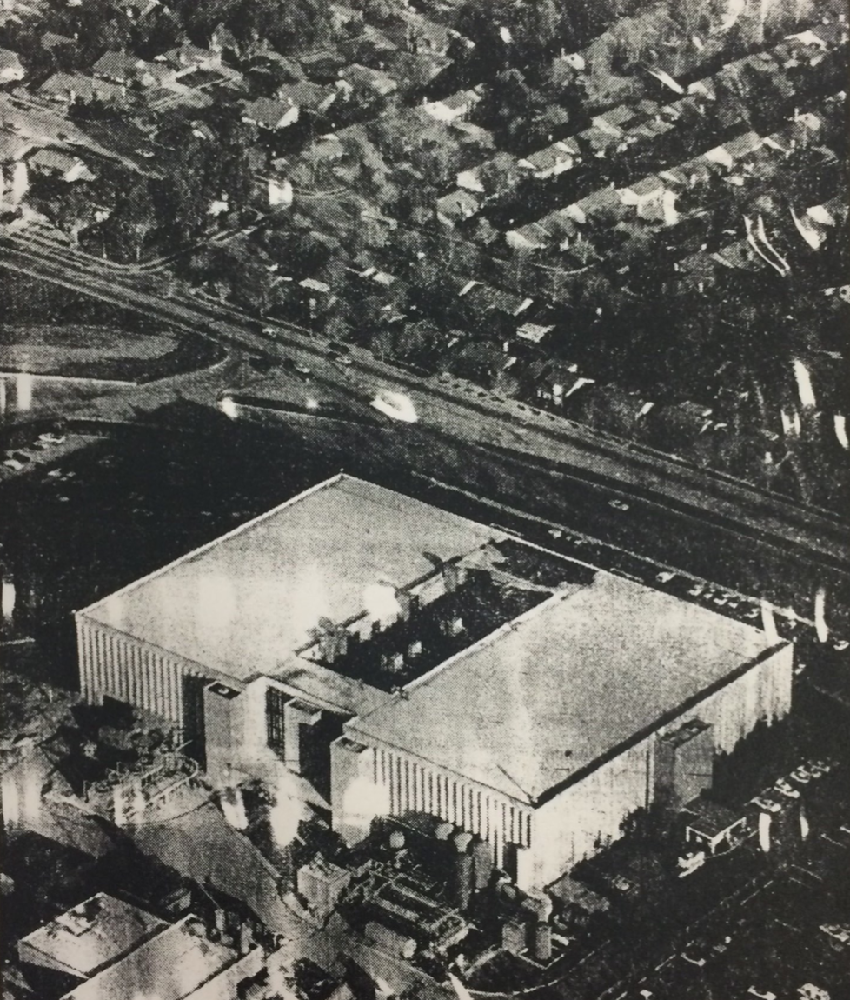

---
title: "Something in the Soil: Toxics, Health, and the Collapse of Clean Industry"
author:
- Jason A. Heppler
...

> We thought we were living with a clean industry.
>
> ---Lorraine Ross, San Jose^[Newspaper clipping, "Silicon Valley's Fear Over Tainted
> Water," *San Francisco Chronicle*, May 16, 1983, Carton 20, Folder 12
> Hazardous Waste, California Tomorrow Records, MS 3641, California Historical
> Society.]

> "The horizon above San Jose is unmarred by smokestacks, and people here are
> proud of that. They have worked hard at making the valley a base of the
> computer-electronics industry and an unpolluted place to live."
>
> ---San Francisco Bay Regional Quality Control Board^[@pellowpark2002dreams,
> 72.]

> I remember thinking about smokestacks in other industries. I didn't expect
> this problem in my own backyard. . . . When I first became Mayor and we
> embarked on an economic development program, there was no doubt in my mind
> that this was a clean industry. We now know that we are definitely in the
> midst of a chemical revolution.
>
> ---Janet Gray Hayes, Mayor, San Jose^[@pellowpark2002dreams, 76.]

> It has become obvious that the absence of smokestacks does not mean an
> absence of environmental problems.
>
> ---Judith Ayres, EPA Regional Administrator^[EPA Journal 1984: 14.]

It was early in December when construction workers sank their backhoe into the 
earth, making way in the dirt for a second industrial solvents storage tank 
for Fairchild Semiconductor. Digging near an existing storage tank, the 
workers noticed something about the soil that did not seem right: the normally 
deep brown of the soil had taken on a rust-colored hue. They dug deeper and 
discovered that the bottom of the old storage tank was leaking. The 
above-ground gauge that measured the volume of liquid in the tank was faulty, 
and the system normally monitored incoming chemicals had not been routinely 
checked. Concerned about the size of the leak, the construction crew reported 
their finding to the Great Oakes Water Company, which operated wells nearby 
that serviced several thousand residents. The water company closed the wells 
immediately, but on advice from the state health department, neither Great 
Oakes nor Fairchild Semiconductor notified the public until after fifty days 
(above the legally-required thirty-nine days).

Tests confirmed that an industrial solvent containing 1,1,1 trichloroethane
(TCA) had leaked from the tank and concentrated in the wells at nearly twenty
times the permissible limit established by the Environmental Protection
Agency.^[Newspaper clipping, "Water contaminated by leak," *San Jose Mercury*,
January 20, 1982, Folder 2, Box 11, Silicon Valley Toxics Coalition Records,
San Jose State University Special Collections.]

\thoughtbreak{Julianna Ross was only two months old} when she had her first
open-heart surgery. When her mother, Lorraine, opened the pages of the *San
Jose Mercury* on January 20, she saw the news: Fairchild Semiconductor, just a
quarter mile from her home, had had an environmental catastrope. Suddenly the
neighborhood stories and problems all made sense. Neighbors had complained
about the water tasting and smelling funny, but what could not be ignored were
the four children with birth defects, the two miscarriages, and the one
stillbirth that had taken place on Lorraine's block in the past three years.
And her youngest child, nine months old at the time, faced multiple congenital
heart defects.^[Newspaper clipping, "Water contaminated by leak," *San Jose
Mercury*, January 20, 1982, Folder 2, Box 11, Silicon Valley Toxics Coalition
Records, San Jose State University Special Collections; newspaper clipping,
"Silicon Valley's Fear Over Tainted Water," *San Francisco Chronicle*, May 16,
1983, Carton 20, Folder 12 Hazardous Waste, California Tomorrow Records, MS
3641, California Historical Society.]

News of Fairchild's chemical leak burst onto the scene in early 1982, and 
parents whose children had experienced health problems wondered about a 
possible link. Who, Lorraine and her neighbors asked, permitted Fairchild 
to store toxic chemicals just feet away from public wells? Who decided what 
trace elements found in the water was safe for human consumption? Why had 
Fairchild and Great Oakes taken so long to inform the public about the TCA 
contamination?

The chemicals, Lorraine and her neighbors discovered, went unregulated. No
official requirements were in place for Fairchild to frequently check its
storage tanks. The public was unaware of the sorts of chemicals used by
Fairchild and other high tech manufacturers, and news of the problem only
broke when construction workers discovered there was a problem. Investigations
revealed that the problem was even more widespread. At least an additional 36
leaks had occurred throughout the Bay Area, including a tetrachloroethylene
(TCE) leak near an Intel plant that had not used the chemical since 1977.

The Bay Area's contaminated soil and water led to perhaps the most significant
shift in environmental thought. Although many of the other leaks did not
threaten drinking water supplies, the widespread presence of toxic leaks
concerned many residents in the Valley. For the first time, residents
confronted the reality of Silicon Valley's dependence on chemicals---that the
promise of "clean" industry was not so clean after all. Stories about the
toxic leaks, a chemical explosion at Lockheed that forced the evacuation of
400 people from Palo Alto, the stories of workers exposed to chemicals that
caused hair loss, respiratory problems, skin infections, and worse. Valley
residents came to see the landscape as tainted. "I'm not anti-semiconductor
industry," Lorraine Ross noted, "but I don't want my health adversely affected
by their profit-making. Companies should be willing to invest a portion of
their profit to ensure they aren't damaging the environment." Studies in 1992
reported that 57 private and 47 public drinking wells were contaminated, and
66 plots of land were too toxic for people to walk on. County authorities
determined that sixty-five of the seventy-nine companies they
investigated---including IBM, Hewlett-Packard, Raytheon, NEC, AMD, Signetics,
and many others---had contaminated the soil beneath their plants. The federal
government eventually declared twenty-nine Superfund sites---more than any
other county in the nation---twenty-four of which resulted from electronics
firms.^[@pellowpark2002dreams, 75-76.]

The presence of synthetic and industrial contaminates was a revelation to 
Valley suburbanites. Earlier, cities had dealt with the problem of human waste 
as public health officials learned how to manage the problem of waste. Even in 
San Jose, the city had learned to deal with its problem of sewage and cannery 
effluence. But now cities of the Bay Area were on the front lines of 
widespread contamination by high tech toxics.

The widespread presence of the pollutants along the Peninsula resulted as a
consequence of the Bay Area's lack of residential and industrial urban
planning. Because cities thought little about the layout of their environs,
industrial facilities and warehouses frequently turned up alongside
residential developments rather than isolated from the places where people
lived. The natural boundaries of the Peninsula---the Santa Cruz range to the
west and the bay to the east---kept suburban areas and industry in close
proximity to one another. The emerging crisis broadened the coalescing
environmental movement, even among those who never considered themselves
environmentalists. The daily lived experiences of the Bay Area's suburbanites
expected clean tap water and believed that the industries near their
communities were clean and green. The toxic landscape shattered that
perception.

## Murky Waters: The Social Context of Postwar Pollution

World War II had transformed the Bay Area's watershed landscape. The two major 
rivers, the Guadalupe River and the Coyote Creek, and its tributaries were 
only the most visible signs of the Bay Area's water landscape. But the focus 
of many turned to the hidden water---that trapped between layers of clay and 
gravel beneath the surface of the cities. 

Flooding confounded those who wanted borders between the physical and the 
social. The heavy winter storm in 1955 washed through Alviso, Santa Clara, and 
San Jose, causing extensive damage. Asphalt, concrete, and soil compaction 
only worsened runoff and amplified the problem of flooding. City and county 
planners turned to technology to tame the floods, looking primarily to the 
Army Corps of Engineers to fund new channels and dikes that would funnel water 
safely into the Bay. Technology, they hoped, could tame nature.

To city boosters the problem lay with the rivers themselves, not the dramatic 
changes that occurred on the lands around the rivers. The solution to the 
river's inadequacies could be solved by engineering. Although floodplains had 
always been a frequent presence in the flatlands of the Valley, city boosters 
and Army Corps engineers saw the rivers as reformers saw them in the early 
1900s---channels for moving floodwaters away from cities. But the old river 
had changed. 

## Fairchild or My Child?

## The Tap Water Rebellion

While city elites continued to rely on technology to save nature, a vocal and 
persistent group of activists used the contamination of water to argue that 
industry and urban growth threatened social stability, environmental quality, 
and bodily health. What historian Carl Abbott has called "neo-Progressives," 
these activists mirrored other critiques around the urban West in the postwar 
decades.^[@abbott1995frontier, 39.] They located in the region's 
environmental, social, and economic problems the lack of structures present to 
protect city's environs. A new coalition of housewives, laborers, 
environmental activists, layers, doctors, businesspeople, and minorities 
challenged the notion that high tech industry was "clean" industry and came to 
dominate the political discussion.

Ted Smith, a young San Jose attorney, led the way in building bridges between 
these groups. Smith's involvement in environmental issues were personal as 
well as professional. In the late 1960s, Smith worked in Washington, D.C., 
under President Lyndon Johnson's anti-poverty VISTA program before moving to 
the Bay Area to earn a law degree from Stanford and start his own practice in 
1973.^[@mahon1985chargedbodies, 252.] His experiences in VISTA and 
participation in demonstrations in D.C. deeply shaped Smith's attitudes. "I 
think things were so intense then," he recalled, "that I just haven't been 
able to put it out of my soul."^[@mahon1985chargedbodies, 261.] Smith began 
his law practice as a labor lawyer, but found himself drawn more and more to 
the Bay Area's electronic industry through industrial workers. His conviction 
that industry and destroyed nature in the Bay Area was formed in the crucible 
of labor rights. The number of clients coming to him with disabling injuries, 
illnesses, and diseases sparked his interest in the industry and the heavy 
reliance on chemicals in the manufacture of electronics. To Smith, workers 
conditions and environmental concerns went hand-in-hand and the discovery of 
the Fairchild leak provided him with an opportunity to tie the two 
together.^[Ted Smith, oral history, interview by Glenna Matthews, San Jose 
State University; @mahon1985chargedbodies, 252--253.]

What gave Smith and others a push to organize more formally was a proposal by 
the Santa Clara County Fire Chiefs' Association (SCCFCA) to set forth 
regulations regarding the storage and reporting of leaks.^[Ted Smith, oral 
history, 16; @mahon1985chargedbodies, 254.] Firefighters were first responders 
to chemical spills and leaks, and the Fire Chiefs' Association wanted to 
ensure that firefighters knew what they would be dealing with if they arrived 
at the scene. Along with a coalition of businesses and trade groups, they 
formed an organization called the Industry Environmental Coordinating 
Committee in the spring of 1982 to codify the Hazardous Materials Model Code 
to the San Jose city council. The ordinance aimed to set county-wide standards 
for the storage and handling of toxic or flammable chemicals.^[Clipping, 
"Group fights for toxic-waste ordinance," *Peninsula Times Tribune*, November 
4, 1982, Folder 2, Box 10, Silicon Valley Toxics Coalition Records, San Jose 
State University.] 

The issue of toxics and chemical storage became greater cause for concern over 
the course of the summer. In June, an explosion at IBM's South San Jose plant 
from improperly stored aluminum waste injured eighteen people. Additional 
investigations found as many as {NUM} leaks throughout the San Francisco 
Peninsula, stretching from South San Jose to Palo Alto. In {DATE} 
Hewlett-Packard reported that a chemical storage tank had leaked since {YEAR} 
at their Palo Alto headquarters.  IBM reported leaks at {AMT} of their 
facilities, dating back to {YEAR}. Moffett Airfield's chemical storage leaked 
{WHAT} into the soil since {YEAR}. Almost no part of the landscape, it 
seemed, remained untouched by industry.^["Anti-spill measures still pend," 
*San Jose Mercury*, July 24, 1982, Folder 5, Box 10, SVTC Records, SJSU; map 
of spills and chemical leaks produced by Citizens for a Better Environment, 
Folder 4, Box 10, SVTC Records, SJSU.]

Keeping the public educated and forming an organization that could act as the 
voice for constituents became Smith's first priority. In front of the San Jose 
city hall on November 4, 1982, the Silicon Valley Toxics Coalition was born. 
Smith's immediate goal for the organization was to pass the model toxic wastes 
ordinance developed by the SCCFCA while simultaneously becoming a key voice in 
the debate over chemicals in the Bay Area.^["Group fights for toxic-waste 
ordinance," *Peninsula Times Tribune*, November 4, 1982, Folder 2, Box 10, 
SVTC Records, SJSU.] The mythos surrounding "clean" industry had collapsed. 
"They still promoted themselves as clean industry," Smith recalled. "So this 
was shocking news to people here."^[Smith oral history, 17.]

In July 1983, Democratic state senator Byron Sher of Mountain View proposed 
Assembly Bill 1362 to the State Legislature that sought to force industries to 
meet specific requirements for the storage of chemicals, require permits and 
regular inspections of storage tanks, and require the reporting of leaks 
within twenty-four hours of their discovery. The bill received widepsread 
support from the Sierra CLub, Federated Firefighters of California, SVTC, CBE, 
Health Officers Organization of California, and the California League of 
Cities.^["Why We Need AB 1362," Silicon Valley Toxics Coalition mailer, July 
25, 1983, Folder 2, Box 10, SVTC Records, SJSU.] 

# Outline

1. Introduction
2. Founding SVTC
3. Neighborhood Response
4. Concern about Chemicals
  - The shift begins to happen here from aesthetic/conservation concerns to 
  health and justice concerns. Not necessarily a shift among all 
  environmentalists, but certainly a new phase of environmentalism.
5. 

