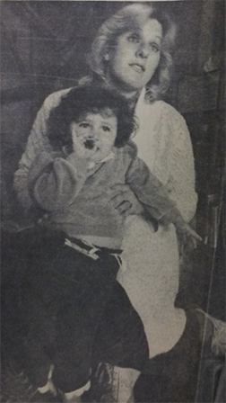
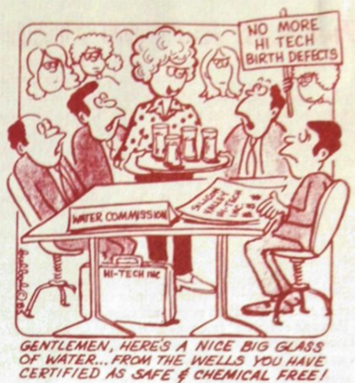

---
author:
- 'Jason A. Heppler'
title: "Something in the Soil: Toxics, Bodies, and the Spatial History of Health"
...

> We thought we were living with a clean industry.
>
> ---Lorraine Ross, San Jose^[Newspaper clipping, "Silicon Valley's Fear
> Over Tainted Water," *San Francisco Chronicle*, May 16, 1983, Carton 20,
> Folder 12 Hazardous Waste, California Tomorrow Records, MS 3641,
> California Historical Society.]

> The horizon above San Jose is unmarred by smokestacks, and people here
> are proud of that. They have worked hard at making the valley a base
> of the computer-electronics industry and an unpolluted place to live.
>
> ---San Francisco Bay Regional Quality Control Board^[@pellowpark2002dreams,
> 72.]

> When I first became Mayor and we embarked on an economic development
> program, there was no doubt in my mind that this was a clean industry.
> We now know that we are definitely in the midst of a chemical
> revolution.
>
> ---Janet Gray Hayes, Mayor, San Jose^["Leaking Chemicals in
> California's Silicon Valley Alarms Neighbors," *New York Times*, May
> 20, 1982.]

> It has become obvious that the absence of smokestacks does not mean an
> absence of environmental problems.
>
> ---Judith Ayres, EPA Regional Administrator^[*EPA Journal* 1984: 14.]

Construction workers sunk their backhoe into the earth in an early
November morning, making way in the soil for a second underground
industrial solvents storage tank for Fairchild Semiconductor. Digging
near an existing storage tank, the workers noticed something about the
soil that did not seem right: the soil seemed exceptionally wet and had
taken on a rust-colored hue. Digging deeper they discovered a leak in
the bottom of the existing storage tank. The leak went undiscovered when
the above-ground gauge that measured the volume of liquid in the tank
failed, and the system normally monitoring incoming chemicals had not
been routinely checked. Concerned about the size of the leak, the
construction crew reported their finding to Fairchild and the Great
Oakes Water Company, which operated drinking water wells nearby that
serviced several thousand residents. The water company closed the wells
immediately. Tests confirmed that an industrial solvent containing the
carcinogen 1,1,1 trichloroethane (TCA) had leaked from the tank and
concentrated in the wells at nearly twenty times the permissible limit
established by the Environmental Protection Agency. Nearly 60,000
gallons of toxic chemicals had leaked from the tank for at least two
years.^[Newspaper clipping, "Water contaminated by leak," *San Jose
Mercury*, January 20, 1982, Folder 2, Box 11, Silicon Valley Toxics
Coalition Records, San Jose State University Special Collections; "Get
Tough Now to Avoid Spills," Gilroy Dispatch, July 1, 1983; Peter Murphy,
"Great Oaks Water Company Distribution Study," draft report, Folder 1,
Box 11, SVTC, SJSU.]

\thoughtbreak{Juliana Ross was only nine months old in 1982} when she
had her first open-heart surgery. When her mother, Lorraine, opened the
pages of the *San Jose Mercury News* on January 20, she saw the news:
Fairchild Semiconductor, just a quarter mile from her home, had had an
environmental catastrophe. Suddenly, the neighborhood stories and
problems all made sense. Her neighbors had complained about the water
tasting and smelling funny, but worse were the four children with birth
defects, the two miscarriages, and the one stillbirth that had taken
place on Lorraine's block in the past three years. And her youngest
child, nine months old at the time, faced multiple congenital heart
defects.  Lorraine Ross could not help but wonder if the leak and the
health problems were connected.^[Newspaper clipping, "Water contaminated
by leak," *San Jose Mercury*, January 20, 1982, Folder 2, Box 11, Silicon
Valley Toxics Coalition Records, San Jose State University Special
Collections; newspaper clipping, "Silicon Valley's Fear Over Tainted
Water," San Francisco Chronicle, May 16, 1983, Carton 20, Folder 12
Hazardous Waste, California Tomorrow Records, MS 3641, California
Historical Society; "Birth defects and chemicals," *San Jose Mercury*,
February 3, 1982, SVTC Records, SJSU.]

News of Fairchild's chemical leak burst onto the scene in early 1982,
and parents whose children had experienced health problems wondered
about a possible link. Who, Lorraine and her neighbors asked, permitted
Fairchild to store toxic chemicals just feet away from public wells? Who
decided what trace elements found in the water was safe for human
consumption? Why had Fairchild and Great Oaks taken so long to inform
the public about the TCA contamination? The chemicals, Lorraine and her
neighbors discovered, went unregulated. No official requirements were in
place for Fairchild to frequently check its storage tanks. The public
was unaware of the sorts of chemicals used by Fairchild and other high
tech manufacturers, and news of the problem only broke when construction
workers discovered there was a problem. Investigations revealed that the
problem was even more widespread. At least an additional 36 leaks had
occurred throughout the Bay Area, including a tetrachloroethylene (TCE)
leak near an Intel plant that had not used the chemical since 1977.

The Bay Area's contaminated soil and water led to a significant shift in
environmental thought. Although many of the other leaks did not threaten
drinking water supplies, the widespread presence of toxic leaks
concerned many residents in the Valley. For the first time, residents
confronted the reality of Silicon Valley's dependence on
chemicals---that the promise of "clean" industry was not so clean after
all. Stories about the toxic leaks, a chemical explosion at Lockheed
that forced the evacuation of 400 people from Palo Alto, the stories of
workers exposed to chemicals that caused hair loss, respiratory
problems, skin infections, and worse. Valley residents came to see the
landscape as tainted. "I'm not anti-semiconductor industry," Lorraine
Ross noted, "but I don't want my health adversely affected by their
profit-making. Companies should be willing to invest a portion of their
profit to ensure they aren't damaging the environment."^[Susan Benner,
“Storm Clouds Over Silicon Valley,” *Inc* (September 1982), 84.] Studies in 1992
reported that 57 private and 47 public drinking wells were contaminated,
and 66 plots of land were too toxic for people to walk on. County
authorities determined that sixty-five of the seventy-nine companies
they investigated---including IBM, Hewlett-Packard, Raytheon, NEC, AMD,
Signetics, and many others---had contaminated the soil beneath their
plants. The federal government eventually declared twenty-nine Superfund
sites---more than any other county in the nation---twenty-four of which
resulted from electronics firms.^[@pellowpark2002dreams, 75--76.]
Furthermore, phrases like *doxins* and *TCA* entered the public
vocabulary and, increasingly concerned with environmental threats to the
human body, drove many to become environmental activists.

The presence of synthetic and industrial contaminates was a revelation
to Valley suburbanites. In earlier decades, cities had dealt with the
problem of human waste as public health officials learned how to manage
the problem. Experts placed their faith in public health strategies that
asserted definition and control over health threats. Even in San Jose,
the city had learned to deal with its unique problem of sewage and cannery
effluence though an efficient sewer system that could handle massive
volumes of detritus. But now cities of the Bay Area were on the front
lines of widespread contamination by high tech toxics, a situation the
region was unaware and unprepared to confront. Concerns over health
transformed thinking about the regional landscape and introduced a new
spatial thinking about human health.

The proximity of pollutants near suburban areas along the Peninsula
resulted as a consequence of the Bay Area's lack of residential and
industrial urban planning. Because Bay Area cities thought little about
the layout of their environs, industrial facilities and warehouses
frequently turned up alongside residential developments rather than
isolated from the places where people lived. The natural boundaries of
the Peninsula---the Santa Cruz Mountains to the west and the San
Francisco Bay to the east---also kept suburban areas and industry in
close proximity to one another. They simply lacked the space to expand.
The emerging crisis broadened the coalescing environmental movement,
even among those who never considered themselves environmentalists. The
daily lived experiences of the Bay Area's suburbanites expected clean
tap water and believed that the industries near their communities were
clean and green. The toxic landscape shattered that perception.

### Murky Waters: Water Pollution in the Postwar Era

Concerns about drinking water were not new in 1982. In the early
1970s Congress began debate over new drinking water legislation. In
1972, the Environmental Protection Agency released a study of drinking
water supplies in New Orleans that found thirty-six organic chemicals
present, some of which were known carcinogens. An additional study of
New Orleans' contamination by the Environmental Defense Fund published
two years later showed a high incidence of cancer among people whose
primary source of drinking water came from the contaminated surface
waters. New Orleans' contaminated waters helped prompt the passage of
the Safe Drinking Water Act (SWDA) in 1974 that established quality
standards.^[@nash2006inescapable, 173. Water quality standards trace
themselves to the early twentieth century when the U.S. Public Health
Service adopted quality standards for drinking water regarding the
presence of *E. coli* used to combat the spread of typhoid.] The Safe
Drinking Water Act established "maximum contaminant levels" (MCLs) that,
in the words of historian Linda Nash, "assumed . .  . a level of
exposure below which no adverse health effects would occur in any place,
at any time."^[@nash2006inescapable, 173.] MCLs also assumed that all
relevant and possibly harmful contaminants were known to science,
although few laboratory tests existed for detecting presence of
organic chemicals.^[@nash2006inescapable, 174; @cox1997safewater.]

Post-World War II transformed the Bay Area's watershed landscape. The
two major rivers, the Guadalupe River and the Coyote Creek, and its
tributaries were only the most visible signs of the Bay Area's water
landscape. Both had been reshaped as urban areas expanded rapidly in the
postwar era, either through the river's physical re-routing in canals,
dams, and reservoirs, or from higher water levels pouring over their
banks from urban runoff. Drinking water was not on the minds of most
residents. Not until the 1980s would the focus turn to the
hidden water---that trapped between layers of clay and gravel beneath
the surface of the cities. Moreover, groundwater supplies were rarely
monitored by either the county or the state of California. And since
high tech industries maintained a perception as "clean" industry, few
thought or were aware that their activities were introducing chemical
contamination.^[@colten1991contamination.]

Throughout the United States, chemical contamination sites were
uncovered. In California's Central Valley, water quality officials
discovered the contamination of groundwater by
1,2-dibromo-3-choloropropane (DBCP), a compound used by farmers as a
pesticide. In New York, officials in Long Island discovered the
contamination of wells by the insecticide aldicarb. Further exacerbating
the problem was the sheer volume of new chemical compounds coming on to
the market. In the 1970s, roughly 500 new chemical compounds appeared on
the market each year. These chemicals had few standards and assessments
in place aside from certain previsions within the SWDA weakly enforced
by the EPA.^[@day2001safedrinking, 21--23.]. Compounds and chemicals
once thought to pose little environmental risk suddenly, with their
appearance in groundwater, revealed how widespread the contamination of
the country's drinking water supplies had become.^[@nash2006inescapable,
175--176.]

<!--
Flooding confounded those who wanted borders between the physical and
the social. The heavy winter storm in 1955 washed through Alviso, Santa
Clara, and San Jose, causing extensive damage. Asphalt, concrete, and
soil compaction only worsened runoff and amplified the problem of
flooding. City and county planners turned to technology to tame the
floods, looking primarily to the Army Corps of Engineers to fund new
channels and dikes that would funnel water safely into the Bay.
Technology, they hoped, could tame nature.

To city boosters the problem lay with the rivers themselves, not the
dramatic changes that occurred on the lands around the rivers. The
solution to the river's inadequacies could be solved by engineering.
Although floodplains had always been a frequent presence in the
flatlands of the Valley, city boosters and Army Corps engineers saw the
rivers as reformers saw them in the early 1900s---channels for moving
floodwaters away from cities. But the old river had changed.

California enacted state laws in the 1960s governing the regulation of
water.
-->

### "Fairchild or My Child?"

The Los Paseos neighborhood sparked what one newspaper called the "birth
of an eco-tragedy."^["Birth of an eco-tragedy" *Los Angeles Herald
Examiner*, February 10, 1982.] Along with the Fairchild leak, the nearby
International Business Machines facility announced the discovery of a
TCA leak shortly after the Fairchild leak was revealed. Studies would
later find that the IBM leak was among the worst in the South Bay,
contaminating twenty-five public and private wells.^[Peter Murphy,
"Great Oaks Water Distribution Study," 1988, 1, Folder 1, Box 11, SVTC
records, SJSU; Ted Smith oral history, Berkeley, 19; "Responsible action
needed in IBM's toxic waste cleanup," *San Jose Business Journal*, April
7, 1986, {FILL} Santa Clara County Center for Occupational Health
(SCCOSH) and Silicon Valley Toxics Coalition (SVTC) Records,
MSS-2007-04-06, San Jose State University Library Special Collections &
Archives.] To Lorraine Ross and her neighbors, the presence of chemicals
in the suburban neighborhood was as much a spatial experience as a
personal one. "It takes a lot of nerve for them to invade a pre-existing
residential neighborhood, pour dangerous chemicals into a leaking tank,
poison the surrounding environment and hide the fact from the people
affected by their negligence."^[Quoted in @pellowpark2002dreams, 74.]
Ross helped galvanize the community into political action, first
surveying her neighbors that turned up a list of seventy-two people who
reported birth defects and health problems.^[Lorraine Ross, "State Study
Confirms Birth Defect Cluster," *Silicon Valley Toxics News* (April
1985), 3; "San Jose Hearing Points Up Toxic Risks at Area Plants,"
*California AFL-CIO News*, February 11, 1983.] The problem seemed so
widespread to not be a coincidence. Ross presented the results of her
survey to city officials as evidence of a serious problem.^["Leaking
Chemicals in California's Silicon Valley Alarm Neighbors," *New York
Times*, May 20, 1982.]

Lorraine Ross had relocated her family south to the city of Gilroy by
1983, but she continued to be a vocal presence in the Bay Area's
anti-toxics campaign.^["Get tough now to avoid spills," *Gilroy
Dispatch*, August 1, 1983, Folder 5, Box 10, Santa Clara County Center
for Occupational Health (SCCOSH) and Silicon Valley Toxics Coalition
(SVTC) Records, MSS-2007-04-06, San Jose State University Library
Special Collections & SJSU Archives.] At her
new home in Gilroy, the presence of industry near suburban areas
continued to be a spatial experience and informed the political critique
of toxics. The disk manufacturer Dysan planned a facility at the Santa
Teresa Technology Park in Gilroy. Although not opposed to its
construction, Ross warned her new city that they could not "accept the
dictates of Realtors and developers when it comes to determining the
health of our families. You all have the right to talk loudly. It's
important that Gilroy plan ahead for industry."^["Get tough now to avoid
spills," *Gilroy Dispatch*, August 1, 1983, Folder 5, Box 10, {FILL}
Santa Clara County Center for Occupational Health (SCCOSH) and Silicon
Valley Toxics Coalition (SVTC) Records, MSS-2007-04-06, San Jose State
University Library Special Collections & Archives.] Communities had to insist on health.

<!--
In 1982, Lorraine Ross found herself becoming a community activist. She
began connecting with others in Los Paseos to determine if health
problems were a widespread problem. Surveying others in her
neighborhood, she turned up a list of seventy-two people who reported
health problems and birth defects.^[Lorraine Ross, "State Study Confirms
Birth Defect Cluster," *Silicon Valley Toxics News* (April 1985), 3;
"San Jose Hearing Points Up Toxic Risks at Area Plants," *California
AFL-CIO News*, February 11, 1983.] Along with the Fairchild leak,
International Business Machines in South San Jose, located near the
Fairchild facility, announced the discovery of a smaller leak in 1983 as
well, contaminating another Great Oaks well. ^[Peter Murphy, "Great Oaks
Water Distribution Study," 1988, 1, Folder 1, Box 11, SVTC records,
SJSU; Ted Smith oral history, Berkeley, 19.] The IBM leak contaminated
twenty-five public and private wells and had spread to be the largest
contamination problem in the valley.^["Responsible action needed in
IBM's toxic waste cleanup," *San Jose Business Journal*, April 7, 1986,
{FILL} Santa Clara County Center for Occupational Health (SCCOSH) and
Silicon Valley Toxics Coalition (SVTC) Records, MSS-2007-04-06, San Jose
State University Library Special Collections & SJSU Archives.] The widespread presence of leaks in San Jose
led to what one newspaper called the "birth of an eco-tragedy."^["Birth
of an eco-tragedy" *Los Angeles Herald Examiner*, February 10, 1982.]
-->

The core issue emerging in the anti-toxics campaign was whether
scientific evidence existed to support the claim that exposure to
industrial solvents caused the birth defects. The debate over
contamination and health originally coalesced around the lack of
scientific evidence to support the neighborhood's claim. Fairchild
maintained that the length of exposure to the chemicals were not long
enough to cause health effects. Basing their claim on the state standard
for TCA exposure, they argued that those standards were set with
long-term and high-level exposure as the baseline. Fairchild also
challenged the timeline of the chemical leak and its link to birth
defects. The company estimated that the leaks began 18 months before
they were discovered and took up to sixteen months to travel the 2,000
feet to the Great Oaks wells. The birth defects that began three years
prior, Fairchild argued, could not possibly be connected if their leak
started relatively recently and exposed people to such low levels of
TCA.^["Birth of an eco-tragedy," *Los Angeles Herald Examiner*, February
10, 1982.]

Residents were unsatisfied by industry's answers. The concentration of
birth defects in Los Paseos confirmed the presence of a problem, and
they linked the local environment as the most likely cause. Like other
parts of the Bay Area's environmental activism, women led the way in
prompting action by government officials. Mothers in Los
Paseos---Lorraine Ross, Mary Lou Lujan, Julie Bowman, and others---took
on the task of protecting their children and their community. They
developed their own theories as to what was going on in Los Paseos, and
focused their critique around female bodies and pregnancy. In their
view, the spatialized frequency of pregnancy problems were directly
related to the local landscape. Unconvinced by Fairchild's argument that
the level and length of exposure was too short, they instead insisted
that the only explanation lay with the chemical leak. Families in Los
Paseos, Lorraine Ross insisted, felt "like human guinea pigs whose
health is being tested by the 'high-tech' companies doing business in
our valley."^["We Demand Safe Water," SVTC mailer, n.d., Folder 4, Box
10, Santa Clara County Center for Occupational Health (SCCOSH) and
Silicon Valley Toxics Coalition (SVTC) Records, MSS-2007-04-06, San Jose
State University Library Special Collections & Archives.]

Under pressure by neighborhood activists, media interest, and political
fallout, the county agreed to study the potential for a link between
groundwater contamination and health problems that plagued Los Paseos in
1982. County health officials began by looking at birth certificate
and infant-death and fetal-death records to reveal the possibility of a
cluster of deaths or illnesses in the city. Their early report found "no
significant difference" between the neighborhood's birth disorder rate
and the county's birth disorder rate.^["Study of birth defects
continues," *San Jose Mercury News*, February 25, 1982, Folder 2, Box
11, Santa Clara County Center for Occupational Health (SCCOSH) and
Silicon Valley Toxics Coalition (SVTC) Records, MSS-2007-04-06, San Jose
State University Library Special Collections & Archives.] County water quality officials also initiated
an investigation into tapwater and wellwater throughout the county. In
the South Bay near Los Paseos, water sampling revealed trace levels of
TCA and DCE, but the amounts were below the state action level to shut
down the wells.^["Environmental News Fact Sheet: Status Report, South
Bay Tapwater Sampling Program," November 5, 1984, Folder 14, Box 12,
{FILL} Santa Clara County Center for Occupational Health (SCCOSH) and
Silicon Valley Toxics Coalition (SVTC) Records, MSS-2007-04-06, San Jose
State University Library Special Collections & Archives; "Proposed South Bay Sampling Event, October
9," Folder 14, Box 12, {FILL} Santa Clara County Center for Occupational
Health (SCCOSH) and Silicon Valley Toxics Coalition (SVTC) Records,
MSS-2007-04-06, San Jose State University Library Special Collections & Archives.]

In addition to the birth certificate survey, county health officials
formed the Santa Clara County Health Advisory Committee on Environmental
Teratology and agreed in the spring of 1982 that enough evidence existed
for a formal investigation. The county turned to epidemiology to study
the spatial pattern of disease in San Jose. Epidemiology's disciplinary
history roots itself in studies of space, to understand whether diseases
had a spatial component that could explain health issues in landscapes.
The goal of the county's study sought to determine if lifestyle or
environmental features affected the health of the Los Paseos community
as compared to demographically-similar communities without any known
contamination. The study was released in 1985 with no conclusive
evidence to support the claims of neighborhood activists. The study
reached two key conclusions: the neighborhood of Los Paseos experienced
higher rates of miscarriages and a threefold increase in total birth
defects compared to nearby communities that had no known water
contamination, and the community experienced a two-and-a-half times
higher rate of major heart defects compared to the rest of the county.
The study, however, made no causal link between the contamination and
the high presence of birth defects, citing the lack of water monitoring
prior to 1981 that could provide potential data on a link between health
effects and contaminated water.^["State Health Department Releases
Fairchild Studies," Department of Health Services *News News*, January
16, 1985, 1, Folder 8, Box 12, Santa Clara County Center for
Occupational Health (SCCOSH) and Silicon Valley Toxics Coalition (SVTC)
Records, MSS-2007-04-06, San Jose State University Library Special
Collections & Archives.]

The study did little to stem public concern and only served to
strengthen the resolve of the anti-toxic activists, who used the
conclusion to continue to point out the presence of an adverse health
cluster in San Jose.^[Lorraine Ross, "State Study Confirms Birth Defect
Cluster," *Silicon Valley Toxics News* (April 1985): 3, Folder 3, Box
18, Santa Clara County Center for Occupational Health (SCCOSH) and
Silicon Valley Toxics Coalition (SVTC) Records, MSS-2007-04-06, San Jose
State University Library Special Collections & Archives.] But the widespread presence of toxic
contamination throughout the Bay Area and other parts of California gave
political energy to the state legislature. In 1986, the state
legislature overwhelmingly supported the passage of Proposition 65, the
Safe Drinking Water and Toxic Exposure Act. Prop 65 made it illegal for
businesses to knowingly pollute drinking water with known cancer-causing
chemicals and required the immediate notification of the public to any
potential exposure to toxic chemicals.

<!--
Activity by the Los Paseos community followed a legal route as well. In
1983 several Los Paseos families filed suit against Fairchild
Semiconductor, IBM, and the Great Oaks Water Company. The case
eventually settled in 1986 for an undisclosed amount of money for the
530 residents involved with the suit. The companies paid a
multimillion-dollar settlement, an amount, resident's attorney John
Tyndall explained, that was "far more of a significant settlement in
terms of what the people are actually getting" than the Love Canal
lawsuit in New York.^["Pact reached in tainted-water dispute," *San Jose
Mercury News*, July 4, 1986, Folder 8, Box 12, Santa Clara County Center
for Occupational Health (SCCOSH) and Silicon Valley Toxics Coalition
(SVTC) Records, MSS-2007-04-06, San Jose State University Library
Special Collections & Archives.]
-->

Industry faced another potent challenge to their "clean" image: the
neighborhood of Love Canal in New York. Like the toxic spill in San
Jose, the neighborhood of Love Canal in Niagara Falls galvanized
community activists in 1978 after decades of chemical dumping by Hooker
Chemical led to widespread health effects in the community. The company
had buried nearly 21,000 tons of chemical waste at the site, and the
area became such a concern that the federal government relocated 800
families. The disaster at Love Canal led to Congress passing the
Comprehensive Environmental Response, Compensation, and Liability Act
(CERCLA), or Superfund Act.^[@gottleib2005forcing, 246--248;
@rothman2000saving, 192--195.] In the Bay Area, activists pointed to
Love Canal as the potential future for Silicon Valley. The Santa Clara
County Labor Council's business manager, Peter Cervantes-Gautschi,
observed that "we want to prevent San Jose from being transformed into
another Love Canal."^["Big Turnout Urged in San Jose to Curb Toxic
Contamination," *California AFL-CIO News*, January 28, 1983, Folder 5,
Box 10, Santa Clara County Center for Occupational Health (SCCOSH) and
Silicon Valley Toxics Coalition (SVTC) Records, MSS-2007-04-06, San Jose
State University Library Special Collections & Archives. See also "Labor in lead on toxic controls,"
*Santa Clara County Labor*, February 11, 1983, Folder 5, Box 10, SVTC
records, SJSU.] These concerns reflected a new environmentalism in
California, one still grounded locally but concerned about issues beyond
the flora and fauna of the region that remained the bailiwick of other
Bay Area conservation movements. The Bay Area had become, as Hal Rothman
once phrased it, a symbol of "the toxicity of
progress."^[@rothman2000saving, 195.] What made the contamination even
more insidious was its apparent invisibility. At Love Canal, toxic
wastes oozed to the surface, fires spontaneously ignited during summers,
children tossed chunks of phosphorus against the ground causing white
sparks, and the odor was ever-persistent.^[@rothman2000saving, 192.] In
Santa Clara County, there were no visible signs of the toxic landscape.

<!--
The State Regional Water Quality Control Board decided not to indict IBM
in its contamination, a move that outraged anti-toxics
environmentalists.
-->

Anticipating the spread of chemicals in the Valley proved difficult due
to the region's history. Humans had altered the land in significant ways
that affected the aquifers. One of those ways was the burying of the built
environment. During new construction, many agricultural pipes used for
carrying water through fields or pumping groundwater to the surface were
buried. As one study found, these pipes allowed contaminated water to
more easily travel through the clay and gravel strata:

> It is estimated that there are about ten thousand well pipes in the
> Valley which extend from the surface to a depth of 30 to 150 feet into
> the ground.  These were well pipes for agricultural uses on the farms.
> When the factories were built throughout Silicon Valley, most of these
> well pipes were simply buried. No one knows any longer where the
> majority of these well pipes are located. After careful searches
> through the records of the water authorities and other governmental
> agencies, about three thousand old well pipes were located. The
> unidentified pipes which remain puncture the clay strata and permit
> chemically contaminated ground water to seep into the underground
> water supplies, whereby toxic substances are distributed far and
> wide.^[Quoted in @pellowpark2002dreams, 78. The EPA also suspected
> that abandoned or improperly constructed wells allowed contaminants to
> reach deep aquifers by giving contaminated water a conduit to travel
> deeper into the ground. See "EPA Superfund Factsheet," 1, Folder 3, Box
> 11, Santa Clara County Center for Occupational Health (SCCOSH) and
> Silicon Valley Toxics Coalition (SVTC) Records, MSS-2007-04-06, San
> Jose State University Library Special Collections & Archives.]

\noindent Like the built environment above, the underground
complex of aquifers reflected the relationship between natural and human
history. The location and movement of contamination changed not only due
to the geological features of the aquifers but human history that had
altered the hydrological features of the Valley.

The lack of monitoring and regulation meant that no evidence of danger
was detected by county or state water quality officials. By the early
1980s high tech continued to enjoy a reputation as a clean industry
unmarred by the smokestacks---an aesthetic concern for Bay Area
residents---or agricultural runoff problems that characterized other
parts of California and the country's industrial centers. Like the
Central Valley's contamination issues, human health was the only
barometer to detect problems.^[@nash2006inescapable, 181.] Yet by
mid-1982, the problem was undeniable. Reports that California companies
had discharged nearly 1.4 million tons of hazardous wastes in a single
year spurred local and regional government to act.^["The industries
creating the most waste," *Sacramento Union*, April 18, 1982, Folder 8,
Box 12, Santa Clara County Center for Occupational Health (SCCOSH) and
Silicon Valley Toxics Coalition (SVTC) Records, MSS-2007-04-06, San Jose
State University Library Special Collections & Archives.] The connection between environment and
bodily health focused itself in the Los Paseos neighborhood and would
ripple throughout the country.

<!-- ### The Tap Water Rebellion -->

\thoughtbreak{Lorraine Ross continued to work with her neighbors} and
document evidence, serving as part of a vocal and persistent group of
activists that used the contamination of water to argue that industry
and urban growth threatened social stability, environmental quality, and
the health of residents. They located in the region's environmental,
social, and economic problems the lack of structures present to protect
city's environs. A coalition of housewives, laborers, environmental
activists, layers, doctors, businesspeople, and minorities challenged
the notion that high tech industry was "clean" industry and came to
dominate the political discussion of industry's value to the Bay Area.
Significantly, the political discussion of the environment began to
shift. The previous decades of environmentalists and conservationists in
the Bay Area focused on the health of nature, a point of contention that
emerged among the justice-oriented activists of the 1980s. During
the decade, a new environmental critique emerged focusing on
environmental justice and the health of humans.

Ted Smith, a young San Jose attorney, led the way in building bridges
between these groups. Smith's involvement in environmental issues were
personal as well as professional. A New Yorker by birth, Smith moved to
Washington, D.C., in the late 1960s, where he worked under President
Lyndon Johnson's anti-poverty VISTA program for two years before moving
to the Bay Area to earn a law degree from Stanford and start his own San
Jose practice in 1973.^[@mahon1985chargedbodies, 252.] His experiences
in VISTA and witnessing riots and demonstrations in the Capitol deeply
shaped Smith's attitudes towards social justice. "I think things were so
intense then," he recalled, "that I just haven't been able to put it out
of my soul."^[@mahon1985chargedbodies, 261.] Smith's upbringing exposed
him to activism and social justice. His mother was a social activist,
involved with the League of Women Voters, the YWCA, and the World Youth
Convention. "I think some of her experiences and sensibilities were
passed on," he recalled.^[Ted Smith oral history, Berkeley, 2.]
Environmental issues were not part of Smith's early political activism
as he directed his energy into the civil rights and peace movements. But
his work on those issues shaped his later thinking about environmental
politics and early legal career.^[Ted Smith, oral history, Berkeley,
4--6.] Smith began his law practice as a labor lawyer representing
cannery workers facing racial discrimination and injuries on the job,
but found himself drawn more and more to the Bay Area's electronic
industry through his representation of industrial workers.  His
conviction that industry had destroyed nature in the Bay Area was formed
in the crucible of labor rights. Through his wife, Amanda Hawes, a legal
services attorney and founder of the Project on Health and Safety in
Electronics (PHASE), Smith began to connect with clients injured by
chemical exposure inside electronics manufacturing facilities. "The
electronics industry," Smith observed, "was actually a chemical-handling
industry."^[Ted Smith, oral history, Berkeley, 13.] The number of
clients coming to him with disabling injuries, illnesses, and diseases
sparked his interest in the industry and the heavy reliance on chemicals
in the manufacture of electronics. Smith believed working conditions and
environmental concerns went hand-in-hand, and the discovery of the
Fairchild leak provided him with an opportunity to tie the two together
and raise awareness on both issues.^[Ted Smith, oral history, interview
by Glenna Matthews, San Jose State University; @mahon1985chargedbodies,
252--253; "Ted Smith: Foes Think He's Anti-Business, but Fans Say He's
Earth's Advocate," *The Business Journal Magazine*, October 15, 1990,
12, in Folder 3, Box 18, Santa Clara Center for Occupational Health
(SCCOSH) and Silicon Valley Toxics Coalition (SVTC) Records,
MSS-2007--04--06, San Jose State University Library Special Collections
& Archives; Smith oral history, Berkeley, 14.]

The issue of toxics and chemical storage continued to gain attention
over the course of 1982. In June, an explosion at IBM's South San Jose
plant from improperly stored aluminum waste injured eighteen people. The
chip manufacturer also reported a leak at the same facility that dated
back to 1972. Hewlett-Packard reported five chemical leaks dating back
at least two years at their Palo Alto headquarters. Moffett Airfield's
became one of the worst contamination areas, with nineteen different
sites on the naval air base eventually identified as toxic spills. One
study by the Santa Clara Regional Water Quality Control Board (RWQCB)
found that 85% of the test wells they dug tested positive for water
contamination by industrial solvents. Reports of leaks and spills became
so common that the *San Jose Mercury News* editorialized in February
1982 that "if the present pattern continues, this newspaper might have
to stop printing a separate story about each Silicon Valley hazardous
chemical leak and just run a daily box score in agate type." Almost no
part of the landscape, it seemed, remained untouched by
industry.^["Anti-spill measures still pend," *San Jose Mercury*, July
24, 1982, Folder 5, Box 10, Santa Clara Center for Occupational Health
(SCCOSH) and Silicon Valley Toxics Coalition (SVTC) Records,
MSS-2007--04--06, San Jose State University Library Special Collections
& Archives; map of spills and chemical leaks produced by Citizens for a
Better Environment, Folder 4, Box 10, Santa Clara Center for
Occupational Health (SCCOSH) and Silicon Valley Toxics Coalition (SVTC)
Records, MSS-2007--04--06, San Jose State University Library Special
Collections & Archives; "Industrial chemicals in Palo Alto," *Palo Alto
Weekly*, November 3, 1982, Folder 5, Box 10, Santa Clara Center for
Occupational Health (SCCOSH) and Silicon Valley Toxics Coalition (SVTC)
Records, MSS-2007--04--06, San Jose State University Library Special
Collections & Archives; "We Demand Safe Water," SVTC mailer, n.d.,
Folder 4, Box 10, Santa Clara Center for Occupational Health (SCCOSH)
and Silicon Valley Toxics Coalition (SVTC) Records, MSS-2007--04--06,
San Jose State University Library Special Collections & Archives; "How
safe is our drinking water?" *San Jose Mercury News*, February 27, 1982,
Folder 2, Box 11, Santa Clara Center for Occupational Health (SCCOSH)
and Silicon Valley Toxics Coalition (SVTC) Records, MSS-2007--04--06,
San Jose State University Library Special Collections & Archives.]

Keeping the public educated and maintaining a public voice for those
affected by industrial contamination and chemical exposure became
Smith's first priority. In front of the San Jose city hall on November
4, 1982, the Silicon Valley Toxics Coalition (SVTC) announced its
establishment. In a letter circulated to community organizations and individuals, SVTC explained its purpose:

> ...we believe now is the time to pull together a coalition to further
> organize around these issues. In recent discussions with
> representatives from labor, health, environmental and community
> organizations and groups, it has been clear that such a coalition is
> not only *essential* but it is *feasible* to get off the ground in the
> immediate future. . . . We proposed the name SILICON VALLEY TOXICS
> COALITION, the long-term goal of which would be to maintain our
> communities and workplaces free from toxic contamination.^["High Tech
> and Toxics: A Guide for Local Communities" photocopy excerpts, Folder
> 2, Box 18, Santa Clara County Center for Occupational Health (SCCOSH)
> and Silicon Valley Toxics Coalition (SVTC) Records, MSS-2007-04-06,
> San Jose State University Library Special Collections & Archives, 331; emphasis
> original. Full publication in *High Tech and Toxics*, Golden Empire
> Planning Center, 1985, in Folder 3, Box 18, Santa Clara County Center
> for Occupational Health (SCCOSH) and Silicon Valley Toxics Coalition
> (SVTC) Records, MSS-2007-04-06, San Jose State University Library
> Special Collections & Archives.]

\noindent Formed with the financial and personnel support from the
Santa Clara County Occupational Health and Safety (SCCOSH) organization,
SVTC's immediate goal was to pass a model toxic wastes ordinance
while simultaneously becoming a key voice in the
debate over chemicals in the Bay Area.^["Group fights for toxic-waste
ordinance," *Peninsula Times Tribune*, November 4, 1982, Folder 2, Box 10,
Santa Clara Center for Occupational Health (SCCOSH) and Silicon Valley
Toxics Coalition (SVTC) Records, MSS-2007--04--06, San Jose State
University Library Special Collections & Archives. PHASE renamed itself
into SCCOSH in the early 1980s.] Technology companies "still promoted
themselves as clean industry," Smith recalled. "So this was shocking
news to people here."^[Smith oral history, Matthews, 17.] As the mythos
surrounding "clean" industry collapsed, Smith was determined to keep the
pressure on industry.

What gave Smith and others a push to organize more formally---and became
SVTC's first major campaign---was a 1982 proposal by the Santa Clara
County Fire Chiefs' Association (SCCFCA) to set forth regulations
regarding chemical storage and reporting leaks.^[Ted Smith, oral
history, Matthews, 16; @mahon1985chargedbodies, 254.] Firefighters were
first responders to chemical spills and leaks, and the Fire Chiefs'
Association wanted to ensure that firefighters knew what they would be
dealing with if they arrived at the scene. Along with a coalition of
businesses and trade groups, they formed an organization called the
Industry Environmental Coordinating Committee in the spring of 1982 to
codify what was called the Hazardous Materials Model Code to the San
Jose city council. The ordinance aimed to set county-wide standards for
the storage and handling of toxic or flammable chemicals.^[Clipping,
"Group fights for toxic-waste ordinance," *Peninsula Times Tribune*,
November 4, 1982, Folder 2, Box 10, Santa Clara Center for Occupational
Health (SCCOSH) and Silicon Valley Toxics Coalition (SVTC) Records,
MSS-2007--04--06, San Jose State University Library Special Collections
& Archives; Smith oral history, Berkeley, 16; "Anti-spill measures still
pend," *San Jose Mercury News*, July 24, 1982, SVTC Records, SJSU.] The
Hazardous Materials ordinance face stiff resistance from industry, who
largely argued against revealing chemicals stored on their property that
potentially threatened to reveal trade secrets. Service station owners
also objected to some of the stipulations of the model ordinance,
arguing that the new regulations would force smaller business to close
as the regulation costs could not be met. But industry also faced
a furious public and a media less predisposed to support them. The *San
Jose Mercury News* was quick to support environmental regulatory
measures controlling toxic chemicals.^["Danger: Hazardous Materials,"
*San Jose Mercury News*, February 3, 1982, Folder 5, Box 10, SVTC,
SJSU.]

Despite industrial resistance, the model ordinance passed with
widespread endorsement of the Inter-Governmental Council, a coalition of
Bay Area city managers led by Sunnyvale manager Thomas Lewcock, San Jose
Mayor Janet Gray Hayes, the Santa Clara County Regional Water District,
and was quickly adopted by Peninsula cities.^["Contamination law gets
approval from Sunnyvale," *San Jose Mercury News*, March 23, 1983,
{FILL} Santa Clara County Center for Occupational Health (SCCOSH) and
Silicon Valley Toxics Coalition (SVTC) Records, MSS-2007-04-06, San Jose
State University Library Special Collections & Archives; "San Jose OKs ordinance regulating chemical
storage," *San Jose Mercury News*, February 23, 1983, {FILL} SVTC
records, SJSU; "Cupertino orders hazardous materials permits," *San Jose
Mercury News*, August 2, 1983, {FILL} Santa Clara County Center for
Occupational Health (SCCOSH) and Silicon Valley Toxics Coalition (SVTC)
Records, MSS-2007-04-06, San Jose State University Library Special
Collections & Archives.] However,
environmentalists were not completely satisfied with the passage of the
final model ordinance. The ordinance had gone far in protecting
employees who disclosed their employer's chemical disposal practices,
imposed new regulations requiring double-walled storage containers and
new leak detection systems, obtain permits from their home cities for
chemical storage, and required companies to identify all stored
chemicals. But a key component of the ordinance that environmentalists
wanted was the expansion of the toxic chemicals list to 800 rather than
the 30 defined by the Environmental Protection
Agency.^["Intergovernmental panel endorses stiff rules to protect ground
water," *San Jose Mercury News*, February 5, 1983, Folder 5, Box 10,
Santa Clara County Center for Occupational Health (SCCOSH) and Silicon
Valley Toxics Coalition (SVTC) Records, MSS-2007-04-06, San Jose State
University Library Special Collections & Archives; "Water tests will begin next week," *San Jose
Mercury News*, March 24, 1982, Folder 8, Box 12, Santa Clara County
Center for Occupational Health (SCCOSH) and Silicon Valley Toxics
Coalition (SVTC) Records, MSS-2007-04-06, San Jose State University
Library Special Collections & Archives.]

The ordinance's adoption by several Peninsula cities had
repercussions that spread beyond the borders of the county. In July
1983, Democratic state senator Byron Sher of Palo Alto introduced
Assembly Bill 1362 to the State Legislature that sought to force
industries to meet specific requirements for the storage of chemicals,
require permits and regular inspections of storage tanks, and require
the reporting of leaks within twenty-four hours of their discovery.
Sher's bill was modeled after the county ordinance, tweaked so that it
could be applied to the entire state. The bill received widespread
support from the Sierra Club, Federated Firefighters of California,
SVTC, CBE, Health Officers Organization of California, and the
California League of Cities.^["Why We Need AB 1362," Silicon Valley
Toxics Coalition mailer, July 25, 1983, Folder 2, Box 10, Santa Clara
Center for Occupational Health (SCCOSH) and Silicon Valley Toxics
Coalition (SVTC) Records, MSS-2007--04--06, San Jose State University
Library Special Collections & Archives.]

<!-- talk here about CA shaping Superfund -->

<!-- where am I going with this?
The work of the Silicon Valley Toxics Coalition in helping craft and
advocate the model toxic ordinance had shaped local, state, and federal
law. But for Ted Smith and other anti-toxics activists, the work had only just
begun. "We are the leader in this because we are the leader in
contamination of our ground water," Smith observed. The model ordinance
tackled one half of the problem by identifying weaknesses {MORE}
-->

At the heart of the debate over the toxic ordinances was a public policy
dispute about the unknown effects of high technology's industrial
chemicals.  The debate, according to Smith, addressed the question of
"who should bear the risks of scientific uncertainty---the victims of
toxic exposure or the manufacturers and users of toxic
chemicals?"^[Clipping, "Voters should join tap water rebellion," no
source, no date, Folder 6, Box 10, Santa Clara County Center for
Occupational Health (SCCOSH) and Silicon Valley Toxics Coalition (SVTC)
Records, MSS-2007-04-06, San Jose State University Library Special
Collections & Archives.] Smith and others would give voice to a
frustration felt by many in the Bay Area summed up in the debate over
"How Clean Is Clean?" The greatest source of resentment towards state
officials came in 1985 when the state water pollution control board
decided not to prosecute IBM for its chemical leak in South San Jose. In
a 4-3 vote, the Board decided that IBM's \$34 million clean-up plan had
shown sufficient evidence that the company was serious about cleaning up
its chemical leak and warranted no further state action.^["State won't
punish IBM for toxic leak," *San Jose Mercury News*, February 21, 1985,
Folder 8, Box 12, Santa Clara County Center for Occupational Health
(SCCOSH) and Silicon Valley Toxics Coalition (SVTC) Records,
MSS-2007-04-06, San Jose State University Library Special Collections &
Archives.] Activists were outraged at the board's decision. "Here we
have a state agency telling the largest computer company in the world
with one of the largest toxic waste spills in the world that it will not
have to pay any penalties," Ted Smith fumed. "That's the wrong message
to get out."^["IBM leak decision criticized," San Jose Mercury News
February 22, 1985, Folder 8, Box 12, Santa Clara County Center for
Occupational Health (SCCOSH) and Silicon Valley Toxics Coalition (SVTC)
Records, MSS-2007-04-06, San Jose State University Library Special
Collections & Archives.]

Who was allowed to define "acceptable risk"? SVTC wanted action against
IBM. Before a public hearing in December 1984, members of SVTC argued
that IBM violated the state's Nondegredation Policy that called for the
"maximum feasible restoration of polluted waters." IBM had failed to
uphold that policy, they argued. Their position shaed support from the
Santa Clara County Board of Supervisors, the San Jose City Council, and
the Santa Clara Valley Water District. Yet the Regional Board voted 6-1
to grant relief to IBM and voted 4-3 to not fine them for extensive
groundwater pollution.^["IBM Markets New Product---'Acceptable Risk'",
*Silicon Valley Toxics News* (April 1985): 8, Folder 3, Box 18, SVTC
records, SJSU.] The issue of "acceptable" exposure to contaminants had
become a key point for SVTC, and they began lobbying for the state and
the Environmental Protection Agency to redefine what counted as
appropriate levels of exposure.^["Analysis in Support of Conclusion that
Existing 'Action Level' for TCA is Too High," n.d., Folder 14, Box 12,
Santa Clara County Center for Occupational Health (SCCOSH) and Silicon
Valley Toxics Coalition (SVTC) Records, MSS-2007-04-06, San Jose State
University Library Special Collections & Archives; "IBM Fouls Our Nest," *Silicon Valley Toxics News* 4
(Spring 1986): 1, 5, 1986, Folder 64, Box 3, League of Women Voters,
SJSU.] When the EPA released a study of Silicon Valley in 1985
presenting an overview of contamination sites, environmentalists charged
that the EPA failed to understand the public health risks.^["SVTC's
Public Voice in Decision Making," *Silicon Valley Toxics News* 3 (Winter
1985): 2, Folder 64, Box 3, League of Women Voters, SJSU.] SVTC carried
the support of state senators in making their case. In a letter to
Governor George Deukmejian, state senator John Vasconcellos argued that
the State Health Department was "unable to rule out the possibility that
TCA might have been a factor in the excess rate of birth defects and
miscarriages around the Fairchild site." If the state failed to fully
understand the "potential health risks associated with TCA,"
Vasconcellos argued, then the State Health Department risked violating
its own Action Level regulations. How could the Health Department
continue to treat TCA as having a safe level of exposure, Vasconcellos
wondered, if TCA is discovered to be a carcinogen?^[Letter from John
Vasconcellos to George Deukmejian, February 22, 1985, Folder 3, Box 18,
Santa Clara County Center for Occupational Health (SCCOSH) and Silicon
Valley Toxics Coalition (SVTC) Records, MSS-2007-04-06, San Jose State
University Library Special Collections & Archives.]

The debate over carcinogens, TCA, and safe exposure to chemicals reveals
another facet of SVTC's focus on environmental justice. SVTC framed
their concerns within the language of science, invoking groundwater
pollution, epidemiology, and chemistry in their arguments over the
shifting landscapes that intimately and unknowingly affected
communities. The environment took on a different hue for social justice
activists, in contrast to the mainstream liberal environmental
organizations and their traditional concerns of conservation. Rather,
their energy focused on health, disease, the disenfranchised, and the
structural problems of society that exposed communities to dangerous
environments. The mainstream environmental groups, Ted Smith argued, were
"too elitist" and "too often care more about trees and birds than they
do about people."^[Smith oral history, Berkeley, 6.] Their claims were
grounded in civil rights and argued for policies that supported equality
of health, protection from toxins, and regulations that ensured safety. They
placed faith in local laws to protect communities without power,
and looked to the federal government to enforce equal protections.

SVTC's arguments took on a spatiality of their own as well. Not all
spaces were created equal. In their analysis, business and government
turned a blind eye to poor and nonwhite communities, in some cases
offloading pollution onto these communities. Modern space, then,
mattered a great deal to SVTC. Where one lived in the Valley, where one
worked in the Valley, could have a tremendous impact on a person's
health. Health became spatialized as well, used as an indicator for a
particular sort of landscape that threatened bodies. Ill health, they
argued, could result from a particular place they occupied rather than
individual causes of disease. In contrast to the claims of public
health experts, the modern landscape did not automatically confer clean
spaces.^[@nash2006inescapable, 204; @lefebvre1992space, 194--205.]

Specific spaces were polluted places. South San Jose was only one major
area of concern for the Bay Area's environmentalists. Another
significant contamination site was located in Mountain View in what
became known as MEW---an area of land bounded by Middlefield, Ellis, and
Whisman roads. By 1989 the site was found to have the highest chemical
concentrations and largest plumes than any other site in the Valley. The
EPA estimates for cleanup varied widely, in best cases aquifers would be
returned to usable states between two and forty-five years. But thew
EPA's worst-case scenario estimated that it could take three hundred
years for cleanup to resolve the contamination of surface waters and
shallow aquifers.^["Mt. View Sites May Take 300 Years to Clean Up,"
*Silicon Valley Toxics News* 7 (Winter 1989): 4, Folder 64, League of
Women Voters; Ted Smith oral history, Berkeley, 27.] Even worse was the
unforeseen consequence of chemicals mixing underground. The MEW plume
migrated to Moffett Airfield's space, a nearly two-mile long and 500
foot deep layer of contamination. The mixing of the MEW plume and
Moffett's own leaks and spills resulted in the appearance of a chemical
not used by any nearby facilities. In 1989 vinyl chloride was discovered
in the groundwater under Moffett. The mixing of perchloroethylenes and
trichloroethylenes with petroleum byproducts on the Moffett site began
breaking down the compounds into dichloroethylenes and vinyl
chloride.^[Smith oral history, Berkeley, 62; "Mt. View Sites May Take
300 Years to Clean Up," *Silicon Valley Toxics News* (Winter 1989): 4,
{FILL}, League of Women Voters, SJSU.] Chemical reactions underground
were reshaping the Valley's environment.

The spatialized pollution landscape took on greater importance as SVTC,
state and county health officials, and local politicians raced to
comprehend the plume size and spread of chemical leaks. The widespread
presence of water-borne chemicals appeared to be getting out of hand.
Despite efforts to identify leaks and the passage of local laws to
regulate the storage of chemicals, local governments were unprepared to
shoulder the burden. In the wake of the leaks, San Jose established a
new {DETAIL} environmental office tasked with overseeing {DETAIL}. Even
the hazardous ordinance went unfollowed or difficult to enforce in
cities that had passed the ordinance. In Sunnyvale, only 189 out of 745
companies had passed inspection of hazardous chemicals storage in 1986.
The Bayview Industrial Park in south San Francisco was leveled after an
illegal fireworks factory exploded in early April 1986. Firefighers
responding to the scene had no knowledge of what materials were on-site.
City fire officials admitted after the blaze that it had not implemented
the hazardous ordinance program passed by the city. County-wide, cities
had processed only forty-nine percent of permit applications for the
storage of chemicals.^["Slow progress in cataloging toxic threats," *San
Jose Mercury News*, April 13, 1986, Folder 5, Box 10, SVTC records,
SJSU; "Cities lag on enforcing toxics laws," *San Jose Mercury News*,
January 1, 1986, Folder 5, Box 10, Santa Clara County Center for
Occupational Health (SCCOSH) and Silicon Valley Toxics Coalition (SVTC)
Records, MSS-2007-04-06, San Jose State University Library Special
Collections & Archives.]

In early 1984 environmentalists were pointing to the federal Superfund
program as a potential solution to the problem of local inadequacies.
SVTC argued that local agencies "simply do not have sufficient resources
to solve---much less control---our toxics crisis."^["Groundwater Toxics
Crisis in Silicon Valley," Silicon Valley Toxics Coalition Press
Release, 1, Folder 3, Box 11, Santa Clara County Center for Occupational
Health (SCCOSH) and Silicon Valley Toxics Coalition (SVTC) Records,
MSS-2007-04-06, San Jose State University Library Special Collections & Archives.] The occasion also
allowed Ted Smith, Michael Belliveau, and Peter Cervantes-Gautschi to
criticize the EPA's seemingly slow response to the crisis.^[Belliveau
claims that the EPA knew about the presence of contaminated water since
1979 but made no moves to require cleanup of toxic chemicals until 1984.
EPA documents seem to confirm the organization knew about contamination
sites in 1979. "EPA explains what it's doing," *Times Tribune*, August
17, 1984, Folder {FILL}, Box {FILL}, Santa Clara County Center for
Occupational Health (SCCOSH) and Silicon Valley Toxics Coalition (SVTC)
Records, MSS-2007-04-06, San Jose State University Library Special
Collections & Archives; Environmental
Protection Agency, "Superfund National Priorities List Sites in the
South Bay," July 1986, 1, Folder 114, Box 4, League of Women Voters,
Santa Clara County Chapter {DETAIL}, SJSU.] Although the EPA had
identified fifteen to twenty sites as eligible for the National Priority
List (NPL), "not a single site has been listed . . . as a superfund
site," Smith complained to Representative Norman Mineta. SVTC appealed
to the EPA through the "imminent hazard" provision of Superfund, but was
notified that the Valley's toxics problem did not qualify. To Smith, any
threat to drinking water should convey an immediate "imminent hazard"
and an immediate release of emergency funds.^[Letter from Ted Smith to
Norman Mineta, July 23, 1984, 2, Folder 3, Box 11, Santa Clara County
Center for Occupational Health (SCCOSH) and Silicon Valley Toxics
Coalition (SVTC) Records, MSS-2007-04-06, San Jose State University
Library Special Collections & Archives;
"No More Poison In Our Water" flier, Silicon Vally Toxics Coalition,
Folder 3, Box 11, Santa Clara County Center for Occupational Health
(SCCOSH) and Silicon Valley Toxics Coalition (SVTC) Records,
MSS-2007-04-06, San Jose State University Library Special Collections & Archives; "Waste Sites on Coast Debated,"
*New York Times*, August 19, 1984. See also Smith oral history,
Berkeley, 23.] Smith's criticisms of the organization was echoed by
residents. Barbara Fenster, who lived near the IBM leak in San Jose,
asked: "EPA stands for Environmental Protection Agency. I'd be glad to
know what part of the valley the EPA protects, because it sure isn't
drinking water."^["EPA explains what it's doing," *Times Tribune*,
August 17, 1984, Folder {FILL}, Box {FILL}, Santa Clara County Center
for Occupational Health (SCCOSH) and Silicon Valley Toxics Coalition
(SVTC) Records, MSS-2007-04-06, San Jose State University Library
Special Collections & Archives.]

The Bay Area demanded more help. In an August 1984 letter to William
Ruckelhaus, the director of the Environmental Protection Agency, and
Carole Onorato, the chairwoman of the California State Water Resources
Control Board, Representative Norman Mineta wrote to express his
"extreme concern over the growing problem of hazardous waste leaks in
Santa Clara County." Mineta cut to the chase: the EPA's site-by-site
evaluation of Superfund sites was inadequate and too slow-moving. Mineta
argued that leaks threatened the health of "several hundred thousand
local residents" and called for "immediate action" to "place the entire
Santa Clara Valley on the Superfund National Priority List." The leaks
were difficult to identify and the near inability to map the size and
number of plumes meant that "contaminants have continued to spread
unchecked." Despite collaboration between federal, state, and local
officials, Mineta concluded, "effective action cannot begin without
Superfund assistance.  The cost of clean up is simply too great, and
time is too short, to rely solely on local and state agencies."^[Letter
from Norman Mineta to William Ruckelshaus and Carole Onorato, August 7,
1984, Folder 3, Box 11, Santa Clara County Center for Occupational
Health (SCCOSH) and Silicon Valley Toxics Coalition (SVTC) Records,
MSS-2007-04-06, San Jose State University Library Special Collections & Archives. See also "Waste Sites on
Coast Debated," *New York Times*, August 19, 1984.] The Bay Area's
pollution landscape was no longer though of as localized to specific
neighborhoods. The problem had become so great that many thought of the
entire place as contaminated.^[The Regional Water Quality Control Board
also called on the EPA to view the entire Peninsula as a single
Superfund site. See also "EPA explains what it's doing," *Times
Tribune*, August 17, 1984, Folder {FILL}, Box {FILL}, SVTC records,
SJSU.]

The EPA announced in May 1986 that six out of nineteen investigated
sites of Bay Area would be added to the National Priority List. AMD,
Intel, Raytheon, and Westinghouse became declared Superfund sites in
Sunnyvale, Mountain View, and Santa Clara.^[Environmental Protection
Agency, "Superfund National Priorities List Sites in the South Bay,"
July 1986, 1, Folder 114, Box 4, League of Women Voters, Santa Clara
County Chapter {DETAIL}, SJSU.] By 1987 the EPA listed twenty-nine
Superfund sites on the National Priority List, twenty-four of which
resulted from the mishandling of chemicals by high tech industries.

-----

The Silicon Valley Toxics Coalition's involvement in local politics

### Arsenic Valley

Gases similar to the Model Toxic Ordinance

### Conclusion

