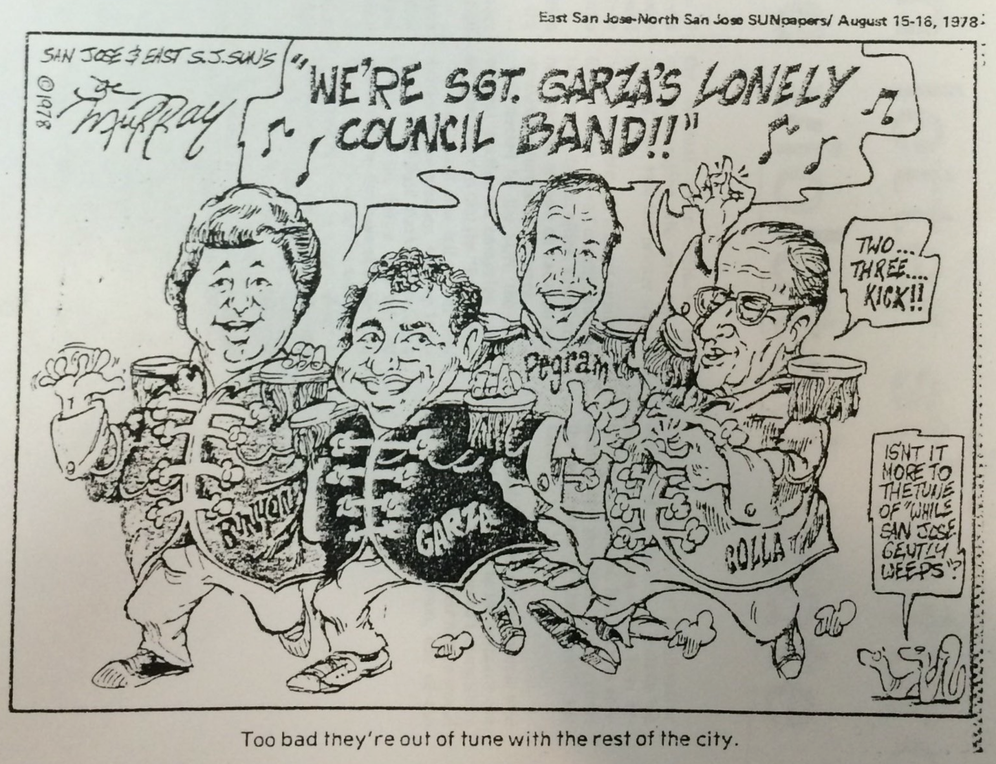

---
title: '"Indiscriminate, Unplanned, Opportunistic, Premature": Rejecting the Los Angeles of the North'
author:
- Jason A. Heppler
...

\begin{aquote}{Janet Gray Hayes}
People in San Jose want limited growth. They don't want another Los Angeles.
\end{aquote}

The campaigns for open space throughout the San Francisco peninsula represented the broadening of suburban environmentalism as postwar liberalism shifted from its New Deal vision of growth toward an emphasis on quality-of-life issues, which included a new appreciation for nature. Throughout the Valley, white middle-class suburbanites fought against suburban sprawl through measures such as zoning requirements, land trusts, and conservation organizations. Yet these efforts to control growth not only represented a land ethnic of conservation, but also solidified race and class exclusivity for affluent liberal suburbs. Scholars have looked at the anti-sprawl politics as a symbol for suburban exclusionary politics. Mike Davis in his study of Los Angeles finds "slow growth" the "latest incarnation of a middle-class subjectivity that fitfully constitute and reconstitutes itself around the defense of household equity and residential privilege."^[[@davis1992quartz, 159]; [@hurley1995inequalities]; [@klingle2007emerald]; [@geismer2015blame, 290--293].] Adam Rome suggests, instead, that suburbanites played a key role in shaping modern environmentalism.^[[@rome2001bulldozer, 1--14].] In Silicon Valley, the result was a mix of these two conclusions: suburbanites expressed a genuine concern for environmental degradation through continued urban growth, but by pursuing policies that sought to preserve their quality-of-life they solidified spatial, environmental, and racial inequality.^[A similar argument is advanced by Lily Geismer. See [@geismer2015blame, chapter 4]. See also [@siskind2006discontents].]

However, just as issues of environmental and social justice were burgeoning, the changing demographics of Silicon Valley introduced a significant shift to the political culture. In San Jose, the city's population ballooned rapidly from 204,196 in 1960 to 445,779 in 1970. Among this expansion came demographic shifts as the city became more diversified. People of Hispanic origin expanded from 11.4% to 15.1% between 1950 and 1970, while African Americans increased from 0.6% to 2.5% over the same period. By the end of the 1970s, San Jose's population grew to 629,442, with Hispanics accounting for 22% of the population, African Americans 4.6%, and Asian and Pacific Islander 8.5%.^[U.S. Census Bureau, "City of San Jose."] San Jose was becoming less homogeneous, and politics had to grapple with an electorate demanding attention to their communities. These shifts were happening throughout Silicon Valley, shaping how homeowners, suburbanites, politicians, and communities defined their urban spaces. The major target for criticism was the ideology of urban growth, which was no longer seen as the central goal for a city's prosperity.

Perhaps no place better represented the crumbling philosophy of growth-as-progress better than San José. Challenges to San José's growth interests on the city council began to mount in the early 1960s as homeowners in the suburban fringes of the city began opposing the city's sprawl. In 1962, Virginia Shaffer, a Republican and the first woman to be voted onto San José's city council, rose to office representing the interests of homeowners and taxpayers.[^79] The *Mercury News* referred to Shaffer as "Madam No" based on a voting record that frequently opposed rezoning decisions. Shaffer represented the expression of new interests guiding ideas about the city's future growth, but to call her platform conservation would misrepresent her attitude towards urban growth. Although her criticisms of San José found sympathy among conservationists, her concerns revolved primarily around slowing growth to ease the tax burden on homeowners and limiting government spending. Shaffer and her homeowner constituency had grown frustrated by the city's continual emphasis on growth without paying mind to the adequacy of city services, high taxes, and development policies that allowed construction on landslide-prone hillsides and floodplains.[^80] The 1962 elections rattled the pro-growth advocates in San José. "The election of 1962 cast a shadow that falls across our political scene even today," recalled former councilman and mayor George Starbird. The pro-growth council still had an ally in Dutch Hamann, who voters retained as city manager after a vote-of-confidence in 1962, but homeowners would be watching the council closely in their decisions about zoning, places for recreation, taxes, and annexations.[^81]

Poor planning and runaway growth met Shaffer's ire. Like many of Santa Clara's residents, Shaffer was a newcomer to the county. Born in Chicago in 1922, Shaffer grew up in Wisconsin and attended the University of Wisconsin. In 1946, she married Harold Shaffer, an engineer, while both were working for Lockheed in Southern California. They moved to San José in 1957 after Harold's transfer to the Santa Clara County facility.^["Virginia Shaffer, 1st Woman to Serve on S.J. City Council," *San José Mercury News*, May 14 1998. [@flammang1997womenvoice, 41].] Motivated by encroaching commercial developments in her neighborhood, along with rising taxes and insufficient parks, Shaffer began attending council meetings in the early 1960s and became active with homeowner groups displeased with high taxes and industrial development near their communities.^["Fischer, Shaffer, Pace Win City Council Seats," *San José Mercury*, May 9, 1962.] Shaffer's entry into San José politics was a challenge to the mostly white, upper-middle-class male political establishment, whose close personal and political connections helped smooth the path for developers to promote city growth. Shaffer entered the political ring in 1962 along with additional anti-incumbent candidates, including former councilman Clyde Fisher and Joseph L. Pace. Securing the support of homeowners and their concerns about controlling growth, rising taxes, and zoning, voters placed the challengers on city council seats. The election, according to the *San José Mercury*, was "an upheaval in the city's political structure."^["Fischer, Shaffer, Pace Win City Council Seats," *San José Mercury*, May 9, 1962. According to San José developer Charles W. Davidson, the very engineers that high tech attracted had become drivers of political change. "Lockheed," he said, "had come to the valley in the late 1950s, spurred development in the West Valley and, in 1962, got Shaffer elected." See "S.J. Recall Effort in '64 Only a Dim Memory," *San José Mercury*, April 4, 1994.]

Developers now found their plans challenged by a vocal and stubborn voting block. With Shaffer's ascent to the city council, she objected to the city's poor planning and lack of oversight, as well as objecting to the secret "Book of the Month Club" meetings held away from public scrutiny.^[On the "Book of the Month Club," see chapter 3.] Her voting record rejected projects she felt did not work for residents, such as her vote against moving city offices to downtown in the mid-1960s.^["'Madam No' Still Says No---First S.J. Councilwoman Eschews Politics Now That She's Retired," *San José Mercury*, June 5 1989.] When a ballot initiative failed to remove City Manager Dutch Hamann from office, Shaffer and her allies launched a recall initiative in 1964 in an attempt to ouster four councilmembers closely allied with the city manager. Supporters criticized the "extravagant growth" of the city, accusing the four councilmembers of ignoring good planning policies, hiking taxes on homeowners, and favoritism in zoning decisions.^["Arguments for an against Recall of Certain Elective Officers," City of San José, Municipal, Recall Election, July 14, 1964, voter pamphlet, clipping file, "San José - Elections - 1964," envelope, California Room, San José Public Library.] The recall effort, however, failed to resonate with voters. Occurring on an off-election year, only nineteenth percent of San José's eligible voters turned out. They overwhelmingly supported the recalled candidates.^["S.J. Recall Effort in '64 Only a Dim Memory," *San José Mercury*, April 4, 1994.]

Reacting to the growing homeowner resentment for the city's growth policies, the pro-growth leadership proposed a removal of the biannual vote of confidence for city manager. Hamann had won the vote of confidence in elections under his tenure, but the margin of victory was dwindling. They also proposed making the office of mayor an elected office again, reversing a Progressive Era measure whereby the mayor was a rotating position selected among the council by council members on the basis of seniority.^[Placed onto San José's city charter in 1916, the office of mayor was designed to limit the mayor's power by making the position on an equal footing with council members. This move gave rise to the position of city manager, who inherited most of the former powers of the mayor's office that included policy implementation, budget oversight, and labor decisions for municipal employees. The decision was designed to check against corruption, while the management-style of city government sought to make government more accountable and less susceptible to cronyism. "First S.J. City Manager Faced a Tough Task, Too He Wrote Charter, Hired Top Cop, Prepared Budget," *San Jose Mercury News*, January 3, 1995; [@trounstine1982movers].] Additional measures by the pro-growth contingent included raising the number of signatures required for placing initiative and referendums on ballots and granting more administrative power to the city council. For the pro-growth supporters, these changes were necessary for the modernization of San José governance. Yet critics, among them Shaffer, opposed the measures, seeing them as a power grab that would fail to help residents.^["Lengthy Ballot in City April--26 Candidates," *North San José Sun*, February 24, 1965, Clipping File - Santa Clara County," San José Elections, 1965, April" envelope, California Room, San José Public Library; "Measures on Ballot Listed," no source, no date, Clipping File - Santa Clara County, "San José Elections, 1965, April" envelope, California Room, San José Public Library.] The charter revisions received wide support from the pro-growth coalition of real estate developers, utility companies, and *Mercury News* publisher Joseph Ridder. The proposal divided homeowners, and voters passed the revised charter in 1965.

Shaffer's time in office was plagued by a male-dominated political culture and a voting record that challenged the designs of the pro-growth coalition. While serving on city council, the male majority broke the tradition of rotating the positions of mayor and vice mayor based on seniority in order to bypass Shaffer five times. In 1964, the council went so far as to lock Shaffer out of a public council meeting.^["'Madam No' Still Says No---First S.J. Councilwoman Eschews Politics Now That She's Retired," *San José Mercury*, June 5 1989.] "Madam No" increasingly became isolated on the six-member city council, including among her anti-incumbent allies who swept into office with her. Yet her ascent to office and attitude toward continued growth represented a significant shift in San José politics, reflecting a growing middle-class homeowner resentment with taxes, zoning, growth, and poor city services. The city's growing high-tech professionals helped swing elections, such as in 1967 when Democrat Joe Colla, a self-described maverick and downtown drugstore owner, won a seat on the council as an opponent of business-as-usual politics. During the 1969 elections, homeowners supported a slate of three candidates who had the potential to become key allies for Shaffer's policy changes. The newcomers to the city, brought in by the likes of Hamann, were becoming their biggest challengers.

While the 1964 and 1967 elections destabilized the growth coalition, 1969 promised to crumble their foundation entirely. Two of the three candidates endorsed by Shaffer, David Goglio and Kurt Gross, won their council bids. Goglio, president of a homeowners' association and an IBM employee, campaigned against the city's growth policies. The incumbent, Louis Solari, a real estate developer and supporter of Hamann, had originally taken a seat on the council in 1952. Solari was the longest-serving member on the council and hoped to pick up an unprecedented fifth term. Goglio's win signified a blow to the pro-growth coalition. Kurt Gross was likewise a growth critic. As a member of the San José Planning Commission, he criticized his incumbent for his continued support of urban policies that failed to check the city's expansion. A third candidate supported by Shaffer failed to make it past the primaries, but Walter Hays, an attorney with a record as an outspoken environmentalist and planned-growth advocate, won the third council seat. Hays wanted San José to become a more livable city while still attracting high tech industry to the area.^["Candidates for Seat 5 View Issues," *San Jose Sun*, May 14, 1969.] Hamann, sensing the shifting political winds, resigned shortly after the 1969 electons and was replaced by Thomas Fletcher, a controlled-growth manager. Annexations declined sharply after 1970 as the city council shifted its policy toward urban renewal and a "in-fill" policy to encourage development with the existing urban service area. Hamann's nineteen-year tenure as city manager ended just as the city's new council majority rose to challenge growth interests. "The voices of the builders and doers became lost in the many-voiced demands of the users," former Mayor George Starbird lamented. "The veto was back."[^82] The end of growth-as-progress spelled disaster for city boosters by the end of the 1960s.

San José was among a wave of no-growth and slow-growth regulations in the Bay Area. Although San José's growth control measures never became quite as strident as those pursued in the northern peninsula cities of Menlo Park, Los Altos Hills, Palo Alto, and Atherton, homeowners demanded new policies to protect their natural views and aesthetics. Following the nation-wide trend in establishing land use controls to slow urban growth, only a single Bay Area town had growth control laws in 1972 but by 1975 thirty-one had established new regulations.[^83] These regulations sought to preserve a suburban and rural character of middle-class neighborhoods. For some municipalities on the Peninsula, environmental protections emerged not out of genuine concern for the environment but as a method for preserving property values or setting down symbolic boundaries between race and class. In other towns, environmental regulations did reflect a concern for the environment. Whereas San José politics in the 1950s sought to become the "Los Angeles of the North," in Dutch Hamann's words, the San José of the 1970s jettisoned its L.A. envy. "People in San José want limited growth," future Mayor Janet Gray Hayes remarked in 1978. "They don't want another Los Angeles."[^84] The changing contours of San José's green political culture grappled with two decades of unrestrained urban growth, leading voters to support new local regulations and support local political leaders that made the environment a key component of their platform.

One method of growth control came in the form of zoning for residential density. San José reduced residential density throughout the city from twelve to eighteen housing units per acre to six to eight units. New policies also required that no new development could be permitted until developers submitted environmental impact statements that specified how they would handle storm runoff, maintain open space, ensure the availability of city infrastructure, and accessible schools.[^85] In 1973, San José voters passed Measure B that prevented new residential development until adequate school space was provided for future residents.[^86] Many of these regulations, however, had the unintended affect of offloading the costs of development and environmental regulations onto consumers, and made low- and mid-size developments unprofitable for most developers. In response, developers built pricier housing affordable only to high-income residents.[^87] Various maneuvers to build low-income housing in Los Altos Hills, San José, and elsewhere in Silicon Valley faced challenges by conservationists who complained that such projects threatened environmental land use regulations.

Yet, Santa Clara County did not continue down the path of a conservative ascendancy like Southern California experienced. Shaffer represented that strain of American political culture, formulating a critique of taxes, government austerity, and opposed an attempt to honor the African American civil rights movement at a Willow Glen library.^["Willow Glen residents reject DuBois, Stokely," *Afro-American*, March 22, 1969.] She opposed public housing measures, and outside of local politics she served on the Republican State Central Committee and was appointed to California's planning advisory committee under Governor Ronald Reagan. She unsuccessfully ran for the State Assembly twice and Congress once, but her greatest impact remained as an advocate for homeowner interests that garnered support among local and state conservatives. Yet Shaffer's quality-of-life positions put her increasingly out of step with San José's minority and working class voters. Even so, San José's growing high tech professional class largely avoided the race and class strife experienced by other cities in the 1960s and 1970s. Shaffer represented the interests of high tech professionals and their interests, yet those interests were often willing to let government intervention serve their goals. But the political culture in San José was different from Orange County, where anti-unionism, Cold War anti-communism, and rural voters and merchants helped shape its political culture. San José had a young population---among the youngest average aged populations in the nation in the 1970s---but the culture focused on different issues.^[Norman Y. Mineta, "The State of the City," (Mayor, City of San José, July 8, 1971, City Hall, City of San José, California, Clipping File--Santa Clara County, "Norman Mineta, 1960 to 1979" envelope, California Room, San José Public Library).] Quality of life, environmental policies, and a liberal attitude toward civil rights expressed a liberal political culture in Santa Clara County.

Inheriting the leadership of the growth coalition was Mayor Ron James, a popular candidate supported widely by both homeowners and business leaders. Yet his tenure was short lived when he decided not to seek re-election in 1971. And in a surprise to voters and political observers alike, Shaffer, who was expected to make a mayoral run that same year, decided to give up her council seat at the end of her term. A record thirty-three candidates vied for vacancies, including fifteen alone contending for the office of the mayor. The frontrunner for Shaffer's seat was a self-avowed "suburban housewife" and environmentalist Janet Gray Hayes. Growth dominated the election, and Hayes made slow growth the core component of her campaign. A native of Indiana who came to San José in 1956, Hayes involved herself in local politics almost immediately, becoming a key member of the League of Women Voters and president of the organization. Hayes won the council seat carrying 50.9% of the vote. Along with Hayes, vice mayor Norman Mineta won the mayor's office---a liberal Democrat and the nation's first Asian American mayor who won with "overwhelming support in every community sector, 'establishment' or otherwise"---and council incumbent Joseph Colla hung onto his council seat.^["Race Non-Issue in Mineta Win," (*San José Mercury News*, April 1971 [clipping undated], Clipping File--Santa Clara County, "Norman Mineta, 1960 to 1979" envelope, California Room, San José Public Library); "Pick a Winner! Janet Gray Hayes," (Political advertisement, [unknown paper], [undated clipping], Clipping File--Santa Clara County, "San José - Elections 1971 - Recall" envelope, California Room, San José Public Library); "Candidates Statements of Qualifications," (City of San José California General Municipal Election, April 13, 1971, voter booklet, Clipping File--Santa Clara County, "San José - Elections 1971 - Recall" envelope, California Room, San José Public Library).] Hayes quickly garnered political support, becoming San José's first female vice mayor. Mayor Mineta also moved to diversified the city council, appointing Alfredo Garza, Jr., as the city's first Latino to serve on the council. Quality of life politics had come to dominate San José politics. In a pledge to homeowners, Mineta promised that he would "recreate San José as 'The Garden City,' a term by which it was known not too many years ago." He promised

> By "The Garden City," I mean that all our efforts should be directed toward creating a quality of life in San José . . . in which the needs of the people are provided and in which all the people have an opportunity to participate in determining the delivery of those services.^[Mineta, "The State of the City," 5.]

\noindent The concerns of suburban liberals---controlling growth, the environment, improving the city's infrastructure, affordable housing, and expanding economic opportunities---fostered a political culture that fused a suburban liberal vision with quality of life activism.

When Mineta vacated the mayor's office after a successful bid to Congress in 1974, Hayes stepped in to fulfill the suburban liberal vision for San José. Hayes meshed well with the concerns of San José voters. Many had become increasingly suspicious of urban growth and its synonym of progress. In one survey, voters identified open space, urban growth, and the environment as key challenges facing the city. Among their top concerns, voters identified pollution, overpopulation, land use planning and zoning, and parks and recreation as major concerns leading up to the 1974 mayoral elections.[^89] Sixty-six percent of the survey's respondents listed protecting the environment as the top task the city needed to take on, and fifty-nine percent felt that curbing growth and protecting open space was necessary.[^90] Many city council members began to distance themselves from real estate interests in the city, identifying an association with developers as a political liability.[^91] San José had become a popular symbol of poor urban growth, lambasted by popular media, books, and studies.[^92] Residents wanted that image---and reality---corrected.

Hayes faced off against Bart Collins, a 63-year-old former police chief supported by a pro-growth coalition who she referred to as "Mr. Yesterday." Of immediate concern, Collins pledged to repeal a construction and conveyance tax passed by Mineta that required developers to pay for the cost of infrastructure and services in new developments. Hayes, on the other hand, felt the "pay as you grow tax" should be kept in place to help curb the city's growth. Furthermore, Hayes called for a "smart growth" policy of "in-fill" development, a measure meant to develop areas within the city's urban services area that would not require additional infrastructure to support. For Hayes, this policy had two key goals: it halted suburban sprawl, and it generated new revenue for the city. Hayes outlined a vision that called for improving quality of life, controlling growth, promoting economic development, and cutting taxes, along with a progressive stance on social and environmental issues.

Hayes narrowly won the 1974 mayoral race, carrying the majority of voters particularly in Eastside and the new neighborhoods of Berryessa, Evergreen, and West Valley. In one analysis of the election, Collins prevailed among conservative, older, and more affluent parts of the city, while Hayes carried new, outlying areas of the city---those areas facing the worst of the growth problems.^["Precinct Analysis Shows Who Got the Votes - and Where," *San José Sun*, July 17, 1974, clipping file, "Janet Gray Hayes" folder, California Room, San José Public Library. Scholars suggest that one reason Hayes enjoyed wide support among minorities is because they did not want to see a former cop become mayor. [@trounstine1982movers, 104]; [@flammang1985feminist, 100].] Hayes was the first woman to serve as mayor of a major metropolitan center and among a wave of female political leaders taking office in Santa Clara County. The San José chapter of the National Women's Political Caucus dubbed the county the "feminist capital of the world" as women assumed positions of power throughout city and county government, many of whom were protégés or allies of Hayes.[^88] Mayor Hayes and her allies ran on a platform of responsible growth and environmental consciousness, epitomized by her campaign promise to "make San José better before we make it bigger."^["Let's Make San José Better - before We Make It Bigger!" Janet Gray Hayes Campaign Literature [Fold-out pamphlet 1974] - Janet Gray Hayes papers, MSS-2002-01, San José State University Library Special Collections and Archives.] These women preceded the Proposition 13 anti-growth and anti-tax revolt, and like Shaffer became a tireless advocate for homeowners and "smart growth" to reign in urban sprawl.^[Along with Hayes' election to the mayor's office, San José voters elected Larry Pegram to the city council and Rodney Diridon to the Santa Clara County Board of Supervisors. Both candidates supported slowing growth, expanding the county's open space holdings, and improving mass transit and city infrastructure.]

According to Janet Flammang, Santa Clara female leaders gained traction in county politics because of the "association . . . between male candidates and the growth machines of a booster political elite." Women were able to juxtapose themselves against this political culture as protectors of neighborhoods and torch bearers for clean government.^[[@flammang1985feminist, 97]; "Survey of Voter Attitudes," Hayes Papers.] Future council member Lu Ryden suggested the reason she and other women got involved in local politics was through their concern as homemakers. "Being a concerned housewife enabled them to get into neighborhood groups in the first place," she suggested. Since concerns about parks and homes were often seen as "women's work," suburban politics allowed women opportunities to become deeply involved in volunteer efforts, civic organizations, and hone their talents for political activism. But their politics also reflected their class bias. Many were highly educated and affluent, intensely interested in their neighborhoods and communities. Many had come to San Jose during the first wave of migration as their husbands took jobs in electronics, aerospace, and engineering. Also enabling women to join political ranks was a redistricting decision that made electioneering easier to enter and fund.

Controlling urban growth became a feature of Valley politics stemming from desire among homeowners to preserve their aesthetic views, one of the very amenities that drew newcomers to suburbs throughout the Bay Area. In 1970, City Manager Fletcher hired Rand researchers to study the ways San José could curtail growth. The researchers concluded little could be done by the city. While city leaders accommodated to the demands of developers, the drivers of urban growth were external---federal investments into suburban homeownership, the decentralization of industry, and highway construction created a situation where Santa Clara County followed similar urban trends throughout the country.[^93] But land use regulations were popular among homeowners because it promised protections of aesthetic vistas. The Rand researchers noted a "growing concern for the natural environment and continued concern for one's family environment." Many homeowners found "their fortunes are tied, not to continued growth . . . , but to keeping out those who would move in to change the area further and who, by virtue of moving in, would destroy the reasons for which those who are already in the County moved there."[^94] Whether avowed environmentalists or not, homeowners saw the protection of their environments as a key component of their suburban lifestyles.[^95]

Hayes' election to the mayor's office in 1974 represented a significant challenge to the development interests in San José. The new mayor promoted a policy of "smart growth" that attempted to balance industrialization with residential development. Under her tenure, Hayes streamlined the city's permit process and offered new incentives to businesses looking to develop in the city limits. To a speech before the Chamber of Commerce in 1978, Hayes boasted of city hall's "sympathetic ear" for businesses, helping to attract high tech firms of IBM and Hewlett-Packard. In 1977 alone, the city issued $70 million in industrial permits, jumping the average from $7 million to $42 million in the first months of 1975.^["State of the City," Janet Gray Hayes, January 18, 1978.] Furthermore, to the approval of her homeowner constituents, Hayes insisted on new measures to slow suburban sprawl and preserve open space. Hayes insisted that homeowners would pay less and receive more, lowering the city's tax rate from 1.78% to 1.36%.^["Pocket Summary of Finances, San José, California, for the Fiscal Year 1974-75," Series I: Administrative Files, 1974-1982, Box 1, Folder 5, "Financial Statements, 1974-1981," Janet Gray Hayes Papers, MSS-2002-01, San José State University Library Special Collections and Archives. Hayes was also likely aware of the growing property tax revolt, and worked hard to keep taxes low while improving the city's frugality.] While residential taxes dropped, Hayes continued using the construction and conveyance tax to make up for lost revenue and continue expanding city services and infrastructure. Adding to the city's coffers were federal and state money, which helped subsidize redevelopment, upgrade to the sewage system, and provide training and employment programs.^["Pocket Summary of Finances, San José, California, as of June 30, 1979," Series I: Administrative Files, 1974-1982, Box 1, Folder 5, "Financial Statements, 1974-1981," Janet Gray Hayes Papers, MSS-2002-01, San José State University Library Special Collections and Archive; "Pocket Summary of Finances, San José, California, as of June 30, 1980, Series I: Administrative Files, 1974-1982," Box 1, Folder 5, "Financial Statements, 1974- 1981," Janet Gray Hayes Papers, MSS-2002-01, San José State University Library Special Collections and Archives; "Pocket Summary of Finances, San José, California, as of June 30, 1981, Series I: Administrative Files, 1974-1982, Box 1, Folder 5, "Financial Statements, 1974-1981," Janet Gray Hayes Papers, MSS-2002-01, San José State University Library Special Collections and Archives.]

<!--
Three explanations are given as to why Bay Area environmentalists succeeded in limiting growth. On the one hand, historians have argued that social exclusion and the desire to maintain property values fueled an anti-growth politics. Others have suggested that the Bay Area's legacy of open space preservation as a public good continued to influence midcentury politics. Still others suggest that a conservative NIMBYism fueled opposition to growth. But in San José, the political motivations of Hayes and other suburban liberals appears fueled by a genuine desire to craft an urban policy sensitive to environmental change while also attempting to balance the needs and demands of minority residents.
-->

As the 1978 mayoral campaign approached, Hayes had taken several steps to improve growth issues in the city. But like 1974, the mayoral campaign remained centered almost exclusively around limiting urban growth---what the *San Francisco Chronicle* simply called "The Issue."[^96] Hayes, who had risen to prominence on the basis of her commitment to controlling sprawl in San José, was challenged primarily by city council member Al Garza. A native of East San José and the oldest of ten siblings, he graduated from San José State University and worked as a high school teacher and counselor prior to his appointment on city council. Garza had connections to the city's developers, working at a real-estate title firm to supplement his income. Garza unsuccessfully ran for the council seat Hayes captured in 1970, but was appointed to the council to fill a seat vacated by the death of Vice Mayor Kurt Gross in 1971. He successfully ran for reelection in 1973 and 1976, and took a run at the office of mayor in 1974 but was overshadowed between the Hayes-Collins race. Garza took aim at Hayes' campaign promises of "better before bigger," in particular accusing the city's lack of attention in providing East Side with the "services and amenities" of the rest of the city. To Garza, Hayes' campaign promise four years earlier failed to materialize in quality-of-life services. He also positioned himself as the candidate speaking for working-class and minority residents.[^97]

Debates around the two candidates positions focused on specific spaces in the city. Hayes insisted early in the campaign that she was a limited growth---not anti-growth---candidate, while Garza represented pro-growth interests in the city. Hayes pointed to her support to various plans included attracting new industry, using a policy of fill-in to build in areas already adequately served by city services, an expansion of city parks, and capital improvements. Garza pointed to other areas of the city, such as Hayes' approval of a commercial development in the Evergreen district in southeast San José where existing roads could not handle the influx of traffic.[^98] Yet even the pro-growth sympathies of the *San José Mercury* evaporated by the mid-1970s. The *Mercury* editorialized in support of reelecting Hayes, arguing that her policy of in-filling, improving the city tax base, promoting urban redevelopment, and cutting government spending had served to control growth and take advantage of existing city services.[^99]

A strong anti-incumbent sensibility among San José voters contributed to a runoff election between Hayes and Garza after neither managed to gain a majority vote in the June primaries. What would explain why Hayes failed to capture re-election despite her popularity? The *San José Mercury* identified a "damn-the-incumbent movement" among voters, a claim it bolstered by pointing to the three other races among candidates who also failed to garner enough primary votes.^["Santa Clara County and 'the Revolt'," *San José Mercury*, no date, Series II: Campaign & Election Materials, 1971-1982, Box 1, Clippings, 1971-1978 Mayoral Reelection Campaign, 1978, Janet Gray Hayes Papers, MSS-2002-01, San José State University Library Special Collections and Archives; "San José's 'Unpersuaded' Electorate," *San José Mercury*, no date, Series II: Campaign & Election Materials, 1971-1982, Box 1, Clippings, 1971-1978 Mayoral Reelection Campaign, 1978, Janet Gray Hayes Papers, MSS-2002-01, San José State University Library Special Collections and Archives). Hayes received 67,149 votes while Garza carried 54,152. Other candidate also faced runoffs in the 1978 elections, including Joe Colla, Larry Pegram, and Susanne Wilson.] <!--{MORE}-->

The political interest in land use bled into other city and county campaigns, primarily the Santa Clara County supervisor seat vacated by the retirement of Sig Sanchez. A runoff between Susanne Wilson, a city council member, and Ivan Zubow, a South County land developer who funded his campaign out of his own pockets, exposed political faultlines around growth. Wilson, often described as a "a Hayes protégé," emphasized her voting record of slow growth. Zubov charged that her record failed to reflect her claim arguing that his role as a land developer made him more than qualified to understand the issues around land use and growth.[^100]

Builders and developers were central figures in the campaign. The Hayes-Garza race achieved prominence as the most expensive campaign waged in San José's history, supported largely by developer interests pouring money into both candidates. The Builders and Contractors Committee, comprised of thirty members of builders, contractors, bankers, and associated industries, pledged $14,000 to Garza's campaign and planned donations of $10,000 to Councilman Joe Colla, who faced a challenge from limited growth advocate Jerry Estruth. Bill Williams, a member of the Committee and builder for Sea Homes, remarked that he could "only surmise that the majority of our members felt that those two people [Garza and Colla] are better for our industry."[^101] By the end of the mayoral campaign, sixty percent of Garza's political donations came from developers.[^102] Hayes, Garza, Estruth, Colla, Zubow, and Wilson all received major contributions from local developers.[^103]

Bolstering the Hayes campaign were high technology firms. Hayes picked up an important ally in 1977 when David Packard formed the Santa Clara County Manufacturers Group (SCCMG), established to represent the business interests of SCCMG members and aid in planned growth and quality-of-life issues. High tech industries understood that their middle-class professional employees expected a certain degree of cultural and natural amenities. By securing those amenities, firms could attract and retain the best talent. Furthermore, Hayes' pro-business approach underscored the friendliness suburban liberalism offered electronics firms. The new industry was not only transforming the local economy, but had grown to expand their influence in local politics as well.^["Finding Money the Key Play in the Campaign Game," {TODO}, October 8; Saxenian, "In Search of Power: The Organization of Business Interests in Silicon Valley and Route 128," *Economy and Society* 18, no. 1 (1989): 33--39, 45--47, 57--61; [@saxenian1996regional, 47-48].]

Adding to tensions in the runoff campaign was the specter of Proposition 13. Hayes and her suburban liberal allies opposed the referendum, but the majority of Santa Clara County voters disagreed and passed the anti-tax measure in 1978. Nevertheless, Hayes maintained throughout her campaign that San José could offer the quality-of-life amenities and services middle-class homeowners desired while also cutting taxes and budgets. While government austerity appealed to conservative voters, Hayes kept a faith in the role of local, state, and federal assistance in achieving the goals homeowners hoped to see in the city. Moreover, Hayes remained committed to her suburban liberal agenda of environmental protection, civil rights, and social programs.

The mayoral campaign became mired in controversy as it entered the final three months. In a maneuver that rhymed with the Progress Committee's firing of the city manager in the 1940s, the pro-growth contingency on the city council sought to strike at the Hayes campaign by orchestrating an ouster of City Manager Ted Tedesco.^[On the Progress Committee, see chapter 3.] Tedesco, originally the city manager in Boulder, Colorado, assumed office in 1972 under Mayor Mineta and had guided San José's "in-fill" policy. Tedesco promoted controlled growth, and by extension was an important ally in the Hayes administration. But in a four-to-three vote, the city council voted to remove Tedesco from his position. The council members opposing Tedesco---Garza, David Runyon, a real estate developer, Colla, and Pegram, the council's only Republican---overruled the votes of Hayes, Wilson, and Jim Self. Local media quickly dubbed the pro-growth members the "Fearsome Foursome." The opponents of Tedesco were open about their reasoning. Garza explained that Tedesco's ouster reflected his unwillingness to serve the will of the council majority, suggesting that the city manager's slow-growth sensibilities had gotten in the way of the city's operation.[^104] Joe Colla reasoned frankly: "He was anti-growth, and this is now a pro-growth city."[^105] In the midst of the Tedesco ouster, the Fearsome Foursome pushed through additional pro-growth policies including the abolishment of a city policy tying new growth to adequate streets, adopting a $28 million road program to build new roads rather than improve existing infrastructure, and approved a new tax on urban development days before Proposition 13 made it illegal.[^106]

In November, the pro-growth agenda of the Fearsome Foursome failed to resonate with voters. Hayes swept past Garza, who claimed over 70% of the vote, while Colla was unseated from the council by Estruth, who received 60% of the vote. Shortly after the campaigns, David Runyon was forced to resign after a public drinking scandal and was replaced by Tom McEnery, another limited-growth advocate.[^107] The public rejection of Garza and the pro-growth interests in the city council solidified the political shift happening throughout California and the West as concerns about growth and the environment shaped the city's politics. Jubilant victors and outside observers saw Hayes' victory as a sign that the city's incessant drive for expansion had come to an end. Hayes herself saw her victory as "a clear mandate" that San Joséans were through with the growth-as-progress philosophy.[^108]

Just as voters helped enable urban growth through their sanction of municipal bonds in the 1950s and 1960s coupled with their desire for countryside living, so to did people begin to have second thoughts about such growth. Inadequate city services, high taxes, gridlocked roads, environmental damage, and a sense that quality of life was declining contributed to a state of alarm and calls for reform. Voters were motivated to action through various sentiments. Sometimes these reflected genuine ecological concerns, arrived at through their exposure to expert literature. Other times, responses to growth came in the form of quality-of-life concerns and a loss of aesthetics, a concern that the foothills of the Santa Cruz and Diablo ranges would be filled with homes or obscured by daily smog. They frequently tied economic issues to environmental issues. Citing the Marshall Plan, urban redevelopment, and the moon landings, Dorothy Erskine pleaded with Michael McCloskey to find out how "can we make environmental protection fit this pattern and perhaps save us from war and a worse fate?"[^109] The political contests over sprawl and growth highlighted how ecological, economic, and social issues intertwined in postwar Santa Clara County. The cities had managed to co-opt regional government, but in the process sparked a grassroots protest. They enjoyed the amenities of their surroundings, and when those were threatened they pushed for reform.[^110]

Yet while Hayes and the suburban liberals appeared to have achieved victory over the growth-is-progress ideology that had dominated San José politics since the 1940s---and most local politics for several municipalities in Santa Clara County---the case for reform did not always mean more effective government. Controlled growth advocates succeeded in slowing the city's expansion, including the San José city council's approval of a 1976 General Plan that was seen as a bridle on growth, development moratoriums throughout the Peninsula, and successful efforts and shutting down proposed residential developments.[^111] Yet local governments remained at odds with one another. Despite maneuvers by San José to preserve foothills from residential development, for example, proposals by Santa Clara County planners sought to open up hillsides in the Santa Cruz and Diablo mountains for residential development. Environmentalists decried the threats of earthquakes, landslides, and sewer systems that could threaten mountain reservoirs, yet to county planners the decision to open up lands for construction only helped to reduce pressure for more development.[^112] The county's plans were all the more troubling to environmentalists following an amended 1980 county General Plan that loosened the slope-density formula that restricted the number of subdivisions that could appear in a 100-acre lot with an average slope of twenty degrees. To the editors of the *San José Mercury*, county planners lacked "political will." [^113]

Developers no longer ruled the Valley's future. In November 1982, developer Lee Brandenburg won the approval of the San José city council to begin construction on a hillside development, the first such development in the city since 1976. Brandenburg had built housing developments throughout the South Bay in Saratoga, Los Gatos, Almaden, Willow Glen, and West San José.[^114] Brandenburg saw himself adding to San José's cultural and economic capital. Casting himself as an environmentalist and lifelong member of the Nature Conservancy, Brandenburg assured the council and critics at a public hearing that he submitted careful studies of Urban Service Area expansion, archaeological reports, geological and seismic investigations, engineering analysis, and traffic analysis to ensure the development would not become a burden upon the city or its residents. Furthermore, Brandenburg argued, just as he had when one of his proposals came before the city council in 1978, that such high-end developments would attract wealthy and powerful residents, many of whom "do business in San José [but] don't live there."[^115] Located north of Silver Creek in the southeast end of the city, the Silver Creek Hills development sought to be a resort complete with an Arnold Palmer-designed golf course, resort hotel, shops, and 2,610 luxury homes and condominiums. The League of Women Voters and an ad hoc coalition calling themselves San Joséans for Limited Growth filed suit against the city council, arguing that the city failed to follow state environmental laws and, therefore, their approval to amend the General Plan for the Brandenburg development was illegal. Nor, they argued, could the sustainability of the planned community be assured. Not only would Silver Creek Hills reside on extremely steep hillsides, argued H.G. Wilshire, a member of the Committee for Green Foothills, but construction would disturb "underlain . . . rocks that are notoriously difficult to stabilize." The threats of landslides and unsuitability of city services to reach the community, Wilshire concluded, reflected "risk-taking with innocent lives" by the city council.[^116] In the end, a county judge overruled the council's approval. The environmentalists had won.

\thoughtbreak{Shortly after her election} as mayor, Janet Gray Hayes spoke before an audience at the Conference on Bay Area Urban Growth held in San Francisco. Growth management, Hayes posited, was defined by the three "Ps"---"piecemeal, patchwork, and prop-up." Her message that day was the role of politics and cities. "Political process can be used in a positive way," she told the audience. "Cities can't solve urban problems on their own. Government's can solve urban problems on their own. Governmental policies and programs should set the stage for private initiative and innovation. Both the public and the private sectors have an obligation for tomorrow. We need less conflict and confrontation, and more cooperation and coordination."[^117] By the end of the 1980s, cities throughout the Peninsula had placed development limits into their urban plans. Local governments responded to the demands of grassroots activists who expected more from their political leaders. Local opposition to boosters owed much to the new environmental regulations and environmentalists. Plans to expand cities further into the foothills drew attention of environmental organizations whose efforts shaped the proposals. Yet even as environmentalists had halted new development, it could not reverse the original land grab. Once the political ability to confront powerful growth interests became viable, the geography of the postindustrial space had already been set. Capital was fixed in space, shaping suburban and industrial spaces that introduced uneven impacts on housing and environmental risk. The consequences of that history would become apparent in the 1980s, as the following chapter explores, when the landscape of industry and the landscape of suburbs collided over the pollution of space.

[^79]: [@trounstine1982movers, 77].

[^80]: "Voters Pass on Manager, 3 For Council Tuesday," *San José Mercury*, April 8, 1962; "Voters Will Decide on Council Posts," *San Jose Mercury*, April 10, 1962; "6 Will Vie for S.J. Council in Runoff!" *San José Mercury*, April 11, 1962; [@trounstine1982movers, 100--101]; [@matthews2003dreams, 191--192]; [@johnston1994success, 94--95].

[^81]: [@trounstine1982movers, 99--101].

[^82]: Quoted in [@trounstine1982movers, 103].

[^83]: [@rosen1981growth, 332--333].

[^84]: "Sweet Triumph for San José's Mayor," *San Francisco Chronicle*, November 9, 1978, Folder 13, Box 1, Janet Gray Hayes Papers, San Jose State University Archives and Special Collections.

[^85]: Santa Clara County Planning Policy Committee, *Zoning and Housing* (San José: Santa Clara County Planning Department, 1970); Santa Clara County Planning Policy Committee, "Urban Development/Open Space Plan for Santa Clara County, 1973--1978" (Santa Clara County Planning Department, n.d.), Box 4, Folder 96, League of Women Voters, San José/Santa Clara Chapter Records, MSS-2006-09-01, San Jose State University Library Special Collections and Archives; Social Planning Council of Santa Clara County, Inc. and Santa Clara County Planning Department, "Profile '70: A Socio-Economic Data Book for Santa Clara County"; San José City Planning Commission, Master Plan of the City of San José; San José City Planning Commission, *1981 Annual Review: The General Plan, List of Potential Land Use/Transportation Diagram and Text Amendments*; "General Plan Amendment Report, 1981 Annual Review, Text Amendments, Number 139", 1981, Box 3, Folder 50, League of Women Voters, MSS-2006-09-01, San José/Santa Clara Chapter Records, San José State University Library Special Collections and Archives; San José City Planning Commission, *Conforming Zoning Ordinance and Management Task Force Report* (San Jose: City of San José, July 16, 1981), Box 4, Folder 94, League of Women Voters, San José/Santa Clara Chapter Records, MSS-2006-09-01, San José State University Library Special Collections and Archives.

[^86]: [@rosen1981growth, 332--333].

[^87]: [@rosen1981growth, 328--331].

[^88]: "But She Picks Political Ring," *San José Mercury News*, June 13,
    1971, Folder 10, Box 1, Janet Hayes Papers, SJSU; "San José's First
    Lady, The Mayor," *San José Mercury*, ca. 1974, Folder 12, Box 1,
    Janet Hayes Papers, SJSU; "City Council Race," *San José Mercury*,
    March 3, 1974, Folder 12, Box 1, Hayes Papers, SJSU;
    [@flammang1985feminist]; [@matthews2003dreams, 191--195].

[^89]: Diridon Research Corporation, "A Survey of Voter Attitudes in the
    City of San José," August 26, 1974, 13, 16, Folder 20, Box 1, Janet
    Gray Hayes Papers, MSS-2002-01, San José State University Library
    Special Collections and Archives.

[^90]: "Survey of Voter Attitudes," 1--2, 1974, Folder 20, Box 1, Janet Gray Hayes Papers, MSS-2002-01, San José State University.

[^91]: "Forerunner," March 1973, Folder 405, Box 88, Don Edwards Congressional Papers, MSS-1995-01, San José State University Library Special Collections and Archives.

[^92]: Stanford Environmental Law Review, *San José: Sprawling City; A
    Study of the Causes and Effects of Urban Sprawl in San José,
    California*, March 1971; [@nader1973land]; "Correcting San José's
    Boomtime Mistake," *Businessweek*, September 19, 1970; "Boom Town,"
    *Newsweek*, September 14, 1970.

[^93]: Alesch, *Local Government's Ability to Manage Growth in a
    Metropolitan Context*, 10, 15, 18, 49; Alesch, *Growth in San José*,
    viii; [@cavin2012siliconvalley, 500].

[^94]: Alesch, "Managing Growth," 29.

[^95]: Alesch, "Managing Growth," 45; [@frieden1979regulation, 15--27];
    [@frieden1979hustle]; [@cavin2012siliconvalley, 501--502].

[^96]: "A Tough Race for Mayor of Sprawling San José," *San Francisco Chronicle*, October 14, 1978, Folder 13, Box 1, Janet Gray Hayes Papers, MSS-2002-01, San José State University Library Special Collections and Archives.

[^97]: "Garza berates mayor in bid to unseat her," *San José Mercury*, March 6, 1978, Folder 13, Box 1, Janet Gray Hayes Papers, MSS-2002-01, San José State University Library Special Collections and Archives; "Garza on attack in mayor debate," *San José Mercury*, April 27, 1978, Box 13, Folder 1, Janet Gray Hayes Papers, MSS-2002-01, San José State University Special Collections and Archives; "The Politics of Growth in San José," *California Journal*, October 1978, Folder 13, Box 1, Janet Gray Hayes Papers, MSS-2002-01, San José State University Special Collections and Archives. [^98]: "Garza on attack in mayor debate," *San José Mercury*, April 27, 1978, Box 13, Folder 1, Janet Gray Hayes Papers, MSS-2002-01, San José State University Special Collections and Archives; "Difference is 'clear,' says mayor of rival," *San José Mercury*, May 12, 1978, Folder 13, Box 1, Janet Gray Hayes Papers, San José State University Special Collections and Archives; "Five in crowded mayor's race; Hayes, Garza emerge as favorites," *San José Mercury*, May 24, 1978, Folder 13, Box 1, Janet Gray Hayes Papers, San José State University Library Special Collections and Archives.

[^99]: "Re-elect Mayor Hayes," *San José Mercury*, May 22, 1978, Folder 13, Box 1, Janet Gray Hayes Papers, MSS-2002-01, San José State University Library Special Collections and Archives.

[^100]: "Supervisor runoff to focus on land use," *San José Mercury* June 8, 1978, Folder 13, Box 1, Janety Gray Hayes Papers, San José State University Library Special Collections and Archives.

[^101]: "Builders giving Garza, Colla \$24,000," *San José Mercury*, October 13, 1978, Folder 13, Box 1, Janet Gray Hayes Papers, MSS-2002-01, San José State University Library Special Collections and Archives.

[^102]: "San José's future growth main issue in campaign," *San José Mercury*, November 3, 1978.

[^103]: "Finding money the key play in the campaign game," *San José Mercury*, October 8, 1978, Folder 13, Box 1, Janet Gray Hayes Papers, MS-2002-01, San José State University Library Special Collections and Archives.

[^104]: "Challenger Al Garza," *San José Mercury*, October 31, 1978, Folder 13, Box 1, Janet Gray Hayes Papers, MSS-2002-01, San José State University Library Special Collections and Archives.

[^105]: "The Politics of Growth in San José," *California Journal*, October 1978, Folder 13, Box 1, Janet Gray Hayes Papers, MSS-2002-01, San José State University Library Special Collections and Archives.

[^106]: "It's a single issue race," *San José Sun*, October 24, 1978, Folder 13, Box 1, Hayes Papers; "A Tough Race for Mayor of Sprawling San José," *San Francisco Chronicle*, October 14, 1978, Folder 13, Box 1, Janet Gray Hayes Papers, MSS-2002-01, San José State University Library Special Collections and Archives; letter from Susan Hammer, et al., to Friends, n.d., Folder 13a, Box 1, Janet Gray Hayes Papers, MSS-2002-01, San José State University Library Special Collections and Archives.

[^107]: "Sweet Triumph for San José's Mayor," *San Francisco Chronicle*, November 9, 1978, Folder 13, Box 1, Janet Gray Hayes Papers, MSS-2002-01, San José State University Library Special Collections and Archives. Runyon's campaign had cast him as a "born-again Christian," but in June was charged with battery, resisting arrest, and public drunkenness. See "The Politics of Growth in San Jose."

[^108]: "Sweet Triumph for San José's Mayor," *San Francisco Chronicle*, November 9, 1978, Folder 13, Box 1, Janet Gray Hayes Papers, MSS-2002-01, San José State University Library Special Collections and Archives.

[^109]: Letter from Erskine to to McCloskey, 2, April 12, 1969, California Tomorrow Papers, California Historical Society.

[^110]: "Anti-Sprawl Initiative: The Citizen's Initiative for Organized Growth and Fiscal Responsibility, An Initiative Ordinance," petition, 1978, Folder 115, Box 4, League of Women Voters, San José State University Library Special Collections and Archives.

[^111]: "Rancho San José Loses in City Vote," *San José Mercury*, January 18, 1978, Folder 115, Box 4, League of Women Voters, MSS-2006-09-01, San José State University Library Special Collections and Archives; letter from Lennie Roberts to LAFCO Commissioners, May 1, 1979, Folder 115, Box 4, League of Women Voters, MSS-2006-09-01, San José State University Library Special Collections and Archives; "Development Moratorium of West S.J. Considered," *San José Mercury*, August 18, 1978, Folder 115, Box 4, League of Women Voters, MSS-2006-09-01, San José State University Library Special Collections and Archives; *League of Women Voters of San José/Santa Clara, Inc., v. San Jose City Council*, Superior Court of California, December 21, 1981, League of Women Voters Papers, MSS-2006-09-01, San José State University Library Special Collections and Archives.

[^112]: "Increased Density in Hills Urged," *San José Mercury*, n.d., Folder 96, Box 4, League of Women Voters, MSS-2006-09-01, San José State University Library Special Collections and Archives.

[^113]: "Keep Hillsides Deal," *San José Mercury News*, October 24, 1984, Folder 96, Box 4, League of Women Voters, MSS-2006-09-01, San José State University Library Special Collections and Archives.

[^114]: "Partial Transcript of Public Hearing on 1981 General Plan Amendments," November 19, 1981, 1 of 4, 15, Folder 50, Box 3, League of Women Voters, MSS-2006-09-01, San José State University Library Special Collections and Archives.

[^115]: "Partial Transcript of Public Hearing on 1981 General Plan Amendments," November 19, 1981, 3 of 4, 10, Folder 50, Box 3, League of Women Voters, San José State University Library Special Collections and Archives.

[^116]: "Safety first," n.d., no source, news clipping, Folder 49, Box 3, League of Women Voters, MSS-2006-09-01, San José State University Library Special Collections and Archives. See also *League of Women Voters of San José/Santa Clara, Inc., and San Joséans for Limited Growth v. San José City Council*, December 21, 1981, Folder 49, Box 3, League of Women Voters, MSS-2006-09-01, San José State University Library Special Collections and Archives; "Needed: An Environmental Impact Report," n.d., no source, news clipping, Folder 49, Box 3, League of Women Voters, MSS-2006-09-01, San José State University Library Special Collections and Archives; "Luxury homes, public hearings," *San José Mercury News*, September 9, 1982, Folder 49, Box 3, League of Women Voters, MSS-2006-09-01, San José State University Library Special Collections and Archives; "Hillside Developer Asks Dismissal of Suit," *San José Mercury News*, April 20, 1982, Folder 49, Box 3, League of Women Voters, MSS-2006-09-01, San José State University Library Special Collections and Archives; "Partial Transcript of Public Hearing on 1981 General Plan Amendments," November 19, 1981, 3 of 4, 10, Folder 50, Box 3, League of Women Voters, San José State University Library Special Collections and Archives.

[^117]: "Presentation by Mayor Janet Gray Hayes, City of San José, California, to the Conference on Bay Area Urban Growth: Yes or No? Up or Out? A Conference on Revitalizing Bay Area Cities," November 1, 1975, 9 and 15, San Francisco Hotel, San Francisco, California, Folder 16, Carton 19, California Tomorrow Records, California Historical Society.

