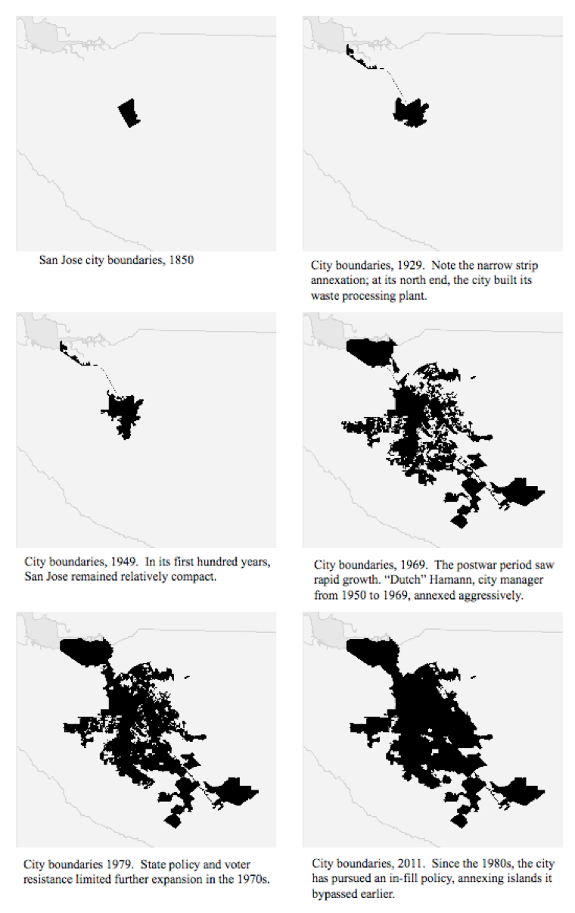
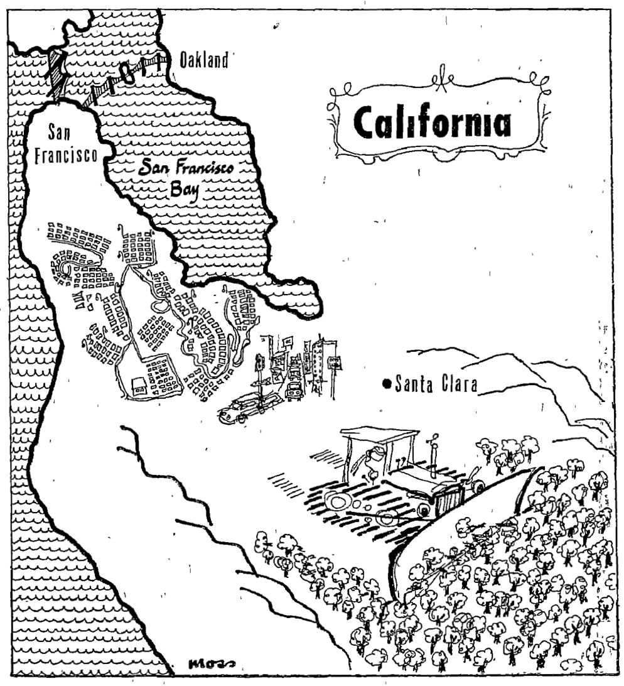

% Chapter 2: “Carved from a Forest of Fruit Trees”

> Hammer in hand, the county went noisily about the job of transforming itself
> from a rural to a metropolitan community. Bulldozers leveled orchards for
> thousands of homesites. The steel webbing of new factories spread over
> former hay fields. Acres of asphalt marked the parking areas of new suburban
> shopping centers. Service stations sprang up like mushrooms along our major
> thoroughfares. Fleets of ready-mix trucks disgorged concrete into the
> foundation forms of every kind of building — in every part of the
> county.^[Karl J. Belser, Planning Progress 1956 (San Jose: County of Santa
> Clara Planning Commission, July 1956), California Room, San Jose Public
> Library, 1.]
>
> Karl J. Belser, *Planning Progress 1956*

Joe Ruscigno spent his lifetime working the land on his San Jose farm. But in
1952, he gave up his trade and adopted another. "Guess I've pulled out 150
acres of trees since the first of the year," he told a *San Francisco
Chronicle* reporter. Ruscigno lamented the uprooting of the prune trees to the
bulldozer he now controlled, but "what can you do? . . . The subdivisions were
coming in all around us and when they made a good offer I sold out."^["Santa
Clara County -- Scene of the Big Boom," San Francisco Chronicle, May 11,
1952.] In the decades after 1945, every municipality in the Bay Area
participated in the process of metropolitan development and, by extension, the
erosion of agricultural land. San Jose, the largest city in the Valley, was
composed primarily of subdivisions of single-family homes that lacked the
industrialism of its northerly neighbors, especially Palo Alto and Sunnyvale that 
hosted the majority of high-tech industry.^[An urban planning study by the 
Palo Alto Planning Commission noted in 1974 that the 1970 Census reported 
50,282 persons employed in Palo Alto, the highest ratio of jobs to population 
in any Bay Area community, and that between 1960 and 1970 commuting workers 
increased from 20,000 to 40,000 while those commuting out of Palo Alto dropped 
slightly. Palo Alto Planning Commission, *Palo Alto Comprehensive Plan Impact 
Report*, July 1, 1974, 45.] By the 1970s, San Jose had become
so suburban that researchers at Rand labeled the city "a bedroom community for
its suburbs"^[Daniel J. Alesch and Robert Levine, Growth in San Jose (Santa
Monica: Rand, 1973), viii.] and referred to Santa Clara County "a giant suburb" of
San Francisco.^[Daniel J. Alesch, Local Government’s Ability to Manage Growth
in a Metropolitan Context (Santa Monica: Rand, 1974), 16.] The city lacked an
urban core of business surrounded by bedroom communities, leading urban
historian Robert Fishman to call San Jose the "archetypal technoburb."^[Robert
Fishman, *Bourgeois Utopias: The Rise and Fall of Suburbia*, 17.] <!-- define 
this-->

As the Valley’s orchards disappeared underneath suburbs, the bulldozer came to
symbolize the progress of postwar urban transformations. Between 1935 and
1957, over 70,000 acres of orchards left production as suburban development
accelerated.^[Roy Hitchcock, "Taking the Pulse of the Prune," *California
Farmer*, September 14, 1957.] "The most common sounds heard in the Santa Clara
Valley this spring is not the call of the meadowlark in the tall grass among
the orchards," reported the *San Francisco Chronicle*, "but the roar of the
bulldozer ripping up rows of fruit trees and the rhythmic sound of the
pounding hammer."^["Santa Clara County -- Scene of the Big Boom," San
Francisco Chronicle, May 11, 1952.] This chapter focuses on San Jose in
specific to understand the process of residential suburbanization in the
Valley. San Jose today considers itself the "Capital of Silicon Valley," and
its process of {EXPAND}

<!--Santa Clara County received more FHA-financed housing than any other Bay Area county.-->

San Jose became an icon of suburban growth in the mid-1950s, an oft-cited
example of how cities should engage in urban planning in postwar America.

# Annexations

Leading San Jose's drive for annexation was city manager Anthony "Dutch"
Hamann, whose annexation campaign was so aggressive that his staff became
known as "Dutch's Panzer division."^[Trounstine and Christensen, *Movers and
Shakers*, 93.]



Plans for municipal consolidation in San Jose received resistance from voters.
Civic leaders' drive to expand the city was hardly shared universally, and
homeowners began rejecting the growth-oriented business elite that had
controlled San Jose politics since the 1940s. In 1962, voters elected Virginia
Shaffer to the city council. Shaffer was a Republican in favor of slow growth
and limited government spending. When a vote came before the seven-person city
council to consolidate the city of Alviso, the only dissenting vote came from
Shaffer who argued that consolidation would do little to help homeowners or
taxpayers.^[Resistance to expansion came, not from liberal environmentalists,
but from conservative Republicans representing homeowner interests according
to Cavin. Cavin, 324.]

# Urban Sprawl

Observers commented on the suburban character of San Jose. T. H. Bowden noted
that the city "might literally be said to have been carved from a forest of
fruit trees, as most of the residential sections were orchards prior to being
subdivided, and many of the original trees still ornament the gardens of the
invading residences."^[Bowden, Report of a Survey in San Jose, California, 2.]

Staggering growth was "business as usual" for the County Planning
Commission.^[Belser, Planning Progress 1956, 1. William H. Whyte, a critic of
sprawl, identified Santa Clara County as a typical case. In The Organizational
Man, Whyte criticized the “packaged communities” of the Valley and worried
about “the paradox of prosperity lowering our real standard of living” and the
depletion of prime soil. William H. Whyte, The Organization Man (New York:
Simon & Schuster, 1956), 10; Whyte, “Urban Sprawl,” 124. On Whyte and the
critique of sprawl see Rome, The Bulldozer in the Countryside: Suburban Sprawl
and the Rise of American Environmentalism, 119–152.]

  Year      Population
  :----:    :-----------------:
  1852      6,764
  1860      11,912
  1870      26,246
  1880      35,039
  1890      48,005
  1900      50,216
  1910      83,539
  1920      100,676
  1930      145,118
  1940      174,949
  1950      290,547
  1960      658,700
  1970      1,064,714
  1980      1,265,200

  Table: Santa Clara County Population, 1852--1980
