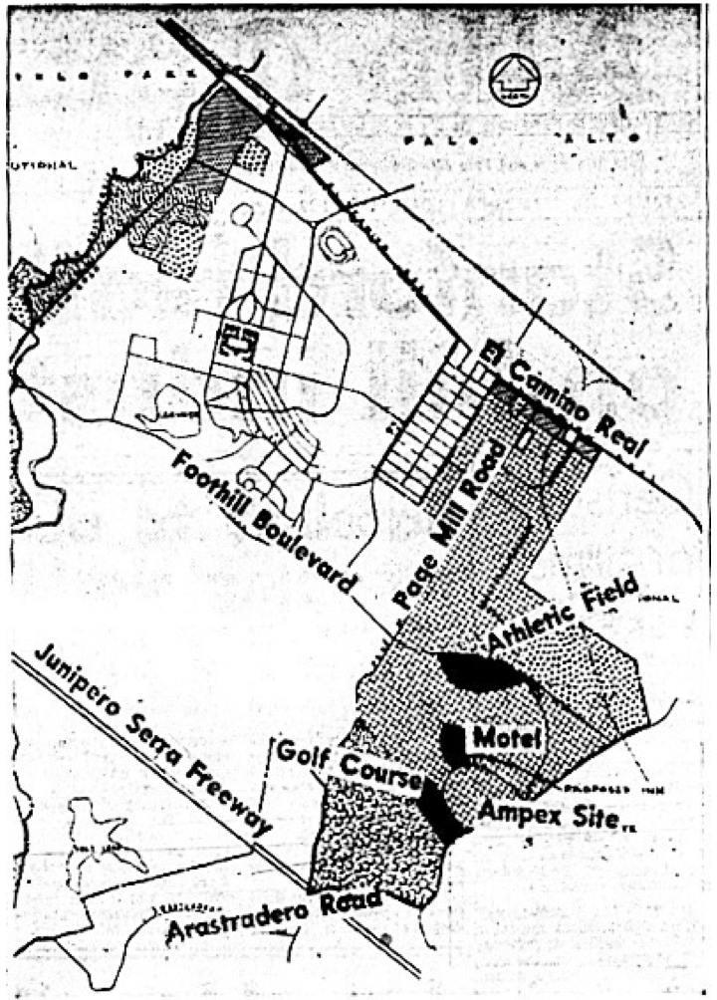

---
title: Machines in the Garden: Suburban Environmentalism and Stanford Industrial Park
author:
  - name: Jason A. Heppler
    affiliation: University of Nebraska-Lincoln
    email: jason.heppler@gmail.com
date: April 18, 2014
bibliography: master.bib
...

> "Palo Alto is half bedroom suburb, half futuristic 1970s science fiction movies. . . . The big thing about Palo Alto is that, as a city, it designs tons of incredibly powerful and scarry shit inside its science parks, which are EVERYWHERE."
>
> Douglas Coupland, *Microserfs* (1995)

> "This is your land we are talking about."
> 
> Bernard DeVoto

The Cold War science complex, anchored by the Stanford Industrial Park, had transformed the landscape of the Midpenninsula. Between 1940 and 1947, the nine counties of the Bay Area became home for 676,000 more people, 330,000 new jobs, and $2.5 billion more in annual income.^[@omara2005cities, 103.] The Bay Area Council concluded that California would become an industrial powerhouse not by replicating the Midwest and Northeast, but through the promotion of new industries.^[@omara2005cities, 106.]

## Aspirations for California

Anxieties over suburban growth and issues of clean air and water, open space, sprawl, and pollution defined environmental politics against its preservationist history. Postwar environmentalism largely became issues over quality-of-life as new worries about chemicals used in products, pollution of water resources, pesticides, and overrun national parks became key political issues. The publication of bestselling books, including Stewart Udall's *The Quiet Crisis*, Rachel Carson's *The Silent Spring*, and Paul Ehrlich's *The Population Bomb*, made the case for greater regulation of growth and pollution. The passage of new legislation embodied new attempts to protect land, air, and water, such as the Wilderness Act of 1964, the National Environmental Policy Act of 1970, the creation of the Environmental Protection Agency, the Clean Air Act of 1972, and Endangered Species Act of 1973.

Rapid growth in western cities encouraged new concerns about their environmental impact, which had the effect of changing local and regional politics. World War II defense industries, Cold War military and industrial buildup, and tourism and recreation encouraged widespread growth in western cities. The region's population more than doubled by 1960. Santa Clara County alone counted 800 factory workers in 1950, which jumped to 264,000 manufacturing workers and more than 3,000 electronics firms by 1980.^[@abbott2008cities, 181.] While growth brought new prosperity and wealth, it also unsettled westerners who watched rural landscapes vanish under four-lane highways, parking lots, office buildings, and residential developments. By the 1960s, some westerners began pushing back against the tide of change and fueled new antigrowth and environmental politics throughout the region. Comprised mostly of middle-class professionals, suburban liberals and conservatives found common ground over environmental damage, uncontrolled growth, poor planning and development, trampled wilderness, and disappearing open space.^[@childers2010ski, 70-72.]

Quality-of-life and antigrowth activists argued that uncontrolled growth lay at the center of the West's social and environmental problems. Air pollution, loss of open space, damaged wilderness areas, industrialization, and urban sprawl threatened the very qualities that led millions of Americans to move West after World War II. The region's vast public lands, economic opportunities, and clean air, activists argued, were under threat by the continuous growth characterizing western metropolitan areas. By the 1970s, residents began arguing for limits on growth in order to protect their quality of life.^[@childers2010ski, 72.]

## Industrial Parks in the United State

Stanford Industrial Park emerged amid changes in postwar industrial architecture.^[The best accounts of Stanford Industrial Park's planning and development are in @omara2005cities and @findlay1993magic.] Thirty-three industrial parks existed in the United States in 1940, quickly rising to 307 by 1957. The increase in industrial parks coincided with them becoming less likely to locate within cities, leading to 75 percent of parks built after World War II being located in areas whose populations were between 25,000 and 500,000 people.  By the 1950s, parks were locating outside of city centers and instead found homes in suburbs, allowing firms in the parks to take advantage of a nearby workforce, new tax benefits, avoiding traffic congestion, bypassing old infrastructure, and locating out of reach from unions in older industrial cities. Although many firms remained in city centers to take advantage of certain benefits -- proximity to services such as public transportation -- many located themselves in suburban areas.^[1957 Dept of Commerce report; @omara2005cities, 66.] The suburbanization of industry led land developers to adhere to higher standards in urban design. The real estate consultancy Arthur D. Little, Inc., noted in 1958 that, 

> An industrial park is a planned or organized industrial district with a comprehensive plan which is designed to insure compatibility between the industrial operations therein and the existing activities and character of the community in which the park is located. The plan must provide for streets designed to facilitate truck and other traffic, proper setbacks, lot size minimums, land/use ratio minimums, architectural provisions, landscaping requirements, and specific use requirements, all for the purposes of promoting the degrees of openness and park-like character which are appropriate to harmonious integration into the neighborhood. The industrial park must be of sufficient size and must be suitably zoned to protect the areas surrounding it from being devoted to lower uses.^[Quoted in @omara2005cities, 65.]

Affluent suburbanites were willing to take advantage of new tax revenues and job opportunities present in new industries, but were unwilling to accommodate those industries if they had an affect on their quality of life. Smokestacks, traffic congestion, and air or noise pollution would not be tolerated.

Industry had another reason to locate near suburban areas: to strengthen its ties to research institutions. <!-- expand -->

## "The Miracle of Palo Alto"

In 1951 the Stanford Industrial Park opened its doors. Carved out in the southeast corner of Stanford's vast land holdings on the San Francisco Peninsula, the industrial park marked the emergence of the campus's drive to suburbanize and determine nonacademic uses for its lands.

The railroad baron and businessman Leland Stanford and his wife, Jane, founded the university in 1891 in the memory of their son Leland Stanford, Jr., who died at age fifteen from typhoid fever. The Leland Stanford Junior University was established on Leland's vast farmland -- nearly nine thousand acres of prime agricultural land -- and bestowed all of the land to the university, which could lease the land however it saw fit but could never sell it. The university was the largest land holder on the Peninsula, and would own the Farm permanently. For sixty years after the university's founding, the Farm would remain just that before becoming some of the most valuable land in the country.  Most of the land was leased to farmers and ranchers and the rolling foothills would largely remain undeveloped.^[@omara2005cities, 102; @findlay1993magic, 120.]

The Second World War and the Cold War introduced a surge in the population of the Bay Area.  The towns around Stanford grew rapidly during and after World War II as middle-class families moved to the area to take advantage of new defense and related industries. Menlo Park grew from a town of 3,000 to 27,000 between 1940 and 1960, while Palo Alto grew from under 17,000 to 52,000 in the same period. To Stanford's chagrin, however, most commercial activity located elsewhere on the Peninsula. The majority of commercial development around Stanford were retail and services.^[@omara2005cities, 107.] If Stanford was to become the center of a new western economy, they needed new industries. They found those industries from technology firms that started in the area, including Hewlett-Packard and Varian Associates.

The spatial distribution of industry followed a postwar trend in industrial design and development. Industry no longer developed in central cities as it historically had. Rather, industrial manufacturing sought cheaper and more spacious outlying lands that had adequate space for parking, loading facilities, and room for plant expansions. Industries also sought more amenable work environments. City ordinances in the latter half of the twentieth century began pushing industry to less desirable areas of cities, while industrial facilities sought the same amenities as suburbanites: a pleasant environment, suburban neighborhoods, distance from urban problems, and lower taxes, while remaining in proximity of city services and infrastructure.^[@findlay1993magic, 120.]

Stanford never ran short of potential tenants attracted to the suburban design of the park and its proximity to the university. The university privileged those companies working in high technology and medicine-- and thus contributed to Stanford's educational and research programs -- and welcomed several companies to the park, including Eastman Kodack, Varian Associations, Hewlett-Packard, Syntex Pharmaceutical, and Lockheed Missiles. The park grew quickly as its reputation spread. In 1955, only seven tenants occupied fifty-three acres of the industrial park. By 1962 the number had jumped to forty-two tenants occupying 360 acres (around half of the available space) and employed 11,000 people. By 1970, the number of tenants had reached fifty, occupied 500 acres, and employed 17,000 people. The rents generated tremendous profits for the university, by 1978 reaching an annual profit of $4.3 million, while also generating another $13.5 million in tax revenue and utility payments for the city of Palo Alto.^[City of Palo Alto, Calif., *Palo Alto Comprehensive Plan, 1977-1990* (Palo Alto, 1976), 15; @findlay1993magic, 140.]

The development of Stanford Industrial Park marked the emergence of the modern West: a region less reliant on what economist Thomas Michael Power called "folk economics" <!-- define this -->  and more reliant on postindustrial economies of tourism and technology.^[@power1996landscapes, 19-21. <!-- WHAT ELSE ON TOURISM?-->] The economic shift meant a cultural shift as well. As farmland, pastures, and ranches became subdivisions, technology companies, research firms, and service industries, the new economic activity began to reshape how people thought about the Valley.  Namely, the expansion of industry carried with it a contentious debate about the effects of industrialization on the Valley's landscape and a debate over how it would be shaped.^[On postwar suburban growth, see @jackson1985crabgrass; @fishman1987bourgeois, 155–81; @abbott1998frontier; @duany2001suburban; @nicolaides2002heavan; @gutfreund2004sprawl.] By the late 1950s residents in Palo Alto began seeing the industrial park as a threat to their suburban lifestyles, especially visible through increased traffic, industrial development of the foothills, contributed to air and noise pollution, and led to higher housing costs. In 1960, these concerns boiled over and, inadvertently, helped launch an environmental movement on the Mid-Peninsula.

<!-- IDEA: Lets de-emphasize Terman; he's cited everywhere, by O'Mara, Findley, the celebratory works. The real work of building the Valley came from Terman, Alf Brandin, the Board of Trustees, and Colbert Coldwell (real estate advisor).  -->

## Stanford University, Suburban Environmentalism, and the Battle of the Hills

<!--
STANFORD IS A SYMPTOM OF A LARGER ISSUE?
- Problems of regional planning
- Urban sprawl
- The need for local and federal action to conserve land/water
- Thus, organizations like California Tomorrow don't necessarily emerge as
a direct result of Stanford (unlike Committee for Green Foothills) but they are
part of a larger conversation happening in the Bay Area about growth and
planning.

REMEMBER: competing ideas of a hybrid landscape: built for industry vs. built for nature 
-->

Widespread concerns over the environmental impact of the West's rapid growth and new industrial economies shaped regional and local politics. The economic and infrastructural changes wrought by World War II, the militarization of western industry, and the growing recreational and tourism economy led to breakneck metropolitan growth throughout the region between 1940 and 1960. Westerners witnessed diminishing rural lands, growing suburbs, and four-lane highways, giving rise to a cultural and political backlash throughout the region that manifested itself in antigrowth activism and quality-of-life politics. Largely comprised of middle-class professionals, metropolitan growth and environmental and social problems identified by growth and quality-of-life activists lay at the center of their motivations. The millions of Americans coming to western states like Colorado, Oregon, and California since World War II came to take advantage of these state's air quality, federal public lands, recreation, and economic opportunities. By the 1960s, however, newcomers and old-timers alike believed too many people were moving in and threatening their quality of life.^[On quality-of-life politics, see @abbott2008cities, 205; @carney2007suburbanizing: 480-481; @scott2008hip, 253--255; @childers2010ski, 71-73.] 

In California, rapid growth brought prosperity to the state, but by the 1960s Californians were questioning these benefits. In 1960, a short but intense fight over the proposed industrial development of the Stanford foothills to the southeast of the main campus marked the beginning of a cultural and political shift in the Bay Area. Stanford announced in January plans to expand foothills development southward from the existing Industrial Park. In particular, Stanford received interest in industrial construction from the Ampex Corporation, a manufacturer of high-end sound recording and broadcasting electronics, to build a new research facility in the foothills. Surrounding neighborhoods, however, fiercely opposed the development on Stanford's property, leading to a referendum campaign that Stanford President Wallace Sterling referred to as "the Battle of the Hills."^[Margaret O'Mara provides an excellent account of the Battle of the Hills in Cities of Knowledge. O'Mara argues for the importance of this event towards understanding how Stanford understood itself as an urban planner rather than community concerns that arose from environmental issues. See @omara2005cities, 135-139.]

In 1960, roughly six-hundred acres of undeveloped university land lay between Junipero Serra, West Fremont, Arastradero, and Page Mill Roads. Originally zoned for residential development according to the Santa Clara County Master Plan, Stanford administrators decided to rezone the land as light industry without consulting or seeking approval from the county or surrounding neighborhoods. To rezone the land, procedure dictated that Stanford offer the land to Palo Alto for annexation. The Palo Alto city council and planning commission, then, had the authority to rezone the land. The process meant the land would remain controlled by Stanford policies, taxes collected by the city, and the land could be leased to industrial developers.^["Decision now will determine future," *Palo Alto Times*, February 11, 1960, 16.]

Electronics manufacturers had already sought out the area as prime real estate for establishing research facilities, taking advantage of nearby residential neighborhoods for employees to live, proximity to researchers at Stanford and the Industrial Park, established city infrastructure, and a favorable tax climate. In early 1960, Ampex and General Telephone and Electronics Laboratories Corporation (GT&E) announced plans to build or expand their operations in the Stanford foothills both north and south along Page Mill Road, in part to take advantage of the proposed route of the Junipero Serra Freeway.^["Ampex plant just first in Stanford plan," *Palo Alto Times*, January 14, 1960, 2; "Electronics research plant planned for foothills area," *Palo Alto Times*, January 28, 1960, 1; letter from Wallace Sterling to Gordon Johnson, March 16, 1960, FF8, Box A29, SC 216, SUA.] Additional development plans were laid out for a new shopping center and luxury homes development in the Palo Alto-Los Altos Hills foothills.^["103 are foothill plan told," *Palo Alto Times*, January 29, 1960, 1-2.]

Residents had few objections for the proposed residential and shopping center development in the foothills; the ire of residents turned to Ampex and industrialization.  Ampex's proposed eighty-acre development location ran up against resistance from neighboring communities, fueling quality-of-life and environmental politics in surrounding neighborhoods. The proposed site ran along the Los Altos Hills city line and raised concerns among property owners and Los Altos Hills city officials, who feared the loss of scenic beauty and the residential ambiance of the area.^["Decision now will determine future," *Palo Alto Times*, February 11, 1960, 16.] Furthermore, residents were growing suspicious of Stanford's role as a land developer. One resident summed up the issue saying, "there has been growing concern over Stanford's policy of presenting pre-packaged zoning requests. . . . They resemble closely the tactics of many a Land Developer asking for variances from planned uses."^[Morgan Stedman, text of prepared meeting with Sterling, March 14, 1960, FF11, Box A29, SC 216, SUA. Quoted in O'Mara, *Cities of Knowledge*, 136.] Another resident wrote the Stanford Trustees urging the foothills to remain closed to industrial development: "The Peninsula is already too crowded -- therefore, new industry should not locate here."^[Letter from Mrs. H. Wilson to Stanford Trustees, March 4, 1960, FF8, Box A29, SC 216, SUA.] Palo Alto resident Richard Bell in a letter to Sterling lamented the "program of land exploitation pursued by the school during the past ten years" which has "succeeded . . . in eliminating much of the natural beauty and attraction . . . [that] contributed so much toward making Stanford the top school in the west."^[Letter from Richard Bell to Wallace Sterling, August 2, 1960, FF8, Box A29, SC 216, SUA.]

Complaints of potential industrialization of the foothills reflected not only arguments about the area's beauty, but also the noise and air pollution that accompanied development. In a letter to the Palo Alto Times, Morgan Stedman, a member of the Santa Clara County Planning Commission, argued that new foothills industrialization would increase traffic flow through neighborhoods, thus increasing smog, noise, and danger, large-scale cutting and filling of land would be required to support new buildings, parking lots, and roads, the loss of rainwater through runoff, and "irreparable damage to natural beauty."^[Newspaper clipping, "Area planning seen as needed," Palo Alto Times, March 12, 1960, from FF8, Box A29, SC 216, SUA.] Other residents expressed concern over tests being run on their shrubs to see if radiation levels were becoming too high.

The spatial arrangements of cities and zoning shaped how residents responded to the proposed industrialization. The majority of the foothills area were zoned for residential or agricultural use <!-- {in what planning documents?} -->. But encroachments of industry into these areas raised concerns about the loss of the hills and potential hazards that industrialization would bring to surrounding communities. Stanford's claimed that the industrialization would result in clean and well-kept facilities. The smoke pollution of the Midwest and East would never be present in the Valley. However, a greater concern for local residents revolved around the issue of smog and traffic. The threat of increased traffic, smog, concerns about the loss of the foothills pastoral beauty, and Stanford's cavalier handling of community relations resulted in new political energy that would spread through the community and alumni networks.^[@omara2005cities, 135.] In a letter to Wallace Sterling, one resident summed up the attitude of many of the area's residents:

> We now have smog, congestion, and acres of asphalt where we once had fresh air
> and freedom of movement in a beautiful countryside -- in one of the finest
> climates on earth! The responsibility for developing such a unique area should
> be in the hands of the most intelligent and PERCEPTIVE people available! There
> seems to be little concern about total environment. . . . The area sorely
> needs parks, golf courses, and low density housing. We need cultural and
> recreational centers for all age levels. A University such as Stanford could
> well promote an interest in fields that enrich life. Industrial and commercial
> interests are far from being neglected but the humanities certainly
> are!^[Letter from Gordon Johnson to Wallace Sterling, March 6, 1960, FF8, Box
> A29, SC 216, SUA.]

Ad hoc community and  environmental coalitions formed in the wake of Stanford's announcement. Residents of Palo Alto responded to Stanford's plans to develop the foothills by organizing the Citizens Committee on Regional Planning (CCRP) in March. The organization, under the initial leadership of Robert Mahan, an insurance executive from Palo Alto, began by organizing a letter writing campaign to voice their opposition to the foothills plans. Before the group officially organized as the CCRP, residents printed a copy of a letter in the Palo Alto Times and urged readers to clip the letter from the newspaper and mail the clipping to the Stanford Board of Trustees to illustrate grassroots opposition to industrialization.^["Anti-foothill industry drive launched here," Palo Alto Times, March 8, 1960, 2; "Industry opponents organize, name head," Palo Alto Times, March 11, 1960, 1.] <!-- {What does this letter say? What's the argument? Examples? Find this.} --> Within two days of publishing the letter, the Stanford Board of Trustees had received 250 letters voicing opposition to the plan; many of the letters were clipped from the CCRP's Palo Alto Times letter.^["Industry opponents organize," *Palo Alto Times*, March 11, 1960, 1; "13 residents protest foothill zoning change," *Palo Alto Times*, March 4, 1960, 17.]

Los Altos Hills also expressed their disapproval of the plans. Residents, irate that their residential-only incorporation would be encroached upon by industrialized foothills, expressed their displeasure through letters and newspaper editorials.

Resistance from residents targeted the city council as well. The Palo Alto
Residents Association (PARA) called for "a vigorous campaign" against the Palo
Alto City Council's plans to allow industrial development in the
foothills.^["Residents oppose industry," *Palo Alto Times*, March 10, 1960, 1.
Residents also pointed to a potential conflict of interest relationship between
Palo Alto Mayor Noel Porter and David Packard. Porter was serving as vice
president of Hewlett-Packard at the time. See "Industry opponents organize, name
head," *Palo Alto Times*, March 11, 1960.] Resistance stemmed from the potential
for degrading the landscape. Peter Hughes, an officer of PARA, charged that
developing the foothills would destroy the landscape. Calculating that the Ampex
site would cover thirty acres of parking lot and another twelve acres for
buildings, Hughes challenged that "if anyone can lay down that amount of
building without changing the contour of the land he is an engineer the like of
which I have never seen."^["Residents oppose industry," *Palo Alto Times*, March
10, 1960, 1.]

Letters poured into Stanford. Wallace Sterling received around 400 letters in
opposition to the plan and only fifty in support.^[@omara2005cities, 134.]
Letters poured into the *Palo Alto Times* as well.

For its part, Stanford pushed back by arguing that it needed to develop the
lands in order to remain profitable. Thomas Ford, staff council for the
university, claimed that he desired to see the land remain undeveloped but "the
university's need for funds makes that impossible."^["Foothills industry can be
beautiful," *Palo Alto Times*, March 2, 1960.] Stanford continued their refrain
that the development of the foothills would not become an industry blight, but
rather, in the words of Thomas Ford, would "be a thing of beauty" because of the
 design regulations enforced by Stanford.^["Foothill industry can be
beautiful," *Palo Alto Times*, March 2, 1960.] Furthermore, Stanford positioned
itself as a reluctant land developer only in the business of supporting
education and research. Alf Brandin explained to the *Palo Alto
Times* that the university was not "in the land development business per se" but
that the university was "doing everything we possibly can to produce income [to
support education]."^["Undeveloped acres prime resource," *Palo Alto Times*,
March 4, 1960.] "People should feel thankful Stanford owns the land and not
someone else," Brandin chided. "We try to look at the problems
politically, sociologically, aesthetically, and economically."^["Stanford
wouldn't do anything detrimental," *Palo Alto Times*, March 4, 1960.] Stanford
urged residents to realize the role the university had played in preserving open
space, the role residents played in causing traffic congestion, and Stanford's
road construction efforts. Without Stanford, the university seemed to argue,
none of these improvements would exist.

A common complaint was the pastoral scenery that would disappear in the face of industrial buildings.^[Letter from Wallace Sterling to Gordon Johnson, March 6, 1960, FF8, Box A29, SC 216, SUA.]

When letter and editorial campaigns failed to initiate the planning that protesters wanted to see, they turned to the next available tool: the referendum. In June a petition campaign initiated by opponents of foothills industrialization began circulating through Palo Alto. The petition called on the city council to rescind its decision to rezone the land for light industry or to allow residents a vote on the issue. Four days before the rezoning ordinance was to become official, the referendum petition was filed to the city having collected over two-thousand signatures, above the necessary 1,000 that was needed.  

## Referendum

Palo Alto residents responded to Stanford's plans to expand the Industrial Park by initiating a referendum campaign and putting the issue to a city-wide vote.  A "yes" on the ballot would allow for the expansion.

As the referendum campaign dragged on through the summer, editorials to the Times attempted to flip complaints about the loss of the foothills upside-down.  An editorial in the Palo Alto Times expressed "gratitude" to Stanford for "so generously permitting thousands of people to freely enjoy the rolling, tree-studded hills, the lakes, and views of the campus."^[Esther B. Clark, M.D., Letter to the Editor, *Palo Alto Times*, March 28, 1960, FF 11, Box A29, SC 216, SUA.] The Times even spoke in favor of the expansion, writing that the community owed Stanford a debt for keeping the area's lands free of intrusive industry.  The Times argued that Stanford's large landholdings "constituted a free park" for Palo Alto and surrounding communities. Had these lands fallen into the hands of private owners, they "long ago would have been converted to the houses, business places and industries where so many of us live and work."^[Editorial, *Palo Alto Times*, November 1960, Stanford Lands Scrapbook V, 1960-61, Subject File 1300/9, SUA.]

Referendum supporters were not without their critics. Donald Carlson referred to them as "malcontents in the community," and the *San Francisco Examiner* referred to "wild-eyed claims" of the protesters.^[Letter from Donald Carlson to Ben Allen, May 12, 1960, FF8, Box A29, SC 216, SUA; "Groups Clash over Use of Stanford Land,"* San Francisco Examiner*, March 18, 1960.]

Too often, the city of Palo Alto happily yielded to Stanford's wishes.

Stanford administrators felt they understood the debate, or at the least could not understand why residents were up in arms about Stanford's development plans.  Alf Brandin recalled that Stanford had an issue with semantics, arguing that "we tried to say it has got to be clean, no smoke, no heavy manufacturing. Light manufacturing that is clean and electronic."^[Brandin oral history, 42.] Stanford took this to heart, renaming the Industrial Park to Stanford Research Park shortly after the Battle of the Hills in order to avoid industrializations association with the area. But Stanford's belief that the issue revolved around semantics -- that the word "industry" in Stanford Industrial Park was confusing residents -- reveals that Stanford had no understanding of citizen's real concerns. Citizens rightfully argued that industrialization -- light manufacturing or otherwise -- was going to have an enormous impact on the environment. Frequently claims of "clean" industry were revealed to be false.  Complaints about light and noise pollution could be controlled to a degree by Stanford, but other pollutants -- radiation, smog, and toxic solvents -- would remain uncontrolled, sometimes invisible, and have greater repercussions. One resident noted in the heat of the Battle of the Hills debate that a Lockheed plant hear his home resulted in a "federal agency [that] has been checking the shrubs in our back yard for radioactivity."^["Pros and Cons of Foothill Industry Zone Debated," Palo Alto Times, April 21, 1960, 13.] No amount of planning, architectural prowess, and top-notch landscaping could get around the visible and invisible pollution resulting from high technology manufacturing.

## Committee for Green Foothills

In the wake of Stanford's victory, citizens, increasingly concerned that Stanford might continue to develop in the foothills and irritated by the university's apparent cavalier attitude towards citizen's concerns, began organizing. Among the most prominent groups to emerge was the Committee for Green Foothills. Formed in the living room of Ruth Spangenberg, the Committee included Stanford alumni and area professionals, including the well-known writer and Stanford creative writing professor Wallace Stegner and former county planner Morgan Stedman.^[Stegner oral history, Bancroft, p. 8.] The Committee was founded, Wallace Stegner explained, because "of things that seemed to be happening in the hills that we didn't like to see happen" and a "fear of what Stanford might do in the hills."^[Stegner oral history, Bancroft, pp. 7-8.]

