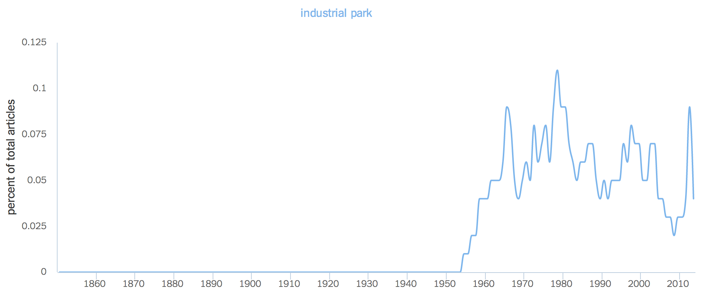
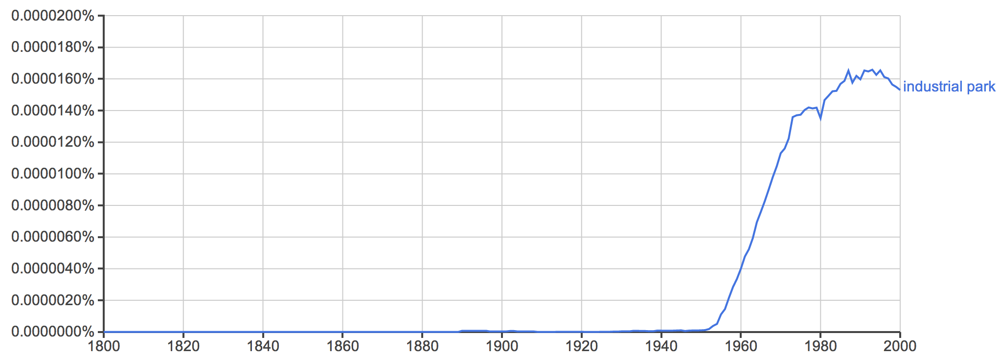
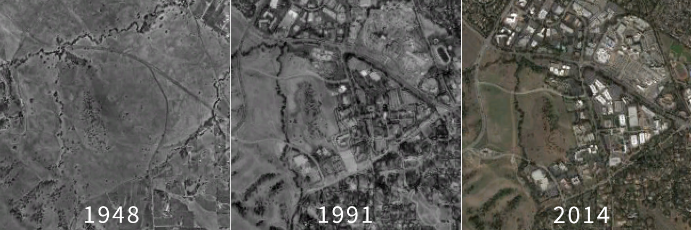
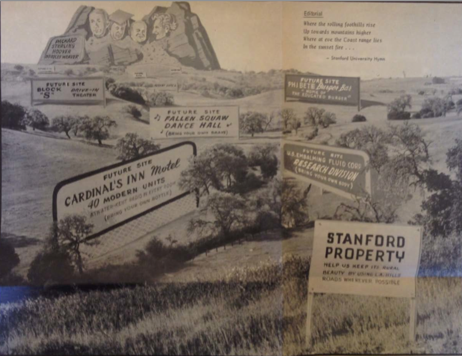
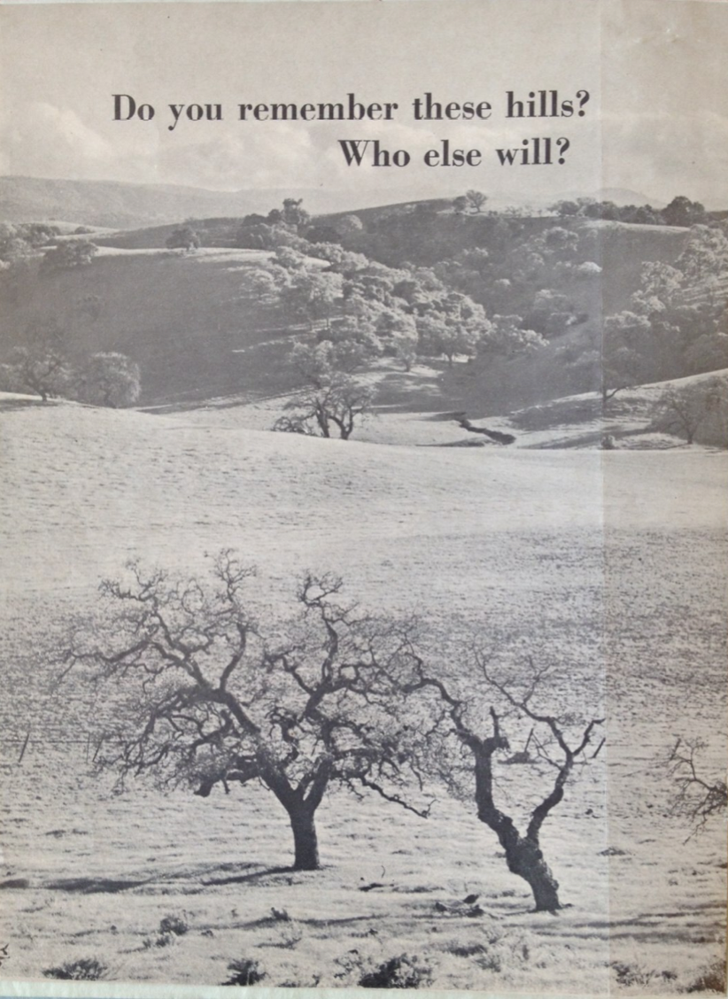
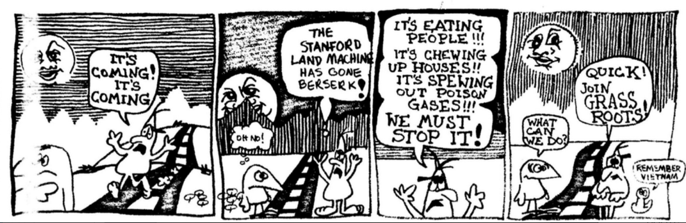

---
title: "Machines in the Garden: Suburban Environmentalism and Stanford Industrial Park"
author:
    - name: Jason A. Heppler
      affiliation: University of Nebraska-Lincoln
      email: jason.heppler@gmail.com
...

> Palo Alto is half bedroom suburb, half futuristic 1970s science fiction 
> movies. . . . The big thing about Palo Alto is that, as a city, it designs 
> tons of incredibly powerful and scarry shit inside its science parks, which 
> are EVERYWHERE.
> 
> -- Douglas Coupland, Microserfs (1995)

> Universities are rapidly developing into more than mere places of learning. 
> They are becoming major economic influences in the nation's industrial life, 
> affecting the location of industry, population growth, and the character of 
> communities. Universities are in brief a natural resource just as are raw 
> materials, transportation, climate, etc.
> 
> -- Frederick Terman (1963)

> This is your land we are talking about.
> 
> -- Bernard DeVoto (1947)

Carved out of the southeast corner of Stanford's vast land holdings on the San 
Francisco Peninsula, the Stanford Industrial Park became the epicenter of 
specialized manufacturing and research activities. By the 1960s Stanford 
Industrial Park had gained a reputation for industrial and technological 
innovation that would be mimicked around the country.^[@luger1991garden, 154; 
@abbott1995frontier, 61-68.] Like many other American colleges and 
universities, Stanford sought to capitalize on the burgeoning science and 
technology opportunities in order to fashion itself as a leader in academic 
research and become a powerful influence in the new industrial age in the 
American West. As the U.S. government pursued Cold War scientific research 
and development programs, places like Stanford Industrial Park fostered 
specialized science-based industries. The Industrial Park's founders succeeded 
so well in their mission to attract industry that the population exploded 
throughout the Peninsula.^[I'll refer to the Stanford Industrial Park and 
Industrial Park interchangeably.] Yet in the wake of these changes emerged a 
new critique of sprawl and industrialization. Newcomers and old-timers alike 
began to question the benefits of the new western economy and the impact it 
was having on the natural surroundings.

The story of Stanford University and conservationists provides an example of 
how the confluence of suburbanization, the growing Cold War science complex, 
and anxieties over the environment served to launch an environmental movement 
on the San Francisco Peninsula. 

## "The Miracle of Palo Alto"

The establishment of Stanford Industrial Park emerged from the confluence of 
several postwar trends: rapid suburbanization, the Cold War impetus for 
federal research and development, and the need for Stanford to diversify its 
finances. The Board of Trustees approved a plan to lease land to high 
technology companies in 1951 and quickly gained a reputation as a favorable 
site for burgeoning electronics companies.  Roughly five percent of Santa 
Clara County's workforce was employed in high technology or research and 
development in 1951 (compared to 9.4% in the US as a whole), and by 1986 the 
workforce reached twenty percent (compared to 8.5% in the 
US).^[@luger1991garden, 130.] The rapid industrialization around Stanford 
occurred just as several postwar trends were colliding. 

Stanford's entry into land development benefited from space and location. The 
railroad magnate and businessman Leland Stanford and his wife, Jane, founded 
the university in 1891 in the memory of their son Leland Stanford, Jr., who 
died at the age fifteen from typhoid fever. The Leland Stanford Junior 
University was established on Leland's vast farmland --- in total, nearly nine 
thousand acres of prime agricultural land --- and bestowed all of the land to 
the university with the stipulation that the university could lease the land 
however it saw fit but could never sell it. The university was the largest 
landholder on the Peninsula, and would own the land permanently. For sixty 
years after the university's founding, "The Farm," as it is colloquially 
known, would remain just that --- leasing most of its land for agricultural 
uses before becoming some of the most valuable land in the country by the 
mid-twentieth century.^[@omara2005cities, 100-103; @findlay1993magic, 120.]

World War II and the location of defense industries along the West Coast drew 
thousands of new residents to California in search of jobs after a decade of 
economic depression.^[On the mid-century migration to California, see 
@gregory1989okie. On the effects of World War II on the American West, see 
@nash1999landscape; @abbott1995frontier, chapter 1; @lotchin1993worldwarii; 
@lotchin1992fortress.] Between 1940 and 1947, the nine counties of the Bay Area 
became home for 676,000 more people, 330,000 new jobs, and $2.5 billion more 
in annual income.^[@omara2005cities, 103.] The burgeoning Cold War science 
complex, anchored by the Stanford Industrial Park, added an additional influx 
of people and capital to the region.  In 1950, Santa Clara County alone 
counted 800 factory workers, which jumped to 264,000 manufacturing workers and 
more than 3,000 electronics firms by 1980.^[@abbott2008cities, 
181. U.S. Bureau of the Census, 1960 Census, Santa Clara County, n.d., 
census.abag.ca.gov; U.S. Bureau of the Census, 1970 Census, Santa Clara 
County, n.d., census.abag.ca.gov; U.S. Bureau of the Census, 1980 Census, 
Santa Clara County, n.d., census.abag.ca.gov.] The towns around Stanford 
grew rapidly during and after World War II as middle-class families moved 
to the area to take advantage of new defense and related industries. 
Menlo Park, to the north of Stanford, grew from a town of 3,000 to 27,000 
between 1940 and 1960, while Palo Alto grew from under 17,000 to 52,000 
in the same period. To Stanford's chagrin, however, most commercial 
activity in the early postwar period located elsewhere on the Peninsula. 
The majority of commercial development around Stanford remained retail and 
services industries.^[@omara2005cities, 107.] If Stanford was to become 
the center of a new western economy and leading research center, they 
needed to pursue new industries. They found those industries by pursing 
government funds for science-based research and partnering with 
technology firms emerging in the area.

In the years after World War II, scientific funding by the federal government 
rose rapidly, that helped spur new industrial activity centralized around 
defense and military applications. In 1955, federal expenditures on basic 
research topped \$286 million, a figure that jumped to \$693 million by 1960 
and, just five years later, topped \$1.6 *billion*. The total research and 
development budget of the federal government had grown from eight percent to 
twelve percent in just ten years.^[@omara2005cities, 47.] Along the Peninsula, 
cities sought out new ways to attract defense industries to the area in order 
to capitalize on defense research contracts. Bay Area governmental 
associations, such as the Bay Area Council (BAC), sought to make California an 
industrial center not by replicating the industrial Northeast or Midwest but 
by promoting new industries.^[@omara2005cities, 106]

-------------------------------------------------------------------------------------------
Fiscal Year   Total Budget Outlays    R&D Expenditures    R&D as Percentage of Total Budget
-----------   --------------------    ----------------    ---------------------------------
1950          43,147                  1,083               2.5

1951          45,797                  1,301               2.8

1952          67,962                  1,816               2.7

1953          76,769                  3,101               4.0

1954          70,890                  3,148               4.4

1955          68,509                  3,308               4.8

1956          70,460                  3,446               4.9

1957          76,741                  4,462               5.8

1958          82,575                  4,991               6.0

1959          92,104                  5,806               6.3

1960          92,223                  7,744               8.4

1961          97,795                  9,287               9.5

1962          106,813                 10,387              9.7

1963          111,311                 12,012              10.8

1964          118,584                 14,707              12.4

1965          118,430                 14,889              12.6

1966          134,652                 16,018              11.9

1967          158,254                 16,859              10.7

1968          178,833                 17,049              9.5

1969          184,548                 16,348              8.9

1970          196,588                 15,736              8.0
-------------------------------------------------------------------------------------------

Table: Federal Research and Development Expenditures as a Percentage of the 
U.S. Budget, 1950-1970 (millions of dollars). Source: National Science 
Foundation, *Federal Funds for Research, Development, and Other Scientific 
Activities* (Washington: U.S. Government Printing Office, 1972), 3.

Regional electronics manufacturing grew quickly. The Western Electronics 
Manufacturers Association listed twenty members in the Bay Area in 1951; by 
1953 it counted fifty-three, and by 1974 listed eight-hundred and employed 
around 150,000 people. The bulk of new manufacturers created products for 
the Department of Defense and NASA. Between 1952 and 1968, electronics 
firms made at least half of their annual incomes from sales to the 
federal government for military and space programs.^[G. Bylinsky, 
"California's Great Breeding Ground for Industry," *Fortune Magazine* 
(June 1974): 133, 128-129, 130; @findlay1993magic, 145.]  Desires on the 
part of NASA and the Pentagon for compact systems of missile and rocket 
guidance as well as wars in Korea and Vietnam and the space race, 
electronics equipment accounted for as much as twenty percent of the cost 
of an aircraft and thirty percent of the cost for missiles. While 
southern California built the aircrafts, northern California provided the 
electrical components.^[*Blue Sky Metropolis: The Aerospace Century in 
Southern California*, ed. Peter Westwick; @findlay1993magic, 143-144; 
Albert Shapero, Richard  Howell, and James R.  Tombough, *An 
Exploratory Study of the Structure and Dynamics of the R&D Industry* 
(Menlo Park, Calif., 1964), 23-25; @saxenian1983genesis, 27; Santa Clara 
County, Calif., Planning Department, *Study of the Economy of Santa Clara 
County*, 10-11; Siegel and Markoff, *High Cost of High Tech*, 8-9; SRI 
International, *The Role of Defense in Santa Clara County's Economy* 
(Washington, D.C.: 1980), v-vii.]

To many observers in the 1950s and 1960s the center city appeared to be in 
decline in the face of traffic congestion, vacancies, abandoned property, and 
political patronage. Urban renewal attempted to overcome such challenges 
through the eviction of tenants, the destruction of aging buildings, the 
rezoning of land, the construction of new freeways, the creation of large 
parking lots, new corporate lots, and the segregation of poorer citizens to 
low-income housing. The center city had become undesirable – noisy, crowded, 
expensive, and old. The suburbs offered a sense of improvement and a brighter 
future. New investments by local governments, real estate developers, the 
construction of federal- and state-funded roads, and large swaths of land 
provided a low-density, affordable, and automobile-accessible location for 
middle-class Americans.^[@mozingo2011pastoral, 7-8; @findlay1993magic, chapter 
3; @omara2006uncovering; @fogelson2001downtown; @beauregard2003decline; 
@weiss1987community; @jackson1985crabgrass, 268-269.]

Stanford Industrial Park's location reflected the growing suburbanization of 
corporations.^[The best accounts of Stanford Industrial Park's planning and 
development can be found in @omara2005cities, 99-124, and @findlay1993magic, 
129-142. See also @mozingo2011pastoral, chapter 2.] Thirty-three industrial 
parks existed in the United States in 1940, quickly rising to 307 by 1957. The 
increase in industrial parks coincided with industries becoming less likely to 
locate within cities, leading to 75 percent of parks built after World War II 
being located in areas whose populations were between 25,000 and 500,000 
people. By the 1950s, parks were locating outside of city centers in favor of 
suburbs, allowing firms in the parks to take advantage of a nearby workforce, 
new tax benefits, avoiding traffic congestion, bypassing old infrastructure, 
and locating out of reach from unions in older industrial cities. Although 
many firms remained in city centers to take advantage of certain benefits -- 
proximity to services such as public transportation -- many located themselves 
in suburban areas.^[@omara2005cities, 66; @findlay1993magic, 118; 
@luger1991garden, 1-13.] The suburbanization of industry led land developers 
to adhere to higher standards in urban design.  The real estate consultancy 
Arthur D. Little, Inc., noted in 1958 that industrial parks were organized 
according to "a comprehensive plan" designed to "insure compatibility between 
the industrial operations therein and the existing activities and character of 
the community in which the park is located." These parks were designed 
according to "proper setbacks, lot size minimums, land/use ratio minimums, 
architectural provisions, landscaping requirements, and specific use 
requirements" in order to maintain a "harmonious integration into the 
neighborhood."^[Quoted in @omara2005cities, 65.] The principles of open spaces, 
architectural uniformity, and land use restrictions shaped the spatial influence 
parks had on suburban areas as well as the suburban design of the parks themselves.

An additional influence on the design and location of industrial parks was the 
Cold War policy of industrial dispersion. Fears of a potential "total war" 
with the Soviet Union prompted officials in Washington to pursue industrial 
dispersion as an official policy. A presidential order issued in August 1951 
ordered the movement of government agencies "out of dense urban cores" and 
specifically noted the policy's importance to "the dispersal of new and 
expanding industries." The dispersal policy encouraged the movement of 
industry to "areas adjacent to industrial or metropolitan districts in all 
sections of the country." Such areas needed to be ten to twenty miles from a 
potential nuclear ground zero. The dispersal of industry to suburban areas 
meant fulfilling the policy directives while also maintaining proximity to 
employees, manufacturing facilities, and the infrastructure of central 
cities. The suburb was the ideal industrial area.^[@omara2005cities, 28-38; 
policy quotes from @omara2005cities, 38-39; @jackson1985crabgrass, 249.]

Affluent suburbanites were willing to take advantage of new tax revenues and 
job opportunities present in new industries, but were unwilling to accommodate 
those industries if they had an affect on their quality of life. A 1958 
pamphlet from the Palo Alto Chamber of Commerce noted that, just a few years 
after the opening of the Stanford Industrial Park, the city was "a well 
planned community with a favorable atmosphere for light industry."^["Light 
Industry in the Palo Alto Area," 1958, Folder 5 Palo Alto History, Box 5 
ARCH-1990-052, Stanford University Land Use Planning Office, Stanford University Archives,  1.] 
Smokestacks, traffic congestion, and air or noise pollution would not be 
tolerated, and new industries were quick to point out that their brand of 
industrialization would not carry such blemishes on the landscape.

Spatial ideas for industrial design shaped where and what sorts of industries 
moved into the Stanford Industrial Park. The Industrial Park's location itself 
was a product of spatial thinking. Silicon Valley's growth achieved its 
prominence thanks to the availability of land. Unlike the dense metropolitan 
areas of New York and Atlanta, where decades of urbanization meant new high 
tech ventures were restricted to existing infrastructure, the Valley had the 
space necessary to accommodate new manufacturing and industrial buildings. 
Stanford especially was well-suited to provide the physical space necessary 
for low-rise, horizontal buildings. As the largest land owner on the 
Peninsula, the university had the unique opportunity to lease chunks of its 
nearly 9,000 acres to pursue nonacademic uses for its lands.^[The importance 
of space to develop and its comparisons to Philadelphia, Atlanta, and Palo 
Alto is most thoroughly argued by @omara2005cities.] Not only would industry 
have room to build the sprawling warehouses and manufacturing facilities, but 
they would be able to follow Stanford's strict design guidelines for green 
belts, landscaping, hidden parking areas, wide lawns, and abundant trees. In 
this way, Stanford envisioned a corporate suburban nature that blended into the 
surrounding communities and architectural design of the campus.

The spatial distribution of industry followed a postwar trend in industrial 
design and development. Industry no longer developed in central cities as it 
historically had. Rather, industrial manufacturing sought cheaper and more 
spacious outlying lands that had adequate space for parking, loading 
facilities, and room for plant expansions. Industries also sought more 
amenable work environments. City ordinances in the latter half of the 
twentieth century began pushing industry to less desirable areas of cities, 
while industrial facilities sought the same amenities as suburbanites: a 
pleasant environment, suburban neighborhoods, distance from urban problems, 
and lower taxes, while remaining in proximity of city services and 
infrastructure.^[@findlay1993magic, 120; Santa Clara County, Calif., Planning 
Department, "Directory of Industrial Parks and Industrial Districts in Santa 
Clara County," *InfoCommentary: Industrial Districts* 1 (January 1966): 1; 
Robert E. Boley, "Rx for Successful Industrial Park Development," *Urban Land* 
26 (June 1967): 3; Victor Roterus, *Planned Industrial Parks: A Case Study* 
Washington, DC, 1960), 3-4.]

Industry had another reason to locate near suburban areas: to strengthen its 
ties to research institutions. Stanford actively pursued close ties with 
business. As early as 1945, University President Donald Tressider remarked he 
"hope[d] that in the postwar period Stanford will draw very much closer to 
business and industry than it has in the past --- by means of cooperative 
undertakings we hope to develop more and more projects in which both the 
University and business will have a legitimate stake."^[Quoted in 
@omara2005cities, 106.] In the postwar era, high ranking officials and 
professors supported the business/university expansion. Among the most 
enthusiastic supporters of recruiting and supporting the new economy on the 
Peninsula was Frederick Terman, the university's first dean of engineering 
and, later, provost. Terman had spent the war in Cambridge, Massachusetts, 
studying radar projects under Vannevar Bush. When he came to Stanford after 
the war, he used what he learned to begin building a new research agenda for 
the university. The growing availability of federal research month meant 
support for the university's pursuit of academic reputation in addition to 
becoming a key player in Cold War research. Due to Terman's efforts, he has 
been labeled the "Father of Silicon Valley."^[@omara2005cities, 106-110; 
@gillmor2004terman; @findlay1993magic, 122-125; @leslie1996selling; 
@leslie2000angel, 48-67; @lowen1997creating, chapter 4.]

To further cement the relationship with the university and business, Terman 
helped established two educational programs. Starting with the Honors 
Cooperative Program that allowed employees of surrounding electronics 
companies to study part-time towards a master's degree at Stanford, and later 
with the Industrial Affiliates Program, which allowed companies 
pre-publication access to scientific and technical military-sponsored 
research. The two educational programs sought to benefit both industry and the 
university and strengthen the ties between the university and 
industry.^[@lowen1997creating, 130-131.] To continue supporting such programs, 
leaders in the university concluded that industry needed to develop near 
campus. In the early 1950s Stanford began leasing land to light industry and 
commercial and residential developers.^[@lowen1997creating, 131.]

Stanford's additional motivations for pursing the creation and growth of the 
Industrial Park included finances. The university faced financial dilemma by 
1950, and hoped that the Industrial Park could become a money-making venture 
to support the university. In the years prior, returning veterans of World War 
II, aided by the GI Bill, brought a wave of new students to the university. 
Stanford's income peaked in 1946-1947, when income from tuition amounted to 
sixty percent of the university's income. By 1952, despite raising tuition, 
income fell to 47 percent. Between 1940 and 1950 income from endowment fall 
from 29 percent to 16 percent of total income in general for private 
universities, figures that were similar to Stanford's 
own.^[@lowen1997creating, 150; "Questions and Answers About Stanford Land 
Use," *Campus Report Supplement*, January 1971, 1, Page Mill Road Coordinating 
Committee Records, Folder 16, Box 1, Stanford University Archives.] The pursuit of land development 
projects and federal grants and contracts proved to be a lucrative business. 
In the 1950s Stanford's income rose from less than \$2 million in 1951 to over 
\$8.3 million by 1960, the bulk of which came from Department of Defense and 
Atomic Energy Commission grants.^[@omara2005cities, 109.]

Stanford never ran short of potential tenants attracted to the suburban design 
of the park and its proximity to university researchers. The university 
privileged those companies working in high technology and medicine --- and 
thus contributed to Stanford's educational and research programs --- and 
welcomed several companies to the park, including Eastman Kodack, Varian 
Associates, Hewlett-Packard, Syntex Pharmaceutical, and Lockheed Missiles. The 
park expanded quickly as its reputation grew. In 1955, only seven tenants 
occupied fifty-three acres of the Industrial Park. By 1962 the number had 
jumped to forty-two tenants occupying 360 acres (around half of the available 
space) and employed 11,000 people. By 1970, the number of tenants had reached 
fifty, occupied 500 acres, and employed 17,000 people. The rents generated 
tremendous profits for the university, by 1978 reaching an annual profit of 
\$4.3 million, while also generating another \$13.5 million in tax revenue and 
utility payments for the city of Palo Alto.^[City of Palo Alto, Calif., *Palo 
Alto Comprehensive Plan, 1977-1990* (Palo Alto, 1976), 15; @findlay1993magic, 
140.] The "electronics-nuclear space-age . . . is accelerating the 
transformation of the Palo Alto area into one of the country's most important 
national defense facilities," wrote *The Tall Tree*, the publication of the 
Palo Alto Chamber of Commerce, in 1958. "The Palo Alto-Stanford research 
community has grown to become an integral part of the science community of the 
nation."^["The First Fifty Years of Electronics Research," *The Tall Tree* 1:9 
(May 1958), 3, FF Palo Alto History, SC 486, 90-052, Stanford University Archives.]

Stanford sought to aid its land development plans by establishing a campus 
planning office after the war. In 1947, the university hired Lewis 
Mumford to study how the university could best use its land. The university, 
however, largely ignored Mumford's advice to concentrate urban development and 
retain the "rural setting" of the university. The draw of suburban development 
was too desirable for Stanford to resist. Financially, the university needed 
new avenues of funding. External pressures were also pushing the university 
towards land development. Agricultural rents barely covered the taxes on the 
land. In 1953, the university commissioned the San Francisco architectural 
firm Skidmore, Owings, and Merrill to suggest land use plans.  They developed 
the 1953 Master Plan that emphasized an "integrated community." Thinking of 
the area as a suburb of San Francisco, the plan emphasized high-income housing 
rather than "small, attractive, light industry plants." They concluded by 
calling for Stanford to preserve the "present character of the entire suburb 
area."^[@omara2005cities, 112-115; Skidmore, Owings, and Merrill, *Master Plan 
for Stanford Lands 1953: Report to the Board of Trustees, Stanford 
University* (San Francisco, 1953; Land Development, General file, Stanford University Archives.] The university rejected the suggestions of the 
firm. The Advisory Committee on Land and Building Development wrote to 
University President Wallace Sterling that the university needed to focus on 
attracting "a wide variety of national and regional activities which have a 
direct and immediate value to the University." Such activities revolved around 
industry.^[Stanford University Advisory Committee on Land and Building 
Development, "Master Plan for the Stanford Lands: A Review of the Skidmore, 
Owings, and Merrill Report," June 1, 1954, Land Use and Development file, Stanford University Archives, 
2-5, 7-9.]

By the mid-1950s Stanford's land development program focused on high-end 
housing, a regional shopping center, and an industrial park. Academic and 
industrial reserves quickly grew; by the 1960s 5,300 acres were set aside for 
the campus. Acreage for industry and non-academic uses by 1960 amounted to the 
largest segment of Stanford land use except for the main campus. The 
Industrial Park was underway before the 1953 Master Plan. The Board of 
Trustees authorized a light-manufacturing district in the southeast corner of 
the university's land holdings in 1951. The first tenants arrived a year 
later.^[@findlay1993magic, 129-141. See also @lowood1988steeples.]

To have the continued support of Palo Alto and surrounding communities, the 
university recognized the importance of suburban industrial planning. To 
achieve this, Stanford required new facilities to mirror the open, lush, 
low-rise, and architecturally appealing design of the university. Stanford 
maintained close control over the design of buildings and the landscaping of 
the surroundings. New tenants were required to submit plans detailing 
off-street parking, green space, roads, setbacks, location, and type of 
industry. The University required that open space had to be 60% larger than 
the space occupied by buildings. No buildings could be larger than 
two-stories, forbade smokestacks, and prohibited noise, odor, and emissions 
that might disturb the neighboring suburbs.^[Palo Alto Planning Commission, 
"*Report on the Interim General Plan* (Palo Alto, April, 1955), 42-43; 
@findlay1993magic, 131; @omara2005cities, 119-120.] 

The development of Stanford Industrial Park marked the emergence of the modern 
West: a region less reliant on what economist Thomas Michael Power called 
"folk economics" and more reliant on postindustrial economies of tourism and 
technology.^[@power1996landscapes, 19-21.] The economic shift meant a cultural 
shift as well. As farmland, pastures, and ranches became subdivisions, 
technology companies, research firms, and service industries, the new economic 
activity began to reshape how people thought about the Valley. Namely, the 
expansion of industry carried with it a contentious debate about the effects 
of industrialization on the Valley's landscape and over how it would be 
shaped.^[On postwar suburban growth, see @jackson1985crabgrass; 
@fishman1987bourgeois, 155–81; @abbott1995frontier.] By the late 1950s 
residents in Palo Alto began seeing the Industrial Park as a threat to their 
suburban lifestyles, especially visible through increased traffic, industrial 
development of the foothills, contributions to air and noise pollution, and 
rising housing costs. In 1960, these concerns boiled over and, inadvertently, 
helped launch an environmental movement. 

## Nature, Identity, and the Battle of the Hills

Anxieties over suburban growth and issues of clean air and water, open space, 
sprawl, and pollution defined environmental politics in the Bay Area. Postwar 
American environmentalism largely became issues over quality-of-life as new 
worries about chemicals used in products, pollution of water resources, 
pesticides, and overrun national parks became key political issues. The 
publication of bestselling books, including Stewart Udall's *The Quiet Crisis*, 
Rachel Carson's *The Silent Spring*, and Paul Ehrlich's *The Population Bomb*, 
made the case for greater regulation of urban growth and pollution. The 
passage of new legislation embodied new attempts to protect land, air, and 
water, such as the Wilderness Act of 1964, the National Environmental Policy 
Act of 1970, the creation of the Environmental Protection Agency, the Clean 
Air Act of 1972, and Endangered Species Act of 1973.^[On the emergence of 
wilderness protection, see @turner2012wilderness; @nash1967wilderness; 
@harvey2005zahniser; @sutter2002driven; @nicholas2003imagining. The historiography of the 
environmental movement is vast. See, for example, @hays1987beauty; 
@rome2001bulldozer; @rothman2000saving; @wellock2007environmentalism; 
@shabecoff2000rising; @scheffer1991environmentalism; @gottleib2005forcing.]

Against this backdrop, rapid growth in western cities encouraged new concerns 
about their environmental impact, which had the effect of shaping local and 
regional politics. World War II defense industries, Cold War military and 
industrial buildup, and tourism and recreation encouraged the growth of 
western cities, and, while growth brought new prosperity and wealth, it also 
unsettled westerners who watched rural landscapes vanish under four-lane 
highways, parking lots, office buildings, and residential developments. By the 
1960s, some westerners began pushing back against the tide of change and 
fueled new antigrowth and environmental politics throughout the region. 
Comprised mostly of middle-class professionals, suburban liberals and 
conservatives found common ground over environmental damage, uncontrolled 
growth, poor planning and development, trampled wilderness, and disappearing 
open space.

The economic and infrastructural changes wrought by World War II, the 
militarization of western industry, and the growing recreational and tourism 
economy led to breakneck metropolitan growth throughout the region between 
1940 and 1960. Westerners witnessed diminishing rural lands, growing suburbs, 
and four-lane highways, giving rise to a cultural and political backlash 
throughout the region that manifested itself in antigrowth activism and 
quality-of-life politics. Largely comprised of middle-class professionals, 
metropolitan growth and environmental and social problems identified by growth 
and quality-of-life activists lay at the center of their motivations. The 
millions of Americans coming to western states like Colorado, Oregon, and 
California since World War II came to take advantage of these state's air 
quality, federal public lands, recreation, and economic opportunities. By the 
1960s, however, newcomers and old-timers alike believed too many people were 
moving in and threatening their quality of life.^[On quality-of-life politics, 
see @abbott2008cities, 205; @carney2007suburbanizing, 480-481; @scott2008hip, 
253-255; @childers2012ski, 71-73.] 

In California, rapid growth brought prosperity to the state, but by the 1960s 
Californians were questioning these benefits.  Stanford was aware of a growing 
constituency in Palo Alto that was critical of the university's land 
development policies. Alf Brandin, the university's Vice President of Business 
Affairs, noted in a local town meeting that "certain factions in attendance" 
were trying to convince homeowners that "industrial property, as such, holds 
little or no advantage for the City of Palo Alto. . .  . I took the 
opportunity of presenting a point of view that industrial property, as we are 
planning and developing, has a great many more advantages to the City of Palo 
Alto than otherwise."^[Quoted in @omara2005cities, 133.] Stanford officials 
would continue this line of reasoning throughout the 1950s and 1960s in the 
face of growing criticism.

In 1960, a short but intense fight over the proposed industrial development of 
the Stanford foothills to the southeast of the main campus marked the 
beginning of a cultural and political shift in the Bay Area. Stanford 
announced in January plans to expand foothills development southward from the 
existing Industrial Park. In particular, Stanford received interest from the 
Ampex Corporation, a manufacturer of high-end sound recording and broadcasting 
electronics, to build a new research facility in the foothills. Surrounding 
neighborhoods, however, fiercely opposed the development on Stanford's 
property eventually leading to a referendum campaign. Stanford President 
Wallace Sterling referred to the year-long contest as "the Battle of the 
Hills."^[Letter from Wallace Sterling to John Francis Neylan, April 11, 1960, 
Folder 8, Box A29, SC 216, Stanford University Archives. Margaret O'Mara 
provides an excellent overview of the Battle of the Hills in 
@omara2005cities, 132-139.] 

Roughly six-hundred acres of undeveloped university land lay between Junipero 
Serra, West Fremont, Arastradero, and Page Mill roads. Originally zoned for 
residential development, Stanford administrators submitted an annexation 
proposal to the City of Palo Alto, who would then have the authority to rezone 
the land for light industry. Electronics manufacturers had already sought out 
the area as prime real estate for establishing research facilities, taking 
advantage of nearby residential neighborhoods for employees to live, proximity 
to researchers at Stanford and the Industrial Park, established city 
infrastructure, and a favorable tax climate. In January 1960, Ampex and 
General Telephone and Electronics Laboratories Corporation (GT&E) announced 
plans to build or expand their operations in the Stanford foothills both north 
and south along Page Mill Road, in part to take advantage of the proposed 
route of the new Junipero Serra Freeway.^["Ampex plant just first in Stanford 
plan," *Palo Alto Times*, January 14, 1960, 2; "Electronics research plant 
planned for foothills area," *Palo Alto Times*, January 28, 1960, 1; letter 
from Wallace Sterling to Gordon Johnson, March 16, 1960, FF8, Box A29, SC 216, 
Stanford University Archives.] Additional development plans were laid out for 
a new shopping center and luxury homes in the Palo Alto-Los Altos Hills 
foothills.^["103-acre foothill plan told," *Palo Alto Times*, January 29, 
1960, 1-2.] In May 1960, the Palo Alto City Council approved the rezoning in a 
9 to 4 vote.^[Letter from Thomas Hunt to Alumni, May 9, 1960, 2, Folder 8, Box 
A29, SC 216, Stanford University Archives.]

Residents had few objections for the proposed residential and shopping center 
developments in the foothills. Industrialization, however, was unacceptable. 
Ampex's proposed eighty-acre development location ran up against resistance 
from neighboring communities, fueling quality-of-life and environmental 
politics in surrounding neighborhoods. The proposed site ran along the Los 
Altos Hills city line and raised concerns among property owners and Los Altos 
Hills city officials who feared the loss of scenic beauty and the residential 
ambiance of the area.^["Decision now will determine future," *Palo Alto 
Times*, February 11, 1960, 16.] Furthermore, residents were growing suspicious 
of Stanford's role as a land developer and disregard for planning. One 
resident summed up the issue saying, "there has been growing concern over 
Stanford's policy of presenting pre-packaged zoning requests. . . . They 
resemble closely the tactics of many a Land Developer asking for variances 
from planned uses."^[Morgan Stedman, text of prepared meeting with Sterling, 
March 14, 1960, FF11, Box A29, SC 216, Stanford University Archives. Quoted in @omara2005cities, 
136.] Another resident wrote the Stanford Board of Trustees urging the 
foothills to remain closed to industrial development: "The Peninsula is 
already too crowded -- therefore, new industry should not locate 
here."^[Letter from Mrs. H.  Wilson to Stanford Trustees, March 4, 1960, 
FF8, Box A29, SC 216, Stanford University Archives.] Palo Alto resident Richard Bell in a letter to 
Sterling lamented the "program of land exploitation pursued by the school 
during the past ten years" which has "succeeded . . . in eliminating much 
of the natural beauty and attraction . .  . [that] contributed so much 
toward making Stanford the top school in the west."^[Letter from Richard 
Bell to Wallace Sterling, August 2, 1960, FF8, Box A29, SC 216, Stanford University Archives.] The 
goals of Stanford's development plans were unclear to residents which, from 
their perspective, seemed to indicate Stanford was planning to overrun the 
natural beauty of the area.^[Letter from Thomas Hunt to Wallace Sterling, May 
14, 1960, Folder 8, Box A29, SC 216, Stanford University Archives.]

Complaints of potential industrialization of the foothills reflected not only 
arguments about the area's beauty, but also noise and air pollution that 
accompanied development. The sounds of hammers driving nails into two-by-fours 
were only part of a chorus of common sounds experienced by suburbanites. The 
whirring and grinding of manufacturing equipment, the clattering of dump 
trucks, the drone of automobile traffic, the belching of bulldozers -- these 
became common sounds of the growing city. Concerned that such realities would 
become even more common in Palo Alto, critics spoke up in newspaper editorials 
and letters. In a letter to the *Palo Alto Times*, Morgan Stedman, a member of 
the Santa Clara County Planning Commission, argued that new foothills 
industrialization would increase traffic flow through neighborhoods, thus 
increasing smog, noise, and danger, large-scale cutting and filling of land 
would be required to support new buildings, parking lots, and roads, the loss 
of rainwater through runoff, and "irreparable damage to natural 
beauty."^[Newspaper clipping, "Area planning seen as needed," *Palo Alto 
Times*, March 12, 1960, from FF8, Box A29, SC 216, Stanford University Archives.]

The spatial arrangements of cities and zoning shaped how residents responded 
to the proposed industrialization. The foothills area  was originally zoned 
for residential or agricultural use and excluded the establishment of 
industrial and commercial developments. Furthermore, the community of Los 
Altos Hills incorporated as a residential-only city. But encroachments of 
industry into these areas raised concerns about the potential environmental 
damage that industrialization would bring to surrounding communities. Stanford 
claimed that the industrialization would result in clean and well-kept 
facilities, reassuring residents that the smoke pollution of the Midwest and 
East would never be present in Santa Clara Valley.^[Transcript of interview 
with Alf Brandin by Bob DeRoos, Regional Oral History Office, The Bancroft 
Library, University of California-Berkeley, n.d., 42.] 
However, a greater concern for local residents revolved around the issue of 
smog and traffic.  In a letter to Wallace Sterling, one resident summed up the 
attitude of many of the area's environmental critics:

> We now have smog, congestion, and acres of asphalt where we once had fresh 
> air and freedom of movement in a beautiful countryside -- in one of the 
> finest climates on earth! The responsibility for developing such a unique 
> area should be in the hands of the most intelligent and PERCEPTIVE people 
> available! There seems to be little concern about total environment. . . . 
> The area sorely needs parks, golf courses, and low density housing. We need 
> cultural and recreational centers for all age levels. A University such as 
> Stanford could well promote an interest in fields that enrich life. 
> Industrial and commercial interests are far from being neglected but the 
> humanities certainly are!^[Letter from Gordon Johnson to Wallace Sterling, 
> March 6, 1960, FF8, Box A29, SC 216, Stanford University Archives.]

Heavy commuter traffic, smog, concerns about the loss of the foothills 
pastoral beauty, and Stanford's seemingly smug handling of community relations 
resulted in new political energy that would spread through the community and 
alumni networks.^[@omara2005cities, 135; letter from Jerrold and Sara Hunt to 
Wallace Sterling, May 14, 1960, 1, Folder 8, Box A29, SC 216, Stanford University Archives.]
In the wake of such concerns and criticisms, ad hoc community and 
environmental coalitions formed, led by the Citizens Committee on Regional 
Planning (CCRP). The organization, under the initial leadership of Robert 
Mahan, an insurance executive from Palo Alto, organized a letter writing 
campaign to voice their opposition to the foothills proposal. A few weeks 
before the group officially named itself, some of the founding members ran an 
insert in the *Palo Alto Times* that urged readers to clip from the paper and 
mail to the Stanford Board of Trustees to illustrate grassroots opposition to 
industrialization.^["Anti-foothill industry drive launched here," *Palo Alto 
Times*, March 8, 1960, 2; "Industry opponents organize, name head," *Palo Alto 
Times*, March 11, 1960, 1.] Within two days of publishing the letter, the 
Stanford Board of Trustees had received 250 letters voicing opposition to the 
plan, many of which were clipped from CCRP's *Palo Alto Times* 
insert.^["Industry opponents organize," *Palo Alto Times*, March 11, 1960, 1; 
"13 residents protest foothill zoning change," *Palo Alto Times*, March 4, 
1960, 17.] 

Resistance from residents targeted the city council as well. The 
Palo Alto Residents Association (PARA) called for "a vigorous campaign" 
against the Palo Alto City Council's plans to allow industrial development in 
the foothills.^["Residents oppose industry," *Palo Alto Times*, March 10, 
1960, 1. Residents also pointed to a potential conflict of interest 
relationship between Palo Alto Mayor Noel Porter and David Packard. Porter was 
serving as vice president of Hewlett-Packard at the time. See "Industry 
opponents organize, name head," *Palo Alto Times*, March 11, 1960.] Peter 
Hughes, an officer of PARA, charged that developing the foothills would 
destroy the landscape. Calculating that the Ampex site would cover thirty 
acres of parking lot and another twelve acres for buildings, Hughes challenged 
that "if anyone can lay down that amount of building without changing the 
contour of the land he is an engineer the like of which I have never 
seen."^["Residents oppose industry," *Palo Alto Times*, March 10, 1960, 1.] 
Other residents charged that industrialization of the foothills would 
inevitably result in the ruin of a pastoral landscape, no matter how much 
planning went in to the design of industrial areas.^[Letter from Gordon 
Johnson to Wallace Sterling, March 6, 1960, 1-2, Folder 8, Box A29, SC 216, 
Stanford University Archives; letter from Jerrold and Sara Hunt to Wallace Sterling, May 14, 1960, 1-2, 
Folder 8, Box A29, SC 216, Stanford University Archives.] Los Altos Hills resident Thomas Hunt put it 
more bluntly: "The foothills can be kept green and will be kept green, IF WE ARE 
DETERMINED TO KEEP THEM SO!"^[Letter from Thomas Hunt to Alumni, May 9, 1960, 
2, Folder 8, Box A29, SC 216, Stanford University Archives.]

The neighboring community of Los Altos Hills also expressed their disapproval 
of the plans. Residents, irate that their residential-only incorporation would 
be blemished by industrialized foothills, expressed their displeasure through 
letters and newspaper editorials. Mayor John Fowle and the city council 
rebuffed Stanford in a letter to Alf Brandin, accusing Stanford of 
"jeopardizing existing zoning and land development" and charged that the 
university's plans were never "subject to public scrutiny." Furthermore, 
contrary to Stanford's claims that it was working with surrounding 
communities, Los Altos Hills claimed it was caught unaware of the university's 
plans.^["Stanford foothills plans hit by Hills," *Palo Alto Times*, February 
10, 1960.] Sterling responded to one such letter claiming that "Stanford has 
made a conscientious effort to keep the communities surrounding the campus 
informed of our plans, an effort which could easily be documented."^["Sterling 
Answers Alumni," *Palo Alto Times*, February 24, 1960, Folder 11, Box A29, SC 
216, Stanford University Archives.] Letters continued to pour into Stanford and the *Palo Alto Times*. 
President Sterling received around 400 letters in opposition to the plan and 
around fifty in support over the course of four months.^[@omara2005cities , 
134.] The editorial pages of the *Palo Alto Times* also became a key outlet 
for residents to voice their frustrations and concerns.

For its part, Stanford pushed back by arguing that it needed to develop the 
lands in order to generate income for the University. Thomas Ford, staff 
council for the university, claimed that he desired to see the land remain 
undeveloped but "the university's need for funds makes that 
impossible."^["Foothills industry can be beautiful," *Palo Alto Times*, March 
2, 1960.] Stanford had good reason to pursue this line of argument. The 
university had indeed fallen on financial hard times, and its endowment was 
far below its peer institutions.^[@lowen1997creating, 130.]

Stanford continued their refrain that the development of the foothills would 
not become industrial blight, but rather, in the words of Thomas Ford, would 
"be a thing of beauty" due to the University's enforcement of strict design 
regulations.^["Foothill industry can be beautiful," *Palo Alto Times*, March 
2, 1960.] Furthermore, Stanford positioned itself as a reluctant land developer 
only in the business of supporting education and research. Alf Brandin 
took to the pages of the *Palo Alto Times* to argue that the university 
was not "in the land development business per se" but that the university 
was "doing everything we possibly can to produce income [to support 
education]."^["Undeveloped acres prime resource," *Palo Alto Times*, 
March 4, 1960.] "People should feel thankful Stanford owns the land and 
not someone else," Brandin chided. "We try to look at the problems 
politically, sociologically, aesthetically, and economically."^["Stanford 
wouldn't do anything detrimental," *Palo Alto Times*, March 4, 1960.] 
Stanford urged residents to realize the role the university had played in 
preserving open space, the role residents played in causing traffic 
congestion, and Stanford's road construction efforts. Without Stanford, 
the university seemed to argue, none of these improvements would 
exist.^["Foothills industry can be beautiful," *Palo Alto Times*, March 
2, 1960; "Stanford wouldn't do anything detrimental," *Palo Alto Times*, 
March 4, 1960; Letter from Gordon Johnson to Wallace Sterling, March 6, 
1960, FF8, Box A29, SC 216, Stanford University Archives.]

When letter and editorial campaigns failed to initiate the planning that 
critics wanted to see, they turned to the next available civic tool: the 
referendum. In June a petition campaign initiated by opponents of foothills 
industrialization circulated through Palo Alto. The petition called on the 
city council to either rescind its decision to rezone the land for light 
industry or to allow residents a vote on the issue. Four days before the 
rezoning ordinance was to become official, the referendum petition was filed 
to the city having collected over two thousand signatures, well above the 
necessary 1,000 that was needed. The Stanford lands were now in the hands of 
the voters. Placed on the ballot for the November elections, a "yes" vote 
would allow for Stanford to carry forward with its expansion of the Industrial 
Park and pave the way for Ampex's research facility.^[Details about the 
petition's criticisms and intent can be found in a letter from Morgan Stedman 
to Wallace Sterling, June 20, 1960, FF 8, Box A29, SC 216, Stanford University Archives. In an 
explanatory sheet given to solicitors and signers of the petition, the 
referendum called for better planning of residential, industrial, and 
commercial areas and specifically criticized the sudden zoning change to light 
manufacturing, housing and traffic pressures that new industrialization would 
add to the area, the leveling of hills to accommodate new construction, and 
pointed to undeveloped lots already zoned for industry as alternatives to 
foothills development. Letter from Stedman to Sterling, June 20, 1960, FF 8, 
Box A29, SC 216, Stanford University Archives.]

As referendum supporters spent the month of June collecting signatures, 
additional pressure to alter land development policies came from Stanford 
alumni. In June, a group calling themselves the Bay Area Stanford Alumni 
printed an insert in the *Stanford Review*, the alumni news organ of the 
University, accusing Stanford of ignoring land development policies 
implemented by the Board of Trustees in 1958. The petition called on Stanford 
to find alternatives for earning money other than "defacing the beauty of the 
green and summertimes golden hills" and called on the university to consult 
with the master plans of surrounding communities before making plans to rezone 
nearby areas.^["A Message from Bay Area Stanford Alumni to President Sterling 
and the Board of Trustees," 1960, FF 8, Box A29, SC 216, Stanford University Archives, p 2-3.] 

The *Review* was quick to distance itself from the Bay Area Stanford Alumni. 
In the issue in which the insert ran, Kemper Freeman, president of the 
Stanford Alumni Association, noted that the alumni organization "emphatically 
disagrees with the views and impressions" of the insert. The *Review* ran the 
insert, Freeman argued, because the periodical "stands for freedom of 
expression," but "reject[ed] their assumptions, criticisms, and 
conclusions."^[Kemper Freeman to Stanford Alumnus, Stanford Review, June-July 
1960, Folder 8, Box A29, SC 216, Wallace Sterling Papers, Stanford University Archives,  1.] Freeman 
placed distance between the alumni association and the Bay Area group, noting 
that the group's members accounted for "less than half of one per cent of the 
total" number of Stanford alumni living in the Bay Area. Kemper's letter 
responded to the insert's criticism point by point, arguing that the Stanford 
lands were "never intended to be a wilderness" and concluded that the 
development of lands not "needed for academic purposes is overdue." 
Furthermore, the insert gave "no hint" that Stanford was "preserving 4,800 of 
its 8,800 acres for academic purposes or that this reserve includes the 
greater part of the 'rolling hills.' Nor does it reveal that for every two 
acres of its land which Stanford has leased in the past decade, one acre has 
been condemned for use by some governmental unit or agency." The claims of the 
Bay Area Alumni, Freeman concluded, were misleading and without merit.

As the referendum campaign dragged on through the summer, editorials to the 
*Palo Alto Times* attempted to flip complaints about the loss of the foothills 
upside-down, using the critic's nostalgia of the environment as an argument in 
Stanford's favor.^[@omara2005cities, 137.] One such editorial in the *Palo 
Alto Times* expressed "gratitude" to Stanford for "so generously permitting 
thousands of people to freely enjoy the rolling, tree-studded hills, the 
lakes, and views of the campus."^[Esther B. Clark, M.D., Letter to the Editor, 
*Palo Alto Times*, March 28, 1960, FF 11, Box A29, SC 216, Stanford University Archives.] The *Times* 
itself continued its enthusiasm for Stanford's land development plans, writing 
that the community owed Stanford a debt for keeping the area's lands free of 
intrusive industry.  The *Times* argued that Stanford's large landholdings 
"constituted a free park" for Palo Alto and surrounding communities. Had these 
lands fallen into the hands of private owners, they "long ago would have been 
converted to the houses, business places and industries where so many of us 
live and work."^[Editorial, *Palo Alto Times*, November 1960, Stanford Lands 
Scrapbook V, 1960-61, Subject File 1300/9, Stanford University Archives.] One editorial writer to the 
*Times* admonished the former "solid supporters of free enterprise" who were 
now staging "violent public quarrels about what they're going to do with 
someone else's property" that "the land isn't theirs" and Stanford should do 
what it needed to do.^[Editorial by Daniel S. Endsley, *Palo Alto Times*, 
November 1, 1960.] Stanford itself was quick to remind critics of the efforts 
the university had put towards city development. As Sterling reminded one 
critic, overseeing the vast domain of land on the Peninsula meant "the hills 
are not likely to be overrun by any commercial developments in your lifetime 
or mine."^["Letter from Wallace Sterling to Gordon Johnson," March 6, 1960, 
FF8, Box A29, SC 216, Stanford University Archives. Editorials to the *Palo Alto Times* made the same 
claims. See, for example, the editorial by Louise Brisebat, *Palo Alto Times*, 
November 4, 1960.] In other cases, university officials were willing to 
dismiss them entirely.  Donald Carlson referred to critics as "malcontents in 
the community" and complained in another letter that industrialization would 
only affect "one little foothill," dismissing their concerns as something 
trivial.^[Letter from Donald Carlson to Ben Allen, May 12, 1960, FF 8, Box 
A29, SC 216, Stanford University Archives; "Groups Clash over Use of Stanford Land," *San Francisco 
Examiner*, March 18, 1960.]

In November, the referendum was defeated in a close vote. The University's 
arguments and own grassroots campaign helped to turn the referendum in their 
favor and allowed for the expansion of the Industrial Park. On the one hand, 
the campaign against the Ampex development could be considered a victory. The 
company, after the year-long, drawn-out political process, decided to build 
its research facility elsewhere. However, the new zoning of the foothills 
opened a new area for new light industry to join the Stanford Industrial 
Park.^[Stanford learned lessons about community engagement through the "Battle 
of the Hills." An example of this came a year later when a proposal for the 
expansion of Oregon Expressway, which cut through a highly desirable 
residential community, met resistance of area residents. But a community 
organization calling itself the Traffic Action Committee emerged to support 
the expansion. The pro-expressway movement arose from grassroots, but appears 
to have also been supported (if not encouraged) by Stanford administrators. 
See @omara2005cities, 137-138; letter from Donald Carlson to Frederic Glover, 
September 20, 1961, Box A22, Stanford University Archives.]

Stanford administrators never understood why residents were upset about 
Stanford's development plans. Alf Brandin recalled that Stanford had an issue 
with semantics, arguing that "we tried to say it has got to be clean, no 
smoke, no heavy manufacturing. Light manufacturing that is clean and 
electronic."^[Brandin interview, 42.] Stanford took this to heart, renaming 
the Industrial Park to Stanford Research Park shortly after the Battle of the 
Hills in order to avoid industrializations association with the area. But 
Stanford's belief that the issue revolved around semantics -- that the word 
"industry" in Stanford Industrial Park was confusing residents -- reveals that 
Stanford had no understanding of citizen's real concerns. Citizens rightfully 
argued that industrialization -- light manufacturing or otherwise -- was going 
to have an enormous impact on the environment. Stanford's frequent claims of 
"clean" industry often turned out to be false. Stanford could control 
complaints about light and noise pollution to a degree, but other
pollutants -- radiation, smog, and toxic solvents -- would remain harder to 
regulate, sometimes invisible, and have great repercussions. One resident 
noted in the heat of the Battle of the Hills debate that a Lockheed plant near 
his home resulted in a "federal agency [that] has been checking the shrubs in 
our back yard for radioactivity."^["Pros and Cons of Foothill Industry Zone 
Debated," *Palo Alto Times*, April 21, 1960, 13.] No amount of planning, 
architectural prowess, and superb landscaping could get around the visible and 
invisible pollution resulting from high technology manufacturing and urban 
sprawl.

## A Citizens' Campaign to Protect the Foothills

The grassroots activists spent the 1960s building networks in order to support 
a growing citizens' movement to protect the foothills. The controversies over 
Stanford Industrial Park and Stanford's economic development plans spurred the 
emergence of grassroots environmental activism. In the wake of Stanford's 
victory, residents of the area, increasingly concerned that Stanford might 
overrun the foothills and irritated by the university's seemingly dismissive 
attitude towards citizen's concerns and favoritism towards industry, continued 
to pressure the university. Among the most prominent groups to emerge was the 
Committee for Green Foothills. Formed in the living room of Ruth Spangenberg 
in 1962, the Committee included Stanford alumni and area professionals, 
including the well-known writer and Stanford creative writing professor 
Wallace Stegner and former Santa Clara County planner Morgan Stedman.^[Stegner 
oral history, Bancroft,  8; @walker2007countrycity,  101.] The Committee 
was founded, Wallace Stegner explained, because "of things that seemed to be 
happening in the hills that we didn't like to see happen" and motivated by a 
"fear of what Stanford might do in the hills."^[Stegner oral history, 
Bancroft, p 7-8.] The impulse to protect land that emerged in the Battle of 
the Hills continued throughout the rest of the decade as Stanford pursued land 
development initiatives on the Peninsula. 

The organization was not anti-growth per se, and thus distinct from the 
no-growth activists that would come in the 1970s. Rather, the organization and 
its members feared that city leaders and the university were not giving enough 
attention to the potential problems of industrial growth. Members of the 
Committee would still argue that Stanford played an important and positive role in 
their communities. But they also recognized the immense influence the 
university would have on the landscape around them. The Battle of the Hills 
and the rising criticism of urban growth would be only the first conflict for the 
burgeoning environmental coalitions in the Bay Area. 

Some of the original members of the Committee for Green Foothills had earned 
reputations as conservationists.  Wallace Stegner had risen to prominence as a 
conservationist in the late 1950s. His famous "Wilderness Letter" he published 
in 1960 established Stegner as a bona fide defender of the 
environment.^[Wallace Stegner, "Wilderness Idea," in *The Sound of Mountain 
Water* (1969); originally written to the Outdoor Recreation Resources Review 
Commission in 1960 to support legislation that would designate 
wilderness areas in the United States.] Several additional members of the 
Committee for Green Foothills had either been long-time conservationists or 
would get their first exposure to environmental activism with the Committee. 
Morgan Stedman, an architect who had served on the Palo Alto Planning 
Commission and the Santa Clara County Planning Commission, became a vocal 
critic of poor urban planning throughout Santa Clara County. Many other 
members later devoted themselves to various conservation and environmental 
protection campaigns throughout the Bay Area. Barbara Eastman, for example, 
served as a key organizer of the Save Our Seashore organization, founded in 
1969 to expand the protection of Point Reyes from logging and freeway 
construction along the western edge of Marin County.^[@walker2007countrycity, 
91.] Lois Hogle, Ruth Spangenberg, Morgan and Katy Stedman, and Gary Girard 
would go on to lead several environmental campaigns throughout the Peninsula, 
and in some cases find themselves in civic leadership positions in their 
communities.^[Transcript of interview of Wallace Stegner by Ann Lage. Regional 
Oral History Office, The Bancroft Library, University of California-Berkeley, 
1982,  10.] The Committee counted among their powerful allies Bill and Mel 
Lane, owners of *Sunset* Magazine; Dorothy Varian, wife of Varian Associates 
founder Russell Varian and member of the Conservation Associates; and Tom 
Ford, a real estate developer in the Bay Area.^[@walker2007countrycity, 
101-103.] 

The Committee's first major test came in 1965 when plans were announced to 
straighten and widen Page Mill Road, a historic roadway running 
northeast-to-southwest from downtown Palo Alto into the Santa Cruz foothills.  
Page Mill had become a major thoroughfare for commuter traffic going into and 
coming out of Stanford Industrial Park. But by the mid-1960s, city planners 
and the university determined that the winding and narrow road was inadequate 
for the increased traffic flow. The City of Palo Alto announced plans to widen 
and straighten the road in late 1964. In response, the Committee for Green 
Foothills formed a subcommittee called the Page Mill Road Coordinating 
Committee (PMRCC). The proposed changes to Page Mill, the Committee for Green 
Foothills argued, would mean deep cuts into the hillsides, the pouring of a 
cement canal to replace Matadero Creek that ran along the road, the removal of 
nearly a thousand trees, and potentially threatened Frenchman's Tower, a local 
historic landmark at the base of the hills.^[Stegner interview,  9; letter 
from the Committee for Green Foothills to Friends of the Foothills, May 20, 
1964, Folder 1, Box 1, Page Mill Road Coordinating Committee Records, M0970, 
Stanford University Archives,  1; letter from Wallace Stegner to Martin 
Spangler, July 28, 1964, Folder 1, Box 1, Page Mill Road Coordinating 
Committee Records, M0970, Stanford University Archives, 1. Page Mill Road 
dates to the late nineteenth century and was used by William Page, who 
operated a lumber mill along Mill Creek. "Page's Mill Road" was a main avenue 
for horse teams to haul lumber into Palo Alto for shipping and construction.  
Peter Coutts, a French land developer who purchased land along the road in 
1876, constructed Frenchman's Tower for the storage of water.  Leland Stanford 
bought Frenchman's Tower and the surrounding land in 1882. See Ralph Hansen to 
Alf Brandin and Lois Hogle, August 11, 1964, Folder 9, Box 1, Page Mill Road 
Coordinating Committee Records, M0970, Stanford University Archives, 1-3.  See 
also "Historical Notes of Interest Surrounding Page Mill Road and Environs," 
Ralph Hansen, Palo Alto City Historian, n.d., Folder 9, Box 1, Page Mill Road 
Coordinating Committee Records, M0970, Stanford University Archives.]

Unlike the Battle of the Hills where *aesthetics* and *conservation* defined the 
political response, the convergence of *recreation* and *conservation* formed the 
crux of criticism charged at the proposed changes to Page Mill Road. The protection of 
the environment around Page Mill became their central concern, largely 
revolving around recreational access. In addition to cutting into hills and
threatening the creek and numerous trees, changes to the road had the 
potential to aggravate flooding hazards. A straight four-lane road cutting 
through the foothills meant the potential for "such a paved canyon" to 
increase water runoff that could overflow Matadero Creek.^[Letter from Wallace 
Stegner to Martin Spangler, July 28, 1964, Folder 1, Box 1, Page Mill Road 
Coordinating Committee Records, M0970, Stanford University Archives, 1. In a letter to the County Board of 
Supervisors, several sponsoring organizations expressed their view that runoff 
hazards would increase. "Saving Old Page Mill Road," September 10, 1964, 
Folder 1, Box 1, Page Mill Road Coordinating Committee Records, M0970, Stanford University Archives, 1.] 
The road, Stegner argued, "offers the easiest access to the hills for citizens 
of Palo Alto and surrounding towns" by serving as a "natural route to Palo 
Alto's Foothills Park" and is "used by children on bicycles and horses, and by 
families on picnics." Changes to Page Mill Road would mean destroying "these 
amenities, more valuable with every passing year."^[Letter from Wallace 
Stegner to Martin Spangler, July 28, 1964, Folder 1, Box 1, Page Mill Road 
Coordinating Committee Records, M0970, Stanford University Archives, 2.] Furthermore, changes to the road 
meant mixing vehicular and non-vehicular traffic that posed potential dangers 
to equestrianism --- "an important part of life of the rural foothills" --- 
pedestrians, and cyclists who used the winding roadway for 
recreation.^["Report on Page Mill Road - Serra Freeway Interchange," from Page 
Mill Co-ordinating Committee to Alan Hart, August 3, 1965, Box 1, Folder 10, 
Page Mill Road Coordinating Committee Records, M0970, Stanford University Archives, 3.] A census conducted by 
the Los Altos Hills Junior Horsemen's Associated counted 945 horses in the 
area---residing at the large horse stables at Stanford University, Crook's 
Ranch, and Fox Tail Farm---as well as eighty-nine children, eighty-two 
bicyclists, and forty-three hikers.^["Report on Page Mill Road - Serra Freeway 
Interchange," from Page Mill Co-ordinating Committee to Alan Hart, August 3, 
1965, Box 1, Folder 10, Page Mill Road Coordinating Committee Records, M0970, Stanford University Archives, 
3.] Mixing vehicular and non-vehicular traffic, the Committee argued, would 
"create a dangerous situation" and "curtail the traditional uses of Page 
Mill Road as a main access route to and from the foothills."^["Report on 
Page Mill Road - Serra Freeway Interchange," from Page Mill Co-ordinating 
Committee to Alan Hart, August 3, 1965, Box 1, Folder 10, Page Mill Road 
Coordinating Committee Records, M0970, Stanford University Archives, 5. See also letter from Leonard Ginzton 
to Mary Gordon, July 18, 1965, Folder 10, Box 1, Page Mill Road Coordinating Committee 
Records, M970, Stanford University Archives, 1-2.]

In 1965 the Page Mill Road Coordinating Committee began studying the potential 
environmental impact of widening and straightening Page Mill in order to offer 
suggestions for alternate routes. The Committee released its study in December 
1965 with suggestions for a parallel road that ran near Page Mill Road but 
left the original road alone. Page Mill's status as a "scenic resource", the 
study concluded, needed to be protected by both rerouting the new road and 
the establishing a new system of parks and trails near Page Mill.^["A 
Study of Page Mill Road," December 1965, Folder 12, Box 1, Page Mill 
Coordinating Committee Records, M0970, Stanford University Archives, 2.] The Page Mill Committee commenced 
with a petition campaign as well, gathering the signatures of nearby residents 
to urge the designation Page Mill a recreation road with "possible scenic 
easements and 'protection from progress'."^[Page Mill Road mailer, March 23, 
1965, Folder 2, Box 1, Page Mill Road Coordinating Committee Records, M0970, Stanford University Archives.] 
The Page Mill Committee enjoyed wide support from other conservation and recreation 
organizations, including the Page Mill-Arastradero Association, the Loma 
Prieta Chapter of the Sierra Club, the California Roadside Council, and the 
National Campers and Hikers Association.

In the end, the Page Mill Coordinating Committee succeeded in convincing 
Stanford University, the City of Palo Alto, and the County Board of 
Supervisors to look into alternative routes. The majority of Page Mill Road 
was left alone and no major alterations for a second route were made save for 
the Junipero Serra Freeway and Page Mill interchange, where a four-lane 
alternative route running parallel to the now named Old Page Mill Road was 
established to the east of the scenic route.

## "Here We Go Again"

The resolve of environmentalists in halting industrialization projects would 
be tested again by the end of the decade. In the fall of 1967 Stanford 
announced a request for the rezoning of the land between Hillview Avenue and 
Arastradero Avenue encompassing Coyote Hill, primarily for the new zoning of 
residential estates and single-family residences. The Coyote Hill development 
would also house a medical research center operated jointly by Stanford and 
the pharmaceutical company Syntex and a grazing area on top of Coyote Hill to 
house animals used in research. Additional real estate and land development 
programs spearheaded by Stanford included a financial center called Dillingham 
along Sand Hill Road that included plans for office towers, a hotel convention 
center, and parking.  On a newspaper clipping announcing public hearings on 
the proposed zoning changes, an activist circled the included map and scrawled 
"here we go again."^[Newspaper clipping, September 16, 1967, *Palo Alto 
Times*, Folder 16, Box 1, Page Mill Coordinating Committee Records, Stanford University Archives. The 
writer included their initials, "PMB," which is likely Patricia M. Brown, who 
had been part of the original 1960 Battle of the Hills fight. Brown was a 
signatory on the insert "What is the future of the Stanford lands" that ran in 
the *Palo Alto Times* in 1960 (see "What is the future of the Stanford lands?" 
newspaper clipping, *Palo Alto Times*, n.d., Folder 16, Box 1, Page Mill 
Coordinating Committee Records, Stanford University Archives.) A "Pat B." is also noted in some 
handwritten notes from a Palo Alto city council meeting in Folder 16, Box 1, 
Page Mill Road Coordinating Committee Records, Stanford University Archives. ]

By the late 1960s conservation and environmental organizations were no longer 
willing to compromise with Stanford. In November 1969, the Committee for Green 
Foothills filed suit against the University and the City of Palo Alto citing 
irregularities in the rezoning process and a conflict of interest with two 
City Council members in the development of Coyote Hill.^["Questions and 
Answers about Stanford Land Use," *Campus Report Supplement*, January 1971, 
Folder 16, Box 1, Page Mill Road Coordinating Committee Records, Stanford 
University Archives, 11; @walker2007countrycity, 101.] On-campus organizers 
also expressed their disapproval of Stanford's land development plans. Among 
these groups was GRASS ROOTS, a coalition that issued sharp criticisms toward 
Stanford and specifically targeted the Dillingham plans.^[GRASS ROOTS, for 
example, charged that Stanford pursued “destructive trends in land use” and 
led to “smog, overcrowding, the destruction of the foothills, and a housing 
shortage.” The privileging of offices and factories over housing was 
“escalating the environmental crisis.” See GRASS ROOTS flyer, Folder 16, Box 
1, Page Mill Road Coordinating Committee Records, M0970, Stanford University 
Archives. See also “House People, Not Profits: A Grass Roots Commentary on the 
planned Dillingham ‘Palo Alto Square’,” Grass Roots, Folder 16, Box 1, Page 
Mill Road Coordinating Committee Records, M0970, Stanford University 
Archives.] Although Stanford won the lawsuit against the Committee for Green 
Foothills, the activists did succeed in placing restrictions on further 
expansion beyond Junipero Serra Way into the foothills. Despite the Coyote 
Hill and Sand Hill developments moving forward, the criticisms of Stanford 
were effective enough that by 1970 Stanford's own reports on land use began 
addressing the potential environmental impact explicitly than the University 
had been previously.^["Questions and Answers About Stanford Land Use," Campus 
Report Supplement, January 1971, Folder 16, Box 1, Page Mill Road Coordinating 
Committee Records, M0970, Stanford University Archives, 2.]

By the end of the 1960s, nascent conservation and environmental coalitions 
pushed back against suburban growth and the encroachment of corporate suburbs 
near their communities. Stanford attempted to engage with a pastoral vision of 
suburban nature through campus planning that, outwardly, integrated neatly 
into surrounding communities. But the spatial arrangement of suburbs and 
industry led to conflicts with communities at a moment when environmental 
issues were becoming politically significant. Many of the very critics had 
been newcomers attracted to the region's new jobs, climate, and affordable 
housing. By decade's end, these amenities appeared threatened as machinery 
cut, filled, paved, released smog, whined, and radiated. Stanford claims to 
the contrary, residents no longer considered high technology industry "clean." 
Urban sprawl and industrial expansion met a challenge in the next decade: the 
rise of no-growth activism and promoters of open space.

<!--The environmental critique that emerged in the 1960s around Stanford 
epitomized by the Citizens Committee for Regional Planning and the Committee 
for Green Foothills reveals an emerging movement for the protection of the 
environment and an ideal of protecting nature.-->

