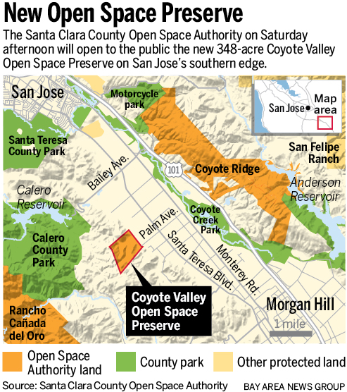
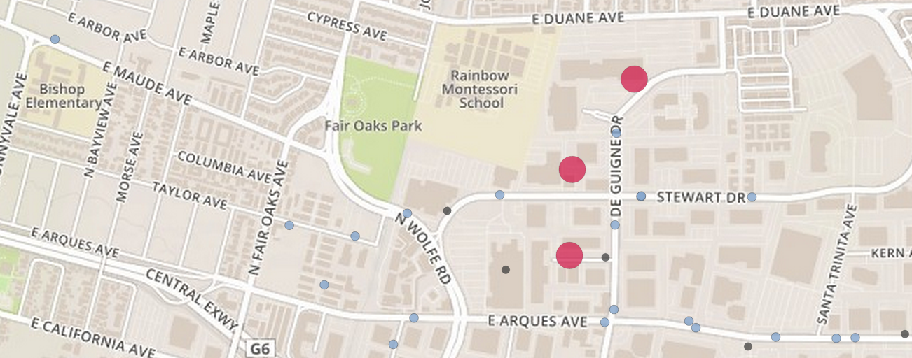
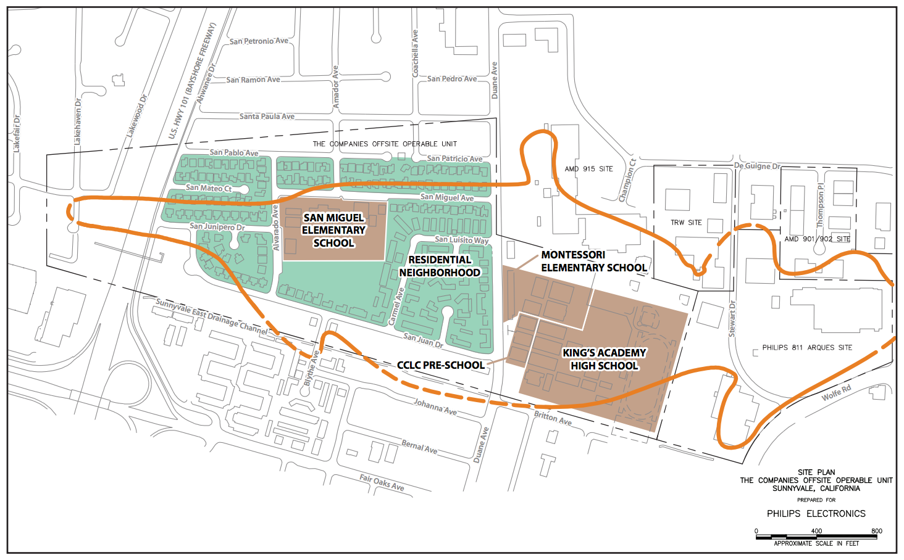

---
title: |
  | Conclusion
  | Eco-Region
author:
- Jason A. Heppler
...

\begin{aquote}{\textit{Time}, November 18, 1991}
If America is the land were the world goes in search of miracles and redemption, California is the land where Americans go. It is America's America, the symbol of raw hope and brave (even foolish) invention, where ancient traditions and inhibitions are abandoned at the border. Its peculiar culture squirts out---on film and menus and pages and television beams---the trends and tastes that sweep the rest of the country.
\end{aquote}

The Ronald Reagan Presidential Foundation anticipated little opposition to their plans to build the Ronald Reagan Presidential Library on the campus of Stanford University. Coupled with the Hoover Institution, whose officials advised Reagan and shared his conservative outlook, the selection of Stanford University for the presidential library, museum, and public affairs research center seemed like a natural fit. The Spanish-mission style architecture designed by Hugh A. Stubbins Jr., would nestle in the hills above the university. Administratively, the Library would be overseen by the Hoover Institution. Yet when Stanford's Board of Trustees approved the plan in February 1984, the outcry was swift. Faculty and students objected to the library's presence, fearing it would only serve to "politicize" Stanford. Critics of the Reagan Library also couched their argument in the environment. The Reagan Foundation hoped to situate the presidential library in the foothills on unincorporated Stanford property next to the Center for Advanced Study in Behavioral Sciences, a decision locals and university members perceived as a threat to the land. "They want to put it on one of the last undeveloped hills in the community," Samuel Brain, a senior researcher in Stanford's radiology department and a vocal critic of the plan told the *New York Times*. "There are a lot of people who are attached to that hill, and they don't want it ruined." Furthermore, Palo Alto residents worried about the potential of tourists flooding their town with traffic and upsetting the hill's seclusion.[^4]

The desire to preserve hillsides would serve to motivate political action nearly a decade later. In 2000, the Committee for Green Foothills helped organize a campaign against the City of San José for plans to build a corporate research park in the Coyote Valley for Cisco Systems. CGF helped create a grassroots organization called People for Livable and Affordable Neighborhoods (PLAN), which initiated a referendum campaign in an attempt to halt the campus's creation. CFG argued that the Coyote Valley, located at the narrowing of the southern end of the Santa Clara Valley, served an important agricultural purpose, was used by many for recreation, and remained an important thoroughfare for wildlife crossing between the Santa Cruz and Diablo ranges, as well as holding the distinction of being the largest freshwater wetland in the county. While the referendum managed to secure enough signatures to place a vote on the ballot, the City of San José disallowed the petition on the grounds that the text of the referendum was incorrect.^[The denial of the referendum petition has been charged by environmentalists as a sign of corruption in San José Mayor Ron Gonzales' administration. Gonzales was a supporter of the project.] The collapse of the dot-com boom in the early 2000s led Cisco to withdraw its plans. Debates over the Coyote Valley continue between environmentalists and developers, where the land is zoned for light industrial under San José's mid-1980s master plan. In 2015, environmentalists won what they hope will become a widespread move in the Coyote Valley. A new 348-acre park called the Coyote Valley Open Space Preserve opened in the summer. "There are 1.8 million people who have access to the last vestiges of the Valley of Heart's Delight," Marc Landgraf, external affairs manager of the Santa Clara County Open Space Authority, told the *San José Mercury News*. "And we want to keep it that way."^["New park in Silicon Valley opens Saturday, rekindling debate over future of Coyote Valley," *San José Mercury News*, June 24, 2015.]

\newpage

While particular places were secured as wilderness preserves, other areas of the county were fraught with the legacy of industrial pollution. At the end of 2014, the Environmental Protection Agency announced a town hall meeting in Sunnyvale. The topic: indoor air quality testing of homes. The EPA planned to test homes and a nearby school for the presence of trichloroethene (TCE) dispersed into the air from evaporating contaminated groundwater, a process known as "vapor intrusion."^["Sunnyvale: EPA plans on testing indoor air quality for vapor intrusion," *San José Mercury News*, December 5, 2014 <http://www.mercurynews.com/my-town/ci_27080114/sunnyvale-epa-plans-testing-indoor-air-quality-vapor>.] The area, known as the Triple Site under monitoring by the EPA, were the remediated Superfund sites of AMD Electronics, TRW Microwave, and Philips Semiconductors.^[More about the Triple Sites can be found at <http://yosemite.epa.gov/r9/sfund/r9sfdocw.nsf/3dec8ba3252368428825742600743733/d18e8a81d96408d588257d32005da7f0>.] Volatile organic compounds were discovered in 1981 leaking from storage tanks on company property at levels past acceptable standards. Should the EPA discovered vapor intrusion in homes or schools, they will assist in the installation of mitigation systems to filter and vent the air.^["EPA School Sampling Update," EPA Factsheet, August 2014 <http://sunnyvale.ca.gov/Portals/0/Sunnyvale/OCM/CMBlog/2014/Aug25/TripleSiteSchoolsAug2014.pdf>.]

The hazardous and toxic landscapes lived on in other areas of the Peninsula as well. In East Palo Alto, a group calling themselves Youth United for Community Action initiated a campaign against the Romic waste treatment facility, arguing that the facility's presence constituted environmental racism.^[For more on Romic and environmental racism, see Chapter 4.] YUCA claimed that Romic has exacerbated risks of cancer and asthma for East Palo Alto, going so far as to conduct their own health surveys that found one-out-of-four 13-to-21 year-olds had asthma and that cancer rates were far higher than average for the rest of San Mateo County. A 2006 explosion that severely burned employee Frolian Chan-Liongco, a sudden Romic tanker chemical leak that released fifteen different chemicals, and decades of hazardous material stored on-site led activists to argue Romic was no longer welcome in their community. "Romic feels that since it is located in a community of color that they don't have to abide by regulations," argued Annie Loya, an activist with YUCA. "But also it is the regulatory system that is failing. The result is that there is a blind eye cast upon how businesses operate in communities like ours."^["Silicon Valley's Dirty Secret," *Metroactive*, January 3, 2007 <http://www.metroactive.com/metro/01.03.07/environmental-racism-0701.html>; "Waste-facility foes rally at City Hall," *San José Mercury News*, December 20, 2006.] In 2005, YUAC filed a federal civil rights suit against Romic claiming "environmental racism" against the California Department of Toxic Substances Control, arguing that DTSC allowed Romic to operate with an expired permit and failed to force the company to complete an environmental impact report.^["State shuts down chemical plant," *The Daily Journal*, May 31, 2007.] A year later, the East Palo Alto City Council voted to appeal to the State to deny Romic an extension on its operating permit. That fall, San Mateo County officials made the same case, arguing that Romic constituted "great environmental and public health risks."^["State shuts down chemical plant," *The Daily Journal*, May 31, 2007.] The state acted in 2007 when DTSC announced it revoked Romic's permit for handling and storing liquid waste after its investigation of environmental violations included the release of 4,000 solvents in June 2006 and two incidents of employees seriously burned in June 2004 and March 2006.

\thoughtbreak{These vignettes are products of the postwar past}. During the postwar era, confrontations over the landscape gave expression to a political project in Santa Clara County that attempted to meld bucolic naturalism with suburban capitalism. Across the landscape changes to the land remain perceptible yet sometimes invisible: fenced-off military installations, protected wilderness areas, capped wells, and the small, white PVC pipes that occasionally dot the manicured lawns of businesses that allows chemical contaminants to evaporate into the air. 

The debate over land use in Palo Alto, San Jose, East Palo Alto, and other Santa Clara County cities reflected a longer debate about western land use, and specifically about the presence of natural places near urban areas. Richard White's observation about the West's public lands---that "land cannot be simultaneously range, parking lots, and wilderness"---applies to Santa Clara County urban landscape.[^5] People give spaces definition through cultural processes that determine how land and space should be utilized for economics, shelter, food, and transportation. These are not necessarily historical realities; they are cultural understandings of how particular places are defined, used, and protected. Silicon Valley, then, is two types of places. The first conjures images of iPhones, computers, and Steve Jobs. This Silicon Valley is a set of assumptions and attitudes defined by technology, invention, innovation, venture funding, and capital revolving around high technology. But Silicon Valley is also a place positioned in geographic space, an area of work, leisure, domesticity, and segregation. These two views into Silicon Valley---as a geographic place, and as a social construction---illustrate how we can come to understand the Valley's spatial history. People of the past attached meaning to this place through lived experiences and imagined geographies. When Samuel Brain criticized the plans for the Reagan Library, he was drawing from a history of people defining the Valley landscape for specific purposes. He also encapsulated fifty years of land use debates about whether land should be left in a "natural" state or put to some other use.

Environmentalism emerging out of the suburbs shaped cities. While city boosters sought to expand their municipal boundaries under the aegis of growth-as-progress, suburbanites reacted fiercely when the natural amenities they had come to enjoy were threatened. Hill regrades, channeled creeks, and high traffic roads became visible expressions of landscape changes that threatened the aesthetics suburbanites had come to enjoy. The shape of the Valley's cities, in other words, were shaped by suburban desires for an idyllic urban form that promised clean industrialization and access to natural amenities. Urban-dwelling knowledge workers turned to these places for their property values, good education for their children, and quality of life, reflecting the individualist political and class priorities of suburbanites. But in the process of shaping the city and countryside, middle-- and upper--class environmentalists relied upon or crafted peculiar narratives about place. Socioeconomic, class, racial, and spatial boundaries determined where suburbanites looked for nature. That nature, more often than not, existed on the hillsides and in their backyards. The suburban countryside formed the core of their motivations, leaning on an aesthetic ideal and agricultural mythos to argue for placing limits on growth and protecting particular places. By the 1990s environmentalists could claim their efforts a success through the legal efforts to protect the natural resources of the Bay Area.

But among minority populations in Silicon Valley, "environment" represented something else: rather than aesthetics and recreation, their pursuit of an environmental agenda grounded itself in health, housing, and access to livable metropolitan spaces. In Silicon Valley, as in much of the American West, remarkable economic growth was accompanied by social and environmental costs. The decade-long battles over open space, farmland preservation, and toxics contamination were significant challenges for federal, state, county, and local agencies to manage as people pressured for protection, access, and cleanup of these lands. But so where the health risks due to air and water quality that disproportionately affected minority and working-class neighborhoods. Environmentalists were less inclined to care about issues and places less "natural" than those they identified with, places often less privileged than those areas occupied by affluent middle-class knowledge workers. Pressures for growth and preservation continue to collide in places like Coyote Valley and East Palo Alto as debates about health, air pollution, and wilderness, shaping a public discourse first forged in the battles of mid-century environmental politics. 

Government officials, civic leaders, and ordinary residents fortified their ideas for a high tech urbanism in the half-century after World War II, and in so doing laid conceptual and physical boundaries on the land to promote their city as "cleaner" than past industrialization. But separating out the idealism of this urban imagery reveals the mixed legacies that the landscapes of technology and knowledge impart. With the political project that began in 1940s Santa Clara County, civic leaders envisioned an urbanism free from the problems plaguing American cities. For business leaders and residents, Silicon Valley had plenty of advantages: a lack of racial strife, weak unions, low taxes, abundant land for development, and a highly-educated white-collar workforce, nestled in the natural environment of the valley. Like the Gold Rush a century before, this new California Dream promised a forging of a pastoral vision with a pioneering industrialization focused around high technology.

Yet these changes introduced new challenges at the verge of the 21st century as the economic focus of Silicon Valley drifted from hardware manufacturing to software development. Warehouses and factories were repurposed as hip development shops, building the backbone that would democratize access to the World Wide Web and personal computers. As manufacturing facilities moved overseas to cheaper and less-regulated labor markets, thousands of working-class manufacturing jobs disappeared. The software-oriented economy also attracted influxes of new populations, in particular large Asian populations that filtered their way into middle-class neighborhoods throughout the Peninsula. Environmental challenges in Silicon Valley have not gone away in this transition. Activists, residents, civic leaders, and government officials continue to confront the legacies of the region's industrial past.

High tech continues to cultivate an image of clean and green---from Google's touting of it's solar-panel-roofed campus buildings to Apple's environmental reports on its server farms, while those with the means drive luxury electric or fuel-efficient cars. Today, places like San José and Mountain View promote their image of "sustainable cities" that place an emphasis on bike rentals, friendly pedestrian environments, electric car charging stations, and the software of "smart cities" that promises to do a way with messy and inefficient bureaucracies. Digital technology provides much promise, allowing more flexibility in work, transportation, and leisure, empowering individuals with access to information, building social capital and social movements, and opening positive possibilities for the environment and democratic politics. But this technology also comes with costs---segregation by education, access to technology, the servers and hardware that create such possibilities.^[[@omara2014urbanism, 26--27].] Pressure for urban growth and revitalization will lead to future controversies over the environmental costs of high tech economies and urban development on the western landscape. 

<!-- endnotes -->

[^4]: "Reagan Library Site Choice Stirs Opposition in Palo Alto," *New
    York Times*, December 24, 1986; "Reagan Library Site in Palo Alto
    Comes Under Fire," *Los Angeles Times*, November 29, 1986.

[^5]: Richard White, "Trashing the Trails," in *Trails Toward a New
    Western History*, Patricia Nelson Limerick, Clyde A. Milner II and
    Charles Rankin, eds. (Lawrence: University Press of Kansas, 1991),
    37.
