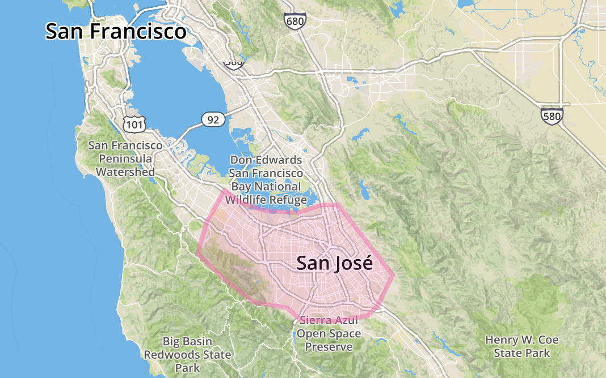

---
title: |
  | Introduction
  | Space, Place, and Nature in Silicon Valley
author:
- 'Jason A. Heppler'
...

\begin{aquote}{Yi--Fu Tuan}
A geographer speaks as though his knowledge of space and place were derived exclusively from books, maps, aerial photographs, and structured field surveys. He writes as though people were endowed with mind and vision and no other sense with which to apprehend the world and find meaning in it. He and the architect-planner tend to assume familiarity---the fact that we are oriented in space and at home in place---rather than describe and try to understand what "being-in-the-world" is truly like.\footnote{Yi--Fu Tuan, \textit{Space and Place: The Perspective of Experience} (Minneapolis: University of Minnesota Press, 1997): 200--201.}
\end{aquote}

\begin{aquote}{Charles Wilkinson}
The subtle, intangible, but soul-deep mix of landscape, smells, sounds, history . . . that constitute a place, a homeland.\footnote{Charles Wilkinson, \textit{The Eagle Bird: Mapping a New West} (New York: Pantheon, 1992), 137--138.}
\end{aquote}

Wallace Stegner lamented the changes occurring to the Santa Clara Valley in 1965. From his home in the foothills of the Santa Cruz Mountains that creep along the western edge of the valley, the Stanford creative writing professor lamented the urban sprawl that had overtaken the former farmland in the flatlands. "The orchards that used to be a spring garden of bloom down the long trough of the Santa Clara Valley," he wrote, "have gone under so fast that a person absent for five years could return and think himself in another country. . . . The once--lovely coast hills reaching down the Peninsula below San Francisco have been crusted with houses in half a lifetime, the hilltops flattened, whole hills carried off to fill the bay, the creeks turned into concrete storm drains."[^cf3] In Stegner's lifetime, the Valley had transformed from prime agricultural land to a place known for urban sprawl, traffic jams, and manufacturing facilities. Stegner's sensibilities were so insulted by the environmental damage that he wished to be buried not in California---the place that had so deeply shaped his writing and identity---but in his summer home of Vermont.[^cf4]

Stegner was a newcomer to this land. Born in 1909 in north-central Iowa, he came to California to teach in the creative writing program at Stanford University. In Stegner's imagination the Santa Clara Valley had fallen from pristine grace. He wrote of "a park-like oak forest reaching southward from a clean bay" when the Native Ohlone's occupied the region. "The climate was mild and benevolent, the bay full of shellfish. The creeksides tangles grew wild berries and the oaks provided the wherewithal for unlimited acorn flour." Stegner not only celebrated this imagined pre-European landscape, but the post-European one as well. As fields of wheat and fruit groves planted by Spanish missionaries began to transform the Bay Area into an agricultural landscape, Stegner celebrated these as "a glory"---that pears, prunes, apricots, cherry blossoms, and apples were an improvement upon nature. "This brief Eden," as Stegner referred to the Valley, fell to the original sin of industrialization.^[William S. Cooper, "Vegetational Development upon Alluvial Fans in the Vicinity of Palo Alto, CA," *Ecology* 7 (January 1927): 11.] <!-- {TODO: check this footnote? He's not quoting Stegner here. } -->

Frederick E. Terman interpreted the landscape differently. The Stanford University provost and dean of engineering---often referred to as the "Father of Silicon Valley"---saw suburbanization and expansion of industry in the Santa Clara Valley not as signs of degradation, but rather signposts towards a new prosperous future for Stanford, for Santa Clara County, for California, and for the nation. The newly--founded Stanford Industrial Park and the lands around the university, rather than seen as encroaching sprawl, were, in the words of one booster, a "pleasant place" of "broad lawns, employee patios, trees, flowers and shrubs, walls of glass, recreational clubs" that stood in contrast to the "smoke--stacks, noise, coal cars, soot and other things" found in the industrial East and Midwest.[^cf5] The landscape appeared campus--like and suburban, amenities that reflected the values of Stanford and surrounding suburban communities. Although complaints of traffic and air pollution had become common by the mid--1960s, Terman dismissed these complaints. The Industrial Park had done much for the Bay Area's economy, and Terman felt congestion and air pollution were "really a pretty small price to pay."[^cf6]

<!-- {TODO: Work on another paragraph here on Latino perception of landscape? Loss of ag -> loss of jobs? }  -->

Not acknowledged by either Stegner or Terman was the environmental influence that these industrial activities had on the Santa Clara Valley. The celebrated orchards introduced exotic species in California, the result of European and American colonization. Furthermore, the cultivation of these species required an infrastructure to support canneries, cannery effluence, and controlling the land with pesticides and herbicides. Stegner's own contradiction of lament for Spaniard colonization and celebration of orchards poses significant questions: How should the land be treated? What counts as improvement or denigration upon the landscape? Terman's own views of the Valley reflect a further set of complicated questions: Should the built environment be assessed differently from the natural environment? Was the arrival of Silicon Valley an improvement upon nature? Implicit in both views revolves a core question: Who defines the valley landscape?

These competing visions of the Santa Clara Valley landscape reflected widely-held and conflicting ideas about the future of the Valley. In the face of postwar residential growth and industrial development, the Santa Clara Valley's landscape changed remarkably. The arrival of machines in the Valley---bulldozers and computers---transformed the landscape, and in the process sparked local environmental activism. Valley residents, business leaders, city officials, and university administrators vied over the definition of Santa Clara Valley's future, and in the process shaped debates about environmental change. Unrestricted urban growth and economic development characterized much of Santa Clara Valley in the latter half of the twentieth century, but little told is the story of the environmental consequences of Silicon Valley and those who attempted to shape the region's environmental future.[^cf7] California voters became increasingly aware of the environmental impact urban and industrial development was having, leading by the 1970s to residents attempting to curtail industrialization, limit urban growth, and reject large--scale water projects. Environmental organizations, formal and ad hoc, criticized high technology firms and city leaders for their ignorance of ecological negligence. Such organizing formed the burgeoning Bay Area environmental movement.

The story told here is about a particular place and an expression of environmental politics. I do not venture into efforts of the San Francisco Bay's conservation, fights over the Bay Area Rapid Transit transportation system, or open space battles beyond Santa Clara County. My focus is on a specific valley, the Santa Clara Valley, where the core of Silicon Valley was founded and expanded. The "where" of Silicon Valley is slightly harder to define, undergoing continuous reshaping since its beginnings in the 1940s as high technology firms expanded throughout Santa Clara, San Mateo, and San Francisco counties on the Peninsula. As we stand in 2015, the borders of Silicon Valley could easily extend northward into San Francisco, whose high-tech industry is rapidly growing, and as far south as Morgan Hill and as far east as Fremont or even Oakland. But for the majority of the history examined ahead, the bulk of high tech activity occurred largely in Santa Clara County. For the purposes of this study, Silicon Valley is largely bounded by Palo Alto in the northern end of Santa Clara County to San Jose in the southern end of the county (see Figure {NUM}). Between and including these two cities the greatest concentrations of high tech manufacturing took place.^[I am comprising a database of Silicon Valley tech companies between 1940 and 1990, which currently numbers close to 2,000 companies culled from archival sources, city directories, and industrial pamphlets and guidebooks. The bulk of these companies are located in the northern end of Santa Clara County. See Chapter 2 for more discussion about the spread and location of these companies. The full database is online at <https://github.com/hepplerj/machinesvalley/blob/gh-pages/data-files/sv-companies/sv_companies.csv>.]

The study of Silicon Valley offers a chance to examine the emergence of a twenty-first century economy in the American West. American political economy in the postwar era was defined by technological innovation, market forces, waves of migration, government investment and regulation, and divided, fragmentary politics.

The study ahead is largely focused on local history. Yet it also attempts to examine these changes at various scales: neighborhood, city, region, and nation. Heeding Andrew Needham's call that the history of suburbanization must look beyond cities to understand how suburban growth affected places beyond their borders, I suggest we best understand the history of Silicon Valley not only from its unique local contexts but also by seeing how the Valley shaped both regional and national political trends. Although any one of the cities of Santa Clara County---which numbered 14 municipal corporations by the 1990s---would work well for analyzing the trends in environmental politics, by thinking about these changes as a regional level reveals how metropolitan place shaped one another across space. As new centers of high technology began expanding rapidly to serve new business and their affluent employees---Palo Alto, San Jose, Santa Clara, and other cities---these places came quickly into conflict as they sprawled rapidly from their cores.

By standing at the intersection of historiographies of urban development, postwar suburbanization, recreation and leisure, business history, and American environmentalism, this dissertation argues that the politics of growth intersected with a powerful nostalgia about the countryside of Santa Clara Valley. Environmental critics argued that industrialization and real estate development served to ruin the environment, introducing sprawling places that wrought ecological havoc and erased a sense of community identity. Debates over land use of the Bay Area suggests the malleability of landscapes. More broadly, these attempts to define the landscape shape the political, cultural, and social norms that tend to shape space and geography. As other historians of space and place have noted, the spatial structures used to order the world produce a metageography that relies on myths and half-truths in order to create a narrative of place. How these ideas were created, negotiated, and challenged forms the subject of this study.^[Schulten, 3; Martin Lewis and Kären Wigen, Kenneth Jackson. {TODO: fix this footnote for full notes}]

That malleability forms my core analytical framework. The interplay of place, space, and landscape form the central components of this study. Some definitions are in order. First, landscape. The Santa Clara Valley---indeed, much of the American West---contain what Richard White has called "hybrid landscapes" where cultural ideologies clash over conflicting uses of natural resources. The hybrid landscape is neither purely wild nor purely built, but instead a construction of natural and cultural systems that shape and create place.[^cf21] People define places by laying down ideas on the landscape. Landscapes also emphasize aspects of geography defined through beauty, economy, or culture. Landscapes are physically and mentally constructed. Physical and conceptual boundaries were drawn around competing landscapes in Silicon Valley as interests and communities vied to define their metropolitan future. These intermixed landscapes placed unique but concurrent pressures on natural resources in Silicon Valley.[^cf22] These competing landscapes formed the cultural and political underpinnings of Silicon Valley's environmentalism. In the Santa Clara Valley, the creation of new landscapes resulting from various perceptions of the region as farmland, electronics manufacturer, suburban paradise, and natural beauty shaped the Valley's environment. These hybrid landscapes express the different ways in which people constructed ideas about the landscape to fit human cultural and economic needs. The underlying and conflicting interconnectedness of these landscapes shaped environmental, cultural, and political identities.[^cf15] Landscapes, in geographer Donald Meinig words, are "a great exhibit of consequences." Landscapes are "symbolic, as expressions of cultural values, social behavior, and individual actions worked upon particular localities over a span of time."^["Introduction," in [@meinig1979landscapes].]

These landscapes are formed within the context of space and place. Geographer John Wright argues that "places are best seen as shifting stages where the exercise of power and resistance to it vie for dominance."[^cf14]

Closely related to landscape, yet different in its own ways, is the concept of place and space. Place, as David Sopher suggests, arises out of an *experiential* sense moreso than landscapes. Landscapes are often descriptive and seen rather than arise from experience.^[@sopher1979landscapehome. Historians and cultural geographers have done away with the convention that a hard line existed between culture and the natural. Rather, a range of scholars, among them Richard White, Mark Fiege, William DeBuys, Nancy Langston, and Joseph Taylor, Carl Sauer, Kenneth Olwig, and Donald Meinig, interpret landscapes arising from cultural processes on natural surroundings. In the process, this creates particular views of nature and reflect cultural values. [@meinig1979landscapes.]] As geographer Yi-Fu Tuan has argued, a "sense of place" is a biological reaction to an environment as well as a cultural fabrication. Social relationships, cultural constructions, and spatial perception intertwine to form an attachment to place.^[[@tuan1977spaceplace, 6.]] Furthermore, as Dolores Hayden suggests, place is essential to the study of urban history. "Place needs to be at the heart of urban landscape history, not on the margins," she suggests, "because the aesthetic qualities of the built environment, positive or negative, need to be understood as inseparable from those of the natural environment."^[[@hayden1995place, 18.]]

Given that "place" refers to a way of knowing through experience, how might we define of space? Space helps connect the cultural underpinnings of place to the political economy of Silicon Valley. The philosopher Henri Lefebvre in his classic 1974 book *The Production of Space* noted that societies produce space. To Lefebvre, every society produces a space to meet its needs for economic production and social reproduction. Production may take the form of real estate speculation, mining, and manufacturing, while social reproduction may range from biological reproduction to the space of housing, to the public sphere in cities. The physical and the social become linked and intertwined, and also points to the ways the control of space can shape or break down social relations. People's attachments to place through memory, material, social, and imaginative intertwine with the politics of space.^[One illustrative example of the differences between place and space in the works of historians covering the same geographic area will add some clarity. The 1949 publication of Fernand Braudel's classic work on the Mediterranean thought of the region as a grand spatial crossroad of exchange, trade, diffusion, and connections between large areas to the north, south, and east. Peregrine Horden and Nicholas Purcell's revisionist account published in 2000 viewed the Mediterranean as a series of micro-ecologies or places separated by distinct agricultural and social practices. Connectivity and mobility in the region was a response to managing environmental and social risks rather than extra-regional activities. Braudel has a broad view of the Mediterranean---a space---rather than Horden and Purcell's phenomenological view of places that make up the Mediterranean world. {TODO: citation}.] We can see how the imposition of space shapes cities when urban planners place down grids of roads, zones, and regulations that divide cities along labor, leisure, and consumption. The daily movement of people and capital---tourists, cyclists, taxi drivers, commuters, freight---imbue neighborhoods and localities with different meanings and give them specific senses of place.[^cf16]

The political and cultural story intertwines with a spatial story. The Santa Clara Valley was the site of one of the nation's greatest modernizations of urban space. More than 138,000 acres of farmland were paved over, built upon, unearthed, or buried between 1940 and 1960, all in an effort to support an expanding high tech industry and its rapidly growing workforce.[^cf17] The residents of the Santa Clara Valley sought to improve the places in which they lived and worked, and many of these projects were spatial: environmental issues and environmental justice emerged from industrial pollution, storm runoff, subsidence, suburban expansion, and traffic congestion within different parts of the metropolis. Even ostensibly non-spatial politics were embedded in local geography, and these spatial politics were intertwined with environmental politics.

Although this study is tightly focused on a specific region, it has greater bearing on understanding the inherent tension within land use and Americans' growing awareness of environmental issues during the postwar era. Although the industrialists, suburbanites, politicians, and activists in the pages ahead may not have always identified themselves as environmentalists, Silicon Valley's political history demonstrates the ways "the environment" became an ever-present issue in American postwar politics.

<!--
Space forms a critical understanding the history of Santa Clara Valley. Within space, as Robert Self writes in his analysis of Oakland, people "competed to put those resources to use to create particular and concrete places."[^cf18] Space is not just an abstract consideration of a place, but rather is historically concrete---the growth of suburban factories, residential and commercial growth, and environmental politics all operated in place. Historical actors and their spaces they operate in are inseparable. The experiences of people, communities, and institutions take place in the very fabric of life and space. The calls for urban reform, environmental concerns, and critiques against industry did not take place abstractly; political actors made specific demands about specific places. Space does not tell the entire story, but overlooking space is to miss a significant part.[^cf19]
-->

<!--
Finally, an aim of this study is to think bigger about Silicon Valley, about California, and its national context. Silicon Valley is often given an exceptionalist thesis----a place with a unique set of circumstances that made it an anomaly in postindustrial America.

aren't they the beacon, the path-breaker, ground-breaker, original, the pioneering landmark spot in the emergence of that new economy?    How many times do people in business magazines publish articles or lists that rank or discuss "the next Silicon Valley"?  Hell, we have a group here that uses the language "Silicon Prairie" to attract tech.
-->

Silicon Valley became a gold standard, cited by journalists, scholars, critics, and pundits throughout the country as an example of a friendly business climate, suburban paradise, and economic powerhouse. Places as varied as Atlanta, Georgia, Philadelphia, Pennsylvania, Cleveland, Ohio, Omaha, Nebraska, Bangalore, India, Mission Hills in the Guandong Province of China, and Shenzhen, China, have all looked to Silicon Valley as a vision for their futures----going so far as to model their architectural designs after the Spanish villa and ranch aesthetic of Stanford University. Across the United States, places borrow the "Silicon" moniker to describe the "Silicon Forest" of Oregon, the "Silicon Desert" of Arizona and the Southwest, and "Silicon Prairie" to variously describe Midwestern states, Texas, or Wyoming.^[See, for example, Margaret O'Mara, "Silicon Valleys," *Boom: A Journal of California* 1 (Summer 2011) <http://www.boomcalifornia.com/2011/06/silicon-valleys/>; Gordon B. Dodds and Craig E. Wollner, *Silicon Forest: High Tech in the Portland Area, 1945--1986* (Portland: Oregon Historical Society Press, 2000).]

<!--
But in viewing Silicon Valley as exceptional is to miss similar economic, cultural, and environmental transformations happening throughout the American Sunbelt and global sites of postindustrial capital. Phoenix, Arizona, for example, underwent its own high-technology transformations in the postwar era, and like Silicon Valley, had to deal with the fallout of manufacturing and pollution. Silicon Valley is not exceptional; like other Sunbelt postindustrial places, it became a physical expression of a new Cold War complex that radically transformed place and community.
-->

\thoughtbreak{Electronics became a key component of the West's} service industry, but simultaneously became a pressing issue for the environment where such activity centralized itself. Throughout the West electronics manufacturers established headquarters, manufacturing facilities, and research offices, often courted by pro-growth advocates in city governments. With the rise of middle-class, quality-of-life environmentalism, however, the electronics industry became a target for its impact on wildlife, water quality, air pollution, and open space, especially in the western boomtowns where electronics formed the dominant economic activity. In turn, these concerns shaped politics in western states like California as pro-growth boosters debated with Californians worried about the rapid pace of growth and its impact on quality of life.

This work begins with a simple question: does nature matter to Silicon Valley? Which points to an even bigger question: how does nature matter to American cities? Beginning to answer that question involves extending historian Kenneth Jackson's claim that "the space around us---the physical organization of neighborhoods, roads, yards, houses, and apartments---sets up living patterns that condition our behavior."[^cf8] In Silicon Valley, the attitudes, ideas, and values people imparted on to nature---biological and idealized---helps us understand how ideas of nature and efforts to preserve or transform landscapes played out in postindustrial American society. By exploring the ways people created space, the politics they engaged in to protect that space, and examining the physical changes to the landscape that resulted, this dissertation argues for the importance of understanding how space creates politics. The story of Silicon Valley told here is over who's place the Valley would become: A postindustrial powerhouse? Fertile and beautiful agricultural producer? Countryside paradise? Metropolitan trend-setter? All of the above?

What gives rise to the environmental movement in the Santa Clara Valley are the spatial and cultural politics stemming from high--tech industrialization. The metropolitan region of the Santa Clara Valley allows for an important inquiry into postwar environmentalism. The Bay Area in many respects anticipated the environmental politics that played out on the national stage. Ten years before federal laws regulated clean air, water contamination, and the preservation of open space, environmental political actors in the Bay Area organized to preserve their quality of life, the preservation of landscapes, and formed critiques of environmental degradation.

This work is about grassroots politics produced by environmental degradation, suburbanization, the interplay between local and national in the emergence of an environmental movement in American politics. The conceptualization of different landscapes resulted from different visions and perceptions of the region. This study will chronicle the landscapes through a narrative of the area. This is not a history of prominent leaders often attributed to the creation of Silicon Valley---the veritable household names of David Packard, William Hewlett, Robert Noyce, and Steve Jobs. Instead, this is a story of the land, air, and water in one of the United States' major population centers and the people that live there. The story is about the tension between *intent* and *actual* use of land, and how different ideas for the use of land informed the shape of the land itself.

But a note on the people that do appear here. Although the pages ahead dive little into the business leaders who brought , the story is largely the story of white, male, affluent elites.

\thoughtbreak{Historians of the American West} have noted the importance of the "information revolution" to coastal California's development, but have done little to dive into the history. William Robbins noted almost two decades ago the "explosive expansion of the high--tech sector" that there existed "a new rural West---centered in the information revolution" were transforming urban prosperity and suburban poverty.^[@robbins1996newwest.] Earl Pomeroy's posthumously published *The Far West in the Twentieth Century* includes a brief history of the semiconductor industry and its outgrowth from military investments.^[@pomeroy2008west.] John Findlay was among the first western historians to place Silicon Valley into historical context, writing about how people created, and were affected by, urban culture. In particular, Findlay analyzes how urban environments were planned, built, managed, and used, and how inhabitants made sense of cities.  Findlay's analysis used Silicon Valley as one of his case studies, focusing on Stanford University and suburban landscapes to understand the ways that residents used the pastoralism of the university as a retreat from the chaos of urbanization. Margaret O'Mara extended the story in one of her case studies analyzing the success and failure of places that attempted to replicate Silicon Valley's success. O'Mara focused on how Stanford University played an important role in shaping land--use policies in Palo Alto and surrounding communities, and contextualizing the reasons behind Silicon Valley's success owing to pleasant climate, a white--collar workforce, the space to expand suburban areas, and proximity to a research university. Geographer AnnaLee Saxenian compared the differences between the Bay Area's Silicon Valley and Boston's Route 128.[^cf10]

Other writers and observers have attempted to draw lessons from Silicon Valley's growth and development, but those works have targeted audiences interested in the entrepreneurs famous to the region. Tech journalist Robert Cringely, biographer Walter Isaacson, journalist Michael S. Malone and other popular writers have highlighted the importance of specific individuals in shaping the technology industry, but such works tend to celebrate individuals and companies rather than contextualize the Valley's history.[^cf11] Historians of business have offered more nuanced approaches to the Valley's history.^[See, especially, @berlin2001noyce.]

Historians have begun to explore the social and cultural consequences of Silicon Valley. Glenna Matthews addressed issues of gender, labor, and class in Silicon Valley. Matthews focuses her lens on immigrant women who worked in canneries and high-tech industries to "test [the] reality behind the [area's] glitzy image." Her focus on unionization of workers and their efforts towards social justice illustrates a dimension of the story not otherwise told. On issues of race in Northern California, Stephen Pitti has examined Mexican Americans and the long history of race relations and labor issues in the Bay Area. And Cecilia M. Tsu examined the agricultural past of Santa Clara Valley, studying Asian immigrants in Santa Clara Valley to examine the overlapping ideologies of race, gender, and labor between 1880 and 1940. These works have helped to uncover the story of Silicon Vally that have been ignored or gone unknown---race relations, social justice, labor, gender, and politics.^[@matthews2003dreams; @pitti2004devil; @tsu2013garden.]

Few environmental histories have focused on local environmental histories, except in cases of single local campaigns. Most histories focus their geographic scale far above the local community, giving their attention to national legislation, federal agencies, or large environmental organizations. Those works that attempt to give attention to local action---namely Samuel Hays's classic *Beauty, Health, and Permanence*---address topics so briefly as to only give local activism but a few pages of discussion. The larger goal of such works has been to connect places and controversies to the wider national narrative. Other works have focused their lenses on single states or controversies, such as William Robbins's two volumes on Oregon, Andrew Hurley's *Environmental Inequalities*, and  Richard Walker's *Country and the City*.

Histories of environmental politics often trace the origins of the environmental movement to the 1960s, lumping the movements into the generalities of the counterculture, civil rights, and justice movements. But in Silicon Valley, these ideas took hold nearly a decade sooner. The origins of an ecological consciousness and energy for political action in Santa Clara Valley suggests ideologies that predated much of the nation's eventual environmental sentiments.[^cf13]

<!-- what's my interventio? Describe here before the thoughbreak, connect to above historio. -->

\thoughtbreak{The grassroots approach of this work} reveals that environmentalists often cared less about political affiliations of Republican and Democrat but more often cared about their identities as homeowners and taxpayers. Environmental historians have often considered environmental history to be the domain of Democratic politics, and environmental issues often laid at the feet of the liberal political agenda. However, environmental politics between the 1950s and the 1970s often belied political affiliations. Suburban residents concerned with environmental issues were often unified in their vision of aesthetics, health, protection of children, pollution, and toxics.

The Bay Area's mid-century environmentalists treated nature as a place of pristine beauty and predominantly rural. When Wallace Stegner lamented the disappearing beauty of "this brief Eden," it was the human-built agricultural landscape he looked upon.[^cf42] Frequent charges were made against urbanization as environmentalists ridiculed the spread of cities by a juxtaposition of the city against country. The orchards, farmlands, equestrianism, open space, green belts, ranching, and rolling hills were "nature," and the spread of cities into these areas were affronts to their sensibilities. Nature, to the Bay Area's environmentalists, was normative. In the story below, we find traces of what people thought was natural. But the various features of the landscape---bulldozers, acres of fruit trees, arid climate, water---all have a role to play in Silicon Valley. We cannot begin to understand this place's history without understanding its environmental components.

Writing about environmental politics in the Bay Area also offers us ways to think about local politics. It might, as Richard Hofstadter once said, have "something to say that might help us."[^cf51] The story here is, ultimately, about the practice of politics in postwar America. Around kitchen tables, within ad hoc coalitions, in letter campaigns and newspaper editorials, people talked about the changing environment around them. Amenities and cultural ideals about the Bay Area---climate, atmosphere, suburban, middle-class---had attracted newcomers and delighted old--timers. But the rise of industry, the influx of new residents, the explosion of suburban development, and the devastation of orchards led both groups to question what sort of changes they were welcoming to the Valley. Some of these organizations were short-lived, such as the Citizens Committee on Regional Planning or United Palo Altans, while others existed much longer to continue influencing California politics, such as California Tomorrow and the Committee for Green Foothills. These environmental organizations emerged directly from environmental changes occurring in Silicon Valley.

Simultaneously, entrepreneurs, urban planners, university administrators, and city leaders offered an alternative vision to the landscape: one that was increasingly urban and industrial rather than rural and agricultural. Often times support for growth was couched in the language of national defense: Cold War defense spending poured into Stanford University, for example, which eagerly sought out military contracts in research and development. Stanford administrators responded to citizens critiques of land development programs by dismissing their concerns as less important than national defense concerns. Unrestricted urban growth and economic development characterized much of Santa Clara Valley in the latter half of the twentieth century. California voters became increasingly aware of the environmental considerations urban growth and industrial development had for the region, leading to political activism, new environmental regulation laws, and community referendums. Furthermore, environmental groups criticized high technology firms and city leaders for their ignorance of ecological negligence.[^cf52]

\thoughtbreak{Silicon Valley has become a cultural center} in the United States; the wealth, political influence, environmental precedence, and place in the American imagination has led the Valley to take on an almost mystical quality in American life. Cities and universities across the country and across the world try and mimic the success of Silicon Valley and Stanford University. The Valley is synonymous with the technology industry, an industry that has taken on ever increasing importance to the nation's economy. Ideals about Silicon Valley are embedded in cultural and institutional arenas in America. Observers talk about "life hacks" or pursue ways to "disrupt higher education." By asking new questions of the Valley's history, this works seeks to probe the public to think more about Silicon Valley and its attendant costs.

The history is also about the history that Silicon Valley has inherited. The Valley often thinks of itself as outside of history---always looking to the future, at the forefront of change and progress. But the organization and imagination of Silicon Valley---its landscape, its communities, its relationships---are inseparable from its past. People here live with its history daily. We must recognize how desires for beauty, nature, and pleasure shape our spatial history, landscape, and nostalgia embodied in cities. Cities, the novelist Italo Calvino reminds us in *Invisible Cities*, do "not tell [their] past" but are "like lines on a hand, written in the corners of the streets, the gratings of the windows, the banisters of the steps, the antennae of the lightning rods, the poles of the flags, every segment marked in turn with scratches, indentations, scrolls."^[Italo Calvino, *Invisible Cities*, trans. (New York: Harcourt Brace and Company, 1974), 11.] Cities and the nature that surrounds them---that is embedded in them---are reflections of past and present desires. To build better cities, we must reflect the ways our landscapes match our aspirations.

/newpage

# A Note on Sources

There is one glaring issue that deserves some attention: very little of the story ahead focuses on ethnicity or gender. Much of the story told here revolves largely around white, affluent elites in Silicon Valley.

It's a near truism to say that Silicon Valley was lily white.

<!-- Endnotes -->

[^cf1]: Yi--Fu Tuan, *Space and Place: The Perspective of Experience* (Minneapolis: University of Minnesota Press, 1997): 200--201.

[^cf2]: Leo Marx, "The Idea of Nature in America," *Daedulus* 137:2 (Spring 2008): 9.

[^cf3]: Wallace Stegner, "The Clouded Skies of Lotus Land," *St. Louis Post-Dispatch*, September 26, 1965, quoted in [@friedly2000eden, 5]. Stegner's novel *All the Little Live Things*, was written based on the Valley. The novel's character, Joe Allston, lamented the bulldozers, subdivisions, and scars that cut into the Earth. Remarking on the work of the fiction's land developer, Allston remarked that the hills were "mutilated and ruined" and "only a land butcher could have proposed and carried it out. . . . There would be no restoring what he had ruined. It reminded me too painfully; it made me sick to look." Stegner, *The Little Live Things*, (New York: Viking, 1967), pp. 14--15.

[^cf4]: Jackson J. Benson, *Wallace Stegner: His Life and Work* (New York: Viking, 1996), xii. See also [@friedly2000eden, 4--5].

[^cf5]: Quoted in [@findlay1993magic, 130].

[^cf6]: Terman, quoted in [@findlay1993magic, 141].

[^cf7]: On the rise of the modern environmental movement, see [@hays1987beauty, 13--19]; [@rothman2000saving, 131--159]; [@steinberg2002earth, 239--261]; [@opie1998nature, 404--433].

[^cf8]: [@jackson1985crabgrass, 3].

[^cf10]: [@findlay1993magic, 117--159]; [@omara2005cities]; [@saxenian1996regional].

[^cf11]: Michael S. Malone, *The Valley of Heart's Delight: A Silicon Valley Notebook, 1963--2001* (New York: John Wiley & Sons, 2002); Michael Malone, *Betting It All: The Entrepeurners of Technology* (New York: Wiley, 2001); Malone, *Bill & Dave: How Hewlett and Packard Built the World's Greatest Company* (New York: Portfolio, 2007); Robert Cringely, *Accidental Empires: How the Boys of Silicon Valley Made Their Millions, Battle Foreign Competition, and Still Can't Get a Date* (New York: HarperBusiness, 1996); James Wallace, *Hard Drive: Bill Gates and the Making of the Microsoft Empire* (New York: HarperBusiness, 1993); David A. Kaplan, *The Silicon Boys: And Their Valley of Dreams* (New York: William Morrow, 2000); Leslie R. Berlin, "Robert Noyce and Fairchild Semiconductor, 157--1968," *Business History Review* (Spring 2001): 63--100. Very few of these books address issues of women or gender, often reflected in the book titles. On the centrality of women and gender in the history of computing, see Nathan L. Ensmenger, *The Computer Boys Take Over: Computers, Programmers, and the Politics of Technical Expertise* (Cambridge: MIT Press, 2010); David Alan Grier, *When Computers Were Human* (Princeton: Princeton University Press, 2005).

[^cf12]: [@walker2007countrycity, 3].

[^cf13]: I am not alone in suggesting the Bay Area anticipated the broader
environmental movement. Historian Margaret O'Mara has noted that the Bay Area
became "home to some of the environmental movement's most important early
battles and precedent--setting land--use planning measures." [@omara2005cities, 139].

[^cf14]: [@wright2003musculature, 85].

[^cf15]: Sociologist Daniel Bell, historian Hal Rothman, economist Thomas
Michael Power, and geographer William Wyckoff have explored the larger
ramifications of this shift in the American West. See [@bell1999coming, 14];
[@rothman1997devils, 17]; [@power1996landscapes]; [@wyckoff1995postindustrial].

[^cf16]: Henri Lefebvre, *The Production of Space*, trans. Donald
Nicholson-Smith (Wiley--Blackwell, 1991). The works on the production of space
is vast. Among the most influential works include David Harvey, *Social
Justice and the City* (Johns Hopkins University Press, 1973); Doreen Massey,
*Spatial Divisions of Labor* (Routledge, 1984); Neil Smith, *Uneven
Development: Nature, Capital, and the Production of Space* (Blackwell, 1984);
Edward W. Soja, *Postmodern Geographies: The Reassertion of Space in Critical
Social Theory* (Verso, 1989); Yi-Fu Tuan, *Space and Place: The Perspective of
Experience* (University Of Minnesota Press, 1977); Michel de Certeau, *The
Practice of Everyday Life* (University of California Press, 1984); Edward
Casey, *The Fate of Place: A Philosophical History* (University of California
Press, 1997). For introductions to the concept of place, see John A. Agnew and
James S. Duncan, eds., *The Power of Place: Bringing Together Geographical and
Sociological Imaginations* (Unwin Hyman, 1989); Cameron Blevins, "Space,
Nation, and Triumph of Region: A View of the World from Houston," *Journal of
American History* (June 2014).

[^cf17]: [@conard1985green, 5].

[^cf18]: [@self2003babylon, 17].

[^cf19]: [@self2003babylon, 17].

[^cf20]: I am borrowing the idea of overlapping landscapes from Leisl
Carr-Childers. She uses four overlapping landscapes---wild horse,
military-nuclear, ranch, and outdoor recreation---to understand land--use
conflicts and debates over the equitable use of western public lands in the
Great Basin. See Carr-Childers, "The Size of the Risk: An Environmental
History of the Nuclear Great Basin," Ph.D. Dissertation, University of
Nevada--Las Vegas, 2011.

[^cf21]: [@white2004hybrid, 562--664]. In surveying the trends in
environmental history, Richard White reviewed the works of several
environmental historians including Josephy Taylor, Mark Fiege, Nancy Langston,
and William DeBuys, who reject any hard division between culture and natural.
Instead, they examine how forces shape and inform landscapes. Kenneth Olwig
has argued that landscape is substantive, where "environment, economics, law,
and culture are all important," and symbolic, "to be perceived, read, and
interpreted on the ground, in written texts, and through artistic images."
Carl Sauer, "The Morphology of Landscape," in *The Cultural Geography Reader*,
eds. Timothy S. Oakes and Patricia L. Price, p. 100; Kenneth R. Olwig,
"Recovering the Substantive Nature of Landscape," *Annals of the Association
of American Geographers* (December 1996): 645; Donald Meinig, "The
Interpretation of Ordinary Landscapes," in *The Beholding Eye: Ten Versions of
the Same Scene*, ed. Donald Meinig, pp. 43--45; Keith H. Basso, *Wisdom Sits
in Places*, p. 110. William Cronon has argued the same phenomenon happens when
Americans construct and then preserve wilderness to suit ideas of sublime
nature while disregarding less--striking landscapes. See William Cronon, "The
Trouble with Wilderness; or, Getting Back to the Wrong Nature," in *Uncommon
Ground: Rethinking the Human Place in Nature*, ed. Cronon, (New York: Norton,
1996), 69--90.

[^cf22]: Nature, Richard White notes, "is at once a physical setting where
living beings exist in complex relationships with each other, and a human
invention. Humans create a shifting set of cultural concepts about the
physical world and identify these concepts as nature." White, "American
Environmental History: The Development of a New Historical Field," *Pacific
Historical Review* 54 (August 1985): 297--335.

[^cf23]: [@conard1985green, 5].

[^cf24]: [@self2003babylon, 17].

[^cf25]: [@self2003babylon, 17].

[^cf26]: "Water made the orchards, silicon chip industry sprout faster," *San
Jose Mercury*, December 22, 1999.

[^cf27]: [@friedly2000eden, 20].

[^cf29]: [@grossinger2007landscapeecology, 110---115].

[^cf30]: R. T. Hanson, Zhen Li, and C. Faunt, *Documentation of the Santa
Clara Valley Regional Ground-Water Surface-Water Flow Model*, Santa Clara
County, California. U.S. Geological Survey Scientific Investigations Report
2004--5231. (Reston, VA: U.S. Geological Survey, 2004).

[^cf31]: L. McKee, J. Leatherbarrow, S. Pearce, and J. Davis, "A Review of
Urban Runoff Processes in the Bay Area: Existing Knowledge, Conceptual Models,
and Monitoring Recommendations," SFEI Contribution 66 (Oakland: San Francisco
Estuary Institute, 2003); [@grossinger2007landscapeecology].

[^cf33]: Muir notes the appearance of orchards, wheat fields, vineyards, and
alfalfa meadows. Muir, *John Muir*, 96.

[^cf42]: Stegner quoted in [@friedly2000eden, 8].

[^cf43]: Roger Lotchin notes that cities in California had already acquired a long history of military development prior to World War II. Every port city along the California coast had a naval, army, and air bases before the start of World War II. Militarization was a fundamental component to California's major cities. This was also true of Seattle. Lotchin, *Martial Metropolis*, 223--232; [@lotchin1992fortress, 1--2]; Greg Hise, *Magnetic Los Angeles*, 117--120; [@klingle2007emerald, 205--211].

[^cf44]: On environmental concerns over suburbanization see [@jackson1985crabgrass]; [@rome2001bulldozer].

[^cf45]: On the emergence of sprawl in the Bay Area, see [@walker1982water]; [@omara2005cities, 57--94].

[^cf46]: [@conard1985green, 6].

[^cf47]: [@conard1985green, 6].

[^cf48]: [@cavin2012siliconvalley, 231]; [@matthews1999sanjose]; [@matthews2003dreams, 7]; [@trounstine1982movers, 93].

[^cf49]: [@conard1985green, 5].

[^cf50]: Local and federal studies discovered that trichloroethane, a common industrial solvent used in the cleaning of semiconductor parts, was leaking out of storage takes and into groundwater. The problem was not limited to Fairchild; other high technology manufacturers had similar issues. Health effects of consuming the contaminated water ranges from liver and kidney damage, skin rashes, birth defects, and cancer. "U.S. to Study Pollution in High--Technology Area," *New York Times*, October 30, 1983, p. 33. For a summary of the history regarding groundwater contamination, see Craig E. Colten, "A Historical Perspective on Industrial Wastes and Groundwater Contamination," *Geographical Review* 81 (April 1991): 218--223.

[^cf51]: Hofstadter quoted in Christopher Lasch, "Consensus: An Academic Question," *Journal of American History* 76 (September 1989): 458.

[^cf52]: On the rise of the modern environmental movement, see [@hays1987beauty, 13--19]; [@rothman2000saving, 131--159]; [@steinberg2002earth, 239--261]; [@opie1998nature, 404--433].

[^cf53]: Richard White, "What is Spatial History?" Spatial History Project
<http://www.stanford.edu/group/spatialhistory/cgi-bin/site/pub.php?id=29>.
