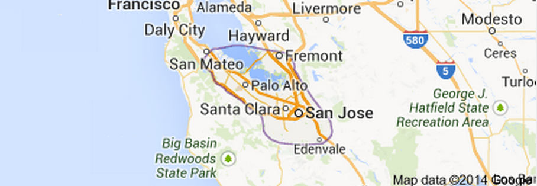

Space forms the central component of this study. Geographer John Wright has
argued that "places are best seen as shifting stages where the exercise of
power and resistance to it vie for dominance."[^cf14] Physical and conceptual
boundaries were drawn around competing landscapes in the Bay Area. These
boundaries encapsulated three landscapes: agriculture, high technology, and
urban growth and development. These intermixed landscapes placed unique but
concurrent pressures on natural resources in the Bay Area, introducing
ramifications not only at the local and state level but also the national
level. Although this study is tightly focused on a specific region, it has
greater bearing on understanding the inherent tension between local and
national politics and Americans' growing awareness of environmental issues. In
the Santa Clara Valley, the development of new landscapes, resulting from
various perceptions of the region as farmland, electronics manufacturer,
residential oasis, and natural beauty shaped the Valley's environment. Through
examining these three hybrid landscapes that express the different ways in
which people constructed different water use programs to fit human cultural
and economic needs, I argue the underlying and conflicting interconnectedness
of these landscapes shaped environmental, cultural, and political identities
and in the process exacted significant costs from the Bay Area's human and
natural ecology. The story told here stands at the intersections of
postindustrial society, environmental history, the spatial politics of
suburbanization and economic development, and the rise of environmental
politics.[^cf15]

Space shaped residents' social and political identities, but space was also
defined by residents and industrialists. The philosopher Henri Lefebvre noted
in the 1970s that societies produce space, challenging that space serves as a
vessel receiving meaning rather than a backdrop to historical events. We can
see how the imposition of space shapes cities as planners place down grids of
roads, zones, and regulations that divide cities along labor, leisure, and
consumption. The daily movement of people and capital---tourists, cyclists,
taxi drivers, commuters, freight---imbue neighborhoods and localities with
different meanings and give them specific senses of place.[^cf16]

The political and cultural story intertwines with a spatial story. The Santa
Clara Valley was the site of one of the nation's greatest modernizations of
urban space. More than 138,000 acres of farmland were paved over, built upon,
unearthed, or buried between 1940 and 1960, all in an effort to support an
expanding high tech industry and its rapidly growing workforce.[^cf17] The
residents of the Santa Clara Valley sought to improve the places in which they
lived and worked, and many of these projects were spatial: environmental
issues and environmental justice emerged from industrial pollution, storm
runoff, subsidence, suburban expansion, and traffic congestion within
different parts of the metropolis. Even ostensibly non-spatial politics were
embedded in local geography, and these spatial politics were intertwined with
environmental politics.

Space forms a critical understanding the history of Santa Clara Valley. Within
space, as Robert Self writes in his analysis of Oakland, people "competed to
put those resources to use to create particular and concrete places."[^cf18]
Space is not just an abstract consideration of a place, but rather is
historically concrete---the growth of suburban factories, residential and
commercial growth, and environmental politics all operated in space and place.
Historical actors and their spaces they operate in are inseparable. The
experiences of people, communities, and institutions take place in the very
fabric of life and space. The calls for urban reform, environmental concerns,
and critiques against industry did not take place abstractly; political actors
made specific demands about specific places. Space does not tell the entire
story, but overlooking space is to miss a significant part.[^cf19]

I argue to understand the Valley's relationship to environmental activism we
can examine three contested landscapes in the Bay Area: natural, suburban, and
industrial.[^cf20] Contests over the environment took place within these
competing and constructed landscapes in California. The Bay Area---indeed,
much of the American West---contains what Richard White has called "hybrid
landscapes" where cultural ideologies clash over conflicting uses of natural
resources. The hybrid landscape is not purely wild or built but instead a
construction of natural and cultural systems that shape and create
place.[^cf21] Places are defined by people constructing places for diverse
purposes. Landscapes are also a way of seeing the land, a perspective that
emphasizes aspects of geography that appeal to beauty, economy, or culture.
Landscapes are both physically and mentally constructed according to our
preferences and experiences. In turn, these expectations shape and reshape the
environment.[^cf22]

The grassroots approach of this work reveals that environmentalists often
cared less about political affiliations of Republican and Democrat but more
often cared about their identities as homeowners and taxpayers. Environmental
historians have often considered environmental history to be the domain of
Democratic politics, and environmental issues often laid at the feet of the
liberal political agenda. However, environmental politics between the 1950s
and the 1970s often belied political affiliations. Suburban residents
concerned with environmental issues were often unified in their vision of
aesthetics, health, protection of children, pollution, and toxics.

---

<!--
The emergence of environmental politics in the Bay Area emerged from the
confluence of three overlapping landscapes that came into conflict in the
postwar era. These three hybrid landscapes, three ways that cultural practices
framed and determined human interaction with the area's geography. Together,
these landscapes form the cultural underpinnings of environmental political
activity in the Bay Area. First, the Natural Landscape {EXPAND}. Second, the
Industrial Landscape {EXPAND}. Finally, the Urban Landscape {EXPAND}. Taken
together, these landscapes form a complex environmental map of their regional
construction, implementation in the American West, and efficacy in California.
-->

The Santa Clara Valley lies between two branches of the Coast Range mountains.
The Santa Cruz mountains to the west are covered in coastal redwoods that give
the mountains a green vail all year long. The Diablo Range to the east remains
dry and khaki brown for most of the year except during the short rainy season.
The Mediterranean climate of the Bay Area means the region receives little
rainfall outside the period between November and April. On average, the
semiarid Valley receives about fourteen inches of rain annually.[^cf26] The
Coastal Range shields the Santa Clara Valley from frosts and major storms, and
temperatures rarely drop below freezing or become excessively warm, although
conditions of droughts and excessive rainfall do occurr.[^cf27] The Santa
Clara Valley's climate, John Muir remarked when passing through in the spring
of 1872, was "the best we ever enjoyed."[^cf28]

Hydrologically, the area is crossed by several streams and rivers that snake
their way down the mountains. Historically, the majority of these water
sources never created deep channels, often forming shallow pathways that were
prone to flooding. Most mountain runoff quickly dissipated into well--drained
alluvial soil and replenished groundwater aquifers. Freshwater marshes,
seasonally--flooded meadows, forested wetlands, and riparian habitats were
common historical features on the valley landscape.[^cf29] In addition to
overland water sources, the valley is supplied by a regional aquifer that
consisted of multiple Pleistocene aquifers grouped into upper and lower
systems. These groundwater systems were replenished primarily through
precipitation, stream channels, and, today, by artificial recharge ponds. The
presence of rock faults also serve as potential sources and barriers of
hydrological flows.[^cf30] The Valley has few rivers coursing through it.
Twenty--six major creeks flow through the valley, and the major rivers flowing
through the Valley include the Arroyo Hondo, Guadalupe River, and Pajaro
River, which originate in the Santa Cruz or Diablo Range mountains and empty
into the Calaveras Reservoir, the San Francisco Bay, and the Pacific Ocean
respectively. A majority of the thirty--seven lakes that exist in Santa Clara
County are artificial or serve as reservoirs. Two major dam projects, the
Coyote Dam built in 1936 and the Anderson Dam built in 1950, began regulating
watershed discharge. Recent changes in vegetation and habitats came about due
to changes in stream hydrology that included flood control efforts and summer
water releases from groundwater recharge associated with the Coyote and
Anderson dams.[^cf31]

The valley hosted a variety of lifeforms. Along the valley floor, oak scrub,
cacti, and a variety of oak, willow, sycamore, and alder trees provided cover
for wildlife and shelters for native grasses. At higher elevations, a variety
of conifers including coastal redwoods (*Sequoia sempervirens*), ponderosa pine
(*pinus ponderosa*), sugar pine (*pinus lambertiana*) mingled with white fir
(*Abies concolor*) and black oak (*Quercus kelloggii*) that carpeted the mountains
in green. The plants of the Valley adapted to the Mediterranean climate:
perennial bunchgrasses die back every winter, leaving only roots to help
preserve water; oak trees have extensive root systems to tap into groundwater
supplies.[^cf32] The oak woodlands and chaparral ecoregions provided habitats
for acton woodpeckers, nuthatch, oak titmouse, and Pacific pallid bats. Major
waterways supported a diverse range of native fish species, including Pacific
lamprey (*Lampetra tridentata*), steelhead trout, chinook salmon, Sacramento
blackfish, and tule perch, among many others. Golden beavers and raccoons
shared the landscape with rabbits, squirrels, and other small species, as well
as a variety of snakes, lizards, spiders, and insects. Mountain lions, wolves,
and grizzly bears once hunted and lived in the valley, mingling with ungulates
such as elk and mule deer. Woodpeckers, wrentits, scrub jays, Chestnut-backed
Chickadees, and hundreds of additional bird species thrived in the Valley's
skies.

The agricultural landscape John Muir observed at the turn of the century was
just beginning to shift under the influence of American settlement.[^cf33] The exceptional
growing climate, fertile soil, and plentiful water from artesian wells allowed
farmers to transform the landscape into the fruit capital it would be known as
worldwide.[^cf34] The cultivation and processing of apricots, prunes, pears,
and cherries became staples on the horticulture landscape.[^cf35] Fruit trees
produced a canopy of pink and white blossoms along with orange California
poppies and other native wildflowers that bloomed on the hillsides. The
blooming seasons were popular early in the twentieth century as visitors
flocked to the area to behold the orchards in full bloom, along with
farmhouses, berry patches, vegetable gardens, and pastures.[^cf36] Little
wonder why the Santa Clara Valley boosters advertised the area as "nearest
Paradise" and "the best spot in the whole earth," a place where "the Eden of
vine and tree" was a "God-favored spot" and "God's favorite valley."[^cf37]

Cattle ranching, wheat and grain production, and quicksilver mining flourished
in the Valley in the nineteenth century prior to the Valley becoming "one vast
orchard."[^cf38] By the end of the ninetieth century, fruit production had
surpassed all other agricultural, mining, and timbering activity. The growth
of Silicon Valley occurred upon some of California's most fertile lands. A
survey by the U.S. Department of Agriculture designated 400 square
kilometers---32 percent---of Santa Clara County as Class 1 land, the highest
ranking possible for the cultivation of fruits and vegetables. Water systems
flowing into the valley carved out rich alluvial fans in the Valley. Below
topsoil loam---in some places measuring forty feet deep---are gravel and clay
freshwater aquifers, which nineteenth century farmers reached with artesian
wells that provided a consistent supply of fresh water.[^cf39] Santa Clara
Valley farms remained relatively small. In 1900, the typical farm was under
fifty acres; in 1920, the average farm size as forty acres and dropped to
thirty-two acres by 1950.[^cf40] Agricultural activity by the 1940s witnessed
around 6,000 farms in the Valley, mostly family--run operations, that totaled
around 132,000 acres and some eight million cherry, apricot, and pear
trees.[^cf41]

The Bay Area's mid-century environmentalists treated nature as a place of
pristine beauty and predominantly rural. When Wallace Stegner lamented the
disappearing beauty of "this brief Eden," it was the human-built agricultural
landscape he looked upon.[^cf42] Frequent charges were made against
urbanization as environmentalists ridiculed the spread of cities by a
juxtaposition of the city against country. The orchards, farmlands,
equestrianism, open space, green belts, ranching, and rolling hills were
"nature," and the spread of cities into these areas were affronts to their
sensibilities. Nature, to the Bay Area's environmentalists, was normative. In the
story below, we find traces of what people thought was natural. But the
various features of the landscape---bulldozers, acres of fruit trees, arid
climate, water---all have a role to play in Silicon Valley. We cannot begin to
understand this place's history without understanding its environmental
components.

The San Francisco Peninsula followed---and in some ways led---the nation's
shift in population moving westward. The location of World War II military
facilities drew millions to the Far West. But it also followed another wartime
trend---the militarization of industry. The twentieth-century American West,
according to Kevin Fernlund, "bristled with airfields, army bases, naval
yards, marine camps, missile fields, nuclear test sites, proving grounds,
bombing ranges, weapons plants, military reservations, training schools, toxic
waste dumps, strategic mines, transportation routes, lines of communication,
laboratories, command centers, and arsenals." The burgeoning industrial and
military landscape in the West demanded a population to support it. California
alone accounted for the most dramatic increase in population due to the
militarization of its economy.[^cf43]

Postwar prosperity encouraged widespread growth across the country. By the
1950s many American cities experienced widespread growth, but what was
initially seen as a fulfillment of the American dream of homeownership became
viewed as an environmental disaster. Critics took aim at suburban growth and
environmental destruction, and nowhere was this change more obvious than in
the West. Metropolitan growth doubled the population in the region between
1940 and 1960. By the 1980s, the region was among the fastest growing in the
nation.[^cf44] Many westerners were unsettled by population growth, and raised
concerns about the disappearance of rural landscapes being replaced by
sprawl.[^cf45] Western political leaders such as Oregon Governor Thomas McCall
condemned what he called "sagebrush suburbs" and sought limits on urban growth
in the state. Anti--growth and environmental sentiments lay behind Bay Area
residents placing new limits on urban growth and condemning boosters that
supported plans for urban expansion.

The Bay Area witnessed some of the most dramatic urban growth. During the
1940s, Santa Clara County experienced 66% growth in population, compared to a
California wide growth of 53%. By the 1950s those figures surged upward; the
population increased 121% in Santa Clara County compared to 49% statewide.
Subdivisions sprang up to accommodate the influx of new residents. Most of
these new subdivisions were located beyond existing city boundaries in
unincorporated areas. Between 1945 and 1950 county farmland decreased from
727,000 acres to 589,000---a reduction of 81%.[^cf46] During that same period,
Bay Area cities engaged in rapid annexations. San Jose annexed land thirty-two
times between 1945 and 1950. During the same period, the City of Santa Clara
annexed only four tracts, but in 1951 annexed six tracts and another nine in
1952. Santa Clara added 50 acres to the city in two years. In the same two
year period, San Jose annexed sixteen parcels that totaled over 1000
acres.[^cf47] Between 1945 and 1970, San Jose approved over 1,400 annexations
and expanded the city's footprint from fifteen square miles to 135 square
miles. The city's land area expanded by 900 percent.[^cf48]

Populations surged simultaneously with industrial development. The combination
of defense industries, electronics research and development contracts, Cold
War defense agendas, abundant and inexpensive land, and cities willing and
able to support the rapid expansion of city infrastructure welcomed the
arrival of new industries. Industrial development began in the 1940s when the
National Advisory Committee on Aeronautics started construction of the Ames
Research Laboratory new Moffett Airfield. Stanford University leased its large
land holdings to industrial entrepreneurs and researchers who were active in
developing electronics equipment for military purposes. In just five years
after the end of World War II, fifty new electronics industries began in the
Valley. International Business Machines (IBM) established a card printing
plant in 1948 in San Jose, and Russell and Sigurd Varian, inventors of the
klystron tube, founded Varian Associates to manufacture devices.[^cf49] Other
industrial developers founded their companies on what would become the
Stanford Industrial Park in the late 1950s.

Such Industrial development was widely welcomed and considered a preferred
alternative to the dirty industry of the Northeast and Midwest. The
so-considered "clean" industries held the appearance of suburban areas with
broad lawns, trees, low-rise buildings, and hidden parking lots. Thanks to
strict building guidelines laid out by Stanford University as well as city
regulations on new construction, new high technology industries appeared more
like a college campus than an industrial manufacturer or research center. But
the promise of clean industry proved elusive as smog, radiation, water
contamination, intense energy and water usage, traffic congestion, and rising
housing and utility costs became common features of living in the Valley.

The costs of this negligence became most obvious in the 1980s, when cancer
clusters and birth defects emerged among residents in San Jose. Investigators
traced the source of the illnesses back to Fairchild Camera and Instrument
Company, whose solvents waste storage tanks had leaked 60,000 gallons of
solvent toxics into groundwater supplies.[^cf50] The water in the aquifers
remain unusable today. Santa Clara County currently has the highest count of
Superfund sites of any other county in the United States, amounting to
twenty--five locations requiring long--term cleanup of hazardous materials. The
majority of superfund sites resulted from high--tech firms in the Valley.

---

Writing about environmental politics in the Bay Area also offers us ways to
think about local politics. It might, as Richard Hofstadter once said, have
"something to say that might help us."[^cf51] The story here is, ultimately,
about the practice of politics in postwar America. Around kitchen tables,
within ad hoc coalitions, in letter campaigns and newspaper editorials, people
talked about the changing environment around them. Amenities and cultural
ideals about the Bay Area---climate, atmosphere, suburban, middle-class---had
attracted newcomers and delighted old--timers. But the rise of industry, the
influx of new residents, the explosion of suburban development, and the
devastation of orchards led both groups to question what sort of changes they
were welcoming to the Valley. Some of these organizations were short-lived,
such as the Citizens Committee on Regional Planning or United Palo Altans,
while others existed much longer to continue influencing California politics,
such as California Tomorrow and the Committee for Green Foothills. These
environmental organizations emerged directly from environmental changes
occurring in Silicon Valley.

Simultaneously, entrepreneurs, urban planners, university administrators, and
city leaders offered an alternative vision to the landscape: one that was
increasingly urban and industrial rather than rural and agricultural. Often
times support for growth was couched in the language of national defense: Cold
War defense spending poured into Stanford University, for example, which
eagerly sought out military contracts in research and development. Stanford
administrators responded to citizens critiques of land development programs by
dismissing their concerns as less important than national defense concerns.
Unrestricted urban growth and economic development characterized much of Santa
Clara Valley in the latter half of the twentieth century. California voters
became increasingly aware of the environmental considerations urban growth and
industrial development had for the region, leading to political activism, new
environmental regulation laws, and community referendums. Furthermore,
environmental groups criticized high technology firms and city leaders for
their ignorance of ecological negligence.[^cf52]

---

The research is undergirded by digital history methods, in particular the
project seeks to utilize textual analysis and spatial analysis to more deeply
understand the political, cultural, and environmental issues at stake.
My own thinking in digital methods has been deeply influenced by my time as a
graduate student at the University of Nebraska--Lincoln and working as the
Academic Technology Specialist and affiliated staff at the Center for Spatial
and Textual Analysis at Stanford University. People at both institutions
taught me to think prudently about digital research methods, to think deeply
about uncertainty and complexity in humanistic data, and the problems that
attend these issues when visualizing and digitally analyzing historical
evidence.

Visualizations offer opportunities for provocation.  Digital history and the
visualization of historical evidence, according to Richard White, is deeply
scholarly. White notes that

> Visualization and spatial history are not about producing illustrations or
> maps to communicate things that you have discovered by other means. It is a
> means of doing research; it generates questions that might otherwise go
> unasked, it reveals historical relations that might otherwise go unnoticed,
> and it undermines, or substantiates, stories upon which we build our own
> versions of the past.[^cf53]

Much of the data collected for this project exists online, as do various
visualizations and analysis tools. I strongly encourage readers to consult the
digital methods in addition to the text, or otherwise miss significant parts
of the story. [These are coming soon.]

---

Silicon Valley has become a cultural center in the United States; the wealth,
political influence, environmental precedence, and place in the American
imagination has led the Valley to take on an almost mystical quality in
American life. Cities and universities across the country and across the world
try and mimic the success of Silicon Valley and Stanford University. The
Valley is synonymous with the technology industry, an industry that has taken
on ever increasing importance to the nation's economy. Ideals about Silicon
Valley are embedded in cultural and institutional arenas in America. Observers
talk about "life hacks" or are pursuing ways to "disrupt higher education." By
asking new questions of the Valley's history, this work's digital component
seeks to probe the public to think more about Silicon Valley and its attendant
costs.

The history is also about the history that Silicon Valley has inherited. The 
Valley often thinks of itself as outside of history---always looking to the 
future, at the forefront of change and progress. But the organization and 
imagination of Silicon Valley---its landscape, its space, its 
relationships---are inseparable from its past. People here live with its 
history daily. We must recognize how desires for beauty, nature, and pleasure 
shape our spatial history, landscape, and nostalgia are embodied in cities.  
Landscapes, the novelist Italo Calvino reminds us in *Invisible Cities*, are 
"like lines on a hand, wirtten in the corners of the streets and the gratings 
of the buildings."^[Italo Calvino, *Invisible Cities*, trans. (New York: 
Harcourt Brace and Company, 1974), 11.] Cities and the nature that surrounds 
them, that is embedded in them, are reflections of our desires. To build 
better cities and protect nature reflect the ways we make landscapes match our 
aspirations. 

[^cf1]: Yi--Fu Tuan, *Space and Place: The Perspective of Experience* (Minneapolis: University of Minnesota Press, 1997): 200--201.

[^cf2]: Leo Marx, ``The Idea of Nature in America," *Daedulus* 137:2 (Spring 2008): 9.

[^cf3]: Wallace Stegner, "The Clouded Skies of Lotus Land," *St. Louis
Post-Dispatch*, September 26, 1965, quoted in Friedly, ``This Brief Eden: A
History of Landscape Change in California's Santa Clara Valley," Ph.D.
dissertation (Duke University, 2000), 5. Stegner's novel *All the Little Live
Things*, was written based on the Valley. The novel's character, Joe Allston,
lamented the bulldozers, subdivisions, and scars that cut into the Earth.
Remarking on the work of the fiction's land developer, Allston remarked that
the hills were "mutilated and ruined" and "only a land butcher could have
proposed and carried it out. . . . There would be no restoring what he had
ruined. It reminded me too painfully; it made me sick to look." Stegner, *The
Little Live Things*, (New York: Viking, 1967), pp. 14--15.

[^cf4]: Jackson J. Benson, *Wallace Stegner: His Life and Work* (New York:
Viking, 1996), xii. See also Friedly, "This Brief Eden," 4--5.

[^cf5]: Quoted in @findlay1993magic, 130.

[^cf6]: Terman, quoted in @findlay1993magic, 141.

[^cf7]: On the rise of the modern environmental movement, see @hays1987beauty,
13--19; @rothman2000saving, 131--159; @steinberg2002earth, 239--261;
@opie1998nature, 404--433.

[^cf8]: @jackson1985crabgrass, 3.

[^cf10]: @findlay1993magic, 117--159; @omara2005cities; @saxenian1996regional.

[^cf11]: Michael S. Malone, *The Valley of Heart's Delight: A Silicon Valley
Notebook, 1963--2001* (New York: John Wiley & Sons, 2002); Michael Malone,
*Betting It All: The Entrepeurners of Technology* (New York: Wiley, 2001);
Malone, *Bill & Dave: How Hewlett and Packard Built the World's Greatest
Company* (New York: Portfolio, 2007); Robert Cringely, *Accidental Empires:
How the Boys of Silicon Valley Made Their Millions, Battle Foreign
Competition, and Still Can't Get a Date* (New York: HarperBusiness, 1996);
James Wallace, *Hard Drive: Bill Gates and the Making of the Microsoft Empire*
(New York: HarperBusiness, 1993); David A. Kaplan, *The Silicon Boys: And
Their Valley of Dreams* (New York: William Morrow, 2000); Leslie R. Berlin,
"Robert Noyce and Fairchild Semiconductor, 157--1968," *Business History
Review* (Spring 2001): 63--100. Very few of these books address issues of
women or gender, often reflected in the book titles. On the centrality of
women and gender in the history of computing, see Nathan L. Ensmenger, *The
Computer Boys Take Over: Computers, Programmers, and the Politics of Technical
Expertise* (Cambridge: MIT Press, 2010); David Alan Grier, *When Computers
Were Human* (Princeton: Princeton University Press, 2005).

[^cf12]: @walker2007countrycity, 3.

[^cf13]: I am not alone in suggesting the Bay Area anticipated the broader
environmental movement. Historian Margaret O'Mara has noted that the Bay Area
became "home to some of the environmental movement's most important early
battles and precedent--setting land--use planning measures." @omara2005cities, 139.

[^cf14]: John B. Wright, "Land Tenure: The Spatial Musculature of the American West," in *Western Places, American Myths: How We Think About the West*, ed. Gary J. Hausladen, 85.

[^cf15]: In his classic work, *Coming of the Post-Industrial Society*,
sociologist Daniel Bell argued that the shift from a goods--producing economy
to a service--based economy, the rise of a professional and technical class,
the centrality of knowledge as the source of innovation, and the creation of
intellectual technology embodied the postindustrial economy. Economic
well--being was measured by quality of life measured by services and amenities
rather than the quality of goods. Historian Hal Rothman, economist Thomas
Michael Power, and geographer William Wyckoff have explored the larger
ramifications of this shift in the American West. See @bell1999coming, 14;
@rothman1997devils, 17; @power1996landscapes; @wyckoff1995postindustrial.

[^cf16]: Henri Lefebvre, *The Production of Space*, trans. Donald
Nicholson-Smith (Wiley--Blackwell, 1991). The works on the production of space
is vast. Among the most influential works include David Harvey, *Social
Justice and the City* (Johns Hopkins University Press, 1973); Doreen Massey,
*Spatial Divisions of Labor* (Routledge, 1984); Neil Smith, *Uneven
Development: Nature, Capital, and the Production of Space* (Blackwell, 1984);
Edward W. Soja, *Postmodern Geographies: The Reassertion of Space in Critical
Social Theory* (Verso, 1989); Yi-Fu Tuan, *Space and Place: The Perspective of
Experience* (University Of Minnesota Press, 1977); Michel de Certeau, *The
Practice of Everyday Life* (University of California Press, 1984); Edward
Casey, *The Fate of Place: A Philosophical History* (University of California
Press, 1997). For introductions to the concept of place, see John A. Agnew and
James S. Duncan, eds., *The Power of Place: Bringing Together Geographical and
Sociological Imaginations* (Unwin Hyman, 1989); Cameron Blevins, "Space,
Nation, and Triumph of Region: A View of the World from Houston," *Journal of
American History* (June 2014).

[^cf17]: @conard1985green: 5.

[^cf18]: @self2003babylon, 17.

[^cf19]: @self2003babylon, 17.

[^cf20]: I am borrowing the idea of overlapping landscapes from Leisl
Carr-Childers. She uses four overlapping landscapes---wild horse,
military-nuclear, ranch, and outdoor recreation---to understand land--use
conflicts and debates over the equitable use of western public lands in the
Great Basin. See Carr-Childers, "The Size of the Risk: An Environmental
History of the Nuclear Great Basin," Ph.D. Dissertation, University of
Nevada--Las Vegas, 2011.

[^cf21]: Richard White, "From Wilderness to Hybrid Landscapes," *The
Historian* 66 (September 2004): 562--664. In surveying the trends in
environmental history, Richard White reviewed the works of several
environmental historians including Josephy Taylor, Mark Fiege, Nancy Langston,
and William DeBuys, who reject any hard division between culture and natural.
Instead, they examine how forces shape and inform landscapes. Kenneth Olwig
has argued that landscape is substantive, where "environment, economics, law,
and culture are all important," and symbolic, "to be perceived, read, and
interpreted on the ground, in written texts, and through artistic images."
Carl Sauer, "The Morphology of Landscape," in *The Cultural Geography Reader*,
eds. Timothy S. Oakes and Patricia L. Price, p. 100; Kenneth R. Olwig,
"Recovering the Substantive Nature of Landscape," *Annals of the Association
of American Geographers* (December 1996): 645; Donald Meinig, "The
Interpretation of Ordinary Landscapes," in *The Beholding Eye: Ten Versions of
the Same Scene*, ed. Donald Meinig, pp. 43--45; Keith H. Basso, *Wisdom Sits
in Places*, p. 110. William Cronon has argued the same phenomenon happens when
Americans construct and then preserve wilderness to suit ideas of sublime
nature while disregarding less--striking landscapes. See William Cronon, "The
Trouble with Wilderness; or, Getting Back to the Wrong Nature," in *Uncommon
Ground: Rethinking the Human Place in Nature*, ed. Cronon, (New York: Norton,
1996), 69--90.

[^cf22]: Nature, Richard White notes, "is at once a physical setting where
living beings exist in complex relationships with each other, and a human
invention. Humans create a shifting set of cultural concepts about the
physical world and identify these concepts as nature." White, "American
Environmental History: The Development of a New Historical Field," *Pacific
Historical Review* 54 (August 1985): 297–335.

[^cf23]: @conard1985green: 5.

[^cf24]: @self2003babylon, 17.

[^cf25]: @self2003babylon, 17.

[^cf26]: "Water made the orchards, silicon chip industry sprout faster," *San
Jose Mercury*, December 22, 1999.

[^cf27]: Friedly, "This Brief Eden," 20.

[^cf28]: John Muir, *John Muir: His Life and Letters and Other Writings*, ed.
Terry Gifford (Seattle: Mountaineers, 1996), 96.

[^cf29]: Robin M. Grossinger et al., "Historical Landscape Ecology of an
Urbanized California Valley: Wetlands and Woodlands in the Santa Clara
Valley," *Landscape Ecology* 22 (December 1, 2007): 110–-115.

[^cf30]: R. T. Hanson, Zhen Li, and C. Faunt, *Documentation of the Santa
Clara Valley Regional Ground-Water Surface-Water Flow Model*, Santa Clara
County, California. U.S. Geological Survey Scientific Investigations Report
2004--5231. (Reston, VA: U.S. Geological Survey, 2004).

[^cf31]: L. McKee, J. Leatherbarrow, S. Pearce, and J. Davis, "A Review of 
Urban Runoff Processes in the Bay Area: Existing Knowledge, Conceptual Models, 
and Monitoring Recommendations," SFEI Contribution 66 (Oakland: San Francisco 
Estuary Institute, 2003); Robin M. Grossinger et al., "Historical Landscape 
Ecology of an Urbanized California Valley: Wetlands and Woodlands in the Santa 
Clara Valley," *Landscape Ecology* 22 (December 1, 2007): 110–115.

[^cf32]: Friedly, "This Brief Eden," 20.

[^cf33]: Muir notes the appearance of orchards, wheat fields, vineyards, and 
alfalfa meadows. Muir, *John Muir*, 96.

[^cf34]: By the 1920s, Santa Clara Valley led the state in fruit production, drying, canning, and packing, providing a range of products such as cherries, prunes, apricots, pears, peaches, plums, and apples. By 1930, Santa Clara County produced between one-third to one-half of the world's prune supply. Glenna Matthews, *Silicon Valley, Women, and the California Dream: Gender, Class, and Opportunity in the Twentieth Century* (Stanford: Stanford University Press, 2002), 18; Cecilia Tsu, *Garden of the World*, 17.

[^cf35]: Edward N. Torbert, "The Specialized Commercial Agriculture of the Northern Santa Clara Valley," *Geographical Review* 26 (April 1936): 247–-263.

[^cf36]: Edith Brockway, *San Jose Reflections: An Illustrated History of San Jose, California and Some of Surrounding Area* (Campbell, Calif.: Academy Press, 1977), 132--133.

[^cf37]: Quotes from Tsu, *Garden of the World*, 3--4. *Picturesque San Jose and Environments: An Illustrated Statement of the Progress, Prosperity, and Resources of Santa Clara County, California* (San Jose: H. S. Foote and C. A. Woolfolk, 1893), n.p.; *The Progressive City Beautiful: Santa Clara* (Santa Clara Chamber of Commerce, n.d.); E. Alexander Powell, "The Valley of Heart's Delight," *Sunset* 29 (August 1912), 120.

[^cf38]: Quoted in Tsu, *Garden of the World*, 17.

[^cf39]: Aaron Sachs, "Virtual Ecology," *World Watch*, 15.

[^cf40]: Tsu, *Garden of the World*, 6.

[^cf41]: Sachs, "Virtual Ecology," 16.

[^cf42]: Stegner quoted in Friedly, "This Brief Eden," 8.

[^cf43]: Roger Lotchin notes that cities in California had already acquired a long history of military development prior to World War II. Every port city along the California coast had a naval, army, and air bases before the start of World War II. Militarization was a fundamental component to California's major cities. This was also true of Seattle. Lotchin, *Martial Metropolis*, 223--232; Lotchin, *Fortress California*, 1--2; Greg Hise, *Magnetic Los Angeles*, 117--120; Matthew Klingle, *Emerald City*, 205--211.

[^cf44]: On environmental concerns over suburbanization see Kenneth T. Jackson, *Crabgrass Frontier*; Adam Rome, *Bulldozer in the Countryside*.

[^cf45]: On the emergence of sprawl in the Bay Area, see Richard A. Walker and Matthew J. Williams, "Water from Power," *Economic Geography*, 95--119; O'Mara, *Cities of Knowledge*, pp. 57--94.

[^cf46]: Conard, "Green Gold," 6.

[^cf47]: Conard, "Green Gold," 6.

[^cf48]: Cavin, "Borders of Citizenship," 231; Matthews, "The Los Angeles of the North: San Jose's Transition from Fruit Capital to High-Tech Metropolis"; Matthews, *Silicon Valley, Women, and the California Dream*, 7; Trounstine and Christensen, *Movers and Shakers*, 93; "Annexations by Year"; "City Size by Year," 2011, City of San Jose Planning Division.

[^cf49]: Conard, "Green Gold," 5.

[^cf50]: Local and federal studies discovered that trichloroethane, a common industrial solvent used in the cleaning of semiconductor parts, was leaking out of storage takes and into groundwater. The problem was not limited to Fairchild; other high technology manufacturers had similar issues. Health effects of consuming the contaminated water ranges from liver and kidney damage, skin rashes, birth defects, and cancer. "U.S. to Study Pollution in High--Technology Area," *New York Times*, October 30, 1983, p. 33. For a summary of the history regarding groundwater contamination, see Craig E. Colten, "A Historical Perspective on Industrial Wastes and Groundwater Contamination," *Geographical Review* 81 (April 1991): 218--223.

[^cf51]: Hofstadter quoted in Christopher Lasch, "Consensus: An Academic Question," *Journal of American History* 76 (September 1989): 458.

[^cf52]: On the rise of the modern environmental movement, see Samuel P. Hays, *Beauty, Health, and Permanence: Environmental Politics in the United States*, 1955--1985 (Cambridge: Cambridge University Press, 1987), 13--19; Hal Rothman, *Saving the Planet*, 131--159; Ted Steinberg, *Down to Earth*, 239--261; John Opie, *Nature's Nation*, 404--433.

[^cf53]: Richard White, "What is Spatial History?" Spatial History Project
<http://www.stanford.edu/group/spatialhistory/cgi-bin/site/pub.php?id=29>.
